# `3D` 图形和 `OpenGL` 简介

+ 简单介绍计算机图形的历史

+ 如何在 `2D` 屏幕上创建 `3D` 图形

+ 基本的 `3D` 效果和术语

+ `3D` 坐标系统和视口的工作原理

+ 什么是顶点以及如何使用

+ 不同类型的 `3D` 投影

&emsp;&emsp;本书讲述的是 `OpenGL` ,这是一种用于创建实时 `3D` 图像的编程接口。在讨论 `OpenGL` 究竟是什么以及它的工作方式之前,读者至少应该在一个比较高的层次上对实时 `3D` 图形有一个基本的了解。也许读者已经对实时 `3D` 的原则有了较深的理解,阅读本书的目的只是为了学习如何使用 `OpenGL` 。如果是这样的话,那就太好了,请直接跳到第 `2` 章。但是,如果读者购买本书的原因是觉得这本书中的图片非常酷,并且希望学会如何在自己的 `PC` 中创建这样的图片,那么很可能需要从本章开始认真学习。

&nbsp;

## 1.1 计算机图形的简单历史回顾

&emsp;&emsp;最早的计算机是由一行行的开关和灯组成的。技术人员和工程师需要工作几个小时、几天甚至几星期,对这些机器进行编程,并阅读它们的计算结果。发光灯泡所组成的各种模式向计算机用户传达有用的信息。此外,计算机或许还可能产生一些原始的打印信息。读者可以认为计算机图形的最初形式就是在一块面板上闪烁的灯(早期编写程序的程序员流传的一些故事似乎也映证了这个想法,他们所编写的程序除了追踪灯光、创建各种闪烁模式之外，就几乎没有其他用途了!)。

&emsp;&emsp;随着时间的变迁,这一切逐渐发生了变化。最初所谓的那些 “思考机器” 发展为完全可编程的设备,使用一种类似电传打字机的机制在纸卷上进行打印。数据可以有效地存储在磁带、磁盘上,甚至可以一行行地存储在打孔纸上,或者存储在一堆穿孔卡上。计算机图形诞生于计算机最初开始能够打印的日子。由于字母表中的每个字符都有固定的大小和形状,上世纪70年代的那些富有创造力的程序员仅仅利用星号( `*` )就创建了许多艺术图案和图像。

> 1.1.1 进入电子时代

&emsp;&emsp;纸作为计算机的输出媒体非常实用,直到今天仍然是主要的输出媒体之一。激光打印机和彩色喷墨打印机已经取代了原始的 `ASCII` 艺术,它们具有鲜活的表现质量和近乎照片般的艺术再现能力。但是,作为常规的显示媒体,纸可能显得过于昂贵了。一直用纸作为输出媒体会浪费自然资源,尤其在绝大多数情况下,我们实际上并不需要对计算结果或数据库查询进行硬复制的输出。

&emsp;&emsp;作为计算机的一种辅助设备,阴级射线管( `CRT` )是一项震撼人心的技术。作为最初的计算机监视器，`CRT` 一开始只是一种显示 `ASCII` 文本的视频终端，就像最初的纸终端一样。但是，`CRT` 能够完美地绘制点和线,以及字母字符。不久,其他符号和图形陆续补充到字符终端。程序员使用计算机和监视器创建图形,作为文本或表格输出的补充。首先,一些用于绘制直线和曲线的算法被开发出来,并且公布于众。于是，计算机图形逐渐从一项业余爱好变成了一门科学。
    
&emsp;&emsp;最初，显示在这些终端上的计算机图形是二维的，或简称为 `2D` 。人们用平面的直线、圆和多边形来创建各种各样的图形。图形可以用一种表格或数字无法实现的方式显示科学或统计数据。那些富有探索精神的程序员甚至创建了一些简单的街机游戏( `Arcade Game` )，如 `Lunar Lander` 和 `Pong` 。它们所使用的简单图形就是由各种线型所绘制的，并且每秒刷新数次(重绘)。

&emsp;&emsp;实时( `Real-Time` )这个术语最初应用于那些活动的计算机图形。在计算机科学中,这个术语更为广泛的含义是指计算机能够即时对输入进行处理。例如，人与人之间通过电话交谈就是一种实时活动。当你说话的时候，对方立即就能听到，并随即做出回答，然后又允许你立即做出响应，接下来循环往复。在现实中,由于电流的缘故,通话实际上存在延迟。但对通话者而言,这种延迟通常是感觉不到的。与电话相反，写信显然不是一种实时活动。

&emsp;&emsp;把实时这个术语应用到计算机图形中意味着计算机对诸如操作杆活动、击键等输入事件直接做出响应,产生动画或图像序列。实时计算机图形可以显示一种波形,由电子设备、数值读出器、交互性游戏和视觉模拟程序进行测量。

> 1.1.2 走向 `3D`

&emsp;&emsp;三维(或 `3D` )这个术语表示一个正在描述或显示的物体具有 `3` 个维度：宽度、高度和深度。例如，放在书桌上的一张纸(上面画了一些图形或写了一些字)是个二维物体,因为它没有可以令人感觉得到的深度。但是,放在它旁边的一罐苏打水却是个三维物体。这个苏打饮料罐又圆(宽度和高度)又长(深度)。根据观察点,我们可以把这个罐的任何一边作为宽度或高度,但这个罐头是个三维物体的本质并不会改变。图 `1.1` 所示显示了可以怎样测量这个罐头和这张纸的各个维度。

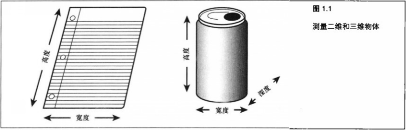

&emsp;&emsp;几个世纪以来,艺术家已经知道如何让一幅画看上去具有真实的深度。从本质上说,画本身是个二维物体，因为它只是用颜料在二维的画布上所创作的作品而已。类似地，计算机 `3D` 图形在实质上也是平面的,它只是在计算机屏幕上所显示的二维图像,但它可以提供深度(或第 `3` 维)的错觉。

&emsp;&emsp;**2D + 透视 = 3D**

&emsp;&emsp;毫无疑问,最初的计算机图形看上去类似于图 `1.2` 所示图形,我们可以看到 `12` 条线段组成了一个简单的三维立方体。使这个立方体看上去具有三维效果的是透视( `Perspective` ),或线段之间的角度。正是它们产生了深度的幻觉。

&emsp;&emsp;为了真正看到 `3D` 图像，实际上需要用两个眼睛观察一个物体，或者为每只眼睛分别提供这个物体的一幅独立而又唯一的图像。如图 `1.3` 所示,每只眼睛看到的都是一幅二维图像，非常类似于在每个视网膜(位于眼睛的后半部分)上显示了一幅临时照片。随后,大脑对这两幅略微不同的图像进行组合,在脑海中形成一幅单一的、合成的 `3D` 图片。

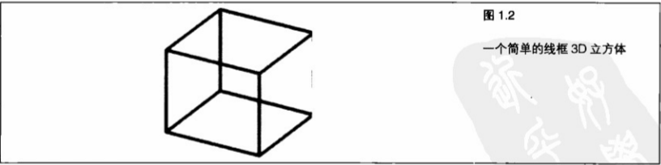

在图 `1.3` 中，随着物体逐渐变远，图像之间的角度也越来越小。我们可以通过加大两幅图像之间的角度来增强 `3D` 效果。立体单片(一种手持式立体镜片,在小时候可能玩过)和 `3D` 电影利用了这种效应,在每只眼睛上放置一块单独的镜片或者戴上一幅滤色眼镜，将两幅层次不一的图像分离。这些图像通常进行了过度增强,以取得某种戏剧性的效果或影院效果。图像卡上的快门玻璃和软件会在两只眼睛之间进行图像切换,在每只眼睛上显示变化的透视效果,从而产生了“真正”的立体 `3D` 体验。遗憾的是,许多人抱怨这个效果令他们头痛，或者令他们感到头晕目眩。

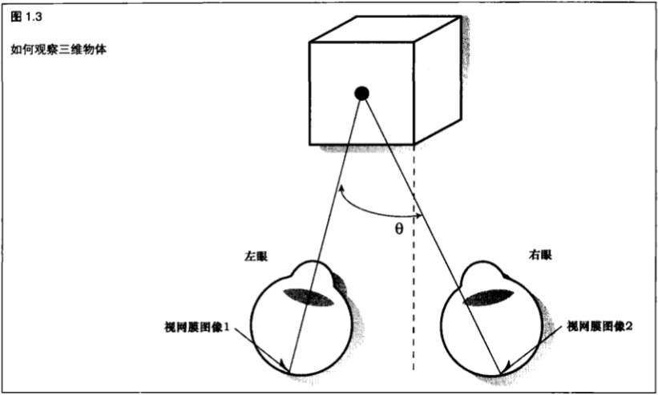

&emsp;&emsp;计算机屏幕是在平面上显示平面图像，而不是通过不同的视角在两只眼睛上显示两幅图像。这样一来，绝大多数 `3D` 计算机图像实际上只是近似 `3D` 。这种近似效果和多年来画家在绘画作品中实现视觉深度所使用的手法是一样的,就像人们用一只眼睛也能够观察到 `3D` 效果一样。

&emsp;&emsp;在生活中，读者可能已经注意到，当遮住一只眼睛时，所看到的世界并不会立即变成平面！当我们遮住一只眼睛时会发生什么呢?我们可能觉得自己看到的仍然是 `3D` 世界。但是,请尝试下面这个试验:把一只玻璃杯(或其他物体)放在一臂之外的地方,靠左手一侧(如果放得很近,这个戏法就不灵了)，用右手遮住右眼,然后用左手去摸这只杯子(可能最好换用空的塑料杯)。注意,在摸到这个杯子之前,我们会觉得估计这个杯子的距离显得比较困难。现在,放开右眼,然后再去触摸这个杯子,我们就会发现这次判断杯子的距离要容易得多。现在,我们应该能够明白为什么只有一只眼睛的人在感知距离时常常会遇到困难了。

&emsp;&emsp;单凭透视本身就足以创建三维的外观。注意前面图 `1.2` 所显示的那个立方体。即使不进行着色，这个立方体仍然具有三维物体的外观。但是,如果长时间凝视这个立方体,就会发觉这个立方体的前后将会交换位置。由于图中缺少任何表面着色，大脑将会因此而产生混淆的感觉。这幅图不能提供足够的信息以帮助大脑确定它到底感知到了什么。我们遮住一只眼睛时所看到的世界没有突然看起来像平的,原因在于以二维形式观察时,很多 `3D` 世界的效果仍然存在。这些效果足以激发大脑辨别深度的能力。其中一个线索是由光线照射产生的表面着色，而另一个线索则是近处的物体看起来比远处的物体要大。这种透视效果称为透视缩短( `Foreshortening` )。这种效果加上颜色的改变、纹理、光照、着色以及各种不同的颜色强度共同组成了我们对三维图像的感知。

&nbsp;

## 1.2 3D 图形技术和术语

&emsp;&emsp;本书的每一章都包含一个或多个示例程序用来演示这一章所讨论的编程技术。尽管本章有意避免了关于编程细节的讨论,但仍提供了一个示例程序向读者演示最低程度上需要熟悉的技术和术语,以帮助读者充分地利用本书。本章的示例程序叫做 `BLOCK` ，读者可以从随书提供的示例程序集中的 " `Chapter 1` ” 文件夹中找到它。

&emsp;&emsp;将数学和图形数据转换成3D空间图像的操作叫做渲染( `Rendering` )。当这个术语作为动词使用时,指的是计算机创建三维图像时所经历的过程。它也作为名词使用,指的仅仅是最终的图像作品。这个术语在本书中会经常出现。现在我们来看一看渲染过程中出现的其他一些属于和操作。

> 1.2.1 变换 ( `Transform` ) 和投影 ( `Projection` )

&emsp;&emsp;图 `1.4` 所示是 `BLOCK` 示例程序的原始输出结果,显示的是用线条绘制的一个放置在一张桌子或一个平面上的立方体。通过变换( `Transformation` )，或者说旋转这些点，并在它们之间绘制线段，我们就能在平面的 `2D` 屏幕上创造出一个 `3D` 世界的错觉。早期的飞行模拟器所使用的技术不过如此。

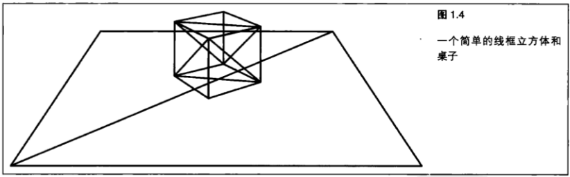

&emsp;&emsp;这些点本身叫做顶点( `Vertices` ，单数为 `Vertex` )，它们能够通过一种称为变换矩阵( `Transformation Matrix` )的数学结构进行旋转(本书第 `4` 章将详细讲解变换矩阵相关内容)。另外还有一种矩阵叫做投影矩阵( `Projection Matrix` ),用于将 `3D` 坐标转换成二维屏幕坐标,实际的线条也将在二维屏幕坐标上进行绘制。

> 1.2.2 光栅化( `Rasterization` )

&emsp;&emsp;实际绘制或填充每个顶点之间的像素形成线段就叫做光栅化( `Rasterization` )。我们可以通过隐藏表面消除( `Hidden Surface Removal` ) 来进一步澄清 `3D` 设计意图。图 `1.5` 所示显示了在 `BLOCK` 示例程序第一次按空格键后的输出。虽然使用的仍然是点和线段，但是一个放置在桌面上的正方形的错觉却更加逼真了。

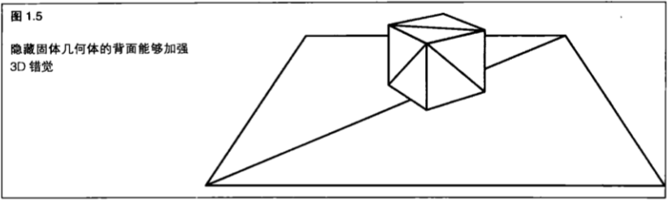

&emsp;&emsp;虽然用线段绘图【也称做线框渲染( `Wireframe Rendering` )】也有它的用处，但在大多数情况下我们并不是用线段,而是用实心三角形进行渲染。像线段一样,三角形和多边形也会被光栅化或填充。早期的图形硬件能够用纯色对三角形进行填充,但正如图 `1.6` 所示的那样,这样做并不能增强 `3D` 错觉。早期的游戏和模拟技术可能会在相邻的多边形上采用不同的纯色,这确实有所帮助,但却不能令人信服地对现实进行模拟。

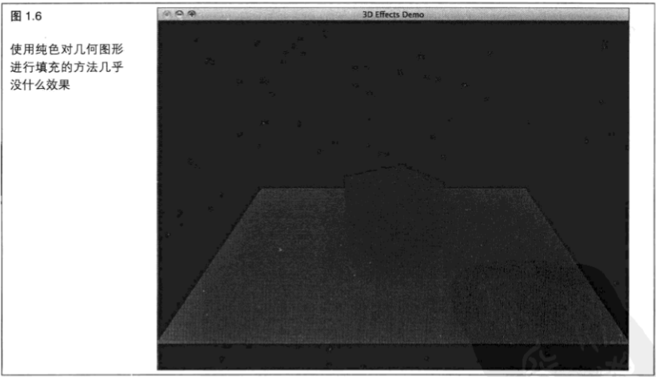

&nbsp;

> 1.2.3 着色

&emsp;&emsp;在图 `1.7` 中展示了着色( `Shading` )的效果。通过沿着表面改变颜色值，能够轻松创建光线照射在一个红色立方体上的效果。

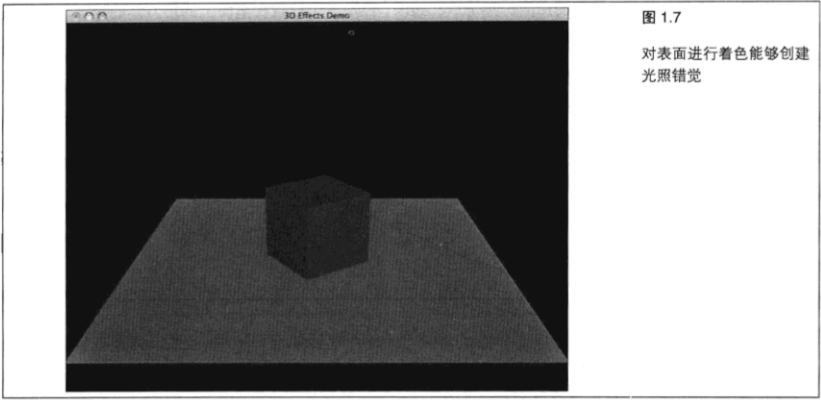

&emsp;&emsp;光照和着色在 `3D` 图形专业领域占据了非常大的比重，并且有专门论述他们的书籍。另一方面，着色器( `Shader` )则是在图形硬件上执行的单独程序，用来处理顶点和执行光栅化任务。

> 1.2.4 纹理贴图

&emsp;&emsp;接下来要介绍的硬件技术进步是纹理贴图( `Texture Mapping` )。一个纹理不过是一副用来贴到三角形或多边形上的图片。正如图 `1.8` 中看到的。这些纹理将渲染提高到了一个崭新的层次。

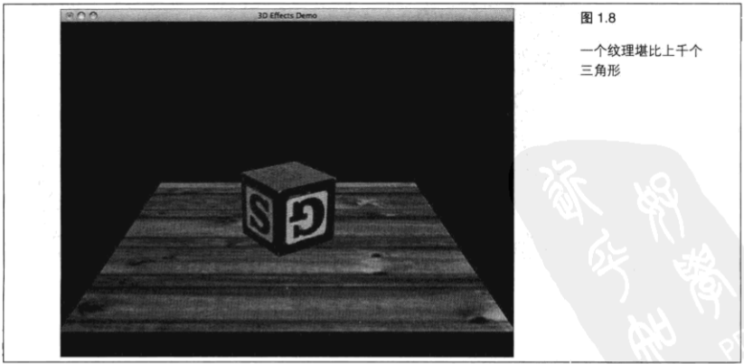

&emsp;&emsp;在如今的硬件上，纹理是快捷有效的，而一个纹理所能再现的表面如果用三角形来实现的话，可能需要几千甚至几百万个。

> 1.2.5 混合

&emsp;&emsp;最后，图 `1.9` 所示展示了混合( `Blending` )的效果。混合时我们能够将不同的颜色混在一起。我们首先上下颠倒地绘制这个立方体,然后再在它上面绘制地板并与它进行混合,在绘制正常方向的立方体,就能获得这种反射效果。我们确实“透过”地板看到了下面颠倒的立方体。大脑告诉我们, “哦……这是个倒影”。我们也可以应用混合使物体看起来透明。实际上，在图 `1.9` 中真正看到的倒立立方体其实是“透过”地板看到的。

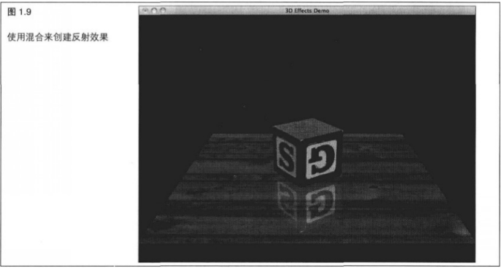

> 1.2.6 将点连接起来

&emsp;&emsp;总而言之,上述内容大概就是所谓的计算机图形了。实心 `3D` 几何体无非是将顶点间的点连接起来,然后对三角形进行光栅化而使对象变得有实体。变换、着色、纹理与混合——我们在电影、电视游戏、医疗或商业应用中看到的任何计算机渲染场景都无非是灵活地运用这 `4` 种技术而产生的。

&nbsp;

## 1.3 `3D` 图形的常见用途

&emsp;&emsp;在现代计算机应用程序中，三维图形具有广泛的应用。实时 `3D` 图形的应用范围包括交互式游戏和模拟以及数据的可视化显示(供科学、医学或商业应用)。高端3D图形在电影以及技术和教育出版物中也具有广泛的应用。

> 1.3.1 实时 `3D`

&emsp;&emsp;如前面所述，实时3D图形是指活动的并与用户进行交互的图形。实时 `3D` 图形最早的用途之一是军事飞行模拟器。即使到了今天,飞行模拟器仍然为许多业余爱好者所热衷。图 `1.10` 所示显示了一个流行的飞行模拟器的屏幕截图,它使用 `OpenGL` 进行3D渲染( `www.x-plane.com` )。

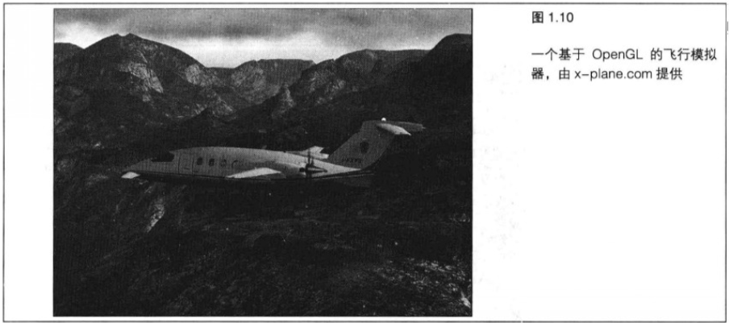

&emsp;&emsp;在个人计算机领域，`3D` 图形的应用几乎没有止境。目前最为常见的用途或许是计算机游戏。今天，几乎所有发行的游戏都要求 `PC` 装有 `3D` 图形卡才能够运行。虽然 `3D` 图形在科学视觉和工程应用中也非常流行,但价廉物美的 `3D` 硬件的大量涌现使得这些应用空前流行。商业应用程序也利用了 `3D` 硬件的新功能,引入了越来越复杂的商业图形和数据库挖掘可视化技术。即使现代的 `GUI` 也受到了它的影响,开始利用 `3D` 硬件的功能。例如,新的 `Macintosh OSX` 使用 `OpenGL` 对所有窗口和控件进行渲染,从而创建了功能强大、引人入胜的可视化界面。

&emsp;&emsp;图 `1.11` 至图 `1.15` 所示展示了现代个人计算机上无数3D应用中的一些例子。这些图像绝大多数都是用 `OpenGL` 实时渲染的。

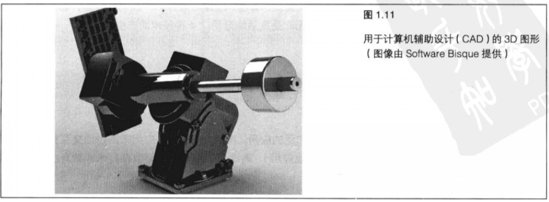 
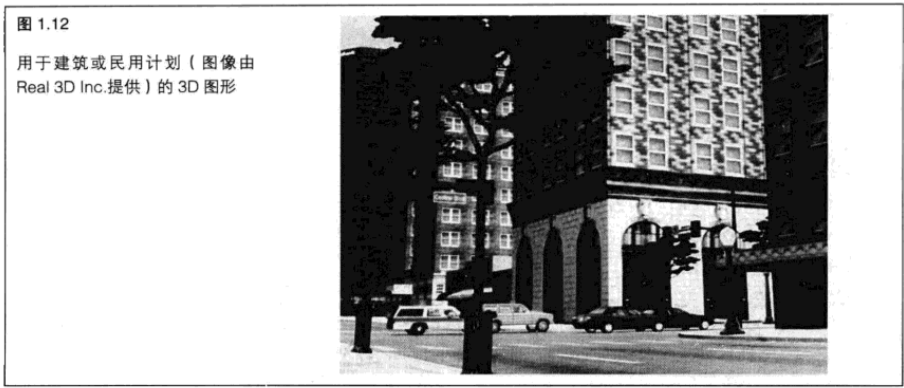 
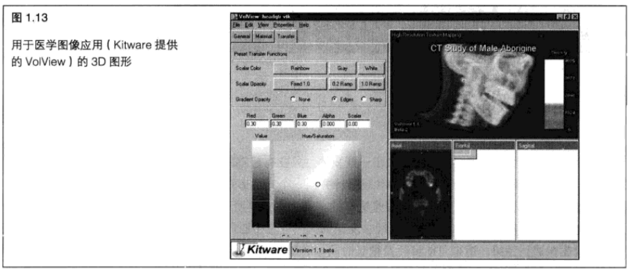 
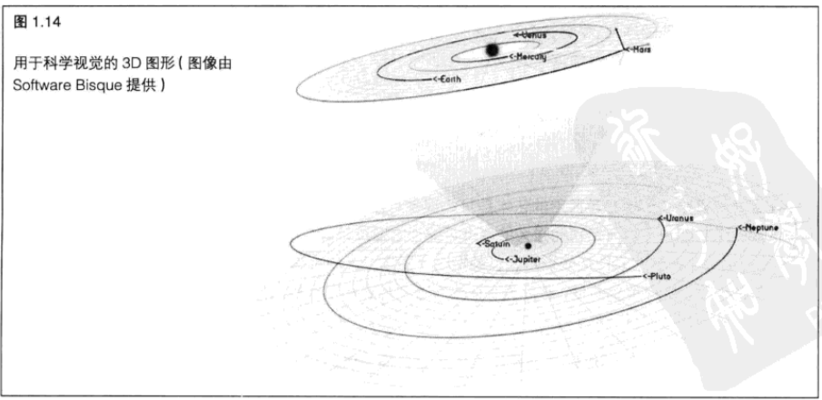 
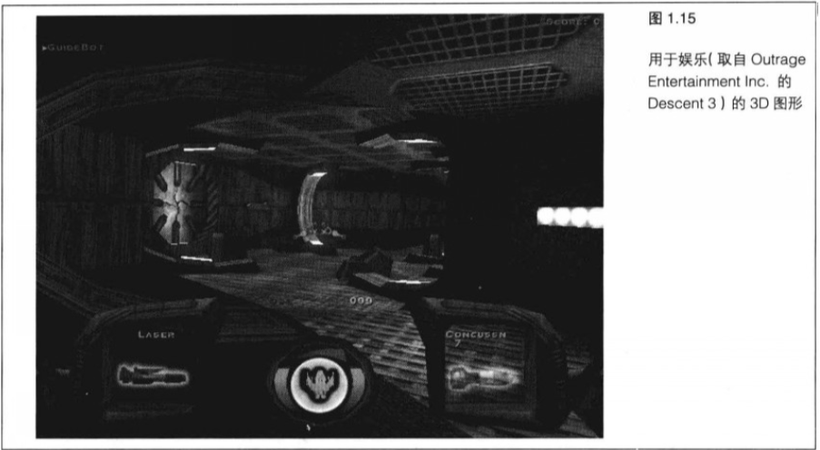 

> 1.3.2 非实时 `3D`

&emsp;&emsp;在实时 `3D` 应用中，我们常常需要做出一些妥协。只要有足够的处理时间，我们可以创建更高质量的 `3D` 图形。在一般情况下，我们设计模型和场景，并用一个光线追踪器或扫描线渲染器来处理这些定义，产生高质量的3D图像。典型的处理过程是这样的;一个建模应用程序使用实时 `3D` 图形与艺术家进行交互,创建具体的内容;然后,它所创建的帧被发送到另一个应用程序(光线追踪器离线渲染器)或子程序,由它们对图像进行渲染,渲染可能要耗费很长时间。例如,在一台非常快速的计算机上,为一部电影(例如 `toy Story` 或 `Shrek` )渲染一个单独的帧可能需要耗费几个小时。渲染并保存成千上万个帧的过程生成了一个可以回放的动画序列。尽管这个动画序列在回放时看上去像是实时的,但它的内容却不是交互性的。因此，它并不是实时的，而是预渲染的。

> 1.3.3 着色器

&emsp;&emsp;在实时计算机图形中，最前沿的艺术是可编程着色器( `Programmable Shading` )。今天的图形卡不再是低能的渲染芯片了，而是功能强大的高度可编程的渲染计算机。类似 `CPU` (中央处理单元)的术语 `GPU` 也应运而生,它代表图形处理单元,特指当今图形卡上的可编程芯片。它们是高度并行的,并且具有非常快的速度。同样重要的是,程序员可以进行重新配置图形卡的工作方式,几乎可以实现任何可以想像得到的特殊效果。

&emsp;&emsp;每年,基于着色器的图形硬件不断侵占传统上由高端光线追踪器和前面所提到的软件渲染工具所完成的任务。图 `1.16` 所示展示了 `Software Bisque` 的 `Seeker` 太阳系模拟器上的一幅地球图像。这个应用程序使用了一个自定义的 `OpenGL` 着色器，以每秒 `60` 幅的速率生成了一幅逼真的地球动态图像。它还包括了大气效果、太阳在水中的倒影,甚至背景中的星星。本书插页的彩图1显示了这张图的彩色版本。

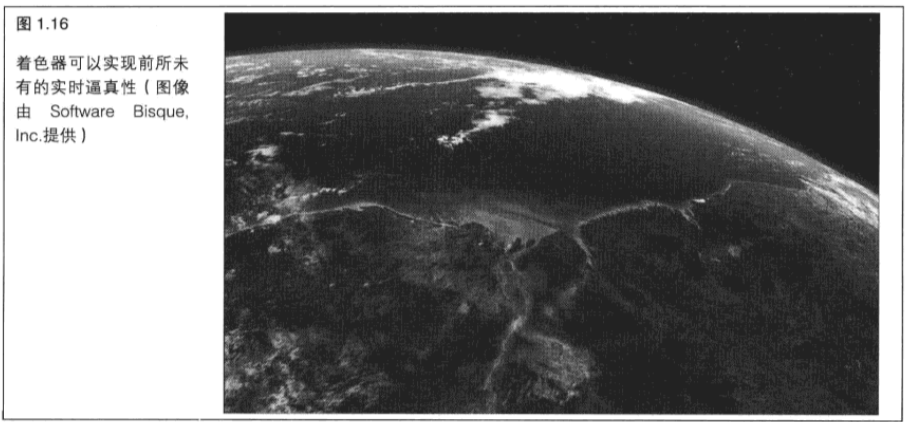

&nbsp;

## 1.4 `3D` 编程的基本原则

&emsp;&emsp;现在，我们对实时 `3D` 的基本概念已经有了相当程度的认识。我们讨论了一些术语以及 `PC` 上的一些示例应用程序。那么，如何在自己的计算机上创建这样的图像呢?好吧,这正是本书剩余部分的任务所在。不过，读者还需要知道一些基础知识，这正是我们接下来将要讨论的。

> 1.4.1 并非工具包

&emsp;&emsp;`OpenGL` 基本上是一种底层渲染 `API` (应用程序接口)。我们不能告诉它“在什么地方绘制什么”——我们需要自己动手,通过载入三角形,应用必要的变换和正确的纹理、着色器并在必要时应用混合模式来组合一个模型。这使我们能够进行大量的底层控制。与使用高层工具包相比,使用 `OpenGL` 这样的底层 `API` 的动人之处在于，我们不能仅仅是重现许许多多的标准 `3D` 渲染算法，我们可以创造自己的算法，甚至可以发现一些新的捷径、性能技巧和艺术视觉技术。

> 1.4.2 坐标系统

&emsp;&emsp;现在，让我们考虑如何在三维中对物体进行描述。在指定一个物体的位置和大小之前，需要一个参考帧对他进行测量和定位。当我们在一个简单的平面计算机屏幕上绘制点和线时，我们根据行和列指定一个位置。例如，标准的 `VGA` 屏幕从左向右为 `640` 个像素，自上而下为 `480` 个像素。为了在屏幕的中间指定一个位置，可以指定 `(350, 240)` 的点，也就是距离屏幕左边 `320` 和像素、距离屏幕顶端 `240` 个像素的位置。

&emsp;&emsp;在 `OpenGL` 或几乎所有的 `3D API` 中创建一个用于绘图的窗口时，必须指定希望使用的坐标系统以及指定的坐标如何映射到实际的屏幕像素。首先，我们讨论在二维绘图中应该怎样做，然后把这个原则扩展到三维图形中。

&emsp;&emsp;**2D 笛卡尔坐标**

&emsp;&emsp;在二维绘图中，最为常用的坐标系统是笛卡尔坐标系统。笛卡尔坐标由一个 `×` 坐标和一个 `y` 坐标构成。`x` 坐标测量水平方向的位置，而 `y` 坐标则测量垂直方向的位置。笛卡尔坐标系统的原点( `Origin` )是( `x=0` , `y=0` )。笛卡尔坐标用括号内的一个坐标对来表示，第一个是 `x` 坐标,第二个是 `y` 坐标,中间由一个逗号分隔。例如,原点就写成( `0` , `0` )。图 `1.17` 所示描述了二维的笛卡尔坐标系统。带刻度的 `×` 和 `y` 线被称为 “轴” ，可以从负无穷延伸到正无穷。这张图是我们在学校时经常使用的真实笛卡尔坐标系统。今天，当我们在绘图时指定坐标系统，不同的窗口映射模式可能会导致坐标的解释不一致。在本书后面章节,我们将看到如何使用不同的方式把真实的坐标空间映射到窗口坐标。

&emsp;&emsp;`x` 轴和 `y` 轴是垂直的（直角相交），它们共同定义了一个 `xy` 平面。简而言之，平面就是指一个扁平的表面。在任何坐标系统中,两条轴(或两条线)如果以直角相交,那么它们就定义了一个平面。很显然,如果一个系统只有两个轴，那么就只有一个平面可以用来绘图。

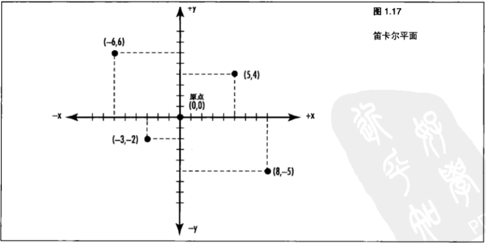

&emsp;&emsp;**坐标裁剪**

&emsp;&emsp;窗口是以像素为单位进行度量的。开始在窗口中绘制点、线和形状之前,必须告诉 `OpenGL` 如何把指定的坐标对翻译为屏幕坐标。我们可以通过指定占据窗口的笛卡尔空间区域完成这个任务，这个区域称为裁剪区域。在二维空间中,裁剪区域就是窗口内部最小和最大的 `x` 和 `y` 值。另一种方法是根据窗口指定原点的位置。图 `1.22` 所示显示了两种常见的裁剪区域。

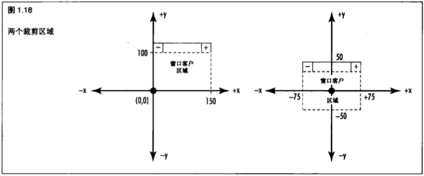

&emsp;&emsp;在第一个例子中,也就是图 `1.18` 所示的左侧,窗口 `x` 坐标的范围自左向右为 `0` 到 `+150` , `y` 坐标的范围从上而下为 `0` 到 `+100` ,屏幕正中的点用( `75` , `50` )来表示。在第二个例子所示的裁剪区域中, `×` 坐标的范围自左向右为 `-75` 到 `+75` , `y` 坐标的范围从上而下为 `-50` 到 `+50` 。在这个例子中,屏幕正中的点就是原点( `0` , `0` )。我们还可以使用 `OpenGL` 函数(或用于 `GDI` 绘图的普通 `Windows` 函数)上下反转或左右反转坐标系统。事实上，在 `Windows` 窗口的默认映射中,坐标 `y` 的值始终为正，并且从上而下递增。这种默认的映射模式在自上而下绘制文本时非常有用，但在绘制图形时则显得不太方便。

&emsp;&emsp;**视口(ViewPort)**

&emsp;&emsp;裁剪区域的宽度和高度很少正好与窗口的宽度和高度(以像素为单位)相匹配。因此，坐标系统必须从逻辑笛卡儿坐标映射到物理屏幕像素坐标。这个映射是通过一种叫做视口( `ViewPort` )的设置来指定的。视口就是窗口内部用于绘制裁剪区域的客户区域。视口简单地把裁剪区域映射到窗口中的一个区域。通常,视口被定义为整个窗口,但这并非严格必须的。例如,我们可能只希望在窗口的下半部分进行绘图。

&emsp;&emsp;图 `1.19` 所示是个很大的窗口,其大小为 `300×200` 像素,它的视口被定义为整个用户区域。如果这个窗口的裁剪区域被设置为沿 `x` 轴 `0` 至 `150` ,沿 `y` 轴 `0` 至 `100` ,我们所看到这个窗口的逻辑坐标将被映射到一个更大的屏幕坐标系统中。逻辑坐标系统的每个增量将与窗口物理坐标系统(像素)的两个增量相匹配。

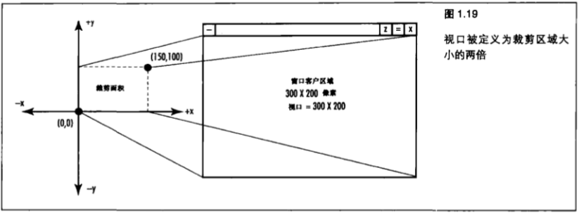

&emsp;&emsp;与此形成对照的是，图 `1.20` 所示显示了一个与裁剪区域相匹配的视口。我们所看到的这个窗口仍然是 `300× 200` 像素。但是,现在可视区域将占据窗口的左下部分。

&emsp;&emsp;我们可以使用视口来缩小或放大窗口中的图像,也可以通过把视口设置为大于窗口的用户区域,从而只显示裁剪区域的一部分。

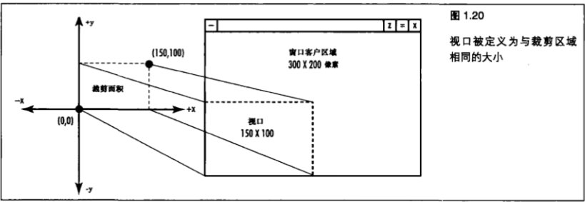

&emsp;&emsp;**顶点(Vertex)**

&emsp;&emsp;在 `2D` 和 `3D` 中,当我们绘制一个物体时,实际上都是用一些更小的称为图元( `Primitives` )的形状来组成这个物体。图元是一维或二维的实体或表面,如点、直线和多边形(平面多边的形状)。在 `3D` 空间中,我们把图元组合在一起创建 `3D` 物体。例如一个三维立方体是由 `6` 个二维的正方形组成,每个正方形代表一个独立的面。正方形(或其他任何图元)的每个角称为顶点( `Vertex` )。这些顶点就在 `3D` 空间中指定了一个特定的坐标。顶点其实也就是 `2D` 或 `3D` 空间中的一个坐标。创建实体 `3D` 几何图形其实不过就是一种连线游戏罢了。我们将在第 `3` 章讨论所有的 `OpenGL` 图元以及如何使用它们。

&emsp;&emsp;**3D 笛卡尔坐标**

&emsp;&emsp;现在,我们把二维坐标系统扩展到三维空间中,并增加深度分量。图 `1.21` 所示的笛卡尔坐标系统增

&emsp;&emsp;加了一个新的轴: `z` 轴。`z` 轴同时垂直于 `×` 轴和 `y` 轴。它代表了一条从屏幕的中心朝向读者的直线(我们已经旋转了这个坐标系统的视角，把 `y` 轴向左旋转，把 `×` 轴向下和后旋转。否则，`z` 轴将直接面向我们，无法看到)。现在,我们用 `3` 个坐标( `x` , `y`, `z` )来指定三维空间中的一个位置。例如,图 `1.21` 所示显示了一个点( `-4` ，`4` ，`4` )。

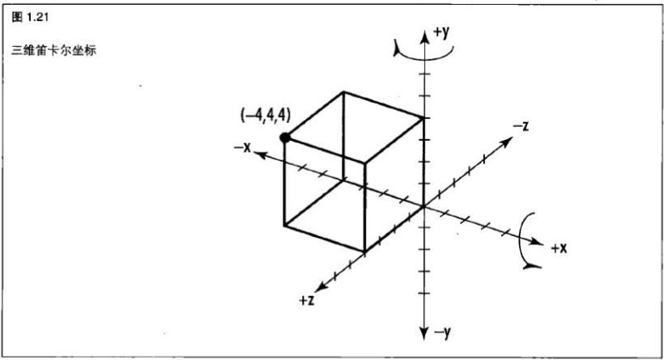

> 1.4.3 投影：从 `3D` 到 `2D`

&emsp;&emsp;我们已经知道如何在 `3D` 空间中使用笛卡尔坐标来表示位置。但是,不管我们觉得自己的眼睛所看到的三维图像有多么真实,屏幕上的像素实际上只是二维的。那么 `OpenGL` 是如何把这些笛卡尔坐标翻译为可以在屏幕上绘图的二维坐标呢?简而言之,答案就是“三角法和简单的矩阵操纵”。简单?事实上或许并非如此,但是如果我们花很长的篇幅来讨论其中的概念,我们很可能会失去很多对这些细节不感兴趣的读者。而且,如果读者已经忘了大学里所学习的线性代数,那么他们可能无法理解这种“简单”的技巧。在第 `4` 章,我们将对此稍作讨论。至于更深入的讨论,读者可以参考附录A“更多阅读建议”中的参考部分。幸运的是,当我们使用 `OpenGL` 创建图形时,并不需要对数学有深入的理解。但是,我们在这方面的造诣越深,能够利用 `OpenGL` 所发挥的威力也就越大。

&emsp;&emsp;我们真正需要理解的第一个概念称为投影( `Projection` )。用于创建几何图形的3D坐标将投影到一个一 `2D` 表面(窗口背景)。这有点像在一块玻璃后面用一支黑色的笔描绘一些物体的外形。当物体消失或者移动玻璃时,我们仍然可以看到这个边缘带角的物体的外形，在图 `1.22` 中，背景中的一座房子被描绘到一块扁平的玻璃上。通过指定投影,我们可以指定在窗口中显示的视景体( `Viewing Volume` ),并指定如何对它进行变换。

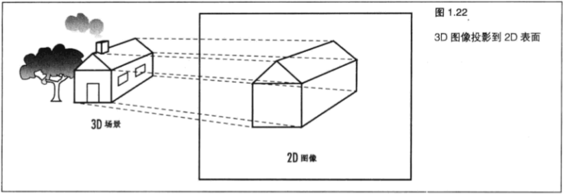

&emsp;&emsp;**正交投影(Orthographic Projection)**

&emsp;&emsp;在 `OpenGL` 中,绝大多数情况下,我们所关心的是两种主要类型的投影。第一种称为正投影( `Orthographic Projection` )或平行投影。使用这种投影时,需要指定一个正方形或长方形的视景体。视景体之外的任何物体都不会被绘制。而且,所有实际大小相同的物体在屏幕上都具有相同的大小,不管它们是远是近。这种类型的投影(如图 `1.23` 所示)最常用于建筑设计、计算机辅助设计或 `2D` 图形中。此外,在 `3D` 图形场景中,我们也常常需要使用正投影,在场景的顶部添加文本或者 `2D` 覆盖图。

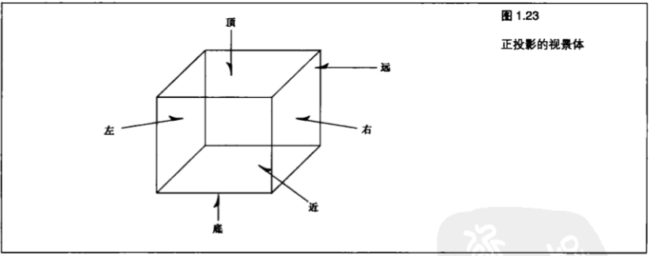

&emsp;&emsp;我们还可以在正投影中通过指定远、近、左、右、顶和底裁剪平面来指定视景体。在这个视景体中出现的物体和图形将被投影（考虑它们的方向）到一个在屏幕上出现的 `2D` 图像。

&emsp;&emsp;**透视投影(Perspective Projection)**

&emsp;&emsp;第二种投影是透视投影( `Perspective Projection` ),它更为常见。在这种投影中,远处的物体看上去比近处的物体更小一些。它的视景体(如图 `1.24` 所示)看上去有点像一个顶部被削平的金字塔。剩下来的这个形状称为平截头体( `Frustum` )。靠近视景体前面的物体看上去比较接近它们的原始大小。但是,当靠近视景体后部的物体被投影到视景体的前部时,它们看上去就显得比较小。在模拟和3D动画中,这种投影能够获得最大程度的逼真感。

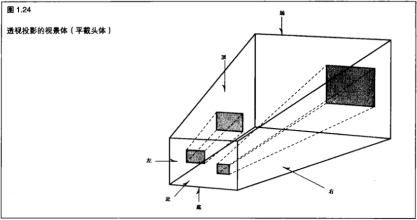

&nbsp;

## 1.5 总结

在本章，我们介绍了 `3D` 图像的基础知识。读者可以看到，我们实际上需要一个物体的两幅图像(从不同角度)才能感知真正的三维空间。读者还可以发现,我们可以通过透视、隐藏直线消除、颜色、着色和其他技巧来创建深度幻觉。在 `2D` 和 `3D` 绘图中,我们引入了笛卡尔坐标系统,并且学习了 `OpenGL` 所使用的两种方法把三维图像投影到二维屏幕。我们有意省略了 `OpenGL` 如何实际创建这些效果的细节。在接下来的章节中,我们将学习如何利用这些技巧,最大限度地发挥 `OpenGL` 的威力。在随书发行的示例代码中,读者可以找到一个程序,它显示了本章所讨论的一些 `3D` 效果。在 `BLOCK` 程序中,点击空格键可以把一个线框立方体逐渐完善为一个完整的带光照和纹理贴图的立方体,并且还带有光滑表面上的倒影。此时,我们可能还不理解这些代码,但它们做了一个强有力的展示。当读者学完本书以后可以重新回顾这个例子并对它加以改进,甚至可以自己重新编写。