# 入门指南

+ OpenGL的发展历程和未来趋势

+ 扩展机制(`Extension Mechanism`)如何工作,以及它为什么很重要

+ 核心框架和 “不鼓励使用” 的功能如何检测 `OpenGL` 编程错误

+ 如何向OpenGL 传递性能提示（ `Hint` ）

+ 如何获得一个基本项目并进入 `Visual C++` 或 `Xcode`

+ 如何使用在一个基本编程框架中使用 `GLUT`

&emsp;&emsp;既然我们已经介绍了 `3D` 图形的基本术语以及隐藏在 `3D` 图形背后的思路,现在就可以进入正题了。在使用 `OpenGL` 之前,我们需要讨论什么是 `OpenGL` 以及什么不是 `OpenGL` ,使读者能够同时了解这种 `API` 的功能和限制。本章概括地描述了 `OpenGL` 的操作，并介绍了如何建立 `3D` 艺术品的渲染框架。

&nbsp;

## 2.1 什么是 `OpenGL`

&emsp;&emsp;严格地讲, `OpenGL` 被定义为 “图形硬件的一种软件接口” 。从本质上说,它是一个 `3D` 图形和模型库,具有高度的可移植性,并且具有非常快的速度。使用 `OpenGL` ,可以创建优雅而漂亮的 `3D` 图像,并且具有非常出色的视觉质量。使用 `OpenGL` 的最大优点是它的速度远远快于光线追踪器或软件渲染引擎。最初，它使用 `SGI` ( `Silicon Graphics, Inc.` )精心开发和优化的算法。`SGI` 是一家久负盛名的公司，在计算机图形和动画方面处于业界领先的地位。随着其他厂商不断奉献经验和智慧，发展自己的高性能实现方案，`OpenGL` 也得到了不断的发展。

&emsp;&emsp;`OpenGL` 并不像 `C` 和 `C++` 那样的编程语言，它更像一个 `C` 运行时的函数库，提供了一些预先打包的功能。另一方面，`OpenGL` 规范包含 `GLSL` ，即 `OpenGL` 着色语言，这实际上是一种非常类似于 `C` 语言的程序设计语言。但是，`GLSL` 并不会对应用程序流程和逻辑进行控制，而是用于渲染操作。总体上看，应用程序在 `OpenGL` 中编写的情况并不像使用 `OpenGL` 那样多。事实上,并不存在诸如 " `OpenGL` 程序" 之类的东西(如前所述,着色器程序是个例外),而是开发人员编写的程序 “凑巧” 使用了 `OpenGL` 作为应用程序编程接口( `API` )之一。就像我们可以使用 `Windows API` 来访问文件或 `Internet` 一样,我们也可以使用 `OpenGL` 来创建实时的 `3D` 图形。

&emsp;&emsp;`OpenGL` 意在供那些专门为显示和处理 `3D` 图形而进行设计和优化的计算机硬件使用。纯软件的通用 `OpenGL` 实现也是可能的, `Microsoft` 所采用的实现方案就属于这种类型。使用纯软件的 `OpenGL` 实现,渲染的速度可能会受到影响,并且可能无法实现一些特殊的高级效果。但是,使用软件实现意味着程序具有可以在范围极广的计算机系统上运行的潜力,即使是那些并未安装全功能3D图形加速卡的系统。

&emsp;&emsp;`OpenGL` 具有多种用途，范围涵盖从 `CAD` 工程和建筑应用程序到那些在恐怖电影中用于实现计算机生成鬼怪的建模程序等各种应用。将工业标准的 `3D API` 引入到拥有众多用户的操作系统如 `MicrosoftWindows` 和 `Macintosh OSX` 产生的反响令人兴奋。随着硬件加速和高速 `PC` 微处理器越来越普及, `3D` 图形已经成为消费者和商业应用程序的典型组成部分,而不再局限于游戏和科学应用程序。

> 2.1.1 标准的演化

&emsp;&emsp;`OpenGL` 的前身是 `SGI` 公司的 `IRIS GL` 。它最初是个 `2D` 图形函数库，后来逐渐演化为由这家公司的高端`IRIS` 图形工作站所使用的 `3D` 编程 `API` 。这种计算机不仅是通用计算机,它们具有专门经过优化的硬件,用于显示复杂的图形。这种硬件提供了超快的矩阵变换能力(这是 `3D` 图形的先决条件)、硬件支持的深度缓冲以及一些其他功能。

&emsp;&emsp;但是在某些情况下，出于支持陈旧系统的需要，技术的发展常常受到束缚。`IRIS GL` 并不是一开始就设计为具有顶点风格的几何图形处理接口的。后来形势逐渐变得明朗, `SG1` 必须彻底改变才能继续发展。

&emsp;&emsp;`OpenGL` 就是 `SGI` 对 `IRIS GL` 的移植性进行改进和提高的结果。这个新的图形 `API` 不仅具有 `GL` 的功能,而且是一个“开放”的标准。它的输入来自其他图形硬件厂商,并且更容易应用到其他硬件平台和操作系统。`OpenGL` 是为了 `3D` 几何图形而完全重新设计的。

&emsp;&emsp;**OpenGL ARB**

&emsp;&emsp;如果只有某一家厂商控制标准，那么这个标准就不是真正的开放式标准。`SGI` 当初的业务领域是高端的计算机图形。一旦已经处于某个行业的顶端,你就会发现进一步成长的机会就很有限了。`SG1` 认识到如果它能够做些事情来推动高端计算机图形硬件市场的成长,那么这对公司也是件非常好的事情。一个得到众多厂商支持真正的开放式标准能使程序员更容易创建可以适应广泛平台的应用程序和内容。软件确实能够促进计算机的销售,如果 `SGI` 希望卖出更多的计算机,那么就需要在它的计算机上能够运行更多的软件。其他厂商也意识到了这一点,这样 `OpenGL` 体系结构审核委员会( `ARB, OpenGL Architecture Reiview Board` )就诞生了。

&emsp;&emsp;`SGI` 最初控制了 `OpenGL API` 的许可，而 `ARB` 的创立者包括 `SGI` 、`DEC` ( `Digital Equitment Corporation` ), `IBM` , `Intel` 和 `Microsoft` 。 `1992` 年 `7` 月 `1` 日, `OpenGL` 规范 `1.0` 版正式出台。随着时间的 推移，`ARB` 又陷于陆续增加一些新成员，其中有许多来自 `PC` 硬件社区。`ARB` 每隔 `4` 年召开一次会议， 对规范进行维护和改善,并出台计划对 `OpenGL` 标准进行升级。

&emsp;&emsp;近年来，由于某些原因，`SGI` 的业务不断下滑，具体原因超出了本书的讨论范围。`2006` 年，实际上已经破产的`SGI` 公司把对 `OpenGL` 标准的控制权从 `ARB` 移交给一个新的工作组: `Khronos` 小组( `www.khronos.org` )。 `Khronos` 是一个由成员提供资金的行业协会,专注于开放媒体标准的创建和维护。大多数 `ARB` 成员已经成为 `Khronos` 的成员,因此这个变动并没有产生太大的波折。今天, `Khronos` 小组继续发展和升级 `OpenGL` 以及它的姊妹 `API-OpenGL ES` 。我们将在第 `16` 章介绍 `OpenGL ES` 。

&emsp;&emsp;`OpenGL` 以两种形式存在。第一种形式是“ `OpenGL` 规范”,这个规范定义了行业标准,用非常完整和明确(这里用相似的词并不是偶然的)的术语描述了 `OpenGL` 。它完整地定义了 `OpenGL API` 、`OpenGL` 的整个状态机,以及各种特性是如何共同工作和运行的。然后像 `ATI` 、`NVIDA` 、`Intel` 或 `Apple` 这样的硬件厂商获取这个规范,并实现它。第二种形式就是 `OpenGL` 的实现,软件开发人员和顾客可以使它生成实时图形。例如，`PC` 上的软件驱动程序和图形卡就共同组成了一个 `OpenGL` 实现。

&emsp;&emsp;**OpenGL 扩展机制**

&emsp;&emsp;读者可能会认为，既然 `OpenGL` 是一种 “标准” `API` ，那么硬件提供商在竞争中只要考虑性能（可能还有视觉质量）因素就可以了。然而，`3D` 图形领域的竞争是非常激烈的，硬件提供商不仅在性能和质量方面拥有持久的创新力,在图形方法学和特效方面也是如此。`OpenGL` 允许提供商通过它的扩展机制进行创新。这种机制以两种方式运作。首先,提供商能够向 `OpenGL API` 中增加开发人员可用的新函数;其次,可以添加能够被已存在的OpenGL函数识别的标记( `Token` )或枚举( `Enumerant` ) 。

&emsp;&emsp;利用新的标记或枚举只需在项目中添加一个提供商支持的头文件( `Header` )。提供商必须在`OpenGL`工作组( `Khronos` 小组的一个下属机构)注册它们的扩展,以避免提供商使用其他提供商已经使用的值。有一个标准头文件 `glext.h` 中包含了这些扩展，为我们提供了方便。

&emsp;&emsp;游戏需要为特定图形卡而进行重新编译的时代已经一去不返了。就像我们已经知道的,我们可以查到一个标识提供商和 `OpenGL` 驱动版本的字符串。确定一个扩展是否得到支持有两个步骤。首先,我们向 `OpenGL` 查询当前实现支持多少扩展。

```C++
GLint nNumExtensions;
glGetIntegerv(GL_NUM_EXTENSIONS, &nNumExtensions);
```

&emsp;&emsp;然后,我们可以通过调用 `glGetStringi` 函数获取特定扩展的名称。这个函数将返回单个扩展的名称。例如,要在 `Windows` 中查询交换控制扩展,我们可以依次查阅所有扩展寻找我们需要的。一旦找到,我们要得到这个函数的函数指针并正确地调用它。

```C++
GLint nNum;
glGetIntegerv(GL_NUM_EXTENSIONS, &nNum);
for (GLint i = 0; i < nNum; i++)
    if(strcmp("WGL_EXT_swap_control", (const char *)glGetStringi(GL_EXTENsIoNs, i)) == 0)
    {
        wglSwapIntervalEXT = (PFNWGLSWAPINTERVALEXTPROC)wglGetProcAddress("wglSwapIntervalEXT");
        if (wglSwapIntervalEXT != NULL)
            wglSwapIntervalEXT (1);
    }
```

&emsp;&emsp;在 `GLTools` 库中有一个快捷工具包,稍后将对其进行讨论。

```C++
int gltIsExtSupported(const char *extension);
```

&emsp;&emsp;如果支持指定的扩展，那么这个函数返回 `1` ； 反之则返回 `0` 。`GLTools` 库包含了一整套 `OpenGL` 帮助和实用工具函数,其中有很多在本书中自始至终都在使用。`gltools.h` 文件包含所有的函数的函数原型。

&emsp;&emsp;这个示例还展示了在 `Windows` 下如何获取一个指向新的 `OpenGL` 函数的指针。`Windows` 函数 `wglGetProcAddress` 返回一个指向 `OpenGL` 函数(扩展)名的指针。获取一个由于操作系统的不同而不同的扩展，这一主题在本书的第 `3` 部分将进行更详细的阐述。幸运的是，在 `99%` 的情况下我们使用一个叫做 `GLEW` 的快捷方式库就可以了,而我们将自动获取驱动程序支持功能的扩展函数指针。

&emsp;&emsp;**这是谁的扩展**

&emsp;&emsp;使用 `OpenGL` 扩展，我们可以在代码中规定代码路径来改善渲染表现和视觉质量，或者甚至可以添加只有特殊提供商的硬件才支持的特效。但是这些扩展是属于谁的?也就是说,哪家提供商创建一个特定扩展并为其提供技术支持？通常情况下我们只通过观察扩展名就能得出结论。每个扩展都有一个由 `3` 个字母组成的前缀,这个前缀标识了这个扩展的来源。表 `2.1` 展示了一些扩展识别的示例。

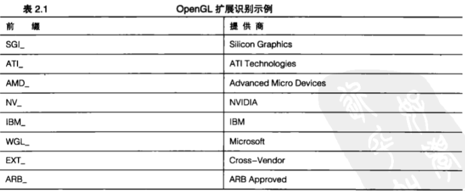

&emsp;&emsp;一个提供商为另一个提供商的扩展提供支持的情况并不少见。例如,一些 `NVIDISA` 的扩展就在 `ATI` 硬件平台上得到支持并广泛流行。竞争提供商必须遵循原始提供商的规范(关于扩展如何工作的细节)。通常人们都认为扩展是好东西，扩展的 `EXT_` 前缀表明这个扩展(假定)是与特定提供商无关的，并且得到众多实现的支持。

&emsp;&emsp;最后，还有一些 `ARB` 承认的扩展。这些扩展的规范经过了 `OpenGL ARB` 的审核以及讨论。这些扩展常常意味着某些新技术或函数能够加入核心 `OpenGL` 规范前的最后步骤。

&emsp;&emsp;**许可和一致**

&emsp;&emsp;`OpenGL` 实现可以是软件库，也就是对 `OpenGL` 函数调用做出响应、创建三维图像的软件函数库。`OpenGL` 实现也可以是一个用于完成三维图像渲染任务的硬件设备(通常是显示卡)的驱动程序包。硬件实现比软件实现要快上许多倍。而且，现在即使在廉价 `PC` 上这类硬件也已经非常普遍。

&emsp;&emsp;如果厂商希望创建并销售 `OpenGL` 实现，首先必须从 `Khronos` 小组获得 `OpenGL` 许可。如果申请者是PC硬件厂商, `Khronos` 小组在批准许可时会顺带提供一个示例实现(纯软件形式)和一个设备驱动程序。然后,厂商就可以据此创建经过优化的实现,并且可以通过扩展提高产品的价值。在典型情况下,厂商之间的竞争就是性能、图像质量和驱动程序稳定性的竞争。

&emsp;&emsp;此外,厂商的实现必须通过 `OpenGL` 一致性测试。这些测试的设计目标就是保证实现方案是完整的(包含所有必需的函数调用),并且对于一组特定的函数,这种实现所产生的 `3D` 渲染输出结果是可以接受的。

&emsp;&emsp;软件开发人员在使用 `OpenGL` 驱动程序时并不需要获得 `OpenGL` 许可或者支付任何费用。`OpenGL` 是得到操作系统原生支持的,并且获得许可的驱动程序是由硬件厂商本身所提供的。

> 2.1.2 `OpenGL` 的未来

&emsp;&emsp;绝大多数公司认识到从长远而言，竞争对于每家公司都是件好事，因此它们都认可并支持行业标准，甚至对行业标准作出贡献。`Khronos` 小组下属的体系结构审核委员会( `ARB` )如今已经非常壮大,生气勃勃且充满活力。最近, `OpenGL` 规范的修订工作已经达到不到一年就能推出一个版本的速度。到本书编写时, `OpenGL` 最新的版本已经更新到了 `3.3` 和 `4.0` ,这两个版本都是在 `2010` 年游戏开发者大会上发布的。`15` 年以来,加起来人们已经在各种类型的 `OpenGL` 技术、书籍、教程、示例代码和应用程序上花费了数百万年的人工。这种持续的动力将使 `OpenGL` 在可预见的未来保持广大应用程序和硬件平台首选 `API` 的地位。所有这些都使 `OpenGL` 获得良好的定位,以充分利用未来 `3D` 图形技术创新成果。`OpenGL 2.0` 中加入的 `OpenGL` 着色语言,使`OpenGL` 显示出了长久的适应性,能够满足不断发展的 `3D` 图形程序设计管线所带来的挑战。最后, `OpenGL` 是一种规范,能够应用于各种各样程序设计范例。从 `C/C++` 、`Java` 到 `Visual Basic` ,甚至 `C#` 这样的新兴程序设计语言,现在都已经用来使用 `OpenGL` 创建 `PC` 游戏和应用程序。`OpenGL` 已经被广泛地接受和关注。

&emsp;&emsp;**OpenGL 与 D3D**

&emsp;&emsp;就像政治上或宗教上的联盟一样，对程序设计语言或 `API` 的选择经常在某种程度上是某些原因和情感考虑。-- “我就是这样成长的” 或者 “这就是最早学习的 `API` ，我还是用它最顺手” 。这当然是任何人会选择 `Direct3D` 而不选择 `OpenGL` 的唯一符合逻辑的原因。

&emsp;&emsp;如果读者是 `3D` 图形程序设计领域的新手,那么可能还不知道在两种互相竞争的标准 `OpenGL` 与 `Direct3D` 之间有一场 “战争” 。这是非常遗憾的,因为这两种标准都是可行的选择,而且它们都有各自的优点。人们经常将 `OpenGL` 与 `DirectX` 相比,这是不公平的。`DirectX` 是一个来自微软公司的游戏技术 `SPI` 族，其中包括 `Direct3D` 这种由微软公司为游戏程序涉及而开发的渲染 `API` 。一个人可能更喜欢自己的汉堡而不是别人的牛排，但是拿别人的牛排和一家餐馆来比较是不公平的！实际上，大多数使用 `OpenGL` 的 `Windows` 游戏同时还使用 `DirectX` 的非渲染组件来更方便地进行声音的回放、游戏手柄控制和联网游戏等。

&emsp;&emsp;`Direct3D` 是微软公司专有的标准,被广泛地应用于 `Windows` 平台的游戏上,并且还有一些 `Direct3D` 的变体被用于 `XBox` 游戏控制台平台和一些 `Windows` 移动设备上。在 `Direct3D` 发展的早期,这种 `API` 是非常不好用的,和 `OpenGL` 相比缺乏大量特性,并且存在一些固有的软件低效情况。微软公司采取了一些有争议的策略来帮助 `Direct3D` 成为 `Windows` 游戏程序设计的 “标准” ,这种情况持续了几年,被人们称为 “ `API` 战争” 。在很多人看来,这场战争还在继续。公平地说,微软公司到现在为止已经与硬件提供商和软件提供商合作了十多年,现在 `Direct3D` 已经成为一种有用且有良好口碑的 `API` ,并且在那些只对微软公司平台感兴趣的游戏程序设计人员中非常流行。

&emsp;&emsp;但是，`OpenGL` 在 `Windows` 游戏开发人员中仍然非常流行，并且是那些制作非游戏 `3D` 应用程序(例如视觉模拟( `Vis-sim` )行业、内容创建工具、科学可视化和商业图形等)的软件开发人员的首选。在 `OpenGL` 和 `Direct3D` 之间“根据情感”的选择常常可以归结为喜欢或不喜欢 `Direct3D` 的面向对象 `COM` (组件对象模型)方法和 `OpenGL` 的状态机抽象化，或者仅仅是出于喜欢或不喜欢微软公司。在诸如 `Mac OSX` 、`iPhone` 、`Linux` (不仅仅是桌面系统，大多数手持智能电话设备使用的都是 `UNIX` 的变体)和 `Sony` 或任天堂游戏设备这样的非微软平台上，`OpenGL` 或者类似 `OpenGL` 的 `API` 则是实际上的标准。如果我们将整个 `3D` 图形产业看作一个整体, `OpenGL` 所占据的份额比 `Direct3D` 要大得多。

&emsp;&emsp;还有一些原因使我们可能选择 `OpenGL` 而不是 `Direct3D` 。第一个原因是，`OpenGL` 是跨平台和可移植的,并且几乎现有的所有3D硬件设备都有对应的 `OpenGL` 驱动。如果读者对游戏感兴趣,那么就可以做一些市场调查。Windows桌面系统在游戏产业中并没占据大部分份额。第二个原因是, `OpenGL` 是一个开放的标准,它能从所有领先的 `3D` 硬件提供商的知识和经验中受益。这些提供商必须合作,使 `OpenGL` 对开发人员而言是有吸引力和强大的,毕竟这些开发人员制作了促使人们购买他们硬件的软件。由于 `OpenGL` 是 “到图形硬件的软件接口” ,让软件提供商参与规范的演变是必要的。这就是人们可能选择 `OpenGL` 而不是 `Direct3D`最后的也是最重要的原因--扩展机制。

&emsp;&emsp;扩展机制使硬件提供商不仅能在性能和图像质量方面进行竞争,同时还能在真正的技术革新上一较高下。硬件提供商可以在硬件上加入新的特性,并且在他们愿意的时候通过 `OpenGL` 来公开这些新特性。他们不需要 `ARB` 的许可,不需要微软公司的许可,也不需要等待下一班的OpenGL (或 `Direct3D` )发布。在 `Direct3D` 领域没有这些条条框框。微软公司通过代理来决定将什么加入`API` 中,以及在某种程度上(有些情况应该说是不公平的)影响硬件体系结构。最新和最优秀的硬件特性总是能够通过提供商 `OpenGL` 驱动程序和相关扩展来轻松获得应用。例如,当支持 `DirectX 10` 的硬件发布时, `Windows` 用户就需要使用 `Windows Vista`才能享受应用了最新 `DirectX 10` 特性的游戏。但是,所有的新功能同时也在 `OpenGL` 上通过扩展机制发布了,并且如果`Windows XP` 用户的游戏使用 `OpenGL` ,那么他们马上就能使用这些新功能,当然同时也能得到最新的硬件和驱动程序。许多年来,诸如NVIDIA或ATI(现在是 `AMD` )这样的提供商都可以通过在 `OpenGL` 上编写的演示程序来展示他们最新的硬件革新技术,而他们也确实这样做了。仅此一点就使 `OpenGL` 在最新和最优秀的 `3D` 硬件新技术应用方面始终保持稍稍领先 `Direct3D` 的优势。

&emsp;&emsp;**不鼓励使用的功能**

&emsp;&emsp;十多年来, `OpenGL` 标准通过在每个版本发布时加入新功能来不断演化着。新功能通常是通过扩展过程来进行审核的，在扩展过程中一些特性将作为提供商指定的或提供商联合扩展而添加进来，这些特性将被进一步完善并成为ARB扩展,最终将进入核心 `API` 规范中。在这个过程中从来没有哪些功能从 `OpenGL` 中被移除。这样就保证了对旧代码百分之百的向下兼容性,而且随着新硬件投入使用,现存应用程序只会运行得更快。开发人员也能够轻松地逐步升级代码,以在最新的渲染技术或性能强劲的新功能推出时充分利用它们,而不必重写已经完成或正在编写的代码。

&emsp;&emsp;然而,实际上这种过程也将到此为止。随着时间的流逝, `GPU` 和计算机体系结构已经发生了巨大的变革。`15` 年来一直保持性能上的权衡与工程上的妥协如今已再难适用。其结果就是,一些 `OpenGL API` 变得有些陈旧过时。很多提供商都首次开始寻求通过移除那些在现代代码中几乎不再使用,或性能远远低于最新技术的特性和功能来精简 `OpenGL API` 的规模。最终, `ARB` 决定以`OpenGL 3.0` 为突破口,在 `OpenGL` .诞生以来首次抛弃一些负担,即过时的 `OpenGL API` 。提供商仍然可以为了一些过时代码而继续支持 `OpenGL 2.1` 驱动程序,但定位于 `OpenGL 3.0` 或更新版本的最新应用程序应当抛弃旧的 `API` 函数和约定。这在当时看来确实是一个不错的决定。

&emsp;&emsp;**OpenGL 3.0**

&emsp;&emsp;`ARB` 是由图形硬件提供商组成的,而提供商是有客户的,而且必须使这些客户满意。很多客户(软件开发人员)意识到这种将 `OpenGL 2.1` 作为古董束之高阁的模式实际上意味着一件事情，这就是这些驱动程序对于提供商来说将迅速降至低优先级,并且在新的硬件上不会很好地保存或更新,而这些软件开发者将被迫浪费在 `OpenGL` 上价值数百万美元的投资。最终他们在次序上达成了妥协,即在 `OpenGL 3.0` 中,不会真正移除任何功能,而是将这些功能标记为 “不鼓励使用” 。 “不鼓励使用” 的功能将仍然保留在驱动程序中,但它们是作为一种通告来提供的,通知软件提供商应该停止使用某些 `OpenGL` 特性并转向更新的和更现代的工作方式。据说在 `OpenGL 3.1` 中这些特性将被移除,或者说我们认为可能是这样。

&emsp;&emsp;**OpenGL 3.x**

&emsp;&emsp;`OpenGL 3.1` 遇到了前所未有的苛刻要求。这种要求会让任何圆滑的政客都感到确实太过苛求。确实,所有 “不鼓励使用” 功能都从 `OpenGL` 核心规范中移除了,但是却引入了一个新的 `OpenGL` 扩展 `GL_ARB_compatibility` 。很多正在寻求一个更合理 `API` 的软件提供商将这个扩展看作仅仅是"加入了所有我们承诺移除但却没有做到的"不鼓励使用, `OpenGL` 特性”。这意味着一个硬件提供商至少可以选择在 `OpenGL 3.1` 驱动程序中不包含任何“不鼓励使用”功能。但是,这种情况并没有发生。`ARB` 的成员之一 `NVIDIA` 公开声明不会移除任何老旧功能。在某些种类应用程序(尤其是游戏)的开发人员开始指责这种行为的同时,我们应该客观地说, `NVIDIA` 或者其他硬件提供商还能怎么做呢?难道一个硬件提供商应该忽视它的客户而强制推行一种标准,仅仅是因为这家公司认为这样做最符合自己的利益吗?我们以前曾经遇到过这种情况。这样做几乎都得不到好的结果,而且没有人希望在 `OpenGL` 社区中发生这样的丑闻。

&emsp;&emsp;`OpenGL 3.2` 在这件事情上做得漂亮了些，它废除了这个扩展，取而代之地将 `OpenGL` 分成了核心框架和完整框架。核心框架规范将更加精简,并且不包含任何老旧的 “不鼓励使用” 功能。规范的一致性要求具有核心功能，但将兼容框架列为可选项。

&emsp;&emsp;事实上,那些 "不鼓励使用" `OpenGL` 特性对于如今使用 `OpenGL` 的绝大多数开发人员来说要容易理解得多。这些特性中有很多可能会比最新的方法慢,但是它们更加容易使用,而且非常方便。工程师们都知道,在易用性、可实现性、可维护性和开发人员熟练程度,当然还有性能之间经常要做出权衡。性能并不是在所有类型的应用程序开发中都是绝对主要的考虑因素。兼容框架看起来还要存在相当长的时间。

&emsp;&emsp;**只有核心**

&emsp;&emsp;那么，这种情况会给我们带来什么影响呢？本书的第 `4` 版涵盖了 `OpenGL 2.1` 的内容，这个版本是允许选择使用着色器的固定管线的经典 `OpenGL` 实现。核心框架式则是它的最简形式，“只有着色器” 。这样我们无论做什么，都需要编写一个着色器。这里没有内建的光照模式,没有方便的矩阵堆栈,没有简单的纹理应用程序,也没有轻松编写代码的立即模式来传输顶点数据。实际上,一些几何图元也被削减掉了。难怪众多开发人员并不急于让他们的代码“现代化”了。让事情变得更糟的是,迄今为止的大多数教程和图书都专注于展示如何从固定管线移植到着色器,似乎这是唯一的方式。这当然就意味着对于新入行的 `OpenGL` 程序员来说掌握 `OpenGL` 最简单的方式就是先从固定功能开始,然后再向着色器过渡。只是这并不是一种促进新的 `OpenGL` 核心框架应用的生产方式,也不是本书所采用的方式。

&nbsp;

## 2.2 使用OpenGL

&emsp;&emsp;`OpenGL` 是一种过程性而不是描述性的图像 `API` ，事实上，程序员并不需要描述场景和他的外观，而是事先确定一些操作步骤，实现一定的外观或效果。这些步骤需要调用许多 `OpenGL` 命令。这些命令可以在三维空间中绘制各个图元，例如点、直线和三角形等。另外，`OpenGL` 还支持纹理贴图、混合、透明、动画以及其他许多特殊的效果和功能。关于这些如何实现的具体内容将在第 `3` 章详细介绍。本章主要关注如何建立并运行OpenGL项目。

&emsp;&emsp;`OpenGL` 并不包含任何负责窗口管理、用户交互或文件 `I/O` 的函数。每个宿主环境都提供了一些函数实现这些功能，并负责是写一些方法，向 `OpenGL` 移交窗口绘图的控制。我们无法使用类似 `OpenGL` 文件格式这样的东西来表示模型或虚拟环境，因为他们并不存在。程序员构造这些环境以适合自己的高层需要，然后使用底层的 `OpenGL` 命令精心地对他们进行编程。

> 2.2.1 支持阵容

&emsp;&emsp;任何计算机程序都必须包含一些除渲染操作以外的其他东西才能使用。用户必须通过某种方式来使用键盘、鼠标、游戏手柄或其他一些输入机制来与程序进行互动。此外,必须打开并保持窗口(在大多数但并非全部操作系统中是如此),找到并载入文件等。`C` 和 `C++` 都是良好的可移植程序设计语言,它们如今年在大多数平台上都适用。但是,在典型的程序中,编程语言要使用 `API` 来完成大量工作。`OpenGL` 就是一个 `API` 的例子,并且还是一个适用于大多数现代计算机平台的可移植 `API` 。遗憾的是,与操作系统连接意味着与用户或在屏幕中的管理窗口的互动大多数情况下常常是由不可移植的操作系统特定 `API` 完成的。

&emsp;&emsp;**GLUT**

&emsp;&emsp;首先出现的是 `AUX` ,也就是OpenGL辅助函数库。`AUX` 函数库的目标帮助人们学习和编写 `OpenGL` 程序,而不必为任何平台特定环境的细枝末节而分神,不必顾虑所使用的是 `UNIX` 、`Windows` 还是其他平台。如果使用 `AUX` ,我们不是编写“最终”代码,它更像是一个预备阶段,对自己的想法进行测试。由于缺乏基本的 `GUI` 特性,这就限制了这个函数库在创建实用的应用程序方面的应用。

&emsp;&emsp;在跨平台的示例程序和演示程序中, `AUX` 渐渐为 `GLUT` 函数库所取代。`GLUT` 代表 `OpenGL` 实用工具箱( `OpenGL utility toolkit` ,不要与标准的 `GLU-OpenGL utility library` ,即 `OpenGL` 实用库混淆)。 `Mark Kilgard` 在 `SGI` 时编写了 `GLUT` ,把它作为 `AUX` 函数库的一个功能更强的替代品,并添加了一些 `GUI` 功能,至少使示例程序在 `X Window` 下显得更为实用。它的改进包括使用了弹出式菜单、增加了对其他窗口的管理,甚至提供了对操纵杆的支持。`GLUT` 并不是一个公众领域的产品,但它是免费的,并且可以自 由地进行重新发布。`GLUT`在绝大多数`UNIX`系统(包括`Linux`)中都得到了支持,并且得到了 `Max OSX` 的本地支持, `Apple` 对这个函数库进行了维护和扩展。在 `Windows` 中,`GLUT` 的开发已经中断。由于 `GLUT` 最初并不是作为一种开放源代码的软件,因此一种新的 `GLUT` 实现 `freeglut` 已经崛起并取代了它的位置。 在本书中，所有基于 `GLUT` 的 `Windows` 示例程序都利用了 `freeglut` 函数库。读者也可以通过本书的网站下载这个函数库。

&emsp;&emsp;在绝大多数情况下，本书使用 `GLUT` 作为编程框架。这出于两个目的。首先，它可以使本书面向更广的读者群。只要稍下功夫,有经验的 `Windows` 、 `Linux` 或 `Mac` 程序员应该很容易在编程环境中设置 `GLUT` ,并且顺序地创建本书的绝大多数示例程序。第二个目的是使用 `GLUT` 可以使读者不必了解任何特定平台的基本 `GUI` 编程。尽管我们解释了一些基本的 `GUI` 概念,但本书并不是一本讲述 `GUI` 编程的书籍,而是专门讲述 `OpenGL` 的。把 `OpenGL API` 的范围限制在 `GLUT` ,  `Windows/Mac/Lunux` 新手也更容易上手。

&emsp;&emsp;商业应用程序的所有功能不可能全部包含在 `3D` 绘图代码之中。虽然 `GLUT` 确实包含一些有限的 `GUI` 功能，但是非常简单和精简,就像 `GUI` 的工具包一样,因此我们不能依赖 `GLUT` 函数库来完成应用程序的所有任务。然而, `GLUT` 函数具有非常优秀的学习和演示功能,并且隐藏了像窗口创建和 `OpenGL` 环境初始化等平台特定的细节。即使是经验丰富的程序员,把 `3D` 图形集成到完整的应用程序之前,使用 `GLUT` 函数来整理 `3D` 图形代码也是非常方便的。

&emsp;&emsp;**GLEW**

&emsp;&emsp;正如前面所提到的，`OpenGL API` 主要通过扩展机制来发展。这种扩展机制能够用来获得指向任何加入 `OpenGL 1.0` 之后任何版本核心的 `OpenGL` 函数的函数指针。有一个实现 `OpenGL 3.3 API` 完全存取的简单方法,就是使用一个自动初始化所有新函数指针并包含所需类型定义、常量和枚举值的扩展加载库。不止一种这样的扩展加载库可供选择,其中一种维护最好的开源库是 `GLEW` 。通过驱动程序使用这种库赖初始化全部可用的 `OpenGL` 功能并不太容易。我们需要在项目中添加一个单独的C源文件及头文件,并且在程序启动时调用一个单独的初始化函数。稍后开始编写我们的第一个 `OpenGL` 程序时将讨论相关细节。为了使事情更简单,GLEW被预先封装在了 `GLTools` 库中。实际上,`GLTools` 库就是基于 `GLEW` 库的。

&emsp;&emsp;**GLTools**

&emsp;&emsp;每一位工匠都有一个工具箱，里面装满了自己喜爱的工具，程序员也是如此。有一些有用并且可重用的函数,所有程序员在编写几乎所有 `OpenGL` 时都要用到它们。`GLTools` 是在本书第3版出现的。随着时间的流逝,这个库已经逐渐发展起来,并提供许多快捷方式和便捷的工具,就像过去的 `OpenGL` 应用库( `GLU` )那样。`GLTools` 包含一个用于操作矩阵和向量的 `3D` 数学库,并依靠 `GLEW` 获得 `OpenGL 3.3` 中用来产生和渲染一些简单 `3D` 对象的函数，以及对视觉平截头体、相机类和变换矩阵进行管理的函数的充分支持。

> 2.2.2 `OpenGL API` 特性

&emsp;&emsp;`OpenGL` 是由一些充满智慧的人设计的,他们拥有丰富的图形程序设计 `API` 设计经验。他们在函数命名和变量声明方法上采用了一些标准规则。`API` 简单清晰,便于提供商进行扩展,并且便于程序员记忆。`OpenGL` 试图尽可能地避免策略。这里的策略是指设计者做出的关于程序员如何使用 `API` 的假设。这使 `OpenGL` 能够保持灵活、强大和快速。我们只要灵活地运用 `API` 和着色语言，就可以真正地发明一种全新的方法来渲染一个特效或场景。

&emsp;&emsp;这种理念为 `OpenGL` 的长寿和进化做出了贡献。即使如此，随着时间的推移，硬件性能出乎意料的发展和开发人员与硬件提供商的创造力在 `OpenGL` 经历了这些年的发展后还是给它带来了负面的影响。尽管如此, `OpenGL` 的基础API仍然显示出对新兴的不可预料特性的适应能力。只作很少甚至不作改动就能编译十年前源代码的能力对于众多应用程序开发人员来说是最重要的优势,而`OpenGL` 多年来一直坚持做到在加入新特性的同时尽量少地与旧代码发生冲突。现在,我们有了更加简洁和现代化的 `OpenGL` ,可以重新开始这个过程了。

&emsp;&emsp;**数据类型**

&emsp;&emsp;为了使 `OpenGL` 代码更易于从一个平台移植到另一个平台，`OpenGL` 定义了数据类型。这些数据类型可以映射到所有平台上的特定最小格式。各种编译器和环境都有自己的规则来定义各种变量类型的大小为了使 `OpenGL` 代码更易于从一个平台移植到另一个平台，`OpenGL` 定义了数据类型。这些数据类型可以映射到所有平台上的特定最小格式。各种编译器和环境都有自己的规则来定义各种变量类型的大小和内存布局,因此通过使用 `OpenGL` 定义的变量类型,可以使代码避免因为类型在变量表示上不一致所带来的影响。表 `2.2` 列出了 `OpenGL` 数据类型和最小位宽。


&emsp;&emsp;所有的数据类型都以 `GL` 开头,表示 `OpenGL` 。函数后面是它们的最小位宽和相关描述,请注意它们并没有必要直接与C数据类型直接对应。`OpenGL` 规范要求这些数据类型所需的最小存储空间参见表 `2.2` 。但是，虽然某些数值超出表中指出的范围是可能的，但只有大小在指定范围内的数值对 `OpenGL` 来说才是有意义的。请注意，有些类型前面还有个字母 `u`，表示这是一种无符号数据类型。例如，`ubyte` 表示无符号 `byte` 类型。在某些应用中,还有一些更具描述性的名称，就像 `size` 表示一个数值的长度或深度那样。例如, `GLsizei` 是一个 `OpenGL` 变量类型，表示整数形式的 `size` 参数。名称 `Clamp` 则是一种提示,表示这个值的范围将“截取”在 `0.0~1.0` 的范围内；`GLboolean` 变量表示真假条件；`GLenum` 表示枚举变量；`GLbitfield` 表示那些包含二进制位段的变量等。

&emsp;&emsp;`OpenGL` 并没有对指针和数组作特殊的考虑。我们可以像下面这样声明一个包含 `10` 个 `GLshort` 变量的数组。

```C++
GLshort shorts[10];
```

&emsp;&emsp;下面这行代码则声明了一个长度为 `10` 的指向 `GLdouble` 类型变量的指针数组。

```C++
GLdouble *doubles[10];
```

> 2.2.3 `OpenGL` 错误

&emsp;&emsp;在任何项目中,我们都希望编写出表现良好的程序,能够友好地响应用户,并且有一定程度的灵活性。使用 `OpenGL` 的图形程序也不例外,而且如果我们希望程序能够流畅地运行,就需要考虑程序可能出现的错误以及一些出乎意料的情况。`OpenGL` 提供了一种有用的机制,可以在代码中执行一种偶然健全性检查。这个功能是非常重要的。例如,单纯从代码的角度而言,要分辨程序的输出到底是 “空间站自由度” 还是 “空间站融化的蜡笔” 几乎是不可能的！

&emsp;&emsp;`OpenGL` 在内部保留了一组错误标志(共 `4` 个),其中每个标志代表一种不同类型的错误。当一个错误发生时,与这个错误相对应的标志就会被设置。为了观察哪些标志被设置，可以调用 `glGetError` 函数。

```C++
Glenum glGetError(void);
```

&emsp;&emsp;`glGetError` 函数返回表 `2.3` 所列出的其中一个值。如果被设置的标志不止一个, `glGetError` 仍然只返回一个唯一的值。当 `glGetError` 函数被调用时,这个值随后被清除,然后在 `glGetError` 再次被调用时将返回一个错误标志或 `GL_NO_ERROR` 。通常情况下,我们需要在一个循环中调用 `glGetError` 函数,持续检查错误标志,直到返回值是 `GLNO_ERROR` 为止。

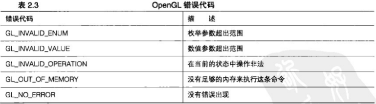

&emsp;&emsp;如果一个错误是由于对 `OpenGL` 的非法调用所致,那么这条命令或函数调用将会被忽略。对此,我们可能会稍微感到安心。此时，唯一可能造成麻烦的是那些接受指向内存的指针作为参数的函数(如果指针无效，可能导致程序崩溃)。

> 2.2.4 确认版本

&emsp;&emsp;如前面所述,有时候我们希望利用一个特定实现中的一些已知行为。如果我们确实知道程序将运行于一个特定提供商所生产的图形卡之上,就想依赖这个生产商特有的一些性能特征来强化程序。我们可能还希望限制这个特定厂商所提供驱动程序的最低版本号。为此,需要查询 `OpenGL` 的渲染引擎( `OpenGL` 驱动程序)的生产商和版本号。`GL` 函数库可以通过调用 `glGetString` 来返回与它们的版本号和生产商有关的特定信息。

```C++
const GLubyte *glGetString (GLenum name);
```

&emsp;&emsp;这个函数返回一个静态的字符串，描述 `GL` 函数库中所请求的信息。附录 `C` 中列出了 `glGetString` 条目下所有合法的参数值,以及它们所代表的GL函数库的相关信息。

> 2.2.5 使用glHint

&emsp;&emsp;俗话说,给猫剥皮的方法不止一种。在 `3D` 图形算法中,情况也是如此。例如,为了追求高性能,我们常常需要做一些权衡。或者,如果视觉逼真度是最重要的因素,那么性能就会退居其次。一种 `OpenGL` 实现常常包含两种方法来执行一个特定的任务，一种是快速的方法,在性能上稍作妥协；另一种是慢速的方法,着重于改进视觉质量。`glHint` 函数允许我们指定偏重于视觉质量还是速度,以适应各种不同类型的操作需求。这个函数定义如下所示。

```C++
void glHint (GLenum target, GLenum mode);
```

&emsp;&emsp;我们可以在 `target` 参数中指定希望进行修改的行为类型。附录 `C` 中的 `hiHint` 条目下列出了这些值,其中还包括关于纹理压缩质量和抗锯齿准确性等的提示。`mode` 参数告诉 `OpenGL` 我们最为关心的什么,例如更快的渲染速度还是最好的输出质量,或者我们可能并不关心这些(只有在这种情况下我们才会使用默认行为)。但是,我们还是应该小心在意,因为所有的 `OpenGL` 实现都不要求必须在 `glHint` 函数的调用上保持一致。在 `OpenGL` 中，这是唯—一个行为完全依赖生产商的函数。

> 2.2.6 OpenGL状态机

&emsp;&emsp;绘制 `3D` 图形是一项复杂的任务。在接下来的章节，我们将讨论许多 `OpenGL` 函数。对于一个特定的几何图形,有许多因素可能会影响它的绘制。对象是不是与背景混合?要不要进行正面或背面剔除?当前限制的是什么纹理?这样的问题数不胜数。

&emsp;&emsp;我们把这类变量的集合称为管线的状态。状态机是一个抽象的模型,表示一组状态变量的集合。每个状态变量可以有各种不同的值,或者只能可以打开或关闭等。当我们在 `OpenGL` 中进行绘图时,如果每次都要指定所有这些变量显然有点不切实际。反之, `OpenGL` 使用了一种状态模型(或称状态机)来追踪所有的 `OpenGL` 状态变量。当一个状态值被设置之后,它就一直保持这个状态,直到其他函数对它进行修改为止。许多状态只能简单地打开或关闭。例如,深度测试(参见第 `3` 章)就是要么打开、要么关闭。打开深度测试的几何绘图将会被检查以确保在进行渲染之前总会在任何位于它后面的对象前方。在深度测试关闭后进行的几何图形绘制(例如 `2D` 覆盖)则会在不进行深度比较的情况下进行绘制。

&emsp;&emsp;为了打开这些类型的状态变量,可以使用下面这个 `OpenGL` 函数。

```C++
void glEnable(GLenum capability);
```

&emsp;&emsp;我们可以使用下面这个对应的函数，把这些变量的状态设置为关闭。

```C++
void glDisable(GLenum capability);
```

&emsp;&emsp;以深度测试为例,可以使用下面这个函数调用打开深度测试。

```C++
glEnable(GL_DEPTH_TEST);
```

&emsp;&emsp;也可以使用下面这个函数调用关闭深度测试。

```C++
glDisable(GL_DEPTH_TEST);
```

&emsp;&emsp;如果希望对一个状态变量进行测试，以判断它是否已被打开，`OpenGL` 还提供了一种方便的机制。

```C++
GLboolean glIsEnabled(GLenum capability);
```

&emsp;&emsp;但是,并不是所有的状态变量都只是简单地打开或关闭。许多 `OpenGL` 函数专门用于设置变量的值,此后这些变量一直保持被设置时的值,直到再次被修改。我们在任何时候都可以查询这些变量的值。`OpenGL` 提供了一组查询函数，可以查询布尔型、整型、单精度浮点型和双精度浮点型变量的值。这 `4` 个函数的原型如下所示：

```C++
void glGetBooleanv(GLenum pname, GLboolean *parama);
void glGetDoublev(GLenum pname, GLboolean *parama);
void glGetFloatv(GLenum pname, GLboolean *parama);
void glGetIntegerv(GLenum pname, GLboolean *parama);
```

&emsp;&emsp;每个函数都会返回单个值,或者返回一个数组,把一些值存储到我们指定的地址中。附录 `C` 的参考部分列出了各种不同的参数(数量非常多)。现在,读者可能还无法理解其中的大多数参数,但是随着对本书学习的深入,读者将会逐渐开始欣赏 `OpenGL` 状态机的简洁和强大。

&nbsp;

## 2.3 建立Windows项目

> 2.3.1 包含路径

&emsp;&emsp;在微软公司的 `Windows` 系统上建立程序的方式有很多。在本书，我们将使用 `Visual C++ 2008` 速成版。这是微软公司提供的免费编译器，可以从网址 `http://www.microsoft.com/exPress` 上下载。在这个版本上创建的项目也能在这个开发环境的更新版本上使用。正如前面已经提到的,本书所有的项目都是基于 `GLEW` 、 `GLTools` 和 `freeglut` 实用库(在 `Windows` 上)的。`GLEW` “内建” 在 `GLTools` 中是因为 `GLTools` 需要 `GLEW` 来获得 `OpenGL3.0` 或更新版本的特性。而 `freeglut` 则是一个独立的库,它可以与其他 `OpenGL` 库配合使用,在我们要使用本地系统服务(参见第 `13` 章到第 `16` 章的内容)的情况下也可以独立使用。在开始创建我们的第一个新项目，或者重建本书中任何一个项目之前,我们要做的第一件事情就是将这些库的“ `include` ”文件夹添加到 `Visual Studio` 的包含搜索路径中。无论何时向编程目录中添加新的 `SDK` 或者库,都要这样做。如果读者以前还没做过这样的事，不要紧张，这只是小菜一碟，我们只要做一次就行，而不需要每次建立一个新项目时都做。

> 2.3.1 包含路径

&emsp;&emsp;打开 `Visual C++` ,从主菜单中选择 " `Tools` " (工具),然后从弹出的下拉菜单底部选择 " `Options` " (选项)。 " `Options` " 对话框如图 `2.1` 所示。展开 " `Projects and Solutions` " (项目与解决方案)树节点,并选择" `VC++ Directories` "( `VC++` 目录),然后确保 " `Show Directories For` " (显示目录)选项被设置为 " `IncludeFiles` ” （包含文件）。

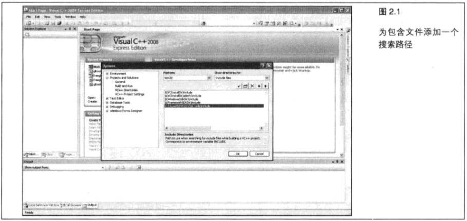

&emsp;&emsp;下方的列表是一个组合框,显示在我们向源代码中加入一个头文件时所有将被搜索的文件夹。我们需要为 `GLTools` 和 `freeglut` 添加 “ `include` ” (包含)路径。选择列表中最后的空行，在这一行单击两次，这一行就会变成可编辑区域，并且在右侧出现一个浏览按钮，如图 `2.2` 所示。

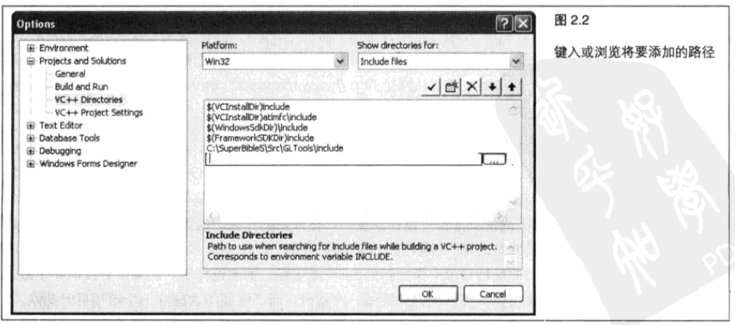

&emsp;&emsp;单击浏览按钮，就会出现一个文件浏览对话框。导航到 `GLTools` 下的 “ `include` ” 文件夹并选中它， 如图 `2.3` 所示。用同样的方法为 `freeglut` 添加 “ `include` " 路径。现在,我们已经将 `Visual C++` 设置为包 含 `GLTools`  和 `freeglut` 库了。现在可以开始创建我们的第一个项目了!

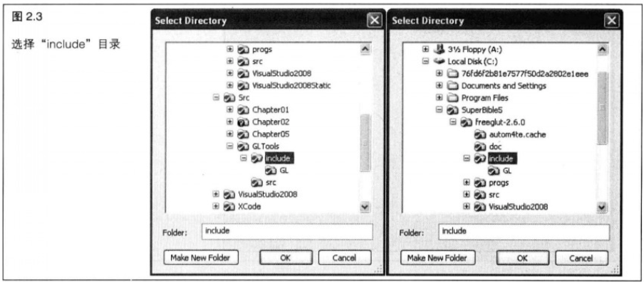

> 2.3.2 创建项目

&emsp;&emsp;如果还没有打开 `Visual C++` ，那么现在就打开它，并在主菜单中选择 “ `File` " (文件) " `New Project` " (新建项目)。基于 `GLUT` 的应用程序是 `Win32` 控制台模式的应用程序,所以要正确地进行选择,然后单击 “ `OK` " (确定),如图 `2.4` 所示。随后出现的对话框如图 `2.5` 所示,选择 “ `Empty Project` " (空工程),`C++` 就会建立一个我们需要的项目,而不是它认为标准的基于控制台的项目。

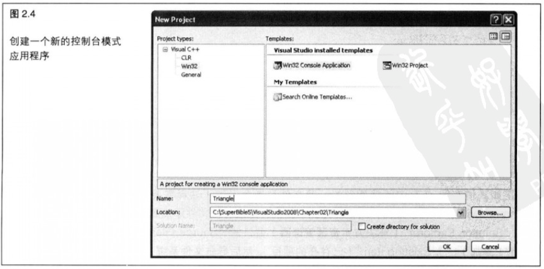

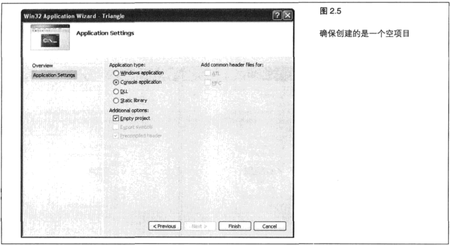

> 2.3.3 添加头文件

现在可以开始创建主源文件了。在这个项目中，我们创建一个名叫 “`triangle.cpp`” 的 `C++`文件。要完成这一步，只需选择 “`File`” (文件) “`New`” (新建)，再次在主菜单中选择 “`File`” ，选择一个新的`C++`文件，如图 `2.6` 所示。

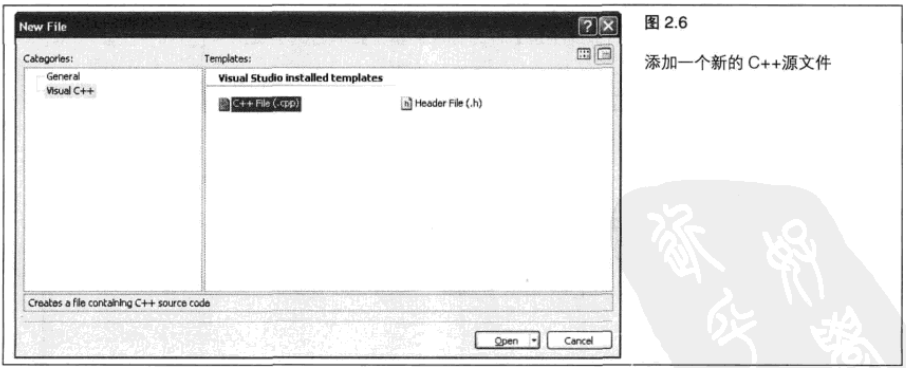

&emsp;&emsp;正如我们在图 `2.7` 中能够看到的,源文件是未命名的(注释需要人工添加)。将文件命名为 “ `triangle.cpp` ” 并保存。然而,到目前为止,我们仍然没有把文件添加到项目中。要完成这一步,只需在 " `Solution Explorer` " (解决方案资源管理器)窗口的 " `Source Files` " 文件夹上单击右键,选择 " `Add` " (添加) " `Existing Item` " (已存在的项目),然后导航文件系统,直到定位到 " `triangle.cpp` " 源文件。

&emsp;&emsp;我们差不多完成了。最后，需要将 `GLTools` 和 `freeglut` 库添加到项目中。将一个库添加到项目中，方法不止一种,我们使用最简单、最容易的方式来亲自操作一下。在项目名称上单击右键,并选择 "` Add `" (添加) " `Existing Item` " (已存在的项目),就像添加 " `triangle.cpp` " 源文件时一样。但是,这一次我们导航到 " `/Freeglut-2.6.0/VisualStudio2008Static/Release` "文件夹,并选择 “ `Freeglut_static.lib` " 文件，如图 `2.8` 所示。

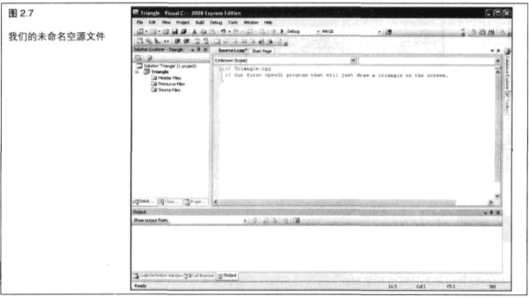

&emsp;&emsp;用同样的方法添加 `GLTools` 库,位置在" `VisualStudio2008/GLTools/Release folder` "。图 `2.9` 所示是我们建立完成的项目，已经完全做好准备来开始我们的第一个 `OpenGL` 程序了！

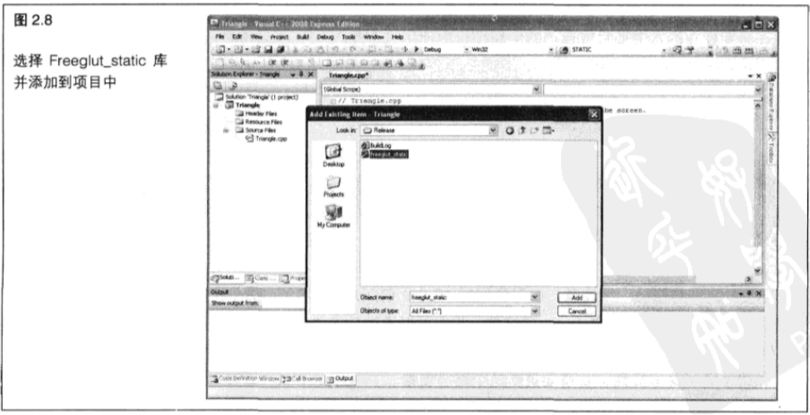

&nbsp;

## 2.4 建立Mac OS X项目

> 2.4.1 自定义创建设置

+ ...

> 2.4.2 创建新项目

+ ...

> 2.4.3 框架，头文件和库

+ ...

&nbsp;

## 2.5 第一个三角形

&emsp;&emsp;现在我们已经打好了基础,终于可以开始编写代码了!我们的第一个示例程序仅仅是在蓝色的背景上绘制一个红色的三角形。这乍看起来似乎没什么挑战性，但它实践了所有必要的步骤，并创建了一个完整的演示框架供本书以后使用。在创建过程中,我们能够学习 `GLUT` ,并使用第一个 `GLTools` 帮助程序和类。我们的三角形程序如图 `2.17` 所示,而程序清单 `2.1` 则完整地列出了我们的第一个程序。接下来我们将一行一行地讨论它。

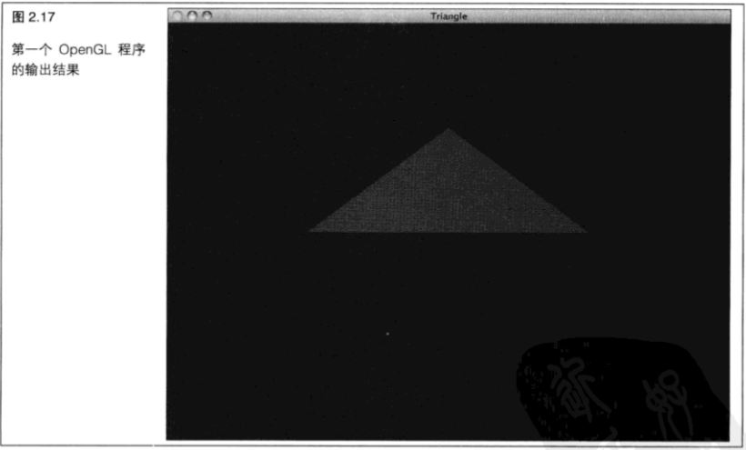

```C++
// Triangle.cpp
// Our first OpenGL program that will just draw a triangle on the screen.

#include <GLTools.h>            // OpenGL toolkit
#include <GLShaderManager.h>    // Shader Manager Class

#ifdef __APPLE__
#include <glut/glut.h>          // OS X version of GLUT
#else
#define FREEGLUT_STATIC
#include <GL/glut.h>            // Windows FreeGlut equivalent
#endif

GLBatch	triangleBatch;
GLShaderManager	shaderManager;

///////////////////////////////////////////////////////////////////////////////
// Window has changed size, or has just been created. In either case, we need
// to use the window dimensions to set the viewport and the projection matrix.
void ChangeSize(int w, int h)
{
	glViewport(0, 0, w, h);
}


///////////////////////////////////////////////////////////////////////////////
// This function does any needed initialization on the rendering context. 
// This is the first opportunity to do any OpenGL related tasks.
void SetupRC()
{
	// Blue background
	glClearColor(0.0f, 0.0f, 1.0f, 1.0f );
    
	shaderManager.InitializeStockShaders();

	// Load up a triangle
	GLfloat vVerts[] = { -0.5f, 0.0f, 0.0f, 
		                  0.5f, 0.0f, 0.0f,
						  0.0f, 0.5f, 0.0f };

	triangleBatch.Begin(GL_TRIANGLES, 3);
	triangleBatch.CopyVertexData3f(vVerts);
	triangleBatch.End();
}

///////////////////////////////////////////////////////////////////////////////
// Called to draw scene
void RenderScene(void)
{
	// Clear the window with current clearing color
	glClear(GL_COLOR_BUFFER_BIT | GL_DEPTH_BUFFER_BIT | GL_STENCIL_BUFFER_BIT);

	GLfloat vRed[] = { 1.0f, 0.0f, 0.0f, 1.0f };
	shaderManager.UseStockShader(GLT_SHADER_IDENTITY, vRed);
	triangleBatch.Draw();

	// Perform the buffer swap to display back buffer
	glutSwapBuffers();
}

///////////////////////////////////////////////////////////////////////////////
// Main entry point for GLUT based programs
int main(int argc, char* argv[])
{
	gltSetWorkingDirectory(argv[0]);
	
	glutInit(&argc, argv);
	glutInitDisplayMode(GLUT_DOUBLE | GLUT_RGBA | GLUT_DEPTH | GLUT_STENCIL);
	glutInitWindowSize(800, 600);
	glutCreateWindow("Triangle");
    glutReshapeFunc(ChangeSize);
    glutDisplayFunc(RenderScene);

	GLenum err = glewInit();
	if (GLEW_OK != err) {
		fprintf(stderr, "GLEW Error: %s\n", glewGetErrorString(err));
		return 1;
    }
	
	SetupRC();

	glutMainLoop();
	return 0;
}
```

> 2.5.1 要包含什么

&emsp;&emsp;在开始编写任何 `C++` (或者只是 `C` )程序之前,都要先将要用到的函数和类定义的头文件包含进来。为了达到目的,最低限度也要包含如下头文件。

```C++
#include <GLTools.h>            // OpenGL toolkit
#include <GLShaderManager.h>    // Shader Manager Class

#ifdef __APPLE__
#include <glut/glut.h>          // OS X version of GLUT
#else
#define FREEGLUT_STATIC
#include <GL/glut.h>            // Windows FreeGlut equivalent
#endif
```

&emsp;&emsp;`GLTools.h` 头文件中包含了大部分 `GLTools` 中类似C语言的独立函数,而每个 `GLTools` 的 `C++` 类则有自己的头文件。`GLShaderManager.h` 移入了 `GLTools` 着色器管理器( `Shader Manager` )类。没有着色器,我们就不能在OpenGL (核心框架)中进行着色。着色器管理器不仅允许我们创建并管理着色器,还提供一组“存储着色器”( `Stock Shader` )，它们能够进行一些初步和基本的渲染操作。在第 `3` 章中我们将详细讨论这部分内容。

&emsp;&emsp;根据应用程序是否是在 `Mac` 上创建的, `GLUT` 将采取不同的处理方式。在 `Windows` 和 `Linux` 上,我们使用 `freeglut` 的静态库版本,这就需要在它前面添加 `FREEGLUT_STATIC` 处理器宏。

> 2.5.2 启动 GLUT

&emsp;&emsp;下面我们直接跳到程序清单的最后一个函数,即所有 `C` 程序的入口点,这里才是程序处理实际开始的地方。

```C++
///////////////////////////////////////////////////////////////////////////////
// Main entry point for GLUT based programs
int main(int argc, char* argv[])
{
	gltSetWorkingDirectory(argv[0]);
```

&emsp;&emsp;控制合模式的 `C` 语言和 `C++` 程序总是从" `mian` ”函数开始处理。对于有经验的 `Windows` 迷来说,在本例中找不到 `WinMain` 函数是十分奇怪的。这是因为我们是以一个控制台模式的应用程序开始的,所以没必要从创建窗口和消息循环开始。在 `Win32` 中,我们可以从控制台应用程序建立图形窗口,就像我们可以从 `GUI` 应用程序建立控制台窗口一样。`GLUT` 库隐藏了这些细节(请记住, `GLUT` 库就是设计用来隐藏这些平台相关细节的)。

&emsp;&emsp;`GLTools` 函数 `gltSetWorkingDrectory` 用来设置当前工作目录。实际上在 `Windows` 中是不必要的,因为工作目录默认就是与程序的可执行执行程序相同的目录。但是在 `MacOSX` 中,这个程序将当前工作文件夹改为应用程序捆绑包( `Application Bundle` )中的 `/Resource` 文件夹。`GLUT` 的优先设定自动进行了这种设置，但是这种方法更加安全，也总是奏效的，即使其他程序改变了这项设置时也是如此。这在我们以后想要载入纹理文件或模型数据时会派上用场。

&emsp;&emsp;接下来,我们将进行一些基于 `GLUT` 的标准设置。首先要调用 `glutinit` 函数,这个函数只是传输命令行参数并初始化 `GLUT` 库。

```C++
glutInit(&argc, argv);
```

&emsp;&emsp;然后我们必须告诉 `GLUT` 库，在创建窗口时要使用哪种类型的显示模式。

```C++
glutInitDisplayMode(GLUT_DOUBLE | GLUT_RGBA | GLUT_DEPTH | GLUT_STENCIL);
```

&emsp;&emsp;这里的标志告诉它要使用双缓冲窗口( `GLUT_DOUBLE` )和 `RGBA` 颜色模式( `GLUT_RGBA` )。双缓冲窗口()是指绘图命令实际上是在离屏缓冲区执行的,然后迅速转换成窗口视图。这种方式经常用来生成动画效果,本章稍后将做演示。`GLUT_DEPTH`位标志将一个深度缓冲区分配为显示的一部分,因此我们能够执行深度测试,同样, `GLUT_STENCIL` 确保我们也会有一个可用的模板缓冲区。深度和模板测试后面都会讲到。

```C++
glutInitWindowSize(800, 600);
glutCreateWindow("Triangle");
```

&emsp;&emsp;`GLUT` 内部运行一个本地消息循环，拦截适当的消息，然后调用我们为不同时间注册的回调函数。与使用真正的系统特定框架相比有一定的局限性,但是大大简化了组织并运行一个程序的过程,并且支持一个演示框架的最低限度的事件。在这里,我们必须为窗口改变大小而设置一个回调函数,以便能够设置视点,还要注册一个函数以包含 `OpenGL` 渲染代码。

```C++
glutReshapeFunc(ChangeSize);
glutDisplayFunc(RenderScene);
```

&emsp;&emsp;`ChangeSize` 和 `RenderScene` 函数很快就会讲到,但是在开始运行主消息循环之前,还要解决两件事情。第一件事情就是初始化 `GLEW` 库。重新调用 `GLEW` 库初始化 `OpenGL` 驱动程序中所有丟失的入口点,以确保 `OpenGL API` 对我们来说完全可用。调用 `glewinit` 一次就能完成这一步,在试图做任何渲染之前,还要检查确定驱动程序的初始化过程中没有出现任何问题。

```C++
GLenum err = glewInit();
if (GLEW_OK != err)
{
    fprintf(stderr, "GLEW Error: %s\n", glewGetErrorString(err));
    return 1;
}
```


&emsp;&emsp;最后一项准备工作就是调用 `SetupRC` 。

```C++
SetupRC();
```

&emsp;&emsp;实际上这个函数对GLUT没有什么影响,但是在实际开始渲染之前,我们在这里进行任何 `OpenGL` 初始化都非常方便。这里的 `RC` 代表渲染环境( `Rendering Context` ),这是一个运行中的 `OpenGL` 状态机的句柄。在任何 `OpenGL` 函数起作用之前必须创建一个渲染环境,而 `GLUT` 在我们第一次创建窗口时就完成了这项工作。关于特定操作系统的章节(第 `13` 章到第 `16` 章)中会研究这方面的更多细节。纵观全书，我们将在这里进行预加载纹理，建立几何图形、渲染器等工作。

&emsp;&emsp;最后，我们可以开始主消息循环并结束 `main` 函数了。

```C++
glutMainLoop();
```

&emsp;&emsp;`GlutMainLoop`函数被调用之后,在主窗口被关闭之前都不会返回,并且一个应用程序中只需调用一次。这个函数负责处理所有操作系统特定的消息、按键动作等，直到我们关闭程序为止。它还能确保我们注册的这些回调函数被正确地调用。

> 2.5.3 坐标系基础

&emsp;&emsp;在早期的所有窗口化环境中,用户可以在任何时候改变窗口的大小和维度。甚至在编写一个总是运行在全屏模式下的游戏时，窗口仍然认为至少改变了一次窗口大小——就是在窗口创建时。在进行这些改变时,窗口通常会根据新的维度相应重绘它的内容。有时候,我们可能想要在一个小的窗口中截取绘图内容,或者在原始的大窗口中显示完整的绘图内容。为了达到目的,我们常常希望缩放绘图内容来适应窗口,不论绘图内容和窗口的大小如何。这样,一个很小的窗口可以显示一个完整但是很小的绘图内容,而一个很大的窗口也可以显示相似但是更大的绘图内容。

&emsp;&emsp;在第一章，我们讨论了视口和视景体是如何影响 `2D` 和 `3D` 绘图内容在计算机屏幕上 `2D` 窗口上的坐标范围和缩放的。现在,我们来讨论OpenGL中的视口和裁减区域坐标( `Clipping VolumeCoordinate` )。在某种程度上,设置坐标系是绘制对象并将它们显示到我们希望的屏幕位置的先决条件！

&emsp;&emsp;尽管我们所绘制的图形是一个2D的平面三角形,但它实际是在一个3D坐标空间中绘制的。在本章中,我们将使用默认的笛卡尔坐标系统,这个坐标系统在 `x` 、`y` 和 `z` 方向上从 `-1` 到 `+1` 延伸。`x` 是坐标系的横坐标轴, `y` 是纵坐标轴,而 `z` 轴正方向从屏幕向外指向使用者。坐标( `0` , `0` , `0` )则位于屏幕的正中。在第 `4` 章,我们将更细致地讨论关于建立代替坐标系的问题。为了达到目的,我们在 `2=0` 的 `xy` 平面上绘制三角形。我们的视角是从 `z` 轴的正半轴看去,所看到的是 `z=0` 情况下的三角形(如果读者对这方面的内容感到困惑,可以回顾第 `1` 章的相关资料)。

&emsp;&emsp;图 `2.18` 所示是基本笛卡尔坐标系的外观。许多绘图和图形库都使用窗口坐标(像素)来完成绘制命令。使用实数浮点(这看上去有点随意)坐标系统进行渲染,这常常令许多新手非常不习惯。不过,在创建了几个程序之后,读者很快就会对此习以为常。

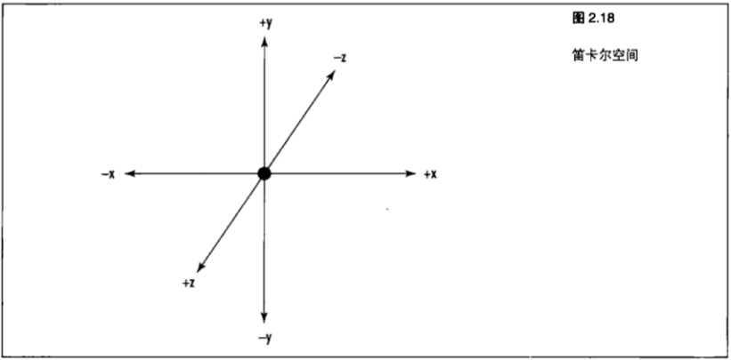

&emsp;&emsp;**定义视口**

&emsp;&emsp;由于在不同环境下窗口的大小变化的检测和处理方式也不同, `GLUT` 库为此专门提供了 `glutrReshapeFunc` 函数,这个函数注册了一个回调,供 `GLUT` 库在窗口维度改变时调用。我们传递到 `glutrReshapeFunc` 的函数原形如下。

```C++
void ChangeSize(GLsizei w, GLsizei h);
```

&emsp;&emsp;我们选择 `ChangeSize` 作为这个函数的描述性名称,并且在以后的示例中也会使用这个名称。

```C++
void ChangeSize(int w, int h)
{
    glViewport(0, 0, w, h);
}
```

&emsp;&emsp;`ChangeSize` 函数在窗口大小改变时接受新的宽度和高度。我们可以使用这个信息，在 `OpenGl` 函数`glViewport` 的帮助下修改从目的坐标系到屏幕坐标系上的映射。要理解视口分辨率,让我们更仔细地观察 `ChangeSize` 函数中调用带有窗口的新宽度和高度的 `glViewport` 函数的部分。`glViewport` 函数定义如下。

```C++
void glViewport (GLint x, GLint y, GLsizei width, GLsizei height);
```

&emsp;&emsp;其中 `x` 参数和 `y` 参数代表窗口中视口的左下角坐标，而宽度和高度参数是用像素表示的。通常 `×` 和 `y` 都为 `0` ,但是我们可以使用视口在窗口中的不同区城渲染多个图形。视口以实际屏幕坐标定义了窗口中的区域, `OpenGL` 可以在这个区域中进行绘图(如图 `2.19` 所示)的裁剪区域被映射到新的视口。如果指定了一个比窗口坐标更小的视口，渲染区域就会缩小，如图 `2.19` 所示。

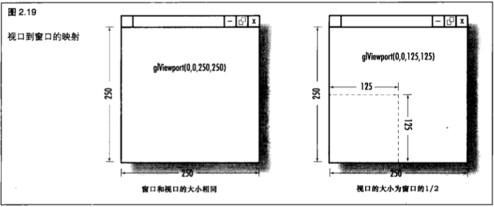

&emsp;&emsp;**从笛卡尔坐标系到像素**

&emsp;&emsp;在开始将几何图形光栅化(实际绘制)到屏幕上时, `OpenGL` 负责笛卡尔坐标系和窗口像素间的映射。我们要牢记一点，就是改变视口并不会改变基础坐标系。由于我们采用的是默认的从 `-1` 到 `+1` 的映射，为三角形改变窗口大小会产生一些有趣的结果，如图 `2.20` 所示。

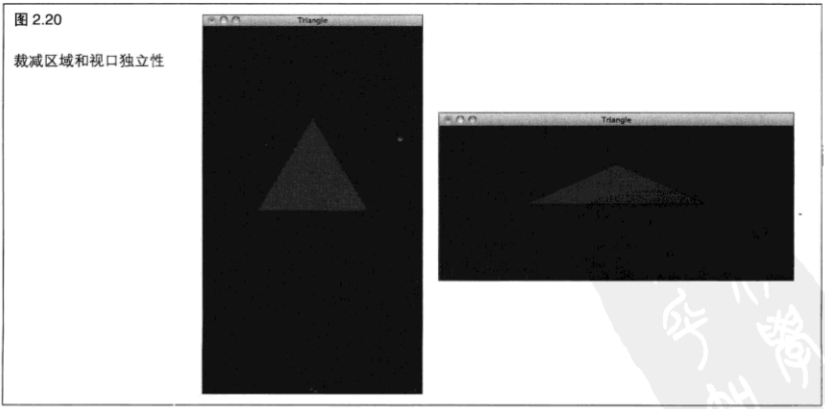

&emsp;&emsp;在图 `2.20` 左侧图中，我们可以看到 `+1` 到`-1` 的范围在垂直方向是如何比水平方向延伸得更多的，而在右侧图中,则可以看到相反的效果。我们要先了解更多内容,然后才能考虑如何改变坐标系以响应窗口大小的变化,就像前面说过的,我们会在第 `4` 章完整地做完这项工作。

> 2.5.4 完成设置

&emsp;&emsp;在开始 `main` 函数中的 `GLUT` 主循环之前，先调用 `SetupRC` 函数。这时要为程序做一些一次性的设置。首先要做的就是调用一下函数设置背景颜色。

```C++
glClearColor(0.0f, 0.0f, 1.0f, 1.0f);
```

&emsp;&emsp;这个函数设置用来进行窗口清除的颜色,它的函数原型如下所示。

```C++
void glClearColor(GLclampf red, GLclampf green, GLclampf blue, GLclampf alpha):
```

&emsp;&emsp;在大多数 `OpenGL` 实现下, `GLclampf` 都被定义为一个浮点值。每个参数都包含最终颜色所要求的这种颜色分量的权值。这个函数不会立即清除背景,而是设置在以后颜色缓冲区被清除(可能是重复的)时使用的颜色。

&emsp;&emsp;**RGB 颜色空间**

&emsp;&emsp;在 `OpenGL` 中,某种颜色是由红、绿、蓝和 `Alpha` (用于表示透明度)分量混合而成的。每种分量值的范围为从 `0.0` 至 `1.0` 。这类似于在 Windows 中使用 `RGB` 宏创建 `COLORREF` 值的方式。不同的是在Windows中, `COLORREF`值的每种颜色成分范围在 `0` 至 `255` 之间,总共可以产生 `256 x 256 x 256` (超过 `1600` 万)种颜色。在 `OpenGL` 中，每种成分的值可以是 `0` 至 `1` 之间任何有效的浮点值，因此理论上可以产生的颜色数量是无限的。从现实的角度讲,在绝大多数设备中,颜色值的输出限制在 `24` 位( `1600` 万种颜色)。

&emsp;&emsp;很自然, `OpenGL` 接受这个颜色值,并在内部把它转换为能够与可用的视频硬件准确匹配的最接近颜色。表 `2.2` 列出了一些常见的颜色以及它们的分量值。我们可以在任何与颜色相关的 `OpenGL` 函数中使用这些值。

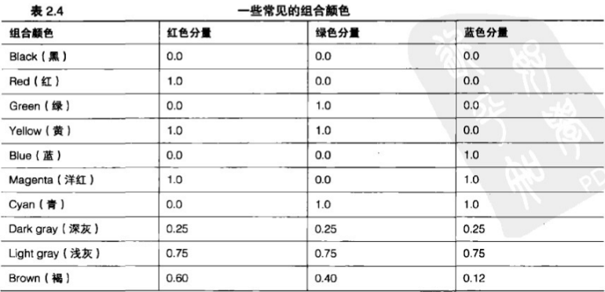</br>
</br>

&emsp;&emsp;`glClearColor` 的最后一个参数是 `alpha` 分量,它用来进行混合,并且可以产生一些特殊的效果,例如透明。透明是指一个物体允许光线穿过它。假定我们希望创建一块染成红色的玻璃，并且它的后面正好有一束蓝色的光。这道蓝光就会影响这块玻璃上的红色(蓝+红=紫)。我们可以用 `alpha` 成分值生成一种半透明的红色,使它看上去像是一块玻璃,它后面的物体也能够显示。这种类型的效果并不是仅仅靠使用 `alpha` 值就行了。在第 `3` 章,我们将详细讨论这个话题。在这之前,可以一直把 `alpha` 值设置为  `1` 。

&emsp;&emsp;**存储着色器**

&emsp;&emsp;没有着色器,在 `OpenGL` 核心框架中就无法进行任何渲染。在第 `6` 章“跳出“盒子”:非存储着色器中,我们将讨论如何编写着色器,以及如何编译和链接它们从而水它们可用。在那之前,我们先使用一些简单的存储着色器,它们可以用着色器管理器进行管理。我们要在源文件的开头部分声明一个着色器管理器的实例,如下所示:

```C++
GLShaderManager shaderManager;
```

&emsp;&emsp;我们也可以在第 `3` 章来熟悉这些着色器,并学习如何使用它们。但是着色器管理器需要编译和链接它自己的着色器,所以我们必须在 `OpenGL` 初始化时调用 `InitializeStockShaders` 方法。

```C++
shaderManager.InitializeStockShaders();
```

&emsp;&emsp;**指定顶点**

&emsp;&emsp;接下来我们要做的是设置三角形。在 `OpenGL` 中,三角形是一种“图元”类型,是一种基本的 `3D` 绘图元素。在第 `3` 章,我们会非常详细地讨论在 `OpenGL` 将会用到的所有 `7` 种图元。但在这里,我们只要了解一个三角形图元就是空间中的一系列组成一个三角形的顶点或点就可以了。我们通过将这些顶点放进一个单个浮点数组来指定它们。这个数组命名为 `vVerts` ，其中包含所有  `3` 个顶点的 `×` 、`y` 、`z` 笛卡尔坐标对。请注意我们将所有 `3` 个点的 `z` 坐标都设为 `0` 。

```C++
GLfloat vVerts[] = { -0.5f, 0.0f, 0.0f,
    0.5f, 0.0f, 0.0f,
    0.0f, 0.5f, 0.0f };
```

&emsp;&emsp;在本书中有两章会讲解关于提交一个批次的顶点用于渲染的内容,即第 `3` 章和第 `12` 章,其中第 `12` 章将涉及更多的底层细节。一个简单的封装类( `Wrapper Class` )会将三角形顶点批次进行封装，而我们则在源文件顶部附近声明一个这个  `GLBatch` 类的实例。

```C++
GLBatch triangleBatch;
```

&emsp;&emsp;在我们的设置函数中，下列代码建立了一个三角形的批次，仅包含 `3` 个顶点。在第 `3` 章我们将对此做进一步的讨论。

```C++
triangleBatch.Begin(GL_TRIANGLES, 3);
triangleBatch.CopyVertexData3f(vVerts);
triangleBatch.End();
```

> 2.5.5 言归正传

&emsp;&emsp;最后，终于可以真正开始渲染，前面将清除颜色设置为蓝色，现在需要执行一个函数真正进行清除。

```C++
glClear(GL_COLOR_BUFFER_BIT | GL_DEPTH_BUFFER_BIT | GL_STENCIL_BUFFER_BIT);
```

&emsp;&emsp;`glClear` 函数清除一个或一组特点的缓冲区。缓冲区是一块存储图像的空间。`r, g, b ,a` 通常一起作为颜色缓冲区或像素缓冲区引用。

&emsp;&emsp;在 `OpenGL` 中有不止一种缓冲区(颜色缓冲区、深度缓冲区和模版缓冲区)供使用。在本书后面的内容中将详细介绍这些缓冲区。在前面的示例中,我们使用按位或( `Bitwise OR` )操作来同时清除所有这3种缓冲区。在接下来的几章中,我们真正需要理解的是,颜色缓冲区是显示图像在内部存储的地方,以及通过 `glClear` 清除缓冲区会将屏幕上最后绘制的内容删除。我们还会看到术语 “帧缓冲区” ( `Framebuffer` )，指的是所有这些缓冲区一起串联工作。

&emsp;&emsp;下面的 `3` 行代码将真正执行操作，这也是整个第 `3` 章的主要课题！我们设置一组浮点数来表示红色(其 `alpha` 值设为 `1.0` )，并将它传递到存储着色器，即 `GLT_SHADER_IDENTITY` 着色器。这个着色器只是使用指定颜色以默认笛卡尔坐标系在屏幕上渲染几何图形。

```C++
GLfloat vRed[] = { 1.0f, 0.0f, 0.0f, 1.0f };
shaderManager.UseStockShader(GLT_SHADER_IDENTITY, vRed);
triangleBatch.Draw();
```

&emsp;&emsp;`GLBatch` 的 `Draw` 方法指示将几何图形提交到着色器,然后 啊哈!--红色三角形 哦,差不多是。还有最后一个细节。当设置OpenGL窗口时,我们指定要一个双缓冲区渲染环境。这就意味着将在后台缓冲区进行渲染,然后在结束时交换到前台。这种形式能够防止观察者看到可能伴随着动画帧与动画帧之间闪烁的渲染过程。缓冲区交换将以平台特定的方式进行,但是 `GLUT` 有一个单独的函数调用可以完成这项工作。

```C++
glutSwapBuffers();
```

&emsp;&emsp;现在我们可以鞠躬谢幕了。我们已经用 `OpenGL` 渲染了第一个三角形。

&nbsp;

## 2.6 加点儿活

&emsp;&emsp;现在我们已经了解如何使 `GLUT` 完成一个图形演示框架所能完成的最重要工作，也就是在屏幕上渲染图形了。我们可以再加入一点小功能，使它能让用户对渲染进行一些互动，例如通过按箭头键移动图形。一点动画效果就能使图形演示变得有活力。示例程序的“ `Move` "就能做到这一点。它在窗口的正中绘制了一个正方形(实际上我们使用了另一个图元,这次是 `GLTRIANGLE_FUN` )。在按箭头键时,正方形将上下或左右移动。分别用向上箭头和向下箭头中的哪一个来实现这两种运动则由读者决定。

> 2.6.1 特殊按键

&emsp;&emsp;`GLUT` 还提供了另一个回调函数,即 `glutSpecialFunc` 。它注册了一个能够在按一个特殊按键时被调用的函数。在 `GLUT` 的语法中，特殊按键是指功能键或者方向键(上、下、左、右箭头键，`page up/down` 键等)中的一个。在主函数中加入下面的代码行,来注册 `SpecialKeys` 回调函数。

```C++
glutSpecialFunc (SpecialKeys);
```

&emsp;&emsp;它在按键时接受一个相应的按键编码,以及在使用鼠标时光标的 `x` 和 `y` 坐标位置(像素形式)。

&emsp;&emsp;在“ `Move` ”示例程序中，我们将顶点存储在一个全局（对于这个模型来说）数组中，这样我们就能够在按键时相应修改正方形的位置了。程序清单 `2.2` 展示了 `SpecialKeys` 函数的完整代码,这里我们还进行了碰撞检测,这样正方形就不会移出窗口范围了。请注意,我们可以轻松地更新批次位置,只需复制新的顶点数据即可。

```C++
squareBatch.CopyVertexData3f (vVerts);
```

```C++
void SpecialKeys(int key, int x, int y)
{
    GLfloat stepSize = 0.025f;

    GLfloat blockX = vVerts[0];
    GLfloat blockY = vVerts[7];

    if (key == GLUT_KEY_UP)
        blockY += stepSize;

    if (key == GLUT_KEY_DOWN)
        blockY -= stepSize;

    if (key == GLUT_KEY_LEFT)
        blockX -= stepSize;

    if (key == GLUT_KEY_RIGHT)
        blockX += stepSize;

    if (blockX < -1.0f) blockX = -1.0f;
    if (blockX > (1.0f - blockSize * 2)) blockX = 1.0f - blockSize * 2;
    if (blockY < -1.0f + blockSize * 2) blockY = -1.0f + blockSize * 2;
    if (blockY > 1.0f) blockY = 1.0f;

    vVerts[0] = blockX;
    vVerts[1] = blockY - blockSize * 2;

    vVerts[3] = blockX + blockSize * 2;
    vVerts[4] = blockY - blockSize * 2;

    vVerts[6] = blockX + blockSize * 2;
    vVerts[7] = blockY;

    vVerts[9] = blockX;
    vVerts[10] = blockY;

    squareBatch.CopyVertexData3f(vVerts);

    glutPostRedisplay();
}
```

> 2.6.2 刷新显示

&emsp;&emsp;`SpecialKeys` 函数的最后一行代码用来告诉 `GLUT` 需要更新窗口内容。

```C++
glutPostRedisplay();
```

&emsp;&emsp;默认情况下，在窗口创建、改变大小或者需要重绘时，`GLUT` 通过调用 `RenderScene` 函数来更新窗口。只要窗口发生最小化、恢复、最大化、覆盖或重新显示等变化,就会发生更新。我们可以人工调用 `glutPostRedisplay` 来告诉 `GLUT` 发生了某些改变,应该对场景进行渲染了。不过,用后面将要介绍的方法来完成这项工作尤其方便。

> 2.6.3 简单动画

&emsp;&emsp;在“ `Move` ”示例中,当我们按箭头键时,更新了几何图形位置,然后调用 `glutPostRedisplay` 函数激活屏幕刷新动作。如果我们将 `glutPostRedisplay` 函数调用在 `RenderScene` 函数末尾将会发生什么呢?如果读者想到的是得到一个持续自动刷新的程序，那么恭喜，答对了。但是不要担心，这并不是一个无限循环。重绘消息实际是一条传递到一个内部消息循环中的消息，在屏幕刷新的间隔中，也会发生其他窗口事件。这就是说，我们仍然可以检测按键动作、鼠标移动、改变窗口大小和程序结束等动作。

```C++
///////////////////////////////////////////////////////////////////////////////
// Called to draw scene
void RenderScene(void)
{
	// Clear the window with current clearing color
	glClear(GL_COLOR_BUFFER_BIT | GL_DEPTH_BUFFER_BIT | GL_STENCIL_BUFFER_BIT);

	GLfloat vRed[] = { 1.0f, 0.0f, 0.0f, 1.0f };
	shaderManager.UseStockShader(GLT_SHADER_IDENTITY, vRed);
	triangleBatch.Draw();

	// Perform the buffer swap to display back buffer
	glutSwapBuffers();
}
```

&nbsp;

## 2.7 总结

&emsp;&emsp;在本章,我们讨论了许多基础知识。我们介绍了 `OpenGL` ,并简单地介绍了它的历史。另外，还介绍了 `OpenGL` 工具箱( `GLUT` ),并讨论了使用 `OpenGL` 编写程序的基础知识。利用 `GLUT` ,我们还展示了创建窗口并使用 `OpenGL` 命令在窗口中进行绘图的最简便方法,并学习了如何使用 `GLUT` 函数库创建一个可以改变大小的窗口,并创建了一个简单的动画示例程序。此外,我们还介绍了使用OpenGL进行绘图的过程--合成和选择颜色、清除屏幕、绘制三角形和矩形并在窗口帧中设置视口。我们还讨论了各种 `OpenGL` 数据类型以及生成 `OpenGL` 程序所需要的头文件,并引导读者分别在 `Visual Studio` ( `Windows` 系统)和 `Xcode` ( `Mac OSX` )系统中创建项目。

&emsp;&emsp;`OpenGL` 状态机奠定了我们以后用到的几乎所有操作的基础;扩展机制使我们能够访问自己所使用的硬件驱动程序支持的所有 `OpenGL` 特性,而不必考虑自己所使用的是什么开发工具。我们还学习了如何检查 `OpenGL` 错误,确保程序中并未出现任何非法的状态改变或渲染命令。稍微再熟悉一些代码以后,读者就可以掌握进一步学习所需的一些知识了。
