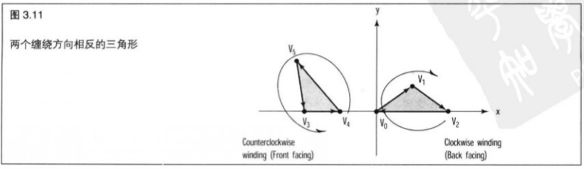

# 基础渲染

+ OpenGL 渲染基础架构

+ 如何使用 7 种 OpenGL 几何图元

+ 如何使用存储着色器

+ 如何使用 uniform 值和属性

+ 如何使用GLBatch帮助类传递几何图形

+ 如何执行深度测试和背面消除

+ 如何绘制透明或混合几何图形

+ 如何绘制抗锯齿点、线和多边形

&emsp;&emsp;如果读者曾经学习过化学课(即使没学过化学也可能知道)，应该知道所有的物质都是由原子组成的，而且所有的原子只由 `3` 样东西组成:质子、中子和电子。我们在生活中所接触过的所有材料和物质,从玫瑰花瓣到沙滩上的沙子,都是由这 `3` 种基本成分组成的,只是在排列上有所不同而已。尽管对于小学三四年级文化程度的人而言,这样的解释未免显得简单,但它说明了一个放之四海而皆准的道理:可以用一些简单的建筑块创建高度复杂和漂亮优雅的结构。

&emsp;&emsp;这个道理和 `OpenGL` 的联系是显而易见的。`OpenGL` 所创建的物体和场景也是由更小、更简单的形状所组成的,并且是按照各种各样独一无二的方式进行排列和组合的。本章将讨论组成 `3D` 物体的这些建筑块,称为图元( `Primivtives` )。在 `OpenGL` 中,所有的图元都是一维、二维或三维的物体,从简单的点和线直到复杂的多边形都是如此。在本章中,读者将学习用这些简单的形状在三维空间中绘制各种物体时所需的各种知识。

&nbsp;

## 3.1 基础图形管线

&emsp;&emsp;`OpenGL` 中的图元只不过是顶点的集合以预定义的方式结合在一起罢了。例如，一个单独的点就是一个图元,它只需要一个顶点。三角形则是另外一个例子,它是由 `3` 个顶点组成的图元。在我们讨论不同种类的图元之前,先来看看一个图元是如何由读独立的顶点组合而成的。基础渲染管线接受 `3` 个顶点并将它们转换成一个三角形。它还可能应用颜色、一个或多个纹理并且移动它们的位置。这种管线也是可编程的,实际上我们编写了两个程序,图形硬件执行它们来处理顶点数据并在屏幕上填充像素【我们称它们为片段(复数),因为实际上在同一个像素上的片段可能会有不止一个】为了便于理解 `OpenGL` 上的这种基础处理工作，让我们先来看一看 `OpenGL` 渲染管线的一个简化版本，如图 `3.1` 所示。


> 3.1.1 客户端-服务器

&emsp;&emsp;首先请注意我们将管线分成了两部分。上半部分是客户机端,而下半部分则是服务器端。这种基本的客户机-服务器设计是在管线的客户机端在功能上从服务器端分离出来时开始采用的。就 `OpenGL` 而言,客户端是存储在 `CPU` 存储器中的,并且在应用程序中执行,或者在主系统内存的驱动程序中执行。驱动程序将渲染命令与数据组合起来,并发送到服务器执行。在一台典型的桌面计算机上,服务器会跨越一些系统总线，实际上，它就是图形加速卡上的硬件和内存。

&emsp;&emsp;服务器和客户机在功能上也是异步的,也就是说它们是各自独立的软件块或硬件块,或者软硬件都有。为了获得最佳性能,我们希望两方面都尽可能不停地工作。客户机不断地将数据块和命令块组合在一起并送入缓冲区,然后这些缓冲区会发送到服务器执行。服务器将执行这些缓冲区的内容,与此同时客户端又做好了发送下一个用于渲染的数据或信息的准备。如果服务器停止工作等待客户机,或者客户机停止工作来等待服务器做好接受更多命令和数据的准备,我们就把这种情况称为管线停滞。管线停滞是注重性能的程序员的噩梦,我们真的不希望 `CPU` 或者 `GPU` 无所事事地等待工作。

> 3.2.1 着色器

&emsp;&emsp;图 `3.1` 所示的两个最大的框图代表顶点着色器和片段着色器。着色器是使用 `GLSL` (我们将在第 `6` 章讨论 `GLSL` 编程）编写的程序。`GLSL` 看起来与 `C` 语言非常类似，实际上 `GLSL` 语言的程序甚至是以我们熟悉的 `main` 函数开始的。这些着色器必须从源代码中编译和链接到一起(这一点仍然和 `C` 、`C++` 程序非常类似)才能使用。最终准备就绪的着色器程序随后在第一阶段构成顶点着色器,在第二阶段构成片段着色器。请注意,我们目前讨论的是简化的方式。实际上还有一种几何着色器可以(选择性地)安排在两者之间，就像用来将数据来回传递的所有类型的反馈机制一样。还有一些传递片段的处理特性，诸如混合、模板和深度测试,我们将在后面进行讨论。

&emsp;&emsp;顶点着色器处理从客户机输入的数据,应用变换,或者进行其他类型的数学运算来计算光照效果、位移、颜色值，等等。为了渲染一个共有 `3` 个顶点的三角形，顶点着色器将执行 `3` 次，也就是为每个顶点执行一次。在目前的硬件上有多个执行单元同时运行,这就意味着所有这 `3` 个顶点都可以同时进行处理。今天的图形处理器属于大规模并行计算机。不要将它们和 `CPU` 相比而被时钟速度蒙蔽，它们比图形操作要快上几个数量级。

&emsp;&emsp;现在，`3` 个顶点都做好了光栅化的准备。图 `3.1` 所示的图元组合( `Primitive Assembly` )框图意在说明 `3` 个顶点已经组合在一起,而三角形已经逐个片段地进行了光栅化。每个片段都通过执行片段着色器而进行了填充,片段着色器会输出我们将在屏幕上看到的最终颜色值。再强调一次,今天的硬件是大规模并行运算的，同时执行上百个甚至更多的这种片段程序并不困难。

&emsp;&emsp;当然我们必须首先为这些着色器提供数据,否则什么也做不成。有 `3` 种向 `OpenGL` .着色器传递渲染数据方法可供程序员选择,即属性、 `uniform` 值和纹理。

&emsp;&emsp;**属性**

&emsp;&emsp;所谓属性就是一个对每个顶点都要作改变的数据元素。实际上,顶点位置本身就是一个属性。属性值可以是浮点数、整数或布尔数据。属性总是以四维向量的形式进行内部存储的，即使我们不会使用到所有 `4` 个分量。例如，一个顶点位置可能存储为一个 `x` 值、一个 `y` 值和一个 `z` 值，将占用 `4` 个分量中的 `3` 个。`OpenGL` 会将第 `4` 个分量( `w` 分量,如果读者想知道的话)设为 `1` 。实际上,如果我们只在 `xy` 平面(忽略 `z` )中绘图,那么第 `3` 个分量将会自动设为 `0` ,而第 `4` 个分量依旧设为 `1` 。在我们创建的任何属性中都会进行这种默认行为，而不仅仅是在顶点位置中，所以在我们不会用到所有 `4` 个可用分量时，一定要多加注意。除了顶点的空间位置之外,还有其他一些可能要逐个顶点修改的属性,包括纹理坐标、颜色值和用于光照计算的表面法线。不过，在顶点程序中，属性可以代表我们想要任何意义-—这些都在我们掌握之中。

&emsp;&emsp;属性会从本地客户机内存中复制存储在图形硬件中(这种情况的可能性最大)的一个缓冲区上。这些属性只供顶点着色器使用,对于片段着色器来说没什么意义。还要声明一点,这些属性对每个顶点都要做改变,并不意味着它们的值不能重复,而只是说明对于每个顶点都有一个实际存储值。当然,通常情况下它们都是不同的,但是也有可能会有整个数组都是同一个值的情况。但是这种情况是非常浪费的,而且如果我们需要在某个批次中都是同一个值的数据元素,还有更好的解决方案。

&emsp;&emsp;**Uniform 值**

&emsp;&emsp;所谓属性就是一个对每个顶点都要做改变的数据元素。实际上,顶点位置本身就是一个属性。属性是一种对于整个批次的属性都取统一值的单个值,也就是说,它是不变的。我们通常设置完 `Uniform` 变量就紧接着发出渲染一个图元批次的命令。`Uniform` 变量实际上可以无次数限制地使用,我们可以设置一个应用于整个表面的单个颜色值,还可以设置一个时间值，在每次渲染某种类型的顶点动画时修改它(请注意,这里的 `Uniform` 变量在每个批次改变一次，而不是每个顶点改变一次)。`Uniform` 变量一个最常见的应用是在顶点渲染中设置变换矩阵（第 `4` 章将介绍)。
    
&emsp;&emsp;`Uniform` 值在本质上像属性一样，可以是浮点值、整数或布尔值，但和属性不同的是，顶点着色器和片段着色器中都可以有 `Uniform` 变量。`Uniform` 变量可以既可以是标量类型,也可以是矢量类型,我们也可以使用 `Uniform` 矩阵。从技术上说,我们也可以使用属性矩阵,矩阵中每一列对应 `4` 个分量中的一个，但是通常我们不这么做。在第 `5` 章,我们甚至还会讨论一些特殊的 `Uniform` 值设置函数来处理这些问题。

&emsp;&emsp;**纹理**

&emsp;&emsp;我们可以传递到着色器的第三种数据类型是纹理数据。现在试图细致地讨论如何处理纹理并将其传递到着色器的细节还为时过早,但是我们在第一章中已经大致了解了什么是纹理。从顶点着色器和片段着色器中都可以对纹理值进行采样和筛选。典型情况下,片段着色器对一个纹理进行采样,并在一个三角形的表面上应用图形数据。但是,纹理数据的作用并不仅仅是表现图形。很多图形文件格式都是以无符号字节(每个颜色通道 `8` 位)形式对颜色分量进行存储的,但是我们仍然可以设置浮点纹理。这就是说,任何大型浮点数据块（例如消耗资源很大的函数的大型查询表）都可以通过这种方式传递给着色器。

&emsp;&emsp;**输出**

&emsp;&emsp;图 `3.1` 所示图表中的第4种数据类型是输出( `Out` )。输出数据是作为一个阶段着色器的输出定义的,而在后续阶段的着色器则是作为输入( `In` )定义的。输出类型的数据可以简单地从一个阶段传递到下一个阶段,也可以以不同的方式插入。客户端的代码接触不到这些内部变量,但是它们在顶点着色器和片段着色器中(还可能包括可选的几何着色器)都进行了声明。顶点着色器为输出变量分配一个值,这个值是常量,也可以在图元被光栅化时插入到顶点之间。片段着色器对应的同名输入值接受这个常量或插入值。在第 `6` 章我们将更详细地讨论相关细节。

&nbsp;

## 3.2 创建坐标系

&emsp;&emsp;在第一章，我们介绍了 `3D` 图形中常用的两种投影(正投影和透视投影)。这些投影，或者说坐标系类型,实际上只是一种特定的 `4×4` 变换矩阵。这些矩阵和其他一些类型的矩阵将在下一章进行讨论,因此我们在这里不急于在这些细节上过分纠缠。总而言之,我们需要这3种矩阵类型中的一种来在适当的坐标系中渲染几何图形。如果我们不采用这些矩阵中的一种，则会默认获得一个坐标范围在 `-1.0` 到 `+1.0` 之间的正投影。我们在第二章的示例程序中应用了这种坐标系,而且这非常有用的,因为所有这 `3` 个示例程序都是都是 `2D` 的。不过,在本章,我们将更进一步。`Math3d` 库是 `GLTools` 包含的函数的一部分，它为我们构建了不同种类的矩阵，我们将会在第 `4` 章学习如何运用它们。在本章，我们使用 `GLFrustum` 类来作为投影矩阵的容器。

> 3.2.1 正交投影

&emsp;&emsp;我们通常在 `2D` 绘图中使用正投影，并在我们的几何图形中将 `z` 坐标设为 `0.0`。但是，z轴可以延伸到任何我们想要的长度。图 `3.2` 所示是一个正投影的例子，在所有 `3` 个轴( `x` , `y` 和 `z` )中，它们的范围都是从 `-100` 至 `+100` 。这个视景体(经常被这样叫)将包括所有的几何图形。如果我们指定了视景体外的几何图形，那么它将被裁剪掉，也就是说，它将被沿着视景体的边界进行剪切。在正投影中，所有在这个空间范围内的所有东西都会被显示在屏幕上,而不存在照相机或视点坐标系的概念。我们通过调用 `GLFrustum` 方法来完成上述工作。

```C++
GLFrustum::SetOrthographic(GLfloat xMin, GLfloat xMax, GLfloat yMin, GLfloat yMax,GLfloat zMin, GLfloat zMax);
```


> 3.2.2 透视投影

&emsp;&emsp;透视投影会进行透视除法对距离观察者很远的对象进行缩短和收缩。在投影到屏幕之后，视景体背面与视景体正面的宽度测量标准不同。这样,逻辑尺寸相同的对象绘制在视景体的前面比绘制在视景体的背面显得更大。图 `3.3` 所示是一个叫做平截头体( `frustum` )的几何体的示例。平截头体是一个金字塔形被截短之后的形状,它的观察方向是从金字塔的尖端到宽阔端,观察者的视点与金字塔的尖端拉开一定距离。


&emsp;&emsp;`GLFrustum` 类通过调用 `SetPerspective` 方法为我们构建一个平截头体。

```C++
GLFrustum::GetPerspective(float fFov, float fAspect, float fNear, float fFar);
```

&emsp;&emsp;其中的参数分别在垂直方向上的视场角度,窗口的宽度与高度的纵横比,以及到近裁剪面和远裁剪面之间的距离(如图 `3.4` 所示)。我们用宽度除以高度就能得到窗口或视口的纵横比。


&nbsp;

## 3.3 使用存储着色器

&emsp;&emsp;在 `OpenGL` 核心框架中，并没有提供任何内建渲染管线，在提交一个几何图形进行渲染之前，必须制定一个着色器。这就在学习图形程序设计中带来了类似于鸡和蛋的问题(是先有鸡还是先有蛋)。我们认为最好的方式是提供一系列在本书第一部分可以使用的存储着色器。这些存储着色器由 `GLTools` 的 `C++` 类 `GLShaderManager` 进行管理,它们能够满足进行通常渲染的基本要求。要求不高的程序员甚至可能发现,这些存储着色器已经足以满足他们所有的要求。但是,随着时间的推移，除了最漫不经心的业余程序员外,所有人都不太可能一直满足于此,这种情况大概会在我们开始学习第 `6` 章时发生。

&emsp;&emsp; `GLShaderManager` 在使用前必须进行初始化,我们可以在所有示例程序源文件顶部附近找到 `GLShaderManager` 和调用 `InitializeStockShaders` 的例子。

```C++
shaderManager.InitializeStackShaders();
```

> 3.3.1 属性

&emsp;&emsp;`OpenGL` 支持多达 `16` 种可以为每个顶点设置的不同类型参数。这些参数编号为从 `0` 到 `15`，并且可以与顶点着色器中的任何指定变量相关联(第6章将介绍如何进行这项工作)。存储着色器为每个变量都使用一致的内部变量命名规则和相同的属性槽( `Attribute Slot` ),表 `3.3` 列出了这些属性。


> 3.3.2 Uniform 值

&emsp;&emsp;要对几何图形进行渲染,我们需要为对象递交属性矩阵,但首先要绑定到我们想要使用的着色器程序上,并提供程序的 `Uniform` 值。`GLShaderManager` 类可以(暂时)为我们完成这项工作。`UseStockShader` 函数会选择一个存储着色器并提供这个着色器的 `Uniform` 值,这些工作通过一次函数调用就能完成。

```C++
GLSahderManager::UseStockShader(GLenum shader, ...);
```

&emsp;&emsp;在 `C` 语言(或 `C++` 语言)中,…表示函数接受一个可变的参数数量。就这个函数本身而言,它根据我们选择的着色器从堆栈中提取正确的参数,这些参数就是特定着色器要求的 `Uniform` 值。后面我们将逐个讨论这些着色器。虽然现在还看不出这些 `Uniform` 值有什么意义,但当学习完本书的介绍部分后就会明白了。我们应该将这部分内容做重点标记,因为我们会发现自己将不时地回过头来参考这些内容。

&emsp;&emsp;**Identity 着色器**

&emsp;&emsp;单位( `Identity` )着色器只是简单地使用默认的笛卡尔坐标系(在所有坐标轴上的坐标范围都是 `-1.0~1.0` )。所有片段都应用同一种颜色，几何图形为实心和未渲染的。这种着色器只使用一个属性 `GLT_ATTRIBUTE_VERTEX` 。`vColor` 参数包含了要求的颜色。

```C++
GLSahderManager::UseStockShader(GLT_SHADER_IDENTITY, GLfloat vColor[4]);
```

&emsp;&emsp;**Flat 着色器**

&emsp;&emsp;平面( `Flat` )着色器将统一着色器进行了扩展，允许为几何图形变换指定一个 `4x4` 变换矩阵。典型情况下这是一种左乘模型视图矩阵和投影矩阵,经常被称作“模型视图投影矩阵” (这部分内容在第 `4` 章将进一步介绍)。这种着色器只使用一个属性  `GLT_ATTRIBUTE_VERTEX` 。

```C++
GLSahderManager::UseStockShader(GLT_SHADER_FLAT, GLfloat mvp[16], GLfloat vColor[4]);
```

&emsp;&emsp;**Shaded 着色器**

&emsp;&emsp;这种着色器唯一的统一值就是在几何图形中应用的变换矩阵。`GLT_ATTRIBUTE_VERTEX` 和 `GLT_ATTRIBUTE_COLOR` 在这种着色器中都会使用。颜色值将被平滑地插入顶点之间(称为平滑着色)。

```C++
GLSahderManager::UseStockShader(GLT_SHADER_SHADED, GLfloat mvp[16]);
```

&emsp;&emsp;**Default Light 着色器**

&emsp;&emsp;这种着色器创造出一种错觉，类似于由位于观察者位置的单漫射光所产生的效果。从本质上讲，这种着色器使对象产生阴影和光照的效果。这里需要模型视图矩阵、投影矩阵和作为基本色的颜色值等 `Uniform` 值。所需的属性有 `GLT_ATTRIBUTE_VERTEX` 和 `GLT_ATTRIBUTE-NORMAL` 。大多数光照着色器都需要正规矩阵( `normal matrix` )作为 `Uniform` 值。着色器从模型视图矩阵中推导出了正规矩阵-很方便，但是效率不太高。在性能敏感的应用程序中，我们要充分考虑这一点。

```C++
GLSahderManager::UseStockShader(GLT_SHADER_DEFAULT_LIGHT, GLfloat mvMatrix[16], GLfloat pMatrix[16], GLfloat vColor[4]);
```

&emsp;&emsp;**Point Light 着色器**

&emsp;&emsp;点光源着色器和默认光源着色器很相似，但是光源位置可能是特定的。这种着色器接受 `4` 个 `Uniform` 的值,即模型视图矩阵,投影矩阵,视点坐标系中的光源位置和对象的基本漫反射颜色。所需的属性有 `GLT_ATTRIBUTE_VERTEX` 和 `GLT_ATTRIBUTE_NORMAL` 。

```C++
GLSahderManager::UseStockShader(GLT_SHADER_POINT_LIGHT_DIFF, GLfloat mvMatrix[16], GLfloat pMatrix[16], GLfloat vLightPos[3], GLfloat vColor[4]);
```

&emsp;&emsp;**Texture Replace 矩阵**

&emsp;&emsp;着色器通过给定的模型视图投影矩阵,使用绑定到 `nTextureUnit` 指定的纹理单元的纹理对几何图形进行变换。片段颜色是直接从纹理样本中直接获取的。所需的属性有 `GLT_ATTRIBUTE_VERTEX` 和 `GLT_ATTRIBUTE_NORMAL` 。

```C++
GLSahderManager::UseStockShader(GLT_SHADER_TEXTURE_REPLACE, GLfloat mvpMatrix[16], GLint nTextureUnit);
```

&emsp;&emsp;**Texture Modulate 着色器**

&emsp;&emsp;这种着色器将一个基本色乘以一个取自纹理单元 `nTextureUnit` 的纹理。所需的属性有 `GLT_ATTRIBUTE_VERTEX` 和 `GLT_ATTRIBUTE_TEXTURE0` 。

```C++
GLSahderManager::UseStockShader(GLT_SHADER_TEXTURE_MODULATE, GLfloat mvpMatrix[16], GLfloat vColor, GLint nTextureUnit);
```

&emsp;&emsp;**Texture Point Light 着色器**

&emsp;&emsp;这种着色器将一个纹理通过漫反射照明计算进行调整(相乘)，光线在视觉空间中的位置是给定的。该着色器接受 `5` 个 `Uniform` 值，即模型视图矩阵，投影矩阵，视觉空间中的光源位置，几何图形的基本色和将要使用的纹理单元。
    
&emsp;&emsp;所需的属性有 `GLT_ATTRIBUTE_VERTEX` ，`GLT_ATTRIBUTE_NORMAL` 和 `GLT_ATTRIBUTE_TEXTURE0`。

```C++
GLSahderManager::UseStockShader(GLT_SHADER_TEXTURE_POINT_LIGHT_DIFF, GLfloat mvMatrix[16], GLfloat pMatrix[16], GLfloat vLightPos[3], GLfloat vBaseColor[4], GLint nTextureUnit);
```

&nbsp;

## 3.4 将点连接起来

&emsp;&emsp;第一次(如果以前学过的话)学习在任何计算机系统中绘制任何类型的 `2D` 图形时,很可能都会从绘制像素开始。像素是计算机屏幕上显示的最小元素,在彩色系统中这个像素可以是许多可用颜色中的任意一种。以下是最简单的计算机图形: 在计算机屏幕上绘制一个点,并将它设置一个特定的颜色。在这个简单概念的基础上,使用我们最喜欢的计算机语言来创建线、多边形、圆和其他形状与图形--甚至可以是一个 `GUI` 。

&emsp;&emsp;然而，使用 `OpenGL` 在计算机屏幕上进行绘图则完全不同。

&emsp;&emsp;我们关心的不是物理屏幕坐标和像素,而是视景体中的位置坐标。将这些点、线和三角形从创建的然而,使用 `OpenGL` 在计算机屏幕上进行绘图则完全不同。`3D` 空间投影到计算机屏幕上的 `2D` 图形则是着色器程序和光栅化硬件所要完成的工作。

> 3.4.1 点和线

&emsp;&emsp;我们将从 `7` 个由定义的几何图元来开始绘制实心几何图形。

&emsp;&emsp;这些图元将在一个包含给定图元的所有顶点和相关属性的单个批次中进行渲染。实质上，在一个给定的批次中的所有定点都会用于组成这些图元中的一个。表 `3.2` 列出了这 `7` 个图元并简要说明它们的特性。


&emsp;&emsp;示例程序展示了以上每个图元的渲染效果图。运行示例程序，并按空格键，程序将依次从 `GL_POINTS` 到`GL_TRIANGLE_STRIP` 进行演示。我们还可以使用方向键来沿 `x` 轴和 `y` 轴旋转这些渲染效果图。

&emsp;&emsp;**点**

&emsp;&emsp;点是最简单的图元，每个特定的顶点在屏幕上都仅仅是一个单独的点。默认情况下，点的大小为一个像素。我们可以通过调用 `glPointSize` 改变默认点的大小。

```C++
void glPointSize(GLfloat size);
```

&emsp;&emsp;`glPointSize` 函数接受一个参数，这个参数指定绘制点的近似尺寸。然而，并不是所有点的大小都能够支持，我们应该确认点大小是可用的。使用如下函数可以获得点大小范围，以及他们之间的最小间距。

```C++
GLfloat sizes[2];
GLfloat step;

glGetFloatv(GL_POINT_SIZE_RANGE, sizes);
glGetFloatv(GL_POINT_SIZE_GRANULARITY, &step);
```

&emsp;&emsp;在这里,大小值数组由两个元素组成,其中包含了 `glPointsize` 的最小和最大可用值。此外,变量 `step` 保存了相邻点大小值之间所允许的最小步长。`OpenGL` 规范只需要支持一个点大小，即 `1.0` ，但大多数实现都支持很大范围内的各种点大小。例如,我们可以找到从 `0.5` 到 `256.0` 之间,最小步长为 `0.125` 的各种点大小。

&emsp;&emsp;指定一个允许范围之外的点并不会被认为是一个错误。相反，在这种情况下将根据哪个值离指定值最近来使用所允许的最大值或最小值替代。

&emsp;&emsp;在默认情况下，点大小和其他几何图形不同，它并不会收到透视除法的影响。

&emsp;&emsp;也就是说，当它们离视点更远时，它们看上去并不会变得更小；如果它们离视点更近，它们看上去也不会变得更大一些。另外，点总是正方形的像素，即便使用 `glPointSize` 增加点的大小，情况也不会发生变化。我们只能得到更大的正方形! 为了获得圆点,我们必须在抗锯齿模式下绘制点(本章稍后将进一步介绍）。

&emsp;&emsp;还可以通过使用程序点大小模式来设置点大小。

```C++
glEnable(GL_PROGRAM_POINT_SIZE);
```

&emsp;&emsp;这种模式下允许我们通过编程在顶点着色器或几何着色器中设置点大小，这两种着色器超出了本章所涉及的范围。为了描述的完整,我们还要说明一下,着色器内建变量为 `gl_PointSize` ,并且在着色器源代码中，只要如下设置即可。

```C++
gl_PointSize = 5.0;
```

&emsp;&emsp;图 `3.5` 所示是图元示例程序的初始输出。其中点大小被设为 `4.0` ,并且使用了一个顶点数组来组成一个大致类似于佛罗里达州的形状。


&emsp;&emsp;**线**

&emsp;&emsp;一条线段是在两个顶点之间绘制的，一批线段包括偶数个顶点，每个顶点都是线段的端点。如果使用前面的同一组端来绘制一系列线段，这种方式会在每个单独的线段之间留下缺口，如图 `3.6` 所示。


&emsp;&emsp;默认情况下，线段的宽度为一个像素。改变线段宽度的唯一方法是使用函数 `glLineWidth`。

```C++
void glLineWidth(GLfloat width);
```

&emsp;&emsp;**线带**

&emsp;&emsp;线带( `line strip` )连续地从一个顶点到下一个顶点绘制线段,以形成一个真正连接点的线条。为了用独立的线段围绕佛罗里达州的轮廓形成一个连续的线条，每个连接顶点都会被选定两次。其中一次是作为一条线段的终点,另一次则是作为下一条线段的起点。
    
&emsp;&emsp;移动所有这些额外的数据并对同一个点进行两次转换,对于GPU的带宽和时钟来说都是一种浪费。据如图 `3.7` 所示，再次显示了同一组点，这次是作为 `GL_LINE_STRIP` 绘制的。

&emsp;&emsp;**线环**

&emsp;&emsp;线环( `line loop` ) 是线带的一种简单扩展，在线带的基础上额外增加了一条连接着一批次中最后一个点和第一个点的线段。这样只是提供了一个顶点的存储,但是在我们试图将一个环或基于线段的图形进行闭合时就显得非常方便了。图 `3.8` 所示是我们在" `Primitives` " (图元)示例程序中所做的佛罗里达州轮廓渲染的必然结果。

</br>
</br>

&nbsp;

> 3.4.2 绘制 3D 三角形

&emsp;&emsp;前面我们已经了解如何绘制点和线,甚至使用 `GL_LINE_LOOP` 来绘制一些封闭的多边形了。运用这些图元,我们可以轻松地绘制任何可能存在的三维图形。例如,我们可以绘制 `6` 个正方形,并将它们进行排列，形成一个立方体的表面。

&emsp;&emsp;然而,读者可能已经发现,用这些图元创建的任何图形都没有填充任何颜色,说到底,我们只是画了一些线条而已。实际上,将 `6` 个正方形进行排列只是形成了一个线框立方体,而不是实心的立方体。为了绘制实体表面，我们需要的不仅仅是点和线——还需要多边形。一个多边形就是一个封闭的图形，它可能用颜色或纹理数据进行填充,也可能不进行填充,在 `OpenGL` 中,它是所有实体对象构建的基础。

> 3.4.3 单独的三角形

&emsp;&emsp;可能存在的最简单的实体多边形就是三角形,它只有 `3` 个边。光栅化硬件最欢迎三角形,而现在三角形已经是 `OpenGL` 中支持的唯—一种多边形了。每 `3` 个顶点定义一个新的三角形。图 `3.9` 所示是两个三角形,它们是用 `6` 个顶点进行绘制的,这 `6` 个顶点编号依次为 $V_0$ 到 $V_5$ 。


&emsp;&emsp;图 `3.10` 所示是图元示例程序的下一步输出。在这里，我们不再仅仅绘制一个三角形,而是绘制 `4` 个组成金字塔形的三角形。我们可以使用方向键来旋转金字塔,从不同角度进行观察。这个金字塔是没有底面的,所以我们也可以看到它的内部。


&emsp;&emsp;请注意,在这个示例程序中(包括此处和后续部分),我们创建了由黑色线条组成的绿色三角形轮廓。因为没有阴影或纹理与这些三角形交叉,这使得这些独立的三角形更加突出。这种黑色的轮廓并不是图元的自然固有特性,这是在绘制实心几何图形之后,再在实心图形上绘制同一个几何图形的黑色线框版本而得到的。稍后在 `glPolygonOffset` 部分我们将更加详细地展示这项工作是如何完成的。

&emsp;&emsp;**环绕**

&emsp;&emsp;图 `3.9` 所示详细展示了任何三角形都遵循的重要特征。请注意连接顶点的线段上所标示的箭头。在绘制第一个三角形时,线条将按照从 $V_0$ 到 $V_1$ ,再到 $V_2$ ,最后回到 $V_0$ 的顺序来绘制一个闭合的三角形。这个路径是按照顶点被指定的顺序的,在本例从读者的观察角度看是沿着顺时针方向,这种方向特性也体现在了第二个三角形中。
    
&emsp;&emsp;这种顺序与方向结合来指定顶点的方式称为环绕。图 `3.9` 所示的三角形就被称作是顺时针环绕的,因为它们确实是沿顺时针方向进行绘制的。如果我们将左边三角形的 $V_4$ 和 $V_5$ 的位置进行交换,我们就得到了逆时针环绕。图 `3.11` 所示是两个三角形,它们的缠绕方向相反。



&emsp;&emsp;在默认情况下，`OpenGL` 认为具有逆时针方向环绕的多边形是正面的。这意味着图 `3.11` 的左侧是三角形的正面,而右侧是三角形的背面。
    
&emsp;&emsp;为什么这个问题非常重要呢?我们很快就会看到。我们常常希望为一个多边形的正面和背面分别设置不同的物理特征。我们可以完全隐藏一个多边形的背面,或者给它设置一种不同的颜色和反射属性。纹理图像在背面三角形中也是相反的。在一个场景中,使所有的多边形保持环绕方向的一致,并使用正面多边形来绘制所有实心物体的外表面是非常重要的。如果想改变 `OpenGL` 的这个默认行为,可以调用下面这个函数。

```C++
glFrontFace(GL_CW);
```

&emsp;&emsp;`GL_CW` 参数告诉 `OpenGL` 顺时针环绕的多边形将被认为是正面的。为了把多边形的正面重新恢复为逆时针环绕,可以在这个函数中使用 `GL_CCW` 参数。

&emsp;&emsp;**三角形带**

&emsp;&emsp;对于许多表面和形状来说，我们可能需要绘制几个相连的三角形。我们可以使用 `GL_TRIANGLE_STRIP` 图元绘制一串相连的三角形,从而节省大量的时间。
    
&emsp;&emsp;图 `3.12` 所示显示了由一组 `5` 个顶点(标号从 $V_0$ 至 $V_4$ )所指定的 `3` 个三角形组成的三角形带的绘制过程。在此,读者可以看到这些顶点不一定是按照它们的指定顺序进行遍历的,这是为了保持每个三角形的环绕方向(逆时针)。它的绘制模式是 $V_0$ 、 $V_1$ 、 $V_2$ ,接着是 $V_2$ 、 $V_1$ 、 $V_3$ ,然后是 $V_2$ 、 $V_3$ 、 $V_4$ ，以此类推。


&emsp;&emsp;使用三角形带而不是分别指定每个三角形，这样做有两个优点。首先,用前3个顶点指定第 `1` 个三角形之后,对于接下来的每个三角形,只需要再指定 `1` 个顶点。需要绘制大量的三角形时,采用这种方法可以节省大量的程序代码和数据存储空间。第二个优点是提高运算性能和节省带宽。更少的顶点意味着数据从内存传输到图形卡的速度更快,并且顶点着色器需要进行处理的次数也更少。图 `3.13` 所示是图元示例程序的下一步输出。在这里,我们绘制了一个由三角形带形成的圆环。


&emsp;&emsp;**三角形扇**

&emsp;&emsp;除了三角形带之外，还可以使用 `GL_TRIANGLE_FAN` 创建一组围绕一个中心点的相连三角形。图 `3.14` 所示是通过指定 `4` 个顶点所产生的包括 `3` 个三角形的三角形扇。第一个顶点 $V_0$ 构成了扇形的原点。用前 `3` 个顶点指定了最初的三角形之后,后续的每个顶点都和原点( $V_0$ )以及之前紧挨着它的那个顶点( $V_(n-1)$ )形成了接下来的那个三角形。


&emsp;&emsp;图 `3.15` 所示是图元示例程序的最后一步输出。我们已经围绕三角形扇的原点绘制了 `6` 个三角形,将这个原点稍微升高一点，以使它有一点深度。不要忘了，我们可以使用方向键将图形进行旋转。


> 3.4.4 一个简单的批次容器

&emsp;&emsp;`GLTools` 库中包含一个简单的容器类，叫做 `GBatch` 。这个类可以作为表 `3.2` 列出的 `7` 种图元简单批次的容器使用，而且它知道在使用 `GLShaderManager` 支持的任意存储着色器时如何对图元进行渲染。使用 `GLBatch` 类非常简单。首先对批次进行初始化,告诉这个类它代表哪种图元,其中包括的顶点数,以及(可选)一组或两组纹理坐标。

```C++
void GLBatch::Begin(GLenum primitive, GLuint nVerts, GLuint nTextureUnit = 0);
```

&emsp;&emsp;然后,至少要复制一个由 `3` 分量( `x , y , z` )顶点组成的数组。

```C++
void GLBatch::CopyVertexData3f(GLfloat *vVerts);
```

&emsp;&emsp;我们还可以选择复制表面法线、颜色和纹理坐标。

```C++
void GLBatch::CopyNormalDataf(GLfloat *vNorms);
void GLBatch::CopyColorData4f(GLfloat *vColors);
void GLBatch::CopyTexCoordData2f(GLfloat *vTexCoordsm, GLuint uiTextureLayer);
```

&emsp;&emsp;在完成上述工作之后，我们可以调用 `End` 来表明已经完成了数据复制工作，并且将设置内部标记，以通知这个类包含哪些属性。

```C++
void GLBatch::End(void);
```

&emsp;&emsp;实际上，可以在任何我们想要的时候来进行复制，只要不改变类的大小即可。而一旦调用 `End` 函数，就不能再增加新的属性了(也就是说我们现在也不能确定是否要有表面法线了)。

&emsp;&emsp;关于提交属性的 `OpenGL` 实际内部运行机制实际上比这要复杂得多。然而, `GLBatch` 类只是一个便利类( `convenience class` ) ,就像使用 `GLUT` 一样方便,所以我们在做好充分准备之前不需要担心操作系统特性。

&emsp;&emsp;现在我们来快速浏览一下如何使用这个类渲染一个单个三角形。在第 `2` 章的三角形示例(这是最简单的例子了)中，我们在源文件开头部分声明了 `GLBatch` 类的一个实例。

```C++
GLBatch triangkeBatch;
```

&emsp;&emsp;然后在函数中，我们用 `3` 个顶点设定了一个三角形。

```C++
GLflaot vVerts[] = { -0.5f, 0.0f, 0.0f,
                    0.5f, 0.0f, 0.0f,
                    0.0f, 0.5f, 0.0f };

triangleBatch.Begin(GL_TRUANGLES, 3);
triangleBatch.CopyVertexData3f(vVerts);
triangleBatch.End();
```

&emsp;&emsp;最后,在 `RenderScene` 函数中,我们选择了适当的存储着色器并调用 `Draw` 函数。

```C++
GLfloat vRed[] = { 1.0f, 0.0f, 1.0f };
shaderManager.UseStockShader(GLT_SHADER_IDENTITY, vRed);
triangleBatch.Draw();
```

&emsp;&emsp;虽然 `GLBatch` 类提供了一种包含和提交几何图形的快捷方式,但这并不代表它拥有 `OpenGL` 在图形处理方面的全部范围和能力。在第 `12` 章中，我们将更加详细地讨论这方面内容。我们没有更早地在本书中介绍这部分内容,仅仅是因为我们希望读者能够尽可能快地开始进行实际渲染。进行实际操作是最好的学习方式之一,而在还没有再屏幕上看到任何东西时就进行过多的解释则可能是非常令人沮丧的,也更不容易发现错误。

> 3.4.5 不希望出现的几何图形

&emsp;&emsp;在默认情况下，我们所渲染的每个点、线或三角形都会在屏幕上进行光栅化，并且会按照在组合图元批次时指定的顺序进行排列，这在某些情况下会产生问题。其中一个可能出现的问题是，如果我们绘制一个由很多个三角形组成的实体对象，那么第一个绘制的三角形可能会被后面绘制的三角形覆盖。例如，假设我们绘制一个由很多三角形组成的花托（一种形状像面包圈的物体）。其中一些三角形在花托的背面，而另一些则在花托的正面。我们看不到背面——至少我们应该是看不到的（不考虑透明几何体的特殊情况)。根据我们的意图，三角形绘制的顺序很可能会一团糟。

&emsp;&emsp;图 `3.16` 所示是 `GeoTest` (几何图形测试程序的缩写)示例程序的输出,花托稍微旋转了一点(我们可以通过方向键来操作）。

&emsp;&emsp;对于这个问题,一个可能的解决办法是,对这些三角形进行排序,并且首先渲染那些较远的三角形,再在它们上方渲染那些较近的三角形。这种方式称为“油画法”( `painters algorithm` )，这种方法在计算机图形处理中是非常低效的,主要原因有两个。其中一个原因是,我们必须对任何发生几何图形重叠地方的每个像素进行两次写操作,而在存储其中进行写操作会使速度变慢。另外一个原因是,对独立的三角形进行排序的开销会过高。我们还有更好的办法。


&emsp;&emsp;**正面和背面剔除**

&emsp;&emsp;对正面和背面三角形进行区分的原因之一就是为了进行剔除。背面剔除能够极大地提高性能，并且修正一些如图 `3.16` 所示之类的问题。右键单击 `GeoTest` 示例程序,并选择" `Toggle Cull Backface` " (开启背面剔除）菜单选项。图 `3.17` 所示为示例程序的输出。


&emsp;&emsp;这种方式是非常高效的，在渲染的图元装配阶段就整体抛弃了一些三角形，并且没有执行任何不恰当的光栅化操作。一般表面剔除按如下方式开启。

```C++
glEnable(GL_CULL_FACE);
```

&emsp;&emsp;相应地，按照如下方式关闭。

```C++
glDisable(GL_CULL_FACE);
```

请注意，我们并没有指明剔除的是正面还是背面。这是另外一个函数 `glCullFace` 控制的。

```C++
void glCullFace(GLenum mode);
```

&emsp;&emsp;`mode` 参数的可用值为 `GL_FRONT` , `GL_BACK` , `GL_FRONT_AND_BACK` 。这样，要消除不透明物体的内部几个图形就需要两行代码。

```C++
glCullFace(GL_BACK);
glEnable(GL_CULL_FACE);
```

&emsp;&emsp;在某些情况下，剔除实体几何体的正面也是非常有用的，例如在需要显示某些图形内部渲染的时候。在渲染透明对象时，我们经常会对一个对象进行两次渲染，其中一次开启透明并剔除正面，第二次则消除背面。这样就在渲染正面之前渲染了背面，这也是渲染透明物体的需要。

&emsp;&emsp;**深度测试**

&emsp;&emsp;深度测试是另外一种高效消除隐藏表面的技术。它的概念很简单: 在绘制一个像素时,将一个值(称为 `z` 值)分配给它,这个值表示它到观察者的距离。然后,当另外一个像素需要在屏幕上的同样位置进行绘制时,新像素的 `z` 值将与已经存储的像素的 `z` 值进行比较。如果新像素的 `z` 值比较大,那么它距离观察者就比较近，这样就在原来的像素上面，所以原来的像素就会被新的像素覆盖。如果新像素的 `z` 值更低，那么它就必须位于原来像素的后面,不能遮住原来的像素。在内部,这个任务是通过深度缓冲区实现的,它存储了屏幕上每个像素的深度值。本书绝大多数示例程序使用了深度测试。
    
&emsp;&emsp;我们在使用 `GLUT` 设置 `OpenGL` 窗口的时候，应该请求一个深度缓冲区。例如，我们可以按照如下方式申请一个颜色缓冲区和一个深度缓冲区。

```C++
glutInitDisplayMode(GLUT_DOUBLE | GLUT_RGBA | GLUT_EDPTH);
```

&emsp;&emsp;要启用深度测试，只需调用

```C++
glEnable(GL_DEPTH_TEST);
```

&emsp;&emsp;如果没有深度缓冲区，那么启用深度测试的命令将被忽略。

&emsp;&emsp;深度测试在绘制多个对象时能够进一步解决性能问题。就算背面剔除能够消除位于对象背面的三角形,那么如果是重叠的独立对象又该怎么办呢?我们之前提到过油画法,这种方法是根据一种油画使用的技术而得名的。我们只要先简单地绘制背景,再在上面绘制较近的对象。这样做可能只要在画布上进行次数不多的绘制(在手工绘制时更加有用),但对于图形硬件来说,这样做会导致在同一个片段区域重复进行绘制,而每一次绘制都会产生性能开销。如果开销过大则导致光栅化过程变慢,我们将这种方式称为“填充受限”。但是将油画法颠倒过来使用,实际上将会加速填充性能。首先绘制那些离观察者较近的对象,然后再绘制那些较远的对象。深度测试将消除那些应该被已存在像素覆盖的像素,这将节省可观的存储器带宽。


&emsp;&emsp;右键单击窗口,并在弹出菜单中选择" `Toggle Depth Test` " (开启深度测试)。这样就会调用 `glEnable` 开启深度测试，图 `3.19` 所示为正确渲染的对象。
    
&emsp;&emsp;相对于观察者的位置来排列对象并不困难,但是如果是自身重叠的对象又该怎么办呢?现在回到 `DepthTest` (深度测试)示例程序,我们可以调整(再重复一遍,使用方向键来完成)花托,直到它的一部分与离我们更近却恰好先进行绘制的另一部分重叠。图 `3.18` 所示为我们得到的效果。


&emsp;&emsp;**多边形模式**

&emsp;&emsp;多边形(含三角形)不一定是实心的。在默认情况下,多边形是作为实心图形绘制的,但我们可以通过将多边形指定为显示轮廓或只有点(只显示顶点)来改变这种行为。函数 `glPolygonMode` 允许将多边形渲染成实体、轮廓或只有点。此外,我们可以在多边形的两面都应用这个渲染模式,也可以只在正面或背面应用。

```C++
void glPloygonMode(GLenum face, GLenum mode);
```

&emsp;&emsp;和表面剔除一样,面对参数的可用值为 `GL_FRONT` , `GL_BACK` 或 `GL_FRONT_AND_BACK` 。而模式参数的可用值为 `GL_FILL` (默认值), `GL_LINE` 或 `GL_POINT` 。图 `3.20` 所示为当选择“设置行模式”(设置线模式)时 `GeoTest` 的输出。


&emsp;&emsp;通过调用 `glPolygonMode` 将多边形正面和背面设为线框模式，就能实现这种线框渲染。

```C++
glPloygonMode(GL_FRONT_AND_BACK, GL_LINE);
```

&emsp;&emsp;将花托绘制为点云也很容易实现。在`GeoTest`的上下文菜单中选择"`Set Point Mode`" (设置点模式)就能将多边形模式进行如下设置。

```C++
glPloygonMode(GL_FRONT_AND_BACK, GL_POINT);
```

&emsp;&emsp;图 `3.21` 所示为只将顶点绘制为点的花托。在本例,我们通过调用参数为 `5.0` 的 `glPointSize` 将点设置的更大了。


+ 3.4.6 多边形偏移

&emsp;&emsp;虽然深度测试能够实现真实视觉并提高性能，但有时也会带来一些小麻烦，我们可能需要稍微“蒙骗”它一下。这种情况发生在有意要将两个几何图形绘制到同一位置时。这听起来很奇怪,但只要考虑两种情况就会明白。有时候,我们可能想要绘制一架大型飞机，然后在飞机上绘制一个较小的但却与飞机在同一物理空间的图形,这就叫做贴花( `decaling` )。例如我们可能会在飞机上绘制一个星形图案来进行一些设计。在这种情况下,星形图案的深度值将会与绘制原来飞机的深度缓冲区中的值相同，或者几乎相同。这样将导致片段深度测试不可预料地通过或失败，而使飞机看起来一团糟，这种情况通常称为 `z-fighting` ( `z` 冲突）。

&emsp;&emsp;另外一种情况(容易用当前的例子来演示)发生在我们想要绘制实心几何图形但又要突出它的边时。在以前介绍的示例程序 `Primitives` 中,三角形、三角形扇和三角形带都绘制成绿色,但都用黑线显示出互相独立的三角形。这并不是默认的行为,我们需要做一些特殊处理来达到这种效果。在默认情况下,绘制一个三角形带将会使这个圆环看起来如图 `3.22` 所示。
    
&emsp;&emsp;为了看到三角形的边，我们需要像前面部分展示的那样使用 `glPolygonMode` 来绘制条带。在线框模式中绘制粗黑线的结果只是生成如图 `3.23` 所示的线框。


&emsp;&emsp;问题在于，如果我们在实体条带的同一位置绘制线框，就会遇到前面提到的 `z-fighting` ( `z` 冲突)问题。我们可能会想,是不是可以通过第二次绘制时在 `z` 方向稍稍做一点偏移来解决这个问题。这样做确实能够达到目的,但我们必须小心确保只能沿着 `z` 轴向镜头方向移动,而且要移动得足够多以使深度测试产生偏移,同时又不能移动太多而导致几何图层之间产生缝隙。我们还有更好的办法。
    
&emsp;&emsp;下面介绍的 `glPolygonOffset` 函数使我们可以调节片段的深度值,这样就能使深度值产生偏移而并不实际改变3D空间中的物理位置。

```C++
void glPloygonOffset(GLfloat factor, GLflaot units);
```

&emsp;&emsp;应用到片段上的总偏移可以通过下面的方程表示。

$$Depth \ \ Offset = (DZ * factor) + (r * units)$$

&emsp;&emsp;其中 `DZ` 是深度值( `z`值)相对于多边形屏幕区域的变化量，而 `r` 则是使深度缓冲区值产生变化的最小值。并没有一个硬性规定能够找到一个万无一失的值,我们具体运用的时候可能还需要试验一下。
    
&emsp;&emsp;负值将使 `z` 值距离我们更近,而正值则会将它们移动得更远。对于 `Primitives` 示例程序来说,我们将 `factor` 和 `units` 参数的值都设置为 `-1.0` 。

&emsp;&emsp;除了使用 `glPolygonOffset` 设置偏移值之外,还必须启用多变性单独偏移来填充几何图形( `GL_POLYGON_OFFSET_FILL` )，线( `GL_POLYGON_OFFSET_LINE` )和点( `GL_POLYGON_OFFSET_POINT` )。程序清单 `3.1` 显示了 `Primitives` 示例程序中的一个函数,这个函数绘制了一批绿色的几何图形,并在上面绘制了它们的黑色线框版本。请注意,我们为了使显示效果更好,在轮廓上使用了更粗的抗锯齿线。接下来关于混合的内容中，我们将进一步讨论抗锯齿。

```C++
void DrawWireFramedBatch(GLBatch* pBatch)
{
    shaderManager.UseStockShader(GLT_SHADER_FLAT, transformPipeline.GetModelViewProjectionMatrix(), vGreen);
    pBatch->Draw();

    glPolygonOffset(-1.0f, -1.0f);
    glEnable(GL_POLYGON_OFFSET_LINE);

    glEnable(GL_LINE_SMOOTH);
    glEnable(GL_BLEND);
    glBlendFunc(GL_SRC_ALPHA, GL_ONE_MINUS_SRC_ALPHA);

    glPolygonMode(GL_FRONT_AND_BACK, GL_LINE);
    glLineWidth(2.5f);
    shaderManager.UseStockShader(GLT_SHADER_FLAT, transformPipeline.GetModelViewProjectionMatrix(), vBlack);
    pBatch->Draw();

    glPolygonMode(GL_FRONT_AND_BACK, GL_FILL);
    glDisable(GL_POLYGON_OFFSET_LINE);
    glLineWidth(1.0f);
    glDisable(GL_BLEND);
    glDisable(GL_LINE_SMOOTH);
}
```

&emsp;&emsp;图 `3.24` 所示显示了这两次处理时如何叠加到一起的。


> 3.4.7 裁剪

&emsp;&emsp;另外一种提高渲染性能的方法是只刷新屏幕上发生变化的部分。我们可能还需要将 `OpenGL` 渲染限制在窗口中一个较小的矩形区域中。`OpenGL` 允许我们在将要进行渲染的窗口中指定一个裁剪框。在默认情况下,裁剪框与窗口同样大小,并且不会进行裁剪测试。我们可以使用几乎处处都要用到的 `glEnable` 函数开启裁剪测试。

```C++
glEnable(GL_SCISSOR_TEST);
```

&emsp;&emsp;当然，我们还可以使用相应的 `glDisable` 函数再次关闭裁剪测试。在执行渲染的窗口中，被称为裁剪框的矩形是使用如下函数来指定窗口坐标(像素)的。

```C++
void glScissor(GLoint x, GLint y, GLsizei width, GLsizei height);
```

&emsp;&emsp;其中， `x` 和 `y` 参数指定了裁剪框的左下角，而宽度和高度则分别为裁剪框的相应尺寸。程序清单 `3.2` 显示了`Scissor` (裁剪)示例程序的渲染代码。这个程序对颜色缓冲区进行了3次清除操作,每一次进行清除前都指定了一个较小的裁剪框。这样做的结果就得到了一组重叠的彩色三角形,如图 `3.25` 所示。

```C++
void RenderScene()
{
    glClearColor(0.0f, 0.0f, 1.0f, 0.0f);
    glClear(GL_COLOR_BUFFER_BIT);

    glClearColor(1.0f, 0.0f, 0.0f, 0.0f);
    glScissor(100, 100, 520, 280);
    glEnable(GL_SCISSOR_TEST);
    glClear(GL_COLOR_BUFFER_BIT);

    glClearColor(0.0f, 1.0f, 0.0f, 0.0f);
    glScissor(200, 200, 320, 80);
    glClear(GL_COLOR_BUFFER_BIT);

    glDisable(GL_SCISSOR_TEST);

    glutSwapBuffers();
}
```


&nbsp;

## 3.5 混合

&emsp;&emsp;我们已经了解，通常情况下 `OpenGL` 渲染时会把颜色值放在颜色缓冲区中。我们还知道，每个片断的深度值也是放在深度缓冲区中的。当深度测试被关闭(禁用)时,新的颜色值简单地覆盖颜色缓冲区中已经存在的其他值。当深度测试被打开(启用)时,新的颜色片段只有当它们比原来的值更接近邻近的裁剪平面时才会替换原来的颜色片段。在正常情况下,任何绘制操作不是被完全丢弃,就是完全覆盖原来的颜色值,这取决于深度测试的结果。如果打开了 `OpenGL` 的混合功能,那么下层的颜色值就不会被清除。

```C++
glEnable(GL_BLEND);
```

&emsp;&emsp;在打开混合功能的情况下，新的颜色会与已经存在的颜色值在颜色缓冲区中进行混合。这些颜色的组合方式不同会导致很多不同的特殊结果。

> 3.5.1 组合颜色

&emsp;&emsp;首先，我们必须介绍一下新输入颜色值和已经存在颜色值的正式术语。已经存储在颜色缓冲区中的颜色值叫做目标颜色,这个颜色值包含了单独的红、绿、蓝成分以及一个可选的 `alpha` 值。作为当前渲染命令的结果进入颜色缓冲区的颜色值称为源颜色,它可能与目标颜色进行交互,也可能不与之进行交互。源颜色也可以包含 `3` 种或 `4` 种颜色成分(红、绿、蓝和可选的 `alpha` 成分)。请注意,任意情况下只要我们忽略一个 `alpha` 值, `OpenGL` 都会将会将它设为 `1.0`。

&emsp;&emsp;当混和功能被启用时，源颜色和目标颜色的组合方式是由混合方程式控制的。在默认情况下，混合方程式如下所示。

$$Cf\ =\ (Cs\ *\ S)\ +\ (Cd\ *\ D)$$

&emsp;&emsp;其中, `Cf` 是最终计算产生的颜色, `Cs` 是源颜色, `Cd` 则是目标颜色, `S` 和 `D` 分别是源和目标混合因子。这些混合因子是用下面这个函数进行设置的。

```C++
glBlendFunc(GLenum S, GLenum D);
```

&emsp;&emsp;正如我们所看到的那样，`S` 和 `D` 都是枚举值，而不是可以直接指定的实际值。

&emsp;&emsp;表 `3.3` 列出了混合函数可以使用的值。其中下标表示源、目标和颜色（对于混合颜色后面再讨论）。`R`、`G`、`B`和 `A` 分别代表红、绿、蓝和 `alpha`。


&emsp;&emsp;请记住,颜色是用浮点数表示的。因此,对它们进行加减甚至乘法都是完全合法的。表 `3.3` 看上去可能有点令人困惑，因此让我们通过一个常见的混合函数组合来举例说明。

```C++
glBlendFunc(GL_SRC_ALPHA, GL_ONE_MINUS_SRC_ALPHA);
```

这个函数告诉 `OpenGL` 接受源颜色并将这个颜色( `RGB` 值)与 `alpha` 值相乘，然后把这个结果加上目标颜色乘以" `1` 减去源颜色的 `alpha` 值”的结果。例如,如果颜色缓冲区中已经有一种红色( `1.0f, 0.0f, 0.0f, 0.0f` ), 这是目标颜色( `Cd` )。如果在这上面用一种 `alpha` 值为 `0.6` 的蓝色( `0.0f, 0.0f, 1.0f, 0.6f` )画了一些什么东西，就可以像下面这样计算最终颜色。

    Cd = 目标颜色 = （1.0f, 0.0f, 0.0f, 0.0f）

    Cs = 源颜色 = （0.0f, 0.0f, 1.0f, 0.5f）

    S = Sa = 0.6

    D = 1 - Sa = 1 - 0.6 = 0.4

    如下方程式

$$Cf = (Cs * S) + (Cd * D)$$

&emsp;&emsp;等价于

$$Cf = (Blue * 0.6) + (Red * 0.4)$$

&emsp;&emsp;最终的颜色是原先的红色（目标颜色）与后来的蓝色（源颜色）进行缩放后的组合。源颜色的 `alpha` 值越高，添加的源颜色成分就越多，目标颜色所保留的成分就越少。

&emsp;&emsp;这个混合函数经常用于实现在其他一些不透明的物体前面绘制一个透明物体的效果。但是，这种技巧需要首先绘制一个或多个背景物体,然后再在上面绘制经过混合的透明物体。

&emsp;&emsp;例如,在 `Blending` 示例程序中,我们将使用透明度来实现可以在白色背景上来回移动的半透明红色矩形的幻觉。

&emsp;&emsp;在窗口中还有红色、蓝色、绿色和黑色的矩形，我们可以使用光标键（方向键）来移动半透明矩形覆盖其他颜色。这个程序的输出结果如图 `2.26` 所示。


&emsp;&emsp;这个程序是在第 `2` 章的 `Move` 示例程序基础上编写的。但是，在这个例子中，背景是白色的，而且我们还在固定的位置绘制了`4`个其他彩色矩形。红色透明矩形在绘制时开启了混合,红色的 `alpha` 值设置为 `0.5`。

```C++
GLfloat vRed[] = { 1.0f, 0.0f, 0.0f, 0.5f };
glEnable(GL_BLEND);
glBlendFunc(GL_SRC_ALPHA, GL_ONE_MINUS_SRC_ALPHA);
shaderManager.UseStockShader(GLT_SHADER_IDENTITY, vRed);
squareBatch.Draw();
glDisable(GL_BLEND);
```

&emsp;&emsp;有趣的是,我们将会发现,白色只是使红色变淡,黑色只是使红色变深,而将红色与红色混合得到的还是红色。

> 3.5.2 改变混合方程式

&emsp;&emsp;我们前面已经介绍的混合方程式

$$Cf = (Cs * S) + (Cd * D)$$

&emsp;&emsp;是默认混合方程式。实际上,我们可以从 `5` 个不同的混合方程式中进行选择,表 `3.4` 列出了这些方程式,我们可以通过下面的函数进行选择。

```C++
void glBlendEquation(GLenum mode);
```


&emsp;&emsp;除了 `glBlendFunc` 之外，还可以利用下面的函数更加灵活地进行选择。

```C++
void glBlendFuncSeparate(GLenum srcRGB, GLenum dstRGB, GLenum srcAlpha, GLenum dstAlpha);
```

&emsp;&emsp;其中 `glBlendFunc` 函数指定了源和目标 `RGBA` 值的混合函数，而 `glBlendFuncSeqarate` 函数则允许为 `RGB` 和 `alpha` 成分单独指定混合函数。

&emsp;&emsp;最后，如表 `3.4` 所示，`GL_CONSTANT_COLOR` , `GL_ONE_MINUS_CONSTANT_COLOR` , `GL_CONSTANT_ALPHA` , `GL_ONE_MINUS_CONSTANT_ALPHA` 值允许在混合方程式中引入一个常量混合颜色。这个常量混合颜色初始为黑色( `0.0f, 0.0f, 0.0f, 0.0f` ),可以用下面的函数对它进行修改。

```C++
void glBlendColor(GLclampf red, GLclampf green, GLclampf blue, GLclampf alpha);
```

> 3.5.3 抗锯齿

&emsp;&emsp;`OpenGL` 混合功能的另一个用途是抗锯齿。在绝大多数情况下，一个独立的渲染片段将会映射到计算机屏幕上的一个像素。

&emsp;&emsp;这些像素是正方形的(或者说近似正方形的),通常可以相当清楚地看到两种颜色的分界。它们常常被称为锯齿,会吸引眼睛的注意力,让人觉得图像是不自然的。这种锯齿现象会彻底地暴露出这个图像是由计算机生成的!对于许多渲染任务,我们要求达到尽可能的逼真,尤其是在游戏、模拟和艺术创作中。图 `3.27` 所示显示了 `SMOOTHER` 示例程序的输出。在图 `3.28` 中,我们放大了一条线段和一些点,以显示它们的锯齿状边缘。

</br>
</br>

&emsp;&emsp;为了消除图元之间的锯齿边缘，`OpenGL` 使用混合功能来混合片段的颜色，也就是把像素的目标颜色与周围的像素进行混合。从本质上说，在任何图元的边缘上，像素颜色会稍微延伸到相邻的像素。

&emsp;&emsp;开启抗锯齿功能非常简单。首先,我们必须启用混合功能,并像前一节实现透明一样设置混合函数。

```C++
glEnable(GL_BLEND);
glBlendFunc(GL_SRC_ALPHA, GL_ONE_MINUS_SRC_ALPHA);
```

&emsp;&emsp;我们还需要确保把混合方程式设置为 `GL_ADD` ,不过由于这是默认的设置,也是最为常见的混合方程式,因此我们就不在这里显示这个步骤了。在启用混合功能并选择正确的混合函数以及混合方程式之后,可以选择调用 `glEnable` 函数对点、直线和（或)多边形（任何实心图元)进行抗锯齿处理。

```C++
glEnable(GL_POINT_SMOOTH);
glEnable(GL_LINE_SMOOTH);
glEnable(GL_POLYGON_SMOOTH);
```

&emsp;&emsp;在使用 `GL_POLYGON_SMOOTH` 时应该注意。读者可能想用它使实心几何图元的边缘变得平滑。但是要实现这个目的,还需要其他乏味的规则。例如,重叠的几何图形需要一种不同的混合模式,并可能需要对场景从前到后进行排序。我们对此不必钻研过深,因为对实心物体进行抗锯齿处理并不常用,在很大程度上已经被一种更好的对 `3D` 几何图形平滑边缘的称为多重采样的方法所代替。下一节将讨论这个特性。如果不使用多重采样,我们在使用重叠的抗锯齿直线时仍然可能遇到这种重叠的几何图形问题。例如，对于线框模型，通常可以通过禁用深度测试避免直线交叉部分的深度人工痕迹。

&emsp;&emsp;程序清单 `3.3` 显示了 `Smoother` 程序的代码，它对一个弹出式菜单作出响应，允许用户在抗锯齿和非抗锯齿渲染模式间进行切换。

&emsp;&emsp;当这个程序在启用了抗锯齿功能之后运行时,点和直线将渲染得更为平滑。图 `3.29` 所示是部分线段和点的放大,它显示了和图 `3.27` 所示相同的区域,但现在这些锯齿状边缘平滑了许多。

```C++
void ProcessMenu(int value)
{
    switch (value)
    {
    case 1:
        glEnable(GL_BLEND);
        glBlendFunc(GL_SRC_ALPHA, GL_ONE_MINUS_SRC_ALPHA);
        
        glEnable(GL_POINT_SMOOTH);
        glHint(GL_POINT_SMOOTH_HINT, GL_NICEST);
        
        glEnable(GL_LINE_SMOOTH);
        glHint(GL_LINE_SMOOTH_HINT, GL_NICEST);

        glEnable(GL_POLYGON_SMOOTH);
        glHint(GL_POLYGON_SMOOTH_HINT, GL_NICEST);
        break;
    case 2:
        glDisable(GL_BLEND);
        glDisable(GL_LINE_SMOOTH);
        glDisable(GL_POINT_SMOOTH);
        glDisable(GL_POLYGON_SMOOTH);
        break;
    
    default:
        break;
    }

    glutPostRedisplay();
}
```

&emsp;&emsp;尤其要注意的是，这里调用了第 `2` 章曾经讨论过的 `giHint` 函数。有许多算法和方法可以实现抗锯齿处理的图元。任何特定的 `OpenGL` 实现都可以选择其中一种方法，甚至有可能支持两种方法！我们可以询问 `OpenGL` 是否支持多种抗锯齿算法,并根据需要选择速度最快的算法( `GL_FASTEST` )或者效果最佳的算法( `GL_NICEST` )。


> 3.5.4 多重采样

&emsp;&emsp;抗锯齿处理的最大优点之一就是能够使多边形的边缘更为平滑，使渲染效果显得更为自然和逼真。点和直线的平滑处理是得到广泛支持的,但遗憾的是多边形的平滑处理并没有在所有的平台上都得到实现。即使在可以使用 `GL_POLYGON_SMOOTH` 的时候,对整个场景进行抗锯齿处理并没有想像中的那么方便。这是因为抗锯齿处理是基于混合操作的,这就需要从前到后对所有的图元进行排序,这是非常麻烦的!

&emsp;&emsp;`OpenGL` 新增了一个特性,称为多重采样( `multisampling` ),可以用来解决这个问题。如果读者所使用的 `OpenGL` 实现支持这个特性(这是个 `OpenGL 1.3` 特性),已经包含了颜色、深度和模版值的帧缓冲区就会添加一个额外的缓冲区。所有的图元在每个像素上都进行了多次采样,其结果就存储在这个缓冲区中。每次当这个像素进行更新时,这些采样值进行解析,以产生一个单独的值。因此,从程序员的角度而言,它就像是自动的,属于“幕后发生的事情”。很自然,这种处理会带来额外的内存和处理器开销,有可能对性能造成影响。因此,有些 `OpenGL` 实现可能并不支持多渲染环境中的多重采样。

&emsp;&emsp;为了进行多重采样,首先必须获得一个支持多重采样帧缓冲区的渲染环境。这在不同的平台中可能各不相同。但是，`GLUT` 提供了一个位段( `GLUT_MULTISAMPLE` )，允许请求这种帧缓冲区（在本书第 `3` 部分操作系统特定的章节时详述)。例如,为了请求一个多重采样、完全颜色、带深度的双缓冲帧缓冲区,可以调用：

```C++
glutInitDisplayMode(GLUT_DOUBLE | GLUT_RGB | GLUT_DEPTH | GLUT_MULTISAMPLE);
```

&emsp;&emsp;可以使用 `glEnable` / `glDisable` 组合(使用 `GL_MULTISAMPLE` 标记)打开或关闭多重采样:

```C++
glEnable(GL_MULTISAMPLE)
```

&emsp;&emsp;或

```C++
glDisable(GL_MULTISAMPLE)
```

&emsp;&emsp;关于多重采样还需要注意的一个地方是当它被启用时，点、直线和多边形的平滑特性都将被忽略(如果这些特性被启用的话)。这意味着在使用多重采样时，就不能同时使用点和直线的平滑处理。在一种特定的 `OpenGL` 实现中,点和直线如果采用平滑处理可能会比使用多重采样效果更好。因此,当绘制点和直线时，可以关闭多重采样，在绘制其他实心几何图形时再打开多重采样。下面这段伪码大致展示了这种做法。

```C++
glDisable(GL_MULTISAMPLE);
glEnable(GL_POINT_SMOOTH);

//画一些光滑的点
//……
glDisable(GL_POINT_SMOOTH);
glEnable (GL_MULTISAMPLE);
```

&emsp;&emsp;当然，如果没有多重采样缓冲区，`OpenGL` 就当做 `GL_MULTISAMPLE` 是被禁用的。

&emsp;&emsp;打开或关闭不同的 `OpenGL` 特性将会修改驱动程序的内部状态，这种状态的改变可能会对渲染的性能造成影响。对性能非常敏感的程序员常常会不辞辛苦地对所有绘图命令进行排序,这样需要相同状态的几何图形就可以在一起绘制。这种状态排序是在游戏中常用的提高速度的方法之一。

&emsp;&emsp;多重采样缓冲区在默认情况下使用片断的RGB值,并不包括颜色的 `alpha` 成分。我们可以通过调用 `glEnable` (使用下面 `3` 个值之一)来修改这个行为。

* `GL_SAMPLE_ALPHA_TO_COVERAGE` 使用 `alpha` 值

* `GL_SAMPLE_ALPHA_TO_ON` 将 `alpha` 值设置为 `1`

* `GL_SAMPLE_COVERAG` 使用 `glSampleCoverage` 所设置的值

&emsp;&emsp;当启用 `GL_SAMPLE_COVERAG` 时，`glSampleCoverage` 函数允许指定一个特点的值，它是与片段覆盖值进行按位与操作的结果。

```C++
void glSampleCoverage(GLclampf value, GLboolean invert);
```

&emsp;&emsp;这种对多重采样操作的优化并不是严格由 `OpenGL` 规范所规定的,其确切的结果可能因不同的 `OpenGL` 实现而异。

&nbsp;

## 3.6 小结

&emsp;&emsp;在本章,我们介绍了大量背景知识。实际上,如果读者是 `OpenGL` 或者 `3D` 图形编程方面的新手,那么这部分内容很可能是本书中最重要的基础知识。本章以揭示今天的可编程硬件如何运用着色器进行渲染开篇，介绍了如何建立 `3D` 坐标空间、将顶点和其他属性组织到图元批次中，以及使用正确的着色器和 `uniform` 值对它们进行渲染。

&emsp;&emsp;正面和背面环绕与表面剔除是大量图形渲染算法的重要组成部分,也是性能优化工作的重要组成部分。

&emsp;&emsp;我们了解到,深度测试几乎是大多数 `3D` 场景的先决条件,甚至了解了如何使用它来加速填充性能,或者通过对我们需要与其他几何图形一致的片段增加一个微小偏移来“欺骗”它。大量特效和技术都使用了混合,在下一章我们将再次对这个主题进行讨论,并展示更加深入地使用混合来创建一个简单的反射效果。最后,我们还了解了抗锯齿和多重采样能够使计算机生成的图形质量得到巨大的提高。

&emsp;&emsp;我们鼓励读者亲身实践一下在本章中学到的内容。在学习本书其他内容之前,我们要利用想象力创建一些 `3D` 对象。这样我们就有了一些自己的示例可以操作,并且在学习和探索本书中新技术时对它们进行加强。在下一章，我们将真正地使我们的对象活跃起来！
