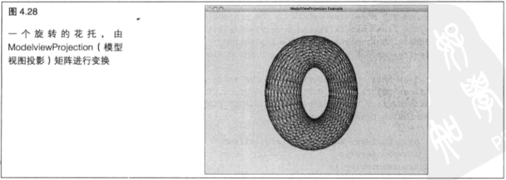

# 基础变换

+ 什么是向量，以及为什么要了解它

+ 什么是矩阵，以及为什么要更认真地了解它

+ 我们如何使用矩阵和向量来移动几何图形

+ OpenGL 对于模型视围和投影矩阵的约定

+ 什么是照相机,以及如何应用它的转换

+ 如何将一个点光源位置转换到视点坐标系

&emsp;&emsp;在第 `3` 章,我们学习了如何绘制 `3D` 点、线和三角形。 为了将一系列图形转换到连续的场景,我们必须将它们相对于其他图形和观察者进行排列。 在本章,我们开始学习在坐标系中移动图形和对象。 确定对象位置和方向的能力对于任何 `3D` 图形编程人员来说都是非常重要的。 正如我们将要看到的,围绕着原点来描述对象的维度，再将对象变换到需要的位置实际上是非常方便的。

&nbsp;

## 4.1 数学课

&emsp;&emsp;在大多数 `3D` 图形编程书籍中,本章的内容应该是枯燥的数学知识。

&emsp;&emsp;但是，不要紧张，因为和一些教科书相比，我们采用了更加容易接受的方式来阐述这些原则。对象和坐标变换的关键是 `OpenGL` 程序员常用的两个矩阵。为了帮助读者熟悉这两个矩阵,本章在两种极端的计算机图形学理念之间进行了平衡。其中一个极端是“在阅读本章之前应该复习一下线性代数的内容”。而另一个极端则是“学习 `3D` 图形不必通晓那些复杂的数学公式”。但是我们对这两者都不完全赞同。

&emsp;&emsp;事实上,即使我们不懂得那些高深的 `3D` 图形数学知识,也不会造成太大的妨碍,就像我们不需要懂得任何关于汽车结构和内燃机方面的知识也能每天开汽车一样。 但是,我们最好对汽车足够了解,以便能够意识到需要时常更换机油,定期向油箱加油,以及在轮胎花纹磨光时要更换轮胎。这些知识使我们成为一位可靠(还有安全!)的车主。 同样,如果想要成为一位可靠和有能力的 `OpenGL` 程序员,也要遵循同样的标准。至少需要理解那些基础知识,才知道能做什么,以及哪些工具适合我们要做的工作。如果是初学者,我们将会发现,经过一段时间的实践,就会渐渐理解矩阵和向量,并且培养出一种更为直观(和强大)的能力，能够在实践中充分利用本章所介绍的这些概念。

&emsp;&emsp;因此,即使我们还没有能力在脑海中默算出两个矩阵的乘法,也要明白矩阵是什么,以及这些矩阵对于 `OpenGL` 处理来说意味着什么。但是,在清理线性代数的老课本(每个人都有,对吧? ) 之前,不要紧张, `GLTools` 库中有一个组建叫做 `Math3d` ,其中包含了大量好用的与 `OpenGL` 一致的3D数学例程和数据类型。 虽然我们不必亲自进行所有的矩阵和向量操作,我们仍然知道它们是什么,以及如何应用它们。 看，这样我们就二者兼得了。

&nbsp;

## 4.2 3D 图形数学速成课

&emsp;&emsp;关于 `3D` 图形数学的书籍数不胜数,我们发现了一些非常好的,附录 `A` 中列出了这些书籍。我们并不会做出一副要讲完所有需要了解的重要问题的架势,甚至并不试图讲完所有应该了解的问题。在本章,我们只涉及真正需要了解的。如果已经是数学高手,那么就应该跳过这一部分,立即开始学习模型视图矩阵部分。这并不只是因为您已经知道了我们将要讲解的内容,还因为大多数数学高手会因为没有提供足够的空间来讨论它们喜爱的齐次坐标空间特性而感到不快。

&emsp;&emsp;想象一下一个我们必须从一大群鳄鱼逃脱出来的电视真人秀吧。我们到底要知道多少 `3D` 数学才能生存?这就是接下来两部分的内容-- `3D` 数学生存技能。鳄鱼才不在乎我们是不是真正懂得齐次坐标空间呢。

> 4.2.1 向量

&emsp;&emsp;在第 `1` 章和第 `2` 章,我们已经介绍了顶点和 `3D` 笛卡尔坐标。基本上,一个顶点就是 `XYZ` 坐标空间上的一个位置，而在空间中给定的一个位置恰恰是由一个且只由一个单独的 `XYZ` 三元组定义的。然而，一组 `XYZ` 值还能表示一个向量(实际上,从纯粹的数学思维上讲一个顶点其实同时也是一个向量……这里我们只讨论主要问题)。在使用向量来操纵 `3D` 几何图形时,向量可能就变成了最重要的基本概念了(没有之一 )。这 `3` 个值（`X` 、`Y` 和 `Z`） 组合起来表示两个重要的值——一个方向和一个数量。

&emsp;&emsp;如图 `4.1` 所示为空间中（任意选择）的一个点，以及空间中从坐标系原点到这个点坐标的一条带箭头的线段。在拼接三角形时,这个点可以视为一个顶点,而这个带箭头的线段则可以视为一个向量。一个向量首先是空间中从原点指向这个点的方向。在中，我们总是使用向量来表示带方向的量。例如， `X` 轴就是向量( `1, 0, 0` )。在 `X` 方向为 `+1` ,而在 `Y` 方向和 `Z` 方向则为 `0`。

&emsp;&emsp;我们还是用一个向量来指出我们所要的方向，例如，照相机指向哪个方向，或者我们要沿着哪个方向远离鳄鱼！


&emsp;&emsp;向量能够代表的第二个量就是数量。一个向量的数量就是这个向量的长度。对于我们的×轴向量 ( `1, 0, 0` ) 来说,向量的长度就是1。我们把长度为 `1` 的向量称为单位向量( `unit vector` )。如果一个向量不是单位向量，而我们将它缩放到 `1`，就叫做标准化( `normalization` )。将一个向量进行标准化就是将它的长度缩放为 `1` 。在我们只想表示一个方向而不表示数量时,单位向量就非常重要了。数量也可能是非常重要的。例如,它能够告诉我们需要在指定的方向上移动多远--我们需要离开鳄鱼多远。

&emsp;&emsp;`math3d` 库有两个数据类型，能够表示一个三维或四维向量：`M3DVector3f` 可以表示一个三维向量( `X`, `Y`, `Z` ),而 `M3DVector4f` 则可以表示一个四维向量( `X, Y, Z, W` )。典型情况下W坐标设为 `1.0`。`X` , `Y` 和`Z` 值通过除以 `W` 来进行缩放，而除以 `1.0` 则本质上不改变 `XYZ` 的值。要将它们定义成数组，只需如下操作。

```C++
typedef float M3DVector3f[3];
typedef float M3DVector3f[4];
```

&emsp;&emsp;声明一个三分量向量只需如下操作。

```C++
M3DVector3f vVector;
```

&emsp;&emsp;类似可以声明并初始化一个四分量向量。

```C++
M3DVector4f vVects[] = { 0.0f, 0.0f, 1.0f, 1.0f };
```

&emsp;&emsp;声明一个三分量顶点数组

```C++
M3DVector3f vVects[] = { -0.5f, 0.0f, 0.0f,
                            0.5f, 0.0f, 0.0f,
                            0.0f, 0.5f, 0.0f };
```

&emsp;&emsp;在这里,我们要注意不要过分忽视第 `4` 个分量 `W` 。在绝大多数情况下我们通过顶点位置指定几何图形时,我们只想存储和发送给 `OpenGL` 三分量的顶点。对于许多方向性顶点例如一个表面法线(用于进行光照计算)来说,一个三分量的向量也是足够的。但是,我们很快就要开始研究矩阵,并且进行 `3D` 顶点变换,这时我们就必须用它乘以一个 `4x4` 变换矩阵了。这里的规则是,我们必须用一个四分量向量乘以一个 `4×4` 矩阵,如果我们试图使用一个三分量向量和一个矩阵相乘……鳄鱼会吃了我们!稍后将更加详细地解释。基本上,如果我们要在向量上进行自己的矩阵操作,那么在很多情况下很可能会希望使用四分量向量。

&emsp;&emsp;**点乘**

&emsp;&emsp;向量可以进行加法、减法运算,也可以简单地通过加法、减法进行缩放,或者对 `XYZ` 分量单独进行缩放。然而还有一种有趣又有用的操作称为点乘( `dot product` )，这种操作只能在两个向量之间进行。
    
&emsp;&emsp;两个(三分量)单位向量之间的点乘运算将得到一个标量(只有一个值),它表示两个向量之间的夹角。要进行这种运算,这两个向量必须为单位长度,而返回的结果将在 `-1.0` 到 `+1.0` 范围之内。这个数字实际上就是这两个向量之间夹角的余弦值。在漫射光计算中,表面法向量和指向光源的向量之间大量进行着这种运算。在第 `6` 章,我们甚至会在着色器代码中进行这种运算。图 `4.2` 所示为两个向量 `V1` 和 `V2` ,以及它们之间角度的表示方法。


&emsp;&emsp;`math3d` 库中也包含一些有用的函数使用点乘操作。

&emsp;&emsp;首先,我们可以使用 `m3dDotProduct3` 函数来实际获得两个向量之间的点乘结果。

```C++
float m3dDotProduct3(const M3DVector3f u, const M3DVector3f v);
```

&emsp;&emsp;实际点乘结果在 `-1` 到 `+1` 之间，他代表两个单位向量之间夹角的余弦值。 `m3dGetAngleBetweenVectors3` 是一个更高级的函数，返回这个叫的弧度值。

```C++
float m3dGetAngleBetweenVectors3(const M3DVector3f u, const M3DVector3f v);
```

&emsp;&emsp;**叉乘**

&emsp;&emsp;另一种在两个向量之间进行的有用的数学操作是叉乘( `cross product` )。两个向量之间叉乘所得的结果是另外一个向量,这个新向量与原来两个向量定义的平面垂直。要进行叉乘,这两个向量都不必为单位向量。图 `4.3` 所示为两个向量 `V1` 和  `V2` ，以及它们的叉乘结果 `V3`。


&emsp;&emsp;在 `math3d` 库中也有一个函数 `m3dcrossProduct3` 对两个向量进行叉乘并返回运算得到的结果向量。

```C++
void m3dCrossProduct3(M3DVector3f result, const M3DVectos3f u, const M3DVector3f v);
```

&emsp;&emsp;和点乘不同,在进行叉乘时向量的顺序是非常重要的。如图 `4.3` 所示, `V3` 是 `V2` 和 `V1` 进行叉乘得到的结果。如果调换 `V1` 和 `V2` 的顺序,那么结果得到 `V3` 的将会指向与原来相反的方向。从寻找三角形表面法线到构造变换矩阵，关于叉乘的应用数不胜数。

> 矩阵

&emsp;&emsp;矩阵（ `matrix` ，也是电影《黑客帝国》的英文原名）不仅是好莱坞电影三部曲的名字，它还是一种功能非常强大的数学工具,它大大简化了求解变量之间有复杂关系的方程或方程组的过程。其中一个具有普遍性的例子和图形程序设计人员密切相关,就是坐标变换。例如,如果在空间中有一个点,由 `x` , `y` 和 `z` 坐标定义,将它围绕任意点沿任意方向旋转一定角度后,我们需要知道这个点现在的位置,就要用到矩阵。这是为什么呢？ 因为新的x坐标不仅与原来的x坐标和其他旋转参数有关，还与y和z坐标值有关。这种变量与解之间的相关性就是矩阵最擅长解决的问题对于有数学背景的电影《黑客帝国》的影迷来说,矩阵( `matrix` )确实是一个合适的标题。

&emsp;&emsp;在数学上、矩阵只不过是一组排列在统一的行和列中的数字而已——用程序设计的语言来说就是一个二维数组。一个矩阵不必是正方形的，但是矩阵中每一行(或每一列)的元素数都必须和其他行(或列)的元素数相同。图 `4.4` 所示为一些矩阵的示例。它们并没提供什么特别的信息,只是演示一下矩阵结构。请注意,一个矩阵只有一行或者一列也是合法的。只有一行或者一列数字可以更简单地称为向量，就像之前讨论过的一样。实际上,就像马上就要看到的,我们可以将矩阵看作一组列向量。


&emsp;&emsp;矩阵和向量是两个重要的术语,我们在 `3D` 图形编程文献中经常遇到。在与这些量打交道时,我们还会遇到“标量”这个术语。一个标量就是一个普通的单独数据,用来表示大小和特定量。

&emsp;&emsp;矩阵之间可以进行乘法和加法，也能与向量或者标量相乘。用一个点（向量）乘以一个矩阵(一次变换)结果得到一个新的变换点(向量)。矩阵变换实际上并不难理解,但是刚开始的时候可能会显得令人生畏。由于理解矩阵变换是许多 `3D` 任务的基础，我们还是应该努力熟悉它们。幸运的是，只有一点点了解就足以使我们能够使用 `OpenGL` 做一些奇妙的事了。久而久之,随着经验和学习(参见附录 `A` )的积累,我们就可以掌握这种数学工具了。

&emsp;&emsp;与此同时,就像前面讲的向量一样,我们将会发现 `math3d` 库中有许多有用的矩阵函数和特性。`GLTools` 源代码文件夹中的 `math3d.h` 和 `math3d.cpp` 中还提供了这个库的源代码。这个 `3D` 数学库大大简化了本章和下一章中的很多工作。这个库还有一个“有用的”特性，就是它缺乏特别聪明和高度优化的代码！ 这就使这个库具有了高度可移植性,并且非常容易理解。我们还会发现,这是一种和 `OpenGL` 非常类似的 `API` 。

&emsp;&emsp;在我们是用进行 `3D` 程序设计工作时,我们将使用的几乎全部是两种维度的矩阵,即 `3×3` 和 `4×4` 矩阵。在 `math3d` 库中也有这两种维度的矩阵数据类型。

```C++
typedef float M3DMatrix33f[9];
typedef float M3DMatrix44f[16];
```

&emsp;&emsp;许多矩阵库定义了一个二维矩阵作为 `C` 语言的二维数组。

&emsp;&emsp;`OpenGL` 约定中拒绝了这个传统并使用了一个一维数组。这样做的原因是，`OpenGL` 使用一种叫做`Column-Major` （以列为主的）矩阵排序的矩阵约定。我们马上将会进一步讨论这个问题，不过，讨论在数学上通过矩阵能够做的所有事情有点太抽象了,不适合我们的口味。让我们先来解释一下将要试图完成的工作，然后再来展示矩阵是如何实现它的。

&nbsp;

## 4.3 理解变换

&emsp;&emsp;我们想一想就会知道,大多数 `3D` 图形其实并不是真正 `3D` 的。我们使用 `3D` 概念和术语来描述物体,然后这些 `3D` 数据被“压扁”到一个2D的计算机屏幕上。这种将 `3D` 数据被“压扁”成2D数据的处理过程叫做投影( `projection` ),我们在第一章中已经介绍了正投影和透视投影。在我们想要描述投影中出现的变换(正交变换或透视变换)的类型时,我们都会涉及投影,但投影只是 `OpenGL` 中发生的变换中的一种而已。变换还允许我们旋转对象、移动对象,甚至对它们进行伸展、收缩和扭曲。

&emsp;&emsp;在我们指定顶点和这些顶点出现在屏幕上之间的这段时间里,可能会发生3种类型的几何变换: 视图变换、模型变换和投影变换。在这一部分,我们研究了每一种变换类型的原则,在表 `4.1` 中进行了概述。


> 4.3.1 视觉坐标

&emsp;&emsp;视觉坐标是一个贯穿本章的重要概念。视觉坐标是相对于观察者的视角而言的,无论可能进行何种变换,我们都可以将它们视为“绝对的”屏幕坐标。这样,视觉坐标就表示一个虚拟的固定坐标系,它通常作为参考坐标系使用。本章讨论的所有变换都是根据它们相对于视觉坐标系的效果来描述的。

&emsp;&emsp;图 `4.5` 所示从两个不同视点显示了视觉坐标系。在左边的图( `a` 图)中,视觉坐标系是以场景的观察者的角度(也就是垂直于显示器的方向)。在右边的图( `b` 图)中,视觉坐标系稍稍进行了旋转,这样就可以更好地观察 `z` 轴的位置关系了。从观察者的角度来看,`x` 轴和 `y` 轴的正方向分别指向右方和上方。`z` 轴的正方向从原点指向使用者,而 `z` 轴的负方向则从观察者指向屏幕内部。


&emsp;&emsp;当我们利用 `OpenGL` 进行 `3D` 绘制时,就会使用笛卡尔坐标系。如果不进行任何变换,那么使用的坐标系将与刚刚描述的视觉坐标系相同。

> 4.3.2 视图变换

&emsp;&emsp;视图变换是应用到场景中的第一种变换。它用来确定场景中的有利位置。在默认情况下，透视投影中的观察点位于原点( `0, 0, 0` ),并沿着z轴的负方向进行观察(向显示器内部“看进去”)。观察点相对于视觉坐标系进行移动,来提供特定的有利位置。当观察点位于原点( `0, 0, 0` )时,就像在透视投影中一样,绘制在z坐标为正的位置的对象则位于观察者背后。

&emsp;&emsp;然而在正投影中,观察者被认为是在z轴正方向无穷远的位置,能够看到视景体中的任何东西。

&emsp;&emsp;视图变换允许我们把观察点放在所希望的任何位置，并允许在任何方向上观察场景。确定视图变换就像在场景中放置照相机并让它指向某个方向。

&emsp;&emsp;从大局上考虑，在应用任何其他模型变换之前，必须先应用视图变换。这样做是因为，对于视觉坐标系而言,视图变换移动了当前的工作坐标系。所有后续变换随后都会基于新调整的坐标系进行。然后,在实际开始考虑如何进行这些变换时,就会更容易地看到这些变换是如何实现的了。

> 4.3.3 模型变换

&emsp;&emsp;模型变换用于操纵模型和其中的特定对象。这些变换将对象移动到需要的位置,然后再对它们进行旋转和缩放。

&emsp;&emsp;图 `4.6` 所示说明了我们将要在对象上应用得最普遍的模型变换中的3种。图 `4.6` ( `a` )所示展示了平移变换,图中的对象沿着给定的轴进行移动;图 `4.6` ( `b` )所示展示了旋转变换,图中的对象围绕着一条坐标轴进行旋转;图 `4.6` ( `c` )所示展示了缩放效果,途中对象的大小进行了指定数量的放大或缩小。缩放可以是不均匀的(不同的维度可以进行不同程度的缩放),所以我们可以使用缩放来对对象进行伸展或收缩。

&emsp;&emsp;场景或对象的最终外观可能在很大程度上取决于应用的模型变换顺序。在平移和旋转上尤其如此。

&emsp;&emsp;图 `4.7` ( `a` )所示展示了一个正方形逐渐变换的过程,它先围绕 `z` 轴进行旋转,然后再沿着变换后得到的新x轴进行平移。在图 `4.7` ( `b` )中,同样的正方形首先沿着 `x` 轴进行平移,然后再围绕 `z` 轴进行旋转。

&emsp;&emsp;两者最终外观上有所不同是因为每次变换都与最后的变换结果相关。在图 `4.7` ( `a` )中,正方形是围绕原始坐标轴旋转的。而在图 `4.7` ( `b` )中，在正方形已经进行平移之后，旋转是围绕着新变换的坐标轴进行的。

</br>
</br>

> 4.3.4 模型视图的二元性

&emsp;&emsp;实际上,视图和模型变换按照它们内部效果和对场景的最终外观来说是一样的。将这两者区分开纯粹是为了程序员的方便。将对象向后移动和将参考坐标系向前移动在视觉上没有区别，如图 `4.8` 所示，其效果是相同的。(我们可能亲身体验过这种效果，当我们坐在车里，看到后面的车超过我们时，会感到自己的车正在后退。)视图变换和模型变换一样,都应用在整个场景中,在场景中的对象常常在进行视图变换后单独进行模型变换。术语“模型视图”是指这两种变换在变换管线中进行组合,成为一个单独的矩阵,即模型视图矩阵。


&emsp;&emsp;因此,视图变换并没有特别之处。从本质上说,它只是在绘制对象之前应用到一个虚拟对象(观察者)之上的一种模型变换。正如我们将要看到的,在将更多对象加入场景中的同时,还会不断指定新的变换。按照惯例，初始变换是所有其他变换参考的基础。

> 4.3.5 投影变换

&emsp;&emsp;投影变换将在模型视图变换之后应用到顶点上。这种投影实际上定义了视景体并创建了裁剪平面。

&emsp;&emsp;裁剪平面是 `3D` 空间中的平面方程式, `OpenGL` 用它来确定几何图形对于观察者来说是否可见。更具体地说,投影变换指定一个完成的场景(所有模型变换都已完成)是如何投影到屏幕上的最终图像。在本章后面部分，我们将学习更多关于两种投影——正投影和透视投影的内容。

&emsp;&emsp;在正投影(或者说平行投影)中,所有多边形都是精确地按照指定的相对大小来在屏幕上绘制的。线和多边形使用平行线来直接映射到 `2D` 屏幕上,这就意味着,无论某个物体的位置有多远,它都会按照同样的大小来进行绘制,仅仅是平贴到屏幕上而已。典型情况下,这种投影用于渲染二维图像,例如蓝图或者是文本或屏幕菜单等二维图形。

&emsp;&emsp;透视投影所显示的场景与现实生活中更加接近，而不是一张蓝图。透视投影的特点就是透视缩短(`foreshortening` ),这种特性使得远处的物体看起来比近处同样大小的物体更小一些。`3D` 空间中应该是平行的线可能在观察者看来不总是平行的。例如,对于铁轨来说,两根铁轨是平行的,但是在使用透视投影的情况下,它们看起来将在远处的某一点汇聚在一起。

&emsp;&emsp;透视投影的优势在于,我们不必弄清楚线在哪里相交或远处的物体到底有多销。我们需要做的仅仅是指定适用模型视图变换的场景,然后应用透视投影矩阵。线性代数将帮助我们完成一切。图 `4.9` 所示在两个不同场景中比较了正投影和透视投影。


&emsp;&emsp;正投影大多在进行 `2D` 绘制使用，这种情况下我们希望点和绘制单元精确一-致。我们可能会在原理图设计、文本或者`2D` 图形应用中使用正投影。在渲染对象的深度与它们到视点的距离相比非常小时,我们也可以使用正投影来进行3D渲染。透视投影应用在渲染包含广阔的空间或者需要应用透视缩短的物体的场景时使用。在大多数情况下,透视投影都应用在3D图形中。实际上,使用正投影的`3D` 对象看起来可能会有些让人不舒服。

> 4.3.6 视口变换

&emsp;&emsp;当所有这些都讲述并完成后,就得到了一个场景的二维投影,它将被映射到屏幕上某处的窗口上。这种到物理窗口标的映射是我们最后要做的变换,称为视口变换。通常,颜色缓冲区和窗口像素之间存在一一对应关系,但情况也并非一定如此。在某些情况下,视口变换会将“规范化”设备坐标重新映射到窗口坐标上。幸运的是,我们不必为这些事操心,图形硬件会为我们做好这些。

&nbsp;

## 4.4 模型视图矩阵

&emsp;&emsp;模型视图矩阵式一个 `4×4` 矩阵,它表示一个变换后的坐标系,我们可以用来放置对象和确定对象的图矩阵来获得一个相对于视觉坐标系的经过变换的新坐标。方向。我们为图元提供的顶点将作为一个单列矩阵(也就是一个向量)的形式来使用,并乘以一个核型

&emsp;&emsp;如图 `4.10` 所示，一个包含单个顶点数据的矩阵乘以模型视图矩阵后得到新的视觉坐标。顶点数据实际上是 `4` 个元素,其中包含一个附加值 `W` ,它表示一个缩放因子。默认情况下着个值被设置为 `1.0` ,而我们很少去改动它。


&emsp;&emsp;将一个顶点乘以一个矩阵来对它进行变换。这到底是如何做到的呢?

> 4.4.1 矩阵构造

&emsp;&emsp;正如我们以前提到过的, `OpenGL` 并不是将一个 `4×4` 矩阵表示为一个浮点值的二维数组,而是将它表示为一个由 `16` 个浮点值组成的单个数组。这种方式与许多数学库都不同,这些数学库都使用二维数组的方式。例如，`OpenGL` 会采用的是下面两个例子中的第一个。

```C++
GLfloat matrix[16];
GLfloat matrix[4][4];
```

&emsp;&emsp;`OpenGL` 也可以使用第二种选择,但第一种是更加有效的表示方式,其中的原因很快就会清楚。这 `16` 个元素表示 `4×4` 矩阵,如图 `4.11` 所示。当这些数组元素一个接一个地遍历矩阵列中的列时，我们称这种方式为列优先排序。在存储器中,这种 `4x4` 的二维数组形式(即上述代码的第二种选项)将以行优先顺序呈现。在数学中,这两种形式的矩阵互为转置矩阵。


&emsp;&emsp;真正的奥妙在于，这 `16` 个值表示了空间中的一个特定位置，以及相对于视觉坐标系(回忆一下我们以前讲过的那个固定的、没改变过的坐标系)的 `3` 个轴上的方向。解释这些数字一点也不困难。这 `4` 列中每一列都代表一个由 `4` 个元素组成的向量。为了保持本书简洁的风格,我们将注意力集中在前3列中的向量的前 `3` 个元素上。第4列向量包含变换后的坐标系原点的x、y和z值。

&emsp;&emsp;前 `3` 列的前 `3` 个元素只是方向向量，它们表示空间中 `×` 轴、`y` 轴和 `z` 轴上的方向(在这里用向量来表示一个方向)。对于大多数应用来说,这 `3` 个向量相互之间总是成 `90°` 角,并且通常为单位长度(除非我们还应用了缩放或裁剪)。这种情况的数学术语叫做标准正交(向量为单位长度)或者正交(向量不是单位长度)。图 `4.12` 所示为 `4×4` 转换矩阵,其中的列向量进行了特别标注。请注意,矩阵的最后一行都为 `0` ，只有最有一个元素为 `1`。


&emsp;&emsp;最奇妙的是,如果有一个包含一个不同坐标系的位置和方向的 `4×4` 矩阵,然后用一个表示原来坐标系的向量(表示为一个列矩阵或向量)乘以这个矩阵,得到的结果是一个转换到新坐标系下的新向量。这就意味着,空间中任何位置和任何想要的方向都可以由一个 `4x4` 矩阵唯一确定,并且如果用一个对象的所有向量乘以这个矩阵，那么我们就将整个对象变换到了空间中的给定位置和方向！

&emsp;&emsp;**单位矩阵**

&emsp;&emsp;有一些重要类型的变换矩阵，在我们开始尝试使用它们之前，首先要熟悉它们。第一个就是单位矩阵。将一个向量乘以一个单位矩阵,就相当于用这个向量乘以 `1` ,不会发生任何改变。

&emsp;&emsp;如图 `4.13` 所示，单位矩阵中除了对角线上的一组元素之外，其他元素均为 `0`。


&emsp;&emsp;使用单位矩阵绘制的对象不会发生变换，他们还在原点（最后一列），并且 `×` 轴、`y` 轴和 `z` 轴与视觉坐标中一样。

&emsp;&emsp;我们可以在 `OpenGL` 中这样生成一个单位矩阵：

```C++
GLfloat m[] = { 1.0f, 0.0f, 0.0f, 0.0f,
                0.0f, 1.0f, 0.0f, 0.0f,
                0.0f, 0.0f, 1.0f, 0.0f,
                0.0f, 0.0f, 1.0f, 1.0f };
```

或者使用 math3d 的 M3DMatrix44f 类型

```C++
M3DMatrix44f m = {  1.0f, 0.0f, 0.0f, 0.0f,
                    0.0f, 1.0f, 0.0f, 0.0f,
                    0.0f, 0.0f, 1.0f, 0.0f,
                    0.0f, 0.0f, 1.0f, 1.0f };
```

&emsp;&emsp;在 `math3d` 库中还有一个快捷函数 `m3dLoadIdentity44` ，这个函数初始化一个空单位矩阵。

```C++
void m3dLoadIdentity44(M3DMatrix44f m);
```

&emsp;&emsp;我们可以回忆一下,在本书中使用的第一个存储(顶点)着色器就叫做单位着色器。这个着色器完全不对顶点做任何改变,而是将这些顶点绘制在默认坐标系中,并且不在这些顶点上应用任何矩阵。我们可以将这些顶点乘以单位矩阵，但是这是一种浪费和毫无意义的操作。

&emsp;&emsp;**平移**

&emsp;&emsp;一个平移矩阵仅仅是将我们的顶点沿着3个坐标轴中的一个或多个进行平移。

&emsp;&emsp;图 `4.14` 所示是一个将正方形沿着y轴正方向平移10个单位长度的例子。


&emsp;&emsp;我们可以调用 `math3d` 库中的 `m3dTranslationMatrix44` 函数来使用变换矩阵。

```C++
void m3dTranslationMatrix44(M3DMatrix44f m, float x, float y, float z);
```

&emsp;&emsp;**旋转**

&emsp;&emsp;为了将一个对象沿着3个坐标轴中的一个或者任意向量进行旋转,需要找到一个旋转矩阵,又有一个 `math3d` 函数来帮助我们了。

```C++
void m3dRotationMatrix44(M3DMatrix44f m, float angle, float x, float y, float z);
```

在这里,我们围绕一个由 `x` 、`y` 和 `z` 变量指定的向量来进行旋转。旋转的角度沿逆时针方向按照弧度计算,由变量 `angle` 指定。在最简单的情况下,旋转只是围绕坐标系的一个坐标轴( `x`、`y` 或 `z` )进行旋转。

&emsp;&emsp;我们还可以围绕任意一个由 `x` 、`y` 和 `z` 变量指定的向量来进行旋转。要表示这个旋转轴,我们只要绘制一条从原点到由( `x` , `y` , `z` )表示的点的线段就可以了。举例来说,下面的代码创建一个旋转矩阵,可以使顶点沿着任意由( `1` , `1` , `1` )指定的轴旋转 `45°` ，如图 `4.15` 所示。

```C++
M3DMatrix44f m;
m3dRotationMatrix44(m, m3dDegToRad(45.0), 1.0f, 1.0f, 1.0f);
```


&emsp;&emsp;请注意在这个例子中 `math3d` 宏 `m3dDegToRad` 的使用。这个宏将角度值转换为弧度值，因为和计算机不同,大多数程序员比较习惯以角度为单位进行思考。使用这个宏来代替内联函数(对于 `C++` 的忠实拥护者来说肯定听说过这个词)的一个好处是,如果这个值是一个硬编码(硬编码是指将可变变量用一个固定值来代替的方法--译者注)的文字,转换将发生在编译时,这样角度和弧度之间的转换就不会产生运行时损失。

&emsp;&emsp;**缩放**

&emsp;&emsp;我们要讲的最后一个矩阵是缩放矩阵。缩放矩阵可以沿着 `3` 个坐标轴方向按照指定因子放大或缩小所有顶点,以改变对象的大小,使用 `math3d` 库创建一个缩放矩阵,方法与创建平移或旋转矩阵的方法类似。

```C++
m3dScaleMatrix44(M3DMatrix44f m, float xScale, float yScale, float zScale);
```

&emsp;&emsp;缩放不一定是一致的，我们可以在不同的方向同时使用它来进行伸展和压缩。例如，一个 `10×10×10` 的正方体可以在 `×` 方向和 `z` 方向放大到原来的两倍，如图 `4.16` 所示。


&emsp;&emsp;**综合变换**

&emsp;&emsp;我们很少会只进行这些变换类型中的一种。实际上,我们总是想同时进行这些变换。为了将对象移动到想要的位置,我们可能需要先将它平移到指定位置,然后再旋转到想要的方向。由于 `4x4` 变换矩阵包含一个位置和一个方向,我们可能会想到,一个矩阵就可以完成这两种转换。我们是对的!

&emsp;&emsp;将两种变换加在一起很简单,只需将两个矩阵相乘。结果得到的矩阵包含结合到一起的转换,都在一个矩阵中了。“加”这个词在数学中当然是指加法,但实际上我们不会把这两个矩阵“加”到一起,它们是相乘的。为了解决这个术语上的冲突,我们经常使用术语“连接” ( `concatenate` )来表示两种变换以这种方式结合。不过在矩阵乘法中有一个小陷阱需要注意,就是运算的顺序是有影响的。例如,用一个旋转矩阵乘以一个平移矩阵,与用一个平移矩阵乘以一个旋转矩阵是不同的。图4.7所示对这一点进行了讨论和演示。

&emsp;&emsp;`math3d` 库函数 `m3dMatrixMultiply44` 用来将两个矩阵相乘并返回运算结果。

```C++
void m3dMatrixMultiply44(M3DMatrix44f product, const M3DMatrix44f a, const M3DMatrix44f b);
```

&emsp;&emsp;现在让我们来看一个将这些变换叠加到一起的具体例子。

> 4.4.2 运用模型视图矩阵

&emsp;&emsp;在第 `2` 章的 `Move` 示例程序中,我们让一个红色的方块随着按动方向键而在窗口中移动。这里使用的是强制性的方法,即更新三角形扇的坐标,然后重建图元批次。能够达到同样效果更好的方法是,一次性创建批次(通常是以原点为中心),然后在渲染这个批次时对顶点应用一个矩阵(实际上就是模型视图矩阵)。在原来的程序中,我们使用了单位着色器,这个着色器对顶点不做任何变换,它只是传递这些顶点并在默认的笛卡尔坐标系中对它们进行渲染。另一个存储着色器,即平面着色器,接受 `4×4` 变换矩阵作为它的参数之一。

```C++
GLShaderManager::UseStockShader(GLT_SHADER_FLAT, M3DMatrix44f m, GLflaot vColor[4]);
```

&emsp;&emsp;这个着色器在对图元进行渲染之前用每个向量乘以矩阵 `m` 。在针对本章内容修改过的 `Move` 示例程序中,我们使用两个变量 `yPos` 和 `xPos` 来记录正方形的位置。现在可以方便地创建一个变换矩阵了。

```C++
m3dTranslationMatrix44(mTranslationMatrix, xPos, yPos 0.0f);
```

&emsp;&emsp;然后,这个变换矩阵就可以在绘制对象之前被发送到着色器了,如下所示。

```C++
shaderManager.UseStockShader(GLT_SHADER_FLAT, mTranslationMatrix, vRed);
squareBatch.Draw();
```

&emsp;&emsp;为了让事情更加有趣(同时也是为了演示一个重要问题),我们在移动这个正方形的同时还对它进行旋转。在 `xy` 平面中旋转这个正方形也包括围绕z轴旋转。程序清单 `4.1` 展示了 `Move` 示例程序中的整个 `RenderScene` 函数。

```C++
void RenderScene()
{
    glClear(GL_COLOR_BUFFER_BIT | GL_DEPTH_BUFFER_BIT | GL_STENCIL_BUFFER_BIT);

    GLfloat vRed[] = { 1.0f, 0.0f, 0.0f, 1.0f };

    M3DMatrix44f mFinalTransform, mTranslationMatrix, mRotationMatrix;

    m3dTranslationMatrix44(mTranslationMatrix, xPos, yPos, 0.0f);

    static float yRot = 0.0f;
    yRot += 1.0f;
    m3dRotationMatrix44(mRotationMatrix, m3dDegToRad(yRot), 0.0f, 0.0f, 1.0f);

    m3dMatrixMultiply44(mFinalTransform, mTranslationMatrix, mRotationMatrix);

    shaderManager.UseStockShader(GLT_SHADER_FLAT, mFinalTransform, vRed);
    squareBatch.Draw();

    glutSwapBuffers();
}
```

&emsp;&emsp;请注意我们是如何分别创建平移矩阵 `mTranslationMatrix` 和旋转矩阵 `mRotationMatrix` 的。然后将它 们相乘,以创建最终的变换矩阵。

```C++
m3dMatrixMultiply44(mFinalTransform, mTranslationMatrix, mRotationMatrix);
```

&emsp;&emsp;平面着色器只接受一个矩阵变量,然后它会用这些顶点乘以这个矩阵。这个“模型视图”矩阵通过在默认坐标系中平移这些顶点来使我们的正方形在屏幕上移动,我们可以回忆一下,在这个坐标系中所有3个坐标轴范围都在 `-1` 和 `+1` 之间。然而,这个简单的坐标系并不是总能满足我们的需要,而且在更大的坐标空间中考虑我们的对象会更加方便。那么就可能会有另外一格矩阵能够允许我们将任何我们想要的坐标空间缩放到 `-1` 到 `+1` 的范围内。确实,这就是第二种类型的矩阵变换，称为投影,很快就会介绍相关内容。

&nbsp;

## 4.5 更多对象

&emsp;&emsp;对于演示的目的来说，正方形和三角形很快就变得有点乏味了。在更进一步学习之前，让我们先介绍一些 `GLTools` 库中内建的存储对象。我们可以回忆一下 `GLBatch` 类,这个类的目的是为了解决容纳一个顶点列表并将它们作为一个特定类型的图元批次来进行渲染。在这里我们将介绍一种新的类,即 `GLTriangleBatch` 类。这个类是专门作为三角形的容器的。每个顶点都可以有一个表面法线,以进行光照计算和纹理坐标。`GLTriangleBatch` 类确切的内部实现所使用的技术在第12章以后才会介绍。就现在而言,我们知道它们将三角形以更加高效的方式(索引顶点数组)进行组织,并且实际上将多边形存储在图形卡(使用定点缓冲区对象)上就够了。

> 4.5.1 使用三角形批次类

&emsp;&emsp;建立自己的三角形批次对象是一件非常简单的事。

&emsp;&emsp;首先，我们需要为对象创建一个事件。

```C++
GLTriangleBatch myCoolObject;
```

&emsp;&emsp;然后通知容器最多使用的定点数，以开始创建网格。

```C++
myCoolObject.BeginMesh(200);
```

&emsp;&emsp;现在来添加三角形。`AddTriangle` 成员函数接受一个包含 `3` 个顶点的数组，一个包含 `3` 个法线的数组，以及一个包含3个纹理坐标的数组。

```C++
void GLTriangleBatch::AddTriangle(M3DVector3f vects[3], M3DVector3f vNorms[3], M3DVector3f vTexCoords[3])
```

&emsp;&emsp;不要担心会出现重复的顶点数据（读者可能会认为三角形带或三角形扇效率会更高）。在我们每一次添加一个顶点时, `GLTriangleBatch` 类都会搜索重复值并对我们的批次进行优化。实际上,对于非常大的批次来说,我们可能会发现这种操作在每次添加一个新三角形时都会越来越明显地降低速度。

&emsp;&emsp;当我们添加完三角形时,调用 `End` 。

```C++
myCoolObject.End();
```

&emsp;&emsp;现在，只需要选择想要的存储着色器并调用 `Draw` 函数。

```C++
myCoolObject.Draw();
```

&emsp;&emsp;我们当然也可以在自己的着色器中使用这些对象，我们将在第 `6` 章中介绍这方面的约定。

&emsp;&emsp;库包含很多实用函数，它们可以将一个对象填充到一个 `GLTriangleBatch` 类中。示例程序 `Objects` 随着按下空格键而重复进行这个过程,并且使用与我们在第 `3` 章的 `Primitives` 示例程序中使用过的相同的线框技术来对它们进行渲染。我们还可以使用方向键来沿 `x` 轴和 `y` 轴旋转每一个对象来更细致地观察它们。下面让我们一个一个地了解它们。

> 4.5.2 创建一个球体

&emsp;&emsp;许多“人工的”对象都使用一种基本形状，即简单的球形。`gltMakeSphere` 函数引用一个三角形批次、球的半径和组成球体的片段及其堆叠数量。

```C++
void gltMakeShere(GLTriangleBatch& sphereBatch, GLflaot fRedius, GLint iSlices, GLint iStacks);
```

&emsp;&emsp;图 `4.17` 所示显示了 `Objects` 示例程序中球体的输出结果。球体的半径意义非常明显,而 `iSlices` 和 `iStacks` 参数则需要进行一点解释。我们可以将球体想象成围绕成球形的一系列三角形带。参数 `iStacks` 是这些从球体底部堆叠到顶部的三角形带的数量。而 `iSlices` 参数则是围绕着球体排列的三角形对数。典型情况下一个对称性较好的球体的片段数量是堆叠数量的 `2` 倍。想一想为什么会是这样——围绕球体一周是 `360°` ,而从底部到顶部只有 `180°` ( `360°` 的一半)。另外需要注意的一点是,这些球体都是围绕 `z` 轴的，这样 `+z` 就是球体的顶点，而 `-z` 则是球体的底。


> 4.5.3 创建一个花托

&emsp;&emsp;另外一个有趣并且有用的对象就是花托。花托是一种环状的像面包圈一样的物体,如图4.18所示。用来创建花托的 `GLTools` 函数是 `gltMakeTorus` 。

```C++
void gltMakeTorus(GLTriangleBatch& torusBatch, GLfloat majorRadius, GLfloat minorRadius, GLint numMajor, GLint numMinor);
```

&emsp;&emsp;其中 `majorRadius` 是花托中从中心到外边缘的半径,而 `minorRadius` 则是到内边缘的半径。`numMajor` 和 `numMinor` 参数的作用与球体中的 `iSlices` 和 `iStacks` 参数类似，他们是沿着主半径和内部较小半径的细分单元的数量。


> 4.5.4 创建一个圆柱或圆锥

&emsp;&emsp;`gltMakeCylinder` 函数可以创建一个空心圆柱体。

```C++
void gltMakeCylinder(GLTriangleBatch& cylinderBatch, GLfloat baseRadius, GLfloat topRadius, GLint fLength, GLint numSlices, GLint numStacks);
```

&emsp;&emsp;圆柱体从 `0` 开始向 `z` 轴正方向延伸,我们既可以指定底部半径,也可以指定顶部半径。图 `4.19` 所示展示了一个上下半径相等的圆柱体,而图 `4.20` 所示则展示了一端半径设置为 `0` 的圆柱体。这实际上是形成了一个锥体,但是我们还可以用同样简单的方式来创建一个漏斗形状。参数 `numSlices` 代表围绕 `z` 轴的三角形对的数量，而参数 `numStacks` 则代表从圆柱体底部堆叠到顶部圆环的数量。


> 4.5.5 创建一个圆盘

&emsp;&emsp;最后要创建的一个表面是圆盘。圆盘是通过分解成若干片段的三角形带绘制而成的。我们可以指定一个内部半径来创建一个类似垫圈的形状,也可以让这个值保持为 `0` 来创建一个实心圆盘。 `gltMakeDisk` 函数,到目前为止看起来还是一个很熟悉的 `API` ,它用圆盘形状来填充一个 `GLTriangleBatch` ,如图 `4.21` 所示。

```C++
void gltMakeDisk(GLTriangleBatch& diskBatch, GLfloat innerRadius, GLfloat outRadius, GLint nSlices, GLint nStacks);
```


&emsp;&emsp;现在我们有了更多有趣的对象可以进行绘制，可以回过头来讨论一下如何创建替换坐标系，或者说 `3D` 场景的投影了。

&nbsp;

## 4.6 投影矩阵

&emsp;&emsp;模型视图矩阵实际上是在视觉坐标中移动几何图形。到目前为止，我们已经在屏幕或窗口上使用了范围为 `-1` 到 `+1` (实际上沿 `z` 轴方向范围也是 `-1` 到 `+1` )的默认坐标系。那么如果我们希望有不同的坐标系呢？好吧，事实是，这个小小的坐标范围确实是硬件唯一能够接受的。那么使用不同坐标系的技巧就是，将我们想要的坐标系变换到这个单位立方体中。我们使用一个新的矩阵来完成这项工作,就是投影矩阵。接下来的两个示例程序 `Orthographic` (正交)和 `Perspective` (透视),将不会从源代码的角度进行详细的解释。这两个示例有助于我们弄清正投影和透视投影两者之间的区别。这两个互动示例可以使我们比较容易地看清透视是如何扭曲一个物体的外观的。如果可能的话,我们应该在阅读下面两段内容的同时运行这些示例。

> 4.6.1 正投影

&emsp;&emsp;到目前为止我们在本书大部分内容中使用的正投影的所有面都是正方形的。前面、背面、顶面、地面、左面和右面的逻辑宽度都是相等的。这样就产生了一个平行投影,这种投影在绘制从远处观察不产生任何透视缩短的特定物体时非常有用。这对于文本或者建筑绘图等我们用来在屏幕上精确地显示大小和尺寸的场合来说再好不过了。图 `4.22` 显示了本章子目录下附带的源代码中 `Orthographic` 示例程序的输出结果。为了生成这个中空的管状盒子,我们使用了一个正投影,就像我们在前面所有示例中所做的一样。图 `4.23` 所示是同一个盒子向侧面旋转了一些，以便我们能够看到它实际的长度。


&emsp;&emsp;在图 `4.24` 中，我们会正面看向方管口。因为这个方管不会在远处汇聚在一点，所以这不完全是现实生活中一个这样的方管看起来的实际外观。为了增加一些透视效果,必须使用透视投影。

&emsp;&emsp;回忆一下第 `3` 章的内容，我们可以使用 `math3d` 库或 `GLFrustum` 类来创建一个正投影矩阵。

```C++
GLFrustum::SetOrithotaphic(GLfloat xMin, GLfloat xMax, GLfloat yMin, GLfloat yMax, GLfloat zMin, GLfloat zMax);
```


> 4.6.2 透视投影

&emsp;&emsp;我们可以回忆一下，在第 `3` 章中我们已经对透视投影进行了一些讨论。这一章的图 `3.3` 所示和图 `3.4`所示展示了我们称为视景体的几何体。视景体是一个从窄端看向宽端的金字塔中截取的一部分。

&emsp;&emsp;作为第 `3` 章内容的回顾，我们使用 `GLFrustum` 类来设置透视投影。

```C++
GLFrustum::SetPersPective(GLfloat fFov, GLfloat fAspect, GLfloat fNear, GLfloat fFar);
```

&emsp;&emsp;`SetPerspective` 函数的参数是一个从顶点方向看去的视场角度（用角度值表示）、宽度和高度的比值(宽高比)和从近剪切面到远剪切面的距离(如图 `3.4` 所示)。用窗口或者视口的宽度( `w` )除以高度( `h` ),我们就得到了宽高比的值。`GLFrustum`类基于这些参数构建合适的 `4x4` 投影矩阵,这个矩阵随后将成为我们整体变换管线的一部分。透视缩短为我们原来的方管正投影增加了现实感(如图 `4.25` 、图 `4.26` 和图 `4.27` 所示)。我们所做的唯一实质性改变就是转换为透视投影。


> 4.6.3 模型视图投影矩阵

&emsp;&emsp;下面让我们了解一下如何将所有这些内容结合起来。`ModelviewProjection` (模型视图投影矩阵)示例程序绘制了一个在屏幕中间旋转的线框花托。图 `4.28` 所示是这个示例程序输出的一个画面。我们使用 `GLFrustum` 类的一个叫做 `viewFrustum` 的实例来为渲染设置一个透视投影矩阵。程序清单 `4.2` 中的 `ChangeSize` 函数展示了我们是如何设置视口和投影矩阵的。



```C++
GLFrustum viewFrustum;

void ChangeSize(int w, int h)
{
    if(h == 0)
        h = 1;

    glViewport(0, 0, w, h);

    viewFrustum.SetPerspective(35.0f, float(w) / float(h), 1.0f, 1000.0f);
}

void RenderScene()
{
    static CStopWatch rotTimer;
    float yRot = rotTimer.GetElapsedSeconds() * 60.0f;

    glClear(GL_COLOR_BUFFER_BIT | GL_DEPTH_BUFFER_BIT);

    M3DMatrix44f mTranslate, mRotate, mModelview, mModelViewProjection;

    m3dTranslationMatrix44(mTranslate, 0.0f, 0.0f, -2.5f);

    m3dRotationMatrix44(mRotate, m3dDegToRad(yRot), 0.0f, 1.0f, 0.0f);

    m3dMatrixMultiply44(mModelview, mTranslate, mRotate);

    m3dMatrixMultiply44(mModelViewProjection, viewFrustum.GetProjectionMatrix(),mModelview);

    GLfloat vBlack[] = { 0.0f, 0.0f, 0.0f, 1.0f };
    shaderManager.UseStockShader(GLT_SHADER_FLAT, mModelViewProjection, vBlack);  
    torusBatch.Draw();

    glutSwapBuffers();
    glutPostRedisplay();
}
```

&emsp;&emsp;在以上函数中，我们创建了 `4` 个 `4x4` 矩阵变量。`mTranslate` 变量保存初始变换，这时将花托沿着 `Z` 轴负方向移动了 `2.5` 个单位长度。

```C++
m3dTranslationMatrix44(mTranslate, 0.0f, 0.0f, -2.5f);
```

&emsp;&emsp;然后创建一个旋转矩阵，并将它保存在 `mRotate` 中。

```C++
m3dRotationMatrix44(mRotate, m3dDegToRad(yRot), 0.0f, 1.0f, 0.0f);
```

&emsp;&emsp;请注意我们是如何使用 `CStopWatch` 类( `GLTools` 库的一个组成部分)来基于经过的时间长短设置旋转速度的。一开始将旋转速度设在了每秒 `60°` 。我们应该总是根据经过的时间来设置动画率,而不是采用单纯的基于帧的方式。例如，像下面这样编写动画代码是很有吸引力的。

```C++
static GLfloat yRot = 0f;
yRot += 1.0f;
m3dRotationMatrix44(mRotate, m3dDegToRad(yRot), 0.0f, 1.0f, 0.0f);
```

&emsp;&emsp;这样的代码会使对象在帧速率低时旋转得很慢,而在帧速率高时旋转得很快,所以程序员会倾向于改变加到 `yRot` 的数字,直到动画看起来正常为止(真是简单粗糙的编程方式!)。然而,随着机器、驱动程序版本等因素的改变,帧速率也将随之改变,这将在不同的机器上产生不可预料的动画速率。但是,时间则是以恒定速度流动的，不管帧速率如何。更高的帧速率应该会产生更平滑的动画，而不是更快的动画。

&emsp;&emsp;现在让我们回到变换花托的任务上来——我们要进行的下一步工作是通过进行一次矩阵乘法操作来同时添加平移和旋转。请记住，操作的顺序非常重要，而在本例中先进行平移，然后再进行旋转。

```C++
m3dMatrixMultiply44(mModeview, mTranslate, mRotate);
```

&emsp;&emsp;现在，这个花托应该呈现在我们面前，并在正确的位置旋转了，至少对于模型视图矩阵来说是这样的。不过,不要忘记为了想要的坐标系而设置了一个透视投影矩阵。现在,我们需要将这个坐标系缩减到单元正方体范围,通过用投影矩阵乘以模型视图矩阵来完成这项工作。再次强调,操作的顺序非常重要!

```C++
m3dMatrixMultiply44(mMedelViewProjection, viewFrustum.GetProjectionMatrix(), mModelview);
```

&emsp;&emsp;结果得到的矩阵 `mModelViewProjection` 包含所有的变换和到屏幕的投影的串联形式。这只是简单的魔术而已!或许读者现在已经想要开始研读附录 `A` 中列出的参考书了。最后一步是将我们的矩阵传递到平面着色器并提交花托属性。平面着色器的工作只是使用提供的矩阵来对顶点进行转换(这是通过向量与矩阵的乘法来完成的),并且使用指定的颜色对几何图形进行着色以得到实心几何图形,在本例中使用的是黑色。

```C++
shaderManager.UseStockShader(GLT_SHADER_FLAT, mModelViewProjection, vBlack);
torusBatch.Draw();
```

&nbsp;

## 4.7 变换管线

&emsp;&emsp;现在我们已经了解了如何用模型视图矩阵和投影矩阵在屏幕上显示想要的东西，下面让我们从整体上了解一下变换管线。图 `4.29` 所示是处理过程的流程图。

&emsp;&emsp;首先，我们的顶点将被视为一个 `1x4` 矩阵，其中前 `3` 个值为 `x`， `y` 和 `z` 坐标。第 `4` 个数字是一个缩放因子,如果需要的话我们可以手动进行设置。这就是 `w` 坐标,通常在默认情况下为 `1.0` ,我们很少会真正去直接修改这个值。然后,顶点将乘以模型视图矩阵,生成变换的视觉坐标。随后,视觉坐标再乘以投影矩阵,生成裁剪坐标。裁剪坐标值位于我们前面提到的 `+/-1.0` 单位坐标系内。将有效地将所有位于这个裁剪空间之外的数据消除掉。裁剪坐标随后再除以 `w` 坐标,生成规范化的设备坐标。其中 `w` 值可能会被投影矩阵或模型视图矩阵修改,这取决于所发生的变换。透视除法将作为图元装配过程的一部分进行。最后,坐标三元组将通过视口变换被映射到 `2D` 平面上。这项操作也是由一个矩阵来表示的,但不能直接指定或者修改这个矩阵。`OpenGL` 将在内部根据指定的 `glViewport` 值来设置这个矩阵。


> 4.7.1 使用矩阵堆栈

&emsp;&emsp;因为矩阵乘法是 `3D` 图形中如此重要的组成部分，所以几乎所有程序员的工具箱中都包含了一系列函数类,用来创建和操作矩阵乘法。实际上, `math3d` 库就包含了类型丰富的函数来进行这些工作。

&emsp;&emsp;在分层方式中，一个或多个对象会相对于另一个对象进行绘制，在这种方式中经常会应用到变换。这样，就会需要大量由用户代码进行构造和管理的矩阵在 `3D` 空间中建立复杂的场景。

&emsp;&emsp;习惯上,我们会使用一个矩阵堆栈来帮助完成这些工作,而 `GLTools` 库则会在 `math3d` 矩阵函数顶部建立实用类。这个类称为 `GLMatrixStack` 。熟悉兼容版本中现在已经“不推荐”的OpenGL矩阵堆栈的读者会对这个类感到很熟悉。在堆栈中包含了单位矩阵。

&emsp;&emsp;这个类的构造函数允许指定堆栈的最大深度,默认的堆栈深度为 `64` 。这个矩阵堆栈在初始化时已经

```C++
GLMatrixStack::GLMatrixStack(GLint iStackDepth = 64);
```

&emsp;&emsp;我们可以通过调用在顶部载入这个单位矩阵。

```C++
void GLMatrixStack::LoadIdentity(void);
```

&emsp;&emsp;或者可以在堆栈的顶部载入任何矩阵。

```C++
void GLMatrixStack::LoadMatrix(const M3DMatrix44f m);
```

&emsp;&emsp;此外，可以使用一个矩阵乘以矩阵堆栈的顶部矩阵，相乘得到的结果随后将存储在堆栈的顶部。

```C++
void GLMatrixStack::MultMatrix(const M3DMatrix44f m);
```

&emsp;&emsp;最后，只要用 `GetMatrix` 函数就可以获得矩阵堆栈顶部的值，这个函数可以进行两次重载，以适应 `GLShaderManager` 的使用，或者仅仅是获得顶部矩阵的副本。

```C++
const M3DMatrix44f& GLMatrixStack::GetMatrix(void);
void GLMatrixStack::GetMatrix(M3DMatrix44f mMatrix);
```

&emsp;&emsp;**压栈与出栈**

&emsp;&emsp;一个矩阵的真正价值在于通过压栈操作存储一个状态，然后通过出栈操作恢复这个状态。通过 `GLMatrixStack` 类,我们可以使用 `PushMatrix` 函数将矩阵压入堆栈来存储当前矩阵值。

&emsp;&emsp;这样做实际上是复制了当前矩阵值,并将新的值放入了堆栈的顶部。类似地, `PopMatrix` 将移除顶部矩阵，并恢复它下面的值。以上每种情况都有几次重载。

```C++
void GLMatrixStack::PushMatrix(void);
void PushMatrix(const M3DMatrix44f mMatrix);
void PushMatrix(GLFrame& frame);

void GLMatrixStack::PopMatrix(void);
```

&emsp;&emsp;**仿射变换**

&emsp;&emsp;`GLMatrixStack` 类也内建了对创建旋转、平移和缩放矩阵的支持。相应的函数列出如下。

```C++
void MatrixStack::Rotate(GLfloat angle, GLfloat x, GLfloat y, GLfloat z);
void MatrixStack::Translate(GLfloat x, GLfloat y, GLfloat z);
void MatrixStack::Scale(GLfloat x, GLfloat y, GLfloat z);
```

&emsp;&emsp;这些函数与它们对应的低阶 `math3d` 函数的运作类似，但有一点不同。`Rotate` 函数接受角度值而不是弧度值,以更加接近目前已经“不推荐”的 `OpenGL` 函数 `glRotate` 。所有这 `3` 个函数都可以创建恰当的矩阵，然后用这个矩阵乘以矩阵堆栈顶部的元素，实际上就是对当前矩阵添加变换（我们应该还记得将矩阵相乘来添加变换的方式）。

> 4.7.2 管理管线

&emsp;&emsp;读者可能会猜想，为模型视图矩阵和投影矩阵都建立一个矩阵堆栈会有很多优势。我们还经常需要检索这两种矩阵并将它们相乘以得到模型视图投影矩阵。另一种有用的矩阵就是正规矩阵,它用来进行光照计算,并且可以从模型视图矩阵推导出来。另外一种实用类 `GLGeometryTransform` 为我们跟踪记录这两种矩阵堆栈,并快速检索模型视图投影矩阵的顶部或正规矩阵堆栈的顶部。

&emsp;&emsp;下面让我们了解一下在 `SphereWorld` 示例程序中如何综合使用所有这些类。在本章，`SphereWorld` 示例程序将进行几次修改,而最开始的时候它只是在绿色网格背景上显示一个旋转线框模式的花托,如图 `4.30` 所示。


&emsp;&emsp;在 `SphereWorld` 示例程序源代码的顶部,为模型视图矩阵和投影矩阵声明了 `GLMatrixStack` 的一个 实例。我们使用 `GLFrustum` 类构造投影矩阵,最后用 `GLGeometryTransform` 类的一个实例来管理矩阵堆栈。

```C++
GLMatrixStack       medelViewMatrix;    //模型视图矩阵
GLMatrixStack       projectionMatrix；  //投影矩阵
GLFrustum           viewFrustum;        //视景体
GLGeometryTransform transformPipeline;  //几何变换管线
```

&emsp;&emsp;程序清单 `4.3` 展示了最初的 `SphereWorld` 示例程序中的 `ChangeSize` 和 `RenderScene` 函数。

```C++
void ChangeSize(int nWidth, int nHeight)
{
    glViewport(0, 0, nWidth, nHeight);

    viewFrustum.SetPerspective(35.0f, float(nWidth) / float(nHeight), 1.0f, 100.0f);
    projectionMatrix.LoadMatrix(viewFrustum.GetProjectionMatrix());

    transformPipeline.SetMatrixStacks(modelViewMatrix, projectionMatrix);
}

void RenderScene()
{
    static GLfloat vFloorColor[] = { 0.0f, 1.0f, 0.0f, 1.0f };
    static GLfloat vTorusColor[] = { 1.0f, 0.0f, 0.0f, 1.0f };

    static CStopWatch	rotTimer;
    float yRot = rotTimer.GetElapsedSeconds() * 60.0f;

    glClear(GL_COLOR_BUFFER_BIT | GL_DEPTH_BUFFER_BIT);

    modelViewMatrix.PushMatrix();	

    shaderManager.UseStockShader(GLT_SHADER_FLAT, transformPipeline.GetModelViewProjectionMatrix(), vFloorColor);	
    floorBatch.Draw();

    modelViewMatrix.Translate(0.0f, 0.0f, -2.5f);
    modelViewMatrix.Rotate(yRot, 0.0f, 1.0f, 0.0f);
    shaderManager.UseStockShader(GLT_SHADER_FLAT, transformPipeline.GetModelViewProjectionMatrix(), vTorusColor);
    torusBatch.Draw();

    modelViewMatrix.PopMatrix();
        
    glutSwapBuffers();
        
    glutPostRedisplay();
}
```

&emsp;&emsp;在 `ChangeSize` 函数中,我们对透视投影进行设置。因为在这里被告知窗口的大小(或这些大小值是 否改变)，所以将这些代码放在这里是合适的。`GLFrustum` 类的 `viewFrustum` 实例会为我们设置投影矩阵， 然后将它载入到投影矩阵对象 `projectionMatrix` 。

```C++
//创建投影矩阵，并将它载入到投影矩阵堆栈中
viewFrustum.SetPerspective(35.0f, float(nWidth) / float(nHeight), 1.0f, 100.0f);
projectionMatrix.LoadMatrix(viewFrustum.GetProjectionMatrix());
```

&emsp;&emsp;在这里我们要做的最后一件事情是初始化 `GLGeometryTransform` 的实例 `transformPipeline` ,通过将它的内部指针设置为指向模型视图矩阵堆栈和投影矩阵堆栈实例来完成这项任务。

```C++
transformPipeline.SetMatrixStacks(modelViewMatrix, projectionMatrix);
```

&emsp;&emsp;我们确实也可以在 `SetupRC` 函数中完成这项工作，但是在窗口大小改变时重新设置它们并没有坏处，而且这样可以一次性完成矩阵和管线的设置。

&emsp;&emsp;接下来,在 `RenderScene` 函数中,我们开始渲染多边形,首先保存模型视图矩阵,这个矩阵已经被默认设置为单位矩阵。

```C++
//保存当前的模型视图矩阵
modelViewMatrix.PushMatrix()
```

&emsp;&emsp;这样做看起来似乎没什么意义，因为我们接下来要做的事情是绘制背景，而背景完全没有进行任何转换。在开始传递渲染时保存矩阵状态,然后在结束时使用相应的 `PopMatrix` 恢复它,是一种很好的做法。这样就不必在每一次渲染时都重载单位矩阵了，何况在添加照相机时，为了组织目的，它很快就会派上用场。

&emsp;&emsp;现在,代码终于可以将花托移动到位了。首先,调用 `Translate` 将一个平移矩阵应用到矩阵堆栈顶部。这样就将花托从原点(我们所在的位置)移开,以便我们能看到它。然后使用 `Rotate` 进行旋转。参数 `Rotate` 使花托围绕 `y` 轴进行旋转,而 `yRot` 则来自从上一帧以来经过的时间值。

```C++
//绘制旋转的花托
modelViewMatrix.Transform(0.0f, 0.0f, -2.5f);
modelViewMatrix.Rotate(yRot, 0.0f, 1.0f, 0.0f);
shaderManager.UseStockShader(GLT_SHADER_FLAT, transformPipeline.GetModelViewProjectionMatrix(), vTorusColor)
torusBatch.Draw();
```

&emsp;&emsp;随后,最后的矩阵将作为一个 `Uniform` 值传递到着色器,而花托批次则被提交来渲染对象。与其获取当前模型视图矩阵和投影矩阵再将它们相乘,现在可以简单地从 `transformPipeline` 获得串联矩阵。

&emsp;&emsp;这样可以使代码更加清晰，减少混乱，并且容易阅读。这个变换矩阵仍然在堆栈的顶部，所以我们调用 `PopMatrix` 来移出它并恢复单位矩阵。

```C++
medelViewMatrix.PopMatrix();
```

> 4.7.3 加点调料

&emsp;&emsp;`SphereWorld` 示例程序非常简单——只有一个固定的几何图形（地板）和一个变换（旋转）的对象。到目前为止,看起来我们进行了大量工作,得到的真正收益却很少。让我们向 `SphereWorld` 示例程序添加一些其他东西，看看它是如何适应新的变换管线的。

&emsp;&emsp;图 `4.31` 所示为 `SphereWorld2` 示例程序的输出。在 `SphereWorld2` 中,我们添加了蓝色球体,这次它以花托为中心旋转。下面让我们来看一看做了哪些改变,参见程序清单 `4.4` 。在这个程序清单中,我们添加了行数，以方便讨论所发生的过程。


```C++
modelViewMatrix.PushMatrix();

shaderManager.UseStockShader(GLT_SHADER_FLAT, transformPipeline.GetModelViewProjectionMatrix(), vFloorColor);
floorBatch.Draw();

modelViewMatrix.Translate(0.0f, 0.0f, -2.5f);

modelViewMatrix.PushMatrix();

modelViewMatrix.Rotate(yRot, 0.0f, 1.0f, 0.0f);
shaderManager.UseStockShader(GLT_SHADER_FLAT, transformPipeline.GetModelViewProjectionMatrix(), vTorusColor);
torusBatch.Draw();

modelViewMatrix.PopMatrix(); 

modelViewMatrix.Rotate(yRot * -2.0f, 0.0f, 1.0f, 0.0f);
modelViewMatrix.Translate(0.8f, 0.0f, 0.0f);
shaderManager.UseStockShader(GLT_SHADER_FLAT, transformPipeline.GetModelViewProjectionMatrix(), vSphereColor);
sphereBatch.Draw();

modelViewMatrix.PopMatrix();
```

&emsp;&emsp;在本例,我们在第 `14` 行添加了一个新的 `PushMatrix` ,就在进行平移操作将视场向后移动并远离我们之后。然后,就像第一个程序一样,继续在第 `17` 行进行旋转操作,最终对花托进行渲染。我们在第 `22` 行调用了 `PopMatrix` 。这样就恢复了在第 `14` 行保存的矩阵;实际上,对于矩阵堆栈而言,现在旋转还没有发生。如果使用这个矩阵渲染了球体,那么它将在旋转的花托中心静止不动,因为它将简单地沿着 `z` 轴负方向平移 `2.5` 个单位长度。试一试吧！然而为了达到目的，我们要应用不同的旋转，围绕 `y` 轴向着相反的方向,并且为了看起来更有趣,我们将速度加倍了。进行旋转后,紧接着在第 `26` 行进行了平移,将球体沿 `×` 轴移出。得到的总效果就是球体围绕着花托旋转。我们要做的最后一件事就是在第 `33` 行最后一次调用 `PopMatrix` 来恢复矩阵堆栈顶部的单位矩阵。现在我们很可能开始明白保存和恢复变换矩阵非常有用了。但是等一等……它会变得更好！

&nbsp;

## 4.8 使用照相机和角色进行移动

&emsp;&emsp;为了在 `3D` 场景中表示任何对象的位置和方向,我们可以使用一个 `4x4` 矩阵表示它的变换。但是,直接操纵矩阵仍然显得有点笨拙,因此程序员总是想方设法用更简洁的方式表示空间中的坐标和方向。固定的物体(如地形,或者` SphereWorld` 中的地板)通常不进行变换,它们的顶点通常准确地指定几何图形在空间中应该怎样进行绘制。在场景中移动的物体通常称为角色( `Actor` ),就像舞台上的演员一样。

&emsp;&emsp;角色有它们自己的变换,而且角色的变换常常不仅与全局坐标系(视觉坐标系)有关,也与其他角色有关。每个有自己的变换角色都被称为有自己的参考帧,或者本地对象坐标系。在本地和全局坐标系之间进行转换常常是非常有用的，而且对于许多非渲染相关的几何图形测试来说也是如此。

> 4.8.1 角色帧

&emsp;&emsp;我们可以用一种简单灵活的方式表示参考帧，就是使用一个数据结构（或者 `C++` 中的类），这个类中包含空间中的一个位置、一个指向前方的向量和一个指向上方的向量。使用这些量,我们可以在空间中唯一确定一个给定的位置和方向。下面是一个数据结构的例子 `GLFrame` ,取自 `GLTools library` ,它利用了 `math3d` 库,并将所有这些信息一起进行了存储。

```C++
class GLFrame
{
    protected:
        M3DVector3f vLocation;
        M3DVector3f vUp;
        M3DVector3f vForward;
    public:

    ...

}
```

&emsp;&emsp;使用一个像这样的帧来表示一个对象的位置和方向是一种强大的机制。首先，我们可以使用这些数据直接创建一个 `4x4` 变换矩阵。让我们回过头来看一下图 `4.12` ,其中向上的向量成为矩阵的 `y` 列,向前的向量作为矩阵的 `z` 列,而位置则作为平移列向量。这其中唯独缺少 `×` 列向量,由于我们知道这 `3` 个轴都是单位长度，并且是相互垂直(正交)的，我们可以通过计算 `y` 向量和 `z` 向量叉乘的结果来获得 `×` 列向量。程序清单 `4.5` 展示了 `GLFrame的GetMatrix` 方法,它正是用来完成这项工作的。

```C++
void GetMatrix(M3DMatrix44f matrix, bool bRotationOnly = false)
{
    M3DVector3f vXAxis;
    m3dCrossProduct3(vXAxis, vUp, vForward);

    m3dSetMatrixColumn44(matrix, vXAxis, 0);
    matrix[3] = 0.0f;
    
    m3dSetMatrixColumn44(matrix, vUp, 1);
    matrix[7] = 0.0f;       
                            
    m3dSetMatrixColumn44(matrix, vForward, 2);
    matrix[11] = 0.0f;

    if(bRotationOnly == true)
    {
        matrix[12] = 0.0f;
        matrix[13] = 0.0f;
        matrix[14] = 0.0f;
    }
    else
        m3dSetMatrixColumn44(matrix, vOrigin, 3);

    matrix[15] = 1.0f;
}
```

&emsp;&emsp;类包含 `3` 次重用，甚至允许我们使用 `GLFrame` 类来代替一个完整的矩阵。

```C++
void GLMatrixStack::LoadMatrix(GLFrame& frame);
void GLMatrixStack::MultMatrix(GLFrame& frame);
void GLMatrixStack::PushMatrix(GLFrame& frame);
```

> 4.8.2 欧拉角

&emsp;&emsp;某些图像编程书籍会推荐一种甚至更加简单的机制来存储一个对象的位置和方向，即欧拉角( `Eulerangles` )。欧拉角所需要的空间更少,因为实际上只存储一个物体的位置以及 `3` 个角度(表示沿 `×` 轴、`y` 轴和 `z` 轴的旋转,有时称为 `yaw` 、 `pitch` 和 `roll` )。这种结构可以用来表示一架飞机的位置和方向。

```C++
struct EULER {
    M3DVector3f vPosition;
    GLfloat fRoll;
    GLfloat fPitch;
    GLfloat fYaw;
}
```

&emsp;&emsp;欧拉角稍微有点难以理解,有时会被业内人士称为“油滑的角”。它的第一个问题是一个给定的位置和方向可以用一组以上的欧拉角来表示。当试图判断物体是如何从一个方向平滑地移动到另一个方向时,有多组角度就可能会导致问题。有时候,还会遇到第二个问题,称为“万向节锁”。这个问题可能会导致围绕一个轴进行旋转。最后,当简单地向前移动视线时,计算新的欧拉角显得非常麻烦。或者,如果我们想绕一个本地轴旋转，并计算新的欧拉角时，也会觉得这个任务比较繁琐。

&emsp;&emsp;目前,有些文献试图用一种称为四元组( `quaternions` )的数学工具来解决欧拉角问题。四元组本身就很难理解，而且它并不能解决通过使用前面介绍过的参考帧方法无法解决的任何欧拉角问题。的确，四元组要优于欧拉角很多,但是四元组关于帧的变量并没有太大的说服力。我们已经承诺本书不会在数学问题上钻得太深,因此不打算对不同系统的优劣进行辩论。但是还是应该说明,四元组和线性代数(矩阵)之间的争议已经持续了上百年,远远早于它们在计算机图形学上的应用!

> 4.8.3 照相机管理

&emsp;&emsp;`OpenGL`中其实并不存在像照相机变换这样的东西。我们用照相机作为一种有用的比喻,帮助我们在某些类型的 `3D` 环境中管理观察点。如果把照相机想像成一种物体,它在空间中具有一些位置和一些特定的方向,就会发现当前的参考帧系统在3D环境中既可以用角色表示,也可以用照相机表示。

&emsp;&emsp;为了应用照相机变换,我们使用照相机的角色变换并对它进行反转,这样向后移动照相机就相当于向前移动整个场景。类似地,向左旋转相当于把整个场景向右旋转。为了渲染一个特定的场景,通常使用图 `4.32` 所示的描述方法。


&emsp;&emsp;类包含一个 `GLFrame` 函数，这个函数用来检测条件合适的照相机矩阵。

```C++
void GetCameraMatrix(M3DMatrix44f m, bRotationOnly = false);
```

&emsp;&emsp;在这里我们做了一些变通，所以只能获得照相机的旋转变换。这里的 `C++` 默认参数允许忽略这一点，除非对这种特性有特别的需要。例如,一种在身临其境式的环境中经常应用的技术就是天空盒( `skybox` )。所谓的天空盒只是一个带有天空图片的大盒子。我们和周围的环境都在这个盒子中进行渲染。随着我们的移动,天空盒也应该跟着移动(只是进行旋转),但是我们并不希望能够走到天空的尽头。我们应该只在天空盒上应用照相机变换的旋转分量,而场景中其他所有东西都应该通过完整的照相机变换进行变换。

&emsp;&emsp;让我们在 `SphereWorld` 示例程序中添加一个照相机，这样我们可以在总体上更好地理解这种机制是如何运作的。程序清单 `4.6` 展示了 `SphereWorld2` 的重要部分,其中包括通过方向键进行移动的能力。

```C++
void SpecialKeys(int key, int x, int y)
{
    float linear = 0.1f;
    float angular = float(m3dDegToRad(1.0f));

    if(key == GLUT_KEY_UP)
        cameraFrame.MoveForward(linear);

    if(key == GLUT_KEY_DOWN)
        cameraFrame.MoveForward(-linear);

    if(key == GLUT_KEY_LEFT)
        cameraFrame.RotateWorld(angular, 0.0f, 1.0f, 0.0f);

    if(key == GLUT_KEY_RIGHT)
        cameraFrame.RotateWorld(-angular, 0.0f, 1.0f, 0.0f);
}

void RenderScene()
{
    static GLfloat vFloorColor[] = { 0.0f, 1.0f, 0.0f, 1.0f };
    static GLfloat vTorusColor[] = { 1.0f, 0.0f, 0.0f, 1.0f };
    static GLfloat vSphereColor[] = { 0.0f, 0.0f, 1.0f, 1.0f };

    static CStopWatch rotTimer;
    float yRot = rotTimer.GetElapsedSeconds() * 60.0f;

    glClear(GL_COLOR_BUFFER_BIT | GL_DEPTH_BUFFER_BIT);

    modelViewMatrix.PushMatrix();

    M3DMatrix44f mCamera;
    cameraFrame.GetCameraMatrix(mCamera);
    modelViewMatrix.PushMatrix(mCamera);

    shaderManager.UseStockShader(GLT_SHADER_FLAT, transformPipeline.GetModelViewProjectionMatrix(), vFloorColor);
    floorBatch.Draw();

    modelViewMatrix.Translate(0.0f, 0.0f, -2.5f);

    modelViewMatrix.PushMatrix();

    modelViewMatrix.Rotate(yRot, 0.0f, 1.0f, 0.0f);
    shaderManager.UseStockShader(GLT_SHADER_FLAT, transformPipeline.GetModelViewProjectionMatrix(), vTorusColor);
    torusBatch.Draw();
    
    modelViewMatrix.PopMatrix(); 

    modelViewMatrix.Rotate(yRot * -2.0f, 0.0f, 1.0f, 0.0f);
    modelViewMatrix.Translate(0.8f, 0.0f, 0.0f);
    shaderManager.UseStockShader(GLT_SHADER_FLAT, transformPipeline.GetModelViewProjectionMatrix(), vSphereColor);
    sphereBatch.Draw();

    modelViewMatrix.PopMatrix();

    modelViewMatrix.PopMatrix();
        
    glutSwapBuffers();
        
    glutPostRedisplay();
}
```

&emsp;&emsp;只要方向键被按下,就要调用 `SpecialKeys` 函数。在照相机对象 `cameraFrame` 上调用 `GLFrame` 类的成员函数，以对按向上和向下的方向键（向前和向后移动）以及向左和向右的方向键（侧向旋转）作出响应。

> 4.8.4 添加更多角色

&emsp;&emsp;`GLFrame` 类创建了一个很好的照相机类,而它对于角色来说也非常有用。我们经常会有很多对象分散在各处,而我们要分别在空间中管理每个对象的位置和方向。`GLFrame` 类为这些位置和方向提供了一个非常好的容器。比如说 `SphereWorld3` ,我们想要添加 `50` 个四处漂浮的随机球体。它终于可以真正成为" `SphereWorld` " (球体世界)了。我们将引导读者了解为了在场景中添加这些球体所做的改变,而不是列出一个长长的清单。首先，我们需要一个球体位置的列表。

```C++
#define NUM_SPHERES 50
GLFrame spheres[NUM_SPHERES];
```

&emsp;&emsp;请注意，我们并不需要 `50` 个实际的球体，只要将同一个球体绘制 `50` 次，每次都绘制在一个不同的位置。在 `SetupRC` 中，我们在场景中的随机位置对球体进行了初始化。

```C++
//随机放置球体
for (int i = 0; i < NUM_SPHERES; i++)
{
    GLfloat x = ((GLfloat)((rand() % 400) - 200) * 0.1f);
    GLfloat z = ((GLfloat)((rand() % 400) - 200) * 0.1f);
    shperes[i].SetOrigen(x, 0.0f, z);
}
```

&emsp;&emsp;在 `y` 方向,我们将球体设在 `0.0` 的位置。这使它们看起来是漂浮在眼睛的高度。最后,在 `RenderScene` 函数中,这段简单的代码对所有的球体在正确的位置进行了渲染。

```C++
floorBatch.Draw();

for (int i = 0; i < NUM_SPHERES; i++) {
    modelViewMatrix.PushMatrix();
    modelViewMatrix.MultMatrix(sheres[i]);
    shaderManager.UseStockShader(GLT_SHADER_FLAT, tranformPipeline.GetModelViewProjectionMatrix(), vSphereColor);
    sphereBatch.Draw();
    modelViewMatrix.PopMatrix();
}
```

&emsp;&emsp;将这段代码放置在绘制地板(前面已经展示过),但其实可以把它放在任何位置,只要是在将照相机变换应用在模型视图矩阵堆栈的顶端之后就可以。图 `4.33` 所示为 `SphereWorld3` 示例程序的输出。


> 4.8.5 关于光线

&emsp;&emsp;变换几何图形当然很不错，但是在本章结束前我们还要最后讨论一件事，就是变换光线。对于几何图形变换来说,典型情况下我们会设置变换矩阵,将它们传递到着色器,然后让硬件完成所有顶点的变换。对于光源来说，典型情况下我们的做法会有些不同。

&emsp;&emsp;光源位置也需要转换到视觉坐标系，但是传递到着色器的矩阵变换是几何图形，而不是光线。像点光源这样的固定光源不会移动--或者会移动?请记住关于照相机的比喻,整个世界实际上是相对于照相机移动的，其中也包括光源。

&emsp;&emsp;让我们再向 `SphereWorld` 进行一次增补。在 `SphereWorld4` 中，我们添加了一个单独的点光源。到 目前为止,我们已经渲染了线框模式的 `SphereWorld` 。图 `4.34` 所示为当取消调用 `SetupRC` 函数中的 `glPolygonMode` 时, `SphereWorld` 的外观。


&emsp;&emsp;将一个固定光源位置变换到视觉坐标相对简单,而在每个场景中只需进行一次。下面介绍我们在 `SphereWorld4` 中是如何完成这项任务的。

```C++
//将光源位置转变到时觉坐标系
M3DVector4f vLightPos = {0.0f, 10.0f, 5.0f, 1.0f};
M3DVector4f vLightEyePos;
m3dTransformVector4(vLightEyePos, vLightPos, mCamera);
```

&emsp;&emsp;光源位置的全局坐标存储在 `vLightPos` 变量中，其中包含了光源位置的 `×` 坐标、 `y` 坐标、 `z` 坐标和 `w`坐标。我们必须保留 `w` 坐标（而且它必须为 `1.0` ），因为无法用一个只有 `3` 个分量的向量去乘以一个 `4×4` 矩阵。使用原来获得的照相机矩阵 `mCamera` ,可以使用 `math3d` 库函数 `m3dTransformVector4` 对光源位置进行变换。我们在第`3`章已经介绍了存储着色器，现在终于有机会看一看点光源存储着色器的应用了。

&emsp;&emsp;例如，要渲染其中一个蓝色球体，使用正确的着色器并传递 `uniform` 值，如下所示。

```C++
shaderManager.UseStockShaders(GLT_SHADER_POINT_DIFF, 
transformPipeline.GetModelViewMatrix(), 
transformPipeline.GetProjectionMatrix(),
vLightEyePos, vSphereColor);    
```

&emsp;&emsp;很多光照着色器还使用一个正规矩阵。经过一定操作,正规矩阵可以从模型视图矩阵推导出来,这个着色器就完成这项工作。不过这并不是最理想的方式,后面在第 `6` 章我们开始编写自已的着色器时,将更详细地讨论。就现在来说,这个简单的点着色器就够用了,我们可以在图 `4.35` 中看到 `SphereWorld` 示例程序在本章的最终版本。
    


&nbsp;

## 4.9 小结

&emsp;&emsp;在本章,我们学习了一些对于使用 `OpenGL` 建立 `3D` 场景来说非常重要的概念。即使我们还不能在脑海中把矩阵认识得很清楚，至少现在了解了矩阵是什么，以及如何用它们进行各种变换。我们还学习了如何操作模型视图矩阵和投影矩阵堆栈将对象放置到场景中，并确定它们在屏幕上看起来是什么样子。本章还介绍了功能强大的参考帧的概念，我们也看到了操纵帧并对它们进行变换是多么的容易。

&emsp;&emsp;最后,我们开始对贯穿本书的 `GLTools` 和 `math3d` 库进行更多的应用。这些库都是用可移植的 `C++` 代码编写的，并为我们提供了一个方便的工具包，其中包括了可以和 `OpenGL` 一起使用的综合数学例程和帮助例程。意外的是，我们在这一整章都没有讲述一个新的 `OpenGL` 函数调用。

是的，这本来是一章数学内容，如果我们认为数学就是关于公式运算的话，那么我们甚至意识不到这一章是关于数学的。相关的向量、矩阵和应用程序对于使用进行 `3D` 对象和场景渲染来说是非常关键的。即使使用不同的 `3D` 数学库,或者甚至用自己的方式而不使用这些库,仍然会发现自己还是要沿用本章为了操纵几何图形和 `3D` 场景而制定的模式。好了，让我们继续前进，做一些有趣的事吧！