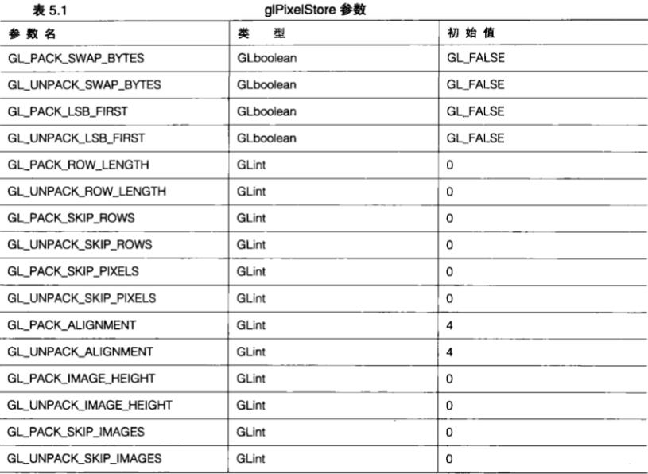
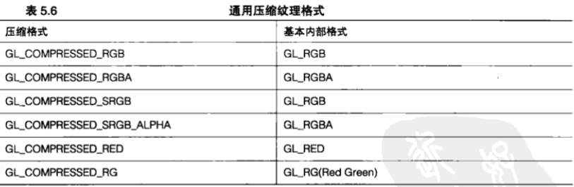

# 纹理基础


&emsp;&emsp;到现在为止,我们已经对点、线和三角形进行了渲染,也看到了如何能够通过计算颜色值对它们的表面进行着色,以及在它们之间进行插值操作来模拟光照效果。这一切都非常不错,并且在大量的 `3D` 应用程序细分市场中,这些就已经是需要了解的全部内容了。但是,为了达到更加现实的效果,还有一种非常棒的捷径,这就是纹理贴图( `texture mapping` )。纹理只是一种能够应用到场景中的三角形上的图像数据,它通过经过过滤的纹理单元( `texel` ,相当于基于纹理的像素)填充到实心区域。如图 `5.1` 所示,少量纹理文件就能为 `3D` 渲染增添令人兴奋的效果。


&nbsp;

&emsp;&emsp;不过,正如我们在第 `7` 章即将看到的,纹理远远不止是图像数据那么简单,它是大多数现代 `3D` 渲染算法的一个关键因素。

## 5.1 原始图像数据

&emsp;&emsp;刚开始的时候,我们只有一些位图,并且那时它们已经……足够好了。最早的电子计算机显示器是单色的(即只有一种颜色),一般是绿色或者琥珀色,每个像素都只能是两种状态中的一种:开启或关闭。早期的计算机图形非常简单,图像数据都是由位图(一系列表示开启和关闭像素值的 `0` 和 `1` )表示的。在位图中，每个内存块中的每个位都与屏幕上某一个像素的状态一一对应。图 `5.2` 所示是用位图表示的一匹马的图像。虽然只用了两种颜色(黑色和白色的点),但仍然能够清楚地表现出一匹马的外观。让我们将这幅图片和图 `5.3` 中显示的同一匹马的灰度图对比一下。在这个由像素组成的矩形【很多老前辈仍然称之为像素图( `pixmap` )】中,每个像素都显示了 `256` 种不同深度的灰色中的一种。

&emsp;&emsp;术语“位图”（ `bitmap` ）经常用在饱含灰度或全彩色数据的图像中。在 `Windows` 平台上，位图这个术语的这种用法尤为常见，它总是和 `.BMP` ( `bitmap` )文件扩展名联系在一起，`.BMP` 这种文件类型命名得很不好。很多人可能会对此进行争辩,严格地讲,这是对这个术语明显的误用。在本书中,我们不会将像素数据成为位图。

&emsp;&emsp;彩图 `2` 所示再次展示了这两幅图像，并且增加了一个全彩色的 `RGB` 版本。


> 5.1.1 像素包装

&emsp;&emsp;图像数据在内存中很少以紧密包装的形式存在。在许多硬件平台上,出于性能上的考虑,一幅图像的每一行都应该从一种特定的字节对齐地址开始。绝大多数编译器会自动把变量和缓冲区放置在一个针对该架构对齐优化的地址上。

&emsp;&emsp;在默认情况下, `OpenGL` 采用 `4` 个字节的对齐方式,这种方式适合于很多目前正在使用的系统。很多程序员会简单地将图像宽度值乘以高度值,再乘以每个像素的字节数,这样就错误地判断了存储一个图像所需的存储器数量。例如,如果我们有一幅RGB图像,包含 `3` 个分量(一个红色分量、一个绿色分量和一个蓝色分量),每个分量都存储在一个字节中(每个颜色通道 `8` 位,实际上这是非常典型的情况），那么，如果图像的宽度为 `199` 个像素，图像的每一行需要多少存储空间呢？读者可能会想，好吧,只要用 `199` 乘以 `3` ( `3` 种颜色通道各需要一个字节),结果应该是图像数据的每一行需要 `597` 个字节。这也许是对的。但是，如果您是一位优秀的程序员，那么可能会非常讨厌这个数字！如果硬件本身的体系结构是 `4` 字节排列的(大部分是这样的),那么图像每一行的末尾都将有额外的 `3` 个空字节进行填充（这就使每一行都有了 `600` 字节)，而这只是为了使每一行的存储器地址从一个能够被 `4` 整除的地址开始。

&emsp;&emsp;然而，很多时候这个问题都能够自己解决，尤其是在坚持二次幂纹理（稍后将做进一步讨论）时，但是我们还是应该多加小心，因为出现这样的小纰漏很可能会在后面的工作中导致某些很难发现的与内存相关的奇怪 `bug` ，这可能会让我们焦头烂额。虽然这看起来可能像是一种存储空间的浪费，但是这种排列能够让大多数 `CPU` 更高效地获取数据块。

&emsp;&emsp;许多未经压缩的图像文件格式也都遵循这种惯例。前面提到过的 `Windows` 中的 `.BMP` 文件格式的像素数据使用 `4` 字节排列:然而 `Targa` ( `.TGA` )文件格式则是 `1` 个字节排列的 …这样不会浪费空间。为什么内存分配意图对于 `OpenGL` 来说这样重要?这是因为,在我们向 `OpenGL` 提交图像数据或从 `OpenGL` 获取图像数据时, `OpenGL` 需要知道我们想要在内存中对数据进行怎样的包装或解包装操作。

&emsp;&emsp;我们可以使用下列函数改变或者恢复像素的存储方式。

```C++
void glpixelStorei(GLenum pname, GLint param);
void glpixelStoref(GLenum pname, GLfloat param);
```

&emsp;&emsp;举例来说，如果想要改成密集包装像素数据，应该像下面这样调用函数。

```C++
glPixelStorei(GL_UNPACK_ALIGENMENT, 1);
```

&emsp;&emsp;其中 `GL_UNPACK_ALIGNMENT` 指定 `OpenGL` 如何从数据缓冲区中解包图像数据。

&emsp;&emsp;类似地，我们可以使用 `GL_PACK_ALIGNMENT` 来告诉 `OpenGL` 如何将从像素缓冲区中读取并放置到一个用户指定的内存缓冲区的数据进行包装。表 `5.1` 列出了这个函数支持的像素存储模式的完整列表,并且在附录C中对更多细节进行了讨论。



> 5.1.2 像素图

&emsp;&emsp;在当今全彩色计算机系统中，更加有趣并且更加实用一些的是像素图( `pixmap` )。像素图在内存布局上与位图非常相似，但是每个像素将需要一个以上的存储位来表示。每个像素的附加位允许存储强度( `intensity`,有时被称为亮度,即 `luminance` 值)或者颜色分量值。在 `OpenGL` 核心版本中,我们无法直接将一个像素图绘制到颜色缓冲区中,但是可以使用下面的函数将颜色缓冲区的内容作为像素图直接读取。

```C++
void glReadPixels(GLint x, GLint y, GLsizei width, GLenum format, GLenum type, const void *pixels);
```

&emsp;&emsp;我们将 `×` 和 `y` 值指定为矩形左下角的窗口坐标,然后再指定矩形的 `width` 和 `height` 值(像素形式)。如果颜色缓冲区存储的数据与我们要求的不同, `OpenGL` 将负责进行必要的转换。

&emsp;&emsp;这种能力可能会非常有用。指向图像数据的指针“ `pixels` 必须是合法的，并且必须包含足够的存储空间来存储转换后的图像数据,否则我们可能就会遇到严重的内存运行时异常。我们还要注意,如果指定的窗口坐标超出了允许范围，那么只能获得实际 `OpenGL` 帧缓冲区内像素的数据。

&emsp;&emsp;函数 `glReadPixels` 的第 `4` 个变量是 `format` ,这个变量指定 `pixels` 指向的数据元素的颜色布局,并D可以采用表 `5.2` 中列出常量中的一个。


&emsp;&emsp;最后 `3` 个格式 `GL_STENCIL_INDEX` 、 `GL_DEPTH_COMPONENT` 和 `GL_DEPTH_STENCIL` 用于对模 板缓冲区和深度缓冲区直接进行读写。参数 `type` 解释参数 `*pixels` 指向的数据，它告诉 `OpenGL` 使用缓 冲区中的什么数据类型来存储颜色分量。表 `5.3` 列出了可以使用的值。

</br>
</br>

&emsp;&emsp;有必要指出, `glReadPixels` 从图形硬件中复制数据,通常通过总线传输到系统内存。在这种情况下,应用程序将被阻塞,直到内存传输完成。此外,如果我们指定一个与图形硬件的本地排列不同的像素布局,那么在数据进行重定格式时将产生额外的性能开销。

> 5.1.3 包装的像素格式

&emsp;&emsp;表 `5.3` 中列出的包装格式在 `OpenGL 1.2`（以及更新版本）中是作为一种手段出现的，为的是允许图形数据以更多的压缩形式进行存储,以便与更广泛的颜色图形硬件相匹配。如果包装像素数据的种类更少,那么显示硬件的设计就能够节省内存空间,或者更快地进行操作。这些包装像素格式在某些 `PC` 硬件中仍然能够找到,并且可能会在未来的硬件平台中继续发挥作用。

&emsp;&emsp;包装的像素格式将颜色数据压缩到了尽可能少的存储位中,每个颜色通道的位数显示在常量中。例如,格式为第一个分量提供 `3` 位存储空间,为第二个分量也提供3位存储空间,而为第 `3` 个分量则提供了两位存储空间。请记住,指定的分量(红、绿、蓝和 `Alpha` )的排列顺序仍然是根据format参数确定的。这些分量从高位(最大位,简称 `MSB` )到低位(最小位,简称 `LSB` )进行排列。`GLUNSIGNED_BYTE_2_3_3_REV` 没有采用这种排序方式,而是将最后的分量放置在了前两位,诸如此类。图 `5.4` 所示以图形的方式展示了这两种排列方式的位布局。所有其他的包装格式都可以用同样的方式解释。


&emsp;&emsp;这些格式和数据类型参数也在大量其他图像和纹理相关函数中使用,后面我们会再次提到这些表格。默认情况下,对于 `glReadPixels` 函数来说,读取操作在双缓冲区渲染环境下将在后台缓冲区进行,而在单缓冲区渲染环境下则在前台缓冲区进行。我们可以用下面的函数改变这些像素操作的源。

```C++
void glReadBuffer(GLenum mode);
```

&emsp;&emsp;模式参数可以取 `GL_FRONT` 、`GL_BACK` 、 `GL_LEFT` 、 `GL_RIGHT` 、 `GL_FRONT_LEFT` 、`GL_FRONT_RIGHT` 、 `GL_BACK_LEFT` , `GL_BACK_RIGHT` 或者甚至是 `GL_NONE` 中的任意一个。

> 5.1.4 保存像素

&emsp;&emsp;对于如何对像素数据进行一些有用的操作,我们已经讲解得不少了。`GLTools` 库中的 `gltWriteTGA` 函数从前台颜色缓冲区中读取颜色数据,并将这些数据存储到一个 `Targa` 文件格式的图像文件中。能够将当前的 `OpenGL` 渲染保存到一个标准图像文件格式中,这可能会非常有用。程序清单 `5.1` 列出了完整的 `gltWriteTGA` 函数。

```C++
GLint gltGrabScreenTGA(const char *szFileName)
{
    FILE *pFile;
    TGAHEADER tgaHeader;
    unsigned long lImageSize;
    GLbyte *pBits = NULL;
    GLint iViewport[4];
    GLenum lastBuffer;

    glGetIntegerv(GL_VIEWPORT, iViewport);

    lImageSize = iViewport[2] * 3 * iViewport[3];

    pBits = (GLbyte *)malloc(lImageSize);
    if(pBits == NULL)
        return 0;

    glPixelStorei(GL_PACK_ALIGNMENT, 1);
    glPixelStorei(GL_PACK_ROW_LENGTH, 0);
    glPixelStorei(GL_PACK_SKIP_ROWS, 0);
    glPixelStorei(GL_PACK_SKIP_PIXELS, 0);
    
    glGetIntegerv(GL_READ_BUFFER, (GLint *)&lastBuffer);
    glReadBuffer(GL_FRONT);
    glReadPixels(0, 0, iViewport[2], iViewport[3], GL_BGR_EXT, GL_UNSIGNED_BYTE, pBits);
    glReadBuffer(lastBuffer);
    
    tgaHeader.identsize = 0;
    tgaHeader.colorMapType = 0;
    tgaHeader.imageType = 2;
    tgaHeader.colorMapStart = 0;
    tgaHeader.colorMapLength = 0;
    tgaHeader.colorMapBits = 0;
    tgaHeader.xstart = 0;
    tgaHeader.ystart = 0;
    tgaHeader.width = iViewport[2];
    tgaHeader.height = iViewport[3];
    tgaHeader.bits = 24;
    tgaHeader.descriptor = 0;

    #ifdef __APPLE__
        LITTLE_ENDIAN_WORD(&tgaHeader.colorMapStart);
        LITTLE_ENDIAN_WORD(&tgaHeader.colorMapLength);
        LITTLE_ENDIAN_WORD(&tgaHeader.xstart);
        LITTLE_ENDIAN_WORD(&tgaHeader.ystart);
        LITTLE_ENDIAN_WORD(&tgaHeader.width);
        LITTLE_ENDIAN_WORD(&tgaHeader.height);
    #endif
    
    pFile = fopen(szFileName, "wb");
    if(pFile == NULL)
    {
        free(pBits);
        return 0;
    }

    fwrite(&tgaHeader, sizeof(TGAHEADER), 1, pFile);
    
    fwrite(pBits, lImageSize, 1, pFile);

    free(pBits);    
    fclose(pFile);
    
    return 1;
}
```

> 5.1.5 读取像素

&emsp;&emsp;`Targa` 图像格式是一种方便而且容易使用的图像格式,并且它既支持简单颜色图像,也支持带有 `Alpha` 值的图像。在本书中,我们会一直使用这种格式来进行纹理操作,现在我们先展示一下用于从磁盘中载入 `Targa` 文件的函数。

```C++
GLbyte *glReadTGABite(const char *szFileName, GLint *iWidth, GLint *iHeight, GLint *iComponents, GLenum *eFormat);
```

&emsp;&emsp;第一个参数是将要载入的 `Targa` 文件的文件名(如果有必要的话则会附加路径)。`Targa` 图像格式是得到广泛支持的通用图像文件格式,它与 `JPEG` 文件不同, `JPEG` 文件(通常)以未经压缩的格式存储图像。 `gltReadTGABits` 函数用来打开文件,然后读入文件头并进行语法分析,以确定文件的宽度、高度和数据格式。分量的数量可以是一个、`3` 个或 `4` 个,分别为亮度、 `RGB` 或 `RGBA` 图像。最终的参数是一个指向 `GLenum` 的指针,它接受图像相应的 `GLenum` 图像格式。如果函数调用成功,那么它就会返回一个新定位到直接从文件中读取的图像数据的指针(使用 `malloc` ),如果没有找到文件,或者出现其他错误,函数则会返回 `NULL` 。程序清单 `5.2` 列出了完整的 `gltReadTGABits` 函数。

```C++
GLbyte *gltReadTGABits(const char *szFileName, GLint *iWidth, GLint *iHeight, GLint *iComponents, GLenum *eFormat)
{
    FILE *pFile;
    TGAHEADER tgaHeader;
    unsigned long lImageSize;
    short sDepth;
    GLbyte *pBits = NULL;

    *iWidth = 0;
    *iHeight = 0;
    *eFormat = GL_RGB;
    *iComponents = GL_RGB;

    pFile = fopen(szFileName, "rb");
    if(pFile == NULL)
        return NULL;

    fread(&tgaHeader, 18/* sizeof(TGAHEADER)*/, 1, pFile);

    #ifdef __APPLE__
        LITTLE_ENDIAN_WORD(&tgaHeader.colorMapStart);
        LITTLE_ENDIAN_WORD(&tgaHeader.colorMapLength);
        LITTLE_ENDIAN_WORD(&tgaHeader.xstart);
        LITTLE_ENDIAN_WORD(&tgaHeader.ystart);
        LITTLE_ENDIAN_WORD(&tgaHeader.width);
        LITTLE_ENDIAN_WORD(&tgaHeader.height);
    #endif


    *iWidth = tgaHeader.width;
    *iHeight = tgaHeader.height;
    sDepth = tgaHeader.bits / 8;

    if(tgaHeader.bits != 8 && tgaHeader.bits != 24 && tgaHeader.bits != 32)
        return NULL;

    lImageSize = tgaHeader.width * tgaHeader.height * sDepth;

    pBits = (GLbyte*)malloc(lImageSize * sizeof(GLbyte));
    if(pBits == NULL)
        return NULL;

    if(fread(pBits, lImageSize, 1, pFile) != 1)
    {
        free(pBits);
        return NULL;
    }

    switch(sDepth)
    {
    #ifndef OPENGL_ES
        case 3:
            *eFormat = GL_BGR;
            *iComponents = GL_RGB;
            break;
    #endif
        case 4:
            *eFormat = GL_BGRA;
            *iComponents = GL_RGBA;
            break;
        case 1:
            *eFormat = GL_LUMINANCE;
            *iComponents = GL_LUMINANCE;
            break;
        default:
    #ifdef OPENGL_ES
        for(int i = 0; i < lImageSize; i+=3)
        {
            GLbyte temp = pBits[i];
            pBits[i] = pBits[i+2];
            pBits[i+2] = temp;
        }
    #endif
        break;
    }

    fclose(pFile);

    return pBits;
}
```

&emsp;&emsp;读者可能已经发现，分量的数量并没有被设置为整数 `1` 、 `3` 或 `4` ，而是设置为 `GL_LUMINANCE8` 、 `GL_RGB8` 和 `GL_RGBA8` , `OpenGL` 识别这些特殊的常量是为了在操作图像数据时保持完整的内部精度。

&emsp;&emsp;例如,出于性能方面的原因,一些 `OpenGL` 实现可能会在内部对一个 `24` 位颜色进行向下取样而得到一个 `16` 位颜色。这种情况在某些显示输出精度只有 `16` 位的实现中载入更高位数深度的图像时尤为普遍。这些实现请求这些常量存储和使用图像数据，以完全支持它们每通道 `8` 位的颜色深度。

&nbsp;

## 5.2 载入纹理

&emsp;&emsp;在几何图形中应用纹理贴图时,第一个必要步骤就是将纹理载入内存。一旦被载入,这些纹理就会成为当前纹理状态(稍候将进一步介绍相关内容)的一部分。有 `3` 个 `OpenGL` 函数最经常用来从存储器缓冲区中载入(比如说,从一个磁盘文件中读取)纹理数据。

```C++
void glTexImage1D(GLenum target, GLint level, GLint internalformat, GLsizei width, GLint border, GLenum format, GLenum type, void *data);
void glTexImage2D(GLenum target, GLint level, GLint internalformat, GLsizei width, GLsizei height, GLint border, GLenum format, GLenum type, void *data);
void glTexImage3D(GLenum target, GLint level, GLint internalformat, GLsizei width, GLsizei height, GLsizei depth, GLint border, GLenum format, GLenum type, void *data);
```

&emsp;&emsp;这 `3` 个函数确实非常冗长，它们通知 `OpenGL` 所需要知道的与如何解释数据参数指向的纹理数据有关的所有信息。

&emsp;&emsp;关于这些函数,我们应该知道的第一件事就是,它们实际上是由同一个函数 `glTeximage` 派生出来的。`OpenGL` 支持一维、二维和三维纹理贴图,并使用相应的函数来载入这些纹理并将它们设置为当前纹理。`OpenGL` 还支持立方图纹理，我们将把相关内容留到第 `7` 章讨论。我们还应该注意，`OpenGL` 会在调用这些函数中的一个时从 `data` 中复制纹理信息。这种数据复制可能会有很大的开销，稍后我们将讨论几种有助于减轻这个问题的方法。

&emsp;&emsp;这些函数中的 `target` 变量应分别为 `GL_TEXTURE_1D` 、 `GL_TEXTURE_2D` 或 `GL_TEXTURE_3D` 。我 们也可以指定代理纹理( `Proxy Texture` ),方法是指定 `GL_PROXY_TEXTURE_1D` 、 `GL_PROXY_TEXTURE_2D` 或 `GL_PROXY_TEXTURE_3D` ,并使用 `glGetTexParameter` 函数提取代理查询的结果。代理纹理和其 他一些有趣的纹理对象将在第 `7` 章进行介绍。

&emsp;&emsp;`Level` 参数指定了这些函数所加载的 `mip` 贴图层次。我们将在稍后介绍 `mip` 贴图。因此就目前来说，对于非 `mip` 贴图的纹理(可以把它当作旧式的普通纹理贴图)，我们总是可以把这个参数设置为 `0` 。

&emsp;&emsp;接下来，我们必须指定纹理数据的 `internalformat` 参数。这个信息会告诉 `OpenGL` 我们希望在每个纹理单元中存储多少颜色成分，并在可能的情况下说明这些成分的存储大小，以及是否希望对纹理进行压缩。

&emsp;&emsp;表 `5.4` 列出了这个函数最为常用的一些值。完整的列表见附录 `C` 。


&emsp;&emsp;`width` , `height` 和 `depth` 参数（在取值合适的时候）指定了被加载纹理的宽度、高度和深度。注意，这些值必须是2的整数次方( `1` 、 `2` 、 `4` 、 `8` 、 `16` 、 `32` 、 `64` 等),这一点非常重要。纹理贴图并不要求是立方体( `3` 个维度都相等),但是一个纹理在加载时如果使用了非`2`的整数次幂的值，在较老的 `OpenGL` 实现中,将会导致纹理贴图被隐式地禁用。尽管 `OpenGL 2.0` (以及更新的版本)允许使用非 `2` 的整数次幂的纹理,但无法保证它们在底层的硬件中能够实现足够的速度。出于这个原因,许多追求性能的开发人员仍然避免使用非 `2` 的整数次幂的纹理。

&emsp;&emsp;`border` 参数允许我们为纹理贴图指定一个边界宽度。纹理边界允许我们通过对边界处的纹理单元进行额外的设置,来对它的宽度、高度或深度进行扩展。在稍后将要进行的对纹理过滤的讨论中,纹理边界扮演了一个非常重要的角色。不过就目前来讲，我们可以把这个值设置为 `0` 。

&emsp;&emsp;最后 `3` 个参数 `format` 、 `type` 和 `data` 和用于把图像数据放入颜色缓冲区的 `glDrawPixels` 函数的对应 参数相同。为了方便起见,我们在表 `5.2` 和 `5.3` 中列出了 `format` 和 `type` 参数的合法常量值。

> 5.2.1 使用颜色缓冲区

&emsp;&emsp;一维和二维纹理也可以从颜色缓冲区加载数据。我们可以从颜色缓冲区读取一幅图像，并通过下面这两个函数将它作为一个新的纹理使用。

```C++
void glCopyTexImage1D(GLenum target, GLint level, GLenum internalformat, GLint x, GLint y, GLsizei width, GLint border)
void glCopyTexImage2D(GLenum target, GLint level, GLenum internalformat, GLint x, GLint y, GLsizei width, GLsizei height, GLint border)
```

&emsp;&emsp;这两个函数的操作类似于 `glTexlmage` ,但在这里x和y在颜色缓冲区中指定了开始读取纹理数据的位置。源缓冲区是通过 `glReadBuffer` 函数设置的。请注意，并不存在 `glCopyTexlmage3D` ，因为我们无法从 `2D` 颜色缓冲区获取体积数据。

> 5.2.2 更新纹理

&emsp;&emsp;在时间敏感的场合如游戏或模拟应用程序中,重复加载新纹理可能会成为性能瓶颈。如果我们不再需要某个已加载的纹理，它可以被全部替换，也可以被替换掉一部分。替换一个纹理图像常常要比直接使用 `glTeximage` 重新加载一个新纹理快得多。用于完成这个任务的函数是 `glTexSublmage` ,它同样具有3个变型。

```C++
void glTexSubImage1D(GLenum target, GLint level, GLint xOffset, GLsizei width, GLenum format, GLenum type, GLvoid *data);
void glTexSubImage2D(GLenum target, GLint level, GLint xOffset, GLint yOffset, GLsizei width, GLsizei height, GLenum format, GLenum type, GLvoid *data);
void glTexSubImage3D(GLenum target, GLint level, GLint xOffset, GLint yOffset, GLint zOffset, GLsizei width, GLsizei height, GLsizei depth, GLenum format, GLenum type, GLvoid *data);
```

&emsp;&emsp;绝大部分参数都与 `glTexlmage` 函数所使用的参数准确地对应。`xOffset` 、 `yOffset` 和 `zOffset` 参数指定 了在原来的纹理贴图中开始替换纹理数据的偏移量。`width`, `height`和`depth`参数指定了“插入”到原来 那个纹理中的新纹理的宽度、高度和深度。

&emsp;&emsp;最后一组函数允许我们从颜色缓冲区读取纹理，并插入或替换原来纹理的一部分。下面这些函数都是 `glCopyTexSublmage` 函数的变型,它们都用于完成这个任务。

```C++
void glCopyTexSubImage1D(GLenum target, GLint level, GLint xoffset, GLint x, GLint y, GLsizei width);
void glCopyTexSubImage2D(GLenum target, GLint level, GLint xoffset, GLint yoffset, GLint x, GLint y, GLsizei width, GLsizei height);
void glCopyTexSubImage3D(GLenum target, GLint level, GLint xoffset, GLint yoffset, GLint zoffset, GLint x, GLint y, GLsizei width, GLsizei height);
```

&emsp;&emsp;读者可能已经注意到，这里并没有列出 `glCopyTexlmage3D` 函数。这是因为颜色缓冲区是 `2D` 的，不存在一种对应方法来将一幅 `2D` 彩色图像作为一个 `3D` 纹理的来源。但是,我们可以使用 `glCopyTexSublmage3D` 函数,在一个三维纹理中使用颜色缓冲区的数据来设置它的一个纹理单元平面。

> 5.2.3 纹理对象

&emsp;&emsp;到目前为止,我们已经看到了几种加载纹理的方式和一些替换纹理的方法。很多年前我们就见过只能支持一种纹理的硬件，在这种情况下 `OpenGL` 就发展出一种管理多重纹理并在它们之间进行转换的方法。纹理图像本身就是所谓的纹理状态的一部分。纹理状态包含了纹理图像本身和一组纹理参数，这些参数控制过滤和纹理坐标的行为。使用 `glTexParameter` 函数设置这些纹理状态参数的相关内容随后将进行讨论。不过，首先让我们了解一下如何加载和管理几种不同的纹理。

&emsp;&emsp;像 `glTeximage` 和 `glTexSublmage` 这样的函数调用所耗费的内存特别多,并且可能需要重新对这些数据进行格式化以匹配一些内部表示方式。

&emsp;&emsp;在纹理之间进行切换或者重新加载不同的纹理图像可能会是开销很大的操作。纹理对象允许我们一次加载一个以上的纹理状态(包括纹理图像),以及在它们之间进行快速切换。纹理状态是由当前绑定的纹理对象维护的,而纹理对象是由一个无符号整数标识的。我们可以用下面这个函数分配一些纹理对象。

```C++
void glGenTexture(GLsizei n, GLuint *textures);
```

&emsp;&emsp;在这个函数中，我们可以指定纹理对象的数量和一个指针，这个指针指向一个无符号整型数组(由纹理对象标识符填充)。我们可以把它们看成是不同的可用纹理状态的句柄。为了“绑定”其中一种纹理状态，可以调用下面这个函数。

```C++
void glBindTexture(GLenum target, GLuint texture);
```

&emsp;&emsp;`target` 参数必须是 `GL_TEXTURE_1D` , `GL_TEXTURE_2D` 或 `GL_TEXTURE_3D` ,而 `texture` 参数则是 需要绑定的特定纹理对象。此后,所有的纹理加载和纹理参数设置只影响当前绑定的纹理对象。为了删除 纹理对象,可以调用下面这个函数。

```C++
void glDeleteTextures(GLsizei n, GLuint *textures);
```

&emsp;&emsp;这个函数的参数和 `glGenTextures` 函数的参数具有相同的含义。我们并不需要同时产生和删除所有的纹理对象。多次调用 `glGenTextures` 所带来的额外开销很小。多次调用 `glDeleteTextures` 可能会造成一些延迟，但这种情况只有在销毁大量的纹理内存时才会发生。

&emsp;&emsp;我们可以使用下面这个函数对纹理对象名(或句柄)进行测试,以判断它们是否有效。

```C++
GLboolean glIsTexture(GLuint texture);
```

&emsp;&emsp;如果这个函数是一个以前已经分配了纹理对象句柄，那么这个函数就返回 `GL_TRUE`，否则返回 `GL_FALSE`。

&nbsp;

## 5.3 纹理应用

&emsp;&emsp;加载纹理只是在几何图形上应用纹理的第一步。最低限度我们必须同时提供纹理坐标,并设置纹理坐标环绕模式和纹理过滤。最后，我们可以选择对纹理进行 `Mip` 贴图，以提高纹理贴图性能和/或视觉质量。当然,在这整个过程中,我们都在假定着色器在做“正确的事情"。在本章中,我们坚持使用 `2D` 纹理示例并使用存储着色器。在下一章中，当我们开始编写着色器时，就会看到如何从着色器的层次上应用纹理了。不过就目前来说，我们只要关注客户端的纹理贴图技术就可以了。

> 5.3.1 纹理坐标

&emsp;&emsp;总体上讲,我们是通过为每个顶点指定一个纹理坐标而直接在几何图形上进行纹理贴图的。纹理坐标要么是指定为着色器的一个属性,要么通过算法计算出来。纹理贴图中的纹理单元是作为一个更加抽象(经常是浮点值)的纹理坐标,而不是作为内存位置(在像素图中则是这样)进行寻址的。典型情况下,纹理坐标是作为 `0.0` 到 `1.0` 范围内的浮点值指定的。纹理坐标命名为为 `s` 、 `t` 、 `r` 和 `q` （ 与顶点坐标 `×` 、 `y` 、 `z` 和 `w` 相类似），支持从一维到三维的纹理坐标，并且可以选择一种对坐标进行缩放的方法。

&emsp;&emsp;图 `5.5` 所示显示了一维、二维和三维纹理,以及根据它们的纹理单元排列纹理坐标的方式。


&emsp;&emsp;因为不存在四分量的纹理,所以读者可能会奇怪, `q` 坐标是做什么用的。`q` 坐标对应几何坐标 `w` 。这是一个缩放因子，作用于其他纹理坐标。也就是说，我们实际所使用的纹理坐标是 `s/q` 、 `t/q` 和 `r/q` 。在默认情况下，`q `设置为 `1.0`。虽然这看起来似乎有些随意，但对于阴影贴图（ `shadow mapping` ） 之类一些高级纹理坐标生成算法来说确实非常有用。

&emsp;&emsp;一个纹理坐标会在每个顶点上应用一个纹理（没错，确实有一种同时应用一个以上纹理的方法）。然后，`OpenGL` 根据需要对纹理进行放大或缩小，将纹理贴图到几何图形上。(放大或缩小是使用当前的纹理过滤器实现的,我们将在稍后讨论这个话题)。图 `5.6` 所示显示了一个例子,一个二维纹理被贴图到几何图形上的一个正方形(可能是三角形扇)上。注意这个纹理的各个角对应于这个四边形的各个角。


&emsp;&emsp;然而，我们很少能够碰到上面这种情况，也就是一个四边形纹理能够严丝合缝地贴图到一个正方体的几何图形上。为了帮助读者更好地理解纹理坐标,我们提供了另一个例子,如图 `5.7` 所示。这幅图也显示了一个正方形的纹理图像,但现在这个几何图形是个三角形。叠加在这个纹理贴图上的是扩展到这个三角形各个顶点在贴图上位置的纹理坐标。


> 5.3.2 纹理参数

&emsp;&emsp;和将一幅图片贴在三角形的一面相比，纹理贴图需要更多的工作。很多参数的应用都会影响渲染的规则和纹理贴图的行为。这些纹理参数都是通过 `glTexParameter` 函数的变量来进行设置的。

```C++
void glTexParameterf(GLenum target, GLenum pname, GLfloat param);
void glTexParameteri(GLenum target, GLenum pname, GLint param);
void glTexParameterfv(GLenum target, GLenum pname, GLfloat *params);
void glTexParameteriv(GLenum target, GLenum pname, GLint *params);
```

&emsp;&emsp;第一个参数 `target` 指定这些参数将要应用在哪个纹理模式上,它可以是 `GL_TEXTURE_1D` 、 `GL_TEXTURE_2D` 或 `GL_TEXTURE_3D` (关于后两个值将在第 `7` 章做进一步讨论)。第二个参数 `pname` 指定了需要设置哪个纹理参数,而最后一个参数param或params用于设置特定的纹理参数的值。

&emsp;&emsp;**基本过滤**

&emsp;&emsp;纹理图像中的纹理单元和屏幕上的像素几乎从来不会形成一对一的对应关系。如果程序员足够细心,确实可以实现这个效果,但这需要在对几何图形进行纹理贴图时进行精心的计划,使出现在屏幕上的纹理单元和像素能够对齐。(实际上在用 `OpenGL` 进行图像处理应用时经常做这项工作)。因此,当纹理应用于几何图形的表面时,纹理图像不是被拉伸就是被收缩。根据几何图形的方向,一个特定的纹理甚至可能会在贴到一些物体表面的同时就开始进行拉伸和收缩。
    
&emsp;&emsp;根据一个拉伸或收缩的纹理贴图计算颜色片段的过程称为纹理过滤( `Texture Fililtering` )。使用 OpenGL的纹理参数函数，可以同时设置放大和缩小过滤器。这两种过滤器的参数名分别是 `GL_TEXTURE_MAG_FILTER` 和 `GL_TEXTURE_MIN_FILTER` 。就目前来说,我们可以为它们从两种基本 的纹理过滤器 `GL_NEAREST` 和 `GL_LINEAR` 中进行选择,它们分别对应于最邻近过滤和线性过滤。确保 总是为 `GL_TEXTURE_MIN_FILTER` 选择这两种过滤器中的一种,因为默认的过滤器不适用于 `Mip` 贴图(参 见“ `Mip` 贴图”一节)。
    
&emsp;&emsp;最邻近过滤是我们能够选择的最简单、最快速的过滤方法。
    
&emsp;&emsp;纹理坐标总是根据纹理图像的纹理单元进行求值和绘图的。不管纹理坐标位于哪个纹理单元，这个纹理单元的颜色就作为这个片段的纹理颜色。最邻近过滤最显著的特征就是当纹理被拉伸到特别大时所出现的大片斑驳状像素。图5.8所示显示了最邻近过滤的一个例子。我们可以使用下面这两个函数,为放大和缩小过滤器设置纹理过滤器(用于 `GL_TEXTURE_2D` )。

```C++
glTexParameteri(GL_TEXTURE_2D, GL_TEXTURE_MAG_FILTER, GL_NEAREST);
glTexParameteri(GL_TEXTURE_2D, GL_TEXTURE_MIN_FILTER, GL_NEAREST);
```

&emsp;&emsp;和最邻近过滤相比，线性过滤还需要更多的工作，但它所实现的效果往往值得付出这些额外的开销。在当今的高速硬件上,线性过滤所带来的额外开销几乎可以忽略不计。
    
&emsp;&emsp;线性过滤并不是把最邻近的纹理单元应用到纹理坐标中，而是把这个纹理坐标周围的纹理单元的加权平均值应用到这个纹理坐标上(线性插值)。为了让这个插值的片段与纹理单元的颜色准确匹配,纹理坐标需要准确地落在纹理单元的中心。线性过滤最显著的特征就是当纹理被拉伸时所出现的“失真”图形。但是,和最邻近过滤模式下所呈现的斑驳状像素块相比,这种“失真”更接近真实,没有那种人工操作的痕迹。图 `5.9` 所示显示了一个与图 `5.8` 形成对照的例子。我们可以使用下面这几行代码,简单地设置线性过滤（用于  `GL_TEXTURE_2D` ）。

```C++
glTexParameteri(GL_TEXTURE_2D, GL_TEXTURE_MAG_FILTER, GL_LINEAR);
glTexParameteri(GL_TEXTURE_2D, GL_TEXTURE_MIN_FILTER, GL_LINEAR);
```


&emsp;&emsp;**纹理环绕**

&emsp;&emsp;在正常情况下，我们在 `0.0` 到 `1.0` 的范围之内指定纹理坐标，使它与纹理贴图中的纹理单元形成映射 关系。如果纹理坐标落在这个范围之外, `OpenGL`则根据当前纹理环绕模式( `Wrapping Mode` )处理这 个问题。我们可以调用 `glTexParameteri` 函数(并分别使用 `GL_TEXTURE_WRAP_S` 、 `GL_TEXTURE_WRAP_T` 或 `GL_TEXTURE_WRAP_R` 作为参数),为每个坐标分别设置环绕模式。然后, 我们可以把环绕模式设置为下面几个值之一: `GL_REPEAT` , `GLCLAMP` , `GL_CLAMP_TO_EDGE` 或 `GL_CLAMP_TO_BORDER` 。
    
&emsp;&emsp;在 `GL_REPEAT` 环绕模式下, `OpenGL` 在纹理坐标值超过 `1.0` 的方向上对纹理进行重复。这种纹理重复对每个整型纹理坐标都适用。如果我们需要把一个小型的平铺式纹理应用到大型几何图形的表面,这种模式就会非常有用。设计良好的无缝纹理可以导致大型纹理看上来也是无缝的，但是这个效果所付出的代价是它需要小得多的纹理图像。其他模式并不进行重复,而是像它们的名字所提示的那样,进行“截取”。
    
&emsp;&emsp;如果环绕模式仅有的意义就在于是否对纹理进行重复,那么只需要两种环绕模式就够了:重复和截取。但是,纹理环绕模式对于纹理贴图边缘如何进行纹理过滤有着非常大的影响。在 `GL_NEAREST` 过滤模式中，环绕模式并不起作用，因为纹理坐标总是对齐到纹理贴图中一些特定的纹理单元。但是，`GL_LINEAR` 过滤则需要取纹理坐标周围像素的平均值，对于那些位于纹理贴图边缘的纹理单元，这样就会出现问题。
    
&emsp;&emsp;如果纹理围绕模式设置为 `GL_REPEAT` ，这个问题就可以非常简单地得到处理。纹理采样简单地从接下来的行或列提取。在重复模式中,这相当于环绕到纹理的另一边。对于沿物体环绕并与另一边吻合的纹理(例如球体)，这种模式是相当完美的。
    
&emsp;&emsp;截取型的纹理环绕模式提供了一些选项来处理纹理边缘。对于 `GL_CLAMP` ,所需的纹理单元取自纹理边界或  `TEXTURE_BORDER_COLOR` (用 `glTexParameterfv` 函数进行设置 )。 `GL_CLAMP_TO_EDGE` 环绕模式强制对范围之外的纹理坐标沿着合法的纹理单元的最后一行或者最后一列进行采样。最后，`GL_CLAMP_TO_BORDER` 环绕模式在纹理坐标在 `0.0` 到 `1.0` 的范围之外时只使用边界纹理单元。边界纹理单元是作为围绕基本图像的额外的行和列，并与基本纹理图像一起加载的。

&emsp;&emsp;截取模式的一个典型应用就是在必须对一块大型区域进行纹理处理时。此时如果使用单个纹理,它将会由于过于庞大而无法装入到内存中,或者它可能会加载到单个纹理图像中。在这种情况下,这块区域被切割成更小的平铺在一起的“瓷砖”。此时,如果不使用像 `GL_CLAMP_TO_EDGE` 这样的环绕模式,就会导致各块“瓷砖”之间存在明显的缝隙痕迹。
    
&emsp;&emsp;在极少的情况下，如果这种做法仍然不能满足要求，可以求助于纹理边界纹理单元。

> 5.3.3 综合应用

&emsp;&emsp;我们已经了解了很多纹理贴图的特性和需要，但还没有接触具体的示例程序。下面来看一个完整的示例程序 `Pyramid` (金字塔),这个程序绘制了一个金字塔并在上面应用了类似图 `5.6` 和图 `5.7` 所示的纹理。


&emsp;&emsp;**加载纹理**

&emsp;&emsp;我们要做的第一步工作就是加载纹理 `stone.tga`。我们通过 `SetupRC` 函数完成这项工作，如下所示。

```C++
glGenTexture(1, &textureID);
glBindTexture(GL_TEXTURE_2D, textureID);
LoadTGATexture("stone.tga", GL_LINEAR, GL_LINEAR, GL_CLAMP_TO_EDGE);
```

&emsp;&emsp;在原文件（ `pyramid.cpp` ）的顶部声明变量 `textureID` ，如下所示。

```C++
GLint textureID;
```

&emsp;&emsp;函数 `glGenTextures` 将分配一个纹理对象,并将它放置在这个变量中。我们使用 `textureID` 值来识别单个纹理,并调用 `glBindTexture` 对这个纹理状态进行初始绑定。函数 `glGenTextures` 只保留一个纹理对象 `ID` ,这的确是一个轻量级的函数。新的纹理状态实际上在我们第一次调用 `glBindTexture` 之前都不会进行创建和初始化。与此相对应,我们已经使用过了在程序结束时用于删除纹理对象的 `ShutdownRC` 函数。

```C++
glDeleteTextures(1, &textureID);
```

&emsp;&emsp;实际加载纹理和设置纹理状态是用过函数 `LoadTGATexture` 完成的。

```C++
bool LoadTGATexture(const char *szFileName, GLenum minFilter, GLenum magFilter, GLenum wrapMode);
```

&emsp;&emsp;这个函数接受图像文件的文件名，需要的缩小和放大过滤器，以及纹理坐标环绕模式为参数。它将完整地对纹理状态进行设置,并且因为它被放置在调用 `glBindTexture` 之后,所以就成为了由 `texture1D` 标识的纹理对象的一部分。程序清单 `5.3` 完整地展示了 `LoadTGATexture` 函数。虽然这个函数不是 `GLTools` 的一部分,我们还是会在几个示例程序中使用到它。

```C++
bool LoadTGATexture(const char* szFileName, GLenum minFilter, GLenum magFilter, GLenum wrapMode)
{
    GLbyte* pBits;
    int nWidth, nHeight, nComponent;
    GLenum eFormat;

    pBits = gltReadTGABits(szFileName, &nWidth, &nHeight, &nComponent, &eFormat);
    if (pBits == NULL)
        return false;

    glTexParameteri(GL_TEXTURE_2D, GL_TEXTURE_WRAP_S, wrapMode);
    glTexParameteri(GL_TEXTURE_2D, GL_TEXTURE_WRAP_T, wrapMode);
    
    glTexParameteri(GL_TEXTURE_2D, GL_TEXTURE_MIN_FILTER, minFilter);
    glTexParameteri(GL_TEXTURE_2D, GL_TEXTURE_MAG_FILTER, magFilter);

    glPixelStorei(GL_UNPACK_ALIGNMENT, 1);
    glTexImage2D(GL_TEXTURE_2D, 0, nComponent, nWidth, nHeight, 0, eFormat, GL_UNSIGNED_BYTE, pBits);

    free(pBits);

    if(minFilter == GL_LINEAR_MIPMAP_LINEAR ||
    minFilter == GL_LINEAR_MIPMAP_NEAREST ||
    minFilter == GL_NEAREST_MIPMAP_LINEAR ||
    minFilter == GL_NEAREST_MIPMAP_NEAREST)
        glGenerateMipmap(GL_TEXTURE_2D);

    return true;
}
```

&emsp;&emsp;还有一件事我们没有讨论，这就是调用 `glGenerateMipmap` 和基于 `Mip` 贴图的过滤器。`Mip` 贴图将在后面的内容中讲述,在实际使用这个特性之前我们暂时不管它。

&emsp;&emsp;**指定纹理坐标**

&emsp;&emsp;在 `SetupRC` 中加载纹理之后，我们调用函数 `MakePyramid`，并传递 `GLBatch` 的一个叫做 `pyramidBatch` 的实例。

```C++
MakePyramid(pyramudBatch);
```

&emsp;&emsp;这个函数手动构建了一个由独立三角形组成的金字塔，并将它们放置到 `pyramidBatch` 容器类中。我们在这里并不打算列出这个函数的完整代码,但是对于这里发生的一些有趣的事情,我们还是需要说明一下。前面使用 `GLBatch` 类时,我们用 `CopyVertexData` 函数一次性将整整一个数组的数据复制到了一个批次中。`GLBatch` 类还包含一些函数，允许我们每次一个顶点建立一个批次。这看起来有点像兼容版本中那种古老的、现在已经不推荐的立即模式( `immediate mode`),这肯定会引起一些争议。毫无疑问,真正的立即模式是组建一个顶点批次最慢的方式,但是它可以是很方便的,并且可以使手动构建几何图形得到简化。 `GLBatch` 类的这个特性并不是模仿真正的立即模式,因此,如果读者已经对立即模式非常熟悉的话,就要忘掉大部分所知的内容,因为我们的应用已经经过了简化。

&emsp;&emsp;下面让我们了解一下如何开始组建三角形批次。

```C++
pyramidBatch.Begin(GL_TRIANGLES, 18, 1);
```

&emsp;&emsp;这样就开始了一个批次,就像我们开始任何一个 `GLBatch` 一样。请注意这里的最后一个参数是 `1` 。这就意味着在这个批次中将应用一个纹理。我们使用默认参数的 `C++` 特性，而如果保持这个参数关闭状态的话,那么它将自动设置为 `0` 。实际上我们可以一次性应用多个纹理,在第 `7` 章我们将讨论如何进行这项工作。
    
&emsp;&emsp;现在让我们来看一下，如何将三角形的前两个顶点添加到金字塔的底部。

```c++
pyramidBatch.Normal3f(0.0f, -1.0f, 0.0f);
pyramidBatch.MultiTexCoord2f(0, 0.0f, 0.0f);
pyramidBatch.Vertex3f(-1.0f, -1.0f, -1.0f);

pyramidBatch.Normal3f(0.0f, -1.0f, 0.0f);
pyramidBatch.MultiTexCoord2f(0, 1.0f, 0.0f);
pyramidBatch.Vertex3f(1.0f, -1.0f, -1.0f);
```

&emsp;&emsp;`Normal3f` 方法向批次中添加了一个表面法线。 `MultiTexCoord2f` 添加了一个纹理坐标，最后，`Vertex3f` 添加了顶点的位置。对于不应用到老式立即模式的 `GLBatch` 来说，有一个重要的原则是，如果我们为任何顶点指定了法线或纹理坐标,那么就必须为每个顶点进行同样的指定。这样就损失了老方法的一些灵活性,但是确实让它运行得快了一些。 `Normal3f` 和 `Vertex3f` 函数都是不言自明的,但是 `MultiTexCord2f` 则有 `3` 个参数，并且第一个参数是一个整数。

```C++
void GLBatch::MultiTexCoord2f(GLuint texture, GLclampf s, GLclampf t);
```

&emsp;&emsp;在这里，除了纹理坐标之外，我们通过 `texture` 指定纹理层次。在学习第 `7` 章的多重纹理相关内容之前，对于存储着色器来说，总要把它设置为 `0` 。
    
&emsp;&emsp;对于数学推导和手动建模的几何图形来说，这种设置顶点数据的方式可能是非常方便的，并且可以精简代码,这里我们将展示如何为金字塔的一个面来计算表面法线,然后再在所有 `3` 个顶点上使用它。

```C++
m3dFindNormal(n, vApex, vFrontLeft, vFrontRight);
pyramidBatch.Normal3fv(n);
pyramidBatch.MultiTexCoord2f(0, 0.5f, 1.0f);
pyramidBatch.Vertex3fv(vApex);

pyramidBatch.Normal3fv(n);
pyramidBatch.MultiTexCoord2f(0, 0.0f, 0.0f);
pyramidBatch.Vertex3fv(vFrontLeft);

pyramidBatch.Normal3fv(n);
pyramidBatch.MultiTexCoord2f(0, 1.0f, 0.0f);
pyramidBatch.Vertex3fv(vFrontRight);
```

&emsp;&emsp;我们将在下一章通过一个实例着色器来讨论这部分内容。表面法线是有方向的向量，它代表表面（或者顶点）面对的方向。这在大多数光照模式下都是必须的。
    
&emsp;&emsp;请记住，以每次一个元素的方式复制大量数据，无异于用每次一茶杯水的方式填满一个游泳池。在性能敏感的环境中,我们不应该采用这种方式。通常启动开销可以忽略不计,这就好办了。不过,如果几何图形是动态的,而我们又经常要改变它们,那么这就可能是移动大量几何图形数据的最差方式了。
    
&emsp;&emsp;最后，我们来看一看如何在示例程序中实际渲染金字塔。请注意我们必须再一次绑定纹理对象 `textureID` 。

```C++
glBindTexture(GL_TEXTURE_2D, textureID);
shaderManager.UseStockShader(GL_SHADER_TEXTURE_POINT_LIGHT_DIFF,
    transformPipeline.GetModelViewMatrix(),
    transformPipeline.GetProjectionMatrix(),
    vLightPos, vWhite, 0
);
pyramidBatch.Draw();
```

&emsp;&emsp;严格地讲,对纹理进行绑定并不是必须的,因为在项目中只有一个纹理,而在加载纹理时已经对它进行了绑定。然而这样的情况并不多见,所以我们要注意，在提交一个几何图形批次的时候需要绑定到我们想要使用的纹理。实际上绑定也可以放置在着色器之后,只要它在几何图形提交之前进行绑定,那么这个纹理就会是使用过的那个。
    
&emsp;&emsp;对于本例来说,我们也使用一个新的存储着色器 `GLT_SHADER_TEXTURE_POINT_LIGHT_DIFF` 。这个着色器将在我们的场景中设置一个点光源,使用指定的颜色来对几何图形进行着色,在本例中为 `vWhite` ,然后将它乘以纹理颜色。结果得到经过着色和纹理贴图的金字塔，如图 `5.10` 所示。

&nbsp;

## 5.4 Mip 贴图

&emsp;&emsp;`Mip` 贴图是一种功能强大的纹理技巧，它不仅可以提高渲染性能，而且可以改善场景的显示质量。它使用标准纹理贴图处理两个常见的问题,从而实现上述目标。第一个问题是一种称为闪烁( `Scintillation` ,即锯齿假影)的效果。当屏幕上被渲染物体的表面与它所应用的纹理图像相比显得非常小时,就会出现这种效果。闪烁可以被看成是某种类型的闪光,当纹理图像的采样区域的移动幅度与它在屏幕上的大小相比显得不成比例时,就会发生这种现象。当照相机或物体处于运动状态时,我们很容易看到闪烁的负面效果。

&emsp;&emsp;第二个问题更多地和性能有关，但它的原因和闪烁相同。也就是说，问题的根源在于它必须加载大量的纹理内存并对它们进行过滤处理,但屏幕上实际显示的只是很少的一部分片段。纹理越大,这个问题所造成的性能影响也就越为明显。

&emsp;&emsp;当然,我们可以用一种非常简单的方法解决这两个问题,就是使用更小的纹理图像。但是,这种解决方法又产生了一个新问题,就是当一个物体更靠近观察者时,它必须渲染得比原来更大一些。这样,那个较小的纹理图像不得不进行拉伸，结果形成了视觉效果很差的模糊或斑驳状的纹理化物体。

&emsp;&emsp;这两个问题的解决方案就是使用 `Mip` 贴图。`Mip` 贴图取自拉丁文短语“ `multum in parvo` ”，意思是“一个小地方有许多东西”。从本质上说，我们不是把单个图像加载到纹理状态中，而是把一系列从最大到最小的图像加载到单个“ `Mip` 贴图”·纹理状态。然后，`OpenGL` 使用一组新的过滤模式，为一个特定的几何图形选择具有最佳过滤效果的纹理。在付出一些额外内存的代价之后(可能还有一些额外的处理任务),不仅可以消除闪烁现象，而且可以大大降低对远处物体进行纹理贴图时所需要的内存及处理开销。同时，在需要的时候，它还可以维护一组具有更高分辨率的可用纹理。

&emsp;&emsp;`Mip` 贴图纹理由一系列纹理图像组成,每个图像大小在每个轴的方向上都缩小一半,或者说是原来图像像素总数的四分之一。图 `5.11` 所示显示了这些场景。`Mip` 贴图层并不一定是正方形的,但每个图像的大小都依次减半,直到最后一个图像的大小是 `1x1` 的纹理单元为止。当其中一个维度的大小到达 `1` 时,接下来的减半处理就只发生在其他维度上了。使用一组正方形(即各个维度的大小相等)的 `Mip` 贴图所要求的内存比不使用 `Mip` 贴图要多出三分之一。


&emsp;&emsp;`Mip` 贴图层是通过 `glTexlmage` 函数加载的。现在轮到 `level` 参数发挥它的作用了,因为它指定了图像 数据用于哪个 `Mip` 层。第一层是 `0` ,接着是 `1` 、 `2` ,然后依此类推。如果Mip贴图未被使用,那么就只有第 `0` 层会被加载。在默认情况下,为了使用 `Mip` 贴图,所有的 `Mip` 层都必须加载。但是,我们可以用 `GL_TEXTURE-BASE_LEVEL` 和`GL_TEXTURE_MAX_LEVEL` 纹理参数特别设置需要使用的基层和最大层。 例如,如果想指定只加载从第 `0` 层至第 `4` 层,可以像下面这样调用 `glTexParameteri` 函数两次。

```C++
glTexParameteri(GL_TEXTURE_2D, GL_TEXTURE_BASE_LEVEL, 0);
glTexParameteri(GL_TEXTURE_2D, GL_TEXTURE_MAX_LEVEL, 4);
```

&emsp;&emsp;尽管 `GL_TEXTURE_BASE_LEVEL` 和 `GL_TEXTURE_MAX_LEVEL` 控制哪些 `Mip` 层将被加载,但我们仍然可以使用 `GL_TEXTURE_MIN_LOD` 和 `GL_TEXTURE_MAX_LOD` 参数限制已加载的 `Mip` 层的使用范围。

> 5.4.1 Mip 贴图过滤

&emsp;&emsp;`Mip` 贴图在两个基本的纹理过滤模式 `GL_NEAREST` 和 `GL_LINEAR` 上添加了一个新的变化,这是通过向 `Mip` 贴图过滤模式提供4种不同变化实现的。表 `5.5` 列出了这些变化。


&emsp;&emsp;仅仅使用 `glTexlmage` 函数加载 `Mip` 层并不能启用 `Mip` 贴图功能。如果纹理过滤设置为 `GL_LINEAR` 或 `GL_NEAREST` ,那么就只有纹理贴图基层会被使用,其他所有加载的 `Mip` 层都将被忽略。我们必须指定其中一个 `Mip` 贴图过滤器,这样才能使用所有已加载的 `Mip` 层。这个常量具有 `GL_FILTER_MIPMAP_SELECTOR` 的形式,其中 `FILTER` 指定了被选择的 `Mip` 层将要使用的纹理过 滤器, `SELECTOR` 则指定了如何选择 `Mip` 层。例如, `GL_NEAREST` 选择最接近匹配的 `Mip` 层。

&emsp;&emsp;如果选择 `GL_LINEAR` ，它就会在两个最邻近的 `Mip` 层之间执行线性插值，其结果又由被选择的纹理过滤器进行过滤。如果选择了其中一种 `Mip` 贴图过滤模式，但不加载 `Mip` 层，那么这将导致无效的纹理状态。不要这样做。

&emsp;&emsp;应该选择哪种过滤器取决于具体的应用以及希望实现的性能要求。例如, `GL_NEAREST_MIPMAP_NEAREST` 具有非常好的性能，并且闪烁现象也非常弱，但最邻近过滤在视觉效果上常常难以令人满意。 `GL_LINEAR_MIPMAP_NEAREST` 常常用于对游戏进行加速，因为它使用了更高质量的线性过滤器。但是,它需要在不同大小的可用 `Mip` 层之间进行快速选择(最邻近过滤)。

&emsp;&emsp;使用最邻近模式作为 `Mip` 贴图选择器（前面的两个例子都是如此）可能会导致难以令人满意的视觉效果。通过一个倾斜的观察角度,常常可以看到物体表面从一个 `Mip` 层到另一个 `Mip` 层的转变。我们可以看到一条扭曲的线段,或者从一个细节层次到另一个细节层次之间的急剧转变。 `GL_LINEAR_MIPMAP_LINEAR` 和 `GL_NEAREST_MIPMAP_LINEAR` 过滤器在 `Mip` 层之间执行一些额外的插值,以消除它们之间的过渡痕迹,但它需要相当可观的额外处理开销。

&emsp;&emsp;`GL_LINEAR_MIPMAP_LINEAR` 过滤器通常又称为三线性 `Mip` 贴图,直到最近为止它还是纹理过滤的黄金准则(具有最高的精度)。最近,各向异性的纹理过滤(后面将进行讨论)逐渐在OpenGL硬件上流行，但它进一步增加了纹理贴图的开销（对性能的影响）。

> 5.4.2 生成 Mip 层

&emsp;&emsp;如前所述,和仅仅加载基本的纹理图像相比, `Mip` 贴图所需要的纹理内存要多出大约三分之一。它还要求所有更小的基本纹理图像都可以进行加载。有时候,这可能会带来不便,因为程序员或软件的终端用户并不一定需要这些更小的图像。对纹理的 `Mip` 层进行预先计算会得到最好的结果,同时让为我们生成纹理是非常方便的,也是比较普遍的方式。一旦我们通过 `glGenerateMipmap` 函数加载了第 `0` 层,就可以为纹理生成所有的 `Mip` 层了。

```C++
void glGenerateMipmap(GLenum target);
```

&emsp;&emsp;目标参数可以是 `GL_TEXTURE_1D` 、 `GL_TEXTURE_2D` , `GL_TEXTURE_3D` 、 `GL_TEXTURE_CUBE_MAP` ,  `GL_TEXTURE_1D_ARRAY` 或 `GL_TEXTURE_2D_ARRAY` (最后 `3` 个值将在第 `7` 章进行讨论)。用于创建最小纹理的过滤器的质量在各种实现上千差万别。此外,在运行过程中生成 `Mip` 贴图通常比加载预建的 `Mip` 贴图要慢,这在性能很关键的应用中也是需要考虑的。为了得到高视觉质量(同时也具有高度一致性)，我们应该加载自己预先生成的 `Mip` 贴图。

> 5.4.3 活动的 Mip 贴图

&emsp;&emsp;示例程序 `Tunnel` 显示了到目前为止本章已经讨论的所有主题，并在视觉上演示了不同的过滤器和Mip贴图模式。这个示例程序在启动时加载 `3` 个纹理,然后在它们之间进行切换,来对一个隧道进行渲染。这个隧道在地面和天花板上使用不同材料的砖墙图案。`Tunnel` 示例程序的输出结果如图 `5.12` 所示。


```C++
#pragma once

#include <GLTools.h>
#include <GLShaderManager.h>
#include <GLFrustum.h>
#include <GLBatch.h>
#include <GLFrame.h>
#include <GLMatrixStack.h>
#include <GLGeometryTransform.h>

#ifdef __APPLE__
#include <glut/glut.h>
#else
#define FREEGLUT_STATIC
#include <GL/glut.h>
#endif

GLShaderManager     shaderManager;
GLMatrixStack       modelViewMatrix;
GLMatrixStack       projectionMatrix;
GLFrustum           viewFrustum;
GLGeometryTransform transformPipeline;

GLBatch             floorBatch;
GLBatch             ceilingBatch;
GLBatch             leftWallBatch;
GLBatch             rightWallBatch;

GLfloat             viewZ = -65.0f;

#define TEXTURE_BRICK   0
#define TEXTURE_FLOOR   1
#define TEXTURE_CEILING 2
#define TEXTURE_COUNT   3
GLuint  textures[TEXTURE_COUNT];
const char *szTextureFiles[TEXTURE_COUNT] = { "brick.tga", "floor.tga", "ceiling.tga" };

void ProcessMenu(int value)
{
    GLint iLoop;
    
    for(iLoop = 0; iLoop < TEXTURE_COUNT; iLoop++)
    {
        glBindTexture(GL_TEXTURE_2D, textures[iLoop]);
        
        switch(value)
        {
            case 0:
                glTexParameteri(GL_TEXTURE_2D, GL_TEXTURE_MIN_FILTER, GL_NEAREST);
                break;
                
            case 1:
                glTexParameteri(GL_TEXTURE_2D, GL_TEXTURE_MIN_FILTER, GL_LINEAR);
                break;
                
            case 2:
                glTexParameteri(GL_TEXTURE_2D, GL_TEXTURE_MIN_FILTER, GL_NEAREST_MIPMAP_NEAREST);
                break;
            
            case 3:
                glTexParameteri(GL_TEXTURE_2D, GL_TEXTURE_MIN_FILTER, GL_NEAREST_MIPMAP_LINEAR);
                break;
            
            case 4:
                glTexParameteri(GL_TEXTURE_2D, GL_TEXTURE_MIN_FILTER, GL_LINEAR_MIPMAP_NEAREST);
                break;
                
            case 5:
                glTexParameteri(GL_TEXTURE_2D, GL_TEXTURE_MIN_FILTER, GL_LINEAR_MIPMAP_LINEAR);
                break;                
        }
    }
        
    glutPostRedisplay();
}

void SetupRC()
{
    GLbyte* pBytes;
    GLint iWidth, iHeight, iComponent;
    GLenum eFormat;
    GLint iLoop;

    glClearColor(0.0f, 0.0f, 0.0f, 1.0f);

    shaderManager.InitializeStockShaders();

    glGenTextures(TEXTURE_COUNT, textures);
    for(iLoop = 0; iLoop < TEXTURE_COUNT; iLoop++)
    {
        glBindTexture(GL_TEXTURE_2D, textures[iLoop]);

        pBytes = gltReadTGABits(szTextureFiles[iLoop], &iWidth, &iHeight, &iComponent, &eFormat);

        glTexParameteri(GL_TEXTURE_2D, GL_TEXTURE_MAG_FILTER, GL_NEAREST);
        glTexParameteri(GL_TEXTURE_2D, GL_TEXTURE_MIN_FILTER, GL_NEAREST);
        glTexParameteri(GL_TEXTURE_2D, GL_TEXTURE_WRAP_S, GL_CLAMP_TO_EDGE);
        glTexParameteri(GL_TEXTURE_2D, GL_TEXTURE_WRAP_T, GL_CLAMP_TO_EDGE);
        glTexImage2D(GL_TEXTURE_2D, 0, iComponent, iWidth, iHeight, 0, eFormat, GL_UNSIGNED_BYTE, pBytes);
        glGenerateMipmap(GL_TEXTURE_2D);

        free(pBytes);
    }

    GLfloat z;
    floorBatch.Begin(GL_TRIANGLE_STRIP, 28, 1);
    for(z = 60.0f; z >= 0.0f; z -=10.0f)
    {
        floorBatch.MultiTexCoord2f(0, 0.0f, 0.0f);
        floorBatch.Vertex3f(-10.0f, -10.0f, z);
        
        floorBatch.MultiTexCoord2f(0, 1.0f, 0.0f);
        floorBatch.Vertex3f(10.0f, -10.0f, z);
        
        floorBatch.MultiTexCoord2f(0, 0.0f, 1.0f);
        floorBatch.Vertex3f(-10.0f, -10.0f, z - 10.0f);
        
        floorBatch.MultiTexCoord2f(0, 1.0f, 1.0f);
        floorBatch.Vertex3f(10.0f, -10.0f, z - 10.0f);
    }
    floorBatch.End();

    ceilingBatch.Begin(GL_TRIANGLE_STRIP, 28, 1);
    for(z = 60.0f; z >= 0.0f; z -=10.0f)
    {
        ceilingBatch.MultiTexCoord2f(0, 0.0f, 1.0f);
        ceilingBatch.Vertex3f(-10.0f, 10.0f, z - 10.0f);
        
        ceilingBatch.MultiTexCoord2f(0, 1.0f, 1.0f);
        ceilingBatch.Vertex3f(10.0f, 10.0f, z - 10.0f);
        
        ceilingBatch.MultiTexCoord2f(0, 0.0f, 0.0f);
        ceilingBatch.Vertex3f(-10.0f, 10.0f, z);

        ceilingBatch.MultiTexCoord2f(0, 1.0f, 0.0f);
        ceilingBatch.Vertex3f(10.0f, 10.0f, z);
    }
    ceilingBatch.End();

    leftWallBatch.Begin(GL_TRIANGLE_STRIP, 28, 1);
    for(z = 60.0f; z >= 0.0f; z -=10.0f)
    {
        leftWallBatch.MultiTexCoord2f(0, 0.0f, 0.0f);
        leftWallBatch.Vertex3f(-10.0f, -10.0f, z);
        
        leftWallBatch.MultiTexCoord2f(0, 0.0f, 1.0f);
        leftWallBatch.Vertex3f(-10.0f, 10.0f, z);
        
        leftWallBatch.MultiTexCoord2f(0, 1.0f, 0.0f);
        leftWallBatch.Vertex3f(-10.0f, -10.0f, z - 10.0f);

        leftWallBatch.MultiTexCoord2f(0, 1.0f, 1.0f);
        leftWallBatch.Vertex3f(-10.0f, 10.0f, z - 10.0f);
    }
    leftWallBatch.End();

    rightWallBatch.Begin(GL_TRIANGLE_STRIP, 28, 1);
    for(z = 60.0f; z >= 0.0f; z -=10.0f)
    {
        rightWallBatch.MultiTexCoord2f(0, 0.0f, 0.0f);
        rightWallBatch.Vertex3f(10.0f, -10.0f, z);
        
        rightWallBatch.MultiTexCoord2f(0, 0.0f, 1.0f);
        rightWallBatch.Vertex3f(10.0f, 10.0f, z);
        
        rightWallBatch.MultiTexCoord2f(0, 1.0f, 0.0f);
        rightWallBatch.Vertex3f(10.0f, -10.0f, z - 10.0f);

        rightWallBatch.MultiTexCoord2f(0, 1.0f, 1.0f);
        rightWallBatch.Vertex3f(10.0f, 10.0f, z - 10.0f);
    }
    rightWallBatch.End();
}

void ShutdownRC()
{
    glDeleteTextures(TEXTURE_COUNT, textures);
}

void SpecialKeys(int key, int x, int y)
{
    if(key == GLUT_KEY_UP)
        viewZ += 0.5f;

    if(key == GLUT_KEY_DOWN)
        viewZ -= 0.5f;

    glutPostRedisplay();
}

void ChangeSize(int w, int h)
{
    GLfloat fAspect;

    if(h == 0)
        h = 1;

    glViewport(0, 0, w, h);

    fAspect = (GLfloat)w / (GLfloat)h;

    viewFrustum.SetPerspective(80.0f, fAspect, 1.0f, 120.0f);
    projectionMatrix.LoadMatrix(viewFrustum.GetProjectionMatrix());
    transformPipeline.SetMatrixStacks(modelViewMatrix, projectionMatrix);
}

void RenderScene()
{
    glClear(GL_COLOR_BUFFER_BIT);

    modelViewMatrix.PushMatrix();
    modelViewMatrix.Translate(0.0f, 0.0f, viewZ);

    shaderManager.UseStockShader(GLT_SHADER_TEXTURE_REPLACE, transformPipeline.GetModelViewProjectionMatrix(), 0);

    glBindTexture(GL_TEXTURE_2D, textures[TEXTURE_FLOOR]);
    floorBatch.Draw();

    glBindTexture(GL_TEXTURE_2D, textures[TEXTURE_CEILING]);
    ceilingBatch.Draw();
    
    glBindTexture(GL_TEXTURE_2D, textures[TEXTURE_BRICK]);
    leftWallBatch.Draw();
    rightWallBatch.Draw();

    modelViewMatrix.PopMatrix();

    glutSwapBuffers();
}

int main(int argc, char *argv[])
{
    gltSetWorkingDirectory(argv[0]);

    glutInit(&argc, argv);
    glutInitDisplayMode(GLUT_DOUBLE | GLUT_RGB);
    glutInitWindowSize(800, 600);
    glutCreateWindow("Tunnel");
    glutReshapeFunc(ChangeSize);
    glutSpecialFunc(SpecialKeys);
    glutDisplayFunc(RenderScene);
    
    glutCreateMenu(ProcessMenu);
    glutAddMenuEntry("GL_NEAREST",0);
    glutAddMenuEntry("GL_LINEAR",1);
    glutAddMenuEntry("GL_NEAREST_MIPMAP_NEAREST",2);
    glutAddMenuEntry("GL_NEAREST_MIPMAP_LINEAR", 3);
    glutAddMenuEntry("GL_LINEAR_MIPMAP_NEAREST", 4);
    glutAddMenuEntry("GL_LINEAR_MIPMAP_LINEAR", 5);

    glutAttachMenu(GLUT_RIGHT_BUTTON);
    
    GLenum err = glewInit();
    if (GLEW_OK != err)
    {
        fprintf(stderr, "GLEW Error: %s\n", glewGetErrorString(err));
        return 1;
    }
        
    
    SetupRC();

    glutMainLoop();

    ShutdownRC();
    
    return 0;
}
```

&emsp;&emsp;在这个例子中，我们首先为 `3` 个纹理对象创建标识符。`textures` 数组将包含 `3` 个整数，它们可以用宏 `TEXTURE_BRICK` ,  `TEXTURE_FLOOR` 和 `TEXTURE_CEILING` 进行访问。为了增加灵活性,我们还创建了一个宏,定义了将要加载的纹理的最大数量,并且创建了一个字符串数组,包含了纹理贴图文件的名称。

```C++
#define TEXTURE_BRICK   0
#define TEXTURE_FLOOR   1
#define TEXTURE_CEILING 2
#define TEXTURE_COUNT   3
GLuint  textures[TEXTURE_COUNT];
const char *szTextureFiles[TEXTURE_COUNT] = { "brick.tga", "floor.tga", "ceiling.tga" };
```

&emsp;&emsp;纹理对象在 `SetupRC` 中分配。

```C++
glGenTextures(TEXTURE_COUNT, textures);
```

&emsp;&emsp;然后是一个简单的循环，依次绑定每个纹理对象，并加载包含纹理图像和纹理参数的纹理状态。

```C++
for(iLoop = 0; iLoop < TEXTURE_COUNT; iLoop++)
{
    glBindTexture(GL_TEXTURE_2D, textures[iLoop]);

    pBytes = gltReadTGABits(szTextureFiles[iLoop], &iWidth, &iHeight, &iComponent, &eFormat);

    glTexParameteri(GL_TEXTURE_2D, GL_TEXTURE_MAG_FILTER, GL_NEAREST);
    glTexParameteri(GL_TEXTURE_2D, GL_TEXTURE_MIN_FILTER, GL_NEAREST);
    glTexParameteri(GL_TEXTURE_2D, GL_TEXTURE_WRAP_S, GL_CLAMP_TO_EDGE);
    glTexParameteri(GL_TEXTURE_2D, GL_TEXTURE_WRAP_T, GL_CLAMP_TO_EDGE);
    glTexImage2D(GL_TEXTURE_2D, 0, iComponent, iWidth, iHeight, 0, eFormat, GL_UNSIGNED_BYTE, pBytes);
    glGenerateMipmap(GL_TEXTURE_2D);

    free(pBytes);
}
```

&emsp;&emsp;在这 `3` 个纹理对象都进行了初始化之后，就可以很方便地在渲染时在他们之间进行切换，以便修改纹理。

```C++
glBindTexture(GL_TEXTURE_2D, textures[TEXTURE_FLOOR]);
floorBatch.Draw();

glBindTexture(GL_TEXTURE_2D, textures[TEXTURE_CEILING]);
ceilingBatch.Draw();

glBindTexture(GL_TEXTURE_2D, textures[TEXTURE_BRICK]);
leftWallBatch.Draw();
rightWallBatch.Draw();
```

&emsp;&emsp;最后，当程序终止时，我们只需要删除纹理对象，以完成最后的清理任务。

```C++
void ShutdownRC()
{
    glDeleteTextures(TEXTURE_COUNT, textures);
}
```

&emsp;&emsp;同时还需要注意，当 `Tunnel` 示例程序设置 `Mip` 贴图纹理过滤器时，他被选择为只用于缩小过滤器。

```C++
glTexParameteri(GL_TEXTURE_2D, GL_TEXTURE_MAG_FILTER, GL_LINEAR);
glTexParameteri(GL_TEXTURE_2D, GL_TEXTURE_MIN_FILTER, GL_LINEAR_MIPMAP_LINEAR);
```

&emsp;&emsp;这是最为典型的情况，因为在 `OpenGL` 选择了最大可用的 `Mip` 层之后，就没有更大的 `Mip` 层可供选择了。从本质上说，这相当于一点传递了一个门槛值，实际使用的就是最大纹理图像，不再有其他的 `Mip` 层可供选择。

&nbsp;

## 5.5 各向异性过滤

&emsp;&emsp;各向异性纹理过滤（ `Anisotropic texture filtering` ）并不是 `OpenGL` 核心规范的一部分，但它是一种得到广泛支持的扩展,可以极大地提高纹理过滤操作的质量。我们在本章前面内容中讲述了纹理贴图,并学习了两种基本的纹理过滤: 最邻近过滤( `GL_NEAREST` )和线性过滤( `GL_LINEAR` )。当一个纹理贴图被过滤时, `OpenGL` 使用纹理坐标来判断一个特定的几何片段将落在纹理贴图的什么地方。然后,紧邻这个位置的纹理单元使用 `GL_NEAREST` 或 `GL_LINEAR` 过滤操作进行采样。

&emsp;&emsp;当几何图形进行纹理贴图时,如果它的观察方向与观察点恰好垂直,那么这个过程是相当完美的,如图 `5.13` 的左侧所示。但是,当我们从一个角度倾斜地观察这个几何图形时,对周围纹理单元进行常规采样将导致一些纹理信息的丢失(看上去显得模糊)。

&emsp;&emsp;更为逼真和准确的采样应该是沿着包含纹理的平面方向进行延伸。它的结果如图 `5.13` 的右侧所示。如果我们在进行纹理过滤时考虑了观察角度,那么这种过滤方法就称为各向异性过滤。
    


&emsp;&emsp;我们还可以把各向异性过滤应用到所有的基本纹理过滤或 `Mip` 贴图纹理过滤模型中。应用各向异性过滤需要`3`个步骤。首先,必须确认这种扩展是得到支持的。为此,可以查询扩展字符串 `GL_EXT_texture_filter_anisotropic` 。我们可以使用 `glTools` 函数 `gltExtensionSupported` 完成这个任务。

```C++
gltIsExtSupported("GL_EXT_texture_filter_anisotropic");
```

&emsp;&emsp;在确认这个扩展得到支持之后,就可以查询得到支持的各向异性过滤的最大数量。为此,可以调用 `glGetFloatv` 函数,并以 `GL_MAX_TEXTURE_MAX_ANISOTROPY_EXT` 为参数。

```C++
GLfloat fLargest;

...

glGetFloatv(GL_MAX_TEXTURE_MAX_ANISOTROPY_EXT, &fLargest);
```

&emsp;&emsp;各向异性过滤所应用的数量越大，沿最大变化方向(沿最强的观察点)所采样的纹理单元就越多。值 `1.0` 表示常规的纹理过滤(称为各向同性过滤)。请记住，各向异性过滤并不是不需要付出代价的。额外的工作,包括其它纹理单元,有时候可能会对性能造成相当大的影响。不过,在现代的硬件上,应用这个特性对速度造成的影响并不大，目前它已经成为流行游戏、动画和模拟程序的一个标准特性。

&emsp;&emsp;最后，我们可以用 `glTexParameter` 函数以及 `GL_TEXTURE_MAX_ANISOTROPY_EXT` 常量设置想要 应用的各向异性过滤的数量。例如,使用前面的代码,如果想应用最大数量的各向异性过滤,可以像下面 这样调用 `glTexParameter` 函数。

```C++
glTexParameterf(GL_TEXTURE_2D, GL_TEXTURE_MAX_ANISOTROPY_EXT, fLargest);
```

&emsp;&emsp;各向异性过滤是以每个纹理对象为基础进行应用的，就像标准过滤参数一样。示例程序 `Anisotropic` 提供了各向异性纹理过滤的一个实际应用例子。这个程序显示一个用墙、地面和天花板几何图形组成的隧道,这实际上是前面的 `Tunnel` 示例程序的一个活动版本。我们可以使用方向键在隧道内部向前或向后移动观察点(或隧道)。右键单击鼠标会弹出一个菜单,允许我们选择各种纹理过滤器,并允许打开或关闭各向异性过滤。图 `5.12` 所示显示了使用三线性过滤的 `Mip` 贴图隧道。注意在远处,物体(特别是砖块)的图案是如何变得模糊的。

&emsp;&emsp;我们可以将图 `5.12` 与图 `5.14` 进行比较，后者启用了各向异性过滤(彩插中的彩图 `4` 并列显示了这些图像)。现在,砖块之间的灰泥清晰可见,即使到了隧道的终端依然如此。事实上,各向异性的过滤还可以极大地弱化 `GL_LINEAR_MIPMAP_NEAREST` 和 `GL_NEAREST_MIPMAP_NEAREST` 类型的 `Mip` 贴图过滤器所存在的 `Mip` 贴图过渡图案。


&nbsp;

## 5.6 纹理压缩

&emsp;&emsp;纹理贴图可以在 `3D` 渲染场景中增加令人难以置信的逼真性,而它在顶点处理上所需要付出的代价非常之少。但是,使用纹理存在一个缺点,就是它们需要大量的内存来存储和处理纹理。早期对纹理压缩的尝试就是简单地把纹理作为 `JPG` 文件存储,在调用 `glTexlmage` 之前进行加载时对它进行解压。这种做法可以节省磁盘空间并减少在网络(如 `Internet` )上传输图像所需要的时间，但对于缓解加载到图形硬件内存的纹理图像的存储需求则没有多大帮助。

&emsp;&emsp;在 `1.3` 版本中，`OpenGL` 添加了对纹理压缩的本地支持。早期版本的 · 也可以通过相同名称的扩 展函数支持纹理压缩。我们可以使用 `GLARB_texture_compression` 字符串测试这个扩展是否得到支持。

&emsp;&emsp;`OpenGL` 硬件对纹理压缩的支持远远不止是简单地允许加载经过压缩的纹理。在绝大多数实现中，纹理数据甚至在图形硬件内存中仍然保持压缩状态。这就允许我们在较小的内存中加载更多的纹理,从而显著地改善纹理处理的性能,这是由于在纹理过滤时减少了纹理交换(移动纹理)并使用了更少内存的原因。

> 5.6.1 压缩纹理

&emsp;&emsp;为了利用 `OpenGL` 对压缩纹理的支持,纹理数据一开始并不需要进行压缩。我们可以在加载一幅纹理图像时请求 `OpenGL` 对它进行压缩，这是通过在 `glTeximage` 函数中把 `internaiFormat` 参数设置为表 `5.6` 中的任意一个值实现的。



&emsp;&emsp;除了这些通用压缩格式之外，`OpenGL 3.2` 中还加入了一些特定的压缩格式,即`GL_COMPRESSED_SIGNED_RED_RGTC1` 、 `GL_COMPRESSED_RG_RGTC2` 和 `GL_COMPRESSED_SIGNED_RG_RGTC2`。它们用于各种单颜色通道和双颜色通道压缩纹理。实际上，它们代替了兼容版本中 `GL_LUMINANCE` 和 `GL_LUMINANCE_ALPHA` 的功能。

&emsp;&emsp;通过这种方式进行图像压缩增加了纹理加载的开销，但却能够通过更有效地使用纹理存储空间来增加纹理性能。如果由于某些原因而无法对纹理进行压缩，`OpenGL` 就会使用上表所列出的基本内部格式，并加载未经压缩的纹理。

&emsp;&emsp;当我们试图按照这种方式加载并压缩一个纹理时,可以使用 `glGetTexLeveiParameteriv` 函数(以  `GL_TEXTURE_COMPRESSED` 为参数)来判断这个纹理是否被成功压缩。

```C++
GLint compFlag;

...

glGetTexLevelParameteriv(GL_TEXTURE_2D, 0, GL_TEXTURE_COMPRESSED, &compFlag);
```

&emsp;&emsp;`glGetTexLevelParameteriv` 函数可以接受几个新的参数名,它们都和压缩纹理有关。表 `5.7` 列出了这 些参数。


&emsp;&emsp;当纹理使用表 `5.6` 所列出的值进行压缩之后, `OpenGL` 会选择最适当的纹理压缩格式。我们可以使用 `glHint` 指定希望 `OpenGL` 根据最快速度还是最佳质量算法来选择压缩格式。

```C++
glHint(GL_TEXTURE_COMPRESSED_HINT, GL_FASTEST);
glHint(GL_TEXTURE_COMPRESSED_HINT, GL_NICEST);
glHint(GL_TEXTURE_COMPRESSED_HINT, GL_DONT_CARE);
```

&emsp;&emsp;具体的压缩格式因实现而异,可以使用 `GL_NUM_COMPRESSED_TEXTURE_FORMATS` 和  `GL_COMPRESSED_TEXTURE_FORMATS` 为参数查询压缩格式的数量以及相关值的列表。为了检查一组 特定的压缩纹理格式是否得到支持,需要检查一个与这些格式有关的特定扩展。例如,几乎所有的桌面应 用都支持 `GL_EXT_texture_compression_s3tc` 纹理压缩格式。如果这个扩展是得到支持的,那么表 `5.8` 所列出的所有压缩纹理格式都是得到支持的，但它们只适用于二维纹理。


> 5.6.2 加载压缩纹理

&emsp;&emsp;使用前面所介绍的函数,可以让 `OpenGL`用一种本地支持的格式对纹理进行压缩,用 `glGetCompressedTexlmage` 函数(相当于未压缩纹理的 `glTexlmage` 函数)提取经过压缩的数据并把它保存到磁盘中。在后续的纹理加载中,可以使用原始压缩数据,从而极大地提高纹理的加载速度。但是,还要注意有些生产商在加载纹理以优化纹理存储或过滤操作方面稍稍存在一些欺骗性。因此,这个技巧只有在完全遵循标准的硬件实现中才是可行的。为了加载预先经过压缩的纹理数据,可以使用下列函数之一。

```C++
void glCompressedTexImage1D(GLenum target, GLint level, GLenum internalFormat, GLsizei width, GLint border, GLsizei imageSize, void* data);
void glCompressedTexImage2D(GLenum target, GLint level, GLenum internalFormat, GLsizei width, GLsizei height,GLint border, GLsizei imageSize, void* data);
void glCompressedTexImage3D(GLenum target, GLint level, GLenum internalFormat, GLsizei width, GLsizei height, GLsizei depth, GLint border, GLsizei imageSize, void* data);
```

&emsp;&emsp;这些函数实际上与前一章的 `glTeximage` 函数等同,仅有的区别是这些函数的 `internalFormat` 参数必 须指定一种受到支持的压缩纹理图像格式。如果我们所使用的 `OpenGL` 实现支持 `GL_EXT_texture_compression_s3tc` 扩展,那么这个参数所取的值可以是表 `5.8` 所列出的值之一。另外还 有一组对应的 `glCompressedTexSublmage` 函数，用于更新部分或全部已经加载的纹理，它们与前一章 `glTexSublmage` 的功能相当。

&emsp;&emsp;纹理压缩是一种非常流行的纹理特性。较小的纹理所占据的空间更小、通过网络传输的速度更快、从磁盘加载的速度更快、复制到图形内存也更加快速,并且允许更多的纹理加载到硬件中,而且使纹理的启用更加快速！但是,不要忘了,和生活中的很多事情一样,天下没有免费的午餐。使用纹理压缩也要付出一些代价。例如，`GL_EXT_texture_compression_s3tc` 方法是通过从每个纹理单元提取颜色数据进行工作的。

&emsp;&emsp;对于有些纹理,这样可能会导致图像质量的损失(尤其是那些包含了平滑颜色过渡的纹理)。在其他一些时候,具有大量细节的纹理在视觉上几乎与未压缩的源纹理相同,颜色的变化几乎无法察觉。纹理压缩方法的选择(或选择不使用纹理压缩)可能极大地依赖于底层图像的本质。

> 5.6.3 最后一个示例

&emsp;&emsp;本章介绍的最后一个程序是 `SphereWorld` (球体世界),这是利用我们到目前为止所介绍的技术所创建的一个代表作。如图 `5.15` 所示, `SphereWorld` 示例程序中添加了漂浮的球体,这些球体盘旋在反光的大理石地板上方。这种反光效果只不过是烟雾和镜面的小把戏--首先渲染反转的场景,然后在上面渲染大理石地板，再使用一个小的 `Alpha` 值与背景进行混合。然后再迅速上下颠倒地渲染场景———个简单的反射效果。我们还可以使用方向键进行移动。在这个示例程序中,唯一真正的新东西就是对 `LoadTGA` 函数所做的小小改变,在这里我们将内部格式参数改为了通用压缩纹理格式 `GL_COMPRESSED_RGB` 。

```C++
glTexImage2D(GL_TEXTURE_2D, 0, GL_COMPRESSED_RGB, nWidth, nHeight, 0, eFormat, GL_UNSIGNED_BYTE, pBits);
```


&nbsp;

## 5.7 小结

&emsp;&emsp;本章内容实际上是纹理贴图的初级教程——它是第一堂课，也是我们在学习更多中级和高级技术之前需要掌握的基础。

&emsp;&emsp;从现在开始,我们已经做好了开始建立有趣的 `3D` 场景和在表面上应用纹理的准备。我们已经学习了如何从图像数据中加载纹理并将其传递到 `OpenGL` ，以及通过纹理坐标在几何图形上应用纹理。我们已经了解了如何设置不同的图像过滤器，以及这些图像过滤器的功能，如何使用硬件来生成 `Mip` 贴图，并且使用它们来提高渲染性能和视觉质量。我们还学习了更加高级的过滤选项，即各向异性过滤，并且通过 `Tunnel` 和 `Anisotropic` 两个示例程序了解了这些选项所带来的戏剧性变化。

&emsp;&emsp;最后，我们还介绍了纹理压缩，不但讲解了如何在运行过程中压缩一个纹理，还讲解了如何直接加载一个预压缩的纹理。

&emsp;&emsp;实际上,到这里我们已经揭示了所有关于 · 图形是什么的内容。我们只是将点来回平移、用图元连接点、使用计算得到的颜色值或者从某个图形文件中采样得到的纹理单元来填充图元内部。有时候我们也会混合使用这些结果。当事情进展到如何组合和渲染任何我们能够想象到的 `3D` 场景时,我们就确实找到感觉了。对于本书剩下的内容来说,实际上我们将要学习的还是前几章中介绍过的这些主题,不过是越来越深入地进行研究。做好准备,来迎接第 `6` 章吧!