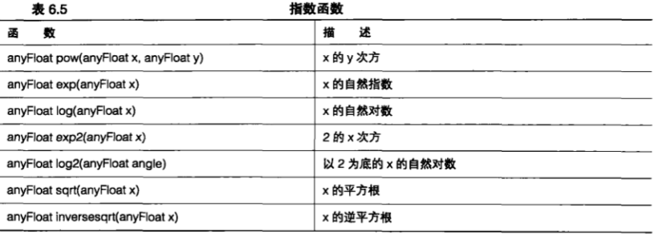

# 非存储着色器

+ 如何通过GLBatch 编写自己的着色器

+ 介绍不同的 GLSL 变量类型

+ 介绍 GLSL 的内建函数如何使用自己的光照着色器

+ 如何在GLSL中使用一维和二维纹理

+ 如何雕琢独立的片段

&emsp;&emsp;在第 `3` 章，我们第一次介绍了着色器和它们的使用方法。如果跳过这部分直接进行着色器编程，那么我们确实需要先复习一下这一章,并且确保能够懂得如何使用这些属性和 `Uniform` 值,以及如何将它们从客户端代码传递到着色器中。在第 `3` 章,我们把精力完全放在了客户端上,并且使用了一些预建的存储着色器,这些存储着色器执行一些例行程序和典型的渲染操作。在本章中,我们将进一步研究客户端操作,但最终将开始学习如何编写自己的着色器,即服务器端的着色器应用：着色器编程和着色语言。

&nbsp;

## 6.1 OpenGL 着色器语言

&emsp;&emsp;`OpenGL` 着色语言( `GLSL` )看上去很像 `C` 语言,它由 `OpenGL` 实现进行编译和连接,并且(经常是)完全在图形硬件中运行。

&emsp;&emsp;我们把第 `3` 章中的图 `3.1` 作为图 `6.1` ,展示一下基本着色器架构。

&emsp;&emsp;正如大家所看到的,我们至少需要两个着色器:一个顶点着色器、一个片段着色器。还有一种可选的着色器称为几何着色器,将在第 `11` 章详细介绍。我们可以在3种方式中选择一种向顶点着色器传递数据:一是参数,是对每个顶点而言的;二是统一值,是针对整个顶点数据批次的常量(所以是一致的);最后是在第 `5` 章学到的,也可以加载和使用纹理数据。我们可以为片段着色器设置统一值和纹理数据。将顶点属性发送到片段着色器毫无意义,因为片段着色器只是用来在图元进行光栅化后对片段(最基本的是像素)进行填充。不过,每个顶点数据都可以通过顶点程序传递到片段着色器。但是在这种情况下,这些数据可能是常量(每个片段都是同样的值),或者这些值也可以用不同的方式在图元表面进行插值。


&emsp;&emsp;着色器程序看起来确实和 `C` 语言非常类似，它们从入口点 `main` 函数开始，并且使用同样的字符集和注释约定,以及很多相同的处理指令。我们可以在 `OpenGL` 着色语言规范( `OpenGL Shading LanguageSpecification` )中找到一个完整的语言规范。附录 `A` 中列出了一些网址,可以帮助我们找到这些文档,另外还有其他一些非常好的参考文献和补充教程。为了达到目的，我们假定读者已经达到了所需的条件，即已经熟悉了 `C/C++` 语言，这样才能从一个 `C/C++` 程序员的角度来专注 `OpenGL` 着色语言。

> 6.1.1 变量和数据类型

&emsp;&emsp;要学习 `OpenGL` 着色语言,从讨论我们可用的数据类型开始是个不错的选择。我们可用的数据类型只有 `4` 种:整数(包括有符号整数和无符号整数)、浮点数(对于 `OpenGL 3.3` 来说只能使用单精度浮点数)和布尔值( `bool` )。在 `OpenGL` 着色语言中没有指针,并且没有任何类型的字符串或字符。函数可以返回这些类型中的任何一种，但也可以声明为 `void`，不过同样不允许 `void` 指针。这些数据类型在OpenGL着色语言中的应用与它们在 `C/C++` 中一样。

```C++
bool bDone = false;
int iValue = 42;
uint uiValue = 3929u;
float fValue = 42.0f;
```

&emsp;&emsp;**向量类型**

&emsp;&emsp;`OpenGL` 着色语言有一个独特而令人兴奋的特性(和 `C/C++` 相比) ,就是可以使用向量数据类型。所有这 `4` 种基本数据类型都可以存储在二维、三维或者四维向量中。表 `6.1` 中列出了向量数据类型的完整列表。


&emsp;&emsp;一个向量数据类型可以像任何其他类型的变量一样进行声明,例如,我们可以用一个 `4` 分量的浮点向量声明一个顶点位置,如下所示。

```C++
vec4 vVertexPos;
```

&emsp;&emsp;我们也可以用一个构造函数初始一个向量。

```C++
vec4 vVertexPos = vec4(39.0f, 10.f, 0.0f, 1.0f);
```

&emsp;&emsp;请注意，不要把这个构造函数与 `C++` 类构造函数混淆。`OpenGL` 着色语言的向量数据类型并不是类，它们有自己的内建数据类型。向量可以被赋值给另一个向量，可以相加，也可以用一个标量(非向量类型)进行缩放。

```C++
vVertexPos = vOldPos + vOffset;
vVertexPos = vNewPos;
vVertexPos += vec4(1.0f, 1.0f, 0.0f, 0.0f);
vVertexPos *= 5.0f;
```

&emsp;&emsp;`OpenGL` 着色语言的另一个独特的性质是对一个向量的独立元素进行寻址的方式。如果读者熟悉一 `C/C++` 中的`union` (联合体)结构就会知道,向量与联合体非常类似。
    
&emsp;&emsp;我们用点号来确定多达 `4` 个向量元素的地址,但是可以使用下列 `3` 组标识符中的任意一组: `xyzw` , `rgba` 或 `stpq` 。典型情况下，可以在引用向量类型数据时使用 `xyzw` 组标识符。

```C++
vVertexPos.x = 3.0f;
vVertexPos.xy = vec2(3.0f, 5.0f);
vVertexPos.xyz = vNewPos.xyz;
```

&emsp;&emsp;然后，在进行颜色操作时使用 `rgba`。

```C++
voutputColor.r = 1.0f;
voutputColor.rgba = vec4(1.0f, 1.0f, 0.5f, 1.0f);
```

&emsp;&emsp;最后，在进行纹理坐标操作时, 使用 `stpq`。

```C++
vTexCoord.st = vec2(1.0f, 0.0f);
```

&emsp;&emsp;选择使用哪一组标识符对于 `OpenGL` 着色语言来说是完全随意的，例如我们可以简单地进行如下操作。

```C++
vTexCoord.st = vVertex.st;
```

&emsp;&emsp;不过，我们不能将不同的组混合到一个向量访问中，如下所示。

```C++
vTexCoord.st = vVertex.xt;
```

&emsp;&emsp;向量数据类型还支持 `Swizzle` (调换)操作。`Swizzle` (调换)操作是指将两个或两个以上的向量元素进行交换。例如,如果要将颜色数据从`RGB` 顺序转换到 `BGR` 顺序,只要用下面这行代码就能做到。

```C++
vNewColor.bgra = vOldColor.rgba;
```

&emsp;&emsp;向量数据类型并不只是 `OpenGL` 着色语言的本地数据类型,也是硬件的本地数据类型。它们的速度很快,而且能一次性完成对所有分量的操作。例如，下列操作

```C++
vVertex.x = vOtherVertex.x + 5.0f;
vVertex.y = vOtherVertex.y + 4.0f;
vVertex.z = vOtherVertex.z + 1.0f;
```

&emsp;&emsp;在我们使用本地向量符号时会快的多。

```C++
vVertex.xyz = vOtherVertex.xyz + vec3(5.0f, 4.0f, 1.0f);
```

&emsp;&emsp;**矩阵类型**

&emsp;&emsp;除了向量数据类型之外, `OpenGL` 着色语言还支持多种矩阵类型。不过,和向量类型不同,所有矩阵类型都只支持浮点数——抱歉，不支持整数或者布尔值矩阵。表 `6.2` 列出了支持的矩阵类型。


&emsp;&emsp;实际上在 `OpenGL` 着色语言中，一个矩阵就是一个由向量组成的数组——实际上是列向量(在这里我们可以复习一下第`4`章中介绍过的列优先向量)。例如,为了设置一个 `4x4` 矩阵的最后一列,我们可以编写类似下面这样的代码。

```C++
mModelView[3] = vec4(0.0f, 0.0f, 0.0f, 1.0f);
```

&emsp;&emsp;相应地，可以按照如下方式恢复一个矩阵的最后一列。

```C++
vec4 vTranslation = mModelView[3];
```

&emsp;&emsp;甚至可以进行更加细致的查询。

```C++
vec3 vTranalation = mModelView[3].xyz;
```

&emsp;&emsp;面这样。矩阵也可以乘以向量,这种运算通常在通过模型视图投影矩阵来对一个向量进行变换时使用,就像下

```C++
vec4 vVertex;
mat4 mvpMatrix;

...

vOutPos = mvpMatrix * vVertex;
```

&emsp;&emsp;同样,就像向量一样,矩阵数据类型也有它们自己的构造函数。例如,为了对一个矩阵的最后一列进行硬编码，我们可以编写类似下面这样的代码。

```C++
mat4 vTransform = mat4(1.0f, 0.0f, 0.0f, 0.0f,
                        0.0f, 1.0f, 0.0f, 0.0f,
                        0.0f, 0.0f, 1.0f, 0.0f,
                        0.0f, 0.0f, 0.0f, 1.0f);
```

&emsp;&emsp;在这种情况下,我们会采用单位矩阵作为变换矩阵,还可以使用一个更快的矩阵构造器,它只将单个值填入矩阵的对角线。

```C++
mat vTransform = mat4(1.0f);
```

> 6.1.2 存储限定符

&emsp;&emsp;着色器变量声明也可以选择指定一个存储限定符。限定符用于将变量标记为输入变量( `in` 或 `uniform` )、输出变量( `out` )或常量( `const` )。输入变量接受来自 `OpenGL` 客户端(通过 `C/C++` 提交的属性)或者以前的着色器阶段(例如从顶点着色器传递到片段着色器)。输出变量是指在任何着色器阶段进行写入的变量，我们希望后续的着色器阶段能看到这些变量，例如，从顶点着色器传递到片段着色器，或者用片段着色器写入最终片段颜色。表 `6.3` 列出了主要的变量限定符。


&emsp;&emsp;有一个变量限定符 `inout` 只能在一个函数中声明一个参数时使用。因为 `OpenGL` 着色语言并不支持指针(或者引用)，所以这是将一个值传递到一个函数并且允许这个函数修改并返回同一个变量值的唯一方法。

&emsp;&emsp;例如，下面这个函数声明：

```C++
int CalculateSometing(float fTime, float fStepSize, inout float fVariance);
```

&emsp;&emsp;将会返回一个整数(可能是一个通过/失败标记),但是也可以修改 `Variance` 变量的值,并且调用代码也可以从变量中读取新值。在 `C/C++` 中,为了允许对参数进行修改,我们也以使用指针这种方式声明这个函数。

```C++
int CalculateSomething(float fTime, float fStepSize, float* fVariance);
```

&emsp;&emsp;除非正在对一个多重采样缓冲区进行渲染,否则 `centroid` 限定符不会起任何作用。在一个单采样缓冲区中,插值操作总是从像素的中心开始的。对于多重采样,在使用 `centroid` 限定词时,插补值将会被选中，因此它会落到图元和像素中。更多关于多重采样如何工作的细节，请参见第 `9` 章。

&emsp;&emsp;在默认情况下，参数将在两个着色器阶段之间以一种透视正确的方法进行插补。我们可以通过 `noperspective` 关键词来指定一个非透视插值,或者甚至可以通过 `flat` 关键词而不进行插值。我们还可以选择使用 `smooth` 关键词来声明,这个变量是以一种透视正确的方法进行插补的,但是这实际上已经是默认设置了。下面列出了一些示例声明。

```C++
smooth out vec3 vSmoothValue;
flat out vec3 vFlatColor;
noperspective float vLinearlySmoothed;
```

> 6.1.3 真正的着色器

&emsp;&emsp;最后,让我们来看看能够完成一些有用工作的真正着色器。`GLShaderManager` 类有一个存储着色器,叫做单位着色器。这种着色器不会对几何图形进行转换,而是使用单一的颜色来绘制图元。可能这看起来有点太简单了,让我们更进一步展示一下。我们也可以为每个顶点使用不同的颜色值来对一个类似三角形的图元进行着色。程序清单 `6.1` 展示了顶点着色器,程序清单 `6.2` 则展示了片段着色器。

```C++
#version 330

in vec4 vColor;
in vec4 vVertex;

out vec4 vVaryingColor;

void main(void)
{
    vVaryingColor = vColor;
    gl_Position = vVertex;
}
```

```C++
#version 330

out vec4 vFragColor; //将要进行光栅化的片段颜色
in vec4 vVaryingColor; //从顶点阶段得到的颜色

void main(void)
{
    vFragColor = vVaryingColor; //对片段进行颜色括值
}
```

&emsp;&emsp;**OpenGL 着色器语言版本**

&emsp;&emsp;每个着色器的第一行非命令行都是指定版本。

```C++
#version 330
```

&emsp;&emsp;上面这一行就指定了这个着色器要求的 `OpenGL` 着色语言的最低版本为 `3.3` 。如果 `OpenGL` 驱动不支持 `3.3` 版，那么着色器将不会编译。OpenGL `3.2` 引入了 `GLSL` （ `OpenGL` 着色语言 ）`1.5` 版，`OpenGL3.1` 引入了 `GLSL1.4` 版,而 `OpenGL 3.0` 则引入了 `GLSL1.3` 版。听起来有点困惑?这很正常。在 `OpenGL3.3` 中, `ARB`决定使`GLSL` 版本号与从 `3.3` 版开始的所有 `OpenGL` 主版本保持同步。实际上 `OpenGL 4.0` 规范是与 `3.3` 版同时发布的，而与 `OpenGL 4.0` 对应的着色语言版本也是 `4.0` 。 在着色器中要求 `4.0` 版本，如下所示。

```C++
#version 400
```

&emsp;&emsp;如果在 `GLTools` 源代码中检查存储着色器,那么不会找到这样的版本信息。`GLTools` 的目的在于在兼容版本中运行并且使用 `GLSL 1.1` 中更老的约定。实际上 `GLTools` 在 `2.1` 版的 `OpenGL` 驱动中运行得非常好。不要忘记, `GLTools` 只是为了提供一些"帮助” ,以及作为使用。`OpenGL` 的一个起点而已。

&emsp;&emsp;**属性声明**

&emsp;&emsp;属性是由 `C/C++` 客户端 `OpenGL` 代码逐个顶点进行指定的。在顶点着色器中，这些属性只是简单地声明为 `in` 。

```C++
in vec4 vVertex;
in vec4 vColor;
```

&emsp;&emsp;在这里，我们声明了两个导入属性,即一个 `4` 分量顶点位置和一个 `4` 分量顶点颜色值。示例程序`ShadedTriangle` (渲染后的三角形)特别使用了这个着色器，我们利用 `GLBatch` 类来设置 `3` 个顶点位置和 `3` 个颜色值。关于 `GLBatch` 类是如何将这3个值传递到着色器的相关内容,将稍后介绍。我们可以回忆一下第 `3` 章的内容，在 `GLSL` 中每个顶点程序都最多可以有 `16` 个属性。
    
&emsp;&emsp;同样，每个属性也总是一个 `4` 分量向量，即使不使用所有的 `4` 分量时也是如此。
    
&emsp;&emsp;例如,如果我们只是指定了一个 `float` 值作为参数,那么在内部仍将占据 `4` 个浮点值的空间。

&emsp;&emsp;另外一件要记住的事情是,标记为 `in` 的变量是只读的。对变量名进行重用,在着色器中进行一些中间计算看起来比较聪明,但是如果试图这样做的话,那么驱动中的 `GLSL` 编译器就会产生一个错误。

&emsp;&emsp;**声明输出**

&emsp;&emsp;接下来我们将为顶点程序声明一个输出变量,同样是 `4` 分量浮点向量。

```C++
out vec4 vVeryingColor;
```

&emsp;&emsp;这个变量将成为将要传送到片段着色器的顶点的颜色值。实际上，这个变量必须为片段着色器声明为一个 `in` 变量，否则在我们试图将着色器编译和连接到一起时，就会得到一个连接错误。
    
&emsp;&emsp;当在一个顶点着色器中将一个值声明为 `out` ,并在片段着色器中将其声明为 `in` 时,这个片段着色器接 受的变量值为一个插补值。在默认情况下，这些工作将以一种正确透视的方式进行，并且在变量之前指定 另一个额外的限定符 `smooth` ,以确保完成了这些工作。我们还可以指定 `flat` 声明不应进行任何插值,或者指定 `noperspective` 来声明在各个值之间进行直接线性插值( `straight linear interpolation` )。当使用 `flat` 时,还有必要进行一些额外的考虑。

&emsp;&emsp;**顶点动作**

&emsp;&emsp;最后,我们来看一下顶点程序的主体,它在批次中将为每个顶点执行一次。

```C++
void main()
{
    vVaryingColor = vColor;
    gl_Position = vVertex;
}
```

&emsp;&emsp;这确实非常简单。我们将输入颜色属性分配给即将发出的插补值,并且未经变换直接将输入的顶点值分配给 `gl_Position` 。
    
&emsp;&emsp;变量 `gl_Position` 是一个预定义的内建 `4` 分量向量,它包含顶点着色器要求的一个输出。输入 `gl_Position` 的值是几何图形阶段用来装配图元的。请记住,既然我们没有进行任何附加的变换,顶点将只映射到所有3个坐标范围都在 `+/-1.0` 之间的笛卡尔坐标上。

&emsp;&emsp;**片段三角形**

&emsp;&emsp;现在，我们将注意力转移到片段程序上。在渲染一个图元（例如一个三角形）时，一旦 `3` 个顶点由顶点程序进行了处理，那么它们将组装成一个三角形，而这个三角形将由硬件进行光栅化。图形硬件确定独立片段属于屏幕上(或者更精确地,在颜色缓冲区中)的什么位置,并且为三角形中的每个片段(如果不进行任何多重采样的话则只是一个点)执行片段程序的一个实例。
    
&emsp;&emsp;片段程序的最终输出颜色是一个`4` 分量浮点向量，我们如下声明这个向量。

```C++
out vec4 vFragColor;
```

&emsp;&emsp;如果片段程序只有一个输出,那么它在内部将分配为“输出0”。这是片段着色器的第一个输出,并且将传输到由 `giDrawBuffers` 设置的缓冲区目标,默认情况下为 `GL_BACK` ,即黑色缓冲区(对于双重缓冲区环境来说是这样的)。实际颜色缓冲区常常并不包含 `4` 个浮点分量,这样输出值就会映射到目标缓冲区的范围内。例如,大多数情况下,这可能只是 `4` 个无符号字节分量(每个分量值都在 `0` 到 `255` 之间)。我们还可以使用 `ivec4` 来输出整型值，而这些值也会被映射到颜色缓冲区的范围内。输出除颜色值以外的更多值是可能的，也可以一次性写入多重缓冲区，但是这些内容已经远远超出了本章涉及的范围。
    
&emsp;&emsp;输入片段着色器是经过平滑插值的颜色值，由顶点程序上游传入。这只是作为一个 `in` 变量进行声明的。

```C++
in vec4 vVaryingColor;
```

&emsp;&emsp;最后,片段着色器的主体甚至会比顶点着色器更加简单,它只是将平滑插值的颜色值直接分配给片段颜色。

```C++
void main()
{
    vFragColor = vVaryingColor;
}
```


> 6.1.4 编译，绑定和连接

&emsp;&emsp;现在我们已经看到了一个简单着色器的使用情况，接下来需要讨论的是在 `OpenGL` 中一个着色器是如何实际编译和连接以供使用的。着色器源代码被传递给驱动程序,然后进行编译,最后进行连接,就像我们要对所有 `C/C++` 程序做的一样。此外,着色器中的属性名需要绑定到由 `GLSL` 提供的 `16` 个预分配属性槽中的某一个上。在整个过程中,我们可以检查错误,甚至可以接收从驱动程序传回的关于试图建立着色器时为什么会失败的诊断信息。

&emsp;&emsp;`OpenGL API` 不支持任何类型的文件 `I/O` 操作。着色器的源代码采用什么样的方式，由程序员根据哪种方式对应用程序有利来进行选择。最简单的方式是将着色器存储在 `ASCII` 纯文本文件中。这样要使用典型的文件系统函数从磁盘中加载文本文件就是一件很简单的事情了。在示例中采用的就是这种方法,而且顶点着色器采用扩展名 `.vp` ，而片段着色器则采用扩展名 `.fp` 。另一种方式是将文本作为硬编码的字符数组存储在 `C/C++` 源代码中。

&emsp;&emsp;不过，这样在进行编辑时比较麻烦，而且使程序更加自我封闭（ `selfcontained` ），从而使修改着色器和阅读源代码更加麻烦。当然，我们也可以通过算法生成着色器源代码，或者从数据库中恢复，又或者从某种加密数据文件中恢复。这些选择可能在移植一个应用程序时对我们非常有吸引力,但是对于学习或者仅仅是开发调试的目的来说,没有什么比纯文本文件更合适的了。

&emsp;&emsp;`GLTools` 函数 `gltLoadShaderPairWithAttributes` 对于加载和初始化着色器来说确实是真正的"重型升降机”。程序清单 `6.3` 列出了完整的程序，而且通过这个函数，我们介绍了加载一个着色器的所有必要元素。

```C++
GLuint gltLoadShaderPairWithAttributes(const char *szVertexProg, const char *szFragmentProg, ...)
{
    GLuint hVertexShader;
    GLuint hFragmentShader; 
    GLuint hReturn = 0;   
    GLint testVal;

    hVertexShader = glCreateShader(GL_VERTEX_SHADER);
    hFragmentShader = glCreateShader(GL_FRAGMENT_SHADER);

    if(gltLoadShaderFile(szVertexProg, hVertexShader) == false)
    {
        glDeleteShader(hVertexShader);
        glDeleteShader(hFragmentShader);
        fprintf(stderr, "The shader at %s could ot be found.\n", szVertexProg);
        return (GLuint)NULL;
    }

    if(gltLoadShaderFile(szFragmentProg, hFragmentShader) == false)
    {
        glDeleteShader(hVertexShader);
        glDeleteShader(hFragmentShader);
        fprintf(stderr,"The shader at %s  could not be found.\n", szFragmentProg);
        return (GLuint)NULL;
    }
    
    glCompileShader(hVertexShader);
    glCompileShader(hFragmentShader);
    
    glGetShaderiv(hVertexShader, GL_COMPILE_STATUS, &testVal);
    if(testVal == GL_FALSE)
    {
        char infoLog[1024];
        glGetShaderInfoLog(hVertexShader, 1024, NULL, infoLog);
        fprintf(stderr, "The shader at %s failed to compile with the following error:\n%s\n", szVertexProg, infoLog);
        glDeleteShader(hVertexShader);
        glDeleteShader(hFragmentShader);
        return (GLuint)NULL;
    }
    
    glGetShaderiv(hFragmentShader, GL_COMPILE_STATUS, &testVal);
    if(testVal == GL_FALSE)
    {
        char infoLog[1024];
        glGetShaderInfoLog(hFragmentShader, 1024, NULL, infoLog);
        fprintf(stderr, "The shader at %s failed to compile with the following error:\n%s\n", szFragmentProg, infoLog);
        glDeleteShader(hVertexShader);
        glDeleteShader(hFragmentShader);
        return (GLuint)NULL;
    }
    
    hReturn = glCreateProgram();
    glAttachShader(hReturn, hVertexShader);
    glAttachShader(hReturn, hFragmentShader);

    va_list attributeList;
    va_start(attributeList, szFragmentProg);

    char *szNextArg;
    int iArgCount = va_arg(attributeList, int);
    for(int i = 0; i < iArgCount; i++)
    {
        int index = va_arg(attributeList, int);
        szNextArg = va_arg(attributeList, char*);
        glBindAttribLocation(hReturn, index, szNextArg);
    }
    va_end(attributeList);

    glLinkProgram(hReturn);

    glDeleteShader(hVertexShader);
    glDeleteShader(hFragmentShader);  
    
    glGetProgramiv(hReturn, GL_LINK_STATUS, &testVal);
    if(testVal == GL_FALSE)
    {
        char infoLog[1024];
        glGetProgramInfoLog(hReturn, 1024, NULL, infoLog);
        fprintf(stderr,"The programs %s and %s failed to link with the following errors:\n%s\n",
            szVertexProg, szFragmentProg, infoLog);
        glDeleteProgram(hReturn);
        return (GLuint)NULL;
    }
    
    return hReturn;
} 
```

&emsp;&emsp;**指定属性**

&emsp;&emsp;函数原型获取了顶点程序文件的名称、片段程序文件的名称和指定属性的参数的变量数量。

```C++
GLuint gltLoadShaderPairWithAttributes(const char* szVertexProg, const char* szFragmentProg, ...);
```

&emsp;&emsp;如果我们以前没见过接受可变参数列表的函数声明，那么参数列表末尾的……可能看起来像一个打字错误。另外一些接受可变参数列表的例子还有诸如 `printf` 或 `sprintf` 这样的函数。但是,对于这个函数来说,第一个附加的参数是顶点程序包含属性的数量。在这之后是一个对应于第一个属性的基于 `0` 的索引,以及作为一个字符数组的属性名。然后,只要有必要,属性槽的数量和名称将进行足够多次数的重复。例如,为了加载一个带有顶点位置和表面法线属性的着色器,我们可能像下面这样调用 `gltLoadShaderPairWithAttributes` 。

```C++
hShader = gltLoadShaderPairWithAttributes("vertexProg", "fragmentProg", 2, 0, "vVertexPos", 1, "vNormal");
```

&emsp;&emsp;对于为两个属性位置进行 `0` 和 `1` 的选择是任意性的,只要这个值在 `0~15` 范围之内。我们也可以选择 `7` 和`13` 。不过, `GLTools` 类 `GLBatch` 和 `GLTriangleBatch` 则使用一系列一致的属性位置,由 `typedef` 指定，如下所示。

```C++
enum GLT_SHADER_ATTRIBUTE { 
    GLT_ATTRIBUTE_VERTEX = 0, 
    GLT_ATTRIBUTE_COLOR, 
    GLT_ATTRIBUTE_NORMAL, 
    GLT_ATTRIBUTE_TEXTURE0, 
    GLT_ATTRIBUTE_TEXTURE1, 
    GLT_ATTRIBUTE_TEXTURE2, 
    GLT_ATTRIBUTE_TEXTURE3, 
    GLT_ATTRIBUTE_LAST
};
```

&emsp;&emsp;如果使用这些属性位置标识符,我们就可以开始和 `GLShaderManager` 类中支持的存储着色器一起使 用自己的着色器了。这也意味着,在第12章更加详细地学习顶点属性提交相关内容之前,我们可以继续 使用 `GLBatch` 和 `GLTriangleBatch` 类来提交几何图形。

&emsp;&emsp;**设置源代码**

&emsp;&emsp;我们的首要任务是创建两个着色器对象,分别对应顶点着色器和片段着色器。

```C++
hVertexShader = glCreateShader(GL_VERTEX_SHADER);
hFragmentShader = glCreateShader(GL_FRAGMENT_SHADER);
```

&emsp;&emsp;然后,可以使用这两个着色器 `ID` 来加载着色器源代码。我们略去了 `gltLoadShaderFile` 函数无关紧要的细节,因为这些代码中大部分都是用来以指定的文件名从磁盘中加载着色器文本的。不过,一旦这些任务完成，下面的代码就会将着色器源文件送入着色器对象。还要注意的是，我们要进行两次这项工作-—一次是为了顶点着色器，另一次是为了片段着色器。

```C++
GLchar *fsStringPtr[1];

fsStringPtr[0] = (GLchar *)szShaderSrc;
glShaderSource(shader, 1, (const GLchar **)fsStringPtr, NULL);
```

&emsp;&emsp;`szShaderSrc` 变量只是一个简单的字符指针,它指向着色器的完整代码,而 `shader` 则是我们加载的着色器对象的对象 `ID` 。

&emsp;&emsp;**编译着色器**

&emsp;&emsp;编译着色器是一项简单的一次性工作。

```C++
glCompileShader(hVertexShader);
glCompileShader(hFragmentShader);
```

&emsp;&emsp;每个 `OpenGL` 实现都有一个内建的 `GLSL` 编译器，这个编译器由硬件提供商提供。这就是说，任何指定的提供商都应该最有资格为他们自己的硬件建立编译器。当然,就像 `C/C++` 代码一样,很多因素都会阻碍我们的GLSL着色器进行编译,例如语法错误、实现的故障等。为了检查失败,我们使用以 `GL_COMPILE_STATUS` 标记为参数的 `glGetShader` 函数。

```C++
glGetShaderiv(hVertexShader, GL_COMPILE_STATUS, &testVal);
```

&emsp;&emsp;如果返回的 `testVal` 值为 `GL_FALSE` ,那就说明源代码编译失败了。如果我们能够在实现中得到的只有简单的通过或者失败信息,那么编写着色器确实会非常困难。在编译失败时,我们可以通过 `glGetShaderinfoLog` 函数来检查着色器消息日志,看看是什么地方出了问题。在目前的例子中,我们将错误信息显示在控制台，清除着色器对象，并返回 `NULL` 。

```C++
if(testVal == GL_FALSE)
{
    char infoLog[1024];
    glGetShaderInfoLog(hVertexShader, 1024, NULL, infoLog);
    fprintf(stderr, "The shader at %s failed to compile with the following error:\n%s\n", szVertexProg, infoLog);
    glDeleteShader(hVertexShader);
    glDeleteShader(hFragmentShader);
    return (GLuint)NULL;
}
```

&emsp;&emsp;**进行连接和绑定**

&emsp;&emsp;对 `GLSL` 源代码进行编译之后，我们就完成了一半工作，但是还必须做一些其他工作，才能对它们进行连接。首先,我们要创建最终的着色器程序对象,并将顶点着色器和片段着色器与它绑定到一起。

```C++
hReturn = glCreateProgram();
glAttachShader(hReturn, hVertexShader);
glAttachShader(hReturn, hFragmentShader);
```

&emsp;&emsp;现在，着色器已经做好了连接的准备。不过，在连接着色器程序之前，我们还要做一件重要的工作，就是将属性变量名绑定到指定的数字属性位置。函数 `glBindAttribLocation` 将为我们完成这项工作,它的原型如下所示。

```C++
glBindAttribLocation(GLuint shaderProg, GLuint attribLocation, const GLchar* szAttributeName);
```

&emsp;&emsp;它接受我们正在讨论的着色器的标识符、将要进行绑定的属性位置和属性变量的名称。例如,在存储着色器中,我们采用了一个约定,即顶点位置属性总是使用变量名 `vVertex` ,而属性位置总是使用 `GLT_ATTRIBUTE_VERTEX` 值(值 `0` )。我们也可以很简单地重复这个过程。

```C++
glBindAttribLocation(hShader, GLT_ATTRIBUTE_VERTEX, "vVertex");
```

&emsp;&emsp;在进行连接之前,必须按照这种方式对属性位置进行连接。在此处代码中,我们遍历了可变参数列表,只需简单地为每个需要进行绑定的属性重复调用这个函数。

```C++
char *szNextArg;
int iArgCount = va_arg(attributeList, int);
for(int i = 0; i < iArgCount; i++)
{
    int index = va_arg(attributeList, int);
    szNextArg = va_arg(attributeList, char*);
    glBindAttribLocation(hReturn, index, szNextArg);
}
va_end(attributeList);
```

&emsp;&emsp;**连接着色器**

&emsp;&emsp;最后，终于到了对着色器进行连接的时候，在这之后也可以丢弃顶点着色器对象和片段着色器对象。

```C++
glLinkProgram(hReturn);

glDeleteShader(hVertexShader);
glDeleteShader(hFragmentShader); 
```

&emsp;&emsp;和编译一样，很多原因能够导致连接失败。例如，如果我们在顶点程序中声明一个 `out` 变量，但没有在片段着色器中声明这个变量;或者我们在片段着色器中声明了这个变量,但是两个声明的类型不同。这样,在返回之前,我们检查一个错误并显示诊断信息,正如在编译时所做的一样。
    
&emsp;&emsp;现在，`OpenGL GLSL` 着色器已经 `100%` 准备好了。我们已经创建了一个着色器程序，还要说明的是，当不再使用它之后（可能是在程序终止时），需要使用如下函数删除它。

```C++
void glDeleteProgram(GLuing program);
```

> 6.1.5 使用着色器

&emsp;&emsp;要使用 `GLSL` 着色器，必须使用 `glUseProgram` 函数选定它，如下所示。

```C++
glUseProgram(myShaderProgram);
```

&emsp;&emsp;这样就将着色器设置为活动的，现在顶点着色器和片段着色器会处理所有提交的几何图形。在提交顶点属性之前,要对 `Uniform` 值和纹理进行设置,稍后我们将对此进行介绍。不过,提交顶点属性是一个很大的主题--大到实际上足以单独占用一章的篇幅来介绍它，这个主题将在第 `12` 章进行更详细的介绍。不过现在我们可以使用 `GLBatch` 和 `GLTriangleBatch` 类来管理几何图形。

&emsp;&emsp;在本章的第一个示例程序 `ShadedTriangle` 中，我们将三角形加载到 `GLBatch` 的一个叫做 `triangleBatch` 的实例中，这个实例使用最简单的坐标系（我们称之为“单位”坐标系）。

```C++
GLfloat vVerts[] = { -0.5f, 0.0f, 0.0f, 
                    0.5f, 0.0f, 0.0f,
                    0.0f, 0.5f, 0.0f };

GLfloat vColors[] = { 1.0f, 0.0f, 0.0f, 1.0f,
                    0.0f, 1.0f, 0.0f, 1.0f,
                    0.0f, 0.0f, 1.0f, 1.0f };

triangleBatch.Begin(GL_TRIANGLES, 3);
triangleBatch.CopyVertexData3f(vVerts);
triangleBatch.CopyColorData4f(vColors);
triangleBatch.End();

myIdentityShader = gltLoadShaderPairWithAttributes("ShadedIdentity.vp", "ShadedIdentity.fp", 2, GLT_ATTRIBUTE_VERTEX, "vVertex", GLT_ATTRIBUTE_COLOR, "vColor");
```

&emsp;&emsp;我们还为每个顶点设置了不同的颜色，分别为红色、绿色和蓝色。最后，使用前面介绍过的  `gltLoadShaderPairWithAttributes` 函数加载着色器。请注意我们是如何使两组属性(顶点值和颜色值)与提供给GLBatch类的数据组相匹配的。

&emsp;&emsp;提交批次来进行渲染现在已经是一项简单的工作了，只要选择着色器并使用 `GLBatch` 类来提交顶点 属性。

```c++
glUseProgram(myIdentityShader);
triangleBatch.Draw();
```

&emsp;&emsp;所有这些努力的成果，即最后渲染过的三角形，如图 `6.2` 所示。

> 6.1.6 Provoking Vertex

&emsp;&emsp;`ShadedTriangle` 示例很好地演示了如何在顶点之间进行平滑的插值。每个顶点都有一个不同的颜色值,我们在图 `6.2` 所示的三角形中看到的实际上是颜色空间中由这 `3` 个颜色坐标所表示的平面颜色值。很酷,是吗?不过,我们还可以从一个着色器阶段传递到下一个着色器阶段的变量设置为 `flat` 。如果有一个值对于整个批次来说都必须是常数,那么最好像第 `3` 章讨论的那样使用一个 `Uniform` 值。不过,有时候有一个对整个图元(例如三角形)表面来说是唯一的,但是对每一个三角形都需要进行改变的值,还是非常有用的。在使用统一值时发送大量三角形,每个批次用一个三角形作为示例,这样做将会非常低效。由此引入了 `flat` 存储标识符,在 `ShadedTriangle.vp` 着色器中声明了输出平滑着色器颜色值,如下所示。

```C++
flat out vec4 vVaryingColor;
```

&emsp;&emsp;但是,如果将它声明为 `flat` (并且不要忘记，片段着色器中相应的 `in` 变量也必须声明为 `flat` ),就像下面介绍的那样，结果得到的三角形将会是实心蓝色的。

```C++
flat out vec4 vFlatColor;
```

&emsp;&emsp;当一个图元的每个顶点都有一个不同的平面着色变量值时,只有其中一个顶点可以“平面地”应用。默认的约定是使用为图元的最后一个顶点指定的值。在本例中，三角形的 `3` 个顶点中最后一个使用的颜色值是蓝色。这个约定叫做“ `provoking vertex` ”,我们可以用下面的函数来对它从最后一个顶点到第一个顶点进行修改。

```C++
void glProvokingVertex(GLenum provokeMode);
```

&emsp;&emsp;`provokeMode` 的合法值为 `GL_FIRST_VERTEX_CONVENTION` 和 `GL_LAST_VERTEX_CONVENTIONS` (默认值)。

&emsp;&emsp;示例程序 `ProvokingVertex` 演示了它的使用情况。实际上这是 `ShadedTriangle` 程序的一个稍加修改的版本。按空格键可以切换这个约定,而三角形则在实心蓝色和实心红色之间来回切换。

&nbsp;

## 6.2 着色器统一值

&emsp;&emsp;属性是每个顶点位置、表面法现和纹理坐标等都需要的,而统一值则用于为整个图元批次向保持不变的(统一( `uniform` )的)着色器传递数据。对于顶点着色器来说,可能最普遍的统一值就是变换矩阵了。以前我们用内建支持存储着色器和它们所需统一值的 `GLShaderManager` 类来完成这项工作。现在我们已经开始编写自己的着色器了,这就需要能够设置自己的统一值,而不只是矩阵值了；任何着色器变量都可以指定为一个统一值,而统一值可以在3个着色器阶段中的任何一个阶段中(尽管本章我们只讨论顶点着色器和片段着色器)。创建一个统一值非常简单,只需在变量声明开始时放置一个 `uniform` 关键词。

```C++
uniform float fTime;
uniform int iIndex;
uniform vec4 vColorValue;
uniform mat4 mvpMatrix;
```

&emsp;&emsp;统一值不能被标记为 `in` 或 `out` ，它们也不能在着色器阶段之间进行插值（虽然可以将它们复制到经过插值的变量中），并且它们总是只读的。

> 6.2.1 寻找统一值

&emsp;&emsp;在一个着色器进行编译和连接之后,我们必须在着色器中寻找统一值位置。这项工作可以使用  `glGetUniformLocation` 函数来完成。

```C++
GLint glGetUniformLocation(GLuint shaderID, const GLchar* varName);
```

&emsp;&emsp;这个函数返回一个有符号的整数,代表在 `shaderID` 指定的着色器中由 `varName` 命名的变量的位置。例如,为了获取一个名为 `vColorValue` 的统一值的位置,我们应该进行如下操作。

```C++
GLint iLocation = glGetUniformLocation(myShader, "vColorValue");
```

&emsp;&emsp;着色器变量名是区分大小写的，如果 `glGetUniformLocation` 的返回值是-1，就说明统一值的名称在 着色器中不能被定位。

&emsp;&emsp;我们应当牢记，即使着色器编译正确，如果不是在着色器中直接使用，那么一个统一值名称仍然可能在这个着色器中“消失”。我们不必担心统一变量会被优化掉,但是如果声明了一个统一值而不去使用它,那么编译器将会丢弃它。

> 6.2.2 设置标量和向量统一值

&emsp;&emsp;一个单独的标量和向量数据类型可以在 `glUniform` 函数中使用下面的变量进行设置。

```C++
void glUniform1f(GLint location, GLfloat v0);
void glUniform2f(GLint location, GLfloat v0, GLfloat v1);
void glUniform3f(GLint location, GLfloat v0, GLfloat v1, GLfloat v2);
void glUniform4f(GLint location, GLfloat v0, GLfloat v1, GLfloat v2, GLfloat v3);

void glUniform1i(GLint location, GLfloat v0);
void glUniform2i(GLint location, GLfloat v0, GLfloat v1);
void glUniform3i(GLint location, GLfloat v0, GLfloat v1, GLfloat v2);
void glUniform4i(GLint location, GLfloat v0, GLfloat v1, GLfloat v2, GLfloat v3);
```

&emsp;&emsp;例如，考虑在一个着色器中声明的 `4` 个变量，如下所示。

```C++
uniform float fTime;
uniform int iIndex;
uniform vec4 vColorValue;
uniform bool bSomeFalg;
```

&emsp;&emsp;为了在着色器中寻找并设置这些值，我们的 `C/C++` 代码可能会像下面这样。

```C++
GLint locTime, locIndex, locColor, loFlag;
locTime = glGetUniformLocation(myShader, "fTime");
locIndex = glGetUniformLocation(myShader, "iIndex");
locColor = glGetUniformLocation(myShader, "vColorValue");
loFlag = glGetUniformLocation(myShader, "bSomeFalg");

...

glUseProgram(myShader);
glUniform1f(locTime, 45.2f);
glUniform1i(locTime, 42);
glUniform4f(locTime, 1.0f, 0.0f, 0.0f, 1.0f);
glUniform1i(locFlag, GL_FALSE);
```

&emsp;&emsp;请注意,我们是在使用一个整数版本的 `glUniform` 来传递一个 `bool` 值。布尔值也可以作为浮点值进一 行传递,`0.0` 代表假, `1.0` 则代表真。

> 6.2.3 设置统一值数组

&emsp;&emsp;`glUniform` 函数还接受一个指针，假定指向一个数值数组。

```C++
void glUniform1fv(GLint location, GLuint count, GLfloat* v);
void glUniform2fv(GLint location, GLuint count, GLfloat* v);
void glUniform3fv(GLint location, GLuint count, GLfloat* v);
void glUniform4fv(GLint location, GLuint count, GLfloat* v);
void glUniform1fi(GLint location, GLuint count, GLfloat* v);
void glUniform2fi(GLint location, GLuint count, GLfloat* v);
void glUniform3fi(GLint location, GLuint count, GLfloat* v);
void glUniform4fi(GLint location, GLuint count, GLfloat* v);
```

&emsp;&emsp;在这里，`count` 值代表每个含有`×` 个分量的数组中有多少个元素，其中 `×` 是位于函数名末尾的数字。例如,如果我们有一个 `4` 分量的统一值。

```C++
uniform vec4 vColor;
```

&emsp;&emsp;在 `C/C++` 中，我们可以将它表示为一个浮点数组。

```C++
GLfloat vColor = { 1.0f, 1.0f, 1.0f, 1.0f };
```

&emsp;&emsp;但是，这是一个包含 `4` 个值的单个数组，所以会像下面这样将它传递到着色器中。

```C++
glUniform4fv(iColorLocation, 1, vColor);
```

&emsp;&emsp;另一方面,如果我们在着色器中有一个颜色值数组 `uniform vec4 vColors[2]` ,那么在 `C/C++` 中,我们可以像下面这样表示和传递一个数组。

```C++
GLfloat vColor[2][4] = {{ 1.0f, 1.0f, 1.0f, 1.0f }, { 1.0f, 0.0f, 0.0f, 1.0f }};

...

glUniform4fv(iColorLocation, 2, vColor);
```

&emsp;&emsp;在最简单的情况下，我们可以像下面这样设置一个单个浮点统一值。

```C++
GLfloat fValue = 45.2f; 
glUniformlfv(iLocation, 1, &fValue);
```

> 6.2.4 设置统一矩阵

&emsp;&emsp;最后,我们来看一看如何设置一个矩阵统一值。着色器矩阵数据类型只有浮点类型,这样变量就减少了很多。下面的函数分别用来加载一个 `2x2` 、 `3x3` 和 `4x4` 矩阵。

```C++
glUniformMatrix2fv(GLint Location, GLuint count, GLboolean transpose, const GLfloat* m);
glUniformMatrix3fv(GLint Location, GLuint count, GLboolean transpose, const GLfloat* m);
glUniformMatrix4fv(GLint Location, GLuint count, GLboolean transpose, const GLfloat* m);
```

&emsp;&emsp;变量 `count` 代表指针参数 `m` 中存储的矩阵数量(没错,我们可以使用矩阵数组! )。如果矩阵已经按照列优先排序( `OpenGL` 推荐的方式)进行存储,布尔值标记 `transpose` 将被设为 `GL_TRUE` 。将这个值设置为 `GL_FALSE` 会导致这个矩阵在复制到着色器中时发生变换。

&emsp;&emsp;如果我们正在使用一个采用行优先矩阵布局的矩阵库（例如，`Direct3D` 就使用行优先排序），那么这一点将非常有用。

> 6.2.5 平面着色器

&emsp;&emsp;现在让我们来看一个使用统一值的示例着色器。在存储着色器中,有一个平面着色器,它的功能就是将几何图形进行变换并将其设置为一个单色。它使用的顶点属性只有顶点位置。它还需要使用两个统一值、一个变换矩阵和一个颜色值。

&emsp;&emsp;`FlatShader` 示例程序仅仅是加载一个旋转的花托并将它的颜色设置为蓝色。

&emsp;&emsp;我们通过 `gLPolygonMode` 函数将它在线框模式下进行渲染,这样就能看到确实存在 `3D` 几何图形到目前为止的绝大多数 `OpenGL` 客户端代码都并不重要,所以我们并不列出整个程序。不过,程序清单 `6.4` 和程序清单 `6.5` 列出了完整的着色器程序。

```C++
// vertex
#version 330

in vec4 vVertex;

uniform mat4 mvpMatrix;

void main()
{
    gl_Position = mvpMatrix * vVertex;
}

// fragment
#version 330

out vec4 vFragColor;

uniform vec4 vColorValue;

void main()
{
    vFragColor = vColorValue;
}
```

&emsp;&emsp;在程序清单 `6.4` 中列出的定点程序中有一个统一值，即连接变换矩阵。

```C++
uniform mat4 mvpMatrix;
```

&emsp;&emsp;这个着色器执行的唯--项几何图形处理就是使用 `ModelviewProjection` 矩阵对顶点进行变换。正如 我们所看到的，用一个矩阵数据类型乘以一个向量数据类型，在 `GLSL` 中是非常自然的。

```C++
gl_Position = mvpMatrix * vVertex;
```

&emsp;&emsp;在程序清单 `6.5` 中列出的片段着色器中，仍然只有一个统一值，即一个将要应用在光栅化片段上的4分量颜色值。

```C++
uniform vec4 vColorValue;
```

&emsp;&emsp;在客户端，`FlatShader` 示例程序加载这两个着色器文件并获得 `SetupRC` 函数中两个统一值的索引。

```C++
GLuint flatShader;

GLint locMVP;
GLint locColor;

...

flatShader = gltLoadShaderPairWithAttributes("FlatShader.vert", "FlatShader.frag", 1, GLT_ATTRIBUTE_VERTEX, "vVertex");

locMVP = glGetUniformLocation(flatShader, "mvpMatrix");
locColor = glGetUniformLocation(flatShader, "vColorValue");
```

&emsp;&emsp;程序清单 `6.6` 列出了完整的 `RenderScene` 函数。它只是在合适的位置渲染一个旋转的花托(请记住我们还将多边形模式设置成了 `GL_LINE` )。在选择平面着色器之后,集合图形颜色的统一值和变换矩阵的统一值将在花托对象上调用Draw函数之前进行设置。最终的输出结果如图 `6.3` 所示。

```C++
void RenderScene()
{
    static CStopWatch rotTime;

    glClear(GL_COLOR_BUFFER_BIT | GL_DEPTH_BUFFER_BIT);

    modelViewMatrix.PushMatrix(viewFrame);
    modelViewMatrix.Rotate(rotTime.GetElapsedSeconds() * 10.0f, UP_VEC3);
    GLfloat vColor[] = { 0.1f, 0.1f, 1.0f, 1.0f };
    glUseProgram(flatShader);
    glUniform4fv(locColor, 1, vColor);
    glUniformMatrix4fv(locMVP, 1, GL_FALSE, transformPipeline.GetModelViewProjectionMatrix());
    torusBatch.Draw();
    modelViewMatrix.PopMatrix();
    
    glutSwapBuffers();
    glutPostRedisplay();
}
```


&nbsp;

## 6.3 内建函数

&emsp;&emsp;几乎所有高级编程语言都附带一个标准函数选项。在 `C/C++` 中,我们有标准 `C` 运行时库、标准 `I/O` 函数等。GLSL也包含很多有用的内建函数,其中大多数都是在一个标量值或者同时在整个向量上执行数学运算。这些内建函数中有一些是一般性的,另外一些则是选择性的,这是由它们在典型图形渲染算法中的适用性决定的。下面几个表格中列出的函数几乎是原样从 `GLSL` 语言规范中照搬的。

> 6.3.1 三角函数

&emsp;&emsp;表 `6.4` 列出了 `GLSL` 支持的三角函数。这些函数是为了 `float` 、 `vec2` 、 `vec3` 和 `vec4` 数据类型而定义的。这里我们用 `anyFloat` 来表示这 `4` 种浮点数据类型中的任意一种。


> 6.3.2 指数函数

&emsp;&emsp;和三角函数一样，指数函数也是针对浮点数据类型（浮点数和浮点向量）的。表 `6.5` 列出了完整的指数函数清单。



> 6.3.3 几何函数

&emsp;&emsp;GLSL中还包括许多通用几何函数。这些函数中有一些采用特殊参数类型(例如叉乘),其他函数则接受任何浮点向量类型( `vec2` 、 `vec3` 和 `vec4` ),这里我们统称为 `vec` 。表 `6.6` 列出了这些函数。


> 6.3.4 矩阵函数

&emsp;&emsp;许多矩阵操作都是使用常规数学运算符进行的。不过还有一些有用的矩阵函数,表 `6.7` 列出了这些函数。这些函数中的每一个都是特殊函数,并且接受特殊的参数数据类型。

</br>
</br>

> 6.3.5 向量相关函数

&emsp;&emsp;标量值可以使用标准比较运算符（ `<` , `<=` , `>` , `>=` , `++` , `!=` ）进行比较。

&emsp;&emsp;而对于向量之间的比较,就要使用表 `6.8` 列出的这些函数。所有这些函数都返回一个布尔向量,这些布尔向量都有相同的维数作为参数。

</br>
</br>

> 6.3.6 常用函数

最后，我们列出通用函数的列表。所有这些函数都能用于标量和向量数据类型的运算，并且也返回标量和向量数据类型(参见表` 6.9` )。

</br>
</br>
</br>
</br>

&nbsp;

## 6.4 模拟光线

&emsp;&emsp;现在我们已经有了使用 `GLSL` 的良好基础，可以开始编写一些复杂的着色器了。模拟光线( `SimulatingLight` )是计算机图形学的基本技术之一,这种技术并不是特别复杂,所以它可以很好地演示着色器编程技术。模拟光线、照明和材质特性本身就值得用一本书的篇幅来讲解,并且确实已经出现了很多这样的书籍。在这里我们了解一下计算机照明的基础,并使用 `GLSL` 来实现它们。这些简单的方法是更多高级技术的基础。

> 6.4.1 简单漫反射

&emsp;&emsp;`3D` 图形中应用最普遍的光线类型是漫射光( `diffuse light` )。漫射光是一种经过平面反射的定向光,其强度与光线在表面上的入射角成正比。这样,如果光线直接射向表面的话,物体的表面就要比光线以一个很大的角度倾斜着射向表面的时候亮度高。实际上这就是很多通过照亮物体表面产生阴影(或者改变颜色)的光照模型的漫射光分量。

&emsp;&emsp;要确定一个指定顶点上光线的强度，我们需要两个向量。第一个向量就是光源的方向。某些光照技术只提供指向光源的向量,我们称之为定向光( `directional light` ) ,因为对于所有顶点来说指向光源的都是同一个向量。这种方式在光源距离被照亮的物体非常远(或者无穷远)是非常适用的。现在我们思考一下阳光照在足球场上所有运动员身上的情景。太阳光照在足球场上不同位置时,它的角度不会有明显的变化。在另一种情况下,如果比赛在晚上进行,那么我们可以明显地观察到一个高架灯在运动员或者其他物体在球场上移动时的照明效果了。如果照明代码提供的是光源的位置,那么我们必须在着色器中用经过变换的(视觉坐标)光源位置减去顶点位置,来确定指向光源的向量。

&emsp;&emsp;**表面法线**

&emsp;&emsp;我们在漫射光中(后面我们将看到,实际上不只是在漫射光中)需要的第二个向量是表面法线。经过某个假想平面(或者我们的三角形)上方的顶点,并与这个平面(或三角形)成直角的一条线段,这条线就称为法向量。术语法向量( `normal vector` )可能听起来像《星际旅行》 ( `Star Trek` )中的船员,但是这个词只代表一条垂直于一个真实的或者假想的表面的线。一个向量就是一条指向某个方向的线，“法向”只是一些知识分子表示“垂直” (以 `90` "角相交)的另一种说法。总之,一个法向量就是一条指向一个与多边形的前面成900角方向的线。图 `6.4` 所示是 `2D` 和 `3D` 法向量的示例。


&emsp;&emsp;可能读者已经产生了疑问，为什么要为每个顶点指定一个法向量？为什么不能简单地为一个多边形指定一个法向，并且在每个顶点上都使用它？可以这样做，但是，某些时候我们并不希望每个法向都与多边形的表面精确地垂直。读者可能已经注意到,很多表面都不是平的! 我们可以将这些表面近似地看成是平的，但是结果会得到一个锯齿状的或者多面的表面。我们可以通过“调整”表面法线使平面多边形表面平滑，从而得到平滑表面的错觉。例如在一个球体上，每个顶点的表面法线都是与球体的实际表面精确垂直的，而不是与用来渲染球体的那些三角形垂直。

&emsp;&emsp;**顶点照明**

&emsp;&emsp;图 `6.5` 所示为漫射光需要的两个向量。顶点上光的强度通过接受到光源的向量和表面法线的向量点乘积来计算。这两个向量也需要是单位长度的，而点乘积将会返回一个 `+1.0` 到 `-1.0` 之间的值。当表面法线和光照向量指向同一个方向时,将出现一个值为 `1.0` 的点乘积,而当两个向量指向相反的方向时则返回 `-1.0` 。当两个向量互相成 `90°` 时，返回的点乘积值为 `0.0` 。这个 `+1.0` 和 `-1.0` 之间的值实际上就是这两个向量之间夹角的余弦值。读者可能会猜想，正值意味着这个光线落在顶点上，这个值越大（越接近 `1` ）则光照效果越强,越接近 `0` (或者小于 `0` )则光照效果越弱。


&emsp;&emsp;我们可以用点乘积的值与顶点的一个颜色值相乘，得到一个基于顶点光线强度的光照颜色值。在顶点 之间对这些颜色值进行平滑的着色，有时候被称作顶点照明( `vertex lighting` )，或者背景着色（ `Gouraud shading` ）。在 `GLSL` 中，点乘积的部分非常简单，通常只是如下所示。

```C++
float intensity = dot(vSurfaceNormal, vLightDirection);
```

> 6.4.2 点光源着色器

&emsp;&emsp;下面让我们了解一下示例程序 `DiffuseLight` (漫反射光)。这个程序在一个蓝色球体上演示了一个简单的漫反射光线着色器。这个程序使用一个点光源,所以我们还可以看到如何在着色器中确定这些内容的。当然,使用一个定向光源会更加简单,因为我们已经提供了这个向量,但是将它作为一个练习留给读者。程序清单 `6.7` 展示了 `DiffuseLight.vp` 顶点着色器的完整代码。

```C++
//vertex

#version 330

in vec4 vVertex;
in vec3 vNormal;

uniform vec4 diffuseColor;
uniform vec3 vLightPosition;
uniform mat4 mvpMatrix;
uniform mat4 mvMatrix;
uniform mat3 normalMatrix;

smooth out vec4 vVaryingColor;

void main()
{
    vec3 vEyeNormal = normalMatrix * vNormal;

    vec4 vPosition4 = mvMatrix * vVertex;
    vec3 vPosition3 = vPosition4.xyz / vPosition4.w;

    vec3 vLightDir = normalize(vLightPosition - vPosition3);

    float diff = max(0.0, dot(vEyeNormal, vLightDir));

    vVaryingColor.rgb = diff * diffuseColor.rgb;
    vVaryingColor.a = diffuseColor.a;

    gl_Position = mvpMatrix * vVertex;
}
```

&emsp;&emsp;着色器只指定了两个属性:顶点位置 `vVertex` 和表面法线 `vNormal` 。另一方面,这个着色器需要 `5` 个统一值。

```C++
uniform vec4 diffuseColor;
uniform vec3 vLightPosition;
uniform mat4 mvpMatrix;
uniform mat4 mvMatrix;
uniform mat3 normalMatrix;
```

&emsp;&emsp;`diffuseColor` 包含球体的颜色，`vLightPosition` 是光源位置的视觉坐标，`mpvMatrix` 是模型视图投影矩阵，`mvMatrix` 是模型视图矩阵。我们在使用存储着色器(虽然是在客户端)之前已经了解了这些。新的 变化是 `3x3` 的  `normalMatrix` 。

&emsp;&emsp;典型情况下,表面法线作为一个顶点属性提交。不过,表面法线必须进行旋转以使它的方向在视觉空间之内。我们也不能用它乘以模型视图矩阵来完成这项工作,因为模型视图矩阵也包含一个变换,这个变换在我们进行计算时也会影响向量的方向。取而代之地,我们经常传递一个法向矩阵( `normal matrix` )作为一个统一值,这个值只包含模型视图矩阵的旋转分量。对我们来说非常幸运的是,我们已经开始使用的 `GLTransformationPipeline` 类有一个 `GetNormalMatrix` 函数返回这个值。

&emsp;&emsp;这样一来获取法向视觉坐标就是一个简单的矩阵乘法了。

```C++
vec3 vEyeNormal = normalMatrix * vNormal;
```

&emsp;&emsp;在主程序之外,我们还声明了一个平滑的经过着色的颜色值 `vVaryingColor`。

```C++
smooth out vec4 vVaryingColor;
```

&emsp;&emsp;除了对几何图形进行变换之外，这就是顶点着色器唯一的输出了。片段程序变得不太重要了，它只是将这个输入值分配给输出片段颜色而已。

```C++
vFragColor = vVaryingColor;
```

&emsp;&emsp;由于我们传递的是光源位置而不是到光源的方向,必须将顶点位置变换到视觉坐标,并且用光线位置减去它。

```C++
vec4 vPosition4 = mvMatrix * vVertex;
vec3 vPosition3 = vPostion4.xyz / vPosition4.w;

vec3 vLightDir = normalize(vLightPosition - vPosition3);
```

&emsp;&emsp;顶点的视觉坐标不能乘以一个包含投影的矩阵，因此我们必须有一个单独的模型视图矩阵供这个着色器使用。

&emsp;&emsp;在这里 `w` 坐标应该现身了。在变换矩阵包含任何缩放量的情况下，进行这种除法运算就非常重要了(回过头来参考第 `4` 章,来看这为什么对我们来说是重要的或者是不重要的)。

&emsp;&emsp;向量棒极了，不是吗？为了使向量指向光源，只要将这两个向量相减并对结果进行标准化即可。现在我们可以使用点乘来确定这个顶点上光的强度了。还要注意,我们是如何使用 `GLSL` 函数max将强度值限定在 `0` 和 `1` 之间的。

```C++
float diff = max(0.0, dot(vEyeNormal, vLightDir));
```

&emsp;&emsp;光照计算的最后一部分就是将表面颜色和光线强度相乘。在本例中,我们只对 `rgb` 分量进行运算,而 `alpha` 则不受光照影响。

```C++
vVaryingColor.rgb = diff * diffuseColor.rgb;
vVaryingColor.a = diffuseColor.a;
```

&emsp;&emsp;程序清单 `6.8` 展示了 `DiffuseLight` 示例程序中的 `SetupRC` 和 `RenderScene` 函数。

```C++
void SetupRC()
{
    glClearColor(0.3f, 0.3f, 0.3f, 1.0f);

    glEnable(GL_DEPTH_TEST);
    glEnable(GL_CULL_FACE);

    shaderManager.InitializeStockShaders();

    viewFrame.MoveForward(4.0f);

    gltMakeSphere(sphereBatch, 1.0f, 26, 13);

    diffuseLightShader = shaderManager.LoadShaderPairWithAttributes(
        "DiffuseLighting.vert", "DiffuseLighting.frag", 2, GLT_ATTRIBUTE_VERTEX, "vVertex", GLT_ATTRIBUTE_NORMAL, "vNormal"
    );
    locColor = glGetUniformLocation(diffuseLightShader, "diffuseColor");
    locLight = glGetUniformLocation(diffuseLightShader, "vLightPosition");
    locMVP = glGetUniformLocation(diffuseLightShader, "mvpMatrix");
    locMV = glGetUniformLocation(diffuseLightShader, "mvMatrix");
    locNM = glGetUniformLocation(diffuseLightShader, "normalMatrix");
}

void RenderScene()
{
    static CStopWatch rotTime;

    glClear(GL_COLOR_BUFFER_BIT | GL_DEPTH_BUFFER_BIT);

    modelViewMatrix.PushMatrix(viewFrame);
    modelViewMatrix.Rotate(rotTime.GetElapsedSeconds() * 10.0f, UP_VEC3);
    GLfloat vEyeLight[] = { -100.0f, 100.0f, 100.0f };
    GLfloat vDiffuseColor[] = { B_COLOR, 1.0 };
    glUseProgram(diffuseLightShader);
    glUniform4fv(locColor, 1, vDiffuseColor);
    glUniform3fv(locLight, 1, vEyeLight);
    glUniformMatrix4fv(locMVP, 1, GL_FALSE, transformPipeline.GetModelViewProjectionMatrix());
    glUniformMatrix4fv(locMV, 1, GL_FALSE, transformPipeline.GetModelViewMatrix());
    glUniformMatrix3fv(locNM, 1, GL_FALSE, transformPipeline.GetNormalMatrix());
    sphereBatch.Draw();
    modelViewMatrix.PopMatrix();

    glutSwapBuffers();
    glutPostRedisplay();
}
```


&emsp;&emsp;这是我们第一次大量使用非存储着色器,可以看到对 `glUniform` 函数的 `5` 次独立的调用,这个函数用来在渲染函数中设置这个着色器。

&emsp;&emsp;有一个经常出现的错误（尤其是在习惯了老式固定管线的程序员身上）是，在设置着色器统一值之后和对几何图形进行渲染之前作进一步的修改。请记住，`glUniform` 函数并不会将一个对这些数据的引用复制到着色器；这个函数会将实际数据复制到着色器中。这也提供了一个机会，可以清除一些不经常改变的用于统一值的程序调用。经过漫反射着色的球体最终输出结果如图 `6.6` 所示。

> 6.4.3 ADS 光照模型

&emsp;&emsp;`ADS` 光照模型是一种最常见的光照模型,尤其对于那些熟悉现在已经“不推荐”的固定功能管线的程序员来说。`ADS` 代表环境光（ `Ambient` ）、漫射光（ `Diffuse` ）和镜面光（ `Specular` ）。它遵循一个简单的原则,即物体有3种材质属性,环境光反射、漫反射和镜面反射。这些属性都是分配的颜色值,更明亮的颜色代表更高的反射量。光源也有这3种相同的属性,同样也是分配的颜色值,表示光源的亮度。这样，最终的顶点颜色值就是光照和材质的这 `3` 个属性互相影响的总和。

&emsp;&emsp;**环境光**

&emsp;&emsp;环境光并不来自任何特定的方向。它来自某个光源，但光线却是在房间或场景中四处反射，没有方向可言。

&emsp;&emsp;由环境光所照射的物体在所有方向的表面都是均匀照亮的。我们可以把环境光看成是应用到每个光源的全局“照明”因子。这种光照分量确实非常接近环境中源自光源的散射光。
    
&emsp;&emsp;为了计算一个环境光源对最终顶点颜色的影响,环境光材质的性质由环境光的值来度量(就是将这两个颜色值相乘),这个值产生对环境颜色的影响。在 `GLSL` 着色器中,我们应该像下面这样编写代码。

```C++
uniform vec3 vAmbientMaterial;
uniform vec3 vAmbientLight;
vec3 vAmbientColor = vAmbientMaterial * vAmbientLight;
```

&emsp;&emsp;**漫反射**

&emsp;&emsp;漫射光是光源的定向分量,也是我们前面的示例光照着色器的主题。在 `ADS` 光照模式下,漫反射材质和光照值相乘,就像环境光分量一样。不过,这个值随后将由表面法线和光照向量的点乘积(漫反射强度)进行缩放。在着色器中,代码应该如下所示。

```C++
uniform vec3 vDiffuseMaterial;
uniform vec3 vDiffuseLight;
float fDotproduct = max(0.0f, dot(vNormal, vLightDir));
vec3 vDiffuseColor = vDiffuseMaterial * vDiffuseLight * fDotproduct;
```

&emsp;&emsp;请注意，我们并不是简单地接受这两个向量的点乘积，而是还要使用 `GLSL` 函数 `max`。点乘积也可能是一个负数,而我们确实不能接受负的光线值或颜色值。任何小于 `0` 的值都会用 `0` 代替。

&emsp;&emsp;**镜面光**

&emsp;&emsp;和散射光一样，镜面光也具有很强的方向性，但它的反射角度很锐利，只沿一个特定的方向反射。高强度的镜面光(实际上是现实世界的材料属性)趋向于在它所照射的表面上形成一个亮点,称为镜面亮点。由于它的高度方向性本质,根据观察者位置的不同,镜面光甚至有可能看不到。聚光灯和太阳都是产生很强的镜面光的例子,不过它们当然必须是照射在一个“光亮的”物体上才行。
    
&emsp;&emsp;对镜面材质和光照颜色在颜色上的影响由一个值来进行缩放,这个值需要更多的计算,到目前为止进行过的计算是不够的。首先我们必须找到被表面法线反射的向量和反向的光线向量。随后这两个向量的点乘积将取“反光度” ( `shininess` )次幂。反光度数值越大,结果得到镜面反射的高亮区越小。如下所示的着色器框架代码可以完成这项工作。

```C++
uniform vec3 vSpecularMaterial;
uniform vec3 vSpecularLight;
float shininess= 128.0;
vec3 vReflection = reflect(-vLightDir, vEyeNormal);
float EyeReflectionAngle = max(0.0, dot(vEyeNormal, vReflection));
fSpec = pow(EyeReflectionAngle, shininess);
vec3 vSpecularColor - vSpecularLight * vSpecularMaterial * fSpec:
```

&emsp;&emsp;和其他参数一样，反光度参数也可以是统一值。传统上（从固定管线时代开始），最高的镜面指数( `specular power` )被设置为 `128` ,大于这个数字的值其效果将逐渐减弱。

&emsp;&emsp;**ADS 着色器**

&emsp;&emsp;在我们前 `3` 个例子的基础上，顶点最终的颜色可以像下面这样进行计算。

```C++
vVertexColor = vAmbientColor + vDiffuseColor + vSpecularColor;
```

&emsp;&emsp;示例程序 `ADSGouraud` 就是这样一个着色器，不过我们进行了一些简化。我们仅仅为环境光、漫射光和镜面材料传递了一个单独的颜色值，而并没有传递独立的材质和光照颜色/强度。我们可以将它看作将材质性质左乘光照颜色。如果我们不是为每个顶点改变材质特性,那么这样做就可以提供一种简单的优化。示例程序名称中加上" `Gouraud` "部分是因为我们逐个顶点地计算了光照值,然后为了进行着色而在顶点之间使用了颜色空间插值。程序清单 `6.9` 列出了完整的顶点着色器。

```C++
#version 330
// 输入每个顶点……位置和法向
in vec4 vVertex;
in vec3 vNormal;
// 设置每个批次
uniform vec4 ambientColor;
uniform vec4 diffuseColor;
uniform vec4 specularColor;
uniform vec3 vLightPosition;
uniform mat4 mvMatrix;
uniform mat4 mvpMatrix;
uniform mat3 normalMatrix;
// 片段程序颜色
smooth out vec4 vVaryingColor;
void main (void)
{
    // 获取表面法线的视觉坐标
    vec3 vEyeNormal = normalMatrix * vNormal;
    // 获取顶点位置的视觉坐标
    vec4 vPosition4 = mvMatrix * vVertex;
    vec3 vPosition3 = vPosition4.xyz / vPosition4.w;
    // 获取到光源的向量
    vec3 vLightDir = normalize(vLightPosition - vPosition3);
    // 从点乘积得到漫反射强度
    float diff = max(0.0, dot(vEyeNormal, vLightDir));
    //用强度乘以漫反射颜色,将alpha值设为1.0
    vVaryingColor = diff * diffuseColor;
    // 添加环境光
    vVaryingColor += ambientColor;
    // 镜面光
    vec3 vReflection = normalize(reflect(-vLightDir, vEyeNormal));
    float spec= max (0.0, dot (vEyeNormal, vReflection));
    if (diff != 0) 
    {
        float fSpec = pow(spec, 128.0);
        vVaryingColor.rgb += vec3(fSpec, fSpec, fSpec);
    }
    // 不要忘记对多边形进行变换
    gl_Position = mvpMatrix * vVertex;
}
```

&emsp;&emsp;我们并不打算列出整个片段着色器,因为它所做的所有工作只是将输入的 `vVaryingColor` 分配给片段颜色而已。

```C++
vFragColor = vVaryingColor;
```

&emsp;&emsp;对于一个给定的三角形来说,只有3个顶点,另外还有许多片段填充这个三角形。这使得顶点光照和 `Gouraud` 着色非常高效,因为所有计算对每个顶点只进行一次。图 `6.7` 所示显示了 `ADSGouraud` 示例程序的输出。


> 6.4.4 Phong 着色

&emsp;&emsp;图 `6.7` 所示已经清楚地呈现了 `Gouraud` 着色的一个缺点。请注意镜面高亮部分的星光模式。在一个静止的图片上,这种形式还可以当作一种有意为之的艺术效果勉强过关。但是,在活动的示例程序中,旋转这个球体时显示一种特有的闪烁则有些烦人,并且一般说来是不可取的。这种现象是由三角形之间的不连续造成的,这种不连续则是由于颜色值在空间中进行的是线性插值而导致的。这些亮线实际上是相互独立的三角形之间的缝隙。有一种方法可以减弱这种现象,即在几何图形上使用更多的顶点。另一种更高品质的方法叫做 `Phong` 着色。在 `Phong` 着色时,我们并不在顶点之间进行颜色值插值,而是在顶点之间进行表面法线插值。图 `6.8` 所示为 `ADSPhong` 示例程序的输出（在彩图 `5` 中并列显示了图 `6.7` 和图 `6.8` ）。

&emsp;&emsp;当然有一点我们需要权衡，就是现在在片段程序中所做的工作量大大提高，因为片段着色器的执行次数将比顶点程序的执行次数多得多。

&emsp;&emsp;基本的代码和 `ADSGouraud` 示例程序相同,但是这一次我们要对着色器代码进行较大的调整。程序清单 `6.10` 展示了新的顶点程序。


```C++
#version 330

in vec4 vVertex;
in vec3 vNormal;

uniform mat4 mvpMatrix;
uniform mat4 mvMatrix;
uniform mat3 normalMatrix;
uniform vec3 vLightPosition;

smooth out vec3 vVaryingNormal;
smooth out vec3 vVaryingLightDir;

void main()
{
    vVaryingNormal = normalMatrix * vNormal;

    vec4 vPosition4 = mvMatrix * vVertex;
    vec3 vPosition3 = vPosition4.xyz / vPosition4.w;

    vVaryingLightDir = normalize(vLightPosition - vPosition3);

    gl_Position = mvpMatrix * vVertex;
}
```

&emsp;&emsp;所有光照计算都是基于表面法线和光线方向向量进行的。

&emsp;&emsp;我们并不会为每一个顶点都传递一个经过计算的颜色值，取而代之的是传递两个向量。

```C++
smooth out vec3 vVaryingNormal;
smooth out vec3 vVaryingLightDir;
```

&emsp;&emsp;现在片段着色器要做的工作比以前多得多了,这个着色器如图 `6.11` 所示。

```C++
#version 330

out vec4 vFragColor;

uniform vec4 ambientColor;
uniform vec4 diffuseColor;
uniform vec4 specularColor;

smooth in vec3 vVaryingNormal;
smooth in vec3 vVaryingLightDir;

void main()
{
    float diff = max(0.0, dot(normalize(vVaryingNormal), normalize(vVaryingLightDir)));

    vFragColor = diff * diffuseColor;

    vFragColor += ambientColor;

    vec3 vReflection = normalize(reflect(-normalize(vVaryingLightDir), normalize(vVaryingNormal)));
    float spec = max(0.0, dot(normalize(vVaryingNormal), vReflection));
    if(diff != 0)
    {
        float fSpec = pow(spec, 128.0);
        vFragColor.rgb += vec3(fSpec, fSpec, fSpec);
    }
}
```

&emsp;&emsp;在如今的硬件平台上,经常会使用类似 `Phong` 着色这样的高质量渲染选项。这些渲染的视觉质量非常高,而性能则常常会受到一些影响。在性能较低的硬件(例如嵌入式设备)上,或者在已经选择了很多其他开销很大选项的场景中，`Gouraud` 着色仍然是最好的选择。一个着色器性能优化的常规原则是，将尽可能多的处理过程移出片段着色器而放入顶点着色器。在这个例子中，我们可以了解到这样做的原因。

&nbsp;

## 6.5 访问纹理

&emsp;&emsp;从着色器访问纹理贴图是非常简单的。纹理坐标将作为属性传递到我们的顶点着色器。在片段着色器中,这些属性通常是在顶点之间进行平滑插值的。片段着色器使用这些插值纹理坐标来对纹理进行采样( `sample` )。当前绑定的纹理对象已经针对 `Mip` 贴图/非 `Mip` 贴图、过滤模式和环绕模式等进行了设置。经过采样和过滤的纹理颜色将作为 `RGBA` 颜色值返回,我们可以直接将它写入片段,或者也可以将它与其他颜色计算相结合。在第`7`章,我们将更加深入地学习在 `GLSL` 中和 `GLSL` 之外使用纹理。而就目前来说，我们至少要先了解一些基础知识。

> 6.5.1 只有纹理单元

&emsp;&emsp;`TexturedTriangle` 示例程序展示了使用纹理的最简单的着色器。它的目标很简单,即绘制一个三角形 并给它添加一个纹理。图 `6.9` 所示可以看到它的效果。


&emsp;&emsp;在客户端,渲染三角形的C/C++代码非常普通,而设置一个三角形纹理坐标的相关工作在学习存储着色器时都已经做过了。程序清单 `6.12` 列出了接受顶点属性的顶点程序。

```C++
// vertex
#version 330

in vec4 vVertex;
in vec2 vTexCoords;

smooth out vec2 vVaryingTexCoords;

void main()
{
    vVaryingTexCoords = vTexCoords;
    gl_Position = vVertex;
}
```

&emsp;&emsp;这个顶点程序非常简短,它的核心部分就是包含这个顶点的 `s` 和 `t` 纹理坐标的输入顶点属性 `vTexCoords` ,以及输出变量 `VaryingTexCoords` 。用纹理坐标在三角形表面进行插值所需要的就是这些了。

```C++
// fragment
#version 330

out vec4 vFragColor;

uniform sampler2D colorMap;

smooth in vec2 vVaryingTexCoords;

void main()
{
    vFragColor = texture(colorMap, vVaryingTexCoords.st);
}
```

&emsp;&emsp;程序清单 `6.13` 列出的片段程序也很简短，它包含一些我们到目前还没有介绍的新内容。

```C++
#version 330 
uniform sampler2D colorMap;
out vec4 vFragColor;
in vec4 vVaryingTexCoords;
void main (void)
{
    vFragColor = texture(colorMap, vVaryingTexCoords.st);
}
```

&emsp;&emsp;在程序的顶部附近，出现了一个新的变量类型 `sampler2D`。

```C++
uniform sampler2D colorMap;
```

&emsp;&emsp;一个采样器( `sampier` )实际上就是一个整数（我们使用 `glUniformti` 来设置它的值）,它代表我们将要采样的纹理所绑定的纹理单元。 `sampler2D` 中的" `2D` "表明这是一个 `2D` 纹理,我们也可以使用 `1D` , `3D` 或者其他类型的采样器(这些采样器在下一章都会介绍)。就目前来说,我们总是将这个值设为 `0` ,来指示纹理单元 `0` 。在第 `5` 章,我们介绍了用纹理对象作为一种管理任何数量的不同纹理状态的手段,并且使用了 `glBindTexture` 函数在不同的纹理对象之间进行选择。

&emsp;&emsp;所有这些纹理绑定实际上都是绑定到默认纹理单元--纹理单元 `0` 的。实际上有很多纹理单元,而且每个纹理单元都有自己的纹理对象与它进行绑定。同时使用一个以上的纹理可以实现许多非常酷的效果,这是一种强大的技术,在下一章我们将进行介绍。

&emsp;&emsp;设置采样器统一值并在客户端代码中对三角形进行渲染是非常简单的。

```C++
glUseProgram(myTextureIdentityShader);
glBindTexture(GL_TEXTURE_2D, textureID);
GLint iTextireUniform = glGetUniformLocation(myTextureIdentityShader, "colorMap");
glUniform1i(iTextireUniform, 0);
triangleBatch.Draw();
```

&emsp;&emsp;在这个着色器中,我们调用纹理贴图内建函数 `texture` 来使用插值纹理坐标对纹理进行采样,并将颜色值直接分配给片段颜色。

```C++
vFragColor = texture(colorMap, vVaryingTexCoords.st);
```

> 6.5.2 照亮纹理单元

&emsp;&emsp;现在我们了解了如何对一个纹理进行采样,让我们用这些经过过滤的纹理单元值做一些更有趣的事情。例如,在 `ADSPhong` 着色器中添加一个纹理。

&emsp;&emsp;在所有的光照着色器中,我们实际上是将基本色值和光线的强度相乘,这可以是逐个顶点进行的,也可以是逐个像素进行的。我们将修改过的 `ADSPhong` 着色器称为 `ADSTexture` ,它会对纹理进行采样,然后用纹理颜色值乘以光线强度。示例程序 `LitTexture` 的输出结果如图 `6.10` 所示。我们要特别注意球体左上角良好的镜面高光。


&emsp;&emsp;这个白色镜面高光提示了一个我们在进行纹理表面光照时必须特别考虑的问题。环境光和漫射光的总和有可能会很亮，以至于看起来就像纯白色，而纯白色在颜色空间中都为 `1` 。将一个纹理颜色和白色相乘，只会得到和原来一样明亮的纹理颜色值。这就意味着，用一个纹理颜色乘以一个有效的光照值来表现一个白色镜面上的高光是不可能的--至少看起来是这样的。

&emsp;&emsp;事实上,我们的光照计算(包括镜面高光)的结果,每个颜色通道的值经常是稍微大于 `1.0` 的。这就意味着,至少使颜色过饱和,以及获得一个白色镜面高光是可能的。不过，正确的方法应该是将环境光和漫射光强度的和与纹理颜色相乘,然后再加上镜面光部分。程序清单 `6.14` 展示了我们是如何修改 `ADSPhong` 片段着色器来完成这项工作的。

```C++
// fragment
#version 330

out vec4 vFragColor;

uniform vec4 ambientColor;
uniform vec4 diffuseColor;
uniform vec4 specularColor;
uniform sampler2D colorMap;

smooth in vec3 vVaryingNormal;
smooth in vec3 vVaryingLightDir;
smooth in vec2 vTexCoords;

void main()
{
    float diff = max(0.0, dot(normalize(vVaryingNormal), normalize(vVaryingLightDir)));

    vFragColor = diff * diffuseColor;

    vFragColor += ambientColor;

    vFragColor *= texture(colorMap, vTexCoords);

    vec3 vReflection = normalize(reflect(-normalize(vVaryingLightDir), normalize(vVaryingNormal)));
    float spec = max(0.0, dot(normalize(vVaryingNormal), vReflection));
    if(diff != 0)
    {
        float fSpec = pow(spec, 128.0);
        vFragColor.rgb += vec3(fSpec, fSpec, fSpec);
    }
}
```

> 6.5.3 丢弃片段

&emsp;&emsp;片段着色器设有取消处理过程而不写入任何片段颜色(或者是深度、模板等)值的选项。声明 `discard` 只会使片段程序停止运行,这个声明的一个常规用途就是执行 `alpha` 测试。普通的混合操作需要从颜色缓冲区进行一次读取、两次乘法(至少)、对颜色进行一次求和，然后将得到的值写回颜色缓冲区。如果 `alpha` 为 `0` ,或者非常接近 `0` ,那么片段实际上是不可见的。绘制不可见的东西在性能上实在是糟糕的选择! 更不用说这样会在深度缓冲区创建一个不可见的模式,从而导致深度测试异常了。 `alpha` 测试只是检查一些阈值，并且在 `alpha` 值低于这个值时完全丢弃这个片段。例如，要测试一个alpha值是不是小于 `0.1` ，我们可以如下操作。

```C++
if(vColorValue.a < 0.1f)
    discard;
```

&emsp;&emsp;有一种很酷、很生动的效果会使用这种特性,这就是侵蚀着色器( `erosion shader` )。侵蚀着色器可以使几何图形看起来像是经过了岁月的侵蚀。使用 `discard` 声明,我们可以逐个像素地控制哪个片段会进行绘制,哪个片段不会。示例程序 `Dissolve` 就能实现这样一种效果。让我们从一个带有适当噪点或者云模式的纹理开始。这些纹理可以在大多数照片编辑软件包中很容易地创建出来。在这个示例中,我们使用如图 `6.11` 所示的纹理。


&emsp;&emsp;在客户端代码中,我们设置了一个基于时间的 `Uniform` 值,它的取值范围为 `1.0` 到 `0.0`,覆盖 `10` 秒的范围。我们的目标是让对象(一个绿色花托)在 `10` 秒范围内“消散”。我们通过对云纹理进行采样,并将一个颜色分量与倒计时变量进行比较,当颜色值大于阈值时则完全丢弃片段。程序清单 `6.15` 展示了这个片段着色器的完整代码。

```C++
//fragment
#version 330

out vec4 vFragColor;

uniform vec4 ambientColor;
uniform vec4 diffuseColor;   
uniform vec4 specularColor;
uniform sampler2D cloudTexture;
uniform float dissolveFactor;

smooth in vec3 vVaryingNormal;
smooth in vec3 vVaryingLightDir;
smooth in vec2 vVaryingTexCoord;

void main(void)
{ 
    vec4 vCloudSample = texture(cloudTexture, vVaryingTexCoord);

    if(vCloudSample.r < dissolveFactor)
        discard;

    float diff = max(0.0, dot(normalize(vVaryingNormal), normalize(vVaryingLightDir)));

    vFragColor = diff * diffuseColor;

    vFragColor += ambientColor;

    vec3 vReflection = normalize(reflect(-normalize(vVaryingLightDir), normalize(vVaryingNormal)));
    float spec = max(0.0, dot(normalize(vVaryingNormal), vReflection));
    if(diff != 0)
    {
        float fSpec = pow(spec, 128.0);
        vFragColor.rgb += vec3(fSpec, fSpec, fSpec);
    }
}
```

&emsp;&emsp;实际上这还是 `ADSPhong` 光照片段程序的一个修改版本。这种消散的效果只是简单地加进这个着色器。首先,我们需要为采样器和倒计时器提供统一值。

```C++
uniform sampler2D cloudTexture;
uniform float dissolveFactor;
```

&emsp;&emsp;然后对纹理进行取样,并确定红色值(考虑到这是一个灰度图像,我们随机选择颜色值)是否低于倒计时值，最终完全丢弃这个片段。

```C++
vec4 vCloudSample = texture(cloudTexture, vVaryingTexCoord);
if(vCloudSample.r < dissolveFactor)
    discard;
```

&emsp;&emsp;还要注意我们在片段着色器中很早就进行这项工作。如果这个片段不会被绘制,那么执行这种开销很大的计算过程就毫无意义的。示例程序 `Dissolve is` 的输出结果(至少是整个动画的一个帧)如图 `6.12` 所示。


> 6.5.4 卡通着色

&emsp;&emsp;在这一章和上一章所有的纹理贴图示例中，使用的都是 `2D` 纹理。一般来说，二维纹理是最简单和最容易理解的。

&emsp;&emsp;很多人都能够直觉地想象将一个 `2D` 图片放到 `2D` 或者 `3D` 几何图形的一个面上的过程。下面让我们了解一下一维纹理贴图示例,它通常应用在计算机游戏中对一个几何图形进行渲染,使其在屏幕上看起来像一个动画片。

&emsp;&emsp;卡通着色(英文为 `Toon shading` ,也经常称为 `cell shading` )将一个一维纹理贴图作为查询表,使用 纹理贴图中的纯色（使用 `GL_NEAREST` ）填充几何图形。

基本的思路是,使用漫射光照强度(视觉空间表面法线和光线方向向量的点乘积)作为纹理坐标添加到一个包含逐渐变亮颜色表的一维纹理中。图 `6.13` 所示就是一个这样的纹理,包含 `4` 个逐渐变亮的红色纹理单元(定义为`RGBunsigned byte`颜色分量)。


&emsp;&emsp;回想一下，漫射光点乘积的值是从没有强度的 `0.0` 到最高强度的 `1.0` 之间变化的。方便之处在于，这种方式可以很好地映射到一维纹理坐标范围。

&emsp;&emsp;加载这个一维纹理非常简单，如下所示。

```C++
glGenTextures(1, &texture);
glBindTexture(GL_TEXTURE_1D, texture);
GLubyte textureData[4][3] = { 32,  0, 0,
                            64,  0, 0,
                            128, 0, 0,
                            255, 0, 0 };
glTexImage1D(GL_TEXTURE_1D, 0, GL_RGB, 4, 0, GL_RGB, GL_UNSIGNED_BYTE, textureData);
glTexParameteri(GL_TEXTURE_1D, GL_TEXTURE_MIN_FILTER, GL_NEAREST);
glTexParameteri(GL_TEXTURE_1D, GL_TEXTURE_MAG_FILTER, GL_NEAREST);
glTexParameteri(GL_TEXTURE_1D, GL_TEXTURE_WRAP_S, GL_CLAMP_TO_EDGE);
```

&emsp;&emsp;上面的代码是从 `ToonShader` 示例程序中摘录的,这个示例程序渲染了一个旋转的花托,并应用了卡通着色效果。虽然用来创建花托的 `GLTriangleBatch` 提供了一系列二维纹理坐标，但在顶点程序中还是忽略了它们,程序清单 `6.16`展示了这个顶点程序。

```C++
// vertex
#version 330

in vec4 vVertex;
in vec3 vNormal;

uniform vec3 vLightPosition;
uniform mat4 mvpMatrix;
uniform mat4 mvMatrix;
uniform mat3 normalMatrix;

smooth out float textureCoordinate;

void main(void) 
{ 
    vec3 vEyeNormal = normalMatrix * vNormal;

    vec4 vPosition4 = mvMatrix * vVertex;
    vec3 vPosition3 = vPosition4.xyz / vPosition4.w;

    vec3 vLightDir = normalize(vLightPosition - vPosition3);

    textureCoordinate = max(0.0, dot(vEyeNormal, vLightDir));

    gl_Position = mvpMatrix * vVertex;
}
```

&emsp;&emsp;除了经过变换的几何图形位置之外,这个着色器唯一的输出就是一个插值纹理坐标 `textureCoordinate` ,这 个坐标表示一个单独的 `float` 。这个漫射光照分量的计算与 `DiffuseLight` 示例几乎是相同的。

&emsp;&emsp;我们的卡通着色器的片段程序只是对一维纹理进行采样，并将它的值写入帧缓冲区片段。

```C++
vFragColor = texture(colorTable, textureCoordinate);
```

&emsp;&emsp;得到的输出结果如图 `6.14` 所示。彩图 `6` 展示了红色斜面纹理和卡通着色花托。


&nbsp;

## 6.6 小结

&emsp;&emsp;在本章，我们摆脱了前面 `5` 章一直使用的存储着色器的束缚。现在，`GLTools` 中 `GLBatch` 类型的类提供了一个简单的方法来传递最典型的顶点属性,而我们已经看到,将着色器属性连接到这些类上非常简单。我们已经介绍过, `GLSL` 与 `C/C++` 非常相似,并介绍了可以使用的内建函数,以及如何编写自己的函数。我们已经学习了两种光照模型以及使用着色器实现它们,讨论了在顶点着色器和片段着色器中进行大开销计算的利弊,并且开始了解如何在着色器中访问纹理数据。

&emsp;&emsp;我们不只是学习将 `2D` 纹理映射到纹理几何图形表面，还学习了如何将纹理作为“数据”使用。我们可以将纹理当作查询表值使用以通过 `discard` 声明来消除几何图形，还可以当作一维颜色表使用来实现动画着色。

&emsp;&emsp;我们可以用 `GLSL` 完成很多工作，在本章只进行了表面的“刮擦”。在后续的章节中，我们将学习更多关于 `GLSL` 的内容,并学习更加激动人心的渲染技术,同时学习更多关于 `OpenGL API` 和着色语言的内容。还等什么呢?我们已经懂得足够多的知识,可以开始进行实践了。我们可以修改前面介绍过的着色器，还可以构建自己的着色器！
