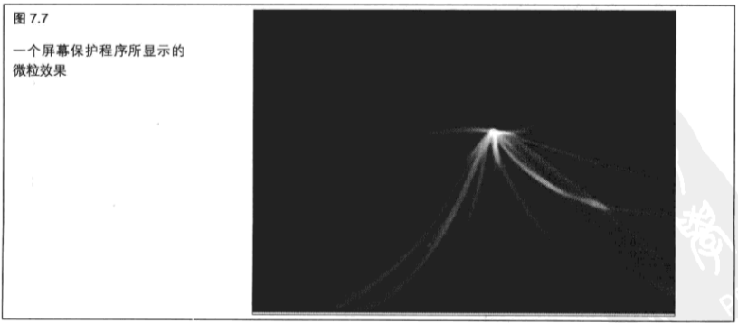

# 纹理高级知识

+ 如何使用矩形纹理

+ 如何使用称为立方图的六面体纹理

+ 如何同时使用多个纹理

+ 如何使用点精灵

+ 如何使用纹理数组使着色器能够访问更多的纹理

+ 如何通过代理向驱动程序查询纹理支持信息

&emsp;&emsp;在第 `5` 章，我们了解了纹理贴图与 `OpenGL` 之间的联系。首先我们了解了一些基础：加载 `2D` 图像文件、使用纹理坐标,以及不同的环绕模式等。现在我们可以在这个知识库中进行更深、更广的研究了。我们很快就能看到,纹理数据可以采用更多的形式,而不仅仅是从磁盘上加载 `2D` 图像文件,有时甚至可以是不包含任何形式的视觉数据或者图片的纹理!最后,我们会看到在某些时候纹理甚至不是真正存在的,而是由片段程序凭空创造出来的。

&nbsp;

## 7.1 矩形纹理

&emsp;&emsp;首先，我们继续以在纹理中使用图像文件的经验为基础，创建我们实际希望以某种形式进行显示的图像。第 `5` 章主要是关于使用纹理目标 `GL_TEXTURE_2D` 的 `2D` 图像的,我们还在前一章了解了如何将 `GL_TEXTURE_1D` 作为颜色查询表使用来进行动画着色。对于一维、二维和三维纹理(回忆一下 `GL_TEXTURE_3D` )来说,我们在典型情况下将纹理映射到几何图形上,其纹理坐标经过标准化,取值范围为 `0.0` 到 `1.0` 。我们可以超出这个范围,并使用各种纹理坐标环绕模式确定这个纹理是否以不同的方式进行重复,或者被截取到纹理图像的边缘。

&emsp;&emsp;对于二维纹理图像来说,另一个有用的选项是纹理目标 `GL_TEXTURE_RECTANGLE` 。这个纹理目标 模式的工作方式和 `GL_TEXTURE_2D` 非常相似，但有几点不同。首先，它们不能进行 `Mip` 贴图，这就意 味着我们只能加载 `glTexImage2D` 的第 `0` 层;第二,纹理坐标不是标准化的,这就意味着纹理坐标实际 上是对像素寻址,而不是从 `0.0` 到 `1.0` 的范围覆盖图像的。纹理坐标( `5` , `19` )实际上是图像中从左起 `6` 个像素,以及从上面起 `20` 个像素(请记住,程序员是从 `0` 开始数的!)。

&emsp;&emsp;此外,纹理坐标不能重复,并且不支持纹理压缩。

&emsp;&emsp;相对于使用纹理来获得 `3D` 模型表面特征,这种方式对于许多 `OpenGL` 用来处理和提交图像数据的应用程序来说更加方便,对于纹理矩形的硬件支持也比对通常的 `2D` 纹理贴图更简单,并且更快、效率更高。

> 7.1.1 加载矩形纹理

&emsp;&emsp;程序清单 `7.1` 用 `gltWriteTGA` 函数将屏幕图像保存为一个 `Targa` 文件。这与我们以前在 `GL_TEXTURE_2D` 纹理中应用过的 `LoadTGATexture` 非常相似。最显著的变化当然就是现在所有的纹理 函数都使用 `GL_TEXTURE_RECTANGLE` 而不是 `GL_TEXTURE_2D` 作为它们的第一个参数。任何用于矩 形纹理的纹理函数都会发生这种变化。我们还删除了用于检查Mip贴图纹理过滤器的代码,因为它们已 经不被支持了；我们必须使用 `GL_NEAREST` 或 `GL_LINEAR` 过滤器模式。

&emsp;&emsp;我们原样保留了 `wrapMode` 参数,但是 `GL_REPEAT` 和 `GL_REPEAT_MIRRORED` 环绕模式在矩形纹理中也不被支持了。

```C++
bool LoadTGATextureRect(const char *szFileName, GLenum minFilter, GLenum magFilter, GLenum wrapMode)
{
    GLbyte *pBits;
    int nWidth, nHeight, nComponents;
    GLenum eFormat;
    // 读入纹理位
    pBits = gltReadTGABits(szFileName, &nWidth, &nHeight, &nComponents, &eFormat);
    if (pBits == NULL)
        return false;
    glTexParameteri(GL_TEXTURE_RECTANGLE, GL_TEXTURE_WRAP_S, WrapMode);
    glTexParameteri(GL_TEXTURE_RECTANGLE, GL_TEXTURE_WRAP_T, wrapMode);
    glTexParameteri(GL_TEXTURE_RECTANGLE, GL_TEXTURE_MAG_FILTER, magFilter);
    glTexParameteri(GL_TEXTURE_RECTANGLE, GL_TEXTURE_MIN_FILTER, minFilter);
    glPixelStorei(GL_UNPACK_ALIGNMENT, 1);
    glTexImage2D(GL_TEXTURE_RECTANGLE, 0, nComponents, nWidth, nHeight, 0,eFormat, GL_UNSIGNED_BYTE, pBits);
    free(pBits);
    return true;
}
```

> 7.1.2 使用矩形纹理

&emsp;&emsp;图 `7.1` 所示是一个 `OpenGL` 标志,在第一个示例程序会使用它。

&emsp;&emsp;这是一个带有 `alpha` 通道的 `Targa` 文件，我们将把它放在活动的 `SphereWorld` 示例的屏幕前方。这个图像的宽为 `300` 像素,而高为 `155` 像素。


&emsp;&emsp;将这个文件作为矩形纹理进行加载，看起来和加载以前的 `2D` 纹理文件很相似。我们还要注意在 `glBindTexture` 函数调用过程中 `GL_TEXTURE_RECTANGLE` 的改变。

```C++
glBindTexture(GL_TEXTURE_RECTANGLE, uiTextures[3]);
LoadTGATextureRect ("OpenGL-Logo.tga", GL_NEAREST, GL_NEAREST, GL_CLAMP_TO_EDGE);
```

&emsp;&emsp;`TextureRect` 示例程序的目标就是在屏幕的右下角显示 `OpenGL` 标志。在屏幕空间中进行 `2D` 绘制时,普遍的做法是创建一个与屏幕大小相匹配的正投影矩阵。我们选择让坐标系与屏幕上的纹理匹配，但是将原点( `0` , `0` )设置在了左下角而不是左上角。

&emsp;&emsp;这样就能保证绘制坐标都干净整齐地落在笛卡尔坐标系第一象限中了。

&emsp;&emsp;对这个投影矩阵的设置请参见下面这段代码。

```C++
M3DMatrix44f mScreenSpace;
m3dMakeOrthographicMatrix(mScreenSpace, 0.0f, 800.0f, 0.0f, 600.0f, -1.0f, 1.0f);
```

&emsp;&emsp;我们使用 `GLBatch` 类和一个三角形扇在将要显示 `OpenGL` 标志的位置创建矩形。请注意从 `0.0` 到标志宽度或者高度范围内的纹理坐标是如何指定的。

```C++
int x = 500;
int y = 155;
int width = 300;
int height = 155;
logoBatch.Begin(GL_TRIANGLE_FAN, 4, 1);
// 左上角
logoBatch.MultiTexCoord2f(0, 0.0f, height);
logoBatch.Vertex3f(x, y, 0.0);
// 左下角
logoBatch.MultiTexCoord2f(0, 0.Of, 0.0f);
logoBatch.Vertex3f(x, y - height, 0.0f);
// 右下角
logoBatch.MultiTexCoord2f(0, width, 0.0f);
logoBatch.Vertex3f(x + width, y - height, 0.0f);
// 右上角
logoBatch.MultiTexCoord2f(0, width, height);
logoBatch.Vertex3f(x + width, y, 0.0f);
logoBatch. End ();
```

&emsp;&emsp;现在我们有了一个顶点和纹理坐标批次，可以开始进行渲染了。首先需要一个能够使用矩形纹理的纹理贴图着色器。这又是一个很普通的对于 `2D` 纹理着色器的修改版本，而我们只需要将采样器从sampler2D 类型改变成 `samplerRect` 类型。程序清单 `7.2` 展示了这个采样程序中的片段着色器。

```C++
#version 330
out vec4 vFragColor;
uniform samplerRect rectangleImage;
smooth in vec2 vVaryingTexCoord;
void main(void) 
{
    vFragColor = texture(rectangleImage, vVaryingTexCoord);
}
```

&emsp;&emsp;最后,我们对常规的 `SphereWorld` 输出界面顶部的标志进行渲染。为了完成这项工作,我们再次开启混合并关闭深度测试。另一方面，因为改变了坐标系，所以可以很容易地获得基本 `3D` 场景的深度值，以防2D图像被不正确地进行渲染。

```C++
glEnable(GL_BLEND);
// 开启混合，关闭深度测试
glDisable(GL_DEPTH_TEST);
glUniformMatrix4fv(locRectMVP, 1, GL_FALSE, mScreenSpace);
glBindтexture(GL_TEXTURE_RECTANGLE, uiTextures[3]):
LlogoBatch.Draw();
glUseProgram(rectReplaceShader);
glUniformli(locRectTexture, 0);
// 恢复关闭混合并开启深度测试的状态
glDisable(GL_BLEND);
glEnable(GL_DEPTH_TEST);
```

&emsp;&emsp;最终输出如图 `7.2` 所示,彩图 `7` 也展示了这个图形。


## 7.2 立方体贴图

&emsp;&emsp;立方体贴图是作为一个单独的纹理对象看待的，但是它由组成立方体 `6` 个面的 `6` 个正方形(没错，它们必须是正方形! )的 `2D` 图像组成的。立方体贴图的应用范围包括3D光线贴图、反射和高精度环境贴图等。

&emsp;&emsp;图 `7.3` 所示是组成立方体的6个正方形的布局,我们在 `Cubemap` 示例程序会使用它。


&emsp;&emsp;这 `6` 个“瓷砖”从 `6` 个不同的方向( `X` 、 `Y` 和 `Z` 轴的正、负方向)展示了场景的全貌。实质上，一个立方体贴图是投影到一个对象上的,就像这个立方体贴图是包围着这个对象一样。

> 加载立方体贴图

&emsp;&emsp;立方体贴图新增了以下 `6` 个值,这些值可以传递到 `glTeximage2D`。

```C++
GL_TEXTURE_CUBE_MAP_POSITIVE_X. GL_TEXTURE_CUBE_MAP_NEGATIVE_X. 
GL_TEXTURE_CUBE_MAP_POSITIVE_Y, GL_TEXTURE_CUBE_MAP_NEGATIVE_Y,
GL_TEXTURE_CUBE_MAP_POSITIVE_Z 和 GL_TEXTURE_CUBE_MAP_NEGATIVE_Z.
```

&emsp;&emsp;这些常量展示了包围被贴图物体立方体表面的场景坐标方向。例如，要加载 `×` 轴正方向的贴图,就可以使用下面的函数。

```C++
glTexImage2D(GL_TEXTURE_CUBE_MAP_POSITIVE_X, 0, GL_RGBA, iWidth, iHeight, 0, GL_RGBA, GL_UNSIGNED_BYTE, pImage);
```

&emsp;&emsp;为了更进一步完善这个示例，请看下面这段取自示例程序的代码片段。 这里，我们在一个数组中存储了 `6` 个立方体贴图表面的名称和标识符,然后使用一个循环将这 `6` 个图像加载到一个单独的纹理对象中。

```C++
const char *szCubeFaces[6] = { "pos_x.tga", "neg_x.tga", "pos_y.tga","neg_y.tga","pos_z.tga", "neg_z.tga" };
GLenum cube[6] = { GL_TEXTURE_CUBE_MAP_POSITIVE_X, 
                    GL_TEXTURE_CUBE_MAP_NEGATIVE_X, 
                    GL_TEXTURE_CUBE_MAP_POSITIVE_Y,
                    GL_TEXTURE_CUBE_MAP_NEGATIVE_Y, 
                    GL_TEXTURE_CUBE_MAP_POSITIVE_Z, 
                    GL_TEXTURE_CUBE_MAP_NEGATIVE_Z };

...

glTexParameteri(GL_TEXTURE_CUBE_MAP, GL_TEXTURE_MAG_FILTER, GL LINEAR);
glTexParameteri(GL_TEXTURE_CUBE_MAP, GL_TEXTURE_MIN_FILTER, GL_LINEAR_MIPMAP_LINEAR);
glTexParameteri(GL_TEXTURE_CUBE_MAP, GL_TEXTURE_WRAP_S, GCMD);
glTexParameteri(GL_TEXTURE_CUBE_MAP, GL_TEXTURE_WRAP_T, GLCLMD);
glTexParameteri(GL_TEXTURE_CUBE_MAP, GL_TEXTURE_WRAP_R, GL_CLAMP_TO_EDGE);

GLbyte *pBytes;
GLint iwidth, iHeight, iComponents;
GLenum eFormat;

// 加载立方体贴图图像
for(i = 0; i< 6; i++)
{
    // 加载这个纹理贴图(GL_TEXTURE_CUBE_MAP, GL_GENERATE_MIPMAP, GL_TRUE); 
    pBytes = gltLoadTGABits(szCubeFaces[i], &iWidth, &iHeight, siComponents, &eFormat);
    glTexImage2D(cube[i], 0, iComponents, iWidth, iHeight, O, eFormat, GL_UNSIGNED_BYTE, pBytes);
    free(pBytes);
}
glGenerateMipmap(GL_TEXTURE_CUBE_MAP);
```

&emsp;&emsp;这个立方体贴图的纹理坐标乍一看会让人觉得有点奇怪。和真正的 `3D` 纹理不同, `S` 、 `T` 和 `R` 纹理坐标表示的是一个从纹理贴图的中心出发的有符号向量。这个向量与立方体贴图的 `6` 个面中的一个相交。然后,围绕着这个交点的纹理向量将被采样,从纹理中创建过滤颜色值。

> 7.2.2 创建天空盒

&emsp;&emsp;立方体贴图最普遍的用法就是创建一个反映它周围景象的对象。

&emsp;&emsp;`Cubemap` 示例程序使用的 `6` 个图像由 `The Game Creators` , `Ltd` . ( `www.thegamecreators.com` )提供。这个立方体贴图被应用到一个球体上,创建了镜面表面的外观。同样的立方体贴图也应用在天空盒上,这个天空盒创建了反射后的背景。

&emsp;&emsp;所谓的天空盒只不过是一个带有天空图片的大盒子。另一种观点是将它看成一个贴在大盒子上的天空图一片！够简单了吧。一个有效的天空盒包含 `6` 个图像，这 `6` 个图像包括从我们场景中心沿着 `6` 个方向轴所看到的场景。如果这听起来像一个立方体贴图,那么恭喜,说明大家的注意力非常集中!在 `Cubemap` 示例程序中,我们在场景中绘制了一个很大的盒子,立方体贴图纹理就应用在这个立方体的 `6` 个面上。天空盒使用 `GLTools` 函数 `gltMakeCube` 进行绘制,这个函数所做的只是用组成一个指定半径的立方体的三角形来填充`GLBatch`容器。在这个示例中,我们选择一个在每个方向到原点距离都为 `20` 个单位长度的立方体。

```C++
gltMakeCube(cubeBatch, 20.0f);
```

&emsp;&emsp;这个函数将 `2D` 纹理坐标分配给 `GLT_ATTRIBUTE_TEXTUREO` 属性槽，这样在立方体的每个表面上都会应用一个 `2D` 图像。不过,这样做并不能满足我们对于立方体贴图的需求,我们需要的是代表一个向量的 `3D` 纹理坐标,沿着这个向量在立方体贴图上进行纹理单元采样。`GLBatch` 类只支持 `2D` 纹理,所以它在盒子的外面是无法使用的。解决办法是编写一个自定义顶点着色器,用它为我们计算纹理坐标。实际上，这样只是简单地指定立方体的每个角在顶点空间中也是一个从立方体的中心指向这个位置的向量。我们要做的就是对这个向量进行标准化,而我们已经有了一个现成的立方体贴图纹理坐标。

&emsp;&emsp;天空盒着色器顶点程序的源代码如程序清单 `7.3` 所示。这个示例程序的唯—一个目的就是通过模型视图投影矩阵将顶点位置进行变换,并从原来的顶点位置获得一个纹理坐标。置

```C++
#version 330
//输入每个顶点…只输入位置
in vec4 vVertex;
uniform mat4 mvpMatrix; // 变换矩阵
// 片段程序的纹理坐标
varying vec3 vVaryingTexCoord;
void main(void)
{
    // 传递纹理坐标
    vVaryingTexCoord = normalize(vVertex.xyz);
    //不要忘记对几何图形进行变换
    gl_Position = mvpMatrix * vVertex;
}
```

&emsp;&emsp;程序清单 `7.4` 提供的片段程序接受 `3` 分量纹理坐标,并在这个位置对立方体贴图进行采样。请注意, 对于立方体贴图来说,采样器类型为 `samplerCube`。

```C++
#version 330
out vec4 vEragColor;
uniform samplerCube cubeMapvarying; 
vec3 vVaryingTexcoord;
void main(void)
{
    vFragColor texture(cubeMap, vVaryingTexCoord);
}
```

&emsp;&emsp;关于天空盒最后要注意的一点是,当我们在立方体贴图上使用 `Mip` 贴图时,沿着两个面结合的边缘 常常会出现缝隙（实际上在立方体贴图的其他应用中也会出现）。`OpenGL` 内部会调整自己的过滤规则， 在启用 `GL_TEXTURE_CUBE_MAP_SEAMLESS` 时帮助消除这些缝隙,如下所示。

```C++
glEnable(GL_TEXTURE_CUBE_MAP_SEAMLESS);
```

> 7.2.3 创建反射

&emsp;&emsp;对天空盒进行渲染非常简单，创建反射也只是更复杂一点点而已。

&emsp;&emsp;首先必须使用表面法线和指向顶点的向量在着色器中创建一个视觉坐标系中的反射向量。另外，为了获得一个真实的反射,还要考虑照相机的方向。从 `GLFrame` 类中提取照相机的旋转矩阵并进行转置。然后将其作为统一值,与另一个变换矩阵(用来对前述的反射向量进行旋转,这个反射向量实际上就是立方体贴图纹理坐标）一起提供给着色器。

&emsp;&emsp;如果不对纹理坐标进行旋转，那么当照相机在场景中移动时，立方体贴图将不能正确地反射围绕它的天空盒。

&emsp;&emsp;程序清单 `7.5` 列出了 `Reflection.vp` 顶点着色器程序的源代码。相应的片段着色器代码与天空盒着色器的片段着色器代码基本相同,它只是使用插值立方体贴图纹理坐标对立方体贴图进行采样并将其应用到片段上。

```C++
#version 330

// 输入每个顶点…位置和法向
in vec4 vVertex;
in vec3 vNormal;

uniform mat4 mvpMatrix;
uniform mat4 normalMatrix;
uniform mat3 mInverseCamera;
uniform mat4 mvMatrix; 

// 片段程序的纹理坐标
smooth out vec3 vVaryingTexCoord;
void main(void)
{
    // 视觉空间中的法线
    vec3 vEyeNormal = normalMatrix * vNormal;
    // 视觉空间中的顶点位置
    vec4 vVert4 mvMatrix * vVertex;
    vec3 vEyeVertex = normalize(vVert4.xyz / vVert4.w);
    // 获取反射向量
    vec4 vCoords = vec4(reflect(vEyeVertex, vEyeNormal), 1.0);
    // 通过反转的照相机进行旋转
    vCoords = mInverseCameravCoords;
    vVaryingTexcoord.xyz = normalize(vCoords.xyz);
    //不要忘记对几何图形进行变换
    gl_Position = mvpMatrix * vVertex;
}
```

&emsp;&emsp;图 `7.4` 所示显示了 `Cubemap` 示例程序的输出。请注意天空和周围的地形是如何正确地通过球体表面反射的。围绕球体移动照相机(通过使用方向键实现)也可以展示背景和天空视图是如何通过球体进行正确的反射的。


## 7.3 多重纹理

&emsp;&emsp;以前接触的纹理贴图都是将一个单独的纹理加载到纹理对象上。当我们想要使用这个纹理时，将它绑定到选定的纹理对象上,然后将片段着色器中的单个统一值设置为…… `0` 。为什么是 `0` 呢? 因为 `0` 是我们将要绑定到的纹理单元的索引。现在的 `OpenGL` 允许我们将独立的纹理对象绑定到一些可用的纹理单元上,从而提供了将两个或更多纹理同时应用到几何图形上的能力。我们可以对实现进行查询,来查看支持的纹理单元数量,如下所示。

```C++
GLint iUnits;
glGetIntegerv(GL_MAX_TEXTURE_UNITS, &iUnits);
```

&emsp;&emsp;默认情况下，第一个纹理单元为活动的纹理单元。所有纹理绑定操作都会影响当前活动的纹理单元。我们可以通过调用以纹理单元标识符为变量的  `glActiveTexture` 来改变当前纹理单元。例如，要切换到第二个纹理单元并将它绑定到指定的纹理上,我们应该进行下面的工作。

```C++
glActiveTexture(GL_TEXTURE1);
glBindTexture(GL_TEXTURE_2D, textureID);
```

&emsp;&emsp;在使用多个纹理进行渲染的时候,记住那个纹理单元当前是活动的,这一点非常重要。这些纹理单元在纹理的维数上也是未知的,它们可以是一维、二维或者三维纹理或立方体贴图,也可能是纹理矩形。

> 7.3.1 多重纹理坐标

&emsp;&emsp;通过对纹理坐标进行插值，我们可以将纹理应用到几何图形上。没有什么能够阻止我们为了任意数量的纹理单元或者层次(有时候它们会被这样称呼)使用一组纹理坐标。我们还可以计算纹理坐标,就像在前面的示例中为天空盒所做的一样,或者可以为每个纹理提供独立的一组纹理坐标;毕竟这只不过是在我们的批次中增加一组属性而已。这些内容没什么特别的。

&emsp;&emsp;默认情况下, `GLBatch` 类不会以一个属性数组的形式提供任何纹理坐标。不过,在调用以 `nTextureUnits` 为参数的 `Begin` 函数时,我们最多可以指定4组纹理坐标。

```C++
void GLBatch::Begin(GLenum primitive, GLuint nVerts,GLuint nTextureUnits = 0);
```

&emsp;&emsp;有两个函数可以提供纹理坐标。第一个函数是 `CopyTexCoordData2f` ，它的速度是最快的，因为它会一次复制整个—组纹理坐标。

```C++
void GLBatch::CopyTexCoordData2f(M3DVector2f *vTexCoords,GLuint uiTextureLayer);
```

&emsp;&emsp;第二个函数则是使用较慢的每次一个顶点的接口,与立即模式类似。

&emsp;&emsp;我们可以通过两种方式指定一个二维纹理坐标,每次指定一个。

```C++
void GLBatch::MultiTexCoord2f(GLuint texture, GLclampf s, GLclampf t);
void GLBatch::MultiTexCoord2fv(GLuint texture, M3DVector2f vTexCoord);
```

> 7.3.2 多重纹理示例

&emsp;&emsp;多重纹理可以以几乎无限多的方式进行组合。有种类繁多的技术采用在一个着色器中一次使用两个或多个纹理的方式。我们仍然向读者推荐附录 `A` ，在这里我们可以了解关于更多 `3D` 技术的资源。

&emsp;&emsp;为了演示将多重纹理进行结合是多么简单,我们最后再创建一个立方体贴图示例,在场景中间的镜面球体上添加一些“晦暗”的成分。“晦暗”纹理如图 `7.5` 所示。


&emsp;&emsp;我们将这个二维纹理绑定到纹理单元 `GL_TEXTURE1` 上,然后用取自晦暗纹理的纹理颜色乘以立方体贴图纹理的颜色。在晦暗纹理较深的地方,反射会变暗,而在晦暗纹理较浅或者接近白色的地方,它对反射纹理几乎没有影响。这个效果的输出结果如图 `7.6` 所示。


&emsp;&emsp;这项操作的客户端部分非常简单。现在已知 `tarnishTexture` 是包含晦暗纹理的纹理对象，而 `cubeTexture` 是包含立方体贴图的纹理对象名称，下面的代码会将这两个纹理进行绑定，其中每个纹理都绑定到自己的纹理单元上。


```C++
//将纹理绑定到自己的纹理单元上
glActiveTexture(GL_TEXTURE1);
glBindTexture(GL_TEXTURE_2D, tarnishTexture);
glActiveTexture(GL_TEXTUREO);
glBindTexture(GL_TEXTURE_CUBE_MAP, cubeTexture);
```

&emsp;&emsp;回忆一下,以前的球体批次包含一组二维纹理坐标,这组坐标在立方体贴图示例程序中并没有使用。现在我们修改一下着色器代码,将这些纹理坐标用在晦暗纹理上,同时继续对立方体贴图纹理坐标进行计算。我们只讨论新增加的这 `3` 行着色器代码，而不再重新列出整个顶点程序。首先，为晦暗纹理将要使用的二维为纹理坐标添加属性。

```C++
in vec2 vTexCoords;
```

&emsp;&emsp;当然,随后我们需要对它们进行插值,所以设置一组坐标,这组坐标能够在顶点之间平滑地进行插值。

```C++
smooth out vec2 vTarnishCoords;
```

&emsp;&emsp;这实在不算什么,对于普通的纹理贴图来说,我们通常不会做这些工作。最大的改变发生在片段程序中,程序清单 `7.6` 完整地列出了片段程序的代码。

```C++
#version 330
out vec4 vFragColor;
uniform samplerCube cubeMap;
uniform sampler2D tarnishMap;
smooth in vec3 vVaryingTexCoord;
smooth in vec2 vTarnishCoords;
void main(void)
{
    vFragColor = texture(cubeMap, vVaryingTexCoord.stp);
    vFragColor *= texture(tarnishMap, vTarnishCoords);
}
```

&emsp;&emsp;请注意现在有两个采样器，即 `samplerCube` 类型的 `cubeMap` 和 `sampler2D` 类型的 `tarnishMap` 。这两个纹理使用各自的纹理坐标进行采样，而结果得到的过滤颜色值只是简单地相乘，就会得到最终的片段颜色。

## 7.4 点精灵

&emsp;&emsp;点精灵（ `Point Sprite` ，又译为点块纹理）是 `OpenGL 1.5` 及更新版本所支持的一个激动人心的特性。尽管 `OpenGL` 一直支持对点进行纹理贴图,但在 `1.5` 版本之前这意味着将单个纹理坐标应用于整个点。较大的经过纹理贴图的点就是经过过滤的单个纹理单元的放大版本。使用点精灵（点精灵在 `OpenGL 3.0` 及更新版本中已成为默认的点渲染模式)，我们可以通过绘制一个 `3D` 点将一个 `2D` 纹理图像显示在屏幕的任意位置上。

&emsp;&emsp;点精灵最常见的应用可能就要算微粒系统了。我们可以用点来表示在屏幕上移动的大量微粒，来产生一些视觉效果。但是，把这些点表示为很小的重叠 `2D` 图像可以戏剧性地流动着动画细丝。例如，图 `7.7` 所示显示了 `Macintosh`（苹果电脑）上一个众所周知的屏幕保护程序，它就是由微粒效果所驱动的。



&emsp;&emsp;在点精灵之前，为了实现这种类型的效果，需要在屏幕上绘制大量纹理四边形（或者三角形带）。这可以通过对每个多边形执行开销巨大的旋转来实现,以确保它面对着照相机，或者也可以在 `2D` 正交投影下绘制所有的微粒。点精灵允许我们通过发送单个 `3D` 顶点,渲染一个完美对齐的纹理 `2D` 多边形。点精灵是 `OpenGL` 中一种强大而又高效的特性,它所需要的带宽只有为四边形发送 `4` 个顶点所需带宽的四分之一,并且不需要客户端的矩阵逻辑来保持 `3D` 四边形与照相机的对齐。

> 7.4.1 使用点

&emsp;&emsp;点精灵非常容易使用。在客户端,我们需要做的只是简单地绑定一个 `2D` 纹理(不要忘记为纹理单元设置恰当的统一值!),因为现在点精灵已经是默认的点光栅化模式,只有一种情况下例外,就是在开启点平滑（ `point smoothing` ）的时候。

&emsp;&emsp;我们不能同时使用点精灵和抗锯齿点。在片段程序中，有一个内建变量 `gl_PointCoord` ，这是一个二分量向量,在顶点上对纹理坐标进行插值。程序清单 `7.7` .展示了 `PointSprites` 示例程序中的片段着色器。

```C++
#version 330
out vec4 vFragColor;
in vec4 vStarColor;
uniform sampler2D starImage;
void main(void)
{
    vFragColor = texture(starImage, gl_PointCoord) * vStarColor;
}
```

&emsp;&emsp;所以对于点精灵来说，我们不需要将纹理坐标作为一个属性进行传递。

&emsp;&emsp;既然一个点就是一个单独的顶点，我们就不能以任何其他方式在点表面上进行插值了。当然，如果我们无论如何都要提供一个纹理坐标,或者以自定义的方式进行插值,那么也没有什么能够阻止我们。

> 7.4.2 点大小

&emsp;&emsp;有两种方式可以设置点大小。第一种方式是 `glPointSize` 函数。

```C++
void glPointSize(GLfloat size);
```

&emsp;&emsp;这个函数为锯齿点和抗锯齿点设置点的直径,以像素为单位。在第 `3` 章已经介绍了这个函数,以及如何确定可用的点大小范围。我们也可以在顶点着色器中用程序设置点大小。首先启用点大小模式。

```C++
glEnable(GL_PROGRAM_POINT_SIZE);
```

&emsp;&emsp;然后，在我们的顶点程序中，可以设置一个内建变量 `gl_PointSize` ，这个变量确定了点的最终光栅化大小。这种方式的一种常见用途就是根据点的距离来确定它的大小。当我们使用 `gl_PointSize` 函数设置点的大小时,它们不受透视除法的影响,而是将所有的点设置为同样大小,无论它们有多远。

&emsp;&emsp;下面的方程常常用来实现基于距离的点大小变化。

$$size=\sqrt{\dfrac{1}{a+b*d+c*d^2}}$$

&emsp;&emsp;其中 `d` 是从这个点到观察点的距离,而 `a` 、 `b` 和 `c` 则是二次方程的参数。我们可以将它们存储为统一值，并用应用程序来对它们进行更新，或者如果我们已经想好了一组特定的参数，也可以在顶点着色器中将它们设为常量。例如,如果我们想设定一个常量大小值,那么就将 `a` 设为非 `0` 值,而将 `b` 和 `c` 设为 `0` 。如果 `a` 和 `c` 都设为 `0` 而 `b` 设为非 `0` 值,那么点大小将随着距离的变化而线性变化。类似地,如果 `a` 和 `b` 都设为 `0` 而 `c` 设为非 `0` 值,那么点大小将随着距离的变化而呈平方关系变化。

> 7.4.3 综合运用

&emsp;&emsp;现在让我们来看一个示例程序,其中运用了我们到目前为止讨论过的点精灵特性。`PointSprite` (点精灵)示例程序创建了一个动画星空,它看起来就像我们在星空中向前飞行一样。这种效果通过在视野前方放置随机点,然后将一个时间值作为统一值传递给顶点而实现的。这个时间值用来移动这个点的位置,从而使这些点随着时间的推移向我们靠近,然后在它们在接近视景体背面的邻近剪切面时进行循环。此外,我们还会对星星的大小进行缩放,这样它们在开始的时候很小,但随着越来越接近我们的视野而越来越大。这样做得到的结果非常真实…现在我们唯一需要的就是一些天文馆或者太空电影的音乐了!图 `7.8` 所示展示了我们在点上应用的星星纹理。这只是一个 `Targa` 文件,我们使用与到目前为止加载任何其他 `2D` 纹理相同的方法来加载它;也可以在点上进行 `Mip` 贴图,而且因为它们的范围可能会从非常小到非常大,所以这样做确实是个好主意。


&emsp;&emsp;我们并不打算介绍设置星空效果的所有细节,因为这些内容基本上都属于例行公事。如果想要看看随机数是如何选择的,我们可以查看一下源代码。更重要的是 `RenderScene` (渲染场景)函数中代码的实际渲染。

```C++
glClear(GL_COLOR_BUFFER_BIT);

// 开启附加混合
glEnable(GL_BLEND);
glBlendFunc(GL_ONE, GL_ONE);

// 让顶点程序决定点大小
glEnable(GL_PROGRAM_POINT_SIZE);

// 绑定到着色器上，设置 Uniform 值
glUseProgram(starFieldShader);
glUniformMatrix4fv(locMVP, 1, GL_FALSE, viewFrustum.GetProjectionMatrix()):
glUniformli(locTexture, 0):

// fTime 从 0.0 变化到 999.0并进行循环
float fTime = timer.GetElapsedSeconds() * 10.0f;
fTime = fmod(fTime, 999.0f);
glUniformlf(locTimeStamp, fTime);

// 绘制星星
starsBatch.Draw ();
```

&emsp;&emsp;读者可能一上来就发现了,我们没有对深度缓冲区进行清除。这是因为要使用附加混合来对行星与背景进行混合。因为纹理暗部是黑色的(在颜色空间中为 `0` ),所以我们只要将颜色相加就可以了,就像我们所看到的一样。使用 `alpha` 透明度会要求按照深度对星星进行排序,而我们完全可以避免这种开销。在开启点大小程序模式之后,我们将绑定到着色器上,并设置统一值。这里令人感兴趣的是,我们有一个计时器,它驱动星星的循环 `z` 坐标,所以只从 `0` 计数到 `999` ,程序清单 `7.8` 展示了顶点着色器的源代码,其中也有一些有趣的特性。

```C++
#version 330

// 输入每个顶点的位置和法向
in vec4 vVertex;
in vec4 vColor;
uniform mat4 mvpMatrix;
uniform float timeStamp;
out vec4 vStarColor;
void main(void)
{
    vec4 vNewVertex = vVertex;
    vStarColor = vColor;

    // 由运行时进行偏移，使它移近
    vNewVertex.z += timeStamp;

    // 如果超出范围则进行调整
    if (vNewVertex.z > -1.0)
        vNewVertex.z -= 999.0;
        
    // 自定义大小调整
    gl_PointSize = 30.0 + (vNewVertex.z / sqrt(-vNewVertex.z));
        
    //如果它们非常小的话，则让它们逐渐消失
    if (gl_PointSize < 4.0)
        vStarColor = smoothstep(0.0, 4.0, gl_PointSize) * vStarColor;

    // 不要忘记对几何图形进行变换
    gl_Position = mvpMatrix * vNewVertex;
}
```

&emsp;&emsp;顶点的 `z` 位置通过时间戳统一值进行偏移,星星向我们靠近的动画效果就是这样实现的。我们需要检查位置,而当它们到达临近剪切面时,只要将它们的位置进行循环回到远端剪切面即可。我们使用一个平方根倒数函数来使星星在接近我们的过程中越来越大,并用变量设置最终的大小。如果星星太小,有时候会变得闪烁,所以最后再进行一项检查,当点的大小小于 `4.0` 时,使这个点的颜色逐渐变暗,从而使它们在视野中消失,而不是在远端剪切面附近忽隐忽现。最终的输出结果如图 `7.9` 所示。


> 7.4.4 点参数

&emsp;&emsp;通过 `glPointParameter` 函数，我们可以对点精灵（实际上还包括一般的点）的几个特性进行微调。 图 `7.10` 所示为应用到一个点精灵上的纹理的原点( `0` , `0` )的两个可能位置。


&emsp;&emsp;将 `GL_POINT_SPRITE_COORD_ORIGIN` 参数设置为 `GL_LOWER_LEFT` ，可以将纹理坐标系的原点 放置在点的左下角。

```C++
glPointParameteri(GL_POINT_SPRITE_COORD_ORIGIN, GL_LOWER_LEFT);
```

&emsp;&emsp;点精灵的默认方向为 `GL_UPPER_LEFT` 。

&emsp;&emsp;另外一个与纹理无关的点参数也可以用来设置 `alpha` 值，使点可以通过将 `alpha` 与到观察点的距离进 行混合而逐渐消失。要了解这些参数的相关细节,请参见附录 `C` 中的 `glPointParameter` 函数入口。

> 7.4.5 异形点

&emsp;&emsp;除了以 `glPointCoord` 为纹理坐标应用纹理之外,我们还可以用点精灵来完成一些其他工作。`gl_FragCoord` 就是另外一个内建变量。

&emsp;&emsp;事实上,在任何其他图元进行渲染时, `glFragCoord` 会包含当前片段的屏幕空间坐标。这样,这个坐标的 `x` 和 `y` 分量在这个点区域的不同位置也不相同。然而, `z` 和 `w` 分量都是常量,因为这个点是作为一个平面进行渲染的,这个平面与近端面和远端面平行。

&emsp;&emsp;我们可以使用 `gl_PointCoord` 来完成很多工作，而不仅仅是纹理坐标。

&emsp;&emsp;例如,我们可以在片段着色器中使用 `discard` 关键字来丢弃位于我们想要的点形状范围之外的片段,从而创建出非正方形的点。

&emsp;&emsp;下面的片段着色器代码能够生成圆形的点。


```C++
vec2 p = gl_PointCoord * 2.0 - vec2(1.0);
if (dot(p, p) > 1.0)
    discard;
```

&emsp;&emsp;或者还可以生成有趣的花朵形状。

```C++
vec2 temp = gl_PointCoord * 2.0 - vec2(1.0);
if (dot(temp, temp) > sin(atan(temp.y, temp.x) * 5.0))
    discard;
```

&emsp;&emsp;这些都是简单的代码段,允许我们渲染任意形状的点。图 `7.11` 所示展示了我们可以用这种方式生成的一些其他有趣图形的例子。


> 7.4.6 点的旋转

&emsp;&emsp;因为 `OpenGL` 中的点是作为按轴对齐的正方形而进行渲染的,对点精灵进行旋转必须通过修改用于读取点精灵纹理的纹理坐标来完成。要完成这项工作,我们只需在片段着色器中创建一个 `2D` 旋转矩阵,并用它乘以 `glPointCoord` 使它围绕z轴进行旋转。旋转的角度可以从顶点着色器或者几何着色器中作为一个插值变量传递到片段着色器。变量的值可以在顶点着色器或几何着色器中依次进行计算,或者也可以通过一个顶点属性提供。程序清单 `7.9` 展示了一个更加复杂一点的点精灵片段着色器,它允许点围绕着自己的中心进行旋转。

```C++
#version 330
uniform sampler2D sprite_texture;
in float angle;
out vec4 color;
void main(void)
{
    const float sin_theta = sin(angle);
    const float cos_theta = cos(angle);
    const mat2 rotation_matrix = mat2(cos_theta, sin_theta,-sin_theta, cos_theta);
    
    const vec2 pt = gl_PointCoord - vec2(0.5);
    color = texture (sprite_texture, rotation_matrix pt + vec2 (0.5));
}
```

&emsp;&emsp;这个示例允许我们创建旋转的点精灵。不过, `angle` 的值当然不能在点精灵中的片段之间进行改变。这就是说，对于点中的每个片段来说，旋转矩阵也是一个常量。这样，比起为每个片段分别计算旋转矩阵，在顶点着色器中进行旋转矩阵运算,然后将它作为一个 `mat2` 变量传递给片段着色器的效率要高得多。

&emsp;&emsp;这里有一个更新过的顶点着色器和片段着色器，允许我们绘制旋转的点精灵。首先，程序清单 `7.10` 列出了这个顶点着色器。

```C++
#version 330
uniform matrix mvp;
in vec4 position;
in float angle;
out mat2 rotation_matrix;
void main(void)
{
    const float sin theta = sin(angle);
    const float cos_theta = cos(angle);
    rotation_matrix = mat2(cos_theta, sin_theta,-sin_theta, cos_theta);
    gl_Position = mvp* position;
}
```

&emsp;&emsp;其次，程序清单 `7.11` 列出了这个片段着色器。

```C++
#version 330
uniform sampler2D sprite_texture;
in mat2 rotation_matrix;
out vec4 color;
void main(void)
{
    const vec2 pt = gl_PointCoord - vec2 (0.5);
    color = texture(sprite texture, rotation_matrix pt + vec2 (0.5));
}
```

&emsp;&emsp;就像我们所看到的，开销很大的正弦和余弦函数从片段着色器中转移到了顶点着色器中。如果点很大的话,这一对着色器的执行效果将会比以前那种靠“蛮力”在片段着色器中进行旋转矩阵计算的方式好得多。

&nbsp;

## 7.5 纹理数组

&emsp;&emsp;在本章前面部分我们讨论了可以通过不同的纹理单元一次性访问几个纹理的情况。这项功能非常强大也非常有用,着色器可以一次性访问几个纹理对象。实际上我们可以更进一步使用称为纹理数组的特性。通过纹理数组,我们可以将几个 `2D` 图像加载到一个单独的纹理对象中。在一个纹理中添加多个图像已经不是什么新概念了。这种情况在 `Mip` 贴图中已经出现过,每个 `Mip` 层次都是一个不同的图像,而在立方体贴图中,立方体的每个面都有它们自己的图像,甚至是自己的一组 `Mip` 层次。但是,在纹理数组中,我们可以将整个数组的纹理图像绑定到一个纹理对象上,然后在着色器中对它们进行检索,这样就大大增加了着色器可用的纹理数据的数量。

> 7.5.1 加载 2D 纹理数组

&emsp;&emsp;为了演示纹理数组,我们回过头来再看一看第 `3` 章中的 `Smoother` 示例程序。在这个程序中,我们用线绘制了一个格式化的 `2D` 山脉、大大小小的星星,以及一个代表月亮的白色圆形。对于 `TextureArray` (纹理数组)示例程序来说,我们使用新的点精灵特性对星星进行一点美化,并且使用一个 `2D` 纹理数组(它们实际上也是 `1D` 纹理数组! )显示一个月亮图像的动画序列。我们提供了 `29` 个不同的月亮图像,编号从 `moon00.tga` 到 `moon28.tga` ，并把它们加载到一个单独的纹理对象中，然后设置一个表示经过时间的统一值,并且每经过一秒就切换到数组中的下一个月亮图像。经过 `30` 秒后,就能看到一个展示月亮在每个月中循环变化的动画了。

&emsp;&emsp;纹理数组添加了两个新的纹理对象作为大多数纹理管理函数的有效参数，它们是 `GL_TEXTURE_1D_ARRAY` 和 `GL_TEXTURE_2D_ARRAY` 。对于这些二维月亮图像来说,就像任何其他纹理一样将它们创建和绑定到纹理上，不同的只是在这里改变了 `target` 参数。

```C++
GLuint moonTexture;

...

glGenTextures(1, &moonTexture);
glBindTexture(GL_TEXTURE_2D_ARRAY, moonTexture);
```

&emsp;&emsp;纹理参数、环绕模式和过滤器的情况也是如此。

```C++
glTexParameteri(GL_TEXTURE_2D_ARRAY, GL_TEXTURE_WRAP_S, GL_CLAMP_TO_EDGE);
glTexParameteri(GL_TEXTURE_2D_ARRAY, GL_TEXTURE_WRAP_T, GL_CLAMP_TO_EDGE);
glTexParameteri(GL_TEXTURE_2D_ARRAY, GL_TEXTURE_MIN_FILTER, GL_LINEAR):
glTexParameteri(GL_TEXTURE_2D_ARRAY, GL_TEXTURE_MAG_FILTER, GL_LINEAR);
```

&emsp;&emsp;到目前为止只是改变了纹理目标参数，这是非常直观的。实际上现在加载纹理数据是一个小小的飞跃；对于 `2D` 纹理数组来说,我们使用 `glTexImage3D` 函数。

```C++
void glTexImage3D(GLenum target, GLint level, GLint internalformat, GLsizei width, GLsizei height, GLsizei depth, GLint border, GLenum format, GLenum type, void *data);
```

&emsp;&emsp;对于 `target` 参数来说,我们仍然使用 `GL_TEXTURE_2D_ARRAY` ,并且参数代表 `2D` 图像的"切片" 或数组索引。关于这个方程的使用,一个优点是可以一次性加载整个 `2D` 图像数组。使用这个方程的一个缺点是，它需要一次性加载一个 `2D` 图像数组——这并不总是那么方便的，特别是当有 `29` 个独立的月亮 图像需要加载时。

&emsp;&emsp;完成这项工作还有一个简单的变通方法，这是所有 `glTexImageXD` 函数（我们还没有讲到）都有的特性。如果我们将 `NULL` 作为最后一个参数(这样就没有任何纹理数据需要复制了), `OpenGL` 会保留纹理存储空间,但会将它们保持为未初始化状态。

&emsp;&emsp;这样，我们随后就可以使用 `glTexSubImageXD` 函数族来更新纹理了(所有这些函数都在第 `5` 章介绍过了)。为了达到我们的目的,需要保留 `29` 个 `64 x 64` 的 `RGBA` 图像,所以代码应如下所示。

```C++
glTexImage3D(GL_TEXTURE_2D_ARRAY, 0, GL_RGBA, 64, 64, 29, 0, GL_BGRA, GL_UNSIGNED_BYTE, NULL);
```

&emsp;&emsp;然后需要加载其他的图像,每次加载一个。我们设置一个循环,用来根据循环索引为每个文件创建文件名,并使用 `glTexSubImage3D` 函数加载图像,每次加载一个切片。

```C++
for(int i = 0; i < 29; i++) 
{
    char cFile[32];
    sprintf(cFile, "moon%02d.tga", i);
    
    GLbyte *pBits;
    int nWidth, nHeight, nComponents;
    GLenum eFormat;
    // 读入纹理位
    pBits = gltReadTGABits(cFile, &nWidth, &nHeight, &nComponents, &eFormat);
    glTexSubImage3D(GL_TEXTURE_2D_ARRAY, 0, 0, 0, i, nWidth, nHeight,1, GL_BGRA, GL_UNSIGNED_BYTE, pBits);
    
    free(pBits);
}
```

> 7.5.2 纹理数组索引

&emsp;&emsp;现在我们的纹理数组已经加载并做好准备，可以使用了。在对月亮进行渲染之前绑定到这个纹理对象，现在我们可以通过一个采样器来访问整个月亮图像数组了。当然，我们需要一种方式与着色器进行通信，来确定要使用哪个图像。我们设置一个计时器,它随着秒数的变化而进行循环。在对月亮(只不过是一个三角形扇)进行渲染之前,下面的代码会在顶点着色器中设置恰当的统一值。

```C++
// fTime 从 0.0 变化到 28.0 并进行循环
float fTime = timer.GetElapsedSeconds();
fTime = fmod(fTime, 28.0f);
glUniformlf(locTimeStamp, fTime);

moonBatch.Draw ();
```

&emsp;&emsp;在着色器中，已经有了一个接受纹理坐标的属性，而我们只要将 `s` 和 `t` 坐标复制到 `vec3` 变量 `vMoonCoords` 中就可以了。纹理坐标 `p` 来自包含经过时间(不要忘记，我们的循环实际上是从 `0` 到 `28` 的)的统一值，而第 `3` 个纹理坐标维度值随后将在片段着色器中使用。程序清单 `7.12` 列出了这个顶点着色器。

```C++
#version 330
in vec4 vTexCoords;

uniform mat4 mvpMatrix;
uniform float fTime;

smooth out vec3 vMoonCoords;

void main(void)
{
    vMoonCoords.st = vTexCoords.st;
    vMoonCoords.p = fTime;
    
    gl_Position = mvpMatrix * vVertex;
}
```

> 7.5.3 访问纹理数组

&emsp;&emsp;在片段着色器(如程序清单 `7.13` 所示)中,有一个新类型的2D纹理数组采样器 `sampler2DArray` ,使用 `texture2DArray` 函数对这个纹理进行采样,并且传递一个 `3` 分量纹理坐标。这个纹理坐标的前两个分量 `s` 和 `t` (参见变量 `vMoonCoords` )用作典型的二维纹理坐标。第 `3` 个分量 `p` 实际上是纹理数组的一个整型索引。回忆一下,我们在顶点程序中对此进行过设置,它的值从 `0` 到 `28` 变化,每秒变化一个整数。最后得到的结果是一个动画图像,每隔一秒变化一次。

```C++
#version 330

out vec4 vFragColor;

uniform sampler2DArray moonImage;

smooth in vec3 vMoonCoords;

void main(void)
{
    vFragColor = texture2DArray(moonImage, vMoonCoords.stp);
}
```


&nbsp;

## 7.6 纹理代理

&emsp;&emsp;纹理内存是一种既重要而又有限的资源，开发者需要特别注意这一点。纹理数据有很多不同的大小和数据类型,并且在某些情况下,能够弄清纹理是如何通过一个特定实现进行管理和存储是非常有用的,更不用说我们甚至还可以加载特定的纹理了。通常我们只是加载大小适中的纹理,并且如果在开发过程中它们能够在屏幕上显示,那么我们就有了很大的信心,确信它们也会在终端用户的屏幕上显示出来。

&emsp;&emsp;这有点像俄罗斯轮盘赌，并且对于高质量的商业软件来说，这是一种糟糕的编程实践。我们可以做一项简单的测试,来弄清当前实现能够支持最大的纹理大小。

```C++
GLint maxSize;
glGetIntegerv(GL_MAX_TEXTURE_SIZE, &maxSize);
```

&emsp;&emsp;这样就给出了一个一维或二维纹理贴图(我们也可以为那些相应的纹理坐标类型使用 `GL_MAX_3D_TEXTURE_SIZE` 和`GL_MAX_CUBE_MAP_TEXTURE_SIZE` )最大宽度或者最大高度的下 限。如果 `maxSize` 返回 `2048` ,那就说明支持 `2048 x 2048` 的 `2D` 纹理。不过其实也有可能会支持 `2048 x 4096` 的纹理大小,而 `2048` 这个值只是说明不支持 `4096 x 4096` 而已。

&emsp;&emsp;要弄清是否支持某种特定的纹理大小和格式，我们可以使用一个纹理代理（ `texture proxy` ）。纹理代理是一种“伪造”的或者“代替”的纹理，不占用内存空间(更不要想试图将它应用到任何几何图形上了！)，但是也可以是一种加载纹理的有效尝试。

&emsp;&emsp;要创建一个纹理代理，我们可以使用现在大家已经非常熟悉的 `glTexImage2D` 函数。

```C++
glTexImage2D(GL_PROXY_TEXTURE_2D, level, internalFormat, width, height, border, format, type, NULL);
```

&emsp;&emsp;纹理代理也可以用于纹理目标 `GL_PROXY_TEXTURE_1D` 、 `GL_PROXY_TEXTURE_3D` 和 `GL_PROXY_TEXTURE_CUBE_MAP` 。请注意,我们将NULL作为最后一个参数,在典型情况下这个参数 用作指向纹理数据的指针。再次强调,纹理代理并不实际创建一个真正的纹理。我们一旦创建了纹理代理, 就可以使用 `glGetTexLevelParameter` 对所有纹理值进行查询。如果 `OpenGL` 内部对数据进行重新格式化, 我们可以(举例来说)查询 `GL_TEXTURE_INTERNAL_FORMAT` 值,看一看实际值到底是什么。如果纹 理根本不能被加载,那么这个函数进行的查询将返回 `0` 。例如,为了查明是否能够真正加载一个 `2048 x 4096` 的 `BGRA` 纹理，我们可以创建类似下面这样的代理。

```C++
glTexImage2D(GL_PROXY_TEXTURE_2D, 0, GL_RGBA, 2048, 4096,O, GL_BGRA, GL_UNSIGNED_BYTE, NULL);
```

&emsp;&emsp;然后查看是否支持相应的高度 `4096` 。

```C++
void glGetTexLevelParameter(GL_PROXY_TEXTURE_2D, 0, GL_TEXTURE_HEIGHT, sheight);
```

&emsp;&emsp;我们可以查询关于当前加载纹理的所有类型的信息,无论是真正的纹理还是纹理代理。这个函数的完整列表参见附录 `C` 。

&nbsp;

## 7.7 小结

&emsp;&emsp;在本章,我们继续探索了 `OpenGL` 纹理技术,了解了两种新类型,即矩形纹理和立方体贴图的纹理目标。矩形纹理是方便和高效的,尤其是在有图像需求并且不是特定渲染 `3D` 模型的时候。立方体贴图是一种强大的方法，能够创建三维光线贴图或基于图像的反射。接下来我们了解多重纹理，这种技术是许多特效和技术的基础。

&emsp;&emsp;我们了解了如何在一个点的表面应用纹理，以及这对于创建奇妙的微粒系统来说是多么有用。我们还学习了如何利用纹理数组在一个单独的对象上加载大量纹理。最后,我们讨论了纹理代理,以及如何容易地对 `OpenGL` 实现进行查询,以获得关于纹理数据在其内部的表示形式,或者甚至是一个纹理能否进行内部存储的信息。纹理贴图是 `OpenGL` 中的一个很重要的主题,到现在为止我们应该已经很好地掌握了它的基本原则,这些原则是更高级技术的基础。