# 缓冲区对象

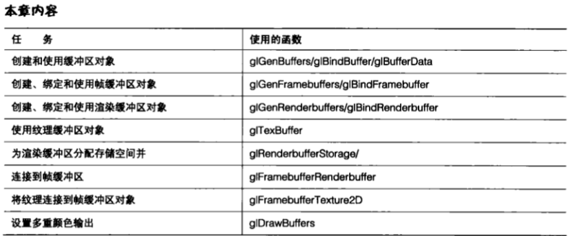

&emsp;&emsp;到目前为止，我们已经学习了 `OpenGL` 基础、如何指定几何图形、什么是着色器、如何使用纹理等。现在可以揭开我们应用程序的“盖子”,介绍更加快速灵活地进行渲染和移动数据的方法了。我们还将学习离屏渲染，以及如何创建和控制自己的帧缓冲区。

&emsp;&emsp;缓冲区对象是一个强大的概念,它允许应用程序迅速方便地将数据从一个渲染管线移动到另一个渲染管线,以及从一个对象绑定到另一个对象。我们的数据最终摆脱了强类型对象( `strongly typed object` )的束缚！我们不仅可以把数据移动到合适的位置，还可以在无需 `CPU` 介入的情况下完成这项工作。

&emsp;&emsp;帧缓冲区对象使我们获得了对像素的真正控制。我们不再受我们的环境所绑定到的操作系统窗口的限制。实际上,我们现在可以离屏对想要的任意数量的缓冲区进行渲染。不仅如此,我们还可以使用最适合我们需要的任意大小和格式的表面。现在片段着色器对哪些像素去哪里有了最终的控制权。

&nbsp;

## 8.1 缓冲区

&emsp;&emsp;`OpenGL 3.2` 并没有创建上百种不同类型的对象让开发者忙于记录哪个是哪个，而是对大多数保存数据的对象进行了归纳。现在可以分配任意多个我们需要的缓冲区,然后再决定之后如何使用它们。缓冲区有很多不同的用途,它们能够保存顶点数据、像素数据、纹理数据、着色器处理的输入,或者不同着色器阶段的输出。

&emsp;&emsp;缓冲区保存在 `GPU` 内存中，它们提供高速和高效的访问。在 `OpenGL` 有缓冲区对象之前，应用程序只有有限的选择可以在 `GPU` 中存储数据。另外,在GPU中更新数据常常需要重新加载整个对象。在系统内存和GPU内存之间来回移动数据可能是一个缓慢的过程。

&emsp;&emsp;首先让我们来看一看处理缓冲区对象的基础知识。随后，我们将了解对缓冲区中的数据进行访问的更高级方式,以及如何使用它们来达到不同的目的。

> 8.1.1 创建自己的缓冲区

&emsp;&emsp;创建一个新缓冲区非常简单,只需调用 `glGenBuffers` 来为我们所需任何数量的新缓冲区创建名称。实际缓冲区对象将在第一次使用时创建。

```C++
GLuint pixBuffObjs[1];
glGenBuffers(1, pixBuffObjs);
```

&emsp;&emsp;一旦有了新缓冲区的名称,我们就能将这个名称进行绑定来使用缓冲区了。

&emsp;&emsp;在 `OpenGL` 中有许多不同的绑定点( `binding point` ) ,每个绑定点都允许我们为了不同的目的而使用某个缓冲区。我们可以将每个结合点或绑定点看作一个在同一时刻只能结合一个对象的槽。表 `8.1` 列出了这些绑定点。稍后我们将更详细地讨论如何使用这些绑定。

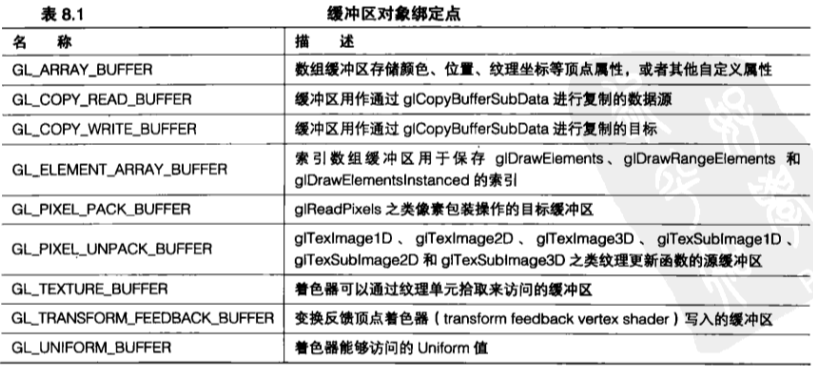

&emsp;&emsp;要绑定一个缓冲区以备使用，我们可以以这个缓冲区名称为参数，以表 `8.1` 中列出的缓冲区为目标来调用 `glBindBuffer` 。接下来我们将新的缓冲区绑定到像素包装缓冲区绑定点,这样就能使用 `glReadPixels` 将像素数据复制到缓冲区中了。

```C++
glBindBuffer(GL_PIXEL_PACK_BUFFER, pixBuffObjs[0]);
```

&emsp;&emsp;要从一个绑定中对一个缓冲解除绑定，我们可以再次调用以 `0` 为缓冲区名称、目标与上述调用相同的 `glBindBuffer` 。我们还可以只是将另外一个合法的缓冲区绑定到同一个目标上。

&emsp;&emsp;当我们用完一个缓冲区之后,这个缓冲区需要进行清除,就像所有其他 `OpenGL` 对象一样,通过调绑定点。用 `glDeleteBuffers` 来删除它。按照一般的做法,在进行删除之前,我们要确保缓冲区没有被绑定到任何绑定点。

```C++
glDeleteBuffers(1, pixBuffObjs);
```

> 8.1.2 填充缓冲区

&emsp;&emsp;创建和删除缓冲实际上是同一件事。但是，我们如何将合法的数据传递到缓冲区来使用它？将数据填充到缓冲区有很多种方法,其中一些更加复杂的我们将在后续章节中介绍。我们可以使用 `glBufferData` 函数来简单地将数据直接上传到任何类型的缓冲区中。

```C++
glBindBuffer(GL_PIXEL_PACK_BUFFER, pixBuffObjs[0]);
glBufferData(GL_PIXEL_PACK_BUFFER, pixelDataSize, pixelData, GL_DYNAMIC_COPY);
glBindBuffer(GL_PIXEL_PACK_BUFFER, 0):
```

&emsp;&emsp;在调用 `giBufferData` 之前，我们必须将要使用的缓冲区进行绑定。对 `glBufferData` 使用的目标与我们为第一个参数绑定缓冲区时使用的目标相同。第二个参数是我们将要上传的数据大小,以字节( `byte` )为单位,而第3个参数则是将要被上传的数据本身。请注意,如果我们想要分配一个特定大小的缓冲区却不需要立即对它进行填充，那么这个指针也可能是 `NULL` 。 `glBufferData` 的第 `4` 个参数用来告诉 `OpenGL` 我们打算如何使用缓冲区。

&emsp;&emsp;为使用方式选择正确的值需要一些小技巧。表 `8.2` 列出了可能使用方式的选项。使用方式的值实际上只是一个性能提示，来帮助`OpenGL` 驱动程序在正确的位置分配内存。例如，如果应用程序需要频繁地进行读取,那么某些能够很容易被 `CPU` 访问的内存将会是非常好的选择。而另外一些内存可能不能直接被CPU访问,但是可以被 `GPU` 很快地访问。提前将使用计划告诉 `OpenGL` 驱动程序,这样缓冲区就可以被分配在一个更便于我们使用的位置了。

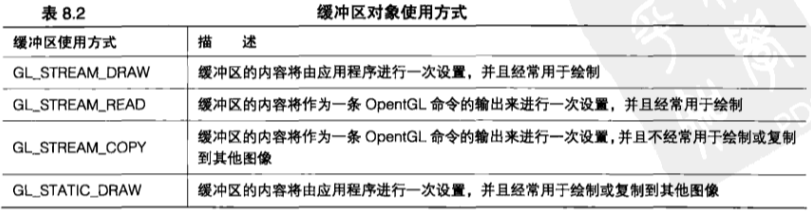<br>
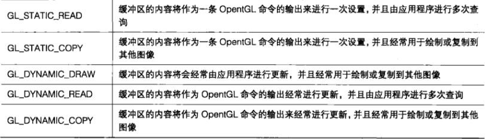<br>

&emsp;&emsp;在我们不确定缓冲区的用途时，对于通常的缓冲区使用方式或条件来说，使用 `GL_DYNAMIC_DRAW` 是一个比较安全的值。我们总是可以再次调用 `glBufferData` 对缓冲区重新进行填充,还可以改变使用方式的提示。但是如果我们真的再次调用了 `glBufferData` ,那么缓冲区中原来的所有数据都将被删除。

&emsp;&emsp;我们可以使用 `glBufferSubData` 对已经存在的缓冲区中的一部分进行更新，而不会导致缓冲区其他部分的内容变为无效。

```C++
void glBufferSubData(GLenum target, intptr offset, sizeiptr size, const void *data):
```

&emsp;&emsp;`glBufferSubData` 的大多数参数和 `glBufferData` 的相应参数相同。新的 `offset` 参数允许我们从除开头部分以外的其他位置开始更新。我们也不能改变缓冲区的使用方式，因为内存已经被分配了。

> 8.1.3 像素缓冲区对象

&emsp;&emsp;图形方面的许多最新和最重要的进步都与那些以更快和更高效的方式完成某些原有操作的新方法有关。在存储像素/纹理单元方面,像素缓冲区对象与纹理缓冲区对象非常相似。和所有缓冲区对象一样,它们都存储在GPU内存中。我们可以访问和填充像素缓冲区对象(或者缩写为 `PBO` ),方法和任何其他缓冲区对象类型一样。实际上，只有在绑定到一个 `PBO` 缓冲区绑定点时，一个缓冲区才真正成为一个像素缓冲区对象。

&emsp;&emsp;第一个像素缓冲区对象绑定点是 `GL_PIXEL_PACK_BUFFER` 。当一个像素缓冲区对象被绑定到这个目标上时,任何读取像素的 `OpenGL` 操作都会从像素缓冲区对象中获得它们的数据。这些操作包括 `glReadPixels` , `glGetTexImage` 和 `glGetCompressedTexImage` 。通常这些操作会从一个帧缓冲区或纹理中抽取数据，并将它们读回到客户端内存中。当一个像素缓冲区对象被绑定到包装缓冲区时，像素数据在 `GPU` 内存中的像素缓冲区对象中的任务就结束了，而并不会下载到客户端。

&emsp;&emsp;第二个 `PBO` 绑定点是 `GL_PIXEL_UNPACK_BUFFER`。 当一个像素缓冲区对象被绑定到这个目标时,任何绘制像素的 `OpenGL` 操作都会向一个绑定的像素缓冲区对象中放入它们的数据。

&emsp;&emsp;`glTexImage*D` , `glTexSubImage*D` , `glCompressedTexImage*D` 和 `glCompressedTexSubImage*D` 就是这样的操作。这些操作将数据和纹理从本地 `CPU` 内存中读取到帧缓冲区中。但是当一个像素缓冲区对象作为解包缓冲区被绑定时,会使读取操作成为 `GPU` 内存中而不是 `CPU` 内存中的 `PBO` 。

&emsp;&emsp;为什么要干涉这些像素缓冲区对象（ `PBO` ）呢？毕竟没有它们我们也可以在 `GPU` 中读、写和移动像素。对初学者来说,任何从 `PBO` 中读取或写入 `PBO` 中的调用或者任何缓冲区对象都用管线进行处理。这就意味着 `GPU` 不需要完成所有其他工作,只要对数据复制进行初始化,等待复制完成,然后继续运行就行了。

&emsp;&emsp;因为缓冲区对象没有这样的顺序问题,它们在处理需要经常访问、修改或更新像素数据有着巨大的优势。下面来看一些例子。

+ 流纹理更新—一在某些情况下，应用程序可能会需要在每一帧中都对一个纹理进行更新。也许需要根据用户输入来改变它，或者也可能会想要流视频。像素缓冲区对象允许应用程序改变纹理数据，而不必先下载然后再重新上传整个表面。
    
+ 渲染顶点数据——因为缓冲区对象是通用的数据存储，应用程序可以很容易地使用同一个缓冲区来达到不同的目的。例如，一个应用程序可以将顶点数据写入一个颜色缓冲区，然后再将这些数据复制到 `PBO` 。一旦完成，缓冲区就能够作为一个顶点缓冲区进行绑定，并且用来绘制新的几何图形。这种方式展示了灵活性，允许我们对新的顶点数据“染色”！
    
+ 异步调用 `glReadPixels` ——应用程序经常需要从屏幕上剥离像素，执行一些操作，然后或者保存它们，或者使用它们重新进行绘制。遗憾的是，将像素数据读取到 `CPU` 内存中需要 `GPU` 完成正在进行的其他所有工作,然后执行复制后,才能开始其他工作或者返回实际调用。如果未来的绘制调用要依赖读取或多次读取的结果呢?如果我们试图保持 `GPU` 忙于绘制所有 `3D` 图形,使用 `glReadPixels` 可以真正地解决问题。像素缓冲区对象( `PBO` )派上用场了。因为读取操作是通过管线进行的,所以对 `glReadPixels` 的调用能够立即返回。我们甚至可以进行多次调用,使用不同的缓冲区对象来读取不同的区域。

&emsp;&emsp;像素缓冲区对象是一个很好的容器,可以暂时存储 `GPU` 本地像素数据,但是请记住,在使用它们之前需要先为它们分配存储空间。和其他所有缓冲区对象一样,要调用 `glBufferData` 为这个缓冲区分配内存空间并用数据填充。但是,我们没有必要提供数据,为数据指针传递 `NULL` 可以简单地分配内存而不进行填充。如果我们试图填充存储空间之前不对它进行分配，那么 `OpenGL` 将抛出一个错误。

```C++
glBufferData(GL_PIXEL_PACK_BUFFER, pixelDataSize, pixelData, GL_DYNAMIC_COPY);
```

&emsp;&emsp;像素缓冲区经常用来存储来自一个渲染目标的 `2D` 图像、纹理或其他数据源。但是缓冲区对象本身是一维的,它们本质上没有宽度或高度。在为 `2D` 图像分配存储空间时,我们可以只是将宽度与高度相乘,再与像素大小相乘。对于存储像素数据没有其他需要补充的了,但是缓冲区可以比给定的数据组所需的大小更大。

&emsp;&emsp;实际上,如果我们计划为多种数据大小使用相同的 `PBO` ,最好马上关闭对数据大小上限的设定,而不是频繁地对它进行重新设定。

&emsp;&emsp;所有对 `glBufferData` 的调用都和其他的绘制调用一起通过管线进行处理。`OpenGL` 实现不需要等待所有活动停止，就可以将新数据发送到 `GPU` 。这一点在某些情况下可能尤其重要。

&emsp;&emsp;设想一下我们在玩喜爱的游戏时，在所有这些请况下都必须等待几分钟才能进入下一关，而这其中就有一部分时间是用来上传大量新的纹理数据的情况吧。或者想象一下在我们(在游戏中)进入一个新房间总要停顿一下,等待纹理数据更新的情况。`PBO` 能够以一种不拖延其他工作的方式在必要时提供纹理数据,这样可以帮助解决一些这类问题。

&emsp;&emsp;**从缓冲区中读取像素数据**

&emsp;&emsp;当绘制内容在屏幕上进行显示时,我们可能会需要在这些像素彻底消失之前再次取回。这样做的原因之一是检查实际的渲染情况,以便确定接下来在屏幕上如何进行渲染。另外一个原因则是在应用到后续帧的效果中使用前面帧的像素。无论是什么原因, `glReadPixels` 函数都能发挥作用。

```C++
void* data = (void*)malloc(pixelDataSize);
glReadBuffer(GL_BACK_LEFT);
glReadPixels(0, 0, GetWidth(), GetHeight(), GL_RGB, GL_UNSIGNED_BYTE, pixelData);
```

&emsp;&emsp;当我们向客户端内存进行写入时,整个管线经常需要被清空,以保证所有会影响我们将要进行读取的绘制工作能够完成。这对于应用程序性能可能会有很大的冲击。但是，值得庆幸的是，我们可以使用缓冲区对象来克服这种性能问题。在调用 `glReadPixels` 并将 `glReadPixels` 调用中的数据指针设为 `1` 之前,我们可以将一个缓冲区对象绑定到 `GL_PIXEL_PACK_BUFFER` 上。这样就能够将像素重定向到 GPU 中的一个缓冲区中，并且避免了复制到客户端内存上可能带来的性能问题。

```C++
glReadBuffer(GL_BACK_LEFT);
glBindBuffer(GL_PIXEL_PACK_BUFFER, pixBuffObjs[0]);
glReadPixels(0, 0, GetWidth(), GetHeight(), GL_RGB, GL_UNSIGNED_BYTE, NULL);
```

&emsp;&emsp;在我们的第一个示例应用程序中，这两种方法都得到了应用。

&emsp;&emsp;**使用PBO**

&emsp;&emsp;在应用程序中添加 `PBO` 可能很简单，但却能带来明显的性能提升。本章的第一个示例程序能够完成几项工作，但是更重要的是它能够演示 `PBO` 的真正效率。
    
&emsp;&emsp;运动模糊( `Motion blur` )是一种特效,它有助于显示出一个场景中哪些对象是运动的,以及它们运动得有多快。我们可能已经在电影、电视或视频中见过这些模糊的对象了。当一个物体以一个相对于单帧快门速度来说过高的速度经过照像机时,这一帧和相邻帧的图片上就会沿着运动的方向出现一片模糊的痕迹。在照相机相对于一个对象或者整个场景快速移动时也会出现同样的效果。想象一下在高速公路上行驶的汽车中一位乘客从汽车中向侧面拍摄照片的场景吧。

&emsp;&emsp;在 `OpenGL` 中有很多复杂的方法可以用来创建这样的效果。有一个应用程序可以在一个缓冲区中进行多次渲染,将快速移动的对象稍稍进行偏移并将得到的结果混合到一起。另一个选择是为一个物体的图像沿着运动方向对纹理单元像素数据进行多次采样,然后将采样结果混合到一起。甚至还有更加复杂的方法，使用深度缓冲区数据对更加靠近照相机的对象应用更加戏剧性的模糊效果。
    
&emsp;&emsp;对于示例应用程序来说,我们使用另一种简单的方法,将前面帧的结果进行存储并与当前帧混合到一起。为了创建可视的运动模糊,这个程序将会存储最后的 `5` 帧图像。这个程序既可以使用老式的方式将数据复制到 `CPU` 中再复制出来，也可以使用更快的 `PBO` 方式。

```C++
// 创建模糊纹理
glGenTextures(6, blurTextures);

//分配一个像素缓冲区来对纹理和PBO进行初始化
pixelDataSize = GetWidth() * GetHeight() * 3 * sizeof(unsigned byte);
void* data = (void*)malloc(pixelDataSize);
memset(data, Ox00, pixelDataSize);

// 为模糊特效设置 6 个纹理单元初始化纹理数据
for (int i = 0; i < 6; i++)
{
    glActiveTexture(GL_TEXTURE1 + i);
    glBindTexture(GL_TEXTURE_2D, blurTextures[i]);
    glTexParameteri(GL_TEXTURE_2D, GL_TEXTURE_WRAP_S, GL_CLAMP_To_EDGE);
    glTexParameteri(GL_TEXTURE_2D, GL_TEXTURE_WRAP_T, GL_CLAMP_TO_EDGE);
    glTexParameteri(GL_TEXTURE_2D, GL_TEXTURE_MIN_FILTER, GL_LINEAR);
    glTexParameteri(GL_TEXTURE_2D, GL_TEXTURE_MAG_FILTER, GL_LINEAR);
    glTexImage2D(GL_TEXTURE_2D, 0, GL_RGB, GetWidth(), GetHeight (), O, GL_RGB, GL_UNSIGNED_BYTE, data);
}

//为像素的复制分配空间,以免我们在每次进行绘制时都调用函数原形
glGenBuffers(1, pixBuffObjs);
glBindBuffer(GL_PIXEL_PACK_BUFFER, pixBuffObjs[0])
glBufferData(GL_PIXEL_PACK_BUFFER, pixelDataSize, pixelData, GL_DYNAMIC_COPY);
glBindBuffer(GL_PIXEL_PACK_BUFFER, 0);
```

&emsp;&emsp;当所有的资源都设置完成后,场景将被渲染到后台缓冲区,就好像没发生什么特别的事情一样。得到的结果将被复制到一个用于模糊特效的纹理中,而不是简单地调用交换。在传统的方式中,这些工作是通过调用 `glReadPixels`来获取像素数据,然后调用 `glTexImage2D` 将像素数据复制到一个纹理对象上完成。数据的纹理目标将在 `6` 个模糊纹理之间进行轮换。如果上一次使用的是纹理 `3` ,那么接下来用的将是纹理 `4` 。这就意味着纹理 `4` 将包含来自这一帧的数据,纹理 `3` 包含来自上一帧的数据,而纹理`2`则包含来自再前面一个帧的数据,以此类推。在使用最后一个纹理之后,当前帧的目标将再次进行循环。最后 `6` 个帧的纹理数据在这个“纹理环缓冲区” ( `texture ring buffer` )中总是按顺序排列并且是可用的。
    
&emsp;&emsp;`PBO` 方式则稍有不同。在这种方式下,我们不是将数据复制回 `CPU` ,而是将 `PBO` 绑定到 `GL_PIXEL_PACK_BUFFER` ,而在调用 `glReadPixels` 时,这些像素将被重新定向到 `PBO` 而不是再次回到 `CPU` 。然后，同一个缓冲区将从 `GL_PIXEL_PACK_BUFFER` 绑定点上解除绑定，然后再绑定到 `GL_PIXEL_UNPACK_BUFFER` 。在接下来调用 `glTexImage2D` 时,缓冲区中的像素数据将被加载到纹理上,它们不会离开 `GPU` ，也不会与其他命令一起保持在管线中。
    
&emsp;&emsp;我们可以在程序清单 `8.2` 中看到这个处理过程。最后，这个环形缓冲区将进行更新，指向下一个模糊

```C++
if (bUsePBOPath)
{
    // 首先将 PBO榜定为包装缓冲区
    // 然后直接将像素读取到 PBO
    glBindBuffer(GL PIXEL PACK BUFFER, pixBuffObjs[0]);
    glReadPixels(0, 0, GetWidth(), GetHeight(), GL_RGB, GL_UNSIGNED_BYTE, NULL);
    glBindBuffer(GL_PIXEL_PACK_BUFFER, 0);
    
    // 接下来将PBO榜定为解包缓冲区
    // 然后直接将像素读取到 PBO,然后直接将像素放入纹理中
    glBindBuffer(GL_PIXEL_UNPACK_BUFFER, pixBuffObjs[0]);
    
    // 为新的模糊设置纹理,每一帧都有增加
    glActiveTexture (GL_TEXTURE0 + GetBlurTarget0()); 
    glTexImage2D(GL_TEXTURE_2D, 0, GL_RGB8, Getwidth(), GetHeight(), 0, GL RGB, GL UNSIGNED BYTE, NULL);
    glBindBuffer(GL_PIXEL_UNPACK_BUFFER, 0)
}
else
{
    // 获取屏幕像素并复制到客户端内存
    glReadPixels(0, 0, GetWidth(), GetHeight(), GL_RGB, GL_UNSIGNED_BYTE, pixelData);
    // 将像素从客户端内存中移到纹理中
    // 为新的模糊设置纹理单元,每一帧都有增加
    glActiveTexture(GL_TEXTURE0 + GetBlurTarget0());
    glTexImage2D(GL_TEXTURE_2D, 0, GL_RGB8, GetWidth(), GetHeight(), 0, GL_RGB, GL_UNSIGNED_BYTE, pixelData);
}

//使用模糊着色器和所有模糊纹理进行全房绘制
projectionMatrix.PushMatrix();
    projectionMatrix.LoadIdentity();
    projectionMatrix.LoadMatrix(orthoMatrix);
    modelViewMatrix.PushMatrix();
        modelViewMatrix.LoadIdentity();
        glDisable(GL_DEPTH_TEST);
        SetupBlurProg(); // 这个程序将所有纹理一起进行模糊
        screenQuad.Draw();
        glEnable(GL_DEPTH_TEST);
    modelViewMatrix.PopMatrix();
projectionMatrix.PopMatrix();

// 为下一帧转向下一个模糊纹理
AdvanceBlurTarget();
```

&emsp;&emsp;为了进行实际的模糊操作,片段着色器将从所有 `6` 个纹理中进行采样并对结果进行平均。已经给定所有纹理大小都相同,并且需要与其他纹理进行排列,因此片段着色器只需要一组纹理坐标。程序清单 `8.3` 显示了完成所有 `6` 个纹理采样的着色器代码。这个着色器用于对屏幕对齐的四边形进行渲染,这些四边形是通过建立一个基于窗口宽度和高度的正模型视图投影矩阵进行设置的。正交矩阵创建一个变换,将坐标直接映射到屏幕空间。我们在几何图形 `×` 坐标上每增加一个单位,就要向屏幕右方多移动一个像素。在 `y` 方向向上移动一个单位,相当于在屏幕上向上移动一个像素。结果得到的是 `2D` 渲染,几何图形的坐标也是屏幕上的像素位置。

```C++
#version 150
in vec2 vTexCoord;

uniform sampler2D textureUnit0;
uniform sampler2D textureUnit1;
uniform sampler2D textureUnit2;
uniform sampler2D textureUnit3;
uniform sampler2D textureUnit4;
uniform sampler2D textureUnit5;

void main (void)
{
    // 0 是最新的图像，而5是最老的
    vec4 blur0 texture(textureUnit0, vTexCoord);
    vec4 blur1 texture(textureUnit1, vTexCoord);
    vec4 blur2 texture(textureUnit2, vTexCoord);
    vec4 blur3 texture(textureUnit3, vTexCoord);
    vec4 blur4 texture(textureUnit4, vTexCoord);
    vec4 blur5 texture(textureUnit5, vTexCoord);
    vec4 summedBlur = blur0 + blur1 + blur2 +blur3 + blur4 + blur5; gl_FragColor » summedBlur/6.0;
}
```

&emsp;&emsp;在第一次启用 `pix_buffs` 时，程序将使用客户端内存路径来加载混合纹理。在对象从一端到另一端移动时，请注意混合是如何只出现在运动的轴上的。我们可以在图 `8.1` 所示看到这种效果，并且在彩图 `11` 中也进行了展示。按P键可以开启和关闭 `PBO` 路径。我们可以使用数字键盘上的+键和-键来对物体的运动进行加速和减速。在速度改变时,注意运动模糊的量是如何随之改变的。

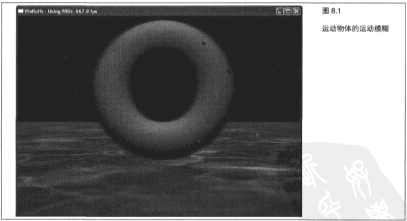

&emsp;&emsp;这个程序的速度显示在了标题栏上。请注意客户端复制和 `PBO` 复制之间的性能差异——差异非常大！在较慢的系统中，`PBO` 的路径几乎比客户端内存路径快 `6` 倍。我们多希望程序运行速度能够快 `6` 倍啊！请注意将数据进行移动是如何帮助实现这一点的。巨大的性能提升是缓冲区对象现在成为 `OpenGL` 程序的重要部分的原因之一。
    
&emsp;&emsp;当切换到 `PBO` 路径时,模糊的量减少了。发生这种情况是因为采样程序使用最后 `5` 帧来创建混合的输出,无论程序的运行速度多快。在使用 `PBO` 时,最后 `5` 帧看起来互相靠近了很多(因为更快的渲染速度允许更高的帧速率),也就产生了更少的模糊。让我们看一看图 `8.2` ,可以尝试修改程序,为 `PBO` 路径创建更多的模糊,或者修改程序使模糊无论在选择什么路径时都是相同的。
    
&emsp;&emsp;另外一种很好的实践是尝试不同的应用运动模糊的方法，或者在对帧纹理进行组合时使用加权值。

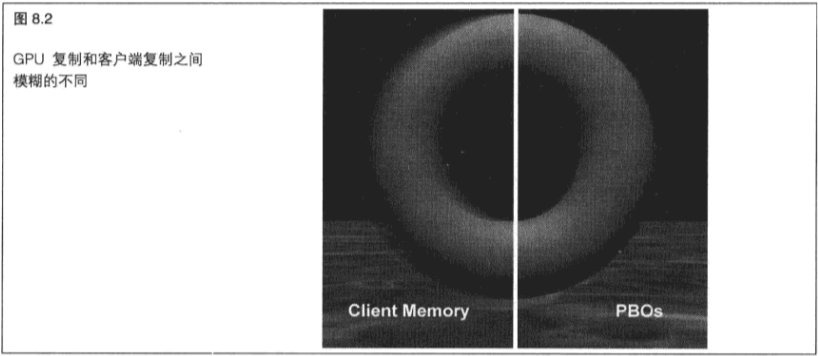

> 8.1.4 缓冲区对象

&emsp;&emsp;我们已经了解了某些缓冲区绑定目标(如 `GL_PIXEL_PACK_BUFFER` 和 `GL_COPY_READ_BUFFER` )是如何应用于从一个缓冲区(当它在 `GPU` 中时)中更新或获取数据的。其他缓冲区绑定诸如 `GL_TEXTURE_BUFFER` , `GL_TRANSFORM_FEEDBACK_BUFFER` 和 `GL_UNIFORM_BUFFER` 允许缓冲区在渲染管线中直接进行使用。这些绑定点中有一些将在随后几章中进行探索,但是现在,让我们先来看一看缓冲区对象是如何在纹理上直接使用的。

&emsp;&emsp;一个纹理包含两个主要组成部分：纹理采样状态和包含纹理值的数据缓冲区。现在我们也可以将一个缓冲区对象绑定到 `GL_TEXTURE_BUFFER` 缓冲区中一个纹理的绑定点。读者可能会问: “为什么还要进行另外的纹理绑定?"这是一个很好的问题!纹理缓冲区也称为 `texBO` 或 `TBO` ,允许我们完成一些传统纹理不能完成的工作。首先，纹理缓冲区能够直接填充来自其他渲染结果(例如变换反馈、像素读取操作或顶点数据)的数据。这样就节省了不少时间,因为应用程序能够直接从着色器以前的渲染调用中获取像素数据。

&emsp;&emsp;`texBO` 的另一个特性是宽松的大小限制。纹理缓冲区与传统的一维纹理相似,但要更大。`OpenGL` 规范所规定的纹理缓冲区大小的最大值比 `1D` 纹理大64倍,但是在某些实现中纹理缓冲区的大小可能要大几万倍！

&emsp;&emsp;那么有了这些 `texBO` 我们能做什么呢？对于初学者来说，所有类型的着色器数学运算都曾经非常困难(如果不是不可能的话)。 `TexBO` 向着色器提供了大量对多种不同格式和类型的数据访问,允许着色器以通常是预留给 `CPU` 的方式进行操作。纹理缓冲区能够用来提供对片段着色器和顶点着色器中的顶点数组的访问。这在着色器需要关于临近几何图形的信息以作出运行时决策和计算的情况下可能会非常有用。但是为了做到这一点,我们常常需要将 `texBO` 大小作为一个统一值传递到着色器中。

&emsp;&emsp;纹理缓冲区是作为普通的缓冲区来创建的,当它被绑定到一个纹理或者 `GL_TEXTURE_BUFFER` 绑定点时会成为真正的纹理缓冲区。

```C++
glBindBuffer(GL_TEXTURE_BUFFER, texBO[0]); 
glBufferData(GL_TEXTURE_BUFFER, sizeof(float) * count, fileData, GL_STATIC_DRAW);
```

&emsp;&emsp;但是 `texBO` 必须绑定到一个纹理单元上才能真正变得有用。要将一个 `texBO` 绑定到一个纹理上，可以调用  `glTexBuffer` ，但首先要确保要使用的纹理已经进行了绑定。

```C++
glActiveTexture(GL_TEXTURE1);
glBindTexture(GL_TEXTURE_BUFFER, texBOTexture);
glTexBuffer(GL_TEXTURE_BUFFER, GL_R32F, texBO[0]);
```

&emsp;&emsp;虽然纹理缓冲区对象看起来和操作起来都很像普通纹理,但是还有一些重要的不同点。纹理缓冲区不能在着色器中用普通的采样器--也就是 `sampler1D` 和 `sampler2D` 进行访问。取而代之的是,我们必须使用一个新的采样器,叫做 `samplerBuffer` 。因为采样器类型不同,用来从纹理缓冲区中获取值的采样函数也不相同。我们可以使用 `texelFetch` 从纹理缓冲区进行读取。

```C++
uniform samplerBuffer lumCurveSampler;
void main(void)
{
    int offset = int(vColor.r (1024-1));
    lumFactor.r = texelFetch(lumCurveSampler, offset ).r;
}
```

&emsp;&emsp;当着色器在一个纹理缓冲区中进行查询时,它必须使用一个基于整数的非标准化索引。诸如 `texture` 这样的传统采样函数接受的坐标范围为从 `0.0` 到 `1.0` ,但是 `texBO` 查询函数t `texelFetch` 则接受一个从 `0` 到缓冲区大小值的整数索引。如果纹理查询坐标已经进行了标准化,那么我们可以通过乘以 `texBO` 的大小值减去 `1` 的结果，然后再将得到的结果转化为整数的方式转换成索引。

&nbsp;

## 8.2 帧缓冲区对象

&emsp;&emsp;在大多数人提起 `3D` 渲染时,首先想到的第一件事就是一个 `3D` 游戏或者计算机辅助设计程序的屏幕输出内容,毕竟观看互动的3D输出结果正是大多数使用者所追求的。但是,除了渲染到窗口或者渲染到全屏之外, `OpenGL` 还允许我们去做很多事情。一个 `OpenGL` 窗口的表面长期以来一直被称作“帧缓冲区"。但是现在 `OpenGL` 将绘制帧缓冲区到一个对象所需要的状态进行了封装,称为帧缓冲区对象( `FBO` )。

&emsp;&emsp;默认的帧缓冲区对象是与创建的 `OpenGL` 窗口相关联的,并且在一个新的环境被绑定时自动进行绑定。我们可以创建多个帧缓冲区对象,也叫做 `FBO` ,并且直接渲染一个FBO而不是窗口。使用这种离屏渲染,应用程序就可以执行许多不同种类的渲染算法了,例如阴影贴图、应用辐射着色( `radiosity` )、反射、后期处理和许多其他特效。另外,帧缓冲区对象并不受窗口大小的限制,它可以包含多个颜色缓冲区。我们甚至可以将纹理绑定到一个 `FBO` 上,这就意味着可以直接渲染到一个纹理中。

&emsp;&emsp;虽然帧缓冲区的名称中包含一个“缓冲区”字眼,但是其实他们根本不是缓冲区。实际上,并不存在与一个帧缓冲区对象相关联的真正内存存储空间。相反,帧缓冲区对象是一种容器,它可以保存其他确实有内存存储并且可以进行渲染的对象,例如纹理或渲染缓冲区。采用这种方式,帧缓冲区对象能够在保存 `OpenGL` 管线的输出时将需要的状态和表面绑定到一起。

> 8.2.1 如何使用 FBO

&emsp;&emsp;创建和设置一个新的 `FBO` 非常简单,但是别忘了 `FBO` 只是一个图像对象的容器。所以在需要先添加图像,才能渲染到一个 `FBO` 。一旦一个 `FBO` 被创建、设置和绑定,大多数 `OpenGL` 操作就将像是在渲染到一个窗口一样执行，但是输出结果将存储在绑定到  `FBO` 的图像中。

&emsp;&emsp;**创建新的 FBO**

&emsp;&emsp;要创建 `FBO`,首先要生成 `FBO` 缓冲区名称。我们可以同时生成任意数量的名称。
    
```C++
GLuint fboName;
glGenFramebuffers(1, &fboName);
```
    
&emsp;&emsp;然后再绑定一个新的 `FBO` 来修改和使用它。
    
```C++
glBindFramebuffer(GL_DRAW_FRAMEBUFFER, fboName);
```

&emsp;&emsp;同一时间只有一个 `FBO` 可以绑定用来进行绘制,并且同一时间只有一个 `FBO` 可以绑定来进行读取。在绑定一个帧缓冲区时,  `glBindFramebuffer` 的第一个参数既可以是 `GL_DRAW_FRAMEBUFFER` ,也可以是 `GL_READ_FRAMEBUFFER` 。这就意味着我们可以使用一个帧缓冲区进行读取，而使用另一个不同的缓冲区进行绘制。在本章的第一个程序中,我们就看到了一个例子。将名称 `0` 绑定到任意一个 `FBO` 目标,都会将当前的缓冲区解除绑定,并再次绑定到默认FBO。一旦默认 `FBO` 被绑定,那么读取和写入就都再次绑定到了窗口的帧缓冲区。

&emsp;&emsp;**销毁 FBO**

&emsp;&emsp;在使用完 `FBO` ，或者在退出前进行清除时，要删除 `FBO` 。
    
```C++
glDeleteFramebuffers(1, &fboName);
```

> 8.2.2 渲染缓冲区对象

&emsp;&emsp;现在我们可以与 `FBO` 进行交互了,我们需要将一些东西放到 `FBO` 中。渲染缓冲区对象，或者简称 `RBO`,是一种图像表面,它是专门为了绑定到 `FBO` 而设计的。一个渲染缓冲区对象可以是一个颜色表面、模板表面或者深度/模板组合表面。我们可以为给定的 `FBO` 挑选需要的任意 `RBO` 组合。实际上,我们甚至可以一次性绘制很多个颜色缓冲区！创建 `RBO` 和创建 `FBO` 以及大多数其他 `OpenGL` 对象非常类似。

```C++
glGenRenderbuffers(3, renderBufferNames);
```

&emsp;&emsp;和 `FBO` 类似，`RBO` 需要先进行绑定才能修改。绑定渲染缓冲区的唯一合法目标是 `GL_RENDERBUFFER` 。

```C++
glBindRenderbuffer(GL_RENDERBUFFER, renderBufferNames[0]);
```

&emsp;&emsp;现在 `RBO` 已经绑定，需要分配支持 `RBO` 的内存空间。RBO 在创建时是没有初始存储的。没有存储，我们就没有任何东西可渲染。

&emsp;&emsp;首先,我们要确定应用程序需要什么。然后,选择合适的格式,使其与缓冲区的用途相匹配。大多数合法的纹理格式同时也是合法的渲染缓冲区格式。另外，我们可以创建包含一个模板格式的渲染缓冲区存储。纹理可以有一个 `DEPTH_STENCIL` 组合格式，但不只是一个模板格式。

```C++
glBindRenderbuffer(GL_RENDERBUFFER, renderBufferNames[0]);
glRenderbufferStorage(GL_RENDERBUFFER, GL_RGBA8, screenWidth, screenHeight);
glBindRenderbuffer(GL_RENDERBUFFER, depthBufferName);
glRenderbufferStorage(GL_RENDERBUFFER, GL_DEPTH_COMPONENT32, screenWidth, screenHeight);
```

&emsp;&emsp;在前面的示例中, `RBO` 存储被分配了与示例程序窗口相同的大小。但是,渲染缓冲区的大小其实不必与窗口相同。我们可以通过调用以 `GL_MAX_RENDERBUFFER_SIZE` 为参数的 `glGetIntegerv` 来查询 `OpenGL` 实现所支持的最大维度,宽度和高度值必须小于这个最大值。创建存储的唯一有效目标是`GL_RENDERBUFFER`。

&emsp;&emsp;我们还可以使用一个类似的函数 `glRenderbufferStorageMultisample` 来创建多重采样的渲染缓冲区存储,这个函数接受一个附加的采样变量。这样做的好处是，可以在任何像素显示在屏幕上之前进行离屏多重采样。

&emsp;&emsp;**绑定 RBO**

&emsp;&emsp;一旦我们为 `FBO` 创建了所有的渲染表面，就到了将它们衔接起来的时候了。一个帧缓冲区有多个绑定点可以进行绑定:一个深度绑定点、一个模板绑定点,以及多个颜色绑定点。我们可以使用 `glGetIntegerv` 查询 `GL_MAX_COLOR_ATTACHMENTS` ，来查出一次可以绑定多少颜色缓冲区。在示例应用程序中，一次就使用了一个深度缓冲区和3个颜色缓冲区。在试图绑定一个渲染缓冲区之前，要确保 `FBO` 已经被绑定。
    
```C++
glBindFramebuffer(GL_DRAW_FRAMEBUFFER, fboName);
glFramebufferRenderbuffer(GL_DRAW_FRAMEBUFFER, GL_DEPTH_ATTACHMENT, GL_RENDERBUFFER, depthBufferName);
glFramebufferRenderbuffer(GL_DRAW_FRAMEBUFFER, GL_COLOR_ATTACHMENTo,GL_RENDERBUFFER, renderBufferNames[0]);
glFramebufferRenderbuffer(GL_DRAW_FRAMEBUFFER, GL_COLOR_ATTACHMENT1,GL_RENDERBUFFER, renderBufferNames[1]);
glFramebufferRenderbuffer(GL_DRAW_FRAMEBUFFER, GL_COLOR_ATTACHMENT2,GL_RENDERBUFFER, renderBufferNames[2]);
```
    
&emsp;&emsp;第一个参数可以是 `GL_DRAW_FRAMEBUFFER` 或 `GL_READ_FRAMEBUFFER` ,这取决于我们将 `FBO` 绑定到了哪里，然后再指定绑定点。第 `3` 个参数总是 `GL_RENDERBUFFER` ，而最后一个参数则是将要使用的着色器缓冲区名称。
    
&emsp;&emsp;如果我们以 `0` 为名称调用了 `glFramebufferRenderbuffer` ,那么无论绑定到当前 `FBO` 指定绑定点的是何种缓冲区，它都将被解除绑定。有一个特殊的绑定点 `GL_DEPTH_STENCIL_ATTACHMENT` ，它允许我们将同一个缓冲区同时绑定到深度绑定点和模板绑定点。要使用这个绑定点，我们需要创建一个带有内部 `GL_DEPTH_STENCIL` 格式的 `RBO` 。
    
&emsp;&emsp;除非我们突然出现了什么疯狂的想法,否则就无法改变默认帧缓冲区的绑定。同样也不能将默认帧缓冲区的一个表面绑定到用户生成的帧缓冲区上。
    
&emsp;&emsp;**RBO 大小**

&emsp;&emsp;帧缓冲区对象在衔接上有着惊人的灵活性。我们可以将不同颜色格式的渲染缓冲区绑定到同一个帧缓冲区上。实际上,我们甚至可以将不同大小的 `RBO` 绑定到同一个帧缓冲区上。如果我们的 `RBO` 确实大小不同,那么只能渲染到一个大小为最小缓冲区的矩形上。这种灵活性比我们想象中更加有用。例如，深度缓冲区可能占据一定的空间。如果我们有多重 `FBO` 或多重缓冲区需要进行深度测试，那么可以创建一个深度缓冲区，并在所有 `FBO` 或者渲染传递中使用它,在每次使用的间隔清除深度值。我们要做的就是确保分配一个深度格式 `RBO` ，它要足够大，足以容纳最大的 `FBO` 配置。

> 8.2.3 绘制缓冲区

&emsp;&emsp;现在我们已经知道了如何将整个批次的渲染缓冲区绑定到一个帧缓冲区，最好确保它们都能够立即使用!要获得对渲染缓冲区的访问,有两个重要步骤。第一步是确保片段着色器设置正确,第二步是确保输出被引导到正确的位置。

&emsp;&emsp;**着色器输出**

&emsp;&emsp;为了将颜色输出到多个缓冲区,着色器必须配置为写入多重颜色输出( `write multiple color outputs` ) 。更好的情况是,写入到每个缓冲区的值可以是不同的,否则还有什么意义呢?从着色器写入颜色输出的一种方法是写入到名为 `gl_FragData[n]` 的内建输出中。但是我们不能在同一个着色器中使用 `gL_FragData[n]` 和 `gl_FragColor` , `n` 的值是着色器的输出索引。程序清单 `8.4` 完整地列出了第一个采样程序的片段着色器。这里使用了 `3` 个颜色输出，其中每个输出都使用了一种各不相同的着色技术。

```C++
#version 150

in vec4 vFragColor;
in vec2 vTexCoord;

uniform sampler2D textureUnit0; 
uniform int bUseTexture;
uniform samplerBuffer lumCurveSampler;

void main(void)
{
    vec4 vColor;
    vec4 lumFactor;
    if (bUseTexture != 0) 
        vColor = texture(textureUnit0, vTexCoord); 
    else 
        vColor = vFragColor;
        
    // 对第一个缓冲区进行原样输出
    gl_FragData[0] = vColor;
    
    // 对第二个缓冲区进行灰度輸出
    float grey = dot(vColor.rgb, vec3(0.3, 0.59, 0.11));
    gl_FragData[1] = vec4(grey, grey, grey, 1.0f);
    
    // 对输入颜色进行截取，确保它的值在 0.0 和 1.0 之间
    vColor = clamp(vColor, 0.0f, 1.0f);
    
    int offset = int(vColor.r* (1024 - 1));
    lumFactor.r = texelFetch(lumCurveSampler, offset ).r; 
    
    offset = int(vColor.g * (1024 - 1)); 
    lumFactor.g = texelFetch(lumCurveSampler, offset).r
    
    offset = int(vColor.b * (1024 - 1));
    lumFactor.b = texelFetch(lumCurveSampler, offset).r;
    
    lumFactor.a = 1.0f;
    gl_FragData[2] = lumFactor;
}
```

&emsp;&emsp;**缓冲区映射**

&emsp;&emsp;现在大家已经了解了着色器将要写入什么样的输出,我们需要告诉 `OpenGL` 要输出到哪里。我们已经看到了多重缓冲区是如何绑定到一个 `FBO` 的，以及着色器是如何写入到不同的输出索引的。 `OpenGL` 允许一个应用程序通过为每个缓冲区指定颜色绑定来将着色器输出映射到不同的 `FBO` 缓冲区。
    
&emsp;&emsp;默认的行为是一个单独的颜色输出将被发送到颜色绑定 `0` 。如果不告诉 `OpenGL` 如何处理着色器输出,那么只有第一个输出被路由通过,即使我们有多个着色器输出和多个颜色缓冲区绑定到帧缓冲区对象上也是如此。
    
&emsp;&emsp;我们可以通过调用 `glDrawBuffers` 来对着色器输出进行路由(`route`)。这将覆盖以前所有的映射,即使指定的映射比上一次少时也是如此。
    
```C++
GLenum fboBuffs[] = {   GL_COLOR_ATTACHMENT0,
                        GL_COLOR_ATTACHMENT1, 
                        GL_COLOR_ATTACHMENT2 };
glDrawBuffers(3, fboBuffs);
```

&emsp;&emsp;第二个参数是指向一个 `GLenum` 数组的指针,这个数组指定了着色器输出索引值将要路由到的颜色绑定。图 `8.3` 所示展示了着色器输出是如何映射到实际缓冲区的。数组的索引会被传递到着色器输出索引对应的 `glDrawBuffers` 。大多数情况下我们可能只想要一个一对一的映射，其中着色器输出的索引与颜色绑定的偏移量相等。

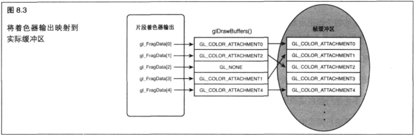

&emsp;&emsp;我们仍然要在调用 `glDrawBuffers` 之前确保 `FBO` 已经被绑定。如果在一个由用户创建的 `FBO` 被绑定的情况下使用  `glDrawBuffers` ,那么合法的缓冲区目标为从 `GL_COLOR_ATTACHMENT0` 到" `1` 减去最大值”的结果,或者为 `GL_NONE` 。但是如果默认的 `FBO` 被绑定,那么可以使用与窗口相关联的颜色缓冲区名称,最普遍的是 `GL_BACK_LEFT` 。请注意,无论使用的 `FBO` 是何种类型,在数组中除 `GL_NONE` 以外的值最多只能使用一次。如果默认帧缓冲区被绑定,或者着色器程序写入到 `gl_FragColor` ,那么我们传递到 `glDrawBuffers` 的所有缓冲区都会获得相同的颜色。不要忘记在使用完 `FBO` 之后恢复绘制缓冲区的设置，否则将会产生 `GL` 错误。
    
```C++
GLenum windowBuff [] = { GL_FRONT_LEFT };
glDrawBuffers(1,windowBuff);
```
    
&emsp;&emsp;当然,我们没有理由一定要将来自 `gl_FragData[0]` 的颜色输出映射到 `GL_COLOR_ATTACHMENT0` 。我们可以以我们希望的方式进行混合,或者如果不需要片段着色器的某个输出的话,可以在绘制缓冲区列表设置一个到 `GL_NONE` 的入口。在如图 `8.3` 所示的示例映射中,第一个着色器输出被路由到第一个 `FBO` 颜色缓冲区绑定,而第二个着色器输出则被路由到第 `3` 个颜色缓冲区绑定。第 `3` 个着色器没有被路由到任何缓冲区,而第4个颜色缓冲区没有接受任何着色器输出。我们可以通过giDrawBuffers设置一个映射数量的限制值。我们可以通过调用以 `GL_MAX_DRAW_BUFFERS` 为参数的 `glGetIntegerv` 查询支持的最大映射数。
    
&emsp;&emsp;使用 `glDrawBuffers` 来选择着色器将要写入的缓冲区对于读取缓冲区绑定来说没有任何影响。我们可以通过调用 `glReadBuffer` 设置读取缓冲区,其值与 `glDrawBuffers` 中使用的值相同。

> 8.2.4 帧缓冲区的完整性

&emsp;&emsp;在使用完帧缓冲区对象之后，还有最后一个重要的主题。我们对设置 `FBO` 的方式很满意并不意味着 `OpenGL` 实现已经做好了进行渲染的准备。查明我们的 `FBO` 是否已经正确设置,并且实现可以通过某种方式来使用它的唯一方法就是检查帧缓冲区的完整性。帧缓冲区的完整性在概念上与纹理的完整性类似。如果一个纹理没有包含所有的大小、格式等都正确的指定 `Mip` 贴图层次,那么这个纹理就是不完整的,也就无法使用。完整性有两种类型:绑定完整性和整个帧缓冲区的完整性。

&emsp;&emsp;**绑定完整性**

&emsp;&emsp;一个 `FBO` 的每个绑定点都必须符合某种被认为是完整的标准。如果任意一个绑定点是不完整的，那么整个帧缓冲区也将是不完整的。部分导致绑定不完整的情况如下。
    
+ 没有任何图像关联到绑定的对象。绑定图像的宽度或者高度为 `0` 。
    
+ 一个不能进行颜色渲染的格式被绑定到一个颜色绑定上。
    
+ 一个不能进行深度渲染的格式被绑定到一个深度绑定上。
    
+ 一个不能进行模板渲染的格式被绑定到一个模板绑定上。
    
&emsp;&emsp;**帧缓冲区的整体完整性**
    
&emsp;&emsp;不只是每个绑定点都必须有效并且符合特定标准，帧缓冲区对象作为一个整体也必须是完整的。默认的帧缓冲区(如果存在的话)总是完整的。整个帧缓冲区不完整的情况如下。
    
+ 没有任何图像被绑定到镇缓冲区。
    
+ `glDrawBuffers` 被映射到一个没有任何图像进行绑定的 `FBO` 绑定。
    
+ 内部格式的组合不被支持。

&emsp;&emsp;**检查帧缓冲区**

&emsp;&emsp;当我们认为已经完成了 `FBO` 设置时，可以调用：
    
```C++
GLenum fboStatus = glCheckFramebufferStatus(GL_DRAW_FRAMEBUFFER);
```

&emsp;&emsp;来检查它是否完整。

&emsp;&emsp;如果 `glCheckFramebufferStatus` 返回 `GL_FRAMEBUFFER_COMPLETE` ，那么一切正常，我们可以使用 `FBO` 了。返回值 `glCheckFramebufferStatus` 则会提示哪里出了问题,导致帧缓冲区不完整。表 `8.3` 描述了所有可能的返回条件和它们的意义。

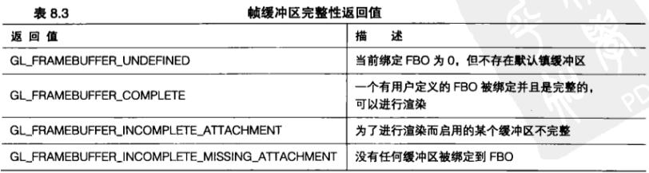<br>
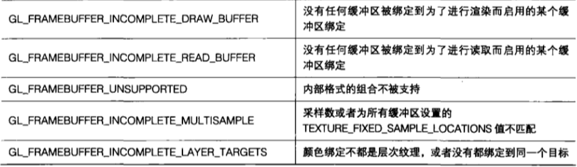<br>

&emsp;&emsp;这些返回值中有很多在进行排错调试时都很有用，但在应用程序发布之后用处就不大了。无论如何，第一个示例应用程序还是进行检查来确保不出现上述那些情况框。在使用FBO的应用程序中进行这些检查是值得的,可以确保我们的用例不会超出某些与实现相关的限制。
    
&emsp;&emsp;下面的代码就是一个这方面的例子。

```C++
GLenum fboStatus glCheckFramebufferStatus(GL_DRAW_FRAMEBUFFER);
if(fboStatus !- GL_FRAMEBUFFER_COMPLETE)
{
    switch (fboStatus)
    {
        case GL_FRAMEBUFFER UNDEFINED:
            // 哎呀，没有窗口？
            break;
        case GL_FRAMEBUFFER_INCOMPLETE_ATTACHMENT:
            // 检查每个绑定的状态
            break;
        case GL_FRAMEBUFFER_INCOMPLETE_MISSING_ATTACHMENT:
            // 将至少一个缓冲区绑定到 FBO
            break;
        case GL_FRAMEBUFFER_INCOMPLETE_DRAW_BUFFER:
            // 检查所有通过
            // glDrawBuffers 启用的绑定在 FBO中都存在
        case GL_FRAMEBUFFER_INCOMPLETE_READ_BUFFER:
            // 检查所有通过 glReadBuffer 指定的缓冲区在 FBO 中都存在
            break;
        case GL_FRAMEBUFFER_UNSUPPORTED:
            // 重新考虑用于绑定缓冲区的格式
            break;
        case GL_FRAMEBUFFER_INCOMPLETE_MULTISAMPLE:
            // 确保每个绑定的采样数量相同
            break;
        case GL_FRAMEBUFFER_INCOMPLETE_LAYER_TARGETS:
            // 确保每个绑定的层次数量相同
            break;
    }
}
```

&emsp;&emsp;如果我们在一个不完整的 `FBO` 被绑定时试图执行任何从帧缓冲区进行读取或者写入帧缓冲区的命令，那么这个命令将在抛出一个 `GL_INVALID_FRAMEBUFFER_OPERATION` 错误后返回，这个错误可以通过调用 `glGetError` 获取。

&emsp;&emsp;**读取帧缓冲区也需要是完整的**

&emsp;&emsp;在前面的示例中，我们测试了绑定到缓冲区绑定点 `GL_DRAW_FRAMEBUFFER` 的 `FBO` 。但是绑定到 `GL_READ_FRAMEBUFFER` 的帧缓冲区也必须是绑定完整和帧缓冲区整体完整的,这样才能进行读取。因为同一时间只能启用一个读取缓冲区,这样确保一个 `FBO` 对于读取操作是完整的就相对简单一些。

> 8.2.5 在帧缓冲区中复制数据

&emsp;&emsp;渲染到这些离屏缓冲区很棒，但是最终还要利用这些结果做一些有用的工作。传统上图形 `API` 允许一个应用程序将像素或者缓冲区数据读回到系统内存中,也提供了将它们写回屏幕的方法。当这些方法起作用时,它们需要从 `GPU` 中将数据复制到 `CPU` 内存,然后再返回来将它复制回去。这样是非常低效的!现在有一种方法,使用 `blit` 命令可以将像素数据从一点移动到另外一个点。 `blit` 是一个术语，它代表直接、有效的 `bit` 级数据/内存复制。关于这个术语的由来有很多种说法，但最可信的说法是 `bit` 级图像传输（ `Bit-Level-Image-Transfer` ）或块传输( `Block-Transfer` )。不管 `blit` 这个术语在语言上的由来如何，实际的操作是相同的。执行这些复制是简单的，使用的函数如下所示。

```C++
void glBlitFramebuffer(GLint srcX0, Glint srcY0, GLint srcX1, Glint srcY1,GLint dstX0, Glint dstY0, GLint dstX1, Glint dstY1, GLbitfield mask, GLenum filter);
```

&emsp;&emsp;虽然这个函数的名称里包含“ `blit` ”字眼，但是它不只是能够完成简单的逐位复制而已。实际上，它更像一种自动的纹理操作。复制的源是通过调用 `glReadBuffer` 而指定的读取缓冲区,而复制的区域则是由以(`srcX0, srcY0`)和(`srcX1, srcY1`)为顶点的矩形所定义的区域。类似地,复制的目标是通过调用 `glDrawBuffer` 而指定的当前绘制缓冲区,复制到的区域则是由以(`dstX0, dstY0`)和(`dstX1, dstY1`)为顶点的矩形所定义的区域。因为源和目标区域的矩形不需要是同样大小的,所以可以使用这个函数对被复制的像素进行缩放。如果我们将读取和绘制缓冲区设置为同一个 `FBO` ,并将同一个 `FBO` 绑定到了 `GL_DRAW_FRAMEBUFFER` 绑定和 `GL_READ_FRAMEBUFFER` 绑定,那么我们甚至可以将数据从一个缓冲区的一部分复制到另一个缓冲区。

&emsp;&emsp;蒙板参数( `mask argument` )可以是 `GL_DEPTH_BUFFER_BIT` 、 `GL_STENCIL_BUFFER_BIT` 或 `GL_COLOR_BUFFER_BIT` 中的任何一个或者全部。过滤器可以是 `GL_LINEAR或GL_NEAREST` ,但是如果要复制深度或模板数据时则必须是 `GL_LINEAR` 。这些过滤器的行为和进行渲染时是一样的。对于例子来说,我们只复制颜色数据,可以使用线性过滤器。

```C++
GLint width = 800;
GLint height = 600; 
GLenum fboBuffs[] = ( GL_COLOR_ATTACHMENT0 );
glBindFramebuffer(GL_DRAW_FRAMEBUFFER, fboName);
glReadBuffer(GL_COLOR_ATTACHMENT0);
glBindFramebuffer(GL_READ_FRAMEBUFFER, fboName);
glDrawBuffers(1, fboBuffs);
glBlitFramebuffer(0, 0, width, height, (width * 0.8), (height * 0.8), width, height,GL_COLOR_BUFFER_BIT, GL_LINEAR);
```

&emsp;&emsp;假定前面代码中绑定到 `FBO` 绑定点的 `RBO` 的宽度和高度分别为 `800` 和 `600` 。这些代码创建了整个缓冲区的一个缩小为总大小 `20%` 的副本，并将它放置在右上角。

> 8.2.6 FBO 综合运用

&emsp;&emsp;我们的第二个示例应用程序将 `FBO` , `RBO` , `texBO` 、帧缓冲区和更多其他内容结合在一起。这个模型非常简单,但是其中所有渲染都是使用一个片段着色器(参见程序清单 `8.4` )一次性完成的。为了捕捉所有这些输出,我们使用一个带有一个深度缓冲区和3个颜色缓冲区的FBO。程序清单 `8.5` 进行了这些设置。

```C++
// 创建新的 FBO
glGenFramebuffers(1, &fboName);

// 创建深度渲染缓冲区
glGenRenderbuffers(1, &depthBufferName);
glBindRenderbuffer(GL_RENDERBUFFER, depthBufferName);
glRenderbufferStorage(GL_RENDERBUFFER, GL_DEPTH_COMPONENT32, screenWidth, screenHeight);

// 创建 3个颜色缓冲区
glGenRenderbuffers(3, renderBufferNames);
glBindRenderbuffer(GL_RENDERBUFFER, renderBufferNames[0]);
glRenderbufferStorage(GL_RENDERBUFFER, GL_RGBA8, screenWidth, screenHeight);
glBindRenderbuffer(GL_RENDERBUFFER, renderBufferNames[1]);
glRenderbufferStorage(GL RENDERBUFFER, GL_RGBA8, screenWidth, screenHeight);
glBindRenderbuffer(GL_RENDERBUFFER, renderBufferNames[2]);
glRenderbufferStorage(GL_RENDERBUFFER, GL_RGBA8, screenWidth, screenHeight);

//将所有4个渲染缓冲区绑定到FBO
glBindFramebuffer(GL_DRAW_FRAMEBUFFER, fboName);
glFramebufferRenderbuffer(GL_DRAW_FRAMEBUFFER, GL_DEPTH_ATTACHMENT, GL_RENDERBUFFER, depthBufferName);
glFramebufferRenderbuffer(GL_DRA_FRAMEBUFFER, GL_COLOR_ATTACHMENT0, GL_RENDERBUFFER, renderBufferNames[0]);
glFramebufferRenderbuffer(GL_DRAW_FRAMEBUFFER, GL_COLOR_ATTACHMENT1, GL_RENDERBUFFER, renderBufferNames[1]);
glFramebufferRenderbuffer(GL_DRAW_FRAMEBUFFER, GL_COLOR_ATTACHMENT2, GL_RENDERBUFFER, renderBufferNames[2]);

// 为处理过程设置缓冲区
processProg = gltLoadShaderPairWithAttributes("multibuffer.vs", "multibuffer.fs", 3, GLT_ATTRIBUTE_VERTEX, "vVertex", GLT_ATTRIBUTE_NORMAL, "vNormal", GLT_ATTRIBUTE_TEXTURE0,"vTexCoord0");

// 创建 3 个新的缓冲区对象
glGenBuffers(3, texBO);
glGenTextures(1, &texвотexture);

int count0;
float* fileData0;

// 加载第一个类似正切曲线的 texBO， 1024 个值
fileData = LoadFloatData("LumTan.data", &count);
if (count > 0)
{
    glBindBuffer(GL_TEXTURE_BUFFER_ARB, texBO[0]);
    glBufferData(GL_TEXTURE_BUFFER_ARB, sizeof(float) * count, fileData, GL_STATIC_DRAW);
    delete fileData;
}
    
// 加载第二个类似正弦曲线的 texBO， 1024 个值
fileData = LoadFloatData("LumSin.data", &count);
if (count > 0)
{
    glBindBuffer(GL_TEXTURE_BUFFER_ARB, texBO[1]);
    glBufferData(GL_TEXTURE_BUFFER_ARB, sizeof (float) * count, fileData, GL_STATIC_DRAW);
    delete fileData;
}
    
//加载第3个线性曲线的texBO, 1024个值
fileData = LoadFloatData("LumLinear.data", 6count);
if (count > 0)
{
    glBindBuffer(GL_TEXTURE_BUFFER_ARB, texBO[2]);
    glBufferData(GL_TEXTURE_BUFFER_ARB, sizeof(float) * count, fileData, GL_STATIC_DRAW)；
    delete fileData;
}
    
// 首先加载正切曲线
glBindBuffer(GL_TEXTURE_BUFFER_ARB, 0); 
glActiveTexture(GL_TEXTURE1);
glBindTexture(GL_TEXTURE_BUFFER_ARB, texBOTexture);
glTexBuffer(GL_TEXTURE_BUFFER_ARB, GL_R32F, texBO[0]);
glActiveTexture(GL_TEXTURE0);

// 重置帧着色器绑定
glBindFramebuffer(GL_DRAW_FRAMEBUFFER, 0);
```

&emsp;&emsp;程序清单 `8.5` 的第一部分对 `FBO` 和 `RBO` 进行了设置，并将它们组合在了一起。接下来我们使用 `GLTools` 库来创建着色器和程序,并对它们进行编译和连接。然后我们创建了 `3` 个缓冲区对象,并用来自离线文件的浮点数据对它们进行填充。这些文件中包含的数据是一些偏置曲线。其中一个是正弦偏置,一个是正切偏置,另外一个则是线性偏置。这些曲线都相互对照着绘制在了图 `8.4` 中,以便进行比较。

&emsp;&emsp;在文理缓冲区被创建和加载之后，默认的帧缓冲区对象再次进行了重新绑定。

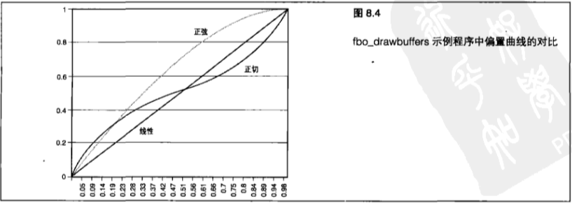

&emsp;&emsp;程序清单 `8.6` 中展示的代码对使用多个着色器目标进行着色的程序所必需的全部着色器状态进行了设置。纹理缓冲区已经进行了加载,但是由于纹理缓冲区对象使用一个纹理单元来获取值,所以纹理缓冲区采样器 `lumCurveSampler` 必须设置到纹理缓冲区进行加载的纹理单元。

```C++
glUseProgram(processProg);
// 为顶点程序设置矩阵
glUniformMatrix4fv(glGetUniformLocation(processProg, "mvMatrix"), 1, GL_FALSE, transformPipeline.GetModelViewMatrix());
glUniformMatrix4fv(glGetUniformLocation(processProg, "pMatrix"), 1, GL_FALSE, transformPipeline.GetProjectionMatrix());

// 设置光源位置
glUniform3fv(glGetUniformLocation(processProg, "vLightPos"), 1, vLightPos);

// 为渲染的像素设置顶点颜色
glUniform4fv(glGetUniformLocation(processProg, "vColor"), 1, vColor);

// 为 texBO 获取设置纹理单元
g1Uniformli(glGetUniformLocation(processProg, "lumCurveSampler"), 1);

//如果几何图形已经进行了纹理贴图,则设置纹理单元
if (textureUnit != -1)
{
    glUniformli(glGetUniformLocation(processProg, "bUseTexture"), 1);
    glUniformli(glGetUniformLocation(processProg, "textureUnit0").textureUnit);
}
else
{
    glUniformli(glGetUniformLocation(processProg, "bUseTexture"), 0);
}
```

&emsp;&emsp;采样程序最后一个有趣的部分就是设置 `FBO` ,指定绘制到哪个缓冲区,然后渲染场景。在程序清单 `8.7` 中,应用程序创建的 `FBO` 被绑定,而绘制缓冲区则被设置到前 `3` 个颜色绑定上。接下来将清除缓冲区,绑定处理程序,渲染场景。当渲染完成时,得到的结果通过 `3` 次调用 `glBlitFramebuffer` 来显示在窗口中。读取缓冲区则在每次调用时设置到适当的 `FBO` 绑定上。请注意 `3` 个输出是如何同时可见的,如图 `8.5` 所示,彩图 `12` 中也展示了这个图形。

```C++
GLenum fboBuffs[] = {   GL_COLOR_ATTACHMENT0,
                        GL_COLOR_ATTACHMENT1, 
                        GL_COLOR_ATTACHMENT2 };

glBindFramebuffer(GL_DRAW_FRAMEBUFFER, fboName);
glDrawBuffers(3, fboBuffs);
glClear(GL_COLOR_BUFFER_BIT । GL_DEPTH_BUFFER_BIT);

UseProcessProgram(vLightTransformed, vFloorColor, 0);

floorBatch.Draw();
DrawWorld(yRot);

// 直接绘制到窗口
glBindFramebuffer(GL_DRAW_FRAMEBUFFER, 0);
glDrawBuffers(1, windowBuff);
glViewport(0, 0,GetWidth(), GetHeight());

// 源缓冲区从帧缓冲区对象进行读取
glBindFramebuffer(GL_READ_FRAMEBUFFER, fboName);

// 将灰度输出复制到屏幕的左半边
glReadBuffer(GL_COLOR_ATTACHMENT1);
glBlitFramebuffer(0, 0, GetWidth() / 2, GetHeight() , 0, 0, GetWidth() / 2, GetHeight(),GL_COLOR_BUFFER_BIT, GL_NEAREST);

// 将亮度调整颜色复制到屏幕的右半边
glReadBuffer(GL_COLOR_ATTACHMENT2);
glBlitFramebuffer(GetWidth() / 2, 0, GetWidth(), GetHeight(), GetWidth() / 2, 0, GetWidth(), GetHeight(), GL_COLOR_BUFFER_BIT, GL_NEAREST);

// 将原始图像复制到屏幕的右上方
glReadBuffer(GL_COLOR_ATTACHMENT0);
glBlitFramebuffer(0, 0, GetWidth(), GetHeight(), (int)(GetWidth() * (0.8)), (int) (GetHeight()* (0.8)), GetWidth(), GetHeight(), GL_COLOR_BUFFER_BIT, GL_LINEAR);
```

&emsp;&emsp;按 `F3` 、 `F4` 和 `F5` 键可以切换应用到窗口右边的亮度曲线。处理着色器接受最终的颜色,使用纹理缓冲区对象的大小对颜色值进行缩放，然后查询新的 `R` 、 `G` 和 `B` 值，再将这些值存储到它们的颜色输出中。我们可以试着改变生成这些曲线的数据,增加自己的曲线,或者在每个颜色通道上应用不同的因子。

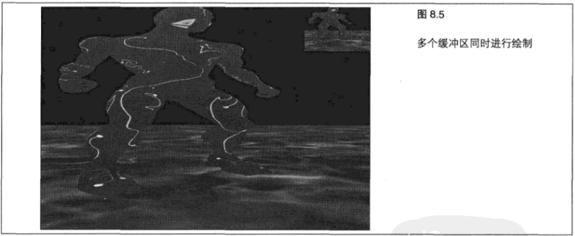

&emsp;&emsp;可以按 `F2` 键在“向 `FBO` 渲染多个输出”和“直接渲染到屏幕上”这两者之间进行切换。不要忘记，绘制表面大小是根据绑定的表面而定的。就 `fbo_drawbuffers` 采样程序的情况来说，渲染缓冲区的大小和窗口一致。所以无论它绘制到何处,缓冲区的大小都是相同的。即使在本例中并不是必需的,我们也要记住还必须通过调用 `glViewport` 来绘制到整个缓冲区(也不要过度绘制! ),以改变视口大小。

&nbsp;

## 8.3 渲染到纹理

&emsp;&emsp;好了,从传统的窗口渲染开始,我们已经走过了很长一段路程。 `FBO` 是一种进行离屏渲染的灵活工具。但是， `RBO` 本身也确实存在一些限制。实际上，它们实在是只在直接绑定到 `FBO` 上时才是真正有用的。这就意味着获取数据需要一个副本,而这正是我们想避免的。幸运的是,我们不一定非要使用。

&emsp;&emsp;取而代之,我们可以将一个纹理直接绑定到一个 `FBO` 绑定点上。因为各种纹理的情况不尽相同,所以有 `3` 个入口点用来将纹理绑定到一个帧缓冲区绑定点上。

```C++
void glFramebufferTexture1D(GLenum target, GLenum attachment,GLenum textarget, GLuint texture, GLint level);
void glFramebufferTexture2D(GLenum target,GLenum attachment,GLenum textarget, GLuint texture, GLint level);
void glFramebufferTexture3D(GLenum target, GLenum attachment,GLenum textarget, GLuint texture, GLint level,GLint layer);
```

&emsp;&emsp;目标既可以是 `GL_DRAW_FRAMEBUFFER` ,也可以是 `GL_READ_FRAMEBUFFER` ,这与渲染缓冲区的情况相同。第二个参数指定 `FBO` 绑定点，它可以是 `GL_DEPTH_ATTACHMENT` 、 `GL_STENCIL_ATTACHMENT` ,也可以是各个 `GL_COLOR_ATTACHMENTn` 值中的任意一个,这一点也与渲染缓冲区的情况类似。对于大多数纹理来说，第 `3` 个参数是相应的纹理类型，但是对于立方体贴图来说,我们需要传递表面的目标。接下来要给出纹理的名称,然后是纹理要绑定到的 `Mip` 贴图层次。对于 `glFramebufferTexture3D` ,我们还必须指定3D纹理将要使用的层次。一维纹理只能通过 `glFramebufferTexture1D` 进行绑定,而 `glFramebufferTexture3D` 则只能用于三维纹理。在二维纹理、矩形纹理和立方体贴图纹理中则使用 `glFramebufferTexture2D` 。

&emsp;&emsp;在第 `3` 个示例程序 `fbo_textures` 中,我们使用一个绑定到 `FBO` 来为场景创建镜面效果的纹理。首先，像第一个示例程序中一样设置 `FBO` 。但是,这一次程序会将一个纹理绑定到 `FBO` 上,正如程序清单 `8.8` 所示。

```C++
// 创建并绑定一个 FBO
glGenFramebuffers(1, 6fboName);
glBindFramebuffer(GL_DRAW_FRAMEBUFFER, fboName);

// 创建深度渲染缓冲区
glGenRenderbuffers(1, 6depthBufferName);
glBindRenderbuffer(GL_RENDERBUFFER, depthBufferName);
glRenderbufferStorage(GL_RENDERBUFFER, GL_DEPTH_COMPONENT32, 800, 800);

// 创建反射纹理
glGenTextures(1, 6mirrorTexture);
glBindTexture(GL_TEXTURE_2D, mirrorTexture);
glTexImage2D(GL_TEXTURE_2D, 0, GL_RGBA8, 800, 800, 0, GL_RGBA, GL_FLOAT, NULL);

// 将纹理绑定到第一个颜色绑定点和深度 RBO
glFramebufferTexture2D(GL_DRAW_FRAMEBUFFER, GL_COLOR_ATTACHMENT0, GL TEXTURE 2D, mirrorTexture, 0);glFramebufferRenderbuffer(GL_DRAW_FRAMEBUFFER, GL_DEPTH_ATTACHMENT, GL_RENDERBUFFER, depthBufferName);
```

&emsp;&emsp;所有对新 `FBO` 的渲染都以与 `RBO` 绑定点相同的方式完成。但是，还有一些事情需要我们留意。因为现在绑定到 `FBO` 的纹理也可以用于渲染,那么就有可能创建一个渲染循环。着色器可能会从一个纹理中获取纹理单元,然后将最终的着色结果写回同一个纹理,有可能会覆盖到同一个位置上。这样就可能导致未定义的结果，这可能是一个非常难以查出的问题。作为一般的规则，我们最好确保绑定到 `FBO` 的纹理和被写入的纹理不要绑定到任何纹理单元上。

&emsp;&emsp;绑定到 `FBO` 的每个纹理的状态也会影响 `FBO` 的完整性。一个纹理图像表面的大小和格式可以在通过进行 `glTexImage2D` 之类的调用绑定到 `FBO` 的同时异步地进行修改。如果修改一个作为渲染目标的纹理图像表面,那么就应该确保帧缓冲区仍然可以通过调用  `glCheckFramebufferStatus` 进行渲染。我们可以绑定一个纹理的任何 `Mip` 贴图层次,只要在绑定纹理时指定它即可。如果我们还计划为纹理贴图使用 `Mip` 贴图,那么还要为刚刚进行渲染的纹理生成 `Mip` 链的剩余部分。这些工作并不是自动完成的,但是可以为我们想要更新的纹理类型调用 `glGenerateMipmap` ,这样就使用基层的内容更新了所有基层以上的层次。

&emsp;&emsp;这种镜面效果并不神秘,如图8.6所示(同样显示在了彩图 `13` 中)。但是, FBO能够获得真实的反射效果,这种效果用任何其他方法几乎都是不可能实现的。在本书前面的内容中,我们已经使用 `alpha` 混合和图像倒置模拟了大理石地板上的反射效果。这种 `alpha` 倒置效果在总是反射同一个角度。

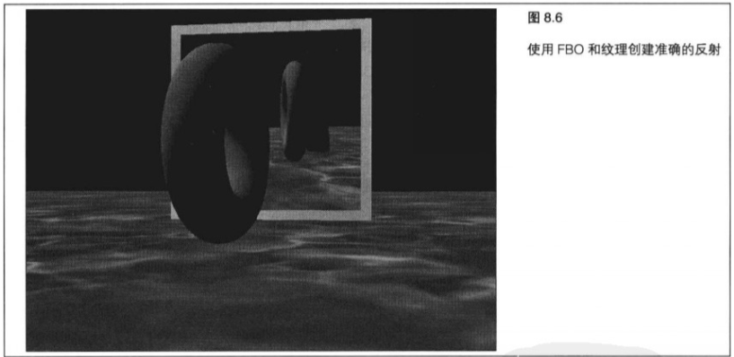

&emsp;&emsp;的情况下使用时非常好。但是在大理石地板的边缘,在角度改变时,或者沿着一个陡坡向上走时就不那么好用了。在有障碍物(可能是一个盒子或者凳子)遮挡了反射路线时,这种方式也很难奏效。另外,使用 `alpha` 倒置方法可能还会导致深度测试问题。

&emsp;&emsp;使用一个 `FBO` ,我们首先要将视角变换到镜子的视角上。这就意味着整个场景和所有内容都将从镜子的位置进行渲染。但是,镜子到底是“看向”哪个方向的呢?从镜子表面直接向外吗?这样就意味着当观察者相对于镜子移动时,反射也不会随之改变。那么回到观察者视角又如何呢?那就意味着我们总会看到自己的镜像,无论站在哪里都是如此,这样虽然接近,但还不是正确的结果。我们可以绘制一个从观察者位置指向镜面中心的向量，而镜面则应该是沿着这个向量通过垂直于镜面的法向量反射得到的向量向外看的。我们可以想象一下,自己站在镜子后面沿着反射的方向看镜子显示的情景。如图 `8.7` 所示,我们能找到一些关于这种效果如何实现的认识。不要忘记，这里的入射角并不是观察者/照相机所看向的方向，而是在观察者位置和镜面中心画一条线而得到的角度。

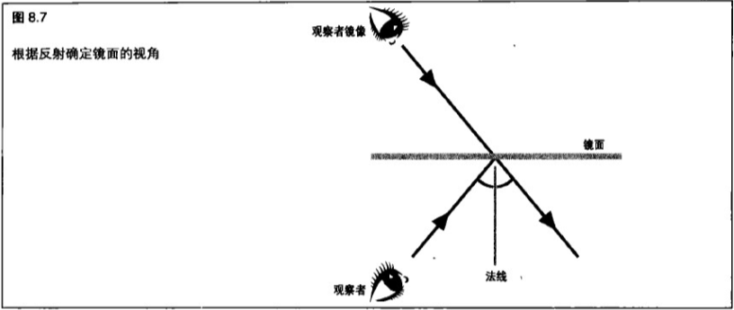

&emsp;&emsp;一旦我们找到了镜子的位置,并且计算出镜面观察的角度,我们就可以从镜面的位置和视角来渲染场景了。程序清单 `8.9` 展示了这个场景是如何按照镜面的视角来绘制的。在 `fbo_textures` 示例程序中,我们使用 `GLTools` 资源中的一个 `GLFrame` 对象根据位置、向上的向量和观察方向产生对模型视图矩阵的调整。然后,模型视图矩阵将在 `×` 方向进行反转,来模拟反射--在镜子中所有物体都是反向的。作为奖励,观察者将在反射图像中被绘制成一个蓝色的锥体,以帮助我们想象照相机的位置。

```C++
// 设置镜面帧（照相机）的位置
vMirrorPos[0] = 0.0;
vMirrorPos[1] = 0.1f;
// 观察位置实际上是在镜面后的
mirrorFrame.Setorigin (vMirrorPos);

// 计算镜面帧（照相机）的方向
// 因为我们知道镜面相对于原点的位置
// 通过向观察者的向量——原点添加镜面偏置来寻找方向向量
vMirrorForward[0] = vCameraPos[0];
vMirrorForward[1] = vCameraPos[1];
vMirrorForward[2] = (vCameraPos[2] + 5);
m3dNormalizeVector3(vMirrorForward);
mirrorFrame.SetForwardVector(vMirrorForward);

//首先从镜面的视角进行渲染
glBindFramebuffer(GL_DRAW_FRAMEBUFFER, fboName);
glDrawBuffers(1, fboBuffs);
glViewport(0, 0, mirrorTexWidth, mirrorTexHeight);

// 从镜像照相机的视角绘制场景
modelViewMatrix.PushMatrix();
    M3DMatrix44f mMirrorView;
    mirrorFrame.GetCameraMatrix(mMirrorView);
    modelViewMatrix.MultMatrix(mMirrorView);

    // 为了达到反射效果而对照相机进行水平反转
    modelViewMatrix.Scale(-1.0f, 1.0f, 1.0f);
    glBindTexture(GL_TEXTURE_2D, textures(0)); // Marble 
    glClear(GL_COLOR_BUFFER_BIT | GL_DEPTH_BUFFER_BIT);
    shaderManager.UseStockShader(GLT_SHADER_TEXTURE_MODULATE, transformPipeline.GetModelViewProjectionMatrix(), vWhite, 0);
    floorBatch.Draw();
    DrawWorld(yRot);
    
    // 现在绘制一个圆简来代表观察者
    M3DVector4f vLightTransformed;
    modelViewMatrix.GetMatrix(mMirrorView);
    m3dTransformVector4(vLightTransformed, vLightPos, mMirrorView);
    modelViewMatrix.Translate(vCameraPos[0], vCameraPos[1] - 0.8f, vCameraPos[2] - 1.0f);modelViewMatrix.Rotate(-90.0f, 1.Of, 0.0f, 0.0f);
    
    shaderManager.UseStockShader(GLT_SHADER_POINT_LIGHT_DIFF, modelViewMatrix.GetMatrix(),transformPipeline.GetProjectionMatrix(), vLightTransformed, vBlue, 0);
    cylinderBatch.Draw();
modelViewMatrix.PopMatrix();
```

&emsp;&emsp;接下来程序清单 `8.10` 中的代码将对场景进行绘制。帧缓冲区、视点和绘制缓冲区都恢复成进行窗口渲染的默认设置。然后再次绘制场景，这一次从观察者/照相机的视角进行绘制。上述工作完成之后，就可以进行镜面本身的绘制了。在应用包含镜面图像的纹理之前,示例程序会先确认观察者在镜面的哪一边。为了避免在镜面的背后出现不应出现的反射,程序会进行检查,确认观察者是在镜面的前面还是后面。如果观察者在后面，那么镜面将会绘制成黑色。

```C++
// 重置FBO.再次从真实的照相机视角来绘制场景
glBindFramebuffer(GL_DRAW_FRAMEBUFFER, 0);
glViewport(0, 0, screenWidth, screenHeight);
glDrawBuffers(1, windowBuff);
modelViewMatrix.PushMatrix();
    M3DMatrix44f mCamera;
    cameraFrame.GetCameraMatrix(mCamera);
    modelViewMatrix.MultMatrix(mCamera);

    glBindTexture(GL_TEXTURE_2D, textures[0]); // Marble 
    glClear(GL_COLOR_BUFFER_BIT | GL_DEPTH_BUFFER_BIT);
    shaderManager.UseStockShader(GLT_SHADER_TEXTURE_MODULATE, transformPipeline.GetModelViewProjectionMatrix(), vWhite, 0);
    
    floorBatch.Draw();
    DrawWorld(yRot);
    
    // 现在绘制镜面表面
    modelViewMatrix.PushMatrix();
    modelViewMatrix.Translate(0.0f, -0.4f, -5.0f);
    if (vCameraPos[2] >-5.0)
    {
        glBindTexture(GL_TEXTURE_2D, mirrorTexture); // Reflection 
        shaderManager.UseStockShader(GLT_SHADER_TEXTURE_REPLACE, transformPipeline.GetModelViewProjectionMatrix(), 0);
    }
    else
    {
        //如果观察者在镜面后面,那么镜面将会绘制成黑色
        shaderManager.UseStockShader(GLT_SHADER FLAT,transformPipeline.GetModelViewProjectionMatrix(), vBlack);
    }
    
    mirrorBatch.Draw();
    shaderManager.UseStockShader(GLT_SHADER_FLAT, transformPipeline.GetModelViewProjectionMatrix(), vGrey);
    mirrorBorderBatch.Draw();
modelViewMatrix.PopMatrix();
```

&emsp;&emsp;这种方法还有一些限制因素。其中一个因素是，整个场景将会进行两次绘制，如果在镜面后面或者视野之外有很多物体，这在性能上就可能成为一个问题。在第 `12` 章，我们将学习封闭查询（ `occlusion query` ），以及如何做到只绘制将要看到的内容。另一个问题是，在示例程序中观察者在镜面中的位置取得是镜面中心,这样做是为了使数学计算变得简单。但这样做的结果并不是非常真实的。要生成更加准确的反射，一种可能的方法是使用镜面上距离照相机最近的点。作为练习,我们可以试着去修改应用程序,使镜面也可以在场景中旋转。在这种情况下,我们就要根据照相机相对于镜面的位置和镜面相对于照相机的角度来重新计算入射角了。

&nbsp;

## 8.4 小结

&emsp;&emsp;在本章,我们在管理OpenGL内存和缓冲区的方式上作出了较大的改变。使用像素缓冲区对象,可以将数据在GPU和管线数据加载之间来回移动,来完成纹理更新之类的操作。我们可以使用纹理缓冲区对象将任意数据绑定到纹理单元,然后在着色器中获取这些数据。帧缓冲区对象与渲染缓冲区对象配合使用,而纹理则为离屏渲染带来了全新的可能性。现在,我们可以直接绑定和渲染到任何像素表面,而不会影响到屏幕上的内容。我们还学到了如何使用着色器来同时对大量颜色表面进行绘制。
