# 高级缓冲区

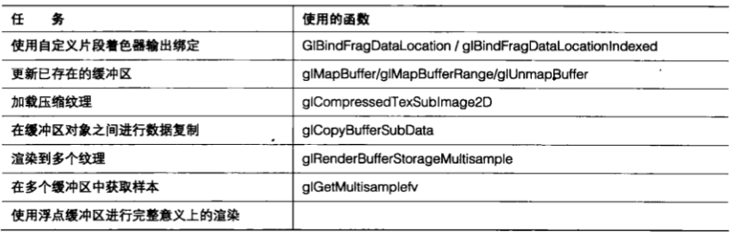

&emsp;&emsp;现在帧缓冲区已经有些过时了,我们可以利用 `FBO` 、纹理和缓冲区对象带来的灵活性来真正提升 `OpenGL` 管线的表现。到目前为止,大部分工作都是针对传统的 `8` 位纹理和渲染缓冲区的,甚至是深度缓冲区也将所有值映射到 `24` 位或 `32` 位物理定点范围( `physical fixed-point range` )。

&emsp;&emsp;新的数据格式带来了新的局面，允许应用程序存储片段着色器的实际输出而不会丢失精度。有趣的事还不止这些。

&emsp;&emsp;`OpenGL` 还提供了许多访问和更新 `GPU` 中缓冲区的方法，这些方法无需中止渲染。

&nbsp;

## 9.1 获得数据

&emsp;&emsp;本章的大部分篇幅都用于介绍所有新的数据格式和使用方法。但是在介绍它们之前,先来回顾一下第 `8` 章学到的一些内容，并且介绍一些用来访问那些将要进行性能优化的缓冲区的重要方法。

> 9.1.1 映射缓冲区

&emsp;&emsp;在前一章，我们使用 `glBufferData` 来上传缓冲区对象，从而对缓冲区进行填充。但是，如果在缓冲区已经加载到 `GPU` 之后还需要对缓冲区内容进行修改或更新的话,又该怎么办呢?好吧,这就是 `glMapBuffer` 和 `glMapBufferRange` 的作用了。当调用 `glMapBufferRange` 时, `OpenGL` 就会提供一个指向内存的指针，我们可以用这个指针直接读取或更新某个缓冲区中的数据。我们需要做的所有工作就是告诉实现我们打算对这些数据做什么。在 `GPU` 已经对缓冲区进行写入,而我们又希望将结果返回 `CPU` 时,可以选择只从映射的缓冲区中进行读取。或者在我们所做的改变已经在 `GPU` 内存存储的缓冲区中体现出来的情况下,也可以将缓冲区映射为写入状态。我们选择的映射类型将对性能产生影响,因此在只需要从某个缓冲区进行读取时,应当试图避免将这个缓冲区映射为写入状态。同样地,当只需要向一个缓冲区中写入数据时也不要将它映射为读取状态。表 `9.1` 列出了映射缓冲区可能的位字段（ `bitfield` ）值。

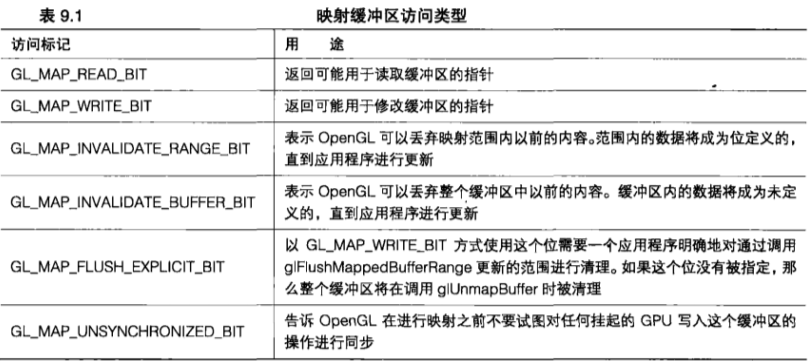

&emsp;&emsp;在完成映射缓冲区的更新之后，调用 `glUnmapBuffer` 来告诉 `OpenGL` 已经完成了这项工作。

```C++
GLint accessFlags = GL_MAP_WRITE_BIT | GL_MAP_INVALIDATE_RANGE_BIT | GL_MAP_FLUSH_EXPLICIT_BIT;
GLint offset = 32 * 100;
GLint length = 32 * 48;
GLvoid *bufferData = glMapBufferRange(GL_TEXTURE_BUFFER, offset, length, accessFlags);
// 在这里更新缓冲区
...
glUnmapBuffer(GL_TEXTURE_BUFFER):
```

&emsp;&emsp;如果我们设置了 `GL_MAP_FLUSH_EXPLICIT_FLAG` , 那么就需要告诉 `OpenGL` 我们想要清理缓冲区的哪些部分,或者在对缓冲区解除映射之前通过调用 `glFlushMappedBufferRange` 更新了哪些部分。只要需要,我们就可以任意多次地为更新的范围调用 `glFlushMappedBufferRange` 。

```C++
GLvoid glFlushMappedBufferRange(GLenum target, intprt offset, sizeiptr length);
```

&emsp;&emsp;这里要使用与缓冲区绑定到相同的 `target` , `offset` 和 `length` 参数用来标记缓冲区的哪部分进行改变。

&emsp;&emsp;我们还可以调用 `glMapBuffer` 代替 `glMapBufferRange` 来映射整个缓冲区。

```C++
GLvoid bufferData = glMapBuffer(GL_TEXTURE_BUFFER, accessFlags);
```

&emsp;&emsp;在本书剩下的内容中会大量使用 `glMapBuffer` 和 `glMapBufferRange` 加载和更新 `GPU` 数据。

> 9.1.2 复制缓冲区

&emsp;&emsp;当数据被发送到 `GPU` 之后,我们完全有可能希望在缓冲区之间共享这些数据,或者从一个缓冲区中将结果复制到另一个缓冲区。幸运的是, `OpenGL` 也提供了一种使用起来很简单的方法,可以用来完成这项工作。 `glCopyBufferSubData` 使得我们可以指定相关的缓冲区，以及使用的大小和偏置。

```C++
glCopyBufferSubData(GL_COPY_READ_BUFFER, GL_COPY_WRITE_BUFFER, readStart, writeStart, size) ;
```

&emsp;&emsp;我们可以从绑定到表 `8.1` 列出的任何绑定点的缓冲区中复制，也可以复制到这些缓冲区中。但是，既然缓冲区绑定点在同一时间只能绑定一个缓冲区,我们就无法在两个都绑定到 `GL_TEXTURE_BUFFER` 上的缓冲区之间进行复制了。 `OpenGL` 的创造者也想到了这一点!还记得我们在第 `8` 章中第一次看到,但是到现在为止还没使用过的 `GL_COPY_READ_BUFFER` 和 `GL_COPY_WRITE_BUFFER` 吗？没错，这些绑定点就是为了将数据从一个缓冲区复制到另一个缓冲区而特别加入的。我们可以将读取和写入缓冲区绑定到这些绑定点,而不会影响到其他任何缓冲区绑定。然后再将偏置添加到每个缓冲区,并指定大小。

&emsp;&emsp;要确保我们从中读取和要写入到的范围保持在缓冲区的大小范围内，否则复制将会失败。 `glCopyBufferSubData` 可以在许多巧妙的算法中使用。其中一种普遍的用法，就是为一个应用程序创建第二个 `OpenGL` 环境下的线程用于进行数据加载。在这里,  `glCopyBufferSubData` 用来在主环境中更新几何图形数据非常方便，而不需要主线程中断渲染。

&nbsp;

## 9.2 控制像素着色器表现，映射片段输出

&emsp;&emsp;在第 `8` 章，我们学习了如何将多个缓冲区对象连接到一个帧缓冲区中,以及对同一个片段着色器的许多不同输出进行渲染。为了完成这项工作,着色器可以写入到名为 `gl_FragData[n]` 的内建着色器输出,而不是写入到 `gl_FragColor` 。

&emsp;&emsp;虽然我们仍然可以使用这两种输出中的任意一种来编译-一个 `GLSL 1.50` 着色器。但这两种方式都已经不推荐使用了。这就意味着未来的 `OpenGL` 版本将会删除它们,而我们最好使用“更新更先进”的方法来写入着色器颜色输出。

&emsp;&emsp;使用内建着色器输出是 `2006` 年的做法了!老方法的一个问题就是,我们可以写入 `glFragData` 或 `gl_FragColor` ,但是不能两者都写入。另外,如果着色器要渲染多个输出,那么它还必须包含硬编码的索引。还有，我们怎样才能保持跟踪并从逻辑上理解通过多个着色器写入到 `gl_FragData[7]` 的内容呢?我们可以定义着色器输出,而不是设置一个内建颜色输出索引的值。对于颜色输出,可以在片段着色器中将输出声明为 `out vec4` 。我们重写第 `8` 章绘制缓冲区示例程序的输出来使用自定义位置。

```C++
out vec4 oStraightColor;
out vec4 oGreyScale;
out vec4 oLumAdjColor;
```

&emsp;&emsp;然后,在对程序进行连接之前,告诉 `OpenGL` 我们想要使用 `glBindFragDataLocation` 将输出映射到哪里。只要指定每个输出要映射到的索引即可。

```C++
glBindFragDataLocation(processProg, 0, "oStraightColor");
glBindFragDataLocation(processProg, 1, "oGreyScale");
glBindFragDataLocation(processProg, 2, "oLumAdjColor");
glLinkProgram(processProg);
```

&emsp;&emsp;我们还可以编译着色器，将程序连接到一起，然后指定输出的位置。请记住，在使用程序之前要将它重新进行连接,这样对输出位置的设置才能生效。现在着色器数据已经完成了配置,每一种颜色都写入到唯一的索引。请记住,我们不能将一个输出分配给多个索引。程序清单 `9.1` 完整地列出了第 `8` 章的绘制缓冲区示例程序中的片段着色器。这里声明了 `3` 个颜色输出,其中每个输出都使用了一种各不相同的着色技术。

```C++
#version 150
// multibuffer_frag_location.fs
// 输出到3个缓冲区: normal color. grayscale和luminance adjusted color

in vec4 vFragColor;
in vec2 vTex;
uniform sampler2D textureUnit0;
uniform int bUseTexture;
uniform samplerBuffer lumCurveSampler;

out vec4 oStraightColor;
out vec4 oGrayScale;
out vec4 oLumAdjColor;

void main(void)
{
    vec4 vColor;
    vec4 lumFactor;
    if (bUseTexture != 0)
        vColor = texture(textureUnit0, vTex); 
    else 
        vColor = vFragColor;
    
    // 对第一个缓冲区进行原样输出
    oStraightColor = vColor;
    
    // 对第二个缓冲区进行灰度输出
    float grey = dot(vColor.rgb, vec3(0.3, 0.59, 0.11));
    oGrayScale = vec4 (gray, gray, gray, 1.0f);
    
    // 对输入颜色进行截取，确保它的值在 0.0 和 1.0 之间
    vColor = clamp(vColor, 0.0f, 1.0f);
    
    int offset = int(vColor.r * 1024);
    oLumAdjColor.r = texelFetch(lumCurveSampler, offset ).r;
    
    offset = int(vColor.g * 1024); 
    oLumAdjColor.g = texelFetch(lumCurveSampler, offset ).r;
    
    offset = int(vColor.b 1024);
    oLumAdjColor.b = texelFetch(lumCurveSampler, offset ).r
    oLumAdjColor.a = 1.0f;
}
```

&emsp;&emsp;使用 `glBindFragDataLocation` 有很多优点。我们可以在着色器中为输出使用有实际含义的逻辑名,还可以在多个着色器中使用同样的名称,并在运行时将这个名称映射到正确的逻辑缓冲区索引。

&emsp;&emsp;我们将在第 `10` 章更加深入地了解应用程序如何使用混合。在 `OpenGL 3.3` 中,某些混合方程式需要一个着色器为每个片段输出两个不同的颜色。我们可以使用 `glBindFragDataLocationIndexed` 完成这项工作。

```C++
glBindFragDataLocationIndexed(program, colorNumber, index, outputName);
```

&emsp;&emsp;这个函数的行为和 `glBindFragDataLocation` 类似。在 `OpenGL 3.3` 中 `index` 参数有两个可能的索引值。如果选择 `0` ,那么这个颜色将作为第一个输入颜色使用,就像我们已经使用了 `glBindFragDataLocation` 一样;如果选择 `1` ,那么这个颜色将作为第二个输入颜色用于混合。

&nbsp;

## 9.3 新一代硬件的新格式

&emsp;&emsp;在过去的几年中， `OpenGL` 取得进展的一种方式就是为大量新数据格式和数据类型增加本地支持。 `OpenGL` 标准的撰写者不断地在 `3D` 应用程序开发中增加灵活性--最初是图形管线中可以完全自定义的部分,后来是灵活的缓冲区应用,而现在又增加了灵活的数据格式。

&emsp;&emsp;一开始,这种想法可能看起来很麻烦,或者无关紧要。但是任何花费时间试图将它们所有的颜色数据压缩到 `8bit` 之内的人都会赞同这个想法。进入 `OpenGL` 渲染管线的大部分数据都来自某些其他应用程序或工具。大多数游戏的顶点和纹理数据都来自诸如 `Maya` 或 `3DS Max` 这样的艺术创作工具。 

&emsp;&emsp;`CAD` 程序使用复杂的引擎来根据用户输入和文件格式生成 `3D` 表面。因为顶点、纹理和相关数据可能会非常大、非常复杂,所以将所有这些数据从各种不同的源转换到一个小格式集合范围内几乎是不可能的。

&emsp;&emsp;现在大多数通用格式和许多非通用格式都得到了本地支持，所以对于 `OpenGL` 来说进行转换常常是不必要的。

> 9.3.1 浮点

&emsp;&emsp;增加浮点格式是最重要的增强中的一项。虽然在 `OpenGL` 管线内部经常使用浮点数据,但是源和目标却经常是定点数据,这使其精度大大降低。这样做的结果就是,管线的许多部分都曾经将所有值截取到 `0` 和 `1` 之间,这样它们就可以以定点格式进行存储了。在 `OpenGL 3.2` 中仍然允许我们将片段着色器的输出进行截取,而在 `OpenGL 3.3` 中就将截取操作整个删除了。

&emsp;&emsp;传递到一个顶点着色器的数据类型取决于我们，但是它典型情况下都会被声明为 `vec4` ，或者一个包含 `4` 个浮点值的向量。类似地,当我们在一个顶点着色器中将变量声明为 `out` 或 `varying` 时,要决定顶点着色器将写入何种输出。随后这些输出将在几何图形上进行光栅化，并传递到片段着色器。决定在整个管线中的颜色上使用的数据类型方面,我们拥有完全的控制权,虽然通常情况下使用的都是浮点数。现在，我们对数据从顶点数组到最终输出的整个过程采用的数据类型和传递方式都拥有完全的控制权。

&emsp;&emsp;这太棒了！现在，颜色和阴影可以使用 $1.18 * 10^{38}$  到 $3.4 * 10^{38}$ 之间的所有值，而不再只是 `256` 个值了! (负的颜色值没有意义)但是,如果我们绘制到一个每种颜色只有 `8` 位的窗口,会发生什么?遗憾的是,在这种情况下输出将被截取到 `0` 到 `1` 之间的范围内,然后再映射到一个定点值。这可不是好玩儿的!在有人发明能够懂得和显示浮点数据的显示器或监视器之前,我们仍然要受最终输出设备的限制。但是这并不意味着浮点渲染没有用。恰恰相反！我们仍然可以采用全浮点精度渲染到纹理和渲染缓冲区。不仅如此，我们还可以对浮点数据如何映射到定点输出格式拥有完全的控制权。这对最终的结果有着重大影响，通常称为高动态范围( `High Dynamic Range` ，缩写为 `HDR` )。

&emsp;&emsp;**使用浮点格式**

&emsp;&emsp;对应用程序进行升级使用浮点缓冲区比我们想象的要简单。实际上,我们甚至不需要调用任何新的函数。取而代之的是,可以在创建缓冲区时使用两个新的标记 `GL_RGBA16F` 和 `GL_RGBA32F` 。我们可以在为 `RBO` （渲染缓冲区对象）创建存储或者分配纹理时使用它们。

```C++
glRenderbufferStorage(GL_RENDERBUFFER, GL_RGBA16F, nWidth, nHeight);
glRenderbufferStorage(GL_RENDERBUFFER, GL_RGBA32F, nWidth, nHeight);
glTexImage2D(GL_TEXTURE_2D, 0, GL_RGBA16F, texWidth, texHeight, 0, GL_RGBA, GL FLOAT, texels);
glTexImage2D(GL_TEXTURE_2D, O, GL_RGBA32F, texWidth, texHeight, O, GL_RGBA, GL_FLOAT, texels);
```

&emsp;&emsp;除了更加传统的 `RGBA` 格式之外,表 `9.2` 列出了允许用于创建浮点渲染缓冲区的其他格式。纹理更加开放,并且可以采用更多的格式来创建,但是其中只有两种是浮点格式。还记得我们以前说过 `OpenGL` 变得更加灵活,能让许多不同的应用程序更容易地工作吗?有了这么多可用的浮点格式,应用程序就可以直接使用数据存储格式而不需要进行第一次转换了,而这种转换可能会非常耗费时间。

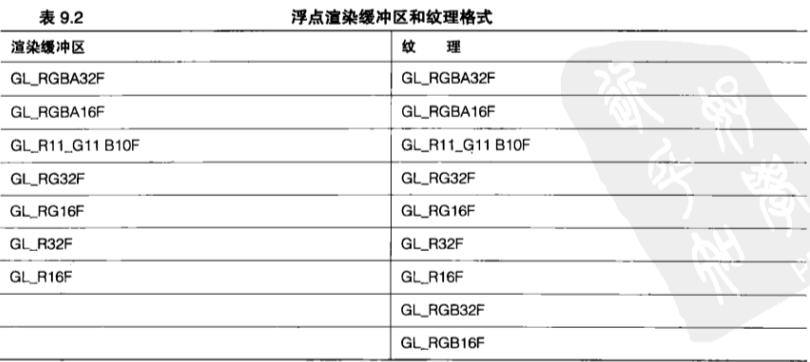

&emsp;&emsp;**HDR**

&emsp;&emsp;许多现代游戏应用程序都使用浮点渲染来生成所有我们希望看到的漂亮视觉效果。如果能够产生诸如光源泛光( `light bloom` )、镜头光晕( `lens flare` )、光线反射( `light reflection` )、光线折射( `light refraction` )、朦胧光线( `crepuscular ray` ),以及尘埃和云雾等非均匀介质效果,那么现实级的效果是可以实现的,而这些效果如果不使用浮点值通常是无法实现的。到浮点缓冲区的 `HDR` 渲染能够使明亮的区域真正地明亮起来,使阴影部分保持非常阴暗，同时又使我们仍然能够看清这两种区域中的细节。

&emsp;&emsp;毕竟，人的眼睛拥有不可思议的能力，可以感知非常高的对比度，远远超出了目前显示器的性能。为了简单起见,我们使用已经生成的HDR图像,而不再在示例程序中重新绘制一个包含许多几何图形和光照的复杂场景来展示 `HDR` 的效果了。第一个示例程序 `hdr_imaging` 加载了使用一种叫做 `OpenEXR` 的文件格式的 `HDR` （浮点）图像。工业光学魔术公司( `Industrial Light and Magic` ，简称工业光魔)开发了 `OpenEXR` ,将它作为一种工具来帮助存储所有高保真图像处理所需的图像数据。我们可以将 `OpenEXR` 图像看作是一个由照相机在不同的曝光等级下拍摄的多幅图像的组合。低曝光能捕捉到场景中高亮区域的细节,而高曝光则可以捕捉到场景中阴暗区域的细节。图 `9.1` 所示(同样显示在了彩图  `14` 中)展示了一个场景的 `3` 个视图，这个场景中的前景中有一颗树，背景则是明亮的视场。左边图像以非常低的曝光度进行渲染，即使在非常明亮的情况下，也能显示视场中所有的细节；中间图像开始显示前景,包括树干和最近的树上的树叶;右边图像则清晰地显示了树前面的地面细节,我们甚至可以看到树根部空洞中的景象！这几幅树的图片展示了存储在一幅单个图像中不可思议的丰富细节和范围。 `OpenEXR` 中带有示例图像，我们可以用它们来演示 `HDR` 渲染。

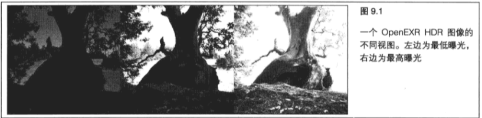

&emsp;&emsp;在一个单个图像中存储如此多细节的唯一方式就是使用浮点数据。在 `OpenGL` 中渲染的任何场景，特别是当它包含非常明亮或者非常阴暗的区域时，如果保留真正的颜色输出，而不是将其截取到 `0.0` 到 `1.0` 之间然后再分成仅有的 `256` 个可能值的话，看起来会真实得多。

&emsp;&emsp;**使用 OpenEXR**

&emsp;&emsp;因为 `OpenEXR` 是一种自定义的数据格式,所以我们不能使用常规的文件访问方式对这种数据进行读取和解释执行。幸运的是工业光魔已经为我们提供了完成所有繁重工作所必需的库。通过包含一些 `OpenEXR` 头文件并与 `OpenEXR lib` 文件进行连接,就可以使用这些已经创建好的工具加载数据了。 `OpenEXR` 将所有对 `EXR` 文件的访问看作文件中包含数据的“窗口”或“视图”。在应用程序中,首先将我们想要打开的文件名称传递给构造函数,从而创建一个 `RGBAInputFile` 对象。接下来,创建一个 Box2i 对象并用来自一个 `dataWindow` 调用的强类型数据对其进行填充,从而获取 `OpenEXR` 图像的宽度和高度。然后这些宽度和高度就可以用来创建包含 `RGBA` 数据的像素的 `2D` 数组了。

```C++
Array2D<Rgba> pixels; 
Box2i dw = file.dataWindow();
texWidth = dw.max.x - dw.min.x + 1;
texHeight = dw.max.y - dw.min.y + 1;
pixels.resizeErase(texHeight, texWidth);
```

&emsp;&emsp;在文件打开并且有了存储数据的位置之后,需要告诉 `RgbaInputFile` 对象我们想要通过调用 `setFrameBuffer` 将数据放到哪里，然后通过调用 `readPixels` 来读取实际数据。

```C++
file.setFrameBuffer(6pixels[0][0] - dw.min.x - dw.min.y * texwidth, l, texWidth);
file.readPixels(dw.min.y, dw.max.y);
```

&emsp;&emsp;现在已经有了数据,可以将它加载到一个纹理上了。但是,数据首先必须是一种 `OpenGL` 能够理解的格式。这些数据必须复制到一个浮点数组。

```C++
GLfloat* texels = (GLfloat*)malloc(texWidth* texHeight * 3 * sizeof(GLfloat));
GLfloat* pTextexels;
// 将 OpenEXR 复制到本地缓冲区，准备加载到纹理
for (unsigned int v = 0; v < texHeight; v++)
{
    for (unsigned int u = O; u < texWidth; u++)
    {
        Imf::Rgba texel = pixels[texHeight - v - 1][u];
        pTex[0] = texel.r;
        pTex[1] = texel.g;
        pTex[2] = texel.b;
        pTex += 3;
    }
}
```

&emsp;&emsp;然后，将浮点数组加载到指定的纹理对象。

```C++
// 绑定纹理，加载图像，设置 tex 状态
glBindTexture(GL_TEXTURE_2D, textureName); 
glTexImage2D(GL_TEXTURE_2D, 0, GL_RGB16F, texWidth, texHeight, 0, GL_RGB, GL_FLOAT, texels);
glTexParameteri(GL_TEXTURE_2D, GL_TEXTURE_WRAP_S, GL_CLAMP_TO_EDGE);
glTexParameteri(GL_TEXTURE_2D, GL TEXTURE_WRAP_T, GL_CLAMP TO EDGE);
glTexParameteri(GL_TEXTURE_2D, GL TEXTURE_MAG_FILTER, GL_LINEAR);
glTexParameteri(GL_TEXTURE_2D, GL_TEXTURE_MIN_FILTER, GL_LINEAR);
free(texels);
```

&emsp;&emsp;好了!现在 `HDR` 图像数据已经加载到 `OpenGL` 纹理图像上,做好了使用准备。

&emsp;&emsp;**色调映射**

&emsp;&emsp;现在我们已经看到了使用浮点渲染的一些优点，那么如何使用这些数据创建仍然要使用从 `0` 到 `255` 的值进行显示的动态图像呢？色调映射( `Tone Mapping` )就是将颜色数据从一组颜色映射到另一组颜色，或者从一个颜色空间映射到另一个颜色空间的操作。因为我们不能直接显示浮点数据,所以这些数据必须将色调映射到一个能够被显示的颜色空间。

&emsp;&emsp;第一个示例程序 `hdr_imaging` 使用 `3` 种方法将高清晰度的输出映射到低清晰度的屏幕上。第一种方法通过按 `1` 键来启用，这是一种简单朴素的方法，直接将浮点纹理进行纹理贴图到屏幕上。图 `9.2` 所示的柱状图展示了 `0` 到 `1` 之间的大部分图像数据,但是很多重要的高光都远高于 `1.0` 。实际上,这幅图片的最高亮度等级是 `9.16` ！

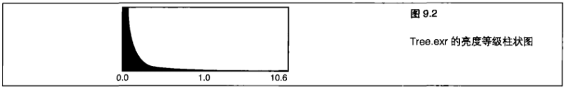

&emsp;&emsp;结果，图像被截取，所有的高光区域看起来都是白色的。

&emsp;&emsp;另外,因为数据的主要部分都在这个范围的 `4` 分之一部分之内,或者说在直接映射到 `8` 位时是在 `0` 到 `63` 之间,所以它们都被混合到一起,看起来是黑色的。

&emsp;&emsp;图 `9.3` 所示显示了输出结果,其中的明亮部分几乎是白色的,而阴暗部分则接近黑色。

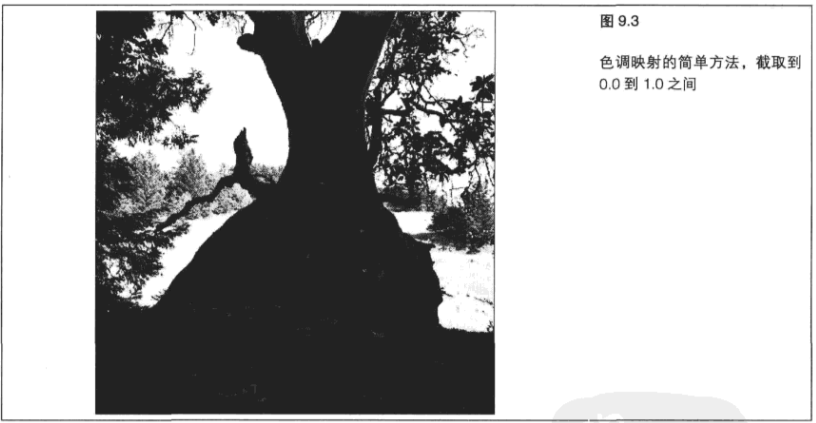

&emsp;&emsp;示例程序中的第二种方法是改变图像的“曝光”程度,与照相机改变对环境的曝光类似。按2键可以进入这种模式。每个曝光等级都提供了一个到纹理数据的稍有不同的窗口。低曝光能够显示场景中高亮区域的细节,而高曝光则使我们可以看到场景中阴暗区域的细节,但却冲掉了高亮部分。这种情况与图 `9.1` 所示类似,在图 `9.1` 所示左边的图像为低曝光,右边的图像则为高曝光。

&emsp;&emsp;对于我们的色调映射传递来说，`hdr_imaging` 示例程序从一个浮点纹理中进行读取，并写入到一个帧递缓冲区对象,在这个缓冲区对象中一个 `8` 位纹理被绑定到了第一个渲染目标。这样就允许从 `HDR` 到 `LDR` (低动态范围)的变换在逐个像素的基础上进行,这种方式减少了当一个纹理单元在明亮部分和阴暗部分之间进行插值时出现的修饰痕迹。一旦 `LDR` 图像生成,它就会作为一个纹理直接绘制到屏幕上。程序清单 `9.2` 展示了 `FBO` 和纹理的设置,以及进行转换的渲染传递。

```C++
// 创建并绑定一个 FBO
glGenFramebuffers(1, &fboName);
glBindFramebuffer(GL_DRAW_FRAMEBUFFER, fboName);

// 创建 FBO 纹理
glGenTextures(1, fboTextures);
glBindTexture(GL_TEXTURE_2D, fboTextures[0]);
glTexImage2D(GL_TEXTURE_2D, 0, GL_RGB8, hdrTexturesWidth[curHDRTex], hdrTexturesHeight[curHDRTex], 0, GL_RGBA, GL_FLOAT, NULL);
lglFramebufferTexture2D(GL_DRAW_FRAMEBUFFER, GL_COLOR_ATTACHMENTO, GL_TEXTURE_2D, fboTextures[0], 0);

...

// 设置一个或多个 HDR纹理
glActiveTexture(GL_TEXTUREO);
glGenTextures(1, hdrTextures);
glBindTexture(GL_TEXTURE_2D, hdrTextures[curHDRTex]);

// 从 EXR 文件中加載 HDR 图像
LoadOpenEXRImage("Tree.exr", hdrTextures[curHDRTex], hdrTexturesWidth[curHDRTex], hdrTexturesHeight [curHDRTex]);

...

// 首先以完整的FBO分辨率绘制FBO

// 将 FBO 绑定到 8 位绑定点
glBindFramebuffer(GL_DRAW_FRAMEBUFFER, fboName);
glViewport(0, 0, hdrTexturesWidth[curHDRTex], hdrTexturesHeight[curHDRTex]);
glClear(GL_COLOR_BUFFER_BIT);

// 将纹理和 HDR 围像进行绑定
glBindTexture(GL_TEXTURE_2D, hdrTextures[curHDRTex]);

// 渲染传递，通过使用选定的程序下采样8位
projectionMatrix.LoadMatrix(fboorthoMatrix);
SetupHDRProg();
fboQuad.Draw();

// 然后将结果的到的图像绘制到屏幕,保留图像比例
glBindFramebuffer(GL_DRAW_FRAMEBUFFER, 0);
glViewport(0, 0, screenWidth, screenHeight);
glClear(GL_DEPTH_BUFFER_BIT | GL_COLOR_BUFFER_BIT);

//将8位纹理和HDR图像进行绑定
glBindTexture(GL_TEXTURE_2D, fboTextures[0]);

// 绘制确定大小的屏幕，成比例的四边形，采用 8 位纹理
projectionMatrix.LoadMatrix(orthoMatrix);
SetupStraightTexProg();
screenQuad.Draw();
```

&emsp;&emsp;程序清单 `9.2` 中的代码看起来与我们以前看到过的其他采样程序类似。奇妙之处在于完成实际转换的片段着色器。程序清单 `9.3` 中包含了执行基于曝光进行转换的片段着色器的源代码。如果程序在可变曝光模式下,我们可以使用方向键上和下来调整曝光。这个程序的曝光范围为 `0.01` 到 `20.0` 。请注意随着曝光等级的变化,图像中不同位置的细节层次是如何变化的。

```C++
#version 150

// hdr_exposure.fs 
// 根据指定曝光将浮点纹理缩放到 0.0-1.0 范围内
//

in vec2 vTexCoord;

uniform sampler2D textureUnit0;
uniform float exposure;

out vec4 oColor;

void main(void)
{
    // 从 HDR 纹理中获取
    vec4 vColor = texture(textureUnit0, vTexCoord);
    
    // 将曝光应用到这个纹理单元
    oColor = 1.0 - exp2(-vcolor * exposure);
    oColor.a = 1.0f;
}
```

&emsp;&emsp;第一个示例程序中使用的最后一个色调映射着色器根据场景中不同部分的相对亮度对曝光等级进行动态调整。首先,这个着色器需要知道当前进行色调映射的纹理单元附近区域的相对亮度。着色器通过在当前纹理单元中心进行一个 `5x5` 矩阵的采样来完成这项工作。所有环绕的样本随后进行加权,并相加在一起。相加得到的最终颜色被转换成一个亮度值。示例程序使用一个查询表将亮度转换成曝光,然后这个曝光值被用于将 `HDR` 纹理单元转换成LDR值。程序清单 `9.4` 展示了自适应HDR着色器。

```C++
#version 150
// hdr_adaptive.fs
//
//

in vec2 vTex;
uniform sampler2D textureUnit0;
uniform sampler1D textureUnit1; 
uniform vec2 tc_offset(25);

out vec4 oColor;

void main(void)
{
    vec4 hdrSample[25];
    for (int i = 0; i < 25; i++)
    {
        // 围绕当前纹理单元执行 25 次查询
        hdrSample[i] = texture(textureUnit0, vTex.st + tc_offset[i]);
    }
    // 计算区域加权颜色
    vec4 vColorhdrSample[12];
    vec4 kernelcolor = (
        (1.0 (hdrSample[0] + hdrSample[4]+ hdrSample[20] + hdrSample[24]) +
        (4.0 * (hdrSample[1] + hdrSample[3] + hdrSample[5] + hdrSample[9] + 
        hdrSample[15] + hdrSample[19] + hdrSample[21] + hdrSample[23])) + 
        (7.0 * (hdrSample[2] + hdrSample[10] + hdrSample[14] + hdrSample[22])) +
        (hdrSample[6] + hdrSample[8] + hdrSample[16] + hdrSample[18])) +
        (26.0 * (hdrSample[7] + hdrSample[11] + hdrSample[13] + hdrSample[17])) +
        (41.0 * hdrSample[12])) / 273.0;
        
    // 为整个过滤器核心计算亮度
    float kernelLuminance = dot(kernelcolor.rgb, vec3(0.3, 0.59, 0.11));
    
    // 查询相应的曝光
    float exposure = texture(textureUnit1, kernelLuminance / 2.0).r;
    exposure = clamp(exposure, 0.02f, 20.Of);
    
    // 将曝光应用到这个纹理单元
    oColor = 1.0 - exp2(-vColor * exposure);
    oColor.a = 1.0f;
}
```

&emsp;&emsp;在为一个图像使用一种曝光时，我们可以考虑整个范围并使用平均值来进行调整以获得最佳效果。在明亮区域和阴暗区域中,使用这种方法仍然会丢失大量细节。自适应片段着色器使用的查询表为图像的明亮区域和阴暗区域带来了细节。这个查询表使用一种类似对数的缩放方式,将亮度值映射到曝光等级上。我们可以修改这个表,来增加或者减小使用曝光的范围,以及最终结果在不同的动态范围内得到的细节数量。

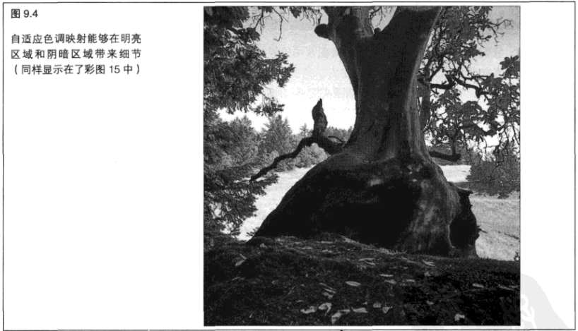

&emsp;&emsp;这里采用的过滤器核心和查询表方法只是众多方法中的一种。作为练习，我们可以试着修改片段着色器，对曝光进行编程计算。

&emsp;&emsp;我们还可以使用 `HDR` 纹理的更低 `Mip` 贴图层次来确定附近区域的亮度。

&emsp;&emsp;好了,现在我们已经知道如何对 `OpenEXR` 文件进行图像处理了,但是在典型的 `OpenGL` 程序中这样做有什么好处呢?好处很多! `OpenEXR` 图像只是任意的照明 `OpenGL` 场景的代替品而已。现在很多 `OpenGL` 游戏和应用程序都将 `HDR` 场景和其他内容渲染到浮点缓冲区,然后再将结果在屏幕上显示。我们可以使用刚学到的用于在 `HDR` 渲染的方法，生成更多逼真的照明环境，并显示每个帧的动态范围和细节。

&emsp;&emsp;**向场景添加泛光**

&emsp;&emsp;`HDR` 渲染所涉及的不仅仅是浮点缓冲区,实际上,这只是个开始。

&emsp;&emsp;有了这种额外的精度,所有类型的效果都可能达到。现在我们已经开始了解浮点缓冲区能够做什么,我们再增加一种效果,让直接光照的场景更加真实。读者可能注意到了,太阳或者明亮的灯具有时候可能会吞没树枝或者其他位于我们和光源之间的物体。这种效果就叫做光源泛光。图 `9.5` 所示(也可以参见彩图 `1` )展示了光源泛光是如何影响室内场景的。

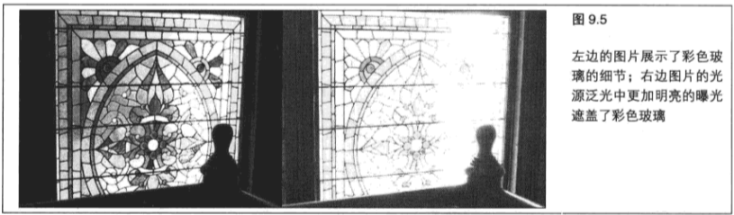

&emsp;&emsp;请注意,我们在图 `9.5` 所示左边的低曝光图片中能够看到所有的细节。右边图片的曝光要强得多,彩色玻璃中的线条被光源泛光覆盖了。甚至是右下角的木头柱子看起来也变小了,因为它也被泛光覆盖了。,通过向场景中添加泛光,可以在特定区域增强亮度感。我们可以模拟这种由明亮的光源所产生的泛光效果。虽然我们也可以使用 `8` 位精度的缓冲区来实现这种效果,但在 `HDR` 场景中使用浮点缓冲区效果要好得多。

&emsp;&emsp;第一步要绘制到我们在 `HDR` 中的场景。对于 `hdr_bloom` 示例程序来说,我们设置了一个绑定了两个浮点纹理的 `FBO` 。场景会像通常一样渲染到第一个绑定的纹理。

&emsp;&emsp;但是第二个绑定的纹理则只接受视野中的明亮区域。为了提高效率,示例程序 `hdr_bloom` 从一个着色器中通过一次传递对两个纹理进行填充,如程序清单 `9.5` 所示。明亮区域的数据用来生成泛光效果。泛光等级可以通过一个统一值进行调整。为了对明亮区域进行过滤,首先要对所有低于截断值的片段应用截断( `cutoff` ),从而将它们归零。然后剩下的片段将被缩放到 `0.0` 到 `0.1` 之间,对应亮度等级 `0.0` 到 `0.5` ,任何高于 `0.5` 的值都会被截取到 `1` 。

```C++
#version 150
// tex replace.fs
// 使用纹理普换輸出一个颜色值
//

varying vec2 vTexCoord;
uniform sampler2D textureUnit0;
uniform vec4 vColor;
out vec4 oColor;
out vec4 oBright;

void main(void)
{
    const float bloomLimit = 1.0;
    oColor = vColor * texture(textureUnit0, vTexCoord);
    oColor.a = 1.0;
    vec3 brightColor = max(vColor.rgb - vec3(bloomLimit), vec3(0.0));
    float bright = dot(brightColor, vec3(1.0));
    bright = smoothstep(0.0, 0.5, bright);
    oBright.rgb = mix(vec3(0.0), vColor.rgb, bright).rgb;
    oBright.a = 1.0;
}
```

&emsp;&emsp;在完成以上工作之后，结果得到的亮度等级（在 `0.0` 到 `0.5` 之间）将与原来的颜色进行混合。这就是说，混合操作的结果将是一个介于( `0` , `0` , `0` )和原始颜色之间的颜色值，具体值根据亮度值而定。最后，亮度传递缓冲区将由只出现在屏幕中明亮区域的 `0.0` 之外的值进行填充，这些值以浮点格式进行存储。

&emsp;&emsp;现在场景已经进行了渲染，但要完成亮度传递，我们还有一些工作要做。亮度数据必须进行模糊，才能实现泛光效果。为了完成这项工作,我们创建 `4` 个浮点纹理,其中第一个纹理的宽度和高度是屏幕的三分之一,而每个后续的纹理都是前一个纹理的三分之一。我们通过执行一个原始图像的高斯模糊( `Gaussian blur` )来对第一个纹理进行渲染。第二个纹理通过对第一个纹理进行高斯模糊而进行绘制,所有 `4` 个纹理依此类推。示例程序使用程序清单 `9.6` 中列出的着色器来应用模糊,这个着色器将在输入的纹理上运用一个 `5x5` 卷积内核( `convolution kernel` ),并将最接近的24个纹理单元的结果进行组合以创建一个新值。

```C++
#version 150
//f blur.fs
// 使用输入纹理的高斯模糊输出一个颜色值
//

in vec4 vFragColor;
in vec2 vTexCoords;

uniform sampler2D textureUnit0;
uniform vec2 tc_offset[25];

out vec4 oColor;

void main(void)
{
    vec4 sample[25];
    for (int i = 0; i < 25; i++)
    {
        sample[i] = texture(textureUnito, vTexCoords.st + tc_offset[i]);
    }
        
    // 1 4  7  4  1
    // 4 16 26 16 4
    // 7 26 41 26 7 / 273
    // 4 16 26 16 4
    // 1 4  7  4  1
    
    oColor = (
        (1.0 * (sample[0] + sample[4] + sample[20] + sample[24])) + 
        (4.0 * (sample[1] + sample[3] + sample[5] + sample[9] + 
        sample[15] + sample[19] + sample[21] + sample[23])) + 
        (7.0 * (sample[2] + sample[10] + sample[14] + sample[22])) +
        (16.0 * (sample[6] + sample[8] + sample[16] + sample[18])) + 
        (26.0 * (sample[7] + sample[11] + sample[13] + sample[17])) + 
        (41.0 * sample[12])
        ) / 273.0;
}
```

&emsp;&emsp;在模糊传递完成后,模糊结果将与场景中的完整颜色纹理进行组合,以生成最终结果。在程序清单 `9.7` 中，我们能从 `5` 个纹理中看到最终的着色器示例效果： 完整彩色纹理、亮度传递和亮度传递的 `4` 个渐进模糊版本。亮度传递和模糊结果相加到一起,以形成泛光效果,再乘以一个用户控制的统一值。我们可以按键盘上向右的方向键放大泛光效果,也可以按向左的方向键进行缩小。最终的HDR颜色结果随后将进行曝光计算,这些计算我们应该已经在上一个示例程序中很熟悉了。

```C++
#version 150
// hdr_exposure.fs
// 从浮点模糊纹理中应用模糊效果
// 根据指定曝光将浮点纹场景缩放到0.0-1.0范围内
//

in vec2 vTexCoord;

uniform sampler2D origImage;
uniform sampler2D brightImage;
uniform sampler2D blurl;
uniform sampler2D blur2;
uniform sampler2D blur3;
uniform sampler2D blur4;

uniform float exposure;
uniform float bloomLevel;

out vec4 oColor;
out vec4 oBright;

void main(void)
{
    // 从 HDR 和模糊纹理中获取
    vec4 vBaseImage = texture(origImage, vTexCoord);
    vec4 vBrightPass = texture(brightImage, vTexCoord);
    vec4 vBlurColor1 = texture(blur1, vTexCoord);
    vec4 vBlurColor2 = texture(blur2, vTexCoord);
    vec4 vBlurColor3 = texture(blur3, vTexCoord);
    vec4 vBlurColor4 = texture(blur4, vTexCoord);
    vec4 vBloom =   vBrightPass + 
                    vBlurColor1 +
                    vBlurColor2 +
                    vBlurColor3 +
                    vBlurColor4;
                    
    vec4 vColor = vBaseImage + bloomLevel * vBloom;
    
    // 将曝光应用到这个纹理单元
    vColor = 1.0 - exp2(-vColor * exposure);
    oColor = vColor;
    oColor.a = 1.0f;
}
```

&emsp;&emsp;程序清单 `9.7` 中展示的曝光着色器用来将一个屏幕大小的纹理四边形绘制到窗口。好了!我们可以调整泛光效果,以达到理想的状态。图 `9.6` 所示展示了低泛光等级和高泛光等级的 `hdr_bloom` 示例程序。尝试使用一个单个 `Mip` 贴图纹理而不是一组 `4` 个混合纹理来对程序进行修改。

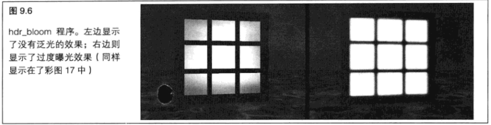

&emsp;&emsp;**浮点深度缓冲区**

&emsp;&emsp;我们不仅可以对颜色数据使用浮点格式，还可以对深度数据使用浮点格式！典型情况下深度缓冲区的深度是 `24` 位,为我们提供了 `16777216` 种可能的深度值,这些深度值通常会缩放到 `0.0` 到 `1.0` 之间。坦白地说,这看起来好像已经很多了!但使用定点数据格式作为缓冲区存在更大的问题,就是每次增加深度值都是增加同样的大小。我们可能会有一个批次的几何图形,它们都落在同一个深度值上,这是因为我们对几何图形进行了分层,或者因为我们最终只使用了整个深度范围中一个很小的部分。这种情况可能导致z冲突、低分辨精度或其他不确定行为。

&emsp;&emsp;浮点深度缓冲区可以帮助我们解决一些类似的问题。在这种情况下我们不必再受限于固定增量，写入到浮点深度缓冲区的临近几何图形拥有的回旋余地要大得多。如图 `9.7` 所示,我们就能了解这种效果是如何实现的。这种附加的精度可能在很多情况下都有帮助，特别是在处理阴影区时。

&emsp;&emsp;但是，虽然浮点深度缓冲区非常好用，最好也不要随处使用它们。和其他定点格式相比，浮点缓冲区可能会占用更多的空间,也可能导致 `GPU` 的读取和写入速度变慢。对于许多传统应用来说,固定精度通常就足够了。

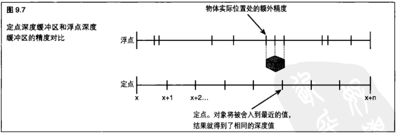

&emsp;&emsp;即使在浮点深度缓冲区中,如果几何图形距离太近的话,还是可能遇到 `z` 冲突问题。但是既然浮点深度缓冲区并不只局限于从 `0.0` 到 `1.0` 的范围内,那么有一种方式可以帮助我们避免浮点深度缓冲区中的 `2` 冲突问题,这就是将几何图形进行伸展。我们可以超越典型的 `0.0-1.0` 范围,充分利用浮点存储方式。

&emsp;&emsp;`OpenGL` 为我们提供了可以在其中进行渲染的裁剪区( `clip volume` )。落在裁剪区外面的几何图形将被“裁剪掉”，而不会进行光栅化。为了渲染到显示的窗口中，裁剪区通常由这个窗口的顶部、右侧、底部和左侧边缘构成。另外还有一个近端面和远端面。如果一个对象太近或者太远,那么它将不会进行绘制。远端面能够帮助我们避免对太远的几何图形进行绘制,这些几何图形甚至比一个像素还要小。但是还有一些情况(例如阴影区)下,我们需要所有深度数据,无论多远或者多近。要做到这一点,可以通过调用 `glDisable(GL_DEPTH_CLAMP)` 来关闭深度裁剪,这样就会忽略近端和远端裁剪面上的所有裁剪。深度裁剪在默认情况下是关闭的。

> 9.3.2 多重采样

&emsp;&emsp;有时候一次采样是不够的!在很多情况下,我们以一个与屏幕空间垂直方向或平行方向成很小角度的方向绘制直线时,会生成一个锯齿状的边缘,因为这个边缘只穿过了有限的几行或者几列像素。以我们在图 `9.6` 中看到的 `hdr_bloom` 示例程序中的窗口顶部为例。窗口的顶部已经被光栅化,窗口从第x行像素开始,但是它最终持续延伸到第 `x+1` 行。这种称为锯齿的效果是不美观的、不真实的,也是我们不愿意看到的。

&emsp;&emsp;多重采样会为每个像素位置在稍有不同的位置生成几个片段,这些片段称为亚像素( `subpixel` )。这置些亚像素还必须先进行“解析”,然后才能显示。对一个多重采样缓冲区进行解析,就是将所有亚像素一起进行平均,以确定最终的像素颜色。以如图 `9.8` 所示的线为例,对于右边直线上的每个像素来说,某些样本将落到边缘上，而另外一些则不会。随后当所有亚像素一起进行平均化时，边缘两边的像素颜色会显示出这条边缘中多大一部分穿过了这些像素。这样我们得到的就是一个非常平滑的过渡,而不再是参差不齐的锯齿状边缘。采用同样的方式,不靠近边缘的像素也可以通过多重采样得到加强,最终的颜色会比单独采样达到的最好结果更加接近真实情况。

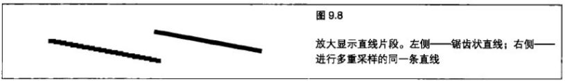

&emsp;&emsp;亚像素的位置并不是有规律分布的。取而代之的是，亚像素位置是在像素区城进行伪随机( `pseudorandomly` )分布的。这种方式增强了多重采样的抗锯齿效果。图 `9.9` 所示展示了 `2x` 、 `4x` 和 `8x` 抗锯齿中亚像素的可能位置。

&emsp;&emsp;我们可以通过调用 `glGetMultisamplefv` 获取每个亚像素的实际位置。首先,调用带有 `GL_SAMPLES` 枚举值的 `glGetintegerv` 查出当前帧缓冲区一共有多少样本。

```C++
//获取每个多重采样亚像素的位置
int sampleCount0;
glGetIntegerv(GL_SAMPLES, ssampleCount);
float positions[64];
// 至少足以处理 32 个样本
for(int i = 0; i < sampleCount; i++)
{
    glGetMultisamplefv(GL_SAMPLE_POSITION, i, spositions[i*2]);
}
```

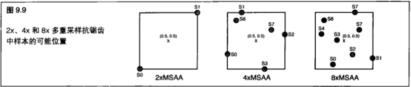

&emsp;&emsp;`OpenGL` 允许我们使用几种支持多重采样的表面。第一种就是窗口表面本身。我们将在第 `13` 章、第 `14` 章和第 `15` 章学习如何创建多重采样窗口,这些章节对操作系统相关的窗口管理细节进行了讨论。第二种就是渲染缓冲区。我们可以使用 `glRenderBufferStorageMultisample` 为一个多重采样的 `RBO` 创建存储。类似地,我们还可以通过使用 `glTeximage2DMultisample` 和 `glTeximage3DMultisample` 创建多重采样纹理。

```C++
glGenTextures(1, hdrTextures);
qlBindTexture(GL_TEXTURE_2D_MULTISAMPLE, hdrTextures[0]);
glTexImage2DMultisample(GL_TEXTURE_2D_MULTISAMPLE, 8, GL_RGB16F, screenWidth, screenHeight, GL_FALSE);
```

&emsp;&emsp;这里需要注意的重要部分是 `MSAA` 纹理的新纹理目标。当绑定一个 `MSAA` 纹理时,必须使用 `GLTEXTURE_2D_MULTISAMPLE` 代替 `GL_TEXTURE_2D` 。对于多重采样数组,可以使用 `GL_TEXTURE_2D_MULTISAMPLE_ARRAY` 目标。

&emsp;&emsp;现在我们已经了解如何创建多重采样表面了,还需要了解关于在着色器中访问多重采样纹理的几件事情。过去的 `sampler2D` 无法完成这项工作，取而代之的是，我们要声明一个新的采样器，叫做 `sampler2DMS` 。然后,在片段着色器中,我们可以使用 `texelFetch()` 为一个片段获取任何给定的样本。 `texelFetch()` 采样函数要求我们指定一个整数片段位置,而不是提供 `0.0` 到 `1.0` 之间的纹理坐标。 `GLSL` 为我们提供了一个叫做 `textureSize()` 的函数,它可以弄清着色器中多重采样纹理的大小。

&emsp;&emsp;这样，我们就能将标准化纹理坐标转换成整数纹理坐标了。

```C++
// 从 HDR 和模糊纹理中获取
iTmp = textureSize(origImage);
tmp = floor(iTmp* vTex);
vec4 vBaseImage = texelFetch(origImage, ivec2(tmp), sampleNumber);
```

&emsp;&emsp;对多重采样缓冲区的解析接受所有样本，并创建一个最终的输出值。典型的解析函数可能会将每个样本的所有颜色加在一起,然后再除以样本数量。我们能够访问一个多重采样纹理的每一个样本,这使得我们可以创建自定义解析函数,而不必依赖默认函数。这在 HDR 渲染中尤其有用,因为我们可以在每个亚像素上应用色调映射,然后再执行一个解析操作,而不是只将所有东西加在一起丧失多重采样的所有优势。

&emsp;&emsp;在 `hdr_msaa` 示例程序中,我们使用一个熟悉的设置演示使用多重采样缓冲区带来的优势。首先，创建 `MSAA` 纹理，并将它绑定到 `MSAA` 纹理目标。然后，在程序清单 `9.8` 中，获取每个亚像素的位置，然后使用它们计算到中心的距离。这种信息用来创建加权值，这种加权值将在片段着色器中进行自定义着色器解析时被应用到每个亚像素上。

```C++
//将距离值相加,以充分利用加权计算
for(int i = 1; i < 8; i++)
{
    float totalWeight = 0.0f;
    for(int 1 = 0; j <= i; j++)
    {
        totalWeight += invertedSampleDistances[j];
    }
        
    // 转而获取用于每个样本的因子，所有样本的权重的和总为1.0
    float perSampleFactor = 1 / totalWeight;
    for(int j = 0; j <= i; j++)
    {
        sampleWeights[i][5] = invertedSampleDistances[j] * perSampleFactor;
    }
    
}

//设置一个纹理缓冲区对象来保存样本加权值
glGenBuffers(1, 6sampleWeightBuf);
glBindBuffer(GL_TEXTURE_BUFFER_ARB, sampleWeightBuf);
glBufferData(GL_TEXTURE_BUFFER_ARB, sizeof(float) * 8, sampleWeights, GL_DYNAMIC_DRAN);
glBindBuffer(GL_TEXTURE_BUFFER_ARB, 0);
```

&emsp;&emsp;现在到了设置程序和对象状态的时候了。我们可以将场景渲染到 `MSSA FBO` ,就像什么都没发生一样。 `GPU` 会自动生成所有亚像素,并在每个亚像素上调用片段着色器。当 `FBO` 中的场景完成时,程序将运行一个解析着色器进行色调映射并对多重采样缓冲区进行解析,以在窗口中进行显示。因为场景中的一部分是进行 `HDR` 渲染的,所以色调映射是一个非常重要的步骤。实际上,如果我们没有在着色器中进行解析,那么 `HDR` 值将严重歪曲硬件解析。这样做得到的结果就是,图像看起来比我们使用只有一个样本的缓冲区时锯齿更严重。

&emsp;&emsp;程序清单 `9.9` 展示了解析着色器。这里进行了两种不同类型的解析。第一种解析是简单的平均化,即将所有样本相加到一起,然后再除以样本数量。这个值将存储在 `vColor` 。另一种解析是通过每一个样本乘以一个加权值完成,这个加权值根据样本位置得到。这个值存储在 `vWeightedColor` 中。使用者可以决定显示哪种解析,通过按 `W` 键选择加权解析,或者按 `Q` 键选择直接平均解析。

```C++
#version 150
// hdr_exposure.fs
// 根据指定曝光将浮点纹理缩放到0.0-1.0范围内
// 根据输入样本计数对多重呆样缓冲区进行解析
//

in vec2 vTexCoord;

uniform sampler2DMS origImage;
uniform samplerBuffer sampleWeightSampler;
uniform int sampleCount;        // 0-based, 0-1sample, 1-2samples等
uniform int useWeightedResolve: // 0-false, 1-true
uniform float exposure;

out vec4 oColor;

// 在一个独立的函数中进行所有色调映射
vec4 toneMap(vec4 vHdrColor)
{
    vec4 vLdrColor;
    vLdrColor = 1.0 - exp2(-vHdrColor * exposure);
    vLdrColor.a = 1.0f;
    return vLdrColor;
}

void main(void)
{
    // 计算整数纹理坐标
    vec2 tmp = floor(textureSize(origImage) * vTexCoord);
    
    // 查找加权颜色和未加权颜色
    vec4 vColor = vec4(0.0, 0.0, 0.0, 1.0);
    vec4 vWeightedColor = vec4(0.0, 0.0, 0.0, 1.0);
    for(int i = 0; i <= sampleCount; i++)
    {
        // 从 texBo 获取这个样本的加权值，根据样本的数量而变化
        float weight = texelFetchBuffer(sampleWeightSampler,i).r;
        // 在进行加权值前对HDR纹理单元进行色调映射
        vec4 sample = toneMap(texelFetch(origImage, ivec2(tmp), i));
        vWeightedColor += sample * weight;
        vColor += sample;
    }

    // 现在,确定将要执行的解析类型
    oColor = vWeightedColor;
    
    // 如果用户选择非加权解析,则输出平均加权值
    if(useWeightedResolve != 0)
    {
        oColor = vColor / (sampleCount + 1);
    }
    oColor.a = 1.Of;
}
```

&emsp;&emsp;用户还可以对用于执行解析的样本数量进行配置。我们可以使用从 `1` 到 `8` 的数字键来选择解析中使用的样本数量。图 `9.10` 所示(也可以参见彩图 `18` )展示了单个采样和 `8` 次采样之间的区别。使用多重缓冲区能够对场景质量产生重大的影响。

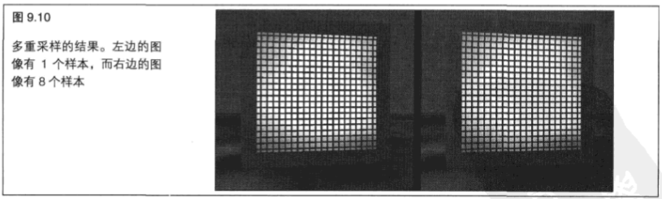

> 9.3.3 整数

&emsp;&emsp;`GLSL` 开始的时候使用许多特有的数据类型,这些数据类型并不严格遵守 IEEE 对浮点数的标准和对 `CPU` 中常用数据类型的其他工业标准。但是最近这些格式进行了很大程度的标准化。我们不仅可以在着色器中使用浮点数据并希望他们的表现和在 `CPU` 中相同,还可以使用其他数据类型,例如整数和无符号整数。

&emsp;&emsp;同时还出现了新的纹理格式，以满足着色器的迫切需求。我们可以使用大量不同的整数格式创建纹理，这些格式既有有符号的,也有无符号的。它们的使用范围从一个通道(只有 `R` )到所有 `4` 个通道( `RGBA` ),可以包含的精度从每通道 `8` 位到每通道 `32` 位。几乎所有整数纹理所需要的格式都存在。除了纹理之外， `RBO` 也可以通过整数格式创建。我们可以对一个绑定到 `PBO` 的基于整数的缓冲区进行清除,对于整数缓冲区可以调用 `glClearBufferiv` ,而对于无符号整数缓冲区则可以调用 `glClearBufferuiv` 。

&emsp;&emsp;为什么说整数和无符号整数格式很重要呢?首先,我们现在可以通过纹理和统一值将整数发送到着色器,这些整数可以是大于 `255` 的。着色器还允许我们访问一个按位进行的方法中整数纹理中的数据,允许我们以任何希望的方式进行封装。在对大量已经渲染的几何图形(例如由大量树木组成的森林)进行修改时,整数缓冲区和纹理可以用于检索或选择。为了访问整数纹理的独立纹理单元,可以在 `GLSL` 着色器中使用 `texelFetch` 命令。

&emsp;&emsp;这个示例函数接受一个整数向量来指定一个纹理中的一个位置，所以我们可以确定获得的是哪个纹理单元，还可以将整数数据绑定到纹理缓冲区对象。

&emsp;&emsp;增加整数格式最重要的原因就是,这些整数格式在着色器中创造了真正灵活和并行的计算环境。我们可以加载浮点格式或整数格式的任意纹理数据,并且可以执行需要的任何计算,例如物理计算、图像处理、建模以及各种需要高度并行处理的计算相关工作。这种通用计算( `General Purpose Computing` )常常称为 `GPGPU` ,它确实为我们打开了一扇大门,使 `GPU` 能够在创纪录的短时间内完成大量工作。

> 9.3.4 sRGB

&emsp;&emsp;`RGB` 颜色空间足以满足需求的时代已经一去不复返了。现在我们可以使用超级 `RGB` 了!实际上它的名称是 `sRGB` ,但是它比我们在过去的 `20` 年中已经习惯的传统 `RGB` 颜色空间要强大得多。即使 `RGB` 在计算机图形中是最通用的颜色空间，还是有各种因素会制约它到底还能走多远。

&emsp;&emsp;人类眼睛的灵敏度比 `RGB` 颜色空间中所能显示的灵敏度要高得多。

&emsp;&emsp;`RGB` 颜色空间使用从 `0` 到 `1` 的值，但是对最终结果应用了一种线性伽玛渐变，扩展了它能够显示的颜色范围。 `sRGB` 光谱中更深的颜色使用一个接近 `2.2` 的伽玛值,但是在更亮的区域使用一个达到 `2.4` 的扩展伽玛值。这就意味着 `sRGB` 格式有一个内建的扩展动态范围。 `sRGB` 最初是为了在图像和照片处理中用来帮助在办公室和暗房这样的典型观察环境中更好地映射和显示颜色而创建的。

&emsp;&emsp;当我们在 `OpenGL` 中使用一个 `sRGB` 纹理时，在纹理被采样时 `sRGB` 格式将被转换成 `RGB` 格式。但是只有 `RGB` 分量会被转换，而 `alpha` 分量则保持不变。

&emsp;&emsp;每个分量都会根据下列规则而独立进行转换。

&emsp;&emsp;如果纹理单元值小于或等于 `0.04045` ,那么实现将使用如下方式进行转换。

&emsp;&emsp;如果纹理单元值大于 `0.04045` ,样本将进行如下转换。

&emsp;&emsp;渲染缓冲区还支持 `sRGB` 存储格式,尤其是必须支持 `GL_SRGB8_ALPHA8` 格式。这意味着我们可以将带有内部 `sRGB` 格式的 `RBO` 和纹理绑定到一个帧缓冲区对象上,然后再对它们进行渲染。因为我们刚刚讨论了 `sRGB` 格式是怎样非线性的,所以读者可能也不希望对 `sRGB FBO` 的写入是线性的,因为这将使整个目标化为泡影。好消息是,  `OpenGL` 能够在调用 `glEnable(GL_FRAMEBUFFER_SRGB)` 时自动将着色器输出的线性颜色值转换成 `sRGB` 值。请记住,这种方法只适用于包含一个 `sRGB` 表面的绑定。我们可以调用带有 `GL_FRAMEBUFFER_ATTACHMENT_COLOR_ENCODING` 值的 `glGetFramebufferAttachmentParameteriv` 来查询绑定的表面是否是 `sRGB` 。如果是 `sRGB` 表面则返回 `GL_SRGB` ,而其他表面则返回 `GL_LINEAR` 。这种对于片段颜色( `fc` )的变换遵循表 `9.3` 中列出的方程式。

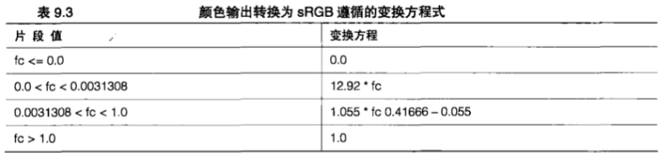

> 9.3.5 纹理压缩

&emsp;&emsp;新的格式使 `OpenGL` 更加有用、更加灵活,而纹理压缩则甚至在现代 `GPU` 可以应用吉比特级内存的条件下也非常有帮助。纹理可能会占用数量惊人的空间!某些现代游戏在特定的级别下能够轻易地使用 `1G` 比特的纹理数据。这实在是很大的数据量!我们要把它放在哪里呢?对于创建丰富的、真实的和令人印象深刻的场景来说,纹理单元是一个重要的组成部分,但是如果我们无法将所有数据加载到GPU的话,那么渲染将会非常慢(如果不是不可能完成的话)。解决大量纹理数据的存储和使用的一种方法是将这些数据进行压缩。

&emsp;&emsp;`OpenGL` 实现至少会支持表 `9.4` 中列出的压缩方案,其中一个方案是 `RGTC` (红-绿纹理压缩), `RGTC` 格式将一个纹理图像分解成 `4x4` 纹理单元块,使用一系列的代码将独立的通道压缩到这个块中。这种压缩模式只适用于一个或两个通道的有符号和无符号纹理。我们不需要担心具体的压缩方案,除非打算编写道一个压缩程序。我们只要注意使用 `RGTC` 所节省的空间是 `50%` 就可以了。

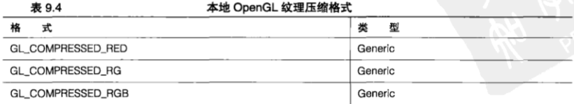<br>
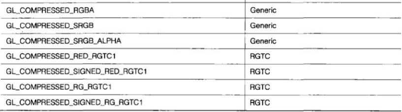<br>

&emsp;&emsp;表 `9.4` 中列出的前 `6` 种格式是通用的,允许 `OpenGL` 驱动程序决定使用哪种压缩机制。这就意味着驱动程序能够使用最适合当前情况的格式。美中不足的是,这种方式是与实现相关的,并且不能移植。

&emsp;&emsp;实现可能还会支持其他压缩格式,例如 `ETC1` 和 `S3TC` 。

&emsp;&emsp;我们应该首先查询 `OpenGL` 没有要求的格式的适用性,然后再尝试使用它们。最好的方式就是查询对相关扩展名的支持，后面在第 `13` 章、第 `14` 章和第 `15` 章，我们将学习更多相关内容。

&emsp;&emsp;**使用压缩**

&emsp;&emsp;我们可以在加载一个纹理的时候要求 `OpenGL` 对它进行压缩。我们所要做的只是将内部格式请求为一种压缩格式。 `OpenGL` 将接受未经压缩的数据，并在加载纹理图像时对数据进行转换。在压缩纹理和未经压缩纹理的使用方式上没有什么区别。 `GPU` 会在从纹理上进行采样时处理这种转换。很多用于创建纹理和其他图像的图像工具允许我们将数据直接保存为压缩格式。

&emsp;&emsp;一旦使用某种非通用压缩内部格式加载了一个纹理，我们就可以通过调用 `glGetCompressedTexImage` 获取经过压缩的图像。只要挑选我们感兴趣的纹理目标和 `Mip` 贴图层次就好。因为我们可能并不清楚图像是如何压缩的或者使用的是什么格式,所以应该检查图像大小来确保我们有足够的空间可以容纳整个表面。

```C++
GLint imageSize = 0;
glGetTexParameteri(GL_TEXTURE_2D, TEXTURE_COMPRESSED_INAGE_SIZE, &imageSize);
void *data = malloc(imageSize);
glGetCompressedTexImage(GL_TEXTURE_2D, 0, data);
```

&emsp;&emsp;要加载压缩纹理图像,我们可以使用专用纹理加载函数: `giCompressedTeximage1D` 、 `glCompressedTexlmage2D` 和 `glCompressedTexlmage3D` 。

&emsp;&emsp;使用这些函数的方式与使用 `glTexlmage1D` , `glTexlmage2D` 等的方式相同。

&emsp;&emsp;我们还可以通过 `glCompressedTexSubimage1D` 、 `giCompressedTexSublmage2D` `或glCompressedTexSublmage3D` 来更新压缩纹理图像。

&emsp;&emsp;**共享指数**

&emsp;&emsp;虽然在真正意义上的场景中,共享指数在技术上并不是一种压缩格式,但它们确实允许我们使用浮点纹理数据时节省存储空间。

&emsp;&emsp;共享指数对整个纹理单元使用同样的指数值,而不是为 `R` 、 `G` 和 `B` 值各保存一个指数。每个值的小数和指数部分都会以整数形式进行存储,然后在对纹理采样时将它们组合到一起。

&emsp;&emsp;对于 `GL_RGB9_E5` 格式，有 `9` 位用于存储每种颜色， `5` 位用于存储所有通道的通用指数。这种格式将 `3` 个浮点值封装到 `32` 位中,节省了 `67%` 的空间!为了利用共享指数,我们可以直接以这种格式从内容创建工具中获取数据，或者编写一个能够将浮点 `RGB` 值压缩到共享指数格式的转换器。

&nbsp;

## 9.4 小结

&emsp;&emsp;`OpenGL` 的功能远远超出了我们最早在第 `8` 章中看到的基本帧缓冲区访问的范围。在本章，我们学习了片段着色器的逻辑名是如何使用的，以及这些名称如何映射到输出索引。 然后体验了浮点缓冲区的强大,以及它们是如何加强场景的真实性。

&emsp;&emsp;浮点深度缓冲区在提供额外精度上发挥了作用,而多重采样缓冲区则使得片段着色器能够直接进行样本级访问。

&emsp;&emsp;我们着实花费了一些时间来了解多重采样抗锯齿,以及如何使用它提高我们的输出质量。我们学习了如何在片段着色器中直接对多重采样缓冲区的每个样本进行访问。我们还了解了整数纹理是如何用于提供着色器功能更简单的外部索引,以及如何在着色器单元中开启通用计算。最后,我们探索了以 `sRGB` 格式存储纹理和缓冲区数据、压缩和共享指数的新方法,它们提供了更加真实的颜色映射,并有助于节省存储空间。
