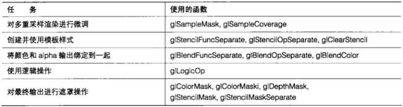
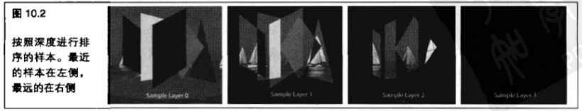
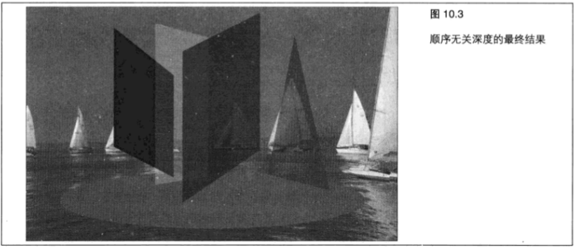

# 片段操作



&emsp;&emsp;在学过前 `9` 章的内容之后，我们应该可以非常熟练地使用顶点和片段着色器来根据几何图形生成输出了。但是当片段着色器完成之后会发生什么呢?所有这些片段都去了哪里呢?实际情况是,这些片段在最终到达缓冲区或者窗口中的目的地之前，还要经历几个步骤。

&emsp;&emsp;本章将学习 `OpenGL` 管线中的最后几个步骤,即逐片段操作。

&emsp;&emsp;我们从整个过程的第一步——裁剪测试开始，对一个虚拟片段进行多重采样操作、模板测试、深度缓冲区测试、混合、抖动和逻辑操作等操作。图 `10.1` 所示显示了一个片段在所有阶段都启用时所遵循的路径。


&nbsp;

## 10.1 裁剪

&emsp;&emsp;将这些片段发送到最终目的地的第一步是,决定是否将它们放在一个从可渲染区域中裁剪出来的区域中,裁剪操作是在窗口坐标中执行的,这就意味着所有输入片段都有一个位于 `(0, 0)` 和 `(width, height)` 之间的窗口坐标,其中 `width` 和 `height` 是窗口的维度。

&emsp;&emsp;应用程序可以定义一个剪切面，它会对几何图形的某些部分进行裁剪。这种操作是通过指定 `×` 值的一对最大值和最小值，以及y值的一对最大值和最小值来实现的。我们可以通过调用 `glScissor` 来设置一个裁剪区域。

```C++
void glScissor(GLint left, Glint bottom, sizei width, sizei height);
```

&emsp;&emsp;必须通过调用 `glEnable(GL_SCISSOR_TEST)` 启用裁剪测试,才能启用裁剪。如果片段的窗口坐标落在由裁剪定义的区域中，那么片段将继续留在管道中。否则就会被丢弃。

&emsp;&emsp;另一种表达这种操作的方法是通过两个使用传递到 glScissor 的值的方程式。如果 `left <= xw < (left + width)` 并且 `bottom <= yw < (bottom + height)` ,那么测试通过。

&emsp;&emsp;我们在第 `3` 章已经学习了裁剪测试。如果对裁剪操作的记忆已经有些模糊了的话,可以回过头再复习一下。

&nbsp;

## 10.2 多重采样

&emsp;&emsp;执行了裁剪操作之后,在管线中要进行的下一步工作就是多重采样。我们在第 `9` 章已经对多重采样有了初步的了解。现在让我们进一步了解如何对多重采样的具体细节进行控制。

&emsp;&emsp;请记住，多重采样阶段可以为任何给定像素生成多重子样本，这在一个像素恰好落在线或多边形边缘时可能会尤其有用。一个缓冲区的样本数是在进行分配时确定的。对于窗口表面来说,我们必须在选择一个像素格式或配置时指定采样数。对于帧缓冲区来说,我们可以在创建绑定到帧缓冲区的纹理和渲染缓冲区时选择样本数。请注意,所有帧缓冲区绑定的样本数都必须是相同的。

&emsp;&emsp;在第 `9` 章,我们还学习了如何通过调用 `glGetMultisamplefv` 获取像素中每个亚像素样本的位置。现在让我们了解一下如何对这些亚像素进行控制。

&emsp;&emsp;这里有两个可以控制的步骤,能够影响多重采样的处理方式:修改覆盖值和对样本进行掩码操作。

> 10.2.1 样本覆盖

&emsp;&emsp;这里的“覆盖”是指一个亚像素“覆盖”了多大区域。我们可以将一个片段的 `alpha` 值直接转换成一个覆盖值,来确定帧缓冲区的多少个样本将被这个片段更新。我们通过调用 `glEnable(GL_SAMPLE_ALPHA_TO_COVERAGE)` 来完成这项工作。

&emsp;&emsp;一个片段的覆盖值用于确定将写入多少子样本。举例来说，一个 `alpha` 值为 `0.4` 的片段应该生成一个 40% 的覆盖值。对于一个 `8` 样本的 `MSAA` 缓冲区来说，这些像素中将有 `3` 个将被写入。

&emsp;&emsp;因为这个 `alpha` 值已经用于确定应该写入多少个子样本,那么将这些子样本与同一个 `alpha` 值进行混合就没有意义了。毕竟,使用" `alpha` 覆盖”是一种进行混合的方法。为了帮助防止这些亚像素在启用混合的时候也被进行混合,我们可以通过调用 `glEnable(GL_SAMPLE_ALPHA_TO_ONE)` 将这些样本的 `alpha` 值强制设定为 `1` 。

&emsp;&emsp;使用“ `alpha` 覆盖”的方法相对于简单的混合来说有几个优点。在对多重采样缓冲区进行渲染时， `alpha` 混合通常会同等地应用在整个像素上。使用“ `alpha` 覆盖”方法, `alpha` 遮罩的边缘将是抗锯齿的，将产生更加自然和平滑的结果。这在绘制灌木丛、树木或者刷子上部分 `alpha` 透明的浓密刷毛时尤其有用。

&emsp;&emsp;`OpenGL` 还允许我们通过调用 `glSampleCoverage` 手动设置样本覆盖。我们要为一个在应用“ `alpha` 覆盖”遮罩后出现的像素手动应用一个覆盖值。为了使这一步生效,必须通过调用 `glEnable(GL_SAMPLE_COVERAGE)` 启用样本覆盖。 

```C++
glSampleCoverage(clampf value, Boolean invert) 
```

&emsp;&emsp;传递到 `value` 参数的覆盖值可以在 `0` 到 `1` 之间。如果结果得到的遮罩应该进行反转,那么 `invert` 参数将被标记到 `OpenGL` 。例如,如果绘制两颗重叠的树,其中一棵覆盖 `60%` ,而另一棵覆盖 `40%` ,那么我们将希望对其中一个覆盖值进行反转以确保两次绘制调用不会使用同一个遮罩。

```C++
glSampleCoverage(0.5, GL_FALSE);
// 绘制第一组几何围形
glSampleCoverage(0.5, GL_TRUE);
// 绘制第二组几何围形
```

> 10.2.2 样本遮罩

&emsp;&emsp;多重采样阶段的最后一种可配置选项是样本遮罩。这一步允许我们使用 `glSampleMaski` 函数将特定样本屏蔽掉。和前面的阶段不同,我们可以确切地指定将要关闭的样本。请记住,“ `alpha` 覆盖”方法和样本覆盖会影响哪些样本将在到达这一阶段之前被启用。这就意味着这一阶段的样本遮罩并不保证样本将会被启用。

```C++
glSampleMaski(GLuint maskNumber, GLbitfield mask);
```

&emsp;&emsp;从本质上说, `mask` 参数是一个 `32` 位的像素样本遮罩,其中 `0` 位映射到样本 `0` ,  `1` 位映射到样本 `1` ,依此类推。我们可以使用 `maskNumber` 来对超出前32位的位进行寻址,其中每个增加的遮罩值代表另外增加的 `32` 位。

&emsp;&emsp;我们可以查询 `GL_MAX_SAMPLE_MASK_WORDS` 来检查到底能够支持多少个遮罩。在撰写本文时，实现只支持一个字，考虑到没有哪个实现支持每个像素多于 `32` 个样本,这种设置是有道理的。

&emsp;&emsp;还用另一种方法可以修改样本遮罩。我们可以写入到一个片段着色器中内建的 `gl_SampleMask[]` 输出数组，来设置着色器中的遮罩。

> 10.2.3 综合运用

&emsp;&emsp;这一章的示例程序 `oit` 绘制了一些半透明对象，形状就像一个彩色的玻璃风铃。当在 `OpenGL` 中绘制几个半透明表面时,简单地将它们混合到一起会产生错误的结果。让我们想象一下,如果绘制一个 `alpha` 值为 `0.5` 的对象,然后试图在它后面绘制另一个对象,其 `alpha` 值也为 `0.5` 。如果我们将深度测试保持为启用状态,那么作为深度测试失败的结果,后面的对象将被简单地丢弃;如果深度测试被关闭,那么后面的对象将简单地绘制在前面对象的前方,就像后面的对象是在前面一样。在本章后面内容中,我们将深入地讨论更多关于混合的细节。

&emsp;&emsp;为了克服这种混合缺陷,我们需要使用顺序无关透明度( `Order Independent Transparency` ),简称 `OIT` 。大多数对透明几何图形进行正确渲染的算法都要按照深度对将要进行渲染的对象进行排序,首先对距离最远的对象进行渲染。这样做是非常复杂和耗费时间的。更糟糕的是,在很多情况下这样做并不能得到正确的排序。

&emsp;&emsp;为了解决这个问题,我们使用样本遮罩将每次渲染传递存储到多重采样缓冲区的独立样本中。在场景进行渲染之后,这种解析操作会为每个像素将所有样本以正确的顺序组合在一起。现在就开始做吧。

&emsp;&emsp;第一步将所有几何图形绘制到一个多重采样帧缓冲区。程序清单 `10.1` 中的代码将对部分几何图形进行绘制。所有不透明的对象都被进行遮罩到样本 `0` ，每个半透明物体都使用样本遮罩来渲染到唯一的样本。


```C++
glSampleMaski(0, 0x01);
    glEnable(GL_SAMPLE_MASK);
    
    ...
    
    glBindTexture(GL_TEXTURE_2D, textures[1]);
    shaderManager.UseStockShader(GLT_SHADER_TEXTURE_REPLACE, transformPipeline.GetModelViewProjectionMatrix(), 0);
    bckgrndCylBatch.Draw();

    ...

modelViewMatrix.Translate(0.0f, 0.8f, 0.0f);
modelViewMatrix.PushMatrix();
    modelViewMatrix.Translate(-0.3f, 0.f, 0.0f);
    modelViewMatrix.Scale(0.40, 0.8, 0.40);
    modelViewMatrix.Rotate(50.0, 0.0, 10.0, 0.0);
    glSampleMaski(0, Ox02);
    shaderManager.UseStockShader(GLT_SHADER_FLAT, transformPipeline.GetModelViewProjectionMatrix(), vLtYellow);
    glass1Batch.Draw();
modelViewMatrix.PopMatrix();

modelViewMatrix.PushMatrix();
    modelViewMatrix.Translate(0.4f, 0.0f, 0.0f);
    modelViewMatrix.Scale(0.5, 0.8, 1.0);
    modelViewMatrix.Rotate(-20.0, 0.0, 1.0, 0.0);
    glSampleMaski(0, 0x04);
    shaderManager.UseStockShader(GLT_SHADER_FLAT, transformPipeline.GetModelViewProjectionMatrix(), vLtGreen);
    qlass2Batch.Draw();
modelViewMatrix.PopMatrix():

...
```

&emsp;&emsp;当所有的表面都各自绘制到唯一的样本位置时,它们必须进行组合。但是,使用常规的多重采样解析是做不到的!因此,我们使用程序清单 `10.2` 中的自定义解析着色器来代替。每个样本的颜色值和深度值首先被提取到一个数组中,然后进行分析以确定片段的颜色。

```C++
#version 150

// oitResolve.fs
//

in vec2 vTexCoord;

uniform sampler2DMS origImage;
uniform sampler2DMS origDepth;

out vec4 oColor;

void main(void)
{
    const int sampleCount = 8;
    vec4 vColor[sampleCount];
    float vDepth[sampleCount];
    intvSurforder[sampleCount];
    int i = 0;
    
    // 计算非标准化的纹理坐标
    vec2 tmp = floor(textureSize(origDepth) + vTexCoord);
    
    //首先获取样本数据并对表面顺序进行初始化
    for (i = 0; i < sampleCount; i++)
    {
        vSurfOrder[i] = i;
        vColor[i] = texelFetch(origImage, ivec2(tmp), i);
        vDepth[i] = texelFetch(origDepth, ivec2(tmp), i).r;
    }
        
    //对深度值进行排序,最大值在前面,最小值在后面
    //必须对数组进行(size^2-size）次遍历，或者如果在任何一次遍历显示所有样本都以正确的顺序排列的情况下可以提前退出
    for (int j = 0; j < sampleCount; j++)
    {
        bool bFinished = true;
        for (i = 0; i < (sampleCount - 1); i++)
        {
            float temp1 = vDepth[vSurfOrder[i]];
            float temp2 = vDepth[vSurfOrder[i + 1]];
            if (temp2 < temp1)
            {
                // 交换值
                int tempIndex = vSurfOrder[i];
                vSurfOrder[i] = vSurfOrder[i + 1];
                vSurfOrder[i + 1] = tempIndex;
                bFinished = false;
                if (bFinished)
                    j = 8; // 完成了。可以提前退出！
            }
            
            // 现在，按照从前到后的顺序将所有颜色相加应用 alpha 值
            bool bFoundFirstColor = false;
            vec4 summedColor = vec4(0.0, 0.0, 0.0, 0.0);
            for (i = (sampleCount - 1); i >= 0; i--)
            {
                int surfIndex = vSurfOrder[i];
                if (vColor[surfIndex].a > 0.001)
                {
                    if (bFoundFirstColor == false)
                    {
                        // 在第一种颜色上应用 100%
                        summedColor = vColor[surfIndex];
                        bFoundFirstColor = true;
                    }
                    else
                    {
                        //应用 alpha 值与使用 glBlendFunc(GL_SRC_ALPHA, GL_ONE_MINUS_SRC_ALPHA);时相同的颜色
                        summedColor.rgb =
                        (summedColor.rgb * (1 - vColor[surfIndex].a)) +
                        (vColor[surfIndex].rgb * vColor[surfIndex].a):
                    }
                }
            }
            
            oColor = summedColor;
            oColor.a = 1.0f;
        }
```

&emsp;&emsp;为了使透明度正确地工作,每一块几何图形的颜色都必须从后向前应用。要做到这一点,我们需要弄清楚哪个几何图形覆盖在另外的哪个几何图形上。这就意味着这些深度值必须进行解析和存储。我们将排序的结果存储在 `vSurfOrder` 数组中,准备在下一步使用。这个数组保存了指向样本数组的指针。索引 `0` 指向最近的样本,而索引 `1` 则指向除此之外下一个最近的样本,以此类推。对于只有一个或两个层次被绘制的位置，所有其他样本的颜色值和 `alpha` 值都为 `0` 。图 `10.2` 所示为排序的结果。在最左边是 `vSurfOrder[0]` 指向的最近的样本，第二个是 `vSurfOrder[1]` 指向的除上述样本之外最近的样本，以此类推。请注意,样本 `0` 包含了主要背景,因为没有什么与背景重叠。这样,背景就是最近的, `vSurfOrder` 中只有一个样本与之相关。对于这个应用程序来说,在任意给定的区域中最多只有 `4` 个重叠的几何图形。



&emsp;&emsp;现在我们已经知道每个样本的顺序,并由此知道了每个几何图形的顺序,我们可以正确地为每个几何图形应用透明度了。整个处理过程都可以通过在包含透明度数据的多重采样缓冲区中运行一个解析着色器来完成。要执行解析，着色器要在颜色数组 `vColor` 中根据 `vSurfOrder` 指定的顺序查询每个样本。然后，每种颜色都会应用到每个像素的总颜色中。新的顶层颜色将和它的 `alpha` 值相乘,然后再将已经存在的总颜色与“ `1` 减去输入 `alpha` 值”得到的结果相乘,再将两个乘积相加。

&emsp;&emsp;这种操作完全是在硬件中进行的，它为每个像素创建了透明颜色。最终的输出结果如图 `10.3` 所示(也可以参见彩图 `19` )。这些半透明的玻璃状物体进行渲染的顺序并不重要，最终结果会进行正确的混合。我们可以按键盘上向左的方向键和向右的方向键对 `oit` 程序中的场景进行旋转。请注意最接近我们的物体总是显示在顶部,即使在它们的渲染顺序并不改变的情况下也是如此。

&emsp;&emsp;我们也可以通过绑定到一个 `FBO` 的独立颜色缓冲区来使用相似的方法,但是很多实现都受绑定缓冲区数量的限制。使用多重采样缓冲区来完成顺序无关的透明度提供了简单的缓冲区访问,并且不会对正常的渲染过程产生明显的干扰。但是,这种方法还有一些限制因素。首先,只有数量有限的透明或交叉几何图形能够被渲染。在一个多重采样缓冲区只有这么多的样本。这就意味着包含成百上千可能重叠对象的复杂透明几何图形已经超出了这种方法的处理能力。另外,我们无法在为 `oit` 使用一个多重采样缓冲区的同时再进行多重采样渲染。但对于简单的 `oit` 情况来说,这种方法很好用,并不需要对几何图形进行预存储。



&nbsp;

## 10.3 模板操作

&emsp;&emsp;片段管线中的下一个步骤是模板测试。我们可以将模板测试想象成在一块硬纸板上裁剪下一个图案,然后再用这个镂空部分在墙上喷涂出这个图案。喷涂只能接触到墙壁上硬纸板被裁减掉的位置。如果我们有一个支持模板缓冲区的像素格式,就可以用类似的方式将我们绘制的图形在帧缓冲区中进行遮罩操作了。我们可以通过调用 `glEnable(GL_STENCIL_TEST)` 来启用模板操作。大多数模板缓冲区包含 `8` 位,但是一些配置可能会支持更少的位数。我们的绘制命令可以对模板缓冲区产生直接的影响，而模板缓冲区的值可以对我们绘制的像素产生直接的影响。为了控制与模板缓冲区的相互影响, `OpenGL` 提供了两个命令: `glStencilFuncSeparate` 和 `glStencilOpSeparate` 。 `OpenGL` 允许我们分别对前向几何图形和背向几何图形分别设置它们。

```C++
void glStencilFuncSeparate(GLenum face, GLenum func, GLint ref, Gluint mask);
void glStencil0pSeparate(GLenum face, GLenum sfail, GLenum dpfail, Glenum dppass):
```

&emsp;&emsp;首先看一下 `glStencilFuncSeparate` ,它控制着模板测试通过或失败的条件。我们可以为 `face` 传递 `GL_FRONT` , `GL_BACK` 或 `GL_FRONT_AND_BACK` ,表示哪个几何图形将受到影响。 `func` 的值可以是表 `10.1` 中的任何值。这些值描述在什么情况下几何图形将通过模板测试。 `ref` 值是一个参考值,它用来计算通过/失败的结果,而 `mask` 则允许我们控制参考值的哪些位和缓冲区进行比较。


&emsp;&emsp;下一个步骤是通过调用 `glStencilOpSeparate` 告诉 `OpenGL` 在模板测试通过或者失败时要做什么。这个函数接受 `4` 个参数，其中第一个参数指定哪个面将受到影响，后面的 `3` 个参数控制在模板测试执行之后会发生什么,它们可以是表 `10.2` 中的任意值。第二个参数 `sfail` 是在模板测试失败的情况下采取的动作。 `dpfail` 参数指定在深度缓冲区测试失败的情况下采取的动作,而最后一个参数 `dppass` 则指定在深度缓冲区测试通过的情况下采取的动作。


&emsp;&emsp;那么这到底是如何实现的呢?下面让我们来看看一个典型应用的简单示例,参见程序清单 `10.3` ,第一步是通过 `glClearStencil` 设置模板清除值,然后调用带有模板缓冲区位的清除操作,从而将模板缓冲区清除为 `0` 。接下来将绘制一个窗口边框,它包含诸如玩家分数和统计信息之类的细节。

&emsp;&emsp;调用 `glStencilFuncSeparate` 将模板测试设置为当参考值为1时总是通过,然后告诉 `OpenGL` 只在调用 `glStencilOpSeparate` 进行深度测试时通过,然后对边界几何图形进行渲染时,才替换模板缓冲区中的值。这样就将边框区域的像素设置为 `1` ,而帧缓冲区中其他像素仍然为 `0` 。

&emsp;&emsp;接下来对模板状态进行设置,使模板测试只在模板缓冲区值为 `0` 时才能通过,然后对场景的其他部分进行渲染。这样将导致所有将要覆盖刚刚绘制边框的像素不能通过模板测试,也就不能绘制到帧缓冲区了。程序清单 `10.3` 展示了一个如何使用模板的示例。

```C++
// 将模板缓冲区清除为 0
glClearStencil(0);
glClear(GL_STENCIL_BUFFER_BIT);

// 设置模板状态来进行边框渲染
glStencilFuncSeparate(GL_FRONT, GL_ALWAYS, 1, Oxff);
glStencilOpSeparate(GL_FRONT, GL_KEEP, GL_ZERO, GL_REPLACE);

// 渲染边框装饰

// 現在边框裝饰像素有了模板值1
// 所有其他像素的模板值都为0

// 为常规渲染设置模板状态，
// 如果像素要覆盖边框则不能通过
glStencilFuncSeparate(GL_FRONT_AND_BACK, GL_LESs, 1, Oxff);
glStencil0pSeparate(GL_FRONT, GL_KEEP, GL_KEEP, GL_KEEP);

// 对场景的其他部分进行渲染,不会对覆盖模板边框的内容进行渲染
```

&emsp;&emsp;还有另外两个模板函数： `glStencilFunc` 和 `glStencilOp` 。它们与 `face` 参数设置为 `GL_FRONT_AND_BACK` 的 `glStencilFuncSeparate` 和 `glStencilOpSeparate` 的行为方式相同。

&nbsp;

## 10.4 深度操作

&emsp;&emsp;在模板操作完成之后，如果深度测试启用，硬件将对一个片段的深度值进行测试。如果深度写入被启用,而片段通过了深度测试,那么深度缓冲区将会对片段的新深度值进行更新。如果深度测试失败,那么片段将被销毁,而不会传递到片段操作的其他阶段。我们在本书的整个内容中都在使用深度缓冲区和深度测试对它们的操作应该很熟悉！可以回顾一下第 `3` 章来复习相关内容。

> 10.4.1 深度截取

&emsp;&emsp;还有一种与深度测试相关的功能称为深度截取( `depth clamping` )。在默认情况下,深度截取是关闭的,但是可以通过调用 `glEnable(GL_DEPTH_CLAMP)` 将其开启。如果开启了深度截取,那么输入像素的深度将在深度测试执行之前被截取到近端和远端剪切面。

&emsp;&emsp;在防止几何图形被裁剪到裁剪区域时,深度截取可能会非常有用。阴影区域渲染就是一个应用实例。在对阴影区域进行渲染时，我们希望尽可能多地沿着 `z` 轴方向保留几何图形。要做到这一点，可以启用深度截取，用它来避免比远端剪切面还要远和比近端剪切面还要近的数据被裁剪掉。

&nbsp;

## 10.5 进行混合

&emsp;&emsp;如果一个片段通过了深度测试，那么它就会被传递到混合阶段。混合操作允许我们将输入的源颜色与已经存在于颜色缓冲区中的颜色，或者其他使用众多支持的混合方程之一的常量进行组合。混合只能在定点和浮点格式中进行，不能将诸如 `GL_RGB_16I` 或者 `GL_RGB_32I` 这样的整数格式进行混合。同样,如果绘制到的缓冲区是定点格式的,那么输入源颜色将在进行任何混合操作之前被截取到 `0.0-1.0` 范围内。混合是以每个绘制缓冲区为基础进行控制的,通过调用 `glEnablei(GL_BLEND, bufferIndex)` 启用。就像使用 `glDrawBuffers` 一样，缓冲区索引可以是 `GL_DRAW_BUFFER0` 、 `GL_DRAW_BUFFER1` 等。如果默认 `FBO` 被绑定,那么混合将在所有启用的缓冲区执行。

> 10.5.1 混合方程式

&emsp;&emsp;混合可以进行高度的自定义。要考虑的第一个方面是我们希望如何将像素值(源)与帧缓冲区颜色(目标)相结合。如果使用 `glBlendEquationSeperate` ,那么可以为 `RGB` 值和 `alpha` 值选择单独的操作；如果使用 `glBlendEquation` ，那么可以为 `RGB` 值和 `alpha` 值使用相同的方程式。

```C++
glBlendEquation(GLenum mode);
glBlendEquationSeparate(GLenum modeRGB, GLenum modeAlpha);
```

<br>
<br>

> 10.5.2 混合函数

&emsp;&emsp;现在我们已经选择了一个方程式来对源和目标颜色进行结合，必须对混合方程式中要使用的因数进行设置。这项工作可以通过调用包含我们想要使用因子的 `glBlendFunc` 和 `glBlendFuncSeparate` 来完成。就像 `glBlendEquation` 一样,我们既可以为 `RGB` 和 `alpha` 分别设置函数,也可以使用一个命令将它们设置为同一个值。

```C++
glBlendFuncSeparate(GLenum srcRGB, GLenum dstRGB, GLenum srcAlpha, GLenum dstAlpha);
glBlendFunc(GLenum src, GLenum dst)
```

&emsp;&emsp;表 `10.4` 列出了这些调用的可能取值。请注意那些需要进行加法或减法的函数会以向量的形式执行这些操作。其中某些还需要一个可以通过调用 `glBlendColor` 进行设置的常量。 

```C++
glBlendColor(clampf red, clampf green, clampf blue, clampf alpha);
```

<br>
<br>

&emsp;&emsp;读者可能已经注意到了,表 `10.4` 中的某些因子使用源颜色 `0` ,而其他一些则使用源颜色 `1` 。着色器能够通过使用 `glBindFragDataLocationIndexed` 进行输出设置,为给定的颜色绑定输出一个以上的最终颜色。使用两个输出的方法是使用正确的混合因子将这些颜色混合到一起。通过查询 `GL_MAX_DUAL_SOURCE_DRAW_BUFFERS` 的值,可以看到所支持的双输出缓冲区数量。

> 10.5.3 综合运用

&emsp;&emsp;我们前面看到的 `oit` 示例程序也可以用来进行简单的混合。按键盘上的B键就可以切换到混合模式。每个玻璃状的几何图形都是分别进行绘制的,并与背景进行混合。我们可以通过按键盘上从 `1` 到 `7` 的数字键在几种预设混合模式中进行选择,来创建几种不同的效果。检查图 `10.4` 来看一看使用最常见的混合函数组之一, `GL_SRC_ALPHA或GL_SRC_ONE_MINUS_ALPHA` 所得到的结果。

&emsp;&emsp;如果选择了混合模式,那么程序会启用混合模式,然后设置正确的混合参数(参见程序清单 `10.4` )。 `OpenGL` 会完成剩余的工作,将增加的每个几何图形与帧缓冲区在其进行绘制时混合。最后一步是对多重采样 `FBO` 进行解析,在屏幕上显示最终结果。

```C++
// 设置混合状态
glEnable(GL_BLEND);
switch (blendMode)
{
    case 1:
        g1BlendFunc(GL_SRC_ALPHA, GL_ONE_MINUS_SRC_ALPHA);
        break;
    case 2:
        g1BlendFunc(GL_SRC_ALPHA, GL_ONE_MINUS_DST_ALPHA);
        break;
```

&emsp;&emsp;请注意，在进行渲染顺序相关问题的混合时,与前面看到的顺序无关的透明度示例有所不同。如果我们想对存储程序做出一些改进,那么可以尝试修改采样模式。我们可以设置不同的混合函数和不同的混合方程式，来看一看它们的效果。

&nbsp;

## 10.6 抖动

&emsp;&emsp;好了！像素几乎已经到了管线的终点。在进行混合之后，像素数据仍然以一组浮点数的形式表示。但是，除非帧缓冲区是一个浮点缓冲区，否则像素数据都必须先进行转换才能存储。例如，大多数窗口可渲染格式只支持每通道8位。这就意味着 `GPU` 必须对最终颜色输出进行转换才能存储它。

&emsp;&emsp;根据抖动开启或者关闭,这种转换可以以两种方式进行。第一种方式是,这些结果可以简单地映射到可以表示的最大正颜色。例如,如果一个特定像素的 `R` 值为 `0.3222` ,而窗口格式为 `GL_RGB_8` ,那么 `GPU` 可以将它映射到 `256` 中的 `82` ,或者 `256` 中的 `83` 。如果抖动关闭,那么 `GPU` 将自动选择 `83` 。我们可以调用 `glDisable(GL_DITHER)` 来设置这种行为。

&emsp;&emsp;第二种方式是对结果进行抖动。在默认情况下,深度截取是关闭的,但是可以通过调用 `glEnable(GL_DEPTH_CLAMP)` 开启。什么是抖动?这是一种用硬件对从一种可表示的颜色到下一步骤的过渡进行混合的方法。通过在两种相邻颜色中的任何一种都无法在其中真正表现出来的区域中将两种颜色混合在一起， `GPU` 可以将过渡的边缘进行柔和化，而不是突然地从一个颜色层次改变到另一个颜色层次。我们来看一看图 `10.5` 所示图像。图中上半部分显示了没有进行抖动的效果，而下半部分则演示了抖动是如何将颜色过渡进行混合的。有几个公式可以计算出抖动是如何完成的。但是，基本上如果底层颜色对于一个 `8` 位颜色缓冲区来说在 `82` 和 `83` 之间，那么每种颜色使用的百分比都与它们和 `82` 与 `83` 的接近程度成正比。由每个供应商决定各自抖动算法的方式毫无意义。在使用某个颜色缓冲区格式时，某些实现可能会选择简单地直接进入到下一个渲染。


&emsp;&emsp;抖动可能会带来很大的方便。在对象逐渐地进行平滑着色时,它可以排除条纹问题。最棒的是,我们关闭甚至不需要为它费心。抖动在默认情况下是开启的，它能够使渲染更加漂亮自然。

&nbsp;

## 10.7 逻辑操作

&emsp;&emsp;如果像素颜色与帧缓冲区的格式和位深度相同,那么还有两个步骤可以对最终结果产生影响。第一个步骤允许我们在进行传递之前对像素颜色应用一个逻辑操作。在启用它时，混合的效果将会被忽略。逻辑操作不会影响浮点缓冲区。我们可以通过调用：

```C++
glEnable(GL_COLOR_LOGIC_OP);
```

&emsp;&emsp;来启用逻辑操作。

&emsp;&emsp;逻辑操作使用输入像素的值和已经存在的帧缓冲区的值来计算一个最终值。我们可以选择用于计算最终值的操作,表 `10.5` 列出了可能的选项。我们可以将选择的逻辑操作传递到 `glLogicOp` 。

```C++
glLogicOp(GLenum op);
```

&emsp;&emsp;逻辑操作将分别应用到每个颜色通道。将源和目标进行组合的操作是在颜色值上按位执行的。逻辑操作在今天的图形应用程序中并不是普遍应用的,但是它们仍然部分地保留在了 `OpenGL` 中,这是因为在通常的 `GPU` 中仍然支持这些功能。

&nbsp;

## 10.8 遮罩输出

&emsp;&emsp;在一个片段着色器进行写操作之前可以最后对其进行的调整之一就是遮罩。到目前为止,我们已经了解，一个片段着色器可以写入 `3` 种不同类型的数据：颜色、深度和模板数据。类似地，我们可以对每种数据的结果分别进行操作。

> 10.8.1 颜色

&emsp;&emsp;我们可以使用 `glColorMask` 和 `glColorMaski` 对颜色写入进行遮罩,或者防止颜色写入发生。我们不需要同时对所有颜色通道进行遮罩。举例来说,我们可以选择对红色和绿色通道进行遮罩，同时允许写入蓝色通道。我们可以为一个通道传递 `GL_TRUE` ,以允许对这个通道进行写入,或者传递 `GL_FALSE` 将这些写入操作屏蔽掉。第一个函数 `glColorMask` 允许我们对所有当前启用渲染的缓冲区进行遮罩，而第二个函数 `glColorMaski` 则允许我们为特定的颜色缓冲区设置遮罩。

```C++
glColorMask(writeR, writeG, writeB);
giColorMaski(colorBufIndex, writeR, writeG, writeB);
```

> 10.8.2 深度

&emsp;&emsp;对深度缓冲区的写入可以以类似的方式进行遮罩。 `glDepthMask` 也接受一个布尔值,如果这个值为 `GL_TRUE` 的话则开启写入，如果为 `GL_FALSE` 的话则关闭写入。 `glDepthMask(GL_FALSE)` ;

> 10.8.3 模板

&emsp;&emsp;模板缓冲区也可以进行遮罩。大家可能已经猜出来了，我们用来对模板缓冲区进行遮罩的函数叫做 `glStencilMask` 。但是和其他函数不同,我们对屏蔽掉的对象有更精细的控制。模板遮罩函数接受一个位段,而不只接受一个布尔值。这个位段的最小部分映射到模板缓冲区的同一位数上。如果一个遮罩位被设为 `1` ,那么模板缓冲区中相应的位就可以被更新。但如果遮罩位为 `0` ,那么相应的模板位就不会被写入。

```C++
GLuint mask = 0x0007;
glStencilMask(mask);
glStencilMaskSeparate(GL_BACK, mask);
```

&emsp;&emsp;在前面的示例中，对 `glStencilMask` 的第一次调用将模板缓冲区的最低3位设置为可以写入，同时其他位保持为不能写入。第二次调用 `glStencilMaskSeparate` ,允许我们为前向和背向的图元分别设置遮罩。

> 10.8.4 用途

&emsp;&emsp;写入遮罩对于很多操作来说都会非常有用。例如，如果我们想要用深度信息填充一个阴影区域，就可以将所有颜色写入屏蔽掉，因为这时只有深度信息才是重要的。或者在我们想要直接向屏幕空间绘制一个贴花的情况下,可以关闭深度写入,以防止深度数据被污染。遮罩的关键点是,我们可以对它们进行设置,并立即调用正常渲染路径,这种路径可能会设置必要的缓冲区状态并输出所有我们通常会用到的颜色、深度和模板数据，而不需要了解任何遮罩状态。我们不必改变着色器使其不要写入某些值，也不必将某组缓冲区解除绑定，或者改变已经启用的绘制缓冲区。我们可以完全忽略掉渲染途径的其余部分，并且仍然能生成正确的结果。

&nbsp;

## 10.9 小结

&emsp;&emsp;在本章，我们学习了 `OpenGL` 管线的终点。第一步是进行裁剪。接下来，我们学习了如何对多重采样进行精细的控制，来调整样本覆盖或应用样本遮罩。然后,模板操作对允许哪个片段继续在管线中处理进行控制。在这之后,深度缓冲区上场了,进行测试来检查一个片段是否落在了已经进行渲染的几何图形的后方。接下来，上面处理结果得到的片段将根据用户控制的函数和方程式与深度缓冲区进行混合。然后，前面得到的结果再进行抖动，生成平滑的颜色过渡。最后,对上述结果进行遮罩,以使深度、模板和颜色操作不能应用在可应用的地方。在 `oit` 示例程序中，我们学习了如何直接与一个多重采样缓冲区的独立样本进行互动。我们用样本遮罩接口对半透明对象进行混合,而无需考虑它们的绘制顺序。 `oit` 示例程序还演示了混合是如何起作用的,并演示了几种常用混合模式。
