# 高级着色器应用

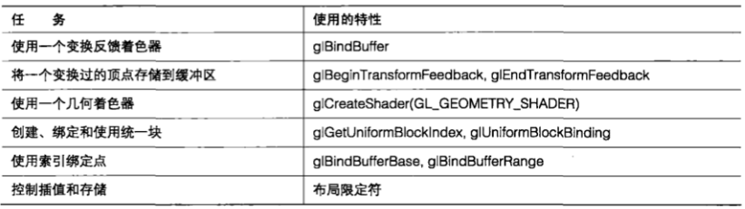

&emsp;&emsp;在本章,我们将了解更多的高级着色器主题,这些内容将允许我们使用可编程图形硬件,以实现简单多边形渲染之外的更多功能。我们提供了一个详细的示例,使用 `GPU` 通过变换反馈进行数据再循环,从而实现物理模拟。我们介绍了一个全新的着色器阶段-—几何着色器，它可以对整个图元进行处理，甚至可以凭空生成新的图元。

&emsp;&emsp;我们还讨论了如何使用片段着色器来执行高级逐像素操作,包括图像处理和生成贴花。

&emsp;&emsp;本章引入了布局限定符,它允许我们控制存储、插值和其他影响着色器输入输出的参数。我们还介绍了在片段着色器中丢弃工作的方法。

&emsp;&emsp;在本章最后，我们将能够编写复杂的着色器，复杂到可能会使我们因为使用着色器统一值而感到厌烦！我们介绍了统一缓冲区对象，它允许我们在不同的程序对象之间共享大量的统一值。

&nbsp;

## 11.1 高级顶点着色器

&emsp;&emsp;到目前为止，我们已经在将顶点从对象空间转换到场景或视觉空间的过程中使用过顶点着色器了。我们可能会将它看作一种只进行简单几何图形变换的单输入、单输出着色器阶段。但是，顶点着色器其实非常强大————在大多数现代硬件中它已经能够访问片段着色器所能访问的所有资源了。

&emsp;&emsp;它可以在那些本质上并非必需几何图形的工作中使用。和变换反馈(将在第 `12` 章进行详细讨论)相结合,顶点着色器能够在一个循环中将结果进行循环传递,并在每一次循环过程中进行迭代和更新。这些数据不必是位置,顶点着色器的结果也不必进行直接渲染。这一部分包含几个示例,它们不太明显地应用了顶点着色器。

> 11.1.1 在顶点着色器中进行物理模拟

&emsp;&emsp;在本例中,我们建立了一个弹簧和物块组成的网状物的物理模拟。这里的每个顶点代表一个重物,与数据,以及一个常规属性数组。同一个缓冲区将被绑定到这个 `TBO` 上，以及与输入到顶点着色器的位置相关联的 `VBO` (顶点缓冲区对象)上。这样就允许我们对系统中其他顶点的当前位置随意进行访问了。其他 `4` 个相邻的重物通过弹性绳进行连接。这个示例对顶点进行反复迭代,用一个顶点着色器对每一个顶点进行处理。这个示例中应用了大量高级特性。我们使用一个纹理缓冲区对象( `TBO` )来保存顶点位置我们还使用一个整数顶点属性来保存相邻顶点的索引。此外,我们还使用变换反馈来在每次数学迭代之间存储每个物块的位置和速度。

&emsp;&emsp;对于每个顶点来说,我们需要一个位置、一个速度和一个质量值。我们可以将位置和质量包装到一个顶点数组中,而将速度包装到另一个数组中。在位置数组中,每个元素实际上都是一个 `vec4` ,其中 `xy` 和 `z` 是顶点的三维坐标,而w则包含顶点的重量。速度数组则可以是一个简单的 `vec3` 数组。另外,我们使用一个 `ivec4` 数组来存储关于将重物连接到一起的弹簧的信息。每一个顶点都对应一个 `ivec4` ,其中 `4` 个分量中的每一个都包含到与弹簧另一端相连的顶点的索引。我们称它们为连接向量( `connection vector` )。这就意味着我们可以将一个物块与其他 `4` 个物块相连。为了表示没有连接的情况,我们将连接元素指向同一个顶点本身(如图 `11.1` 所示)。

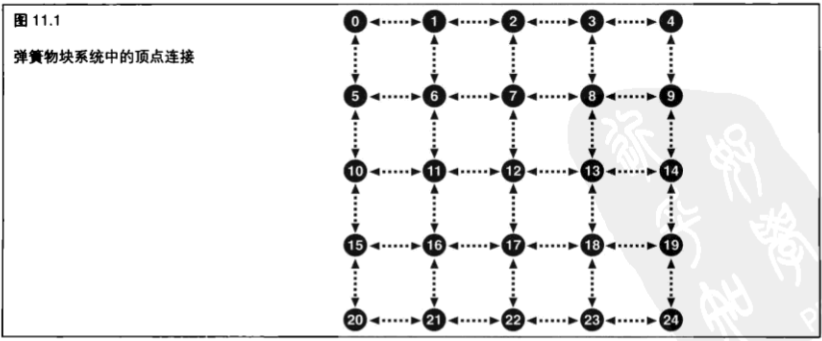

&emsp;&emsp;以顶点 `12` 为例，它有一个 `ivec4` 向量与它相关联，这个向量包含 `<7，13, 17，11>` ——即与它相连接顶点的索引。类似地,顶点13的连接向量则包含 `<8, 14, 18, 12>` 。在顶点 `12` 和顶点 `13` 之间有一个双向连接。位于网状物边缘的顶点上的弹簧并不是都连接到了其他顶点。因此，顶点 `14` 的连接向量包含 `<9，14，19, 13>` 。请注意,这里的 `y` 分量返回来指向了顶点 `14` 本身,表示这里没有弹簧。

&emsp;&emsp;除了连接到的顶点的索引(用一个自我引用表示没有连接)之外，我们还定义了一些特殊值来表示其他意义。索引 `-1` 用来表示顶点固定在原地不动。无论受到什么力的作用，它的位置都不会被更新。这样就允许我们对系统中某些顶点的位置进行固定了。如果连接向量的 `x` 分量为 `-1` ,那么更新顶点位置和速度的计算就会被跳过。

&emsp;&emsp;在每个顶点上,我们的顶点着色器使用常规顶点属性来运行和获取它本身的位置和连接向量。然后它将通过使用连接向量(同样也是常规顶点属性)的元素对 `TBO` 进行检索,从而对与它连接的顶点的当前位置进行查询。对于每个连接的顶点来说,它可以计算出这些顶点到它的距离,从而计算出它们之间虚拟弹簧的伸长量。有了这个伸长量,就可以计算出弹簧施加在它上面的力,从而计算出对这个顶点物块产生的加速度，继而得到下一次迭代中使用的新位置的速度。这听起来好像很复杂，其实并非如此——这只是一些牛顿力学和胡克定律的内容罢了。

&emsp;&emsp;胡克定律的内容是：

$$F=-kx$$

&emsp;&emsp;`F` 为弹簧产生的力， `k` 是弹簧的弹性系数(代表弹簧有多硬)，而 `x` 则为弹簧的伸长量。弹簧的伸长量是相对于它的自然长度(不受外力拉伸或压缩情况下的长度)而言的。对于我们的系统来说，我们将所有弹簧的自然长度设为相同值，并将它存储在一个统一值中。弹簧的任何伸展都会产生一个正的 `x` 值,而弹簧的任何压缩则都会产生一个负的 `×` 值。弹簧的瞬时长度只不过是从它一端到另一端的向量的长度——这正是我们要在顶点着色器中进行计算的。我们通过将表示力大小的标量F乘以弹簧的方向来为这个力添加一个方向。在这里我们引入变量 `d` ,它就是弹簧的标准化方向。

$$\vec{F}=\vec{d}F$$

&emsp;&emsp;这样，我们就得到了由于弹簧的伸长或压缩而作用在物块上的力。如果我们要简单地在物块上应用这个力，那么这个系统将会产生摆动，并且由于数值上存在误差，最终将会变得不稳定。所有真实的弹簧系统都会由于摩擦力的作用而产生能量损失，这种效果可以通过在力学方程中加入阻尼来进行建模。由于阻尼而产生的力就由这个方程式确定

$$\vec{F}_d=-c\vec{v}$$

&emsp;&emsp;其中 `c` 代表阻尼系数。在理想状态下，我们应该为每个弹簧计算阻尼产生的力，但是对于这个简单的系统来说,有一个基于这个物块速度的力就够了。我们还在每个时间步长时使用初始速度来近似地代替这个方程中要用到的连续微分。在着色器中，我们通过计算阻尼力，然后将每个连接到这个物块的弹簧所施加给这个物块的力进行累加，从而对 `F` 进行初始化。最后，我们可以将重力简单地视为在每个物块上增加一个作用力，从而将重力应用到这个系统。重力是一种不变的力,通常是沿着向下的方向作用的。我们只要将它加到作用在物块上的初始作用力上就可以了。

$${F}_{total}=G-d\vec{k}x-c\vec{v}$$

&emsp;&emsp;一旦我们得到了合力，我们就可以简单地应用牛顿力学定律了。首先，牛顿第二定律让我们能够计算出物块的加速度。

$$\vec{F}=m\vec{a}$$

$${\vec{a}}=\dfrac{\vec{F}}{m}$$

&emsp;&emsp;在这里, `F` 代表我们刚刚使用重力、阻尼系数和胡克定律计算出来的合力；`m` 是顶点的质量(保存在位置属性的 `w` 分量中);而 `a` 则是最终得到的加速度结果。给定初始速度(我们从其他属性数组中获得),我们可以将它代入下面的运动方程式中,来计算我们的最终速度,以及在一定时间内会移动的距离。

$$\vec{v}=\vec{u}+\vec{a}t$$

$$\vec{s}=\vec{u}+\dfrac{\vec{a}t^{2}}{2}$$

&emsp;&emsp;其中 `u` 是初始速度（从速度属性数组中读取）， `v` 是最终速度， `t` 是时间步长（由应用程序提供），而 `s` 则为移动的距离。不要忘记， `a` 、 `u` 、 `v` 和 `s` 都是向量。现在我们要做的只剩下编写着色器并将它连接到一个应用程序上了。程序清单 `11.1` 展示了这个顶点着色器。

```C++
#version 330
precision highp float;

//这个输入向量在xyz中包含了顶点位置，而在w中则包含了顶点的质量
in vec4 position_mass;
// 这是顶点的当前速度
in vec3 velocity;
// 这是我们的连接向量
in ivec4 connection;

//这是一个 TBO，它将与 position_mass 输入属性被绑定到同一个缓冲区
uniform samplerBuffer tex_position_mass;

// 顶点着色器的输出与输入相同，只是包装在了一个接口模块中
out Vertex
{
    vec4 position_mass;
    vec3 velocity;
} vertex;

// 一个用来保存时间步长的 Uniform 值。应用程序可以对它进行更新
uniform float t;

// 全局弹性系数
uniform float k;

// 全局阻尼常数
uniform float c;

// 重力
const vec3 gravity = vec3(0.0, -0.03, 0.0);

// 弹簧的自然长度
uniform float rest_length;

// 模型视图投影矩阵
uniform mat4 mvp;

void main(void)
{
    vec3 p = position_mass.xyz; // p可以是位置
    float m = position_mass.w;  // m是顶点的质量
    vec3 u = velocity;          // u 是初始速度
    vec3 F;                     // F是物块上受到的力
    vec3 v = u;                 // v 是最终速度
    vec3 s = vec3(0.0);         // s 是在这一步长内的位移
    
    // 检查这个顶点是否是“固定”顶点
    if (connection[0] != -1)
    {
        // 使用重力和阻尼来对 F 进行初始化
        F = gravity - c * u;
        for (int i = 0; i < 4; i++)
        {
            if (connection[i] != gl_VertexID)
            {
                // q 是另一个顶点的位置
                //不考虑其他顶点的质量
                vec3 q = texture(tex_position_mass, connection[i]).xyz;
                vec3 d = q - p;
                float x = length(d);
                F += -k * (1.0 - x) * normalize(d);
            }
        }
        
        // 由力所产生的加速度
        float a = F / m;
        // 位移
        s = u * t + 0.5 * a * t * t;
        // 最终速度
        v = u + a * t;
    }

    // 对输出进行写操作
    vertex.position_mass = vec4(p + s, m);
    vertex.velocity = v;
    
    //更新 gl_Position 以便能够对点进行渲染
    gl_Position = mvp* vec4 (p + s, 1.0);
}
```

&emsp;&emsp;没那么难，是吧？我们还需要构建缓冲区来保存位置、速度和连接信息。我们需要对位置和速度信息进行双重缓冲,以便能够一次性从一组缓冲区中进行读取,并写入到另一组缓冲区中,然后进行缓冲区交换,以便数据能够在一个缓冲区和另一个缓冲区之间来回移动。连接信息在每次传递过程中都保持不变,所以它将是常量。要完成这些工作,我们需要使用两对 `VBO` 和一对 `VAO` (顶点数组对象)。有一组位置和速度属性绑定到第一个 `VAO` ,随着通用连接信息指向第一对 `VBO` 。另一组位置和速度属性绑定到另一个 `VAO` ，同样随着通用连接信息指向第二对 `VBO` 。我们总共需要 `5` 个 `VBO` ——两个缓冲区用来保存位置，两个缓冲区用来保存速度，一个缓冲区则包含连接向量。

&emsp;&emsp;除了 `VBO` 之外，我们还需要两个 `TBO` 。我们将每个缓冲区都同时作为一个 `VBO` 和一个 `TBO` 使用。这看起来似乎有些奇怪，但是在 `OpenGL` 中是完全合理的——毕竟，我们只是在同一个缓冲区中通过两种不同的方法进行读取而已。为了对此进行设置,我们生成两个纹理,并将它们绑定到 `GL_BUFFER_TEXTURE` 绑定点,并且使用 `glTexBuffer` 将这些缓冲区连接到它们之上,这部分知识将在本书后面的内容进行讲解。在我们绑定顶点数组对象 `A` 时,还绑定了纹理 `A` 。在绑定顶点数组对象 `B` 时,我们还绑定了纹理 `B` 。这样,同一个数据就会同时出现在 `position` 顶点属性和 `tex_position_samplerBuffer` 缓冲区纹理中。

&emsp;&emsp;完成这些设置的代码并不复杂,但却有些重复。完整实现的代码可以在本书的网站中找到。示例应用程序包含创建和初始化缓冲区、执行双缓冲和对结果进行可视化的代码。这个应用程序将两个顶点固定在了相应位置，所以整个系统不会掉落到屏幕的底部。一旦我们将所有这些缓冲区进行连接，我们就可以在系统中通过调用一次 `glDrawArrays` 来模拟一个时间步长了。系统中的每一个节点都有一个单独的 `GL_POINT` 图元来表示。如果我们对模型视图投影矩阵(存储在统一值 `mvp` 中)进行初始化并让系统开始运行,我们就会看到类似于图 `11.2` 所示的结果。

&emsp;&emsp;图 `11.2` 所示的图像并不是特别有趣,但是它确实演示了我们的模拟是在正常地运行着。为了使视觉效果更加吸引人,我们可以将点的大小设置得更大,还可以采用另一个使用 `glDrawElements` 和 `GL_LINES` 图元的索引化绘制来对节点间的连接进行可视化。请注意,同一个顶点位置可以作为这第二个传递的输入来使用,但是我们需要构建另外一个带有 `GL_ELEMENT_ARRAY` 绑定的缓冲区来使用,其中包含到每个弹簧末端的顶点的索引。示例程序中同样执行了这个附加步骤。图 `11.3` 所示为最终结果。

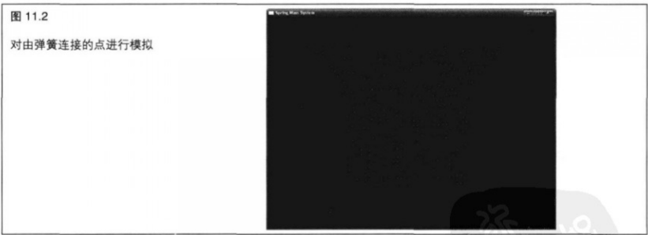

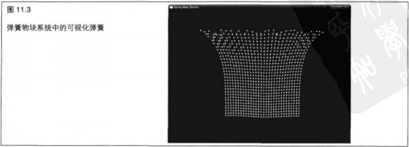

&emsp;&emsp;当然，物理模拟(以及由它产生的顶点数据)可以用于任何情况。如果我们不想在屏幕上绘制这些点，可以启用 `GL_RASTERIZER_DISCARD` ，正如下一章将要介绍的。

&nbsp;

## 11.2 几何着色器

&emsp;&emsp;几何着色器是一种新的着色器类型，最初是以 `OpenGL` 扩展的形式引入的，然后又成为了 `OpenGL` 核心规范(即 `OpenGL 3.2` )的一部分。与其他着色器类型相比，几何着色器的与众不同之处在于，它一次性对整个图元(三角形、线或点)进行处理，并且实际上可以改变 `OpenGL` 管线中的数据量。一个顶点着色器一次可以处理一个顶点，它无法对其他顶点的信息进行访问，并且它是严格单进单出的。这就是一说,它不能生成新的顶点,并且它不能阻止 `OpenGL` 对这个顶点进行进一步的处理。类似地,片段着色器一次只能处理单个片段,无法访问其他片段的数据,不能创建新的片段,并且只能通过丢弃片段来销毁它们。而另一方面,一个几何着色器可以对一个图元(新的 `GL_TRIANGLES_ADJACENCY` 和 `GL_TRIANGLE_STRIP_ADJACENCY` 图元模式可以支持多达 `6` 个)中的所有顶点进行访问,可以改变一个图元的类型，甚至可以创建和销毁图元。

&emsp;&emsp;几何着色器与顶点着色器及片段着色器的另一个区别是,几何着色器是 `OpenGL` 管线中的可选部分。只将一个顶点着色器和片段着色器连接到一个程序对象上是完全合法的，并且一直到现在为止这是还我们使用 `OpenGL` 的唯一方式。在没有出现几何着色器时,  `OpenGL` 管线就像平常一样操作;顶点着色器的输出在进行渲染的图元上进行插值,并直接传递到片段着色器。但是,在加入几何着色器之后,顶点着色上器的输出就成为几何着色器的输入,而几何着色器的输出则进行插值并传递到片段着色器。几何着色器可着以对顶点着色器的输出进行进一步的处理,并且如果它产生新图元(称为放大( `amplification` ) ),可以在创建每个图元时对它们应用不同的变换。

> 11.2.1 直通几何着色器

&emsp;&emsp;和顶点着色器与片段着色器一样，几何着色器也是用 `GLSL` 编写的，并且它们并没有什么神秘之处。稍后我们将对此进行全面的解释，而程序清单 `11.2` 则完整地展示了一个简单的几何着色器。

```C++
#version 330

precision highp float;

layout (triangles) in;
layout (triangle_strip) out;
layout (max_vertices = 3) out;

void main()
{

    for(int i = 0; i < gl_in.length(); i++)
    {
        gl_Position = gl_in[n].gl_Position;
        EmitVertex();
    }
    EndPrimitive();
}
```

&emsp;&emsp;这是一个非常简单的直通几何着色器,它将输入直接进行输出,而没有进行任何修改。这看起来像是片段着色器一样,代码中的前几行只是设置了着色器的版本号( `330` )和精度。接下来的几行代码是几何着色器特有的第一项内容。程序清单 `11.3` 再次展示了这些代码。一个顶点着色器,但是这里还有几点不同之处,我们读几行代码就会非常清楚了。就像任何顶点着色器或

```C++
#version 330precision highp float;
layout (triangles) in;
layout (triangle_strip) out;
layout (max_vertices = 3) out;
```

&emsp;&emsp;这段代码使用 `layout` 限定符设置了输入和输出图元模式。在这个特定着色器中,我们使用 `triangles` 作为输入,而 `triangle_strip` 则作为输出。其他图元类型以及 `layout` 限定符,稍后将会讲解。对于几何着色器的输出来说,我们不仅指定图元类型,还要指定希望着色器生成的顶点数量(通过 `max_vertices` 限定符)。在本例中,这个着色器生成独立的三角形(作为一个非常短的三角形带生成),所以在这里我们指定为 `3` 个顶点。

&emsp;&emsp;接下来是 `main()` 函数,它看起来与顶点着色器和片段着色器仍然非常相似。这个着色器包含一个循环,而这个循环运行的次数取决于内建数组 `gl_in` 的长度。这又是一个几何着色器特有的变量。因为这个几何着色器要对输入图元的所有顶点进行访问,所以它的输入必须声明为一个数组。由顶点着色器(例如 `gl_Position` )写入的所有内建变量都保存在一个结构体中,而一个由这些结构体组成的数组将通过一个名为 `gl_in` 的变量提交给几何着色器。 `gl_in` 数组的长度由输入图元模式决定,而因为在本例中的特定着色器中,输入图元模式为三角形,所以 `gl_in` 的大小为 `3` ,程序清单 `11.4` 重新列出了内循环。

```C++
for(int i = 0; i < gl_in.length(); i++)
{
    gl_Position = gl_in[n].gl_Position;
    EmitVertex();
}
```

&emsp;&emsp;在循环中,我们通过简单地将 `gl_in[]` 的元素复制到几何着色器的输出来生成顶点。一个几何着色器的输出与顶点着色器的输出相似。在这里,我们将写入 `gl_Position` ,就像在顶点着色器中要做的一样。

&emsp;&emsp;在完成所有新顶点属性的设置之后，我们调用 `EmitVertex()` 。这是一个内建函数，它是几何着色器特有的函数，用来通知这个着色器我们已经完成了对这个顶点的工作，它应该将所有这些信息进行存储，并准备开始设置下一个顶点了。

&emsp;&emsp;最后，在循环执行完之后，还要调用另外一个几何着色器特有的函数 `EndPrimitive()` 。 `EndPrimitive()` 通知着色器,我们已经完成了为当前图元生成顶点的工作,可以开始处理下一个图元了。我们指定 `triangle_strip` 为我们着色器的输出，因此，如果我们继续调用 `EmitVertex() 3` 次以上，`OpenGL` 将继续向三角形带中添加三角形。

&emsp;&emsp;如果我们需要几何着色器生成单独的、独立的三角形或多个不进行连接的三角形带(回想一下,几何着色器可以创建新的几何图形，或者放大几何图形)，我们应该在它们之间调用 `EndPrimitive()` 来标记它们的边界。如果我们不在着色器的某处调用 `EndPrimitive()` ,那么图元将自动在着色器末尾结束。

> 11.2.2 在应用程序中使用几何着色器

&emsp;&emsp;和其他着色器类型一样,几何着色器通过调用 `glCreateShader` 函数进行创建,并使用 `GL_GEOMETRY_SHADER` 作为着色器类型，如下所示。

```C++
glCreateShader(GL_GEOMETRY_SHADER);
```

&emsp;&emsp;一旦着色器被创建,就可以像其他任何着色器对象一样使用了。我们通过调用 `glShaderSource` 来将着色器源代码提交 `OpenGL` ,使用 `glCompileShader` 函数来对着色器进行编译,并通过调用 `glAttachShader` 函数来将它连接到一个程序对象。然后程序将像平常一样使用 `glLinkProgram` 函数进行连接。

&emsp;&emsp;现在我们有了一个程序对象，并且有一个几何着色器连接到它上面，当我们使用类似 `glDrawArrays` 这样的函数绘制几何图形时,顶点着色器将为每个顶点运行一次,几何着色器也将为每个图元(点、线或三角形)运行一次,而片段着色器则将为每个片段运行一次。在我们将几何图形发送到 `OpenGL` 时所使用的图元模式,必须与几何着色器的输入图元模式相匹配。例如,如果几何着色器的输入图元模式是点,那么我们在调用 `glDrawArrays` 时也只能用 `GL_POINTS` 。

&emsp;&emsp;如果几何着色器的输入图元模式是三角形，那么我们在调用 `glDrawArrays` 时可以使用 `GL_TRIANGLES` , `GL_TRIANGLE_STRIP或GLTRIANGLE_FAN` 。表 `11.1` 完整地列出了几何着色器输入图元模式及其允许的几何图形类型。

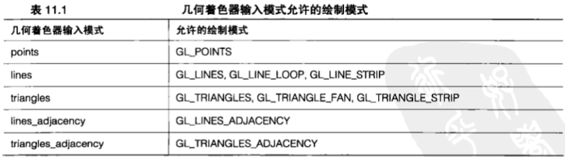

&emsp;&emsp;输入几何图形类型在几何着色器的程序体中使用 `layout` 限定符来指定。输入布局限定符的一般形式是:

```C++
layout(primitive type) in;
```

&emsp;&emsp;这样就指定了 `primitive_type` 为几何着色器将要处理的输入几何图形类型,而 `primitive_type` 必须是支持的几何图形模式中的一种,即 `points` ,  `lines` ,  `triangles` ,  `lines_adjacency` 或 `triangles_adjacency` ,几何着色器为每个图元运行一次。这就意味着,对于 `GL_POINTS` 它将为每个点运行一次;对于 `GL_LINES` 、 `GL_LINE_STRIP` 和 `GL_LINE_LOOP` 它将为每条线运行一次;而对于 `GL_TRIANGLES` 、 `GL_TRIANGLE_STRIP和GL_TRIANGLE_FAN` 它则将为每个三角形运行一次。几何着色器的输入将以数组的形式表示,这个数组包含组成输入图元的所有顶点。

&emsp;&emsp;预定义的输入存储在一个叫做 `gl_in[]` 的内建数组中,这是一个由结构体组成的数组,程序清单 `11.5` 展示了它是如何定义的。

```C++
in gl_PerVertex
{
    vec4 gl Position;
    float gl_PointSize;
    float gl_ClipDistance[];
} gl_in[];
```

&emsp;&emsp;这个结构体的成员都是写入顶点着色器中的内建变量: `glPosition` 、 `gl_PointSize` 和 `gl_ClipDistance[]` 。现在我们应该已经对 `gl_Position` 和 `gl_PointSize` 非常熟悉了，而 `gl_ClipDistance` 则将在第 `12` 章进行解释。这些变量在顶点着色器中以全局变量的形式出现，但是它们的值最终则是作为结构体成员出现在几何着色器中。顶点着色器所写入的其他变量在几何着色器中也会成为数组形式。在独立 `varying` 变量( `varying` )的情况下,顶点着色器的输出会像通常一样进行声明,而几何着色器的输入则会有一个相似的声明,除非它们是数组。考虑一个顶点着色器将输出进行如下定义的情况。

```C++
out vec4 color;
out vec3 normal;
```

&emsp;&emsp;那么相应的几何着色器输入则应如下所示。

```C++
in vec4 color[];
in vec3 normal[];
```

&emsp;&emsp;请注意, `varying` 变量 `color` 和 `normal` 在几何着色器中都成为了数组形式。如果我们有大量数据要从顶点着色器传递到几何着色器,那么将这些从顶点着色器传递到几何着色器的逐顶点数据包装成一个接口块（ `interface block` ）可能会非常方便。在这种情况下，我们的顶点着色器将进行如下定义。

```C++
out Vertex
{
    Dataivec4 color;
    vec3 normal;
} vertex;
```

&emsp;&emsp;那么相应的几何着色器输入则应如下所示。

```C++
in Vertex
{
    Datavec4 color;
    vec3 normal;
    //这里可以插入更多的逐顶点属性
} vertex[];
```

&emsp;&emsp;有了这些声明，我们就可以使用 `vertex[n].color` 等对几何着色器中的逐顶点数据进行访问了。几何着色器中输入数组的长度取决于将要处理的图元类型。例如,点是由单个顶点构成的,那么这个数组将只包含一个单独的元素;而三角形则是由 `3` 个顶点构成的,这样数组将包含 `3` 个元素。如果我们编写的着色器特别设计用来处理特定的图元类型,那么我们可以显式地指定输出数组的大小,这样就会使编译时的错误检查的工作量比较少。否则的话,我们可以让输入图元类型布局限定符来自动指定数组的大小。表 `11.2` 列出了输入图元模式和输入数组最终大小的完整映射关系。

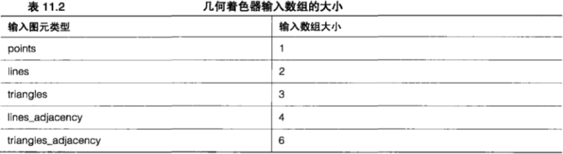

&emsp;&emsp;我们还需要指定几何着色器将要生成的图元类型。

&emsp;&emsp;同样，它也是使用一个布局限定符确定的，如下所示。

```C++
layout (primitive_type) out;
```

&emsp;&emsp;这与输入几何图形类型布局限定符相似,唯一的不同就是我们使用 `out` 关键词来声明着色器的输出。允许的几何着色器输出几何图形类型为 `points` 、 `line_strip` 和 `triangle_strip` 。

&emsp;&emsp;请注意，几何着色器只支持输出条带图元类型（不包括点——显然不存在点带这种东西）。

&emsp;&emsp;最后我们还必须使用一个布局限定符来对几何着色器进行配置。因为几何着色器能够为每个顶点产生一个不同数量的数据,所以必须通过指定几何着色器预计要生成的顶点最大数量来告诉 `OpenGL` 要为所有这些数据分配多少存储空间。我们使用下列布局限定符完成这项工作。

```C++
layout (max_vertices = n) out;
```

&emsp;&emsp;这样就将几何着色器可能产生的顶点数的最大值设为 `n` 了。因为 `OpenGL` 可能会分配缓冲区空间来存储每个顶点的中间结果,所以这个最大值应该为能够让应用程序正确运行的可能的最小数量。例如,如果我们计划接收点并一次生成一条线，那么我们就可以将它设为 `2` ，这样设置是安全的。这样就为着色器硬件提供了最好的条件,使其得以最快地运行。如果我们要对输入的几何图形进行大量的分格化,那么我们就可能希望将它设为一个大得多的数字，虽然这样可能会让我们付出一些性能上的代价。一个几何着色器所能生成的顶点数量的上限值取决于 `OpenGL` 实现。可以保证这个值最小为 `256` ,但是绝对的最大值要通过调用以 `GL_MAX_GEOMETRY_OUTPUT_VERTICES` 为参数的 `glGetintegerv` 来查询。

&emsp;&emsp;我们还可以通过使用逗号进行分隔的方式用一条语句声明一个以上的布局限定符,如下所示。

```C++
layout (triangle_strip, max_vertices = n) out;
```

&emsp;&emsp;有了这些布局限定符，一个样板 `#version` 声明，以及一个空的 `main()` 函数，我们就应该能够生成可以进行编译和连接,但是什么事情也不做的几何着色器了。实际上,它会丢弃我们发送给它的任何几何图形,而应用程序不会进行任何绘制。我们需要引入两个重要的函数: `EmitVertex()` 和 `EndPrimitive()` 。如果我们不调用这两个函数，就不能绘制任何东西。

&emsp;&emsp;`EmitVertex` 通知几何着色器我们已经完成了这个顶点所有信息的填充。设置顶点的工作与顶点着色器非常相似。我们需要写入内建变量 `gl_Position` 。这是为了设置由几何着色器生成顶点的裁剪空间坐标,就像在顶点着色器中一样。我们想要从几何着色器传递到片段着色器的任何其他属性都可以在一个接口块中进行声明,或者也可以在几何着色器中作为全局变量进行声明。在调用 `EmitVertex` 时,几何着色器会将当前所有输出变量中的值进行存储,并使用它们生成一个新的顶点。在一个几何着色器中,我们可以对 `EmitVertex` 进行任意次数的调用,直到达到在 `max_vertices` 布局限定符中指定的限制为止。每一次调用我们都会向输出变量中放入新值,来生成新的顶点。

&emsp;&emsp;关于 `EmitVertex` ，有一点很重要，我们一定要注意，就是它会将任意输出变量（例如 `gl_Position` ）的值都变成未定义的。因此,举例来说,如果我们希望用一种单色来输出一个三角形,那么需要在每个顶点都写入这种颜色,否则就会得到未定义的结果。 

&emsp;&emsp;`EmitPrimitive` 表示我们已经完成了将顶点附加到图元末端的的工作。不要忘记,几何着色器只支持条带图元类型( `line_strip和triangle_strip` )。

&emsp;&emsp;如果输出图元类型为 `triangle_strip` ，并且调用 `EmitVertex` 的次数大于 `3` 次，那么几何着色器将在一个条带中生成多个三角形。类似地,如果输出图元类型为 `line_strip` ,并且调用 `EmitVertex` 的次数大于两次，那么就会得到多条线段。

&emsp;&emsp;在几何着色器中,  `EndPrimitive` 指的是条带。这就意味着如果我们想要绘制独立的线或三角形,就必须在每两个或 `3` 个顶点之后调用 `EndPrimitive` 。我们还可以通过在多次调用 `EndPrimitive` 之间，对 `EmitVertex` 进行多次调用，来绘制多重条带。

&emsp;&emsp;关于在几何着色器中调用 `EmitVertex` 和 `EndPrimitive` ,还有最后一件事情需要注意,就是如果还没有生成足够的顶点来构成一个图元(例如，我们要生成  `triangle_strips` ，而在两个顶点之后就调用 `EndPrimitive` ),那么不会产生任何图元，而已经生成的顶点也将简单地被丢弃。

> 11.2.3 在几何着色器中丢弃几何图形

&emsp;&emsp;程序中的几何着色器会为每个图元运行一次。要对这个图元做什么,完全由我们决定。 `EmitVertex` 和 `EndPrimitive` 两个函数允许我们通过编程将新的顶点附加到三角形带或线带上,并开始新的条带。我们可以任意多次地调用它们(直到达到我们实现所定义的最大值)。我们还可以完全不调用它们,这样就能够将几何图形裁剪掉,也可以丢弃图元。如果几何着色器正在运行而我们从没有为特定几何图形调用 `EmitVertex` ,那么就不会进行任何绘制。为了阐明这一点,我们可以使用一个自定义背面剔除例程,对几何图形进行剔除,就像是从空间中的任意一个点进行观察一样。

&emsp;&emsp;首先,设置着色器版本和精度,声明着色器接受三角形并生成三角形带。背面剔除对于线和点来说并没有太大的意义。我们还定义了一个统一值,它将保存我们在空间中的自定义视点。程序清单 `11.6` 显示了这些代码。

```C++
#version 330
precision highp float;

//输入为三角形,输出为三角形带因为我们要建立一个单入单出着色器来为每个输入产生一个三角形,所以在这里 max_vertices 可以为 3
layout (triangles) in;
layout (triangle_strip, max_vertices = 3) out;

uniform vec3 viewpoint;
```

&emsp;&emsp;现在，在 `main()` 函数中，我们需要为三角形找到表面法线。它只是三角形平面内任意两个向量的叉乘积而已--在这里我们可以使用三角形边缘。程序清单 `11.7` 显示了这些工作是如何完成的。

```C++
vec3 ab = gl_in[1].gl_Position.xyz - gl_in[0].gl_Position.xyz;
vec3 ac = gl_in[2].gl_Position.xyz - gl_in[0].gl_Position.xyz;
vec3 normal = normalize(cross(ab, ac));
```

&emsp;&emsp;现在我们已经有了法线，可以确定它是要面向还是背向用户定义视点了。要完成这项工作，我们需要将法线变换到与视点相同的坐标空间,也就是整个场景空间。假定我们有一个统一值格式的模型视图矩阵,将法线与这个矩阵相乘即可。为了使结果更加精确,我们应该将这个向量与这个模型视图矩阵左上角的 `3x3` 子矩阵的转置矩阵的逆矩阵相乘。这就是通常所说的正规矩阵,我们可以自由地实现它,并将它放在它自己的统一值中,如果我们想这样做的话。但是,如果我们的模型视图矩阵只包含平移、统一值缩放(不进行裁剪)和旋转的话,那么我们可以直接使用它。不要忘记,法线是一个 `3` 元素的向量,而模型视图矩阵则是一个 `4x4` 矩阵。我们需要先将法线扩展成一个 `4` 元素的向量，然后才能将它们相乘。然后我们可以接受刚才得到的 `4` 元素向量与从视点到三角形上任意点的向量的点乘积。

&emsp;&emsp;如果得到的点乘积的符号是负值,这就说明法线方向是背向观察者的,而三角形应该被剔除。如果这个符号为正，三角形的法线将指向观察者，我们应该让三角形继续通过。程序清单 `11.8` 列出了进行表面法线变换、执行点乘操作和测试结果符号正负的代码。

```C++
// 计算变换的表面法线和观察方向的向量
vec3 transformed_normal = (vec4(normal, 0.0) * modelview_matrix).xyz;
vec3 vt = normalize(gl_in[0].gl_Position.xyz - viewpoint);
// 接受法线和观察方向的点乘积
float d = dot(vt, normal);

if(d > 0.0)
{
    for(int n = 0; n < 3; n++)
    {
        gl_Position = mvpMatrix * gl_in[n].gl_Position;
        color = vertex[n].color;
        EmitVertex();
    }
    EndPrimitive();
}
```

&emsp;&emsp;在程序清单 `11.8` 中,如果点乘积为正,我们将输入顶点复制到几何着色器的输出,并为每个顶点调用 `EmitVertex` ；如果点乘积为负，那么我们什么都不做就可以了。这样就会导致输入的三角形一起被丢弃，不会进行任何绘制。

在这个特定的示例中，我们最多为每个输入几何着色器的三角形生成一个三角形输出。虽然几何着色器的输出是一个三角形带,但是我们的条带只包含一个三角形。这样,就不是一定需要调用 `EndPrimitive` 了。我们在这里保留它只是出于完整性考虑。

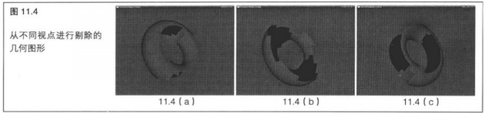

&emsp;&emsp;在图 `11.4` 的每个截图中，虚拟观察者都移动到了不同的位置。就像我们能够看到的，模型的不同部分被几何着色器剔除了。我们并不指望这个示例会特别有用,但是它确实演示了一个几何着色器根据应用程序定义的条件来进行几何图形剔除的能力。

> 11.2.4 在几何着色器中修改几何图形

&emsp;&emsp;前面的示例不是丢弃几何图形就是不加修改地让它通过。我们还可以在顶点通过几何着色器的时候对它们进行修改，来创建新的衍生图形。即使我们的几何着色器是-—对应地传递顶点的(也就是说，不进行任何放大或消除),我们仍然可以做一些事情,这些事情是在其他情况下单独使用第一个顶点着色器时不可能做到的。举例来说，如果输入的几何图形是以三角形带或三角形扇的形式出现的，结果得到的几何图形将包含公共顶点和公共边。使用顶点着色器移动公用顶点将会移动共用这个顶点的所有三角形。这样，单独使用顶点着色器来将初始几何图形中的两个共用同一个边的三角形分离就不可能了。但是,这对于几何着色器来说就不成问题了。

&emsp;&emsp;让我们来考虑一个接受三角形并产生三角形带的几何着色器。接受三角形的几何着色器的输入是独立的三角形,无论它们最初是来自 `glDrawArrays` 函数调用还是来自 `glDrawElements` 函数调用,或者图元类型是 `GL_TRIANGLES` 、 `GL_TRIANGLE_STRIP` 还是 `GL_TRIANGLE_FAN` 。

&emsp;&emsp;除非几何着色器输出 `3` 个以上顶点,否则结果就是独立的、没有连接的三角形。

&emsp;&emsp;在接下来的例子中，我们通过让所有三角形沿着它们的表面法线运动，来使一个模型“爆炸”。原始模型是按照独立三角形进行绘制的，还是按照三角形带或三角形扇绘制的,这并不重要。和前一个示例一样,输入为三角形,输出为三角形带,并且由于我们不对几何图形进行放大或缩减,所以几何着色器生成的最大顶点数为 `3` 。程序清单 `11.9` 列出了进行这些设置的代码。

```C++
#version 330
precision highp float;

//输入为三角形,输出为三角形带。因为我们要建立一个单入单出着色器来为每个输入产生一个三角形,所以在这里,max_vertices可以为3
layout (triangles) in;
layout (triangle_strip, max_vertices = 3) out
```

&emsp;&emsp;为了将三角形向外“发射”，我们需要计算每个三角形的表面法线。我们可以通过三角形平面内两个向量三角形的两个边的叉乘积来求出表面法线。为了完成这项任务，我们可以重用程序清单 `11.7` 中的代码。

&emsp;&emsp;现在我们有了三角形的表面法线,可以沿着这个法线将顶点射出一定量,这个量由应用程序控制。这个量可以保存在一个统一值(我们称之为 `explode_factor` )中,并且由应用程序进行更新。程序清单 `11.10` 显示了这些简单的代码。

```C++
for (int i = 0; i < 3; i++)
{
    gl_Position = gl_in[i].gl_Position + vec4(explode_factor * normal, 0.0);
}
```

&emsp;&emsp;在一个模型上运行这个几何着色器的结果如图 `11.5` 所示。这个模型被解体,而独立的三角形显现了出来。

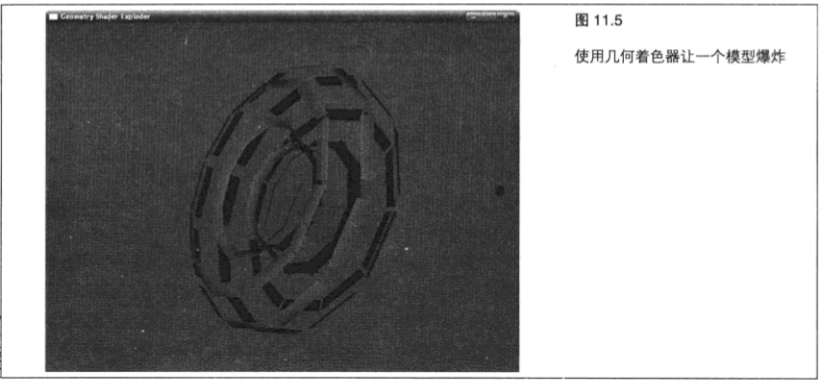

> 11.2.5 在几何着色器中生成几何图形

&emsp;&emsp;就像完全不要求我们调用 `EmitVertex` 和 `EndPrimitive` 一样,如果不想生成任何来自几何着色器的几何图形的话,也可以对 `EmitVertex` 和 `EndPrimitive` 进行我们需要的任意次数的调用,来产生新的几何图形。这就是说,只要没有达到在几何着色器开头部分声明的输出顶点最大数量,我们就可以继续进行调用。这种功能可以用在创建输入的多个副本或将输入分解成小块的场合,这些是下一节将讨论的主题。输入到着色器的是一个以原点为中心的立方体。立方体的每个面都是由一对三角形组成的,这对三角形共用一条边,这条边就是立方体表面上的对角线。我们通过在对角线的中点产生新顶点来对输入的三角形进行分格化，然后移动结果得到所有顶点，以使它们到原点的距离相等。这样立方体就转变成了一个大致上的球体。

&emsp;&emsp;因为几何着色器是在对象空间(我们说过,立方体的顶点是围绕着原点这个中心的)中操作的,我们不需要进行任何坐标变换,而是要在生成新顶点之后再在几何着色器中进行变换。要完成这项工作,我们需要一个简单的直通顶点着色器。程序清单 `11.11` 展示了一个非常简单的直通顶点着色器的代码。

```C++
#version 330
precision highp float;
in vec4 position;

void main(void)
{
    gl_Position = position;
}
```

&emsp;&emsp;这个着色器只是将顶点位置传递到几何着色器。如果我们有与顶点相关的其他属性,例如纹理坐标或法线，那么同样需要将它们通过顶点着色器传递到几何着色器。

&emsp;&emsp;就像前面的例子一样,我们接受三角形作为几何着色器的输入,并产生一个三角形带。我们在每个三角形之后都将三角形带进行解体,这样就能产生单独的、独立的三角形。在本例中,我们为每个输入三角形生成两个输出三角形。我们需要将最大输出顶点数声明为 `6` --两个三角形乘以 `3` 个顶点。我们还需要在几何着色器中声明一个统一矩阵来保存模型视图变换矩阵，因为要在生成顶点之后进行这些变换。程序清单 `11.12` 显示了这些代码。

```C++
#version 330
precision highp float;
layout (triangle_strip, max_vertices = 6) out;
layout (triangles) in;

// 一个用来保存模型视图投影矩阵的统一值
uniform mat4 mvp;
```

&emsp;&emsp;要确保我们知道哪条边是对角线,可以在程序中使用索引,并使用 `glDrawElements` 绘制立方体。这样就可以总是让第一个顶点作为三角形的顶点，而第二个三角形和第 `3` 个三角形之间的边作为立方体表面的对角线。对于每个生成的三角形,可以使用与输入三角形相同的第一个顶点。然后,对于生成的两个三角形,我们可以使用生成的顶点和其他输入的顶点中的一个。

&emsp;&emsp;首先,将输入的顶点坐标进行标准化,这样就使这些坐标与原点的距离都相等了,因为在这种情况下从原点到任意顶点的向量长度都为 `1` 。如果初始立方体的顶点坐标已经进行了标准化,那么我们就没必要再进行标准化了，但是这就使这个立方体的边长为单位长度——这对于存储几何图形来说是非常普遍的。我们在这里还将结果得到的顶点坐标与模型视图投影矩阵相乘。程序清单 `11.13` 显示了这些代码。

```C++
//将输入的顶点移动到一个半径为1的圆的表面
vec3 a = normalize(gl_in[0].gl_Position.xyz);
vec3 b = normalize(gl_in[1].gl_Position.xyz);
vec3 c = normalize(gl_in[2].gl_Position.xyz);

//在b和c的中点生成新的顶点。请注意对顶点进行标准化就意味着我们不需要再除以2来取平均了
vec3 d = normalize(b + c);
// 现在将生成的顶点转换到场景空间
a = a * mvp;
b = b * mvp;
c = c * mvp;
d = d * mvp;
```

&emsp;&emsp;现在， `a` 成为了三角形的顶点，而 `d` 则是生成的顶点。`bc` 边是立方体面的对角线，也是要将这个面分成两半的边。我们将要输出的两个三角形将是 `abd` 和 `adc` 。为了生成两个输出三角形,我们需要设置顶点,为每个顶点调用 `EmitVertex` ,然后在每个三角形之间调用 `EndPrimitive` 重新开始三角形带。程序清单 `11.14` 显示了这些代码。

```C++
// 生成第一个三角形 abd
gl_Position = a;
EmitVertex();
gl_Position = b;
EmitVertex();
gl_Position = d;
EmitVertex();
EndPrimitive();

// 生成第二个三角形 adc
gl_Position = a;
EmitVertex();
gl_Position = d;
EmitVertex();
gl_Position = c;
EmitVertex();
EndPrimitive();
```

&emsp;&emsp;在本例中,我们为每个输入三角形生成两个独立的三角形。但是,这两个三角形实际上共用了 `ad` 边,并且通过以正确的顺序对这些顶点进行输出,它们可以用一个三角形带来表示,这个三角形带正是几何着色器设计上要输出的。新的三角形生成代码如程序清单 `11.15` 所示。

```C++
gl_Position = b;
EmitVertex();
gl_Position = d;
EmitVertex();
gl_Position = a;
EmitVertex();
gl_Position = c;
EmitVertex();
EndPrimitive();
```

&emsp;&emsp;这个几何着色器,我们可以将 `max_vertices` 减少到 `4` ,这样可以使程序运行得更快。即使将程序渲染的请注意我们只对 `EmitVertex` 进行了 `4` 次而不是 `6` 次调用,而且删除了一个 `EndPrimitive` 调用。对于三角形的数量加倍,在使用一个短条带时,也只是将要处理的顶点数增加了三分之一。

&emsp;&emsp;图 `11.6` 所示展示了基于我们的简单几何着色器的分格化程序的一组截屏图像。

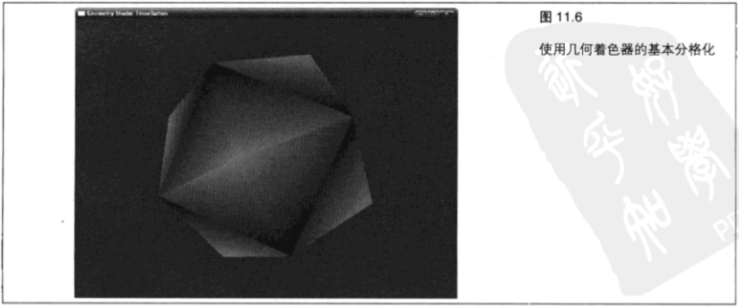

&emsp;&emsp;有一点需要注意,在复杂的分格化中使用几何着色器可能得不到最优的性能。如果需要进行比本例更复杂的分格化,最好使用一个 `OpenGL` 扩展进行硬件分格化。对这些扩展的全面讲解超出了本书涉及的范围。

> 11.2.6 在几何着色器中改变图元类型

&emsp;&emsp;到现在为止，我们讲解的所有几何着色器都接受三角形为输入，并且生成三角形带为输出，这样并没有改变几何图形的类型。但是，几何着色器还能够输入和输出不同类型的几何图形。例如，我们可以将点转换成三角形,或者将三角形转换成点。在下一个示例中,我们将把几何图形的类型从三角形转换成线。对于每个输入着色器的顶点,我们获取顶点法线并将它表示为一条线。我们还要获取表面法线,并将它表示为另一条线。这样就可以显示模型的法线了,包括每个顶点和每个面的法线。不过,要注意的是,如果绘制原始模型顶部的法线，就需要将所有东西进行两次绘制--一次是使用几何着色器来将法线可视化而另一次则是显示模型而不使用几何着色器。我们无法从一个几何着色器中混合输出两种不同的图元。

&emsp;&emsp;对于几何着色器，除了 `gl_in` 结构体的成员之外，还需要每个顶点的法线，它们还要直通过顶点着色器。程序清单 `11.16` 列出了对程序清单 `11.11` 的代码进行改进而得到的升级版直通顶点着色器。

```C++
#version 330
precision highp float;

in vec4 position;
in vec3 normal;

out Vertex
{
    vec3 normal;
} vertex;

void main(void)
{
    gl_Position = position;
    vertex.normal = normal;
}
```

&emsp;&emsp;这样就将 `position` 属性直接传递到了 `gl_Position` 内建变量中，并将法线放到了一个输出块中。

&emsp;&emsp;程序清单 `11.17` 列出了对这个几何着色器进行设置的代码。在本例中，我们为接受三角形而生成线带，每个线带只有一条线。因为我们为显示的每条法线输出了一个单独的线,所以我们为每个消耗的顶点生成两个顶点,还要为表面法线多生成两个顶点。这样,我们为每个输入的三角形所输出的最大顶点数就是 `8` 个。为了与在顶点着色器中声明的顶点输出块相匹配,我们还需要在几何着色器中声明一个相应的输入接口块。因为我们要在几何着色器中进行从对象空间到场景空间的变换,所以要声明一个名为 `mvp` 的 `mat4` 统一值来表示模型视图投影矩阵。这样做是必要的，以便我们可以将顶点位置与它的法线保持在同一个坐标系中,直到生成表示这条线的新顶点。

> 11.2.7 由几何着色器引入的新图元新类型

```C++
#version 330
precision highp float;

layout (triangles) in;
layout (line_strip) out;
layout (max_vertices = 8) out;
in Vertex
{
    vec3 normal;
} vertex[];

// 用来保存模型视图投影矩阵的统一值
uniform mat4 mvp;

//用来保存可视化法线长度的统一位
uniform float normal_length;
```

&emsp;&emsp;每个输入顶点都会变换到最终位置,并且从几何着色器中输出,然后沿着它的法线取代输入顶点并将其变换到最终位置而产生第二个顶点。这样就将所有法线的长度变成 `1` ,但是允许在模型视图投影矩阵中进行编码的任何缩放随着模型一起应用到它们之上。我们将法线与应用程序支持的统一值 `normal_length` 相乘，允许它们进行缩放，从而与模型相匹配。程序清单 `11.18` 列出了内循环。

```C++
for (int i = 0; i < gl_in.length(); i++)
{
    gl_Position = mvp * gl_in[i].gl_Position;
    EmitVertex();
    gl_Position = mvp * vec4(gl_in[i].gl_Position.xyz +vertex[i].normal * normal_length, 1.0);EmitVertex();
    EndPrimitive();
}
```

&emsp;&emsp;这样就在每个顶点生成了一个短的线片段，指向法线方向。

&emsp;&emsp;现在我们需要生成表面法线。要完成这项工作,我们需要挑选一个合适的位置,从这个位置来绘制法线，然后我们需要在几何着色器中计算表面法线本身，我们就是要沿着这个法线来绘制线的。

&emsp;&emsp;就像前面程序清单 `11.7` 中的示例一样,我们使用三角形两条边的一个叉乘积找出表面法线。要为这条线选定一个起点,我们选择三角形的形心,它的坐标只是简单地取输入顶点坐标的平均值。程序清单 `11.19` 显示了这个着色器的代码。

```C++
vec4 centroid = (gl_in[0].g1_Position + gl_in[1].g1_Position + gl_in[2] .gl_Position) / 3.0;
vec3 face_normal = normalize(cross(gl_in[1].gl_Position.xyzgl_in[0].gl_Position.xyz,gl_in[2].gl_Position.xyzgl_in[0].gl_Position.xyz));
EmitVertex();
gl_Position = (centroid + vec4(face_normal normal_length, 0.0)) * mvp;
EmitVertex();
EndPrimitive();
```

&emsp;&emsp;现在，当我们对模型进行渲染时，就会得到如图 `11.7` 所示的图像。

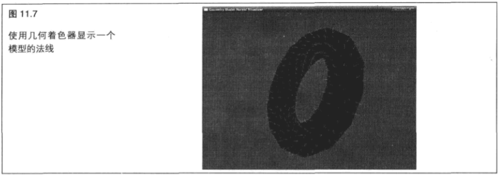

> 11.2.7 由集合着色器引入的新图元类型

&emsp;&emsp;随几何图形引入了 · 种新的图元类型,它们是 `GL_LINES_ADJACENCY` 、 `GL_LINE_STRIP_ADJACENCY` 、 `GL_TRIANGLES_ADJACENCY` 和 `GL_TRIANGLE_STRIP_ADJACENCY` 。这些图元类型确实是只在一个几何着色器活动的情况下进行渲染时才有用的。

&emsp;&emsp;在使用新的邻接图元类型( `adjacency primitive type` )时,对于传递到几何着色器的每条线或每个三角形来说，它不仅可以访问定义这个图元的顶点，还可以访问与它正在处理的图元相邻的图元的顶点。

&emsp;&emsp;当使用 `GL_LINES_ADJACENCY` 进行渲染时,每个线片段要从启用的属性数组中消耗 `4` 个顶点。中间的两个顶点组成这条线；第一个和最后一个顶点则被视为邻接顶点。这样，输入到着色器的就是一个 `4` 元素的数组。实际上,因为几何着色器的输入和输出类型不需要关联, `GL_LINES_ADJACENCY` 可以看作是一种将广义的 `4` 顶点图元发送到几何着色器的方法。几何着色器可以自由地将它们转换成任何它想转换的东西。例如，我们的几何着色器可以将每一组 `4` 个顶点转换成一个由两个三角形组成的三角形带。这样就允许我们使用 `GL_LINES_ADJACENCY` 图元来渲染四边形。不过，我们应当注意，如果在没有活动几何着色器的情况下使用  `GL_LINES_ADJACENCY` 进行绘制,那么就会使用每组4个顶点中最靠中间的两个顶点来绘制常规的线。而靠外侧的两个顶点将被丢弃,顶点着色器根本就不会对它们进行任何处理。

&emsp;&emsp;使用 `GL_LINE_STRIP_ADJACENCY` 也会产生类似的效果。不同之处在于，这时整个条带将会看作是一个图元,而在每一端都带有一个附加的顶点。如果使用 `GL_LINES_ADJACENCY` 将 `8` 个顶点发送到 `OpenGL` ,那么几何着色器将运行两次,然而如果使用 `GL_LINE_STRIP_ADJACENCY` 发送同样一批顶点时,几何着色器则会运行5次。图 `11.8` 所示清楚地展示了这一点。最上面一行的 `8` 个顶点以 `GL_LINES_ADJACENCY` 图元模式发送到  `OpenGL` 。几何着色器每次为 `4` 个顶点运行两次—— `ABCD` 和 `EFGH` 。在第二行，同样的 `8` 个顶点以 `GL_LINESTRIP_ADJACENCY` 图元模式发送到 `OpenGL` 。这一次，几何着色器运行 `5` 次-- `ABCD` , `BCDE` ,以此类推直到 `EFGH` 。在这种情况下,如果没有出现几何着色器的话,那么实线箭头就被渲染。

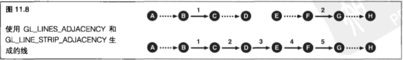

&emsp;&emsp;`GL_TRIANGLES_ADJACENCY` 图元模式的使用与 `GL_LINES_ADJACENCY` 模式类似。为启用的属性数组中每一组 `6` 个顶点都要向几何着色器传递一个三角形。第 `1` 个、第 `3` 个和第 `5` 个顶点被认为是组成真正三角形的顶点,而第 `2` 个、第 `4` 个和第 `6` 个顶点则被认为是在三角形的顶点之间。这就是说,输入到几何着色器的是一个 `6` 个元素的数组。和以前一样，我们可以使用几何着色器对这些顶点进行我们想要做的任何操作, `GL_TRIANGLES_ADJACENCY` 是一种很好的将任意 `6` 个顶点的图元传递到几何着色器的方法。图 `11.9` 所示展示了这一点。

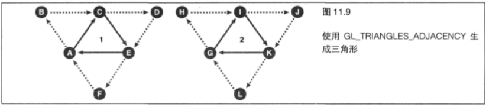

&emsp;&emsp;这些图元类型中的最后一种就是 `GL_TRIANGLE_STRIP_ADJACENCY` ,或许这也是最复杂的一种(或者说是最难理解的一种)。这种图元表示一个三角形带，每隔一个顶点来选用一个顶点(第 `1` 个、第 `3` 个、第 `7` 个、第 `9` 个 )组成这个三角形带。它们中间的顶点为邻接顶点。图 `11.10` 所示演示了这种规则。在图中,从顶点 `A` 到顶点 `P` 代表发送到 `OpenGL` 的 `16` 个顶点。每隔一个顶点选用一个顶点(`A 、 C 、 E 、 G 、 I` 等)生成一个三角形带,而夹在这些选用顶点之间的顶点(`B 、 D 、 F 、 H 、 J` 等)则为邻接顶点。

&emsp;&emsp;对于位于三角形带始端和末端的三角形来说,还有一些特殊情况,但是一旦三角形带开始，顶点就会进入一种常规模式，这一点在图 `11.11` 中表现得更加清晰。

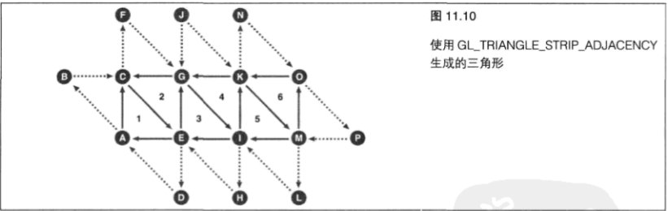

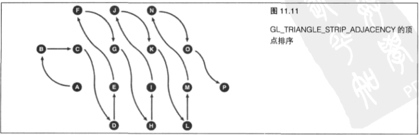

&emsp;&emsp;关于 `GL_TRIANGLE_STRIP_ADJACENCY` 的排序规则,在 `OpenGL` 规范中已经做了详细的说明--特别是,对于那些特殊情况也进行了提示。如果想要使用这种图元类型，我们建议读者阅读规范中的相关部分。

&nbsp;

## 11.3 高级片段着色器

&emsp;&emsp;片段着色器是管线中一个功能强大的阶段。典型情况下,图形硬件从纹理中进行读取和写入到帧缓冲区时会使用最大的内存带宽。但是,我们并不只限于在片段着色器中进行视觉数据的处理。

&emsp;&emsp;如果我们要进行数据密集型的操作,那么片段着色器可能是最适合的地方了。到目前为止,我们已经利用纹理贴图、法线贴图等技术，使用片段着色器来模拟了材质和表面。片段着色器会在由图元生成的每图个片段上执行。但是,除了对渲染对象的表面进行模拟之外,我们还可以使用片段着色器做更多的工作。

&emsp;&emsp;在这一部分，我们将介绍片段着色器的更高级应用。对于这些示例中的大多数来说，我们使用单独的一对三角形作为输入几何图形覆盖整个屏幕。这通常被称为全屏四边形，因为这是一个覆盖了整个屏幕的四边形。首先，我们回顾一下使用片段着色器来应用模糊和颜色校正与增强等后期处理特效。然后，我们来展示只使用片段着色器就能够生成的整个场景。

&emsp;&emsp;在下面的几个例子中,我们使用同一个简单的直通顶点着色器。这个着色器所做的工作只是将输入坐标传递到输出位置,并将它复制到一个纹理坐标,以便片段着色器可以对它进行访问。程序清单 `11.20` 显示了这些代码。

```C++
#version 330
precision highp float;

in vec2 position;

out Fragment
{
    vec2 tex_coord;
} fragment;

void main(void)
{
    gl_Position vec4(position, 0.5, 1.0);
    // 这样就生成了一个范围从（-1.0， -1.0）到（1.0，1.0）的纹理坐标
    fragment.tex_coord = position;
    // 或者，我们也可以使用下面这行代码将我们的纹理坐标范围设置成从（0.0，0.0）到（1.0，1.0）
    fragment.tex_coord = position * 0.5 + vec2(0.5, 0.5);
}
```

&emsp;&emsp;这个着色器的输入是一个单独的 `vec2` 属性 `position` ,它是从坐标直接传递过来的,代表四边形的角,如程序清单 `11.21` 所示。

```C++
const GLfloat quad_coords [] =
{
    -1.0f, -1.0f,
    1.0f, -1.0f,
    -1.0f, 1.0f,
    1.0f, 1.0f
}
```

&emsp;&emsp;使用这些坐标并将它们作为一个 `GL_TRIANGLE_STRIP` 进行绘制，一个四边形可以通过调用一次 `glDrawArrays` 进行渲染,覆盖整个视口。顶点着色器输出的 `fragment.tex_coord` 的范围可以是从 `(-1.0,-1.0)` 到 `(1.0, 1.0)` ,也可以是从 `(0.0, 0.0)` 到 `(1.0, 1.0)` ,这取决于哪一行被取消注释,就像着色器的注释中所解释的一样。这些示例中有一些要求范围为 `-1.0` 到 `1.0` ,也有一些要求范围为 `0.0` 到 `1.0` 。

> 11.3.1 片段着色器中后处理--颜色矫正

&emsp;&emsp;在本例中,我们假定在一个纹理中有一个输入图像。这可能是一个预生成的图像,或者也可以是将场景渲染到一个绑定到帧缓冲区对象（ `FBO` ）的纹理而得到的结果。要学习更多关于 `FBO` 和纹理渲染的知识,可以参考第 `8` 章。在本章，我们从纹理中读取单个纹理单元,对存储到其中的颜色进行变换，并从片段着色器中对其进行输出向用户显示。在我们从输入纹理中进行采样时,需要纹理坐标的范围为从 `(0.0,0.0)` 到 `(1.0, 1.0)` ,所以需要启用直通顶点着色器的这个变体。

&emsp;&emsp;要应用颜色校正,我们要使用一个矩阵来对每个片段进行变换。通过将这个矩阵放到一个统一值中,应用程序可以在运行时对这个矩阵进行更新,以生成不同的效果。程序清单 `11.22` 列出了对片段着色器进行设置的代码。

```C++
#version 330
precision highp float;

// 这是用于从虚拟顶点着色器传递纹理坐标的接口块
in Fragment
{
    vec2 texcoord;
} fragment;

// 这个统一值包含了用于进行颜色校正的矩阵
uniform mat4 color_matrix;

// 代表我们輸入图像的采样器
uniform sampler2D tex_input_image;

// 最终颜色
out vec4 final_color;
```

&emsp;&emsp;现在我们有了片段着色器设置的输入,可以继续进行颜色校正着色了。每个输出片段都是从源图像的一个纹理单元直接生成的。我们可以通过使用一个变换矩阵在输入颜色中应用一个广义投影变换。存储在输入纹理中的颜色是 `RGB` 格式的。我们需要通过将 `alpha` 通道设置为 `1.0` 来将它扩展成一个齐次向量，就像 `OpenGL` 位置一样。然后，我们可以用它乘以变换矩阵，并除以 `w` 坐标。着色器程序体真的非常简单——只有几行代码，如程序清单 `11.23` 所示。

```C++
void main (void)
{
    // 从着色器中读取输入颜色，并将它转换成一个齐次向量
    vec4 input_color = vec4(texture(tex_input_image,fragment.tex_coord).rgb, 1.0);
    
    // 使用我们的颜色变换矩阵来对它进行转换
    vec4 transformed color = color_matrix * input_color;
    
    // 这样我们就能在最终颜色上生成一个“透视”变换了
    final_color = transformed_color / transformed_color.a;
}
```

&emsp;&emsp;使用这个着色器,我们可以获取一个图像,并将它变换到其他颜色空间,修改亮度,或者调整图像的颜色平衡。图 `11.12` 所示给出了可以用来在图像上应用有趣效果的矩阵的几个示例。

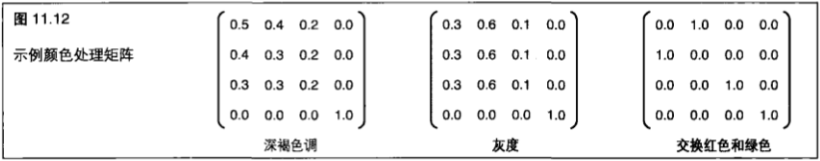

&emsp;&emsp;这些都是一些非常简单的矩阵，所以很容易就能了解它们是怎么运行的。深褐色调本质上是将所有颜色通道一起进行平均,在红色通道上应用轻微的偏置,以使结果得到的图像获得褐色图像中典型的深褐色调。灰度矩阵从输入颜色中获得一个加权平均值——因为矩阵的每一行都是相同的，输出图像中的每个颜色通道都和其他的通道相同。

&emsp;&emsp;但是，输入的绿色通道加权比其他通道更高一点，因为人眼对于绿色比其他颜色更加敏感。这个矩阵模拟了视觉系统。红-绿交换矩阵是由简单的 `1` 和 `0` 组成的。结果是,绿色通道对于红色输出的加权值为 `0` ,而红色输入对于绿色输出的加权值也为 `0` 。

> 11.3.2 片段着色器中后处理--卷积

&emsp;&emsp;在颜色校正示例中，每个输出片段都是从单个输入纹理单元中产生的。在本例中，我们可以将着色器的输入扩展成多重输入纹理单元。这样就能允许我们将来自多个纹理的数据进行组合并实现过滤操作了。

&emsp;&emsp;我们可以在图像上将一个可分离内核使用两次来实现卷积。可分离内核能够分解成水平向量分量和垂直向量分量,这样就可以求得它们的外积(叉乘积),生成一个二维内核矩阵了。高斯过滤( `Gaussian Filter` )就是这方面的一个例子，它可以用来生成平滑的模糊效果。

&emsp;&emsp;这个示例还是使用了一个全屏四边形作为输入几何图形,并使用直通顶点着色器的变体生成 `(0.0, 0.0)` 和 `(1.0, 1.0)` 之间的纹理坐标。我们使用一个 `TBO` (纹理缓冲区对象)来保存这些过滤系数。 `TBO` 是在第 `8` 章引入的。为了逐步得到输出图像，我们提供一个统一值 `tc_scale` ，它为每个参数指定替代输入纹理坐标多远。这样从本质上说就允许我们对我们的过滤内核相对输入图像进行缩放了。通过将它的 `x` 或 `y` 分量设置成 `0` ,我们可以分别垂直或水平地遍历图像。

&emsp;&emsp;通过将 `×` 和 `y` 都设置为非 `0` 值，我们也可以以任意角度来经过输入图像。只要每次通过的向量是正交的，过滤器就仍然是可分离的。程序清单 `11.24` 列出了卷积着色器的输入声明。

```C++
#version 330
precision highp float;

// 来自顶点着色器的输入接口块
in Fragment
{
    vec2 tex_coord;
} fragment;

// 代表我们输入图像的采样器
uniform sampler2D tex_input_image;

//保存我们过滤参数的TBO
uniform samplerBuffer tbo_coefficient;

//将整数缩放到纹理坐标的统一值
uniform vec2 tc_scale;

// 最终输出颜色
out vec4 output_color;
```

&emsp;&emsp;过滤器的大小可以由 `TBO` 的大小决定，后者可以通过调用 `textureSize` 函数来查询。这就意味着我们不需要显式地告诉着色器过滤器的大小，甚至可以通过在水平和垂直方向使用不同大小的 `TBO` 来使用一个非四边形的过滤器。着色器是以输出片段为中心的。如果我们的过滤器不以输出片段为中心,那么每次传递都会将图像进行水平或垂直移动。为了执行过滤，我们在输入图像上的纹理单元进行循环，用一个来自 `TBO` 的样本对每个纹理单元进行加权。

&emsp;&emsp;着色器的程序体非常简单，如程序清单 `11.25` 所示。

```C++
int filter_size = textureSize(tbo_coefficient);
vec2 color = vec4(0.0);
vec2 tc_offset;
float coefficient;
for (int i = 0; i < filter_size; i++)
{
    coefficient = texelFetch(tbo_vertical_coefficient, i).r;
    tc_offset = float(i - filter_size / 2) * tc_scale;
    color += coefficient * texture(tex_input_image, fragment.tex_coord + tc_offset);
}

output_color = color;
```

&emsp;&emsp;这个着色器的主应用程序非常简单。整个实现都已经包含在本书网站所提供的源代码中了。应用程序将在图像上执行两次。其中第一次使用输入图像作为一个纹理,并将其渲染到一个绑定到 `FBO` 的纹理上。第二次使用以前在第一次执行时写入的纹理作为一个输入并渲染到帧缓冲区。

&emsp;&emsp;给定图 `11.13` 所示的输入图像，使用高斯过滤器进行卷积所得到的结果如图 `11.14` 所示。

&emsp;&emsp;这个图像是使用表 `11.3` 中的过滤器内核生成的。请注意这个内核的所有加权值加起来等于 `1` 。如果相加的结果不为 `1` ,就会导致输出图像变得比输入图像更亮或更暗。这个内核同时也是对称的(高斯内核的一个性质)。如果不是这样,就会导致输出图像相对于输入发生水平或垂直方向的平移。

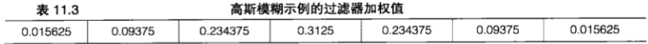

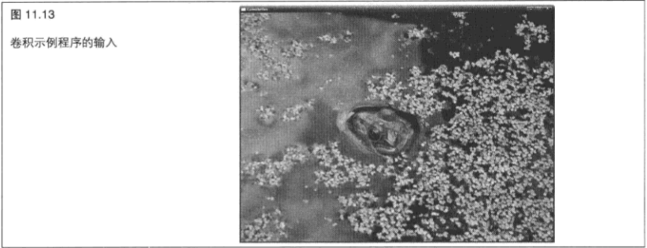

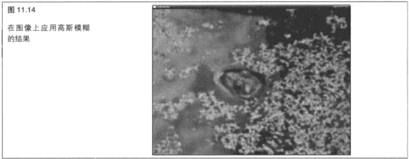

&emsp;&emsp;另一个可分离过滤器的示例就是索贝尔边缘检测器(`Sobel edge detector`)。图 `11.15` 所示展示了图 `11.13` 在应用了索贝尔边缘检测器之后的情况。


&emsp;&emsp;表 `11.4` 给出了索贝尔运算符的加权值。请注意索贝尔过滤器分成了两个不同的内核,每次使用一个。索贝尔运算符在每一次执行时也在水平方向或垂直方向进行边缘检测,它还检测图像过渡,这就意味着我们需要获取结果的强度才能显示结果。这个示例应用程序就能完成这项工作。

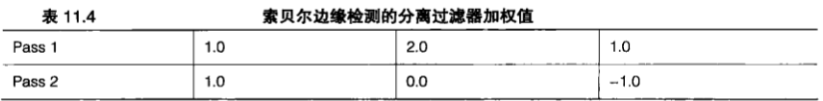

> 11.3.3 在片段着色器中生成图形数据

&emsp;&emsp;在前两个使用片段着色器来执行后期处理的例子中,我们是从一个预渲染图像开始的，它或者是一个由应用程序支持的纹理,或者是使用OpenGL渲染到一个纹理的结果。在下一个例子中,我们渲染一个茹利亚集(`Julia set`),只根据纹理坐标生成图像数据。茹利亚集与曼德勃罗特集( `Mandelbrot set` )--像球茎形状的分形有关。曼德勃罗特集是通过对方程

$$z_n = z_{n-1}^{2} + c$$

&emsp;&emsp;进行迭代,直到 `2` 的数值超过一个阈值,并计算迭代的次数而得到的。如果 `z` 的数值在允许的迭代次数内不会超过阈值,那么这个点将被确定为在曼德勃罗特集中,并使用某种默认的颜色进行着色。如果 `z` 的值在允许的迭代次数内超过阈值,那么这个点就在曼德勃罗特集之外。曼德勃罗特集通常的可视化使用一个在点被确定在集合之外时进行计数的迭代函数对点进行上色。曼德勃罗特集与茹利亚集之间的主要区别在于 `z` 和 `c` 的初始条件不同。

&emsp;&emsp;在渲染曼德勃罗特集时, `z` 设为 `0+0i` , c设为进行迭代的点的坐标。在渲染曼德勃罗特集时, `z` 设为进行迭代的点的坐标,而c则设为一个应用程序指定的常量。这样,当只有一个曼德勃罗特集时,就有无限多个茹利亚集——对于每个可能的 `c` 值都有一个。正因为这样，茹利亚集可以通过参数进行控制,甚至可以动画化。就像在前面的例子中一样,我们在每个片段通过绘制全屏四边形来调用这个着色器。

&emsp;&emsp;让我们使用一个只包含纹理坐标的输入块对片段着色器进行设置,还需要一个统一值来保存 `c` 的值。我们使用一个带有颜色过渡的一维纹理在结果得到的茹利亚图像上应用有趣的颜色。当对一个落到集合之外的点进行迭代时,使用迭代计数对这个纹理进行检索,从而对输出片段进行着色。最后,还定义了一个间进行平衡。程序清单 `11.26` 展示了茹利亚渲染程序的片段着色器的设置。统一值,它包含我们想要执行的最大迭代次数。这样就允许应用程序在性能和结果得到图像的细节层次之

```C++
version 330
precision highp float;

in Fragment
{
    vec2 tex_coord;
} fragment;

// 这里是我们的 c 值
uniform vec2 c;

// 这是颜色过渡纹理
uniform samplerlD tex_gradient;

//这是我们在考虑集合之外的点之前将要执行的最大迭代数
uniform int max_iterations;

//这个片段着色器的输出颜色
out vec4 output_color;
```

&emsp;&emsp;现在有了着色器的输入,我们已经做好了准备,可以开始渲染茹利亚集了。

&emsp;&emsp;`c` 的值是从应用程序提供的统一值中获取的。 `z` 的初始值是从顶点着色器提供的输入纹理坐标中获取的。程序清单 `11.27` 列出了内循环。

```C++
int iterations = 0;
vec2 z = fragment.tex_coords;
const float threshold_squared = 4.0;

while (iterations < max_iterations && dot(z, z) < threshold_squared)
{
    vec2 z_squared;
    z_squared.x = z.x * z.x - z.y * z.y;
    z_squared.y = 2.0 * z.x * z.y;
    z = z_squared + c;
    iterations++;
}
```

&emsp;&emsp;循环在发生两种情况之一时结束——或者我们达到迭代允许的最大值(`iterations = max_iterations`)，或者 `z` 的值通过了阈值。请注意,在这个着色器中,我们将 `z` 的值的平方(使用 `dot` 函数得到)与阈值的平方(统一值 `threshold_squared` )进行比较。这两种操作是等价的，但是这样做可以避免在着色器中出现平方根,从而提高了性能。如果在循环末尾 `iterations` 等于 `max_iterations` ,我们就会知道已经超出了阈值,而这个点在集合中--我们将它设成黑色。或者,点在超出阈值时离开集合,而我们则可以相应地对这个点着色。

&emsp;&emsp;如果要这样做，我们可以查出使用的是整个允许阈值的哪部分，并用它对过渡纹理进行查询。程序清单 `11.28` 展示了相应的代码。

```C++
if (iterations max_iterations)
{
    output_color = vec4(0.0, 0.0, 0.0, 0.0);
} else {
    output_color = texture(tex_gradient, float(iterations) / float (max_iterations));
}
```

&emsp;&emsp;现在所剩的工作只有支持过渡纹理并为 `c` 设置一个正确的值了。对于应用程序来说,我们在每一帧都对 `c` 进行更新。通过跟踪记录我们渲染过的帧数,我们可以对分形进行动画化。图 `11.16` 所示展示了程序生成的茹利亚集动画的几个帧。(彩插中的彩图 `3` 提供了另一个例子)

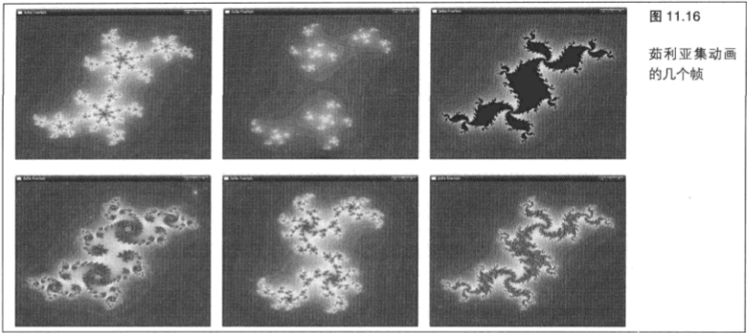

> 11.3.4 在片段着色器中丢弃工作

&emsp;&emsp;片段着色器是一种强大的工具,它可以帮助我们计算渲染像素的颜色。渲染的形状取决于渲染的几何图形。如果想要绘制形状更加细致的图形,就需要向 `OpenGL` 发送更多的几何图形。我们可以在部分透明的几何图形上使用 `alpha` 混合,但是到目前为止,还不能使用片段着色器控制形状。如果片段着色器决定某些对象是完全透明的, `OpenGL` 仍然会对深度缓冲区和模板缓冲区进行写入,甚至在它优化掉对颜色缓冲区的写入时也是如此。

&emsp;&emsp;对于片段着色器来说，通知 `OpenGL` 丢弃一起进行渲染的像素是可能的。这项工作可以通过使用 `discard` 关键字来完成。如果片段着色器执行了 `discard` 关键字,那么着色器的结果将会被丢弃,并且不会对任何输出缓冲区进行写入,包括深度、模板或者颜色缓冲区绑定。程序清单 `11.29` 中的例子展示了如何在片段着色器中实现 `alpha` 测试,这样就会允许在输出几何图形上裁剪出空洞。

```C++
#version 330
precision highp float;
uniform sampler2D my_texture;

in Fragment
{
    vec2 texture_coord;
} fragment;

out vec4 color_out;

void main(void)
{
    vec4 color = texture(my_texture, fragment.texture_coord);
    if (color.a < 0.1)
        discard;
    color_out = color;
}
```

&emsp;&emsp;在本例,如果存储在一个纹理中的 `alpha` 值小于某个阈值(在本例为 `0.1` ),就会执行 `discard` 关键字,那么片段着色器的结果就不会被写入到任何绑定的缓冲区中。如果 `alpha` 值大于或等于这个阈值,那么着色器将继续进行,而结果得到的颜色也将被写入。不要忘记, `alpha` 混合是在片段着色器之后由一个附加阶段执行的。着色器所要做的全部工作就是将颜色(包括它的 `alpha` 分量)写入到输出变量,而固定功能的混合阶段则负责将它混合到帧缓冲区时所需的计算。

&emsp;&emsp;片段着色器可以为了它所选择的任何原因执行 `discard` 关键字。除了将它建立在纹理的正确性基础上之外,它还可以通过对输入变量进行分析生成条件。如果将一个纹理作为决定因子使用,那么结果得到图像的细节层次就会取决于纹理的分辨率。如果这个决定是经过分析得到的,那么结果得到图像的细节则只取决于片段着色器的精度。例如,如果片段确定在集合内,那么我们可以修改茹利亚渲染器,执行 `discard` 关键字，正如程序清单 `11.30` 中的代码片段所示。

```C++
if (iterations = max_iterations)
    discard;

output_color = texture(tex_gradient, float(iterations) / float (max_iterations));
```

&emsp;&emsp;现在，当我们对分形进行渲染时，在它上面像素落在集合内的位置就会出现一个空洞，只有当像素离开集合时才会被着色。当放大茹利亚集(或者增加显示器的分辨率)时,空洞的边缘将会呈现更多的细节--这是分形的典型特性。我们可以在某些前面渲染过的几何图形上绘制茹利亚集,那么这些图形就可以透过这个空洞被观察到了。

> 11.3.5 逐片段控制深度

&emsp;&emsp;除了为片段着色器定义的输出变量之外,也可以在特殊的 `gl_FragDepth` 内建变量中写入和更新深度值。如果片段着色器不写入这个变量，由 `OpenGL` 生成的插值深度将作为片段的深度值来使用。片段着色器可以为 `gl_FragDepth` 计算一个全新的值,或者也可以使用 `gl_FragCoord.z` 值来控制深度值。接下来, `OpenGL` 既可以用这个新值进行深度测试,也可以将它作为写入到深度缓冲区的值。

&emsp;&emsp;我们可以使用这种功能对深度缓冲区中的值进行轻微的扰动，并创建物理上波动起伏的表面。当附加的几何图形进行渲染并随后进行深度测试时,它将针对这些扰动值进行测试。不过,在使用这些特性时要多加注意。如果片段着色器没有被写入 `gl_FragDepth` 变量,那么在片段着色器运行之前, `OpenGL` 就会知道深度的最终值是多少。

&emsp;&emsp;这样,在运行片段着色器之前执行深度测试就成为了大多数现代图形硬件所做的一项非常普遍的优化。如果片段的深度测试失败,那么 `OpenGL` 将不会运行片段着色器。但是,如果着色器确实写入到了 `gl_FragDepth` ,那么 `OpenGL` 就不知道这个片段是不是会通过深度测试了,或者说在片段着色器运行完之前不会知道。这样，它就必须总是运行片段着色器，并在着色器运行后执行深度测试。这样会导致性能大大降低。如果这对于我们试图实现的算法的正确功能来说是绝对必要的话,那么为了获得最佳性能,我们也只在片段着色器中写入 `gl_FragDepth` 。

&nbsp;

## 11.4 更高级的着色器函数

&emsp;&emsp;现在我们已经学习了一些在 `OpenGL` 中可以实现的有趣的东西。有一些更加高级的特性需要在各着色器阶段之间进行协作,或者不适合任何特定的着色器阶段。在这里我们将介绍其中的一部分。

> 11.4.1 插值和存储限定符

&emsp;&emsp;在前面的几章内容，我们已经接触了存储限定符，已经了解了如何使用 `flat` 存储限定符来关闭插值，并要求 `OpenGL` 在图元上执行平面着色。还有两种存储限定符可以对插值进行控制，我们可以使用它们进行高级渲染。它们就是 `centroid` 限定符和 `noperspective` 限定符，现在就来快速地了解一下。

&emsp;&emsp;**质心采样**

&emsp;&emsp;`centroid` 存储限定符控制 `OpenGL` 将片段着色器的输入插值到一个像素的什么地方。它只在渲染到多重采样表面的情况下应用,多重采样前面已经介绍过了。我们可以像指定其他任何存储限定符那样指定 `centroid` 存储限定符。要创建一个带有 `centroid` 存储限定符的变量，首先要在顶点着色器（或者几何着色器）中声明带有 `centroid` 关键字的输出变量。

```C++
centroid out vec2 tex_coord;
```

&emsp;&emsp;然后,在片段着色器中声明同一个带有 `centroid` 关键字的输入变量。

```C++
centroid in vec2 tex_coord;
```

&emsp;&emsp;现在 `tex_coord` 变量被定义为使用 `centroid` 存储限定符。如果我们有一个单采样绘制缓冲区，并不会有任何不同,而到达片段着色器的变量将会被插值到像素中心。当我们渲染到一个多重采样绘制缓冲区时,质心采样就变得有用了。根据 `OpenGL` 规范,当质心采样没有被指定时(默认情况下是这样),片段着色器变量将会被插值到像素中的任何位置。

&emsp;&emsp;当在一个大三角形的中间时，这一点其实并不重要。当我们对恰好位于三角形边缘的像素(也就是说，三角形的一个边穿过这个像素)进行着色时,就变得非常重要了。图 `11.17` 所示展示了 `OpenGL` 如何从一个三角形中进行采样的示例。

&emsp;&emsp;让我们来看一看图 `11.17(a)` 。它显示了一个穿过几个像素的三角形边。图中的实心点代表被三角形覆盖的样本,空心点则代表没有被三角形覆盖的样本。 `OpenGL` 选择了将变量插值到距离像素中心最近的样本，这些样本通过一个箭头指示。

&emsp;&emsp;对于左上角的像素来说，这样很好——它们完全没有被覆盖，而片段着色器也不会在这些像素上运行。

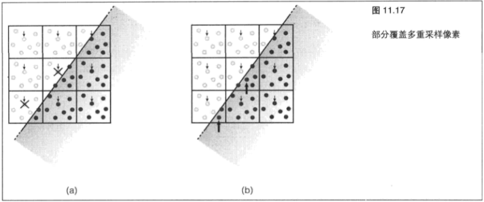

类似地，位于右下角的像素则完全被覆盖。片段着色器将会运行，在哪个样本上运行并不太重要。但是，在沿着三角形边缘的像素上，就会出现问题。因为 `OpenGL` 已经选择距离像素中心最近的样本作为它的插值点，我们的变量实际上可能会被插值到位于三角形外的一个点上！这些样本是由一个 `×` 标记的。比如说，想象一下如果我们使用这个变量对一个纹理进行采样，将会发生什么。如果这个纹理进行对齐，使它的边缘与三角形的边缘相匹配，那么纹理坐标将会落到纹理之外。在最好的情况下，我们将获得一个稍微有点不太正确的图像。在最坏的情况下,将会产生明显的痕迹。

&emsp;&emsp;如果我们声明带有 `centroid` 存储限定符的变量，那么 `OpenGL` 规范对此也有说明：“这些值必须被插值到一个同时位于像素中和被渲染的图元中的点上,或者被插值到像素的一个落到图元中的样本上”。

&emsp;&emsp;这就意味着 `OpenGL` 为每个像素选择了一个样本，这个样本一定是在一个所有变量将要插值到其上的三角形中。我们可以放心地在片段着色器中为了任何目的使用这个变量,并且知道它们是合法的,而且不会指向三角形之外的点。

&emsp;&emsp;现在让我们来看一看图 `11.17(b)` 。对于完全覆盖的像素， `OpenGL` 仍然选择将变量插值到距离像素中心最近的样本。但是,对于那些部分覆盖的像素来说, `OpenGL` 则会选择位于三角形内的其他样本(通过大一些的箭头指出)。这就意味着提供给片段着色器的输入是合法的,并且指向位于三角形内部的点。我们可以使用它们来在一个纹理中进行采样,或者在一个其结果只定义在特定范围内,并且已知可以得到有意义的结果的函数中使用它们。

&emsp;&emsp;你可能会想,如果使用 `centroid` 存储限定符就能保证在片段着色器中得到正确的结果,而不使用它可能就意味着变量将会落在图元之外,那么为什么不一直开启质心采样呢?其实,使用质心采样还存在一些不利的因素。其中最重要的就是 `OpenGL` 能够向片段着色器提供输入的过渡(或者微分)。对于具体的实现来说可能情况有所不同,但多数都使用离散微分,在相邻像素的相同变量之间获取差值。这种方式在变量被插值到每个像素的同一位置时非常适合。在这种情况下,选择哪个采样位置并不重要,样本总是会恰好间隔一个像素。但是,在为一个输入开启质心采样时，相邻像素的值实际上可能会在这些像素中被插值到不同的位置。这就意味着这些样本的间隔将不是恰好一个像素,而提供给片段着色器的离散微分可能会是不准确的。

&emsp;&emsp;如果在片段着色器中需要精确地过渡，那么最好不要使用质心采样。

&emsp;&emsp;**使用质心采样来执行边缘测试**

&emsp;&emsp;质心采样的一种有趣应用就是硬件加速边缘检测。我们刚刚学习了使用 `centroid` 存储限定符来确保我们的变量被插值到一个确定落在进行渲染的图元之内的点上。为了实现这一点, `OpenGL` 选择了一个它确定会落在三角形之内的样本,来对这些变量进行评估,而 `OpenGL` 在这个像素被完全覆盖时所选择的样本和在没有使用 `centroid` 存储限定符时所选择的样本可能会不同。我们可以充分利用这些知识。

&emsp;&emsp;为了从中提取边缘信息，我们声明两个变量，其中一个带有 `centroid` 存储限定符，而另外一个则没有,并且在顶点着色器中为它们指定同一个值。

&emsp;&emsp;只要这个值对于每个顶点来说是不同的，那么它的具体值就不重要。经过变换的顶点位置的 `×` 和 `y` 分量可能是一个很好的选择，因为我们知道对于任何实际可见的三角形来说，每个顶点的值都是不同的。

```C++
out vec2 maybe_outside;
```

&emsp;&emsp;为我们提供了非质心变量，可以插值到三角形之外的一个点上，而

```C++
centroid out vec2 certainly_inside;
```

&emsp;&emsp;则为我们提供了已知在三角形之内的质心采样变量。

&emsp;&emsp;在这个片段着色器中，我们可以将两个变量的值进行比较。如果这个像素完全被三角形遮盖，那么 `OpenGL` 就会为这两个变量都使用同一个值。但是,如果像素只是部分地被三角形遮盖,那么 `OpenGL` 会为 `maybe_outside` 采样使用它的一般选择,并为 `certainly_inside` 挑选一个确定会落在三角形之内的样本。这样选择的样本就可能与为 `maybe_outside` 选择的样本不同,并且这就意味着这两个变量的值可能会不同。现在我们可以对这两个值进行比较来确定是否在图元的边缘上。

```C++
bool may_be_on_edge = any(maybe_outside != certainly_inside);
```

&emsp;&emsp;这种方法并不是十分简单。即使一个像素是在三角形的边缘上，它也可能覆盖 `OpenGL` 初始选择的样本，这样对于 `maybe_outside` 和 `certainly_inside` 来说仍然会得到同样的值。然而,这样产生的边缘像素最多。

&emsp;&emsp;为了使用这些信息，我们可以将这个值写入一个绑定到帧缓冲区的纹理，然后使用这个纹理进行进一步的处理。另一种选择是只绘制到模板缓冲区,将模板参考值设为 `1` ,禁用模板测试,然后将模板操作设为 `GL_REPLACE` 。当遇到边缘时,让片段着色器继续运行。当遇到不在边缘上的像素时,在着色器中使用 `discard` 关键字防止像素被写入到模板缓冲区。这样做的结果是,模板缓冲区在场景中的边缘处是一些 `1` ,而在没有边缘的地方都是 `0` 。接下来,我们可以使用一个大开销的片段着色器渲染一个全屏四边形,这个片段着色器只应用在通过开启模板测试,将模板函数设置为 `GL_EQUAL` ，并保留参考值为 `1` 来表示几何图形边缘的像素上。这种着色器能够实现前面描述过的图像处理操作。例如,使用一个卷积操作(如本章前面部分所演示的)应用高斯模糊，可以将场景中多边形的边缘变得平滑，允许应用程序执行抗锯齿。

&emsp;&emsp;**无透视矫正的插值**

&emsp;&emsp;就像我们已经学过的一样, `OpenGL` 使用变量的值在图元(例如三角形)的表面进行插值,并为片段着色器的每一次调用提供一个新值。在默认条件下,插值在三角形的空间中是线性的。这就意味着,如果直着面对这个三角形看去，这些变量在它表面上的步长是相等的。但是, `OpenGL` 会在逐像素步进时在屏幕空间进行插值。直接面向三角形观察的情况非常少见，这样透视缩短就意味着从像素到像素的每次步进都不是常量--也就是说，它们在屏幕空间中不是线性的。 `OpenGL` 使用透视校正( `perspective-correct` )插值对此进行校正。

&emsp;&emsp;要做到这一点,它会使用在屏幕空间中呈线性的值进行插值,并使用它们来获取在每个像素上变量的实际值。

&emsp;&emsp;让我们考虑一个纹理坐标 `uv` ,它将被插值到一个三角形上。 `u` 和 `v` 在屏幕空间中都不是线性的。但是(由于某些超出这部分知识范围的数学因素), `u/w` 和 `v/w` 在屏幕空间是线性的,正如 `1/w` ( `w` 是片段坐标的第 `4` 个分量)一样。这样, `OpenGL` 实际上是在每个像素上

$$\dfrac{u}{w},\dfrac{v}{w} and \dfrac{1}{w}$$

进行插值的,它用 `1/w` 来找出 `w` ,然后再用 `u/w` 和 `v/w` 分别乘以 `w` 来找出 `u` 和 `v` 。这样就为片段着色器的每个实例的插值提供了透视校正值。

&emsp;&emsp;一般来说，这正是我们想要的。但是，有时候这也可能不是我们所希望的。

&emsp;&emsp;如果我们实际上希望无论图元方向如何都在屏幕空间中进行插值，可以使用 `noperspective` 存储限定符。

&emsp;&emsp;例如，在顶点着色器中使用：

```C++
noperspective out vec2 texcoord;
```

&emsp;&emsp;而在片段着色器中使用：

```C++
noperspective in vec2 texcoord;
```

&emsp;&emsp;使用透视校正和屏幕空间线性(非透视)渲染的结果分别如图 `11.18 (a)` 和图 `11.18 (b)` 所示。

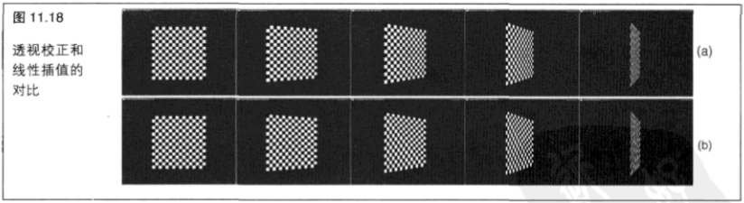

&emsp;&emsp;图 `11.18 (a)` 所示展示了应用到一对三角形上的透视校正插值,这对三角形相对于观察者的角度是变化的。同时,图 `11.18 (b)` 所示则展示了 `noperspective` 存储限定符是如何影响纹理坐标的插值的。随着这对三角形的移动，相对于观察者的角度也越来越斜，纹理也变得越来越斜。

> 11.4.2 高级内建函数

&emsp;&emsp;`GL` 着色语言（ `GLSL` ）和 `C` 语言非常相近。诸如 `for` 、 `while` 和 `do` 这样的循环结构实际上和 `C` 语言中的定义是相同的,而像 `if-else` 声明、 `switch` 声明和?操作符这样的条件结构也是如此。

&emsp;&emsp;`C` 标准库中的许多标准数学函数在 `GLSL` 中也可以使用,其中包括类似 `sin` , `cos` 和 `tan` 这样的三角函数,类似 `abs` 、 `floor` 和 `ceil` 这样的数学函数，类似 `pow` 、 `exp` 和 `log` 这样的指数函数,以及类似`+` 、和 `==` 这样的内建操作符。如果读者使用 `C` 语言或其他类似 `C` 语言的经验,那么就会对这些函数非常熟悉。但是,既然 `GLSL` 是为了对图元进行操作而设计的,就还有一些内建函数用来对向量和矩阵类型进行操作,而它们常常能够在硬件中应用得很理想。在大多数情况下,这些函数可以用于任何着色器阶段。

&emsp;&emsp;除了这些标准数学函数之外， `GLSL` 还提供一些实用函数，例如 `clamp` (将一个值截取到两个值之间的范围内)、 `mix` (执行线性插值),以及 `step` 和 `smoothstep` (根据两个值的输入在它们之间创建过渡)。

&emsp;&emsp;同样,浮点值和整数值之间的位强制类型转换也可以使用 `intBitsToFloat` 和 `floatBitsTolnt` 函数和它们的无符号变体执行。

&emsp;&emsp;`GLSL` 向量函数包括 `dot` 和 `cross` ，就像名字提示的那样，它们分别执行一个点乘和一个叉乘操作。另外，函数 `outerProduct` 可以用来提取两个向量的外积。 `distance` 和 `length` 函数分别计算两点之间的距离和一个向量的长度,可以使用 `normalize` 函数对一个向量进行标准化。还有一些更加复杂的情况, `reflect` 和 `refract` 函数提供内建的、潜在优化的反射和反射方程实现，它们通常在光照和路径追踪算法中使用。

&emsp;&emsp;更高级的矩阵相关函数包括 `transpose` 、 `determinant` 和 `inverse` ,分别进行矩阵转置、求行列式和求逆矩阵操作。此外, `matrixCompMult` 函数在两个矩阵之间执行一个逐分量相乘的操作。这个函数是十分必要的,因为默认乘法操作符(")应用在矩阵中执行的是矩阵与矩阵的乘法。

&emsp;&emsp;因为关系运算符(例如 `>` 、 `!=` 和 `<=` )是设计用来生成单个标量布尔值结果的，所以这些比较运算符的向量版本就作为内建函数来提供,返回布尔向量。它们包括 `lessThan` , `notEqual` 和 `lessThanEqual` 等。为了在结果得到的布尔向量上执行集合操作,我们还可以使用 `any` (在任一变量为真时返回真)和all (在所有变量为真时返回真)函数。

&emsp;&emsp;布尔向量不能作为一个 `if` 语句的表达式来提供,所以我们需要使用 `any` 或 `all` 将向量转化为标量才能在条件语句中使用。

&nbsp;

## 11.5 统一缓冲区对象

&emsp;&emsp;到目前为止，我们所写的着色器已经变得很复杂了。其中有一些还需要很多常量数据，而将这些数据传递到着色器的方法就是使用统一值。如果在一个应用程序中有很多着色器,那么就需要为这些着色器中的每一个设置统一值,这就意味着要很多次调用不同的 `glUniform` 函数。我们还需要跟踪统一值的变化。有些变化会改变所有对象,有些变化则每次改变一个帧,而另一些则只需要为整个应用程序初始化一次。这就是说,我们要么需要为位于应用程序不同位置的不同的统一集合进行更新,使它们维护起来更加复杂,要么以性能为代价总是同时更新所有的统一值。

&emsp;&emsp;为了减轻所有 `glUniform` 调用的开销,使更新一组大量的统一值更加简单,同时也为了更容易地在不同程序之间共享一组统一值， `OpenGL` 允许将一组统一值组合到一个统一块中，并在一个缓冲区对象中存储整个块。缓冲区对象与我们以前使用过的其他缓冲区对象类似。我们可以通过改变缓冲区绑定,或者覆盖一个绑定缓冲区的内容来快速地设置整个一组统一值。我们还可以在改变程序时保持缓冲区绑定，而新的程序将看到当前的统一值设置。这项功能叫做统一缓冲区对象（ `uniform buffer object` ），缩写为 `UBO` 。实际上,我们到目前为止使用的统一值都在默认块中。一个着色器中全局声明的任何统一值最终都会在默认统一块中。我们不能在一个统一缓冲区对象中保存默认块，需要创建一个或多个统一块并对其命名。

&emsp;&emsp;要声明一组存储在缓冲区对象中的统一值,需要在着色器中使用一个命名的统一块。这看起来很像一个接口块，但是它使用的是 `uniform` 关键字。程序清单 `11.31` 展示了着色器中相应的代码。

```C++
uniform TransformBlock
{
    float scale; //应用到各处的全局缩放
    vec3 translation; //在x. Y和2方向平移
    float rotation[3]; //围绕x. Y和z轴旋转
    mat4 projection_matrix; //在进行缩放和旋转之后应用的广义投影矩阵
 } transform;
```

&emsp;&emsp;这段代码声明了一个名为 `TransformBlock` 的统一块,还声明了一个名为 `transform` 块的实例。在着色器内部,我们可以使用它的实例名 `transform` 在块中引用这个成员。但是,为了设置将要用来返回块的缓冲区对象中的数据，我们需要知道块的一个成员的位置，并且为此我们需要块的名称 `TransformBlock` 。如果我们需要块的多个实例，每个实例都有自己的缓冲区，那么可以将 `transform` 设为一个数组。

&emsp;&emsp;这个块的成员在每个块中将会有相同的位置,但是现在我们在着色器中将能够引用这个块的几个实例了。当我们想要用数据填充一个块时,在这个块中查询成员的位置就非常重要了,这一点在接下来的内容中将进行解释。

> 11.5.1 建立同一块

&emsp;&emsp;在着色器中通过指定统一块进行访问的数据可以在缓冲区对象中进行存储。一般说来,使用 `glBufferData` 或 `glMapBuffer` 这样的函数对缓冲区对象进行数据填充是应用程序的工作。那么,现在的问题就是,缓冲区中的数据应该是什么样的?这里实际上有两种可能性,无论选择哪种都是进行权衡的结果。第一种情况是让 `OpenGL` 决定将数据放在哪里。这样可以生成效率最高的缓冲区,但是这就意味着应用程序需要确定将数据放在哪里，以便 `OpenGL` 能够读取它们。这样做可能会非常不方便，所以第二种方法中数据采用一种标准的、受到认可的布局。这就意味着应用程序只需将数据复制到缓冲区并在块中为成员分配位置就可以了-—我们甚至可以将数据提前存储在磁盘上，并直接将它们读取到一个使用 `glMapBuffer` 进行映射的缓冲区就可以了。既然这种布局是标准的,适合所有图形硬件和驱动，那么它对于其中的任何一种都不是最优的。这是因为在块的各种成员之间保留了一些空闲的空间,使缓冲区比需要的大。我们可能要为换取这种方便而付出一些性能上的代价。我们在这里对这两种方法都进行了介绍，读者需要决定哪一种方法最适合应用程序。

&emsp;&emsp;数据存储在统一缓冲区中的第一种布局是共享布局(`shared layout`)。如果没有明确地对 `OpenGL` 提出其他要求的话，那么这就是默认的布局了。在共享布局的情况下，缓冲区中的数据将由 `OpenGL` 决定如何布置对于运行时性能和着色器访问来说才是最佳的。这样经常可以使着色器获得更高的性能,但需要应用程序做更多的工作。这种布局被称为共享布局的原因就是,当 `OpenGL` 在缓冲区中对数据进行排列时，这种排列在共用相同的统一块声明的多个程序和着色器之间是相同的。例如，着色器编译器仍然会为统一块的成员保留空间,即使在着色器并不使用它们时也是如此。这样就允许我们在任何程序上使用同一个缓冲区对象了。要使用共享布局,应用程序必须在缓冲区对象中确定统一块成员的位置。

&emsp;&emsp;一个统一块的每个成员都有一个索引，用于对它进行引用，来查询它的大小和在块中的位置。为了获取一个统一块中一个成员的索引，我们可以调用：

```C++
void glGetUniformIndices(GLuint program, GLsizei uniformCount, const GLchar** uniformNames, GLuint* uniformIndices);.
```

&emsp;&emsp;这看起来似乎非常复杂，但其实却并非如此。这个函数允许我们通过在 `OpenGL` 中进行一次调用来获取一组大量统一值的索引——甚至可能是一个程序中所有的统一值，即使它们是不同块中的成员。它接受对我们想要进行索引的统一值的数量的一个计数值(`uniformCount`),一个统一值名称的数组(`uniformNames`),并将它们的索引放在一个数组(`uniformIndices`)中。程序清单 `11.32` 包含一个示例告诉我们如何检索前面声明的 `TransformBlock` 中成员的索引。

```C++
const GLchar*uniformNames[4] =
{
    "TransformBlock.scale",
    "TransformBlock.translation",
    "TransformBlock.rotation",
    "TransformBlock.projection_matrix"
};
GLuint uniformIndices[4];

glGetUniformIndices(program, 4, uniformNames, uniformIndices);
```

&emsp;&emsp;在这个代码运行之后,就得到了 `uniformIndices` 数组中统一块的 `3` 个成员索引。现在有了索引,就可以使用它们来查找缓冲区中块成员的位置了。为了完成这项工作，我们可以调用：

```C++
void glGetActiveUniformsiv(GLuint program, GLsizei uniformCount, const GLuint* uniformIndices, GLenum pname, GLint* params);
```

&emsp;&emsp;这个函数能够提供很多关于指定统一块成员的信息。

&emsp;&emsp;我们感兴趣的信息是缓冲区中成员的偏置量、数组步长(为了进行 `TransformBlock.rotation` )和矩阵步长(为了进行 `TransformBlock.projection_matrix` )。这些值告诉我们要将数据放在缓冲区的什么地方,以便着色器能够访问它们。我们可以将 `pname` 分别设置为 `GL_UNIFORM_OFFSET` , `GL_UNIFORM_ARRAY_STRIDE` 和 `GL_UNIFORM_MATRIX_STRIDE` 来从 `OpenGL` 中查询这些值。程序清单 `11.33` 展示了相应的代码。

```C++
GLint uniformOffsets[4];
GLint arrayStrides[4];
GLint matrixStrides[4];

glGetActiveUniformsiv(program, 4, uniformIndices, GL_UNIFORM_OFFSET, uniformOffsets);
glGetActiveUniformsiv(program, 4, uniformIndices, GL UNIFORM ARRAY STRIDE, arrayStrides);glGetActiveUniformsiv(program, 4, uniformIndices, GL_UNIFORM_MATRIX_STRIDE, matrixStrides);
```

&emsp;&emsp;程序清单 `11.33` 中的代码执行之后, `uniformOffsets` 中就包含了 `TransformBlock` 块中成员的偏置量, `arrayStrides` 中包含了数组成员(目前只有 `rotation` )的步长,而 `matrixStrides` 中则包含了矩阵成员(只有 `projection_matrix` )的步长。我们可以查询的其他关于统一块成员的信息包括统一值的数据类型,它在内存中消耗的空间大小(以字节为单位),以及与这个块中数组和矩阵相关的布局信息。我们需要其中一些信息来对一个类型更加复杂的缓冲区对象进行初始化,即使是我们自己编写的这些着色器并且已经知道了这些成员的大小和类型。表 `11.5` 列出了 `pname` 能够接受的值和对应的返回信息。

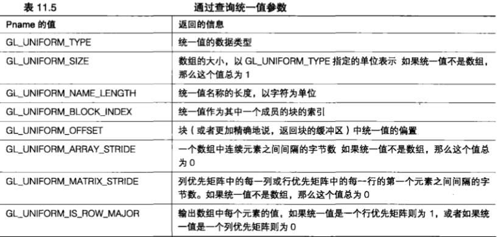

&emsp;&emsp;如果我们感兴趣的统一值类型是诸如 `int` 、 `float` 、 `bool` 这样的简单类型,或者甚至是这些类型的向量( `vec4` 等),那么我们所需要的就只是它的偏移量了。一旦知道了缓冲区中的统一值位置,就可以将偏移值传递到 `glBufferSubData` 在正确的位置加载数据,或者也可以在代码中直接使用偏移量在内存中装配缓冲区了。在这里,我们对后一种选择进行了演示,因为它强化了统一值存储在内存中的思想,就像纹理或顶点信息一样。这也意味着更少的 `OpenGL` 调用,这样做有时会带来更高的性能。对于这些例子来说，在应用程序的内存中装配数据，然后再使用 `glBufferData` 将它加载到一个缓冲区中。我们也可以选择使用 `glMapBuffer` 来获取一个指向缓冲区内存的指针,并将数据直接装配到这个缓冲区中。让我们从设置 `TransformBlock` 块中最简单的统一值—— `scale` 开始吧。这个统一值是一个单独的 `float` (浮点类型),它存储在 `uniformIndices` 数组的第一个元素中。程序清单 `11.34` 展示了如何设置这个浮点类型的值。

```C++
// 为我们的缓冲区分配一些内存（后面不要忘记释放它们）
unsigned char* buffer = (unsigned char *)malloc(4096);

// 我们知道是在块中的位，所以我们可以相应对我们的缓冲区指针进行偏置来进行存储
*((float*)(buffer + uniformOffsets[0])) = 3.0f;
```

&emsp;&emsp;接下来我们就可以为 `TransformBlock.translation` 进行初始化数据了。这是一个 `vec3`, 也就是说它包含3个浮点值，它们紧密地包装在内存中。为了对其进行更新，需要找出这个向量的第一个元素的位置，并从那个位置开始将 `3` 个连续的浮点值存储到内存中。程序清单 `11.35` 显示了这些代码。

```C++
//将3个连续的GLfloat值放入内存来更新vec3.
*((float)(buffer + uniformoffsets[1])) = 1.0f;
*((float)(buffer + uniformOffsets[1] + sizeof(GLfloat))) = 2.0f;
*((float)(buffer + uniformOffsets[1] + 2 * sizeof(GLfloat))) = -3.Of;
```

&emsp;&emsp;现在,让我们来对付 `rotation` 数组。在这里我们也可以使用一个 `vec3` ,但是为了达到这个示例的目的,我们使用一个 `3` 个元素的数组来演示 `GL_UNIFORM_ARRAY_STRIDE` 参数的应用。在使用共享布局时，数组是作为一个元素序列单独定义的，这个序列的步长以字节为单位，由具体的实现来定义。这就意味着我们必须将元素放到由 `GL_UNIFORM_OFFSET` 和 `GL_UNIFORM_ARRAY_STRIDE` 定义的缓冲区中,正如程序清单 `11.36` 中的代码片段所示。

```C++
// TransformBlock.rotations[0]是在缓冲区的uniformOffsets[1]位
// 数组的每个元素都在多个 arrayStrides[1]位之后
const GLfloat rotations[] = { 30.0f, 40.0f, 60.0f };
unsigned int offset = uniformoffsets[2];

for (int n = 0; n < 3; n++) {
    *((float*)(buffer + offset)) = rotations[n];
    offset += arrayStrides[2];
}
```

&emsp;&emsp;最后,我们为 `TransformBlock.projection_matrix` 设置这些数据。统一块中矩阵的行为与向量数组非常相似。对于列优先的矩阵（默认情况下如此）来说，矩阵的每一列都会被当作一个向量来对待，它的长度就是矩阵的高度。类似地,行优先的矩阵也会被当作一个向量数组来对待，其中每一行就是这个数组中的一个元素。就像普通的数组一样，矩阵中每一列（或每一行）的初始偏置是由一个由实现定义的量来决定的。它可以通过 `glGetActiveUniformsiv` 的 `GL_UNIFORM_MATRIX_STRIDE` 参数来查询。矩阵的每一列都可以使用与用来初始化 `vec3 TransformBlock.translation` 的代码相似的代码进行初始化。程序清单 `11.37` 列出了这些设置代码。

```C++
// TransformBlock.proiection matrix的第一列位于缓冲区中的uniformoffsets[2]位
// 这些列以matrixStride[2] bytes的步长放置,实际上他们都是一些vec4
// 这就是源矩阵一还记得吧,它是列优先的,所以

const GLfloat matrix[] =
{
    1.0f, 2.0f, 3.0f, 4.0f,
    9.0f, 8.0f, 7.0f, 6.0f,
    2.0f, 4.0f, 6.0f, 8.0f,
    1.0f, 3.0f, 5.0f, 7.0f
};

for (int i = 0; i < 4; i++)
{
    GLuint offset = uniformOffsets[2] + matrixStride[2] * i;
    for (j = 0; j< 4; j++)
    {
        *((float*)(buffer + offset)) = matrix[i * 4 + j];
        offset += sizeof(GLflcat);
    }
}
```

&emsp;&emsp;这种查询偏置和步长的方法适用于任何布局。对于共享布局来说,这是唯一的选择。但是,这种方法有些不太方便,并且就像我们能够看到的,需要编写很多代码将数据以正确的方式在缓冲区进行布局。作为一种选择,我们也可以使用 `standard` (标准)布局。标准布局允许我们根据 `OpenGL` 提供的一组为各种数据类型指定大小和排列的规则决定将数据放在缓冲区的什么位置。这些规则在所有 `OpenGL` 实现中都是通用的,这样我们不需要进行任何查询就可以使用它们了(不过我们还是应该查询偏置和步长,以确保结果是正确的)。

&emsp;&emsp;为了告诉 `OpenGL` 我们想要使用标准布局,需要声明带有布局限定符的统一块。 `TransformBlock` 的一个带有布局限定符的重复声明 `std140` 如程序清单 `11.38` 所示。

```C++
layout (std140) uniform TransformBlock
{
    float scale;            // 应用到各处的全局缩放
    vec3 translation;       // 在 x, y 和 z 方向平移
    float rotation[3];      // 围绕 x, y 和 z 轴旋转
    mat4 projection_matrix; //在进行缩放和旋转之后应用的广义投影矩阵
} transform;
```

&emsp;&emsp;一旦一个统一块被声明为使用标准布局，或者说 `std140` 布局，这个块的每个成员就会在缓冲区以遵循一组规则确定的偏置占用预先定义好的空间大小。这些规则概述如下。

&emsp;&emsp;任何在缓冲区中占用 `N` 个字节的类型都会在这个缓冲区中的一个 `N` 个字节的分界处开始。这就意味着诸如  `int` 、 `float` 和 `bool` 这样的标准 `GLSL` 类型(它们的大小都定义为 `32` 位或者 `4` 个字节)在 `4` 个字节的倍数的位置开始。这些类型长度为 `2` 的向量总是在一个 `2N` 字节分界处开始。举例来说，这就意味着一个在内存中长度为 `8` 字节的 `vec2` ,总是在一个 `8` 字节分界处开始。 `3` 元素和 `4` 元素向量总是在一个 `4N` 字节的分界处开始,所以 `vec3` 和 `vec4` 类型会在 `16` 字节分界处开始。一个标量数组或者向量类型数组(例如 `ints` 或 `vec3s` )总是在以同样规则定义的分界处开始,但是会进行上舍入与 `vec4` 看齐。特别是,这意味着除了 `vec4` (以及 `Nx4` 矩阵)之外的任何数组都不会进行紧密的包装,但是这样就会在每个元素之间出现一个缺口。矩阵本质上是被当作向量的数组来对待的,而矩阵的数组则被当作很长的向量数组对待。最后,结构体和结构体的数组都需要进行额外的包装:整个结构体从它最大的成员所要求的分界点开始，并上舍入到 `vec4` 的大小。

&emsp;&emsp;我们必须要特别注意 `std140` 布局和包装规则之间的区别，而随后经常紧接着的就是选择的编译器。特别是，统一块中的一个数组没有必要进行紧密的包装。举例来说，这就意味着我们无法在一个统一块中创建一个 `floats` 的数组，并简单地从一个 `C` 语言的 `floats` 数组中将数据复制到其中，因为来自 `C` 数组的数据将进行包装,而统一块中的数据则不会进行包装。

&emsp;&emsp;这些听起来都很复杂，但是逻辑性很好，经过很好的定义，并且允许大范围的图形硬件高效地实现统一缓冲区对象。回到  `TransformBlock` 示例，可以使用这些规则来确定缓冲区中块的成员的偏置。程序清单 `11.39` 展示了一个统一块及其成员偏置一起进行声明的示例。

```C++
layout (std140) uniform TransformBlock
{
    // 成员             基本排列        偏置        排列偏置
    float scale;        //4             0           0
    vec3 translation;   //16            4           16
    float rotation[3];  //16            28          32 (rotation[0])
                        //                          48 (rotation[1])
                        //                          64 (rotation[2])
    mat4 projection_matrix;// 16        80          80 (column 0)
                        //                          96 (column 1)
                        //                          112 (column 2)
                        //                          128 (column 3)
} transform;
```

&emsp;&emsp;在 `ARB_uniform_buffer_object` 扩展规范中有一个关于各种类型排列的完整示例。

&emsp;&emsp;现在我们已经对缓冲区进行了填充，可以将它绑定到程序中的一个统一块了。在进行这些操作之前，还需要对这个统一块的索引进行检索。程序中每一个统一块都有一个由编译器分配的索引。有一个固定的统一块最大值，可以用于单个程序，还有一个可以在任何给定的着色器阶段使用的最大值。我们可以通过调用带有 `GL_MAX_UNIFORM_BUFFERS` 参数的 `glGetintegerv` 来查找这些限制(每个程序的总限制)用 `GL_MAX_VERTEX_UNIFORM_BUFFERS` , `GL_MAX_GEOMETRY_UNIFORM_BUFFERS` 或 `GL_MAX_FRAGMENT_UNIFORM_BUFFERS` 分别查找顶点着色器、几何着色器和片段着色器的限制。为了获取程序中一个统一块的索引，我们可以调用：

```C++
GLuint glGetUniformBlockIndex (GLuint program, const GLchar * uniformBlockName);
```

&emsp;&emsp;它将返回指定统--`块的索引。在示例统一块声明中，uniformBlockName` 为“ `TransformBlock` ”。这里有一组缓冲区绑定点，可以将一个缓冲区绑定到它们，来为统一块提供数据。将一个缓冲区绑定到一个统一块上,实际上是一个分为两步的处理过程。统一块被分配了绑定点,然后缓冲区可以被绑定到这些绑定点上,将缓冲区和统一块匹配起来。这样,不同的程序可以在不改变缓冲区绑定的情况下来回切换,而固定的统一值集合可以自动地被新的程序访问。将它与默认块中统一值的值进行比较,这些值就是每个程序相关的状态。即使两个程序包含同样名称的统一值,它们的值也必须分别为每个程序进行设置,并且在活动的程序改变时也将随之改变。

&emsp;&emsp;要将一个绑定点分配给一个统一缓冲区，可以调用

```C++
void glUniformBlockBinding (GLuint program, GLuint uniformBlockIndex, GLuintuniformBlockBinding);
```

&emsp;&emsp;其中 `program` 是我们改变的统一块所在的程序。 `uniformBlockIndex` 则是我们将一个绑定点分配到统一块的索引,刚才已经通过调用 `glGetUniformBlockIndex` 来检索它了。 `uniformBlockBinding` 是统一块绑定点的索引。一个 `OpenGL` 的实现提供一个固定的绑定点最大数量，我们可以通过调用以 `GL_MAX_UNIFORM_BUFFER_BINDINGS` 为参数的 `glGetIntegerv` 来查询这个限制。

&emsp;&emsp;一旦将绑定点分配给程序中的统一块,就可以将缓冲区绑定到这些相同的绑定点来使缓冲区中的数据出现在这些统一块中。我们通过调用：

```C++
glBindBufferBase(GL_UNIFORN_BUFFER, index, buffer);
```

来完成这项工作。

&emsp;&emsp;在这里，`GL_UNIFORM_BUFFER` 告诉 `OpenGL` 我们将一个缓冲区绑定到了统一缓冲区的一个绑定点上,  `index` 是绑定点的索引,并且应该和我们在调用 `glUniformBlockBinding` 时的 `uniformBlockBinding` 中所指定的相匹配。 `buffer` 是我们想要绑定的缓冲区对象。请注意 `index` 并不是统一块的索引( `glUniformBlockBinding` 中的 `uniformBlockIndex` ) ,而是统一缓冲区绑定点的索引。这是一个普遍出现的错误，并且很容易被忽视。

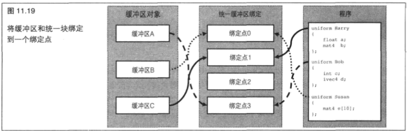

&emsp;&emsp;在图 `11.19` 中,有一个包含 `3` 个统一块(`Harry`, `Bob` 和 `Susan`)和 `3` 个缓冲区对象(`A` 、 `B` 和 `C`)的程序。 `Harry` 被分配给绑定点 `1` ,缓冲区 `C` 被绑定到绑定点 `1` ,所以 `Harry` 的数据就来自缓冲区 `C` 。类似地, `Bob` 被分配给绑定点 `3` ,而缓冲区 `A` 被绑定到绑定点 `3` ,所以 `Bob` 的数据就来自缓冲区 `A` 。最后， `Susan` 被分配给绑定点 `0` ，缓冲区 `B` 被绑定到绑定点 `0` ，所以 `Susan` 的数据就来自缓冲区 `B` 。请注意绑定点 `2` 并没有被使用。这没有关系，我们可以将一个缓冲区绑定到这里，但是程序不会使用它。

&emsp;&emsp;程序清单 `11.40` 列出了对此进行设置的代码，这些代码非常简单。

```C++
// 使用glGetUniformBlockIndex来获取统一块的索引
GLuint harry_index = glGetUniformBlockIndex(program, "Harry");
GLuint bob_index = glGetUniformBlockIndex(program, "Bob");
GLuint susan_index = glGetUniformBlockIndex(program, "Susan");

// 使用统一块的索引来为它们分配缓冲区绑定
glUniformBlockBinding(program, harry_index, 1);
glUniformBlockBinding(program, bob_index, 3);
glUniformBlockBinding(program, susan_index, 0);

// 将缓冲区绑定到绑定点
// 绑定 0，缓冲区 B 和 Susan 的数据进行绑定
glBindBufferBase(GL_UNIFORM_BUFFER, 0, buffer_b);
// 绑定 1，缓冲区 c 和 Harry 的数据进行绑定
glBindBufferBase(GL_UNIFORM_BUFFER, 1, buffer_c);

// 请注意我们跳过了绑定2
// 绑定 3，将缓冲区 C 和 Harry 的数据进行绑定
glBindBufferBase(GL_UNIFORM_BUFFER, 3, buffer_a);
```

&emsp;&emsp;统一块的一种普遍用法就是从瞬时状态分离出稳定状态。通过使用一个标准约定为所有程序设置绑定,我们可以在改变程序时让缓冲区保持绑定。例如，如果有一些相对固定的状态——比如说投影矩阵、视口大小和一些其他东西，它们每一帧改变一次，或者更少——那么我们可以将这个信息保留在一个绑定到绑定点0的缓冲区中,然后,如果将所有程序将固定状态的绑定设为 `0` ,那么无论何时使用 `glUseProgram` 切换程序，这些统一值都会保留在缓冲区中以备使用。

&emsp;&emsp;现在,比如说我们有一个片段着色器模拟某种材质(例如布或金属),就可以将材质的参数放到其他缓冲区中。在我们对这种材质进行着色的程序中，将包含这种材质参数的统一块绑定到绑定点 `1` 上。每个对象都会维护一个包含它的表面参数的缓冲区对象。在对每个对象进行渲染时，它使用通用材质着色器，并将它的参数缓冲区绑定到缓冲区绑定点 `1` 。

&nbsp;

## 11.6 小结

&emsp;&emsp;在本章,我们学习了一些可以在 `OpenGL` 程序中使用的更加高级的着色器技术。这里介绍的主题中有很多都允许我们编写更加高效的应用程序，生成更简短的着色器，或者实现高级渲染技术。我们了解了使用顶点着色器来完成除了简单地将顶点变换到它们最终位置之外的更多工作。本章引入了一个全新的着色器单元--几何着色器,同时还学习了如何使用它来创建、销毁和修改几何图元。

&emsp;&emsp;我们甚至还看到了,可以在几何图形在OpenGL管线中进行传递时改变它的类型。除了简单地对模型表面上的像素进行着色之外,片段着色器还有更多的应用。我们可以用它对一个已经进行预渲染的图像上应用后期处理效果，甚至在一个片段着色器中生成整个图像。

&emsp;&emsp;本章还介绍了 `GLSL` 语言的许多更高级特性，可以利用这些特性在着色器中实现有趣的效果和算法。我们知道了可以在缓冲区对象中存储统一值，也可以在切换程序时保持这些缓冲区的绑定。这样大大减少了我们保持常用统一值在程序之间及时更新所需要做的工作。
