# 高级几何图形管理

&emsp;&emsp;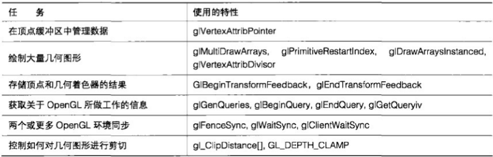

&emsp;&emsp;在本章，我们介绍一些与几何图形管理相关的更高级 `OpenGL` 特性。其中包括查询已经进行了哪些渲染，以及从 `OpenGL` 中获取关于它处理的几何图形数量的信息。本章还介绍了一种存储渲染中间结果以备后续使用的方法，以及如何对两个 `OpenGL` 环境进行同步，以便其中一个环境能够使用另一个环境产生的数据。

&emsp;&emsp;我们会学到如何在图形加速卡内存中管理几何图形数据,以及如何控制 `OpenGL` 处理批量图元,例如三角形扇和线带。我们还会学到如何使一个 `OpenGL` 应用程序将大量几何图形渲染到图形加速卡。

&emsp;&emsp;这些技术中有许多都是设计用来提高性能和 `GPU` 能够处理的任务数量上限的。但是，也有一些让我们能够使用 `GPU` 来应用新的、有趣的技术，而这些技术是用其他方法不能实现的。

## 12.1 查询功能

&emsp;&emsp;我们都希望询问 `OpenGL` 是否绘制了调用的函数所要的结果,这看起来是一个奇怪的问题。我们刚刚调用了一长串的 `OpenGL` 函数,还将很多几何图形发送到 `OpenGL` 管线,那么当然要绘制出什么才对。好吧，不要忘记，即使是应该落在屏幕界限之内的几何图形实际上也可能并没有对任何像素进行改变。发生这种情况有很多原因,其中包括三角形由于背面剔除而被丢弃,或者片段没有通过深度测试或被片段着色器丢弃。了解任意像素是否成功显示在了屏幕上,或者甚至是了解到底有多少像素成功显示在了屏幕上可能会非常有用。举例来说，让我们来设想在一个游戏中，屏幕上有很多人物或物体，游戏引擎可能需要知道玩家是否能看到其他一些对象，例如敌人、奖励物品或其他玩家。我们当然也可以根据游戏几何图形资源来构建一个复杂的视线测试。但是,如果向 `GPU` 查询它是不是实际绘制了对象的任何部分,则要简单得多。

&emsp;&emsp;我们是通过遮挡查询来向 `GPU` 查询这些问题的。这个名称有些误导性,因为它确实更是一种可见查询。答案是 `0` ,或者如果没有绘制任何像素且非 `0` 则为 `false` ,又或者在绘制了一些像素的情况下为 `true` 。所以这个问题实际上是 “这是可视的吗？” ，而不是 “这被遮挡了吗？” 。也许它应该被称为 “可视查询” 。在任何情况下,一个查询都是代表一个问题的 `OpenGL` 对象。有几种类型的查询对象,它们代表了所有不同类型的问题，而一个遮挡查询代表的问题是 “我们绘制了什么吗？” 。

> 12.1.1 准备查询

&emsp;&emsp;回想一下当初在学校的时候老师要求我们在提问之前先举手。这样很像是排队保留提问的位置——老师不知道我们要提的问题是什么,但是她知道我们有问题要问。 `OpenGL` 也是如此。在我们可以提出问题之前,必须保留一个点,以便 `OpenGL` 知道我们要问问题了。 `OpenGL` 中的问题由查询对象(`query object`)表示,就像 `OpenGL` 中的任何其他对象一样,查询对象必须被保留或生成。要完成这项工作,我们可以调用 `glGenQueries` ,传递想要保留的查询数量,以及想要将查询对象放置到其中变量(或数组)的地址。

```C++
void glGenQueries(GLsizei n, GLuint* ids);
```

&emsp;&emsp;这个函数为我们保留了一些查询对象,并告诉我们它们的名字,以便随后可以引用它们。我们可以一次性生成所需的所有查询对象。

```C++
GLuint one query;
GLuint ten_queries[10];
qlGenQueries(1, &one_query);
glGenQueries(10, ten_queries);
```

&emsp;&emsp;在本例中,对 `glGenQueries` 的第一次调用生成了一个简单的查询对象，并在变量 `one_query` 中返回了它的名称。对 `glGenQueries` 的第二次调用生成了 `10` 个查询对象,并在变量 `one_query` 中返回了 `10` 个名称。这样,总共生成 `11` 个查询对象,而 `OpenGL` 则保留了 `11` 个唯一的名称来表示它们。 `OpenGL` 不能为我们创建一个查询的情况很难出现，但是仍然是有可能的，在这种情况下它会返回 `0` 作为查询的名称。一个编写良好的应用程序总是会检查 `glGenQueries` 是否为每个需要的查询对象返回了一个非。值。如果出现失败情况, `OpenGL` 就会跟踪原因,我们可以通过调用 `glGetError` 进行查询。

&emsp;&emsp;每个查询对象都会在 `OpenGL` 中保留一个很小但是可以度量的资源。这些资源必须返回 `OpenGL` ,因为如果不返回的话, `OpenGL` 可能会为了进行查询而耗尽空间,这样后面就无法为应用程序生成更多资源了。要将资源返回 `OpenGL`,可以调用 `glDeleteQueries` 。

```C++
void glDeleteQueries(GLsizei n, const GLuint *ids)
```

&emsp;&emsp;`glGenQueries` 的使用也非常类似——它接受要删除查询对象的数量和一个保存它们名称的变量或数组。

```C++
glDeleteQueries(10, ten_queries);
glDeleteQueries(1, &one_query);
```

&emsp;&emsp;在查询被删除之后，它们实际上就彻底消失了。查询的名称不能再次使用，除非通过另一次调用重新将它们分配给我们。

> 12.1.2 发出查询

&emsp;&emsp;一旦使用 `glGenQueries` 保留了点，我们就可以提问了。 `OpenGL` 并不会自动报出跟踪它所绘制的像素数量。它必须进行计数,并且必须在开始计数时得到通知。我们可以使用 `glBeginQuery` 进行这项工作。 `glBeginQuery` 函数接受两个参数。

&emsp;&emsp;第一个参数是我们想要问的问题,而第二个参数则是我们以前保留的查询对象的名称。

```C++
glBeginQuery(GL_SAMPLES_PASSED, one_query);
```

&emsp;&emsp;`GL_SAMPLES_PASSED` 代表我们提出的问题: “有多少样本通过了深度测试? "在这里, `OpenGL` 对样本进行计数,因为我们可能要渲染到一个多重采样的显示格式,而在那种情况,每个像素可以有一个以上的样本。对于一个普通的单采样格式来说，每个像素有一个样本，这样就有了一个从样本到像素——对应的映射。每一个样本通过了深度测试(也就是说它以前没有被片段着色器丢弃), `OpenGL` 就进行一次计数。它将进行所有渲染的样本相加在一起，并且将结果保存在为查询对象保留的一部分空间中。

&emsp;&emsp;现在 `OpenGL` 在进行样本（或像素）计数，我们可以像往常一样进行渲染，而 `OpenGL` 则保持跟踪所有作为结果而生成的像素,我们所渲染的任何东西都会计入总数中。当我们希望 `OpenGL` 将从我们告诉它开始计数时起所渲染的所有对象都加到一起时，我们可以通过调用 `glEndQuery` 告诉 `OpenGL` 停止计数。

```C++
glEndQuery(GL_SAMPLES_PASSED);
```

&emsp;&emsp;这样就告诉 `OpenGL` 停止对传递到深度测试的样本进行计数，并让他们通过片段着色器而不被丢弃。在 `glBeginQuery` 调用和 `glEndQuery` 调用之间进行的所有绘制命令所生成的所有像素都会被加到一起。

> 12.1.3 取回查询结果

&emsp;&emsp;现在绘制命令所产生的像素已经被计数,我们需要从 `OpenGL` 中取回它们。这要通过调用

```C++
glGetQueryObjectuiv(the_query, GL_QUERY_RESULT, &result);
```

&emsp;&emsp;来完成。

&emsp;&emsp;这样可以命令 `OpenGL` 将与查询对象相关的计数放到变量中。如果在最后的 `glBeginQuery` 和
`glEndQuery` 调用之间进行的所有绘制命令没有产生任何像素作为结果，那么 `result` 将为 `0` 。如果在屏幕上实际进行了任何渲染,那么 `result` 将包含所写入的像素数。通过在一次 `glBeginQuery` 和 `glEndQuery` 调用之间渲染一个对象,然后再检查 `result` 是否为 `0` ,我们可以确定对象是否可见。

&emsp;&emsp;由于 `OpenGL` 是作为管线进行操作的,它可能会有很多绘制命令连续排列着等待处理。有一种情况可能发生,即所有绘制命令在最后一次调用 `glEndQuery` 之前就完成了产生像素的工作。实际上,有一些命令可能甚至根本就没有被执行。在这种情况下, `glGetQueryObjectuiv` 会让 `OpenGL` 进行等待,直到 `glBeginQuery` 和 `glEndQuery` 之间的所有绘制工作都完成,而它已经准备好返回一个准确的计数。

&emsp;&emsp;如果我们计划使用一个查询对象作为一种性能优化，那么这当然不是我们希望看到的。所有这些短暂的延迟都会叠加在一起,并且最终使应用程序变慢!好的消息是,我们可以向 `OpenGL` 进行查询,它是否完成了任何可能影响查询结果的工作并得到了我们所要的结果。这要通过调用

```C++
glGetQueryObjectuiv(the_query, GL_QUERY_RESULT_AVAILABLE, 6result);
```

&emsp;&emsp;来完成。

&emsp;&emsp;如果查询对象的结果并不是立即可用的,并且又试图取回这个结果,这样就会导致应用程序必须等待 `OpenGL` 结束正在进行的工作,而 `result` 则变为 `GL_FALSE` 。如果 `OpenGL` 已经准备好并得到了结果，那么 `result` 就会为 `GL_TRUE` 。这就意味着从 `OpenGL` 取回结果将不会导致任何延迟。

&emsp;&emsp;现在我们可以在等待 `OpenGL` 准备好向我们提供像素计数时做一些有用的工作,或者可以根据结果对我们来说是否用来作出决定。例如，如果要跳过某些渲染，并且 `result` 为 `0` ，那么就可以选择无论如何都继续对它进行渲染,而不是等待查询的结果。

> 12.1.4 使用查询结果

&emsp;&emsp;现在有了这些查询结果,我们能用它做些什么呢？遮挡查询有一种普遍的用法，就是通过避免进行不必要的工作来对一个应用程序的性能进行优化。让我们来考虑一个外观非常精细的对象。这个对象有着许多三角形,并且可能会有一个复杂的片段着色器,其中包括大量纹理查询和密集的数学运算。这里可能会有许多顶点属性和纹理，这样仅仅是为了做好绘制对象的准备，应用程序就需要做大量的工作。对这个对象进行渲染是非常消耗资源的。这个对象也有可能永远都不会在场景中可见。它有可能会被其他东西覆盖,也可能会整个离开屏幕。如果能够提前知道这些,并且在它永远都不会被用户看到的情况下完全不对它进行绘制就好了。

&emsp;&emsp;要做到这一点，遮挡查询就是一种好方法。这种方法可以接受复杂的、代价高昂的对象，并产生一个精度低得多的版本。通常情况下，一个简单的边框就可以完成这项工作。开始一个遮挡查询，对边界框进行渲染,然后结束遮挡查询并取回结果。如果这个对象的边框没有哪个部分生成任何像素,那么这个对象细节丰富的版本将不会被看到,它也就没有必要发送到 `OpenGL` 了。

&emsp;&emsp;当然,我们可能并不真正希望在最终的场景中看到这个边框。有很多方法可以保证 `OpenGL` 不会真的绘制边框。最简单的办法可能就是通过为所有参数都传递 `GL_FALSE` 来使用 `glColorMask` 关闭对颜色缓冲区的写入。

&emsp;&emsp;程序清单 `12.1` 展示了一个简单的示例,演示了如何使用 `glGetQueryObjectuiv` 从一个查询对象中取回结果。

```C++
glBeginQuery(GL_SAMPLES_PASSED, the_query);
RenderSimplifiedobject(object);
glEndQuery(GL_SAMPLES_PASSED);
glGetQueryobjectuiv(the_query, GL_QUERY_RESULT, &the_result);
if (the_result != 0)
    RenderRealObject(object);
```

&emsp;&emsp;函数 `RenderSimpiifiedObject` 可以渲染对象的一个低精度版本,而 `RenderRealObject` 则会渲染对象的所有细节。现在, `RenderRealObject` 只在 `RenderSimplifiedObject` 至少生成一个像素的情况下才会被调用。请记住，调用 `glGetQueryObjectuiv` 会导致应用程序在得到查询结果之前必须进行等待。如果 `RenderSimplifiedObject` 进行的渲染很简单的话,更容易出现这种情况--这正是本例要讨论的。如果我们只是想要知道跳过某些渲染是否是安全,那么可以先查询对象是否可用,并且在查询结果不可用(也就是说对象可能是可见的，也可能是隐藏的)，或者可用并且非 `0` (也就是说对象确定可见)的情况下,渲染更加复杂的对象。程序清单 `12.2` 演示了怎样在查询实际计数之前确定一个查询对象结果是否准备好了,这就可以根据查询结果的可用性和值来做出决定了。

```C++
glBeginQuery(GL_SAMPLES_PASSED, the_query);
RenderSimplifiedobject(object);
glEndQuery(GL_SAMPLES_PASSED);
glGetQueryobjectuiv(the_query, GL_QUERY_RESULT_AVAILABLE, sthe_result)
if (the result != 0)
    glGetQueryobjectuiv(the_query, GL_QUERY_RESULT, &the_result);
else
    the_result = 1;
if (the_result != 0)
    RenderRealobject(object);
```

&emsp;&emsp;在这个新的示例中，我们确定结果是否是可用的，如果可用则从 `OpenGL` 取回这个结果；如果是不可用的，就在结果中放入一个计数 `1` ，这样对象的复杂版本就将被渲染。

&emsp;&emsp;我们也可以同时有多个活动的遮挡查询。使用多个查询对象,对于应用程序来说是另一种避免等待 `OpenGL` 的方法。

&emsp;&emsp;`OpenGL` 在同一时间只能进行计数并将结果累加到一个查询对象中，但是它可以管理几个查询对象，并且连续执行很多查询。我们可以对示例进行扩展，并使用多个遮挡查询来渲染多个对象。如果有一个包含 `10` 个要渲染对象的数组，其中每个对象都有一个简化形式，那么就可以对提供的示例进行重写，正如程序清单 `12.3` 所示。

```C++
int n;
for (n = 0; n < 10; n++)
{
    glBeginQuery(GL_SAMPLES_PASSSED, ten_queries[n]);
    RenderSimplifiedobject(&object[n]);
    glEndQuery(GL_SAMPLES_PASSED);
}

for (n = 0; n < 10; n++)
{
    glGetQueryObjectuiv(ten_queries[n], GL_QUERY_RESULT, &the_result);
    if (the_result != 0)
        RenderRealObject(&object[n]);
}
```

&emsp;&emsp;正如前面讨论过的，`OpenGL` 采用的是管线模式，可以同时进行很多操作。如果我们绘制的是一些简单的东西，例如一个边框，那么它就有可能没有到达管线的终点，而是在需要查询结果时就进行渲染。这就意味着当调用 `glGetQueryObjectuiv` 时，应用程序可能必须等待一会儿，等待 `OpenGL` 完成关于边框的工作，然后为我们提供结果，我们可以根据这个结果进行下一步工作。

&emsp;&emsp;在下一个示例中,我们在请求第一个查询的结果之前渲染了 `10` 个边框。这就意味着 `OpenGL` 的管线可以被填充，并且它可能有很多工作要做，从而更有可能在我们请求第一个查询结果之前完成第一个边框的工作。简而言之,我们给 `OpenGL` 用来完成我们要求它做的工作的时间越多,它就越能够获得查询的结果,而应用程序需要等待结果的可能性就越小。某些复杂的应用程序将这一点表现到了极致,并且使用前一帧的查询结果来为新的一帧做决定。最后，我们将这两种技术都放到一个示例中，程序清单 `12.4` 列出了这些代码。

```C++
int n;
for (n = 0; n < 10; n++)
{
    glBeginQuery(GL_SAMPLES_PASSSED, ten_queries[n]);
    RenderSimplifiedobject(&object[n]);
    glEndQuery(GL_SAMPLES_PASSED);
}
for (n = 0; n < 10; n++)
{
    glGetQueryobjectuiv(ten_queries[n], GL_QUERY_RESULT_AVAILABLE, &the_result);
    if (the_result != 0)
        glGetQueryobjectuiv(ten_queries[n], GL_QUERY_RESULT, &the_result);
    else
        the_result = 1;
    if (the_result != 0)
        RenderRealObject(&object[n]);
}
```

&emsp;&emsp;因为通过 `RenderRealObject` 发送到 `OpenGL` 的任务数量远远大于通过 `RenderSimplifiedObject` 发送的数量，所以等到请求第 `2` 次、第 `3` 次、第 `4` 次和更多查询对象的结果时，会有越来越多的任务被发送到 `OpenGL` 管线,而查询结果完成的可能性就更大了。在合理的范围内,场景越复杂,使用的查询对象越多,我们获得性能提升的可能性就越大。

&emsp;&emsp;如果我们不关心查询结果的实际值,例如在前面的示例中我们只关心结果是不是 `0` ,那么根据使用图形硬件和驱动程序,我们可以使用一个额外的查询类型更快地得到结果。我们可以使用特殊的 `GL_ANY_SAMPLES_PASSED` 查询,而不是 `GL_SAMPLES_PASSED` 查询。这种查询的结果是严格的布尔形式。也就是说,这个结果要么是真要么是假,要么是 `0` 要么非 `0` 。这种方式在某些硬件上运行更快的原因是,只要第一个像素被渲染, `OpenGL` 就会知道查询的结果为真。这样,它就可以停止像素计数了。它还可以在得到结果时立即将它返回给我们，即使它还没有完成对发送到遮挡查询中的几何图形的渲染。如果 `OpenGL` 实现支持的话，可以在类似的算法中直接用 `GL_ANY_SAMPLES_PASSED` 代替 `GL_SAMPLES_PASSED` ,然后就能看到应用程序中的性能提升了。

> 12.1.5 让 OpenGL 决定

&emsp;&emsp;前面的示例展示了如何要求 `OpenGL` 进行像素计数,以及如何从 `OpenGL` 中获得结果并送到应用程序，以便它能够决定下一步要做什么。但是，应用程序并不真正关心结果的实际值。它只是利用这个结果来决定是否要向 `OpenGL` 发送更多的任务，或者对它用来进行渲染的方法做更多的改变。这些结果必须从 `OpenGL` 被返回到应用程序，可能是通过 `CPU` 总线，或者在使用一个远程渲染系统时甚至要通过网络连接来传送，而这仅仅是为了让应用程序可以决定是否向 `OpenGL` 发送更多的任务。这种方式会导致延时,并且会降低性能,有时候会比使用前面使用查询所获得的潜在优势影响更大。

&emsp;&emsp;如果我们能够将所有渲染命令发送到 `OpenGL` ，并告诉它只有在查询结果表明应该执行的时候再执行它们，效果就会好得多。这种方式就叫做推断（ `predication` ），并且幸运的是，它可以通过一种叫做条件渲染（ `conditional rendering` ）的技术来实现。

&emsp;&emsp;条件渲染允许我们将一个 `OpenGL` 函数调用序列进行包装并与一个查询对象和一个内容为"`ignore all of this if the result stored in the query object is zero` (如果存储在查询对象中的结果为 `0` 则忽略所有这些内容)”的消息一起发送到 `OpenGL` 中。要标记这个调用序列开始，可以使用

```C++
glBeginConditionalRender(the_query, GL_QUERY_WAIT);
```

&emsp;&emsp;而要标记这个序列结束则使用

```C++
glEndConditionalRender();
```

&emsp;&emsp;如果查询对象的结果为 `0` (与使用 `glGetQueryObjectuiv` 所能取回的是同一个值)，那么在 `glBeginConditionalRender` 和 `glEndConditionalRender` 之间的任何调用都会被忽略。这就意味着查询的实际结果不需要发送回应用程序,图形硬件就能够为我们决定是否进行渲染了。将前面的示例进行修改来使用条件渲染，代码如程序清单 `12.5` 所示。

```C++
// 要求OpenGL对在遮挡查询的开始和结束之间渲染的样本进行计数
glBeginQuery(GL_SAMPLES_PASSED, the_query);
RenderSimplifiedObject(object);
glEndQuery(GL_SAMPLES_PASSED);
// 只有在遮挡查询表明有些内容被渲染时才执行下面的几条命令
glBeginConditionalRender(the_query, GL_QUERY_WAIT);
RenderRealObject(object);
glEndConditionalRender():
```

&emsp;&emsp;`RenderSimplifiedObject` 和 `RenderRealObject` 两个函数分别是我们假想示例应用程序的简单渲染版本(例如可能只有边框而已)和更复杂的版本。

&emsp;&emsp;现在要注意,我们从没有调用过 `glGetQueryResultuiv` ,也从没有从 `OpenGL` 中读取任何信息(例如查询对象的结果)。这种方式对于远程渲染来说非常有利,因为在这种情况下结果必须经过网络的传输才能最终到达应用程序。

&emsp;&emsp;读者可能已经注意到了传递到 `glBeginConditionalRender` 的 `GL_QUERY_WAIT` 参数。读者可能会好奇,如果应用程序不需要等待结果完成的话,那么这样做又是为什么呢?正如前面提过的, `OpenGL` 是作为管线来操作的,而在调用 `glBeginConditionalRender` 之前,或者在从 `RenderRealObject` 中调用第一个绘制函数之前, `OpenGL` 可能还没有完成对 `RenderSimplifiedObject` 的处理。在这种情况下, `OpenGL` 要么可以等待从 `RenderSimplifiedObject` 进行的所有调用都到达管线的终点,然后再决定是否要执行应用程序发送的命令;要么也可以在结果没有及时完成的情况下继续对 `RenderRealObject` 进行处理。要告诉 `OpenGL` 如果结果不可用的话，不要等待，而是继续开始进行渲染，我们需要调用：

```C++
glBeginConditionalRender(the_query, GL_QUERY_NO_WAIT);
```

&emsp;&emsp;这样就告诉 `OpenGL` “如果查询的结果还不可用，就不要等它们了，无论如何都继续渲染吧”，这在使用遮挡查询来提升性能时是最好的做法，等待遮挡查询的结果可能会用光以前使用它们所节省的时间。这样，使用 `GL_QUERY_NO_WAIT` 标记在本质上说就是在结果及时完成的情况下允许遮挡查询作为一个优化使用，而在结果没有完成的情况下则当作没有使用它们一样。使用 `GL_QUERY_NO_WAIT` 和在前面的示例中使用 `GL_QUERY_RESULT_AVAILABLE` 非常类似。

&emsp;&emsp;但是,不要忘记,如果使用 `GL_QUERY_NO_WAIT` ,那么实际渲染的几何图形就会以这些命令是否有助于那些执行完成的查询对象为依据。这可能取决于运行应用程序的机器的性能,从而在每次运行时都会不同。我们应该确保程序的结果不会依赖于进行渲染的第二组几何图形(除非这是我们所希望的)。如果情况确实如此，那么程序可能最终会在一个比较快的系统和一个比较慢的系统中产生不同的输出结果。当然，我们也可以使用多个条件渲染的查询对象，这样就产生了一个使用这一部分介绍的所有技术的最终综合示例，如程序清单 `12.6` 所示。

```C++
// 渲染10个对象的简化版本,每个对象都带有自己的遮挡查询
int n;
for (n = 0; n < 10; n++)
{
    fglBeginQuery(GL_SAMPLES_PASSSED, ten_queries[n]);
    RenderSimplifiedobject(&object[n]);
    glEndQuery(GL_SAMPLES_PASSED);
}

// 渲染这些对象的更复杂版本，如果遮挡查询结果可用并为 0 的话则跳过它们
for (n = 0; n < 10; n++)
{
    glBeginConditionalRender(ten_queries[n], GL_QUERY_NO_WAIT);
    RenderRealObject(&object[n]);
    glEndConditionalRender();
```

&emsp;&emsp;在本例中,首先渲染了 `10` 个对象的简化版本,每个对象都带有遮挡查询。一旦这些对象的简化版本被渲染,那么这些对象的更复杂版本就会根据这些遮挡查询的结果进行条件遮挡。如果这些对象的简化版本不可见,就会跳过这些复杂版本的处理,这就有可能使性能得到提高。

> 12.1.6 测量执行命令所需时间

&emsp;&emsp;我们可以使用一个更深入的查询类型来判断渲染要花费多长时间,这就是定时器查询(`timer query`)。我们可以通过传递 `GL_TIME_ELAPSED` 查询类作为 `glBeginQuery` 和 `glEndQuery` 的 `target` 参数来使用定时器查询。

&emsp;&emsp;当调用 `glGetQueryObjectuiv` 从查询对象中获取结果时，得到的结果是在调用 `glBeginQuery` 和 `glEndQuery` 之间所经过的纳秒数。这实际上是处理位于 `glBeginQuery和giEndQuery` 命令之间的所有命令所花费的时间量。

&emsp;&emsp;举例来说,我们可以使用它来查询场景中开销最大的是哪一部分。现在让我们来考虑程序清单 `12.7` 中显示的代码。

```C++
// 声明我们的变量
GLuint queries[3];      // 将要使用的 3 个查询对象
GLuint world_time;      //绘制整个场景所需的时间
GLuint objects_time;    // 在场景中绘制对象所需的时间
GLuint HUD_time;        // 绘制 HUD 和其他 UI 元素所需的时间

// 创建 3 个查询对象
glGenQueries(3, queries);
// 开始第一个查询
glBeginQuery(GL_TIME_ELAPSED, queries[0]);
// 对整个场景进行渲染
RenderWorld();
//停止第一个查询并开始第二个查询...
// 请注意，我们还没有从查询中读取这个值
glEndQuery(GL_TIME_ELAPSED);
glBeginQuery(GL_TIME_ELAPSED, queries[1]);
//在整个场景中对对象进行渲染
RenderObjects();
// 停止第二个查询并开始第3个查询
glEndQuery(GL_TIME_ELAPSED);
glBeginQuery(GL_TIME_ELAPSED, queries[2]);
// 渲染 HUD
RenderHUD();
// 停止最后一个查询
glEndQuery(GL_TIME_ELAPSED);
// 现在,可以从第3个查询中取回结果了,现在进行到这里,希望RenderWorld()已经通过管线,并且结果已经完成
glGetQueryobjectuiv(queries[0], GL_QUERY_RESULT, &world_time);
glGetQueryobjectuiv(queries[1], GL_QUERY_RESULT, &objects_time);
glGetQueryObjectuiv(queries[2], GL_QUERY_RESULT, &HUD_time);
// 完成了. world_time, objects_time和hud_time包含了所需要的值
// 最后进行清除工作
glDeleteQueries(3, queries);
```

&emsp;&emsp;在这些代码执行后, `world_time` , `objects_time` 和 `HUD_time` 将分别包含对整个场景进行渲染所耗费的纳秒数、整个场景中的所有对象和平视显示器(`HUD`)。我们可以使用它来确定图形硬件的哪个时间段被用来对场景中的每个元素进行渲染。在开发过程中对代码进行分析非常有用--我们可以查出应用程序中哪一部分最消耗资源,从而也就知道了要对哪里重点投入精力进行优化。我们还可以在运行时使用它改变应用程序的行为,以试图获得图形子系统可能的最佳性能。例如,我们可以根据 `objects_time` 的相对值增加或减少场景中对象的数量，还可以根据图形硬件的能力，针对场景的元素在复杂性更高或更低的着色器之间进行切换。

&emsp;&emsp;如果我们只想知道在程序进行两次动作之间经过了多长时间(根据 `OpenGL` )，可以使用 `glQueryCounter` ，其原型为：

```C++
void glQueryCounter(GLuint id, GLenum target);
```

&emsp;&emsp;我们需要将 `id` 设置为 `GL_TIMESTAMP `,而 `target` 则设置为我们早先创建的一个查询对象的名称。这个函数将查询直接放到了 `OpenGL` 管线中,当这个查询到达管线的终点时, `OpenGL` 会将视角下的当前时间记录到查询对象。时间 `0` 并没有真正的定义——它只是代表过去的一些未定义时间。为了更加有效地使用它,应用程序需要获取多个时间戳之间的差值。为了使用 `glQueryCounter` 实现前面的例子,可以编写如程序清单 `12.8` 所示的代码。

```C++
// 声明我们的变量
GLuint queries[4];      // 现在需要 4个查询对象
GLuint start_time;      // 应用程序的开始时间
GLuint world_time;      // 绘制整个场景所花费的时间
GLuint objects_time;    //在场景中绘制对象所花费的时间
GLuint HUD_time;        //绘制HUD和其他UI元素所需的时间

// 创建 4 个查询对象
glGenQueries(4, queries);
// 获取开始时间
glQueryCounter(GL_TIMESTAMP, queries[0]);
// 对整个场景进行渲染
RenderWorld();
// 在 RenderWorld 完成之后获取时间
glQueryCounter(GL_TIMESTAMP, queries[1]);
// 在整个场景中对对象进行渲染
RenderObjects();
// 在RenderObjects 完成之后获取时间
glQueryCounter(GL_TIMESTAMP, queries[2]);
// 渲染 HUD
RenderHUD();
// 在所有工作完成之后获取时间
glQueryCounter(GL_TIMESTAMP, queries[3]);
// 从 3 个查询中获取结果，并将它们相减获得差值
glGetQueryObjectuiv(queries[0], GL_QUERY_RESULT, 6start_time);
glGetQueryObjectuiv(queries[1], GL_QUERY_RESULT, 6world_time);
glGetQueryobjectuiv(queries[2], GL_QUERY_RESULT, sobjects_time);
glGetQueryObjectuiv(queries[3], GL_QUERY_RESULT, &HUD_time);
HUD_time -= objects_time;
objects_time -= world_time;
world_time -= start_time;
// 完成了. world_time, objects_time和hud_time包含了我们所需要的值
// 最后进行清除工作
glDeleteQueries(4, queries);
```

&emsp;&emsp;就像我们所能看到的,这个示例中的代码与前面在程序清单 `12.7` 中展示的代码差别并不太大。我们需要创建 `4` 个查询对象,而不是 `3` 个,最后需要将这些结果相减以得到时间差。但是,我们不需要成对调用 `glBeginQuery` 和 `glEndQuery` ,这就意味着我们对 `OpenGL` 调用的总量减少了。

## 12.2 在 GPU 内存中存储数据

&emsp;&emsp;到目前为止，我们使用的所有几何图形（顶点、颜色、法线和其他顶点属性数据）都是由 `GLTools` 库管理的。当调用诸如 `GLBatch::CopyVertexData或GLBatch::CopyNormalData` 这样的函数时,指定的指针是一个指向内存中包含顶点坐标、颜色、法线和其他我们想要渲染的数据的真正指针。如果每次调用 `glDrawArrays` 、 `glDrawElements` 或者其他一些需要顶点数据的函数时，这些信息是从一个带有本地GPU的高性能系统中的应用程序内存中获取的,这可能就意味着数据将从应用程序的内存(绑定到 `CPU`) 中通过将 `CPU` 连接到 `GPU` (通常是通过 `PCI-Express` 接口)的总线传递到 `GPU` 本地内存,以便可以对其进行操作。这样做会花费很多时间，以至于大大降低应用程序的运行速度。在远程系统中，数据可能会通过一个网络连接被传送到服务器进行渲染。这样做对于性能来说是灾难性的。

&emsp;&emsp;当 `GPU` 访问本地内存(例如与视频卡物理绑定)时,可能只需要进行几次访问,甚至可能比访问系统内存中同样数据快几倍。在远程渲染系统的情况下,访问本地 `GPU` 内存可能比通过网络连接发送这些数据快几万倍。如果对于每个帧来说，要进行渲染的数据基本上相同，或者如果在单个帧中对同样数据的多个副本进行渲染,那么一次将这些数据复制到 `GPU` 的本地内存中,再很多次重复使用这个副本是非常有利的。

&emsp;&emsp;为了允许这种情况发生， `GLTools` 中的各种类会对 `GPU` 本地内存中的缓冲区进行管理，并且隐藏这些操作的复杂性。但是，实际上管理这些缓冲区也不是特别困难。当我们开始编写更加复杂的应用程序，而这些应用程序除了简单的位置、颜色和法向量之外,还需要其他数据时,最终将会需要做这些工作。

&emsp;&emsp;在这一部分内容，我们会学习到如何确保 `GPU` 所需的顶点数据和其他信息是可用的，并且存储在内存中。要完成这项工作，可以使用包含应用程序所提供数据的缓冲区对象。我们还会学习如何管理这些对象,如何告诉 `OpenGL` 我们将会使用它来做什么,以及如何在 `GPU` 内存中以最好的方式保存数据。

> 12.2.1 使用缓冲区存储顶点数据

&emsp;&emsp;在 `OpenGL` 中,我们可以在一个缓冲区对象中保存诸如位置、颜色等顶点属性数据,或其他任何顶点着色器所需的信息。缓冲区对象是表示数据存储的 `OpenGL` 对象,在本书前面的内容中已经介绍过了。在这里,我们使用一个 `OpenGL` 缓冲区作为一个顶点缓冲区对象(`VBO`)。 `VBO` 是一个用来表示顶点数据存储的缓冲区对象。数据可以存储在这些缓冲区中，并且带有一些提示，告诉 `OpenGL` 我们计划如何使用它,而 `OpenGL` 则可以使用这些提示来决定怎样处理这些数据。如果这些数据将要被使用不止一次.那么 `OpenGL` 一定会将它复制到绑定在图形卡上的快速内存中。

&emsp;&emsp;由于一个复杂的应用程序可能会需要几个 `VBO` 和许多项点属性，所以 `OpenGL` 有一个可用的叫做 `VAO` (顶点数组对象， `vertex array object`)的特殊容器对象，用来管理所有这些状态。下一节将更详细地讨论VAO。但是,由于不存在默认的 `VAO` ,我们就需要创建并绑定一个 `VAO` ,然后才能使用这一部分的任何代码。下面这些代码就应该足以完成这些工作了。

```C++
glGenVertexArrays(1, &vao);
glBindVertexArray (vao) ;
```

&emsp;&emsp;这些代码会创建并绑定单个 `VAO` 。这个 `VAO` 可以在应用程序运行过程中保持绑定，而我们则能够使用和控制顶点缓冲区。要创建一个或多个缓冲区对象，可以调用

```C++
glGenBuffers(1, sone_buffer);
```

或

```C++
glGenBuffers(10, ten_buffers);
```

&emsp;&emsp;要将顶点数据保存到一个缓冲区或从缓冲区中取回,它必须被绑定到 `GL_ARRAY_BUFFER` 绑定点。我们通过调用

```C++
glBindBuffer(GL_ARRAY_BUFFER, one_buffer);
```

&emsp;&emsp;来完成这项工作。

&emsp;&emsp;一旦进行绑定，我们可以使用很多函数来控制缓冲区对象，这些函数需要一个缓冲区绑定作为参数。 `glBufferData` 、 `glBufferSubData` 、 `glMapBuffer` 和 `glCopyBuffer` 就是这些函数的例子。

&emsp;&emsp;在调用 `glVertexAttribPointer` 时，属性指针的值不会作为一个指向内存中数据的真实物理指针进行解释。这个指针实际上是作为一个在进行调用时绑定到 `GL_ARRAY_BUFFER` 绑定点的到缓冲区对象的偏置来进行解释的。同样，当前绑定的缓冲区的记录也在当前 `VAO` 中产生，并用于这个属性。这就是说， `glVertexAttribPointer` 不仅告诉 `OpenGL` 能够找到一个顶点属性数据的缓冲区偏置,它还告诉 `OpenGL` 哪个缓冲区包含了这些数据。

&emsp;&emsp;这样我们就可以通过为每个属性调用 `glBindBuffer`,接着调用 `glVertexAttribPointer` 来同时使用多重缓冲区了——每个属性对应一个缓冲区。我们还可以通过交叉存取在单个缓冲区中存储几个不同的属性。要完成这项工作,可以调用 `glVertexArrayPointer` ,并将步长参数设置为同类型属性之间的距离(以位为单位)。最后,因为每个顶点属性都有参数组,包括偏置、步长和缓冲区绑定,所以也可以使用一个交叉存取和独立缓冲区的组合。举例来说,一个单独的模型可以在一个缓冲区中进行位置和法线的交叉存取,而在另一个独立的缓冲区中存储纹理坐标。这样就允许我们只通过为纹理坐标顶点属性改变缓冲区绑定,就可以在同一个模型上使用不同纹理坐标的不同纹理。

&emsp;&emsp;程序清单 `12.9` 展示的示例创建了单个缓冲区，将它绑定到 `GL_ARRAY_BUFFER` 绑定点，存入一些数据，然后设置一个顶点属性指针来引用这个缓冲区。这里将一个大数据块放入了缓冲区（ `data` 数组），而且它占用了整个缓冲区。

```C++
// 这个变量将会保存缓冲区的名称
GLuint my_buffer;
// 这个数组包含要用来初始化这个缓冲区的数据
// 通常情况下，这些数据实际上是存储在一个文件中的，而不是存储在一个原始的 C 数组中
static const GLfloat data[] = { 1.0f, 2.0f, 3.0f, 4.0f, ... };
// 创建一个缓冲区
glGenBuffers(1, smy_buffer);
// 一个行为良好的应用程序会在这里检查缓冲区创建是否成功只要将它进行绑定，希望得到最好的结果
glBindBuffer(GL_ARRAY_BUFFER, my_buffer);
// 将数据放入缓冲区之前，不会为缓冲区分配任何存储空间。下面的操作将“数据”数组的内容复制到了这个缓冲区中
glBufferData(GL_ARRAY_BUFFER, sizeof(data), data, GL_STATIC_DRAW);
// 现在,设置顶点属性指针,它的位置为0(这一点我们已经知道了)，大小为4(顶点着色器的属性被声明为vec4),我们有没经过标准化的浮点数据
// 步长为 0，因为在本例中数据进行了紧密的包装。最后，请注意我们传递 0 作为指向数据的指针。这样做是合法的，因为它将被解释为一个到“的偏置，而数据确实是从偏置 0开始的
glVertexAttribPointer(0, 4, GL_FLOAT, GL_FALSE, O, (const GLvoid *)0);
```

&emsp;&emsp;程序清单 `12.10` 展示的下一个示例创建了单个缓冲区，在其中不同的位置存入了一些数据，然后设置几个顶点属性指针指向这些数据的偏置。这个示例演示了如何使用一个缓冲区来保存几个独立的属性,并同时为每个属性保存所有数据。

```C++
// 下面是我们将要使用的新数据：
static const GLfloat positions[] = {/* many floating point vec4s */ };
static const GLfloat colors[] = {/* more floating point vec4s */ };
static const GLfloat normals[] = {/* a bunch of floating point vec3s */ };
// 假定我们已经像前面的例子中那样创建并绑定了一个缓冲区
// 现在,要指定大小来为数据分配空间
// 但是使用 NULL 作为指向数据的指针
glBufferData(GL_ARRAY_BUFFER, sizeof(positions) + sizeof(colors) + sizeof(normals), NULL,GL_STATIC_DRAW);
// 现在我们可以将单独的数组复制到这个大缓冲区中了
glBufferSubData(GL_ARRAY_BUFFER, 0, sizeof(positions), positions);
glBufferSubData(GL_ARRAY_BUFFER, sizeof(positions), sizeof(colors), colors);
glBufferSubData(GL_ARRAY_BUFFER, sizeof(positions) + sizeof(colors), sizeof(normals), normals);
// 现在这个缓冲区包含了3个大数据块中的3个属性的数据,我们可以一个接一个地将顶点属性指针设置到这个数据在这个缓冲区中的偏置.
// 首先是位置：
glVertexAttribPointer(0, 4, GL_FLOAT, GL_FALSE, 0, (const GLvoid *)0);
// 然后是颜色：
glVertexAttribPointer(1, 4, GL_FLOAT, GL_FALSE, 0, (const GLvoid *)sizeof(positions));
// 然后是法线：
glVertexAttribPointer(2, 3, GL_FLOAT, GL_FALSE, 0, (const GLvoid *)(sizeof(positions) + sizeof(colors)));
```

&emsp;&emsp;在程序清单 `12.11` 中给出的最终示例中,用单个缓冲区来保存交叉存取的属性数据。数据被声明为一个 `C` 结构体,并被直接复制到缓冲区中。 `glVertexAttribPointer` 的 `stride` 参数用来告诉 `OpenGL` ,内存中属性之间的间隔是多少位。这是一个交叉存取的示例。单个顶点的所有这些属性最终在缓冲区中是一个接一个紧接着放置的。

```C++
// VERTEX 结构体包含单个顶点的位置、颜色和法线，在内存中包装在一起
struct VERTEX_t
{
    vec4 position;
    vec4 color;
    vec3 normal;
};
typedef struct VERTEX_t VERTEX;
// 假定这里有一些顶点数据的扩展数组
extern VERTEX vertices[];

// 现在可以将所有顶点数据复制到这个大缓冲区中了
glBufferData(GL_ARRAY_BUFFER, vertex_count * sizeof(VERTEX), vertices, GL_STATIC_DRAW);
// 现在每个顶点属性都来自同一个缓冲区了
// 步长参数是指从一个顶点到下一个顶点之间的距离，以位为单位--也就是(VERTEx)的大小，而数据在缓冲区中的位置仅仅是这个结构体中元素的偏置
glVertexAttribPointer(0, 4, GL FLOAT, GL FALSE, sizeof(VERTEX), (const GLvoid *)OFFSETOF(VERTEX, position));
glVertexAttribPointer(1, 4, GL_FLOAT, GL_FALSE, sizeof(VERTEX), (const GLvoid *)OFFSETOF(VERTEX, color));
glVertexAttribPointer(2, 3, GL_FLOAT, GL_FALSE, sizeof (VERTEX),(const GLvoid *)OFFSETOF(VERTEX, normal));
```

&emsp;&emsp;这个数据在缓冲区中的输出布局如图 `12.1` 所示。在(`a`)中，数据仅仅是复制到缓冲区中，并且就像在应用程序内存中一样出现在GPU内存中;在(`b`)中,一些属性数组被连续地放置到缓冲区中;在(`c`)中，每个顶点的独立属性都会一起进行交叉存取。

&emsp;&emsp;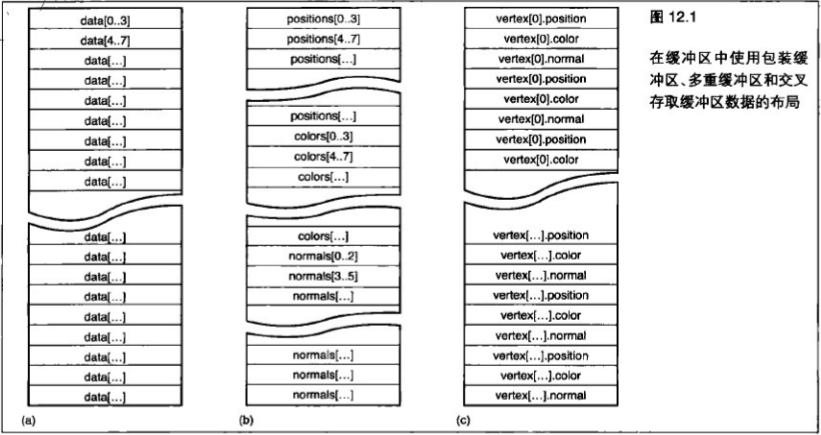

&emsp;&emsp;和某些其他的 `OpenGL` 对象不同,这里没有默认缓冲区对象。这就意味着我们必须先创建一个顶点缓冲区对象并对其进行绑定,然后才能调用 `glVertexAttribPointer` 。 `OpenGL` 保留一个命名为0的缓冲区对象,代表“没有缓冲区"。这样,要对一个缓冲区解除绑定而不指定新的缓冲区来代替它,只需将名称 `0` 绑定到 `GL_ARRAY_BUFFER` 绑定点。

```C++
glBindBuffer(GL_ARRAY_BUFFER, 0);
```

&emsp;&emsp;如果这些数据经常被应用程序改变,那么在应用程序的内存空间保存数据可能就会非常有用了。但是,为此使用一个VBO仍然是必要的,因为 `OpenGL` 并不支持直接从系统内存读取数据。如果在调用 `glBufferData` 时指定 `GL_STREAM_DRAW` 的使用模式, `OpenGL` 知道这些数据很可能只会使用一次,而关团用程序的行为和性能应该与在应用程序内存中保存数据时相同。在任何情况下,即使能够在应用程序内存中保存数据, `OpenGL` 驱动很可能也会在内部执行一个相似的操作,并最终在使用这些数据之前将它们复制到GPU内存的一个暂存区域中。

> 12.2.2 在缓存区中保存顶点索引

&emsp;&emsp;到目前为止,我们只讨论了 `GL_ARRAY_BUFFER` 绑定,还有一个相关的缓冲区绑定，即 `GL_ELEMENT_ARRAY_BUFFER` 绑定。元素数组缓冲区是一个存储顶点索引的缓冲区,供 `glDrawElements` 和 `glDrawRangeElements` 这样的函数使用。对于 `GL_ELEMENT_ARRAY_BUFFER` 绑定来说,没有与 `glVertexAttribPointer` 等价的函数。举例来说,这就是说没有 `glElementPointer` 函数。我们可以使用 `GL_ELEMENT_ARRAY_BUFFER` 绑定,就像任何其他为了对它进行分配或者将数据放入其中(例如使用 `glBufferData` 或 `glBufferSubData`)而进行的绑定。下面来看一下 `glDrawElements` 的函数原型。

```C++
void glDrawElements(GLenum mode, GLsizei count, GLenum type, const GLvoid * indices);
```

&emsp;&emsp;第一个参数 `indices` 是元素数组缓冲区中第一个索引的偏置。

&emsp;&emsp;请记住，在调用 `glVertexAttribPointer` 时，最后一个参数 `pointer` 将被解释为到这个缓冲区的一个偏置,它被绑定到 `GL_ARRAY_BUFFER` 绑定点。对于 `glDrawElements` 的 `indices` 参数来说同样如此,而缓冲区则绑定到 `GL_ELEMENT_ARRAY_BUFFER` 绑定点。如果在调用 `glDrawElements` 时，一个非 `0` 缓冲区被绑定到 `GL_ELEMENT_ARRAY_BUFFER` 绑定点，那么 `indices` 将被解释为一个到缓冲区的偏置，而这些将要被绘制顶点的索引将从这个缓冲区中获取。

&emsp;&emsp;如果没有缓冲区被绑定到 `GL_ELEMENT_ARRAY_BUFFER` 绑顶点，那么 `glDrawElements` 将不会做任何事。如果没有元素缓冲区,那么就没有顶点索引的存储会被绘制。正如 `OpenGL` 不支持从应用程序内存中读取顶点属性数据一样,它也不能读取顶点索引数据。这样,为了使用 `glDrawElements` 函数,我们就必须有一个缓冲区绑定到 `GL_ELEMENT_ARRAY_BUFFER` 绑定点。

&emsp;&emsp;还有一个 `glDrawElements` 的更高级版本，允许我们使用同一个索引，但是要为每次调用使用不同的顶点数据。 `glDrawElementsBaseVertex` 函数允许我们指定一个偏置,这个偏置将在用于从顶点缓冲区中读取数据之前添加到每个顶点索引上。它的原型为：

```C++
void glDrawElementsBaseVertex(GLenum mode, GLsizei count, GLenum type, GLvoid *indices, GLint basevertex);
```

&emsp;&emsp;让我们考虑一个比较复杂的模型，它使用几个顶点缓冲区——比如说，一个用来存储位置数据，一个用来存储法线,两个或 `3` 个用来存储纹理坐标,并且可能有另外几个用来存储对模型进行渲染时可能用到的其他数据。如果模型是动画的,那么我们就需要几个帧,每个帧都有它们自己的这些数据的完整集合。在每个帧中，位置是改变的，法线是变化的，但是这些顶点的索引将保持不变。在这里我们有几个选择。我们可以为每个帧使用单独的一组 `VBO` 。这样做可能需要进行很多设置,但却是一个可行的解决方案。我们可以为对象的每个帧使用一个单独的 `VAO` (在后面部分将更加详细地讨论),它将存储所有绑定。另一种选择是将所有数据存储在一个单独的大缓冲区中，其中的数据一帧接一帧地进行包装。这样做会要求我们为每一帧多次调用 `glVertexAttribPointer` 。同样,我们可以为每一帧将这些信息存储在一个独立的 `VAO` 中。

&emsp;&emsp;`glDrawElementsBaseVertex` 函数是一个可选项,它允许我们指定到缓冲区的相对于元素缓冲区中索引的偏置。举例来说,如果我们有一个包含 `1000` 个顶点的模型,那么第一个帧就从偏置 `0` 开始,第二帧从偏置 `1000` 开始,第3个从 `2000` 开始,依次类推。将偏置传递到 `glDrawElementsBaseVertex` 命令的操作比起重新绑定 `VBO` 或 `VAO` 来,或者比起处理几个 `glVertexAttribPointer` 调用来说要简单得多(从 `OpenGL` 的角度来看)。实际上，对于每一个 `glDrawElements` 变体来说，都有一个等价的版本，它接受一个 `basevertex` 参数： `glDrawElementsBaseVertex` 、 `giDrawRangeElementsBaseVertex` 、 `glDrawElementsInstancedBaseVertex` 或 `glMultiDrawElementsBaseVertex` 。 `OpenGL` 规范中比较详细地介绍了它们。

## 12.3 使用顶点数组对象来组织缓冲区

&emsp;&emsp;我们刚刚已经了解了一下顶点缓冲区对象。每个顶点属性都有一个缓冲区中的偏置,以及一组其他状态,例如数据类型和步长。每个顶点属性也都有一个关联缓冲区,它对于每个属性来说可以是不同的。调用 `glVertexAttribPointer` 可以对所有这些状态进行设置,包括属性的缓冲区绑定。如果我们有一个非常复杂的场景，其中有几个对象，并且每个对象的顶点数据都保存在这些顶点的 `VBO` 中，那么每个对象都会有数量可观的状态。如果这个应用程序编写良好,那么对这些对象中的一个进行绘制应该像单次调用一个诸如 `glDrawElements` 和 `glDrawArrays` 这样的函数一样简单。

&emsp;&emsp;即使对象之间数据的布局是相同的(对于很多应用程序来说可能都会如此),并且数据的偏置都相同(例如,可能所有数据都从偏置0开始),那么为每个顶点属性调用 `glVertexAttribPointer` 就仍然是必要的。比如说,对于一个有 `8` 个顶点属性的对象来说,这就意味着至少调用giBindBuffer一次(如果顶点属性在相互独立的缓冲区中的话,很可能会调用多达 `8` 次),并且调用 `glVertexAttribPointer 8` 次。

&emsp;&emsp;如果我们使用的是索引顶点,那么还需要绑定 `GL_ELEMENT_ARRAY_BUFFER` 。所有这些都是为了对 `glDrawElements` 进行单次调用所做的准备。这里需要设置许多状态,驱动程序必须进行多次错误检查,而应用程序则需要关心许多信息。

&emsp;&emsp;为了帮助组织所有这些信息， `OpenGL` 提供了一个对象，叫做顶点数组对象(`VAO`)。 `VAO` 是一个容器,它将所有可以由 `glVertexAttribPointer` 和其他一些函数进行设置的状态包装到一起。在使用一个 `VAO` 时,所有通过一次 `glVertexAttribPointer` 调用来指定的状态都会被存储到当前的 `VAO` 中。在 `OpenGL` 中不存在默认 `VAO` 。这就意味着我们必须先创建一个 `VAO` 并对其进行绑定,然后才能指定顶点指针。对于一个简单的应用程序来说,创建单个 `VAO` ,对其进行绑定,并且在应用程序的生命周期中保持其绑定(就像我们在前面介绍 `VBO` 时所做的)可能就够了。但是,一个应用程序可以创建所需的任意多个 `VAO` ,并使用它们来管理所有这些数组状态。在使用特定一组顶点属性进行绘制时,只要对包含这组状态的 `VAO` 进行绑定并开始绘制就可以了。这样做允许一个场景中的每个对象通过创建一个 `VAO` 。来保存它的状态,并在进行绘制前将它进行绑定,来管理顶点缓冲区。这样,这个对象就不会干扰场景中任何其他对象的顶点数组状态了。

&emsp;&emsp;为了创建一个或多个 `VAO` ，可以调用：

```C++
void glGenVertexArrays(GLsizei n, GLuint *arrays);
```

&emsp;&emsp;就像大多数其他 `OpenGL` 对象一样,  `VAO` 也是通过表示为无符号整数的名称来引用的。函数 `glGenVertexArrays` 创建 `n` 个顶点数组并将它们的名称放到数组 `arrays` 中。如果由于某些原因, `glGenVertexArrays` 不能成功地为一个 `VAO` 进行分配,那么就会返回 `0` 作为它的名称。一个编写良好的应用程序应该总是在试图使用结果之前检查这个条件。和其他缓冲区对象一样,  `OpenGL` 保留 `VAO` 的名称 `0` ,代表“没有 `VAO` "。同样,在没有 `VAO` 被绑定时,  `glVertexAttribPointer` 将不会工作,并且如果调用它的话，将生成一个错误。为了删除  `VAO` ，可以调用：

```C++
void glDeleteVertexArrays(GLsizei n, GLuint *arrays)
```

&emsp;&emsp;这个函数会删除名称保存在 `arrays` 中的这 `n` 个 `VAO` 。对于应用程序来说,最后进行清除非常重要。如果 `arrays` 有一个元素包含名称 `0` ，那么它将被忽略。这就意味着我们可以安全地将一个以前由 `glGenVertexArrays` 进行写入的数组传递到 `glDeleteVertexArrays` ,而无需担心这些名称中是否会有一些为 `0` (比如说是由于在执行 `glGenVertexArrays` 时的一个错误而出现的)。为了开始使用 `VAO` ,可以调用:

```C++
void glBindVertexArray(GLuint array);
```

&emsp;&emsp;这样就会将 `array` 设为当前 `VAO` 。当一个新的 `VAO` 第一次被绑定时，它会包含所有默认状态，这些状态会出现在一个新创建的环境中。从现在开始，我们无论在什么时候调用一个访问顶点数组状态的函数，它都会访问当前绑定的 `VBO` 中所包含的状态。这其中包含设置状态的函数，例如 `glVertexAttribPointer`; 隐式地使用这个状态的函数,例如 `glDrawArrays` 或 `glDrawElements`;以及显式地读取数组状态的函数,例如 `glGetIntegerv` 。

&emsp;&emsp;现在我们有了一个 `VAO` ，可以在它上面设置我们所需任意数量的状态了。我们可以对 `glVertexAttribPointer` 进行所需任意次数的调用,而这些状态将被存储在这个 `VAO` 中。如果调用 `glBindBuffer`,然后接着调用 `glVertexAttribPointer`,那么缓冲区绑定也将被存储在 `VAO` 中。但是,要注意的是,当与顶点属性相关联的缓冲区绑定被存储在 `VAO` 中时,绑定一个新的 `VAO` 并不能改变当前的缓冲区绑定。也就是说，当前绑定缓冲区的实际状态并没有保存在 `VAO` 中。回到本节开始时的例子-那个有很多顶点属性的对象,每个属性都有不同的状态和缓冲区绑定,我们可以使用 `VAO` 显著地提高它的性能。

&emsp;&emsp;我们可以不在即将绘制对象之前再对 `glBindBuffer` 和 `glVertexAttribPointer` 进行很多次调用,而是在初始化时进行这项工作。在对象创建时,它可以生成一个 `VAO` ,使用 `glBindVertexArray` 对它进行绑定,并且对所有顶点数组状态进行设置,就像它即将渲染自己一样。在进行初始化之后返回 `OpenGL` ,这样就没有 `VBO` 会通过调用

```C++
glBindVertexArray(0);
```

&emsp;&emsp;进行绑定了。现在，当对象即将被渲染时，再次调用带有对象的 `VBO` 的 `giBindVertexArray` ，然后再调用诸如 `glDrawArrays` 这样的渲染函数。这样,渲染一个包含许多存储在一个不同参数的VBO集合中的顶点的完整对象就可以变得非常简单，只需调用两个函数--例如 `glBindVertexArray` 和 `glDrawElements` 。这样对于分层库( `layered library` )、场景图( `scene graph` )管理和可能想要在不干扰当前 `OpenGL` 状态的情况下进行渲染的中间件来说也是非常有利的。如果这个环境的正常行为就是没有绑定的 `VAO` 。那么每个对象都会绑定自己的 `VAO` ,对自己进行渲染,然后绑定 `VAO` ,并进行全面的重新设置。

## 12.4 高效地绘制大量几何图形

&emsp;&emsp;到目前为止,我们已经了解了如何将数据块发送到 `OpenGL` 来使用诸如 `glDrawArrays` 这样的函数进行渲染了。我们可以通过单次调用这个函数来发送大量顶点——如果必要的话，可以是数百万个到 `OpenGL` 。但是,如果几何图形已经在一个大连续块中良好地进行排列的话,那么这就是唯一的用处了。在任何复杂的应用程序中,都会有很多不同的、互不相关的对象。很可能会有一个场景或某种背景,而它们中的每一个都可能需要几次调用某个绘制函数。一个复杂的应用程序在每一帧中都对 `OpenGL` 提供的各种绘制函数进行几千次甚至几十万次调用,这种情况并不罕见。在本节,我们会了解一些方法,使用这些方法,能够通过对 `OpenGL` 进行很少的几次调用来绘制大量独立的几何图形片段。

> 12.4.1 组合绘制函数

&emsp;&emsp;如果我们在单个应用程序中有很多几何图形要发送到 `OpenGL` ，那么就很可能会采用一种首选的绘制方法。举例来说，可能会使用 `glDrawArrays` 或 `glDrawElements` 。如果要将所有对象的所有顶点数据打包到单个缓冲区中，代码中就应该包含一个循环，类似下面这样。

```C++
for (int i = 0; i < num_objects; i++)
{ 
    glDrawArrays(GL_TRIANGLES, object[n]->first vertex, object [n]->vertex_count);
}
```

&emsp;&emsp;这样可能会产生很多对 `OpenGL` 的调用，每一个调用都会伴随着一些系统开销。如果场景中有大量对象,每个对象都有一些相关的少量三角形,那么这些对 `glDrawArrays` 的调用中每一个的开销将会开始累积,从而对应用程序性能产生负面影响。在这种情况下,有两个函数可能会有所帮助,它们分别是

```C++
void glMultiDrawArrays(GLenum mode, GLint *first, GLsizei *count, GLsizei primcount);
```

和

```C++
void glMultiDrawElements(GLenum mode, GLsizei *count, GLenum type, GLvoid **indices, GLsizei primcount);
```

&emsp;&emsp;这两个函数会对前面的代码进行相似的操作。它们的行为就像其 `non-Multi` 版本被调用 `primcount` 次一样。对于 `glMultiDrawArrays` 来说, `first` 和 `count` 都是数组。同样，对于 `glMultiDrawElements` 来说， `count` 和 `indices` 也都是数组。这就允许 `OpenGL` 可以一次性完成它的所有设置，一次性检查所有参数的正确性，并且如果驱动程序支持的话,就会发送单个命令到图形硬件。这样可以允许很多与调用 `OpenGL` 函数相关的系统开销以 `glMultiDraw` 函数所取代函数调用的次数进行分摊。

&emsp;&emsp;通过重写这个示例,我们可以看到只有到 `glMultiDrawArrays` 的一个函数调用可以用来取代这些对 `glDrawArrays` 的大量(可能是数千)调用。程序清单 `12.12` 显示了新版本的代码。虽然这里代码更多了,但是这里有一些到 `OpenGL` 的调用，而这些调用通常会带来更好的性能。

```C++
// 这些数组假定足够大，足以容纳足够的数据来在场景中表现所有的对象
GLsizei count[];
GLint first[];

// 建立我们的第一个顶点的列表和顶点计数
for (int i = 0; i < num_objects; i++)
{
    first[i] = object[n]->first_vertex;
    count[i] = object[n]->vertex_count;
}
    
//现在调用一次glDrawArrays
glMultiDrawArrays(GL_TRIANGLES, first, count, num_objects);
```

&emsp;&emsp;如果对象的列表不变(或者不经常改变),就可以预先创建 `first` 和 `count` 数组,并从示例中完全删除 `for` 循环。举例来说,如果有一个简单的游戏,在其中一关有一些敌人和一些奖励,那么我们可能只需要在玩家消灭一个敌人或收集一个奖励时更新 `first` 和 `count` 数组。

> 12.4.2 使用图元重启对几何图形进行组合

&emsp;&emsp;有很多工具可以用来对几何图形进行“条带化”。这些工具的思想就是通过接受“三角形汤” ( `trianglesoup` )——大批非连接的三角形，并且试图将它合并为一组三角形带，从而使性能得到提升。这样做是有效果的，因为独立的三角形每一个都会接受 `3` 个顶点才能进行表示，而一个三角形带则将三角形带中表示每个三角形所需的顶点数减少到 `1` 个(不包括三角形带中的第一个三角形)。通过将几何图形从三角形汤转换为三角形带，需要处理的几何图形数据更少了，而系统也会运行得更快。如果这种工具取得了很好的效果,并且产生了数量较少的长三角形带,每个三角形带包含许多三角形,那么基本上就可以说这种方法很奏效了。

&emsp;&emsp;对于这种类型的算法有很多研究，而一种新方法的成功与否是通过将一些众所周知的模型通过新的“条带生成器”来进行传递,并将由这种工具生成的条带数量和长度与目前最先进的条带生成器所生成的进行比较而进行判断的。

&emsp;&emsp;尽管已经进行了这些研究,但现实情况是,一个“三角形汤”可以通过单次调用 `glDrawArrays` 或 `glDrawElements` 进行渲染，但是只要还没有使用即将介绍的功能，那么一组三角形带的渲染就需要单独对 `OpenGL` 进行多次调用。这就意味着在一个使用条带化几何图形的程序中会有更多的函数调用,并且如果这个条带化应用程序没有获得较好的效果,或者如果模型没有很好地完成条带化,那么这就可能抵消掉前面使用条带所获得的所有性能提升。甚至是 `glMultiDrawArrays` 和 `glMultiDrawElements` 这样的函数也不总能有所帮助，因为图形硬件可能不会直接实现这些函数，这样 `OpenGL` 基本上无论如何都必须将它们转换成多个 `glDrawArrays` 调用了。

&emsp;&emsp;图元重启( `primitive restart` )是几乎得到最新图形硬件普遍支持的特性,并且是 `OpenGL` 的一部分。图元重启应用在 `GL_TRIANGLE_STRIP` ,  `GL_TRIANGLE_FAN` , `GL_LINE_STRIP` 和 `GL_LINE_LOOP` 几何图形类型中。这种方法在一个条带(或者扇、环)结束和另一个开始时通知 `OpenGL` 。要在几何图形中指示出一个条带结束、下一个条带开始的位置,就要在元素数组中放置一个作为保留值的特殊标志。由于 `OpenGL` 或者从元素数组中获取顶点索引,或者在内部生成它们,在 `glDrawArrays` 这样的非索引绘制命令情况下,它会检查这个特殊索引值,并且在遇到它时结束当前条带并在下一个顶点开始一个新的条带。在默认情况下，这种模式是关闭的，但是可以通过调用

```C++
glEnable(GL_PRIMITIVE_RESTART);
```

&emsp;&emsp;开启，而通过调用

```C++
glDisable(GL_PRIMITIVE_RESTART);
```

&emsp;&emsp;关闭。

&emsp;&emsp;在图元重启模式开启时， `OpenGL` 会在获取或生成它们时开始关注它们，并在遇到它时停止当前的条带并开始一个新的条带。要设置 `OpenGL` 应该关注的索引,可以调用

```C++
glPrimitiveRestartIndex(index);
```

&emsp;&emsp;`OpenGL` 关注由 `index` 指定的值,并使用它作为图元重启的标志。因为这个标志是一个顶点索引,所以图元重启在诸如 `glDrawElements` 这样的索引绘制函数上能够得到最佳应用。举例来说,我们仍然可以在 `glDrawArrays` 上使用图元重启。在这种情况下, `OpenGL` 可能最终会在内部生成重启索引,而当这项工作完成时,会重启图元。举例来说,如果我们将重启索引设置为 `10` ,然后使用 `GL_TRIANGLE_STRIP` 模式绘制 `20` 个顶点,那么我们将会得到两个独立的条带。

&emsp;&emsp;图元重启索引的默认值为 `0` 。因为一个真实的顶点的索引将会包含在模型中,所以在使用图元重启模式时将重启索引设置为一个新值是个好主意。 `OxFFFFFFFF` 是一个非常合适的值,因为我们几乎可以确定它不会作为一个顶点的有效索引使用。很多条带化工具都可以选择创建独立的条带，或者创建单个带有重启索引的条带。条带化工具可能会使用一个预定义索引，或者在创建模型的条带化版本时输出它使用的索引(例如一个比模型中的顶点数还要大的索引)。我们需要了解这一点,并使用 `glPrimitiveRestartindex` 函数对它进行设置,以便在应用程序中使用这个工具的输出。

&emsp;&emsp;图元重启特性的图示如图 `12.2` 所示。

&emsp;&emsp;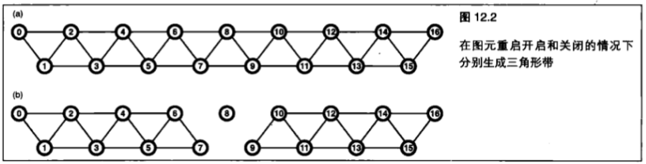

&emsp;&emsp;在图 `12.2` 中，显示了一个三角形带，其顶点由它们的索引表示。在（ `a` ）中，这个三角形带由 `17` 个顶点组成，它们在单个连接的三角形带中一共产生了 `15` 个三角形。通过开启图元重启模式并将图元重启索引设置为 `8` ，顶点 `8` 被 `OpenGL` 视为特殊的重启标志,而三角形带则会在顶点7处结束，如(`b`)所示。顶点 `8` 的实际位置将被忽略,这是因为 `OpenGL` 不会将它视为一个真实顶点的索引。下一个进行处理的顶点(顶点 `9` )将成为新的三角形带的开始位置。所以,在仍然向 `OpenGL` 传递 `17` 个顶点的情况下,得到的结果将会是两个独立的三角形带,其中一个绘制8个三角形,而另一个则绘制 `6` 个三角形。

> 12.4.3 实例渲染

&emsp;&emsp;可能在很多情况下我们都会希望多次绘制同一个对象。

&emsp;&emsp;想象一个太空舰队,或者一片草地。这时可能会有基本相同的几何图形集合的数千个副本,在每个实例之间只有很小的改动。在这种情况下，一个简单的应用程序可能对草地中每一片独立的草进行循环，并分别对它们进行绘制

&emsp;&emsp;为每一棵草调用一次 `glDrawArrays` ,并且可能在每一次迭代中更新一组着色器统一值。假定每一棵草都是由一个包含 `4` 个三角形的三角形带组成的,那么代码可能与程序清单12.13所示类似。

```C++
glBindVertexArray(grass_vao);
for (int n = 0; n < number_of_blades_of_grass; n++)
{
    SetupGrassBladeParameters();
    glDrawArrays(GL_TRIANGLE_STRIP, 0, 6);
}
```

&emsp;&emsp;草地一共有多少棵草？ `number_of_blades_of_grass` 的值是多少？可能是几千，也可能是几百万。每一棵草都应该占据屏幕上很小的一块区域,而显示草的顶点数量也会非常少。我们的图形加速卡并不是真的要做很多工作来渲染单独的一片草，而系统则很可能会将它的大部分时间用在向 `OpenGL` 发送命令上，而不是用在实际进行绘制上。 `OpenGL` 通过实例渲染(`instanced rendering`)来对此进行处理,这是一种绘制同一个几何图形的大量副本的方法。

&emsp;&emsp;实例渲染是 `OpenGL` 提供的一种指定通过单次函数调用来绘制同一个几何图形的多个副本的方法。这种功能是通过实例渲染函数来实现的，例如

```C++
void glDrawArraysInstanced(GLenum mode, GLint first, GLsizei count, GLsizei primcount);
```

&emsp;&emsp;和

```C++
void glDrawElementsInstanced(GLenum mode, GLsizei count, GLenum type, const void indices, GLsizei primcount);
```

&emsp;&emsp;这两个函数的行为很像 `glDrawArrays` 和 `glDrawElements` ,除了它们是告诉 `OpenGL` 来渲染几何图形的 `primcount` 个副本以外。在这些函数的常规、非实例版本中,每个函数最前面的参数(对于 `glDrawArraysInstanced` 来说是 `mode` , `first` 和 `count` ,而对于 `glDrawElementsInstanced` 来说则是 `indices` )都代表同样的含义。当调用这些函数中的一个时, `OpenGL` 会做好任何需要的准备工作，来对几何图形(例如将顶点数据复制到图形加速卡内存中等)只进行一次绘制,然后对同样的顶点进行多次绘制。

&emsp;&emsp;如果这些函数所做的所有工作就只是将同样顶点的多个副本发送到 `OpenGL` ，就像 `glDrawArrays` 和  `glDrawElements` 已经在一个紧凑的循环中被调用一样，那么它们就不会非常有用。使实例渲染可用并且非常强大的因素之一，是 `GLSL` 中的一种特殊的内建变量，叫做 `gl_InstancelD` 。 `gl_InstancelD` 变量就好像一个整型统一值一样出现在 `GLSL` 中。当顶点的第一个副本被发送到 `OpenGL` 时， `gl_InstanceID` 为 `0` 。随后，它将为几何图形的每一个副本递增一次，最终达到 `primcount - 1` 。因为 `gl_InstanceID` 是一个整数,这里有一个实际的上限值，即我们可以通过调用 `glDrawArraysinstanced` 或 `glDrawElementsInstanced` 一次渲染200万个实例,但是这对于绝大多数应用程序来说都应该足够了。如果需要渲染几何图形的超过 `200` 万个副本,那么应用程序就很可能会运行得非常缓慢,而我们将不会看到一个由于将渲染分解成包含 `10` 亿个顶点的块而导致的巨大性能损失。

&emsp;&emsp;`glDrawArraysinstanced` 函数所进行的操作基本上就像执行了程序清单 `12.14` 中列出的代码一样。

```C++
//在所有（即primcount个)这些实例上执行循环
for (int n = 0; n < primcount; n++)
{
    // 设置gl_InstanceID Uniform-—在这里 gl_InstanceID是一个c变量，它保存“虚拟” gl_InstanceIDUniform的位置
    glUniformli(gl_InstanceID, n);
    //现在,当我们调用glDrawArrays时,着色器中的gl_InstanceID变量将会包含这个被渲染的实例的索引
    glDrawArrays(mode, first, count);
}
```
    
&emsp;&emsp;类似地, `glDrawElementsinstanced` 函数的操作与程序清单 `12.15` 中列出的代码类似。

```C++
for (int n = 0; n < primcount; n++}
{
    //设置gl InstanceID的值
    glUniformli(gl_InstanceID, n);
    //对glDrawElements进行一次常规调用
    glDrawElements(mode, count, type, indices);
}
```

&emsp;&emsp;当然, `gl_InstancelD` 并不是一个真正的统一值,我们也不能通过调用 `glGetUniformLocation` 为它分配一个位置。 `gl_InstancelD` 的值由 `OpenGL` 进行管理,并且由硬件生成的可能性非常高,也就是说在性能方面基本上可以自由使用。实例渲染的强大来自于对这个变量和实例数组( `instanced arrays` ,稍候将进行解释)的富有想象力的应用。

&emsp;&emsp;`gl_InstancelD` 的值可以直接作为着色器函数的一个参数使用，或者用于诸如纹理或统一数组这样的数据的索引。回到我们的草地示例,让我们来搞清要怎样利用 `gl_InstancelD` 来使我们的草地变得不是只在一个点上长出几千棵同样的草。我们的每颗草都是由包含 `4` 个三角形的一个小三角形带组成的,每个三角形带中有 `6` 个顶点。让它们都变得各不相同可能会非常麻烦。但是，通过一些着色器技巧，我们可以使每一棵草看起来都有足够的不同,这样就能生成一个有趣的输出了。在这里,我们就不完整地列出这个着色器的代码了(上一章中有大量更高级的着色器示例),但是我们会了解几个如何使用 `gl_InstancelD` 向场景中添加变化的办法。

&emsp;&emsp;首先,我们需要每一棵草都有不同的位置;否则,它们就都会绘制在另外一棵上面。让我们以差不多均匀的方式来对这些草进行排列。如果要进行渲染的草的数量是 `2` 的幂,那么可以使用 `gl_InstancelD` 的一半位数来表示一棵草的x坐标，而y坐标则用来表示 `z` 坐标(草地是在一个 `x-z` 平面上，而 `y` 为高度)。在本例中,我们渲染了 `20` 个,或者说略多于 `100` 万棵草(实际上是 `1 048 576` 颗草,但谁会去数呢? )。通过使用最低的 `10` 位(第 `9` 位到第 `0` 位)作为 `x` 坐标,而使用最高的 `10` 位(第 `19` 位到第 `10` 位)作为z坐标,我们就有了一个草地的统一网格。下面让我们看一下图 `12.3` 所示图像,来看看到目前为止的成果。

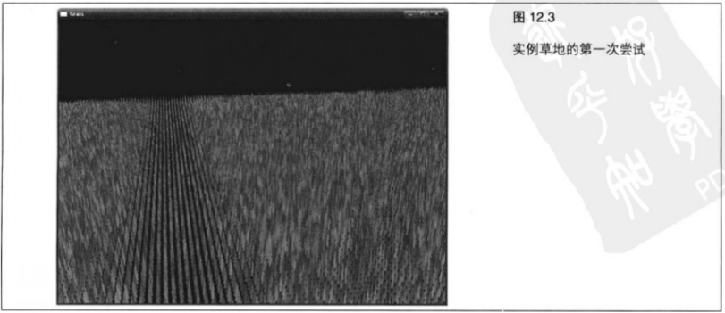

&emsp;&emsp;统一草地网格看起来有点太清晰了,就好像一个特别用心的管理员手工栽种了每一棵草一样。我们真正要做的是将这些草在网格方框中进行一定随机量的移位,这样就可以使这片草地看起来不那么呆板了。生成随机值的一种简单方法是,用一个种子值乘以一个很大的数,然后取生成结果的所有位的子集,并用它作为一个函数的输入。在这里,我们并不追求一个完美的分布,所以这种简单的生成器足可以胜任。通常,在使用这种算法时,我们可以重复使用这个种子值,作为随机数生成器下一次迭代的输入。但是,在这种情况下，在一个伪随机序列(`pseudo-random sequence`)中的 `gl_InstancelD` 之后，我们真正生成接下来的几个数字时,可以直接使用 `gl_InstancelD` 。在对我们的伪随机函数进行仅仅两次迭代之后,我们就能得到一个合理的随机分布了。因为我们需要在 `x` 和 `y` 方向上都进行移位,所以从 `gl_InstancelD` 生成两个连续的随机数字,并使用它们对平面上的草进行移位。图 `12.4` 所示显示了目前获得的效果。

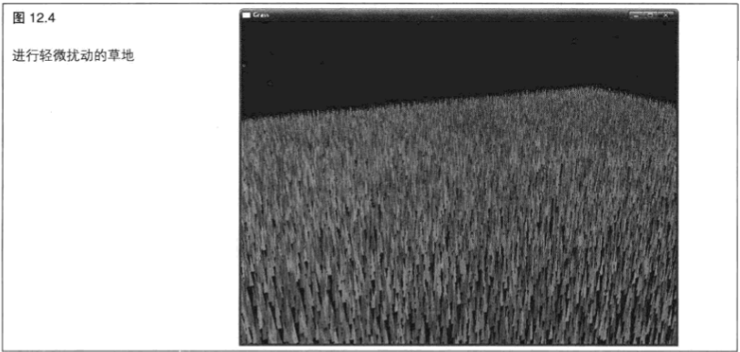

&emsp;&emsp;到现在为止，草地是均匀分布的，其中每一棵草的位置都进行了随机的扰动。但是,所有的草看起来都吴湖同的。(实际上,我们使用同样的随机数生成器来为每颗草分配了稍微有所不同的颜色,以使它们能够显示出各自的形状。)我们可以在这片草地上应用一些变化,来使每一棵草看起来稍微有所不同。这可能是我们希望进行控制的，所以使用一个纹理来保存关于这些草的信息。

&emsp;&emsp;对于每一棵草来说，我们都有一个 ×坐标和一个 z坐标，这是通过从 `gl_InstancelD` 直接生成一个网格坐标，然后生成一个随机数字并对 `x-z` 平面中的草进行移位而得到的。这个坐标对可以作为一个坐标，来查询一个 `2D` 纹理中的纹理单元,而我们可以在其中放置任何希望放置的东西。让我们使用这种纹理来控制草的长度，可以在这个纹理中(使用红色通道)放置一个长度参数，然后将草的几何图形每个顶点的y坐标乘以这个参数生成更长或更短的草。在纹理中0值将会产生非常短的(或者不存在的)草,而为1的值则会产生最大长度的草。现在,我们可以设计一个纹理,其中每个纹理单元表示草地中某个区域草的长度。为什么不绘制几个麦田圈呢?这个纹理可以采用 `GL_LINEAR` 采样进行采样,甚至可以使用Mip贴图。
 
&emsp;&emsp;现在，这些草在这片草地上均匀地分布着，并且我们在不同的区域对草的长度进行了控制。但是，这些草仍然是相互进行缩放的副本。我们还可以引入一些更多的变化。接下来,让每棵草围绕它的轴根据纹理中的其他参数进行旋转。我们使用纹理的绿色通道存储角度，这棵草就应该沿着 `y` 轴旋转这样的角度，其中 `0` 代表没有进行旋转,而1则代表旋转了 `360°` 。我们仍然只在顶点着色器中进行一次纹理获取,而 `gl_InstanceID` 仍然是这个着色器的唯一输入。到这里事情就开始有眉目了，来看一看图 `12.5` 所示图像。

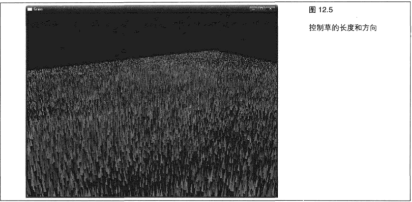

&emsp;&emsp;草地看起来还是有些乏味。这些草只是直立在那里不动。真正的草是在风中摇摆的,而当有东西滚过时则会被压平。我们需要这些草进行弯曲,并且要对此进行控制。为什么不使用参数纹理的另外一个通道(蓝色通道)来控制一个弯曲因子呢?我们可以使用它作为另外一个角度值,并且在我们应用绿色通道中的旋转之前将草围绕 轴进行旋转。这样就使我们能够根据纹理中的参数对草进行弯曲了。使用 `0` 来表示没有进行任何弯曲(草是直立的),而使用 `1` 来表示完全平躺的草。通常情况下,这些草应该是轻轻摆动的，所以这个参数应该是一个比较小的值。当这些草平躺时，这个值会大得多。

&emsp;&emsp;最后,我们可以控制草的颜色。在一个很大的纹理中只存储草的颜色,这看起来似乎是符合逻辑的。举例来说,如果我们要绘制的是一个有很多线、标志或广告的运动场,那么这样做可能是个好主意,但是在本例中,如果这些草都是深浅不一的绿色,那么这样做是相当浪费的。为了取代这种方式,让我们在一个 `1D` 纹理中为草地设置一个调色板,并使用参数纹理中最后的通道( `alpha` 通道)存储到这个调色板的索引。这个调色板的一端可以从一种毫无生气的枯草黄色开始,直到另一端的一种繁茂的深绿色为止。现在，从参数纹理中和所有其他参数一起读取 `alpha` 通道，并用它对 `1D` 纹理进行索引——这是一种依赖性的纹理获取。最终的草地结果如图 `12.6` 所示(同样显示在彩插中的彩图 `21` 中)。

&emsp;&emsp;现在,最终的草地包含数百万棵草,它们是均匀分布的,并且由应用程序控制长度、“平度”、弯曲方向,或者摇摆和颜色。请记住,着色器的唯一输入是 `gl_InstancelD` ,它将每一棵草与其他草区分开来,发送到OpenGL的几何图形总共只有 `6` 个点,而绘制草地中所有这些草所需要的代码只调用一次 `glDrawArraysInstanced` 。 

&emsp;&emsp;参数纹理可以使用线性纹理进行读取,以提供草地区域之间的平滑过渡,而分辨率则可以非常低。如果我们希望草地在风中摇摆,或者像是被一群动物踩过一样,可以通过对每一帧或每两帧进行更新,并在对草进行渲染之前上传一个新版本,使其产生动画效果。因为 `gl_InstancelD` 被用来生成随机数字,在将它传递到随机数字生成器之前向它添加一个偏置,就可以使用同一个着色器生成一个不同但却预先定义好的“随机”草地块了。

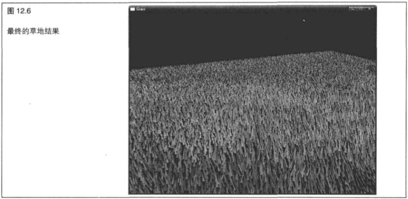

> 12.4.4 自动获取数据

&emsp;&emsp;当调用 `glDrawArraysInstanced` 或 `glDrawElementsInstanced` 时,着色器中的内建变量 `gl_InstancelD` 将用来告诉我们正在处理的是哪一个实例,而对于进行渲染的每一个几何图形新实例,都会累加 `1` 。甚至是在没有使用任何实例绘制函数时,它实际上也是可用的--在这种情况下它只是为 `0` 而已。这就意味着我们可以在实例化渲染和非实例化渲染中使用同一个着色器。

&emsp;&emsp;我们可以使用 `gl_InstancelD` 对长度与进行渲染的实例数相同的数组进行索引。举例来说,我们可以使用它来查询一个纹理中的纹理单元,或者对一个统一数组进行索引。然而实际上,我们要做的是将数组看作一个“实例化的属性"。这就是说,为进行渲染的每一个实例读取这个属性的新值。 `OpenGL` 能够使用一个称为“实例化数组” (`instanced array`)的特性自动将这个数据送入着色器中。为了使用实例化数组,我们要像通常一样为着色器声明一个输入。这个输入属性将会有一个索引，我们可以在调用类似 `glVertexAttribPointer` 这样的函数时使用这个索引。通常情况下，每一个顶点的顶点属性都会被读取，而一个新的值将会送入着色器。但是，为了使 `OpenGL` 为每个实例都从这个数组中读取属性，我们可以调用

```C++
void glVertexAttribDivisor(GLuint index, GLuint divisor);
```

&emsp;&emsp;将这个属性的索引传递到这个函数的 `index` ,并将 `divisor` 设为我们想要在每次从数组中读取新值之这间进行传递的实例数。如果 `divisor` 为 `0` ,那么这个数组就成为一个常规顶点属性,为每个顶点读取一个新值。但是,如果 `divisor` 是非 `0` 的,那么就会每隔几个实例从这个数组中读取一个新数据。举例来说,如果将 `divisor` 设为 `1` ，那么我们就会对每个实例都从这个数组中获得一个新值；如果将 `divisor` 设为 `2` ，那么我们就会对每两个实例都从这个数组中获得一个新值,依次类推。我们可以对 `divisor` 进行混合搭配,为每个属性设置不同的值。

&emsp;&emsp;使用这项功能的一个例子就是在我们想要绘制一组颜色不同的对象时。考虑程序清单 `12.16` 中的简单顶点着色器。

```C+
#version 150

precision highp float;

in vec4 position;
in vec4 color;

out Fragmentvec4
{
    color;
} fragment;

uniform mat4 mvp;

void main(void)
{
    gl_Position = mvp * position;
    fragment.color = color;
}
```

&emsp;&emsp;通常情况下， `color` 属性会为每个顶点读取一次，这样每个顶点的颜色最终都会各不相同。应用程序会提供一个颜色数组，颜色与模型中的顶点数相同。对象的每个实例也不可能都有不同的颜色，因为着色器并不知道任何关于实例化的信息。如果调用

```C++
glVertexAttribDivisor(index_of_color, 1);
```

&emsp;&emsp;我们可以将 `color` 设为一个实例数组，这里的 `index_of_color` 是 `color` 属性绑定到的槽的索引。现在,每个实例都将从顶点数组中获取 `color` 的一个新值。特定实例中的每一个顶点将会接受同一个值作为颜色值，结果是对象的每个实例都将渲染成不同的颜色。为 `color` 保存数据的顶点数组的大小只要和我们想要渲染的索引数相同就可以了。如果我们增加 `divisor` 的值，那么从数组中读取新值的频率就会越来越低。如果 `divisor` 为 `2` ,那么每两个实例就会出现一个新的颜色值;如果 `divisor` 为 `3` ,那么颜色将会每 `3` 个实例更新一次，以此类推。如果我们使用这个简单的着色器对几何图形进行渲染，那么每个实例都将绘制在其他实例上。我们需要修改每个实例的位置，以便能够看到它们。为此，我们可以使用另一个实例。程序清单 `12.17` 所示显示了对程序清单 `12.16` 中的顶点着色器进行简单修改后的结果。

```C++
#version 150

precision highp float;

in vec4 position;
in vec4 instance color;
in vec4 instance_position;

out Fragmentvec4
{
    color;
} fragment;

uniform mat4 mvp;

void main(void)
{
    gl_Position = mvp * (position + instance position);
    fragment.color = instance_color;
}
```

&emsp;&emsp;现在，我们不但有了逐个顶点的位置，同时也有了逐个实例的位置。在与模型视图投影矩阵相乘之前，我们可以将它们在顶点着色器中相加到一起。

&emsp;&emsp;我们可以通过再次调用

```C++
glVertexAttribDivisor(index_of_instance_position, 1);
```

&emsp;&emsp;将 `instance_position` 输入属性设置为一个实例数组。

&emsp;&emsp;和前面类似,这里的 `index_of_instance_position` 是 `instance_position` 属性绑定到的位置的索引。任何类型的输入属性都可以通过使用 `glVertexAttribDivisor` 设置为实例。这个例子非常简单,只使用了一次平移(这个值保存在 `instance_position` 中)。一个更加高级的应用程序可以使用矩阵顶点属性，或者将一些平移矩阵包装到统一值中,并向实例数组中传递矩阵加权值。应用程序可以用这种方式渲染一个由士兵组成的军队，每个士兵都有不同的姿势；或者渲染一个星际舰队，每艘太空船都向不同的方向飞行。

&emsp;&emsp;现在，让我们将这个简单的着色器连接到真正的程序中。首先，加载着色器，并且在连接程序之前像通常一样设置属性位置,如程序清单 `12.18` 所示。

```C++
instancingProg = gltLoadShaderPair("instancing.vs", "instancing.fs");
glBindAttribLocation(instancingProg, 0, "position");
glBindAttribLocation(instancingProg, 1, "instance_color")；
glBindAttribLocation(instancingProg, 2, "instance_position");
glLinkProgram(instancingProg);
```

&emsp;&emsp;在程序清单 `12.19` 中,我们声明一些数据,并将它们加载到一个顶点缓冲区(绑定到一个顶点数组对象）中。

```C++
static const GLfloat square_vertices[] =
{
    -1.0f, -1.0f, 0.0f, 1.0f,
    1.0f, -1.0f, 0.0f, 1.0f,
    1.0f, 1.0f, 0.0f, 1.0f,
    -1.0f, 1.0f, 0.0f, 1.0f
};
    
static const GLfloat instance_colors[] =
{
    1.0f, 0.0f, 0.0f, 1.0f,
    0.0f, 1.0f, 0.0f, 1.0f,
    0.0f, 0.0f, 1.0f, 1.0f,
    1.0f, 1.0f, 0.0f, 1.0f    
};

static const GLfloat instance_positions[] =
{
    -2.0f, -2.0f, 0.0f, 0.0f,
    2.0f, -2.0f, 0.0f, 0.0f,
    2.0f, 2.0f, 0.0f, 0.0f,
    -2.0f, 2.0f, 0.0f, 0.0f
}

GLuint offset = 0;

glGenVertexArrays(1, 6square_vao);
glGenBuffers(1, 6square_vbo);
glBindVertexArray(square_vao);
glBindBuffer(GL_ARRAY_BUFFER, square_vbo);
glBufferData(GL_ARRAY_BUFFER,
            sizeof(square_vertices) + sizeof(instance_colors) + sizeof(instance_positions), NULL, GL_STATIC_DRAW);
glBuffersubData(GL_ARRAY_BUFFER, offset, sizeof(square_vertices), square_vertices);
offset += sizeof(square_vertices);
glBufferSubData(GL_ARRAY_BUFFER, offset, sizeof(instance_colors), instance_colors);
offset += sizeof(instance_colors);
glBuffersubData(GL_ARRAY_BUFFER, offset, sizeof(instance_positions), instance_positions);
offset += sizeof(instance_positions);
glVertexAttribPointer(0, 4, GL_FLOAT, GL_FALSE, 0, 0);
glVertexAttribPointer(1, 4, GL_FLOAT, GL_FALSE, 0, (GLvoid *)sizeof(square_vertices) ); glVertexAttribPointer(2, 4, GL_FLOAT, GL_FALSE, o, (GLvoid *)(sizeof(square_vertices) + sizeof (instance_colors)));

glEnableVertexAttribArray(0);
glEnableVertexAttribArray(1);
glEnableVertexAttribArray(2);
```

&emsp;&emsp;现在要做的事情就只剩下为 `instance_color` 和 `instance_position` 属性数组设置顶点属性公约数(`divisor`)了。

```C++
glVertexAttribDivisor(1, 1);
glVertexAttribDivisor(2, 1);
```

&emsp;&emsp;现在我们绘制放在顶点着色器中的几何图形的4个实例。每个实例包含 `4` 个顶点，每个顶点都有自己的位置。每个实例中的同一个顶点都有相同的位置。但是,同一个实例中所有顶点都会对应同一个 `instance_color` 值和 `instance_position` 值,而这两个参数对于每个实例都会分配一个新值。我们的渲染循环和下面代码类似。

```C++
glClearColor(0.0f, 0.0f, 0.0f, 0.0f);
glClear(GL_COLOR_BUFFER_BIT);
glUseProgram(instancingProg);
glBindVertexArray(square_vao);
glDrawArraysInstanced(GL_TRIANGLE_FAN, 0, 4, 4);
```

&emsp;&emsp;得到的结果如图 `12.7` 所示。

&emsp;&emsp;在图中，我们可以看到已经渲染了 `4` 个矩形。这些矩形中的每一个都有不同的位置，并且每一个的颜色也都不同。这种方式可以扩展到数千个甚至数百万个实例,而现代图形硬件应该能够对此处理,而不会产生任何问题。

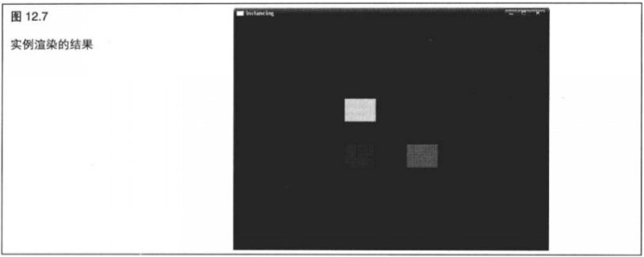

## 12.5 存储变换的顶点

&emsp;&emsp;在 `OpenGL` 中,我们可以将顶点着色器或者几何着色器的结果存储到一个缓冲区对象中。这种特性就是变换反馈(`transform feedback`),在使用变换反馈时,从顶点着色器或几何着色器输出的一个特定属性集就会被写入到缓冲区中。在不存在任何几何着色器时(我们应该还记得,几何着色器是可选的),这些数据来自顶点着色器。当出现一个几何着色器时,几何着色器所产生的顶点就会被记录下来。用来捕获顶点着色器和几何着色器输出的缓冲区就称为变换反馈缓冲区(`transform feedback buffer`),一旦数据被放置到一个使用变换反馈的缓冲区中，就能够使用一个类似 `glGetBufferSubData` 这样的函数将它读取回来,或者通过使用 `glMapBuffer` 将它映射到应用程序地址空间从而直接对它进行读取,它也可以用作后续绘制命令的数据源。

> 12.5.1 变换反馈

&emsp;&emsp;变换反馈是 `OpenGL` 的一种特殊模式，它允许将一个顶点着色器或几何着色器的结果保存到一个缓冲区中。一旦这些信息出现在这个缓冲区中,就可以作为更多绘制命令的一个顶点数据源使用了。顶点着色器或几何着色器的任意输出属性都可以被存储到这个缓冲区中。但是,我们不能同时对顶点着色器和几何着色器的输出进行记录。如果几何着色器是活动的,那么只有几何着色器的输出可以访问。如果我们需要来自顶点着色器的原始数据，就需要将这些数据不加修改地通过几何着色器进行传递。

&emsp;&emsp;变换反馈位置的图示如图 `12.8` 所示。

&emsp;&emsp;正如我们所看到的，变换反馈缓冲区位于几何图形着色输出和顶点装配阶段之间。既然几何着色器是可选的，那么如果它不存在的话，这些数据实际上就来自顶点着色器——这是通过虚线表示的。

&emsp;&emsp;虽然这个图解展示了向顶点装配阶段提供数据的变换反馈缓冲区,但是它只对所创建的反馈循环(因此出现了术语“变换反馈")进行了图示。虽然 `OpenGL` 允许我们将同一个缓冲区同时作为变换反馈缓冲

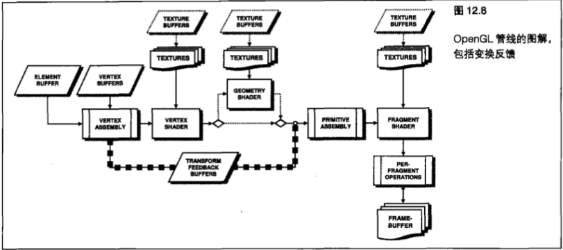

区和顶点缓冲区，但是如果这样做的话,得到的结果将是未定义的,而我们肯定无法得到想要的结果。将要在变换反馈模式中被记录的顶点属性或varying变量的集合,是使用

```C++
void glTransformFeedbackVaryings(GLuint program, GLsizei count, const GLcharvaryings, GLenum bufferMode);
```

指定的。

&emsp;&emsp;`glTransformFeedbackVaryings` 的第一个参数是程序对象的名称。变换反馈变化状态是逐个程序对象进行维护的。这就意味着不同的程序可以存储不同的顶点属性组，即使在它们之中使用的是相同的顶点着色器或几何着色器时也是如此。第二个参数是要记录的 `varying` 变量的数量,同时也是第 `3` 个参数中给出地址的数组的长度。第 `3` 个参数只是一个由C语言风格的字符串组成的数组,它给出了要记录的 `varying` 的名称。它们是顶点着色器或几何着色器中的out变量的名称。最后一个参数则指定这些 `varying` 变量的存储模式。这个参数必须为 `GL_SEPARATE_ATTRIBS` 或 `GL_INTERLEAVED_ATTRIBS` 。如果 `bufferMode` 是 `GL_INTERLEAVED_ATTRIBS` 的话,那么这些 `varying` 变量将被一个接一个地记录到单独的缓冲区中。而如果 `bufferMode` 是 `GL_SEPARATE_ATTRIBS` 的话,那么这些 `varying` 变量将被记录到每个 `varying` 变量的缓冲区中。

&emsp;&emsp;让我们来考虑下面的代码段，它声明了输出的 `varying` 变量。

```C++
out vec4 vs_position_out;
out vec4 vs_color_out;
out vec3 vs_normal_out;
out vec3 vs_binormal_out;
out vec3 vs_tangent_out;
```

&emsp;&emsp;为了指定 `vs_position_out` ,  `vs_color_out` 等 `varying` 变量应该被写入到单个交叉存取变换反馈缓冲区中，我们可以在应用程序中使用如下代码。

```C++
static const char* varying_names[] =
{
    "vs position out",
    "vs_color_out",
    "vs_normal_out",
    "vs_binormal_out",
    "vs_tangent_out"
}
glTransformFeedbackVaryings(program, 5, varying_names, GL_INTERLEAVED_ATTRIBS);
```

&emsp;&emsp;并不是顶点着色器或几何着色器的所有输出都需要被存储到变换反馈缓冲区中。我们可以将顶点着色器输出的一个子集保存到变换反馈缓冲区中,并将更多的输出发送到片段缓冲区进行插值。

&emsp;&emsp;类似地,也可以将顶点着色器的一些输出保存到一个没有被片段着色器使用的变换反馈缓冲区中。因此，可能已经被看作非活动的(因为它们没有被片段着色器使用)顶点着色器的输出,有可能由于它们被存储在一个变换反馈缓冲区中而变成活动的。这样,在通过调用 `glTransformFeedbackVaryings` 来指定一组新的变换反馈 `varying` 变量之后,有必要使用

```C++
glLinkProgram(program);
```

对程序对象进行连接。

&emsp;&emsp;一旦这些变换反馈 `varying` 变量被指定，并且程序被连接，那么它就可以像通常一样使用了。在实际捕获任何东西之前，我们需要将一个缓冲区对象进行绑定，以将其作为变换反馈缓冲区。在将变换反馈模式指定为 `GLINTERLEAVED_ATTRIBS` 之后，所有存储的顶点属性都会一个接一个地写入单个缓冲区中。我们通过调用

```C++
glBindBuffer(GL_TRANSFORM_FEEDBACK_BUFFER, buffer);
```

指定这个缓冲区。

&emsp;&emsp;在这里， `GL_TRANSFORM_FEEDBACK_BUFFER` 会告诉 `OpenGL` ，我们想要将--个用来存储顶点着色器或几何着色器结果的缓冲区绑定到 `GL_TRANSFORM_FEEDBACK_BUFFER` 绑定点。第 `2` 个参数是前面通过调用 `glGenBuffers` 创建的缓冲区对象的名称。

&emsp;&emsp;任何数据都必须先在缓冲区中为其分配空间，然后才能写入缓冲区。我们通过调用

```C++
glBufferData(GL_TRANSFORM_FEEDBACK_BUFFER, size, NULL, GL_DYNAMIC_COPY);
```

来分配空间而不指定数据。

&emsp;&emsp;其中第一个参数是将要为其分配空间的缓冲区。为了达到绑定一个缓冲区并为其分配空间的目的,我们可以使用任何想要使用的缓冲区绑定。但是, `OpenGL` 可能会根据第一个进行绑定的绑定点来推断这个缓冲区将要用来做什么,这样一来,尤其当这是一个新缓冲区时,  `GL_TRANSFORM_FEEDBACK_BUFFER` 绑定点将是一个好的选择。 `size` 参数指定我们想要分配多少空间,以字节为单位。这取决于应用程序的需要,但在变换反馈时,如果将要放入缓冲区的数据生成得太多,那么超出的部分将会被丢弃。NULL会告诉 `OpenGL` 还没有给出任何数据,我们只是想要分配空间以备以后使用。最后一个参数 `usage` 会提示 `OpenGL` ,我们将要用这个缓冲区做什么。

&emsp;&emsp;`usage` 有很多可能的值，但是对于一个变换反馈缓冲区来说， `GL_DYNAMIC_COPY` 可能是一个很好的选择。 `DYNAMIC` 部分告诉 `OpenGL` ,这些数据很可能会经常改变,但是在每次更新之间很可能只使用很少的几次。 `COPY` 部分说明我们想要通过 `OpenGL` 功能(例如变换反馈)来对缓冲区中的数据进行更新,然后将这些数据返回 `OpenGL` ,以供其他操作(例如绘制操作)使用。前面第 `8` 章中介绍了更多关于缓冲区使用的信息。要指定变换反馈数据将要写入到哪个缓冲区,我们需要将一个缓冲区绑定到一个索引变换反馈绑定点上。实际上有多个 `GL_TRANSFORM_FEEDBACK_BUFFER` 绑定点可以达到这个目的,它们在概念上是独立的,但是都与通用 `GL_TRANSFORM_FEEDBACK_BUFFER` 绑定点相关。图 `12.9` 所示显示了相关图示。

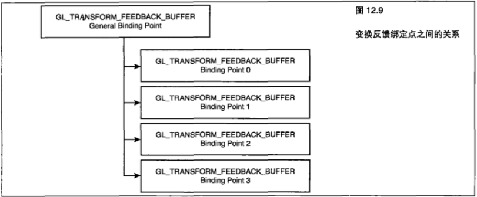

&emsp;&emsp;我们通过调用

```C++
glBindBufferBase(GL_TRANSFORM_FEEDBACK_BUFFER, index, buffer);
```

将一个缓冲区绑定到任意索引绑定点。

&emsp;&emsp;和前面一样, `GL_TRANSFORM_FEEDBACK_BUFFER` 告诉 `OpenGL` 我们要绑定一个缓冲区对象来存储变换反馈的结果,而最后一个参数buffer则是将要绑定到的缓冲区对象的名称。附加参数 `index` 是 `GL_TRANSFORM_FEEDBACK_BUFFER` 绑定点的索引。有一件重要的事情需要注意,就是无法直接对任何由 `glBindBufferBase` 通过类似 `glBufferData` 或 `glCopyBuffer` 这样的函数提供的额外绑定点直接进行寻址。

&emsp;&emsp;但是，当调用 `glBindBufferBase` 时，它实际上会将这个缓冲区绑定到索引绑定点和通用绑定点。这样,如果在调用 `glBindBufferBase` 之后就访问通用绑定点,我们可以使用额外的绑定点在缓冲区中分配空间。 

&emsp;&emsp;`glBindBufferBase` 还有一个稍为高级一些的版本,即 `glBindBufferRange` ,其原型为:

```C++
void glBindBufferRange(GLenum target, GLuint index, GLuint buffer, GLintptr offset,GLsizeiptr size);
```

&emsp;&emsp;尽管 `glBindBuffer` 和 `glBindBufferBase` 只能将整个缓冲区同时绑定到一个绑定点，但是 `glBindBufferRange` 函数则允许我们将一个缓冲区的一部分绑定到一个索引绑定点。前 `3` 个参数( `target` 、 `index` 和 `buffer` )与 `glBindBufferBase` 中的相应参数含义相同。 `offset` 和 `size` 参数分别用来指定缓冲区中我们想要进行绑定部分的开始位置和长度。我们可以同时将同一个缓冲区中的不同部分绑定到几个不同的索引绑定点。这样就使我们可以在 `GL_SEPARATE_ATTRIBS` 模式中使用变换反馈将输出顶点的每个属性写入单个缓冲区的独立部分中。如果应用程序将所有属性包装到单个顶点缓冲区中,并使用 `glVertexAttribPointer` 指定缓冲区中的非 `0` 偏置,就使我们能够将变换反馈的输出与顶点着色器的输入进行匹配了。

&emsp;&emsp;如果我们指定所有属性都应该通过在 `glTransformFeedbackVaryings` 中使用 `GL_INTERLEAVEDATTRIBS` 参数记录到单个变换反馈缓冲区中,那么这些数据将会被写入绑定到第一个 `GL_TRANSFORM_FEEDBACK_BUFFER` 绑定点( `index` 为 `0` )的缓冲区中。但是,如果我们指定变换反馈模式为 `GL_SEPARATE_ATTRIBS` ,那么顶点着色器的每个输出都将被记录到自己的独立缓冲区(或者是缓冲区中的一个部分,如果我们使用 `glBindBufferRange` 的话)中。在这种情况下,我们需要将多个缓冲区或缓冲区部分进行绑定,以将其作为变换反馈缓冲区。参数必须在 。 和“一个使用变换反馈模式能够记录到独立缓冲区中的 `varying` 变量最大数量减去 `1` 所得到的值”之间。这个限制取决于图形硬件和驱动程序,并且可以通过调用以 `GL_MAX_TRANSFORM_FEEDBACK_SEPARATE_ATTRIBS` 为参数的 `glGetIntegerv` 来查询。

&emsp;&emsp;这个限制也应用在 `glTransformFeedbackVaryings` 的 `count` 参数上。在 `GL_INTERLEAVED_ATTRIBS` 模式下,对于能够写入变换反馈缓冲区的独立 `varying` 变量的数量并没有上限,但是对于能够写入一个缓冲区的分量数量则存在一个最大值。举例来说，在使用变换反馈时，可以写入的 `vec3s` 要比可以写入的 `vec4s` 更多。这个限制还是取决于图形硬件，并且可以通过调用以 `GL_MAX_TRANSFORM_FEEDBACK_INTERLEAVED_COMPONENTS` 为参数的 `glGetIntegerv` 来查询。

&emsp;&emsp;在将另一组属性写入到另一个缓冲区中的同时，将一组输出 `varying` 变量以交叉存取的方式写入一个缓冲区是不可能的。当变换反馈激活时，输出 `varying` 变量要么都以交叉反馈的形式存储到一个缓冲区，要么进行包装后存储到几个不同的缓冲区或不同的缓冲区部分中。这样，如果我们想要使用变换反馈为后续传递生成顶点数据,那么我们就需要在计划输入顶点布局时考虑这一点。总体上说,比起通过变换反馈进行写入的方式，顶点着色器在读取顶点数据的方式上更加灵活。

&emsp;&emsp;一旦要接受变换反馈结果的缓冲区被绑定，变换反馈模式就会通过调用

```C++
void glBeginTransformFeedback(GLenum primitiveMode);
```

来激活。

&emsp;&emsp;现在,顶点无论何时通过一个顶点着色器或几何着色器,后续着色器的输出 `varying` 变量都将写入到变换反馈缓冲区。函数的 `primitiveMode` 参数告诉 `OpenGL` ,几何图形将会是什么类型的。可接受的参数有 `GL_POINTS` 、 `GL_LINES` 或 `GL_TRIANGLES` 。当调用 `glDrawArrays` 或其他 `OpenGL` 绘制函数时,基本几何类型必须与我们指定的变换反馈图元模式相匹配,或者必须有一个几何着色器输出正确的图元类型。例如,如果 `primitiveMode` 为 `GL_TRIANGLES` ,那么必须调用以 `GL_TRIANGLES` 、 `GL_TRIANGLE_STRIP或GL_TRIANGLE_FAN` 为参数的 `glDrawArrays` ,或者必须有一个生成 `GL_TRIANGLE_STRIP` 的几何着色器。变换反馈图元模式到绘制类型的映射如表 `12.1` 所示。

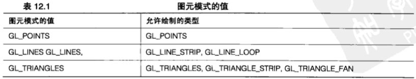

&emsp;&emsp;在变换反馈模式推出之前,或者在为变换反馈缓冲区分配的空间耗尽之前,顶点会记录到变换反馈缓冲区中。要退出变换反馈模式，可以调用

```C++
glEndTransformFeedback();
```

&emsp;&emsp;所有出现在一次对 `glBeginTransformFeedback` 和 `glEndTransformFeedback` 的调用之间的渲染都会导致数据被写入当前绑定的变换反馈缓冲区中。每次在 `glBeginTransformFeedback` 被调用时, `OpenGL` 就开始在为了变换反馈而进行绑定的缓冲区的开始位置写入数据，覆盖那里可能已经存在的旧数据。在变换反馈缓冲区激活,并且在调用 `glBeginTransformFeedback` 和 `glEndTransformFeedback` 之间禁止改变变换反馈状态时,需要多加注意。举例来说,在变换反馈模式激活时,我们不可能改变变换反馈缓冲区绑定，也不可能对任何变换反馈缓冲区重新设定大小或重新进行分配。

> 12.5.2 关闭光栅化

&emsp;&emsp;到目前为止,我们已经了解,变换反馈是一种在 `OpenGL` 进行渲染时保存顶点着色器或几何着色器中间结果的机制。但是,如果并不想实际绘制任何东西呢?如果只想使用变换反馈本身而不改变屏幕内容呢?如果我们使用顶点着色器进行除了几何图形处理以外的计算(例如物理模拟),就很可能想要这么做。我们可以通过关闭光栅化来使用变换反馈达到我们的目的。也就是说,顶点着色器和几何着色器仍然会运行,所以变换反馈也会工作,但是在这之后 `OpenGL` 管线将会被删掉,所以片段着色器根本不会运行。这样,举例来说,这种方式就比仅仅创建一个丢弃所有信息或通过 `glColorMask` 关闭颜色写入的片段着色器的效率高得多了。要关闭光栅化,实际上需要告诉 `OpenGL` ,它应该通过调用。

```C++
glEnable(GL_RASTERIZER_DISCARD);
```

来丢弃所有光栅化。

&emsp;&emsp;要重新开启光栅化，只需调用

```C++
glDisable(GL_RASTERIZER_DISCARD);
```

&emsp;&emsp;在启用 `GL_RASTERIZER_DISCARD` 时，顶点着色器和几何着色器所生成的任何东西都不会创建任何片段,而片段着色器则根本不会运行。如果关闭光栅化,并且不是用变换反馈模式,那么 `OpenGL` 管线实质上就会关闭。

> 12.5.3 使用图元查询对顶点进行计数

&emsp;&emsp;在存在一个顶点着色器,但不存在几何着色器时,顶点着色器的输出将被记录,而存储到变换反馈缓冲区的顶点数量则与发送到 `OpenGL` 的顶点数量相等,除非某个变换缓冲区中的可用空间被耗尽。如果存在一个几何着色器，那么这个着色器可能会创建或丢弃顶点，这样写入到变换反馈缓冲区的顶点数量就可能与发送到 `OpenGL` 的顶点数量不同。 `OpenGL` 能够通过查询对象跟踪写入到变换反馈缓冲区中的顶点数量。应用程序随后能够使用这些信息对产生的数据进行绘制,或者了解从变换反馈缓冲区中读回的数据量，以及是否应该保存这些数据。

&emsp;&emsp;在本章前面讲解遮挡查询的内容时，已经介绍了查询对象。前面已经说过，我们可以向 `OpenGL` 询问很多问题。生成的图元数量和实际写入到变换反馈缓冲区中的图元数量都可以进行查询。

&emsp;&emsp;和以前一样，可以调用

```C++
glGenQueries(1, sone_query);
```

&emsp;&emsp;生成一个查询对象，或者调用

```C++
glGenQueries(10, ten_queries);
```

生成几个查询对象。

&emsp;&emsp;现在已经创建了查询对象，可以通过启用相应的查询类型要求 `OpenGL` 通过进行 `GL_PRIMITIVES_GENERATED` 或 `GL_TRANSFORM_FEEDBACK_PRIMITIVES_WRITTEN` 查询在图元生成时对它们进行计数了。

&emsp;&emsp;要开始任意一种查询，可以调用

```C++
glBeginQuery(GL_PRIMITIVES_GENERATED, one_query);
```

或

```C++
glBeginQuery(GL_TRANSFORM_FEEDBACK_PRIMITIVES_WRITTEN, one_query);
```

&emsp;&emsp;在调用一次以 `GL_PRIMITIVES_GENERATED` 或 `GL_TRANSFORM_FEEDBACK_PRIMTIVES_WRITTEN` 为参数的 `glBeginQuery` 之后,  `OpenGL` 会对由顶点着色器或几何着色器产生的图元数量保持跟踪,或者对实际写入到变换反馈缓冲区的图元数量保持跟踪,直到使用

```C++
glEndQuery(GL_PRIMITIVES_GENERATED);
```

&emsp;&emsp;或

```C++
glEndQuery(GL_TRANSFORM_FEEDBACK_PRIMITIVES_WRITTEN);
```

&emsp;&emsp;停止查询为止。查询的结果可以通过调用以 `GL_QUERY_RESULT` 和查询对象的名称为参数的 `glGetQueryObjectuiv` 进行读取。和其他 `OpenGL` 查询一样，得到的结果可能不会立即可用，这是由于 `OpenGL` 的管线本质所决定的。要查询这些结果是否可用,可以调用以 `GL_QUERY_RESULT_AVAILABLE` 为参数的 `glGetQueryObjectuiv` 。更多关于查询对象的信息请参考本章前面" `12.1` 查询功能--收集 `OpenGL` 管线相关信息”部分的内容。

&emsp;&emsp;在 `GL_PRIMITIVES_GENERATED` 和 `GL_TRANSFORM_FEEDBACK_PRIMITIVES_WRITTEN` 查询之间有两处微妙的差别。首先, `GL_PRIMITIVES_GENERATED` 查询对几何着色器发出的图元进行计数而 `GL_TRANSFORM_FEEDBACK_PRIMITIVES_WRITTEN` 查询只对成功写入变换反馈缓冲区的图元进行计数。由几何着色器生成的图元数量可能比发送到 `OpenGL` 的几何图元数量更多或更少,这取决于它在做什么样的工作。通常,这两种查询的结果应该是相同的,但是如果在变换反馈缓冲区中没有足够空间的话,那么 `GL_PRIMITIVES_GENERATED` 将保持计数,而 `GL_TRANSFORM_FEEDBACK_PRIMITIVESWRITTEN` 会停止计数。

&emsp;&emsp;通过同时运行这两种查询并且对结果进行比较，可以检查应用程序所产生的所有图元是否都被捕获到了变换反馈缓冲区中。如果它们相等,那就说明所有图元都被成功写入。如果它们不同,则说明我们用来进行变换反馈的缓冲区可能太小了。

&emsp;&emsp;第二个不同点是, `GL_TRANSFORM_FEEDBACK_PRIMITIVES_WRITTEN` 只在变换反馈缓冲区活动时才有意义。这就是为什么它的名称中包含 `TRANSFORM_FEEDBACK` ,而 `GL_PRIMITIVES_GENERATED` 的名称中却不包含的原因。如果在变换反馈缓冲区不活动时运行一个 `GL_TRANSFORM_FEEDBACK_PRIMITIVES_WRITTEN` 查询,那么结果将会为 `0` 。

&emsp;&emsp;但是， `GL_PRIMITIVES_GENERATED` 查询则可以在任何时间使用，并且将得到由 `OpenGL` 生成的图元数量的可信值。我们可以使用它来查询几何着色器生成或丢弃了多少顶点。

> 12.5.4 使用图元查询的结果

&emsp;&emsp;现在我们得到了顶点着色器或几何着色器的结果,这个结果就保存在一个缓冲区中。我们还通过使用一个查询对象了解了这个缓冲区中有多少数据。现在可以使用这些结果进行更进一步的渲染了。我们应该还记得，顶点着色器或几何着色器的结果会通过变换反馈放置到一个缓冲区中。只要将这个缓冲区绑定到一个 `GL_TRANSFORM_FEEDBACK_BUFFER` 绑定点上，它就会成为一个变换反馈缓冲区。但是， `OpenGL` 中的缓冲区是通用数据块,并且可以应用于其他目的。

&emsp;&emsp;通常情况下，运行一次渲染传递在一个变换反馈缓冲区中产生这些数据后，我们会将这个缓冲区对象绑定到 `GL_ARRAY_BUFFER` 绑定点,以便它能够作为顶点缓冲区使用。如果我们使用的是一个可能产生数据总量未知的几何着色器,就需要使用一个 `GL_TRANSFORM_FEEDBACK_PRIMITIVES_WRITTEN` 查询来查出第二次传递要对多少顶点进行渲染。程序清单 `12.20` 展示了相关代码的大致内容。

```C++
// 我们一共有两个缓冲区，即buffer1和buffer2
// 首先，我们将 bufferl 作为绘制操作(GL_ARRAY_BUFFER)的数据源进行绑定
// 而 buffer2 则作为变换反馈（GL_TRANSFORM_FEEDBACK_BUFFER）的目标进行统定
glBindBuffer(GL_ARRAY_BUFFER, buffer1);
glBindBuffer(GL_TRANSFORM_FEEDBACK_BUFFFER, buffer2);
// 现在，我们需要运行一个查询来对写入到变换反馈缓冲区的顶点进行计数
glBeginQuery(GL_TRANSFORM_FEEDBACK_PRIMITIVES_WRITTEN, q);
// 好了，开始变换反馈……
glBeginTransformFeedback(GL_POINTS);
// 进行一些绘制来将数据放入变换反馈缓冲区
DrawSomePoints();
// 完成变换反馈
glEndTransformFeedback();
// 结束查询并取回结果
glEndouery(GL_TRANSFORM_FEEDBACK_PRIMITIVES_WRITTEN);
glGetQueryObjectuiv(q, GL_QUERY_RESULT, &vertices_to_render);
//现在我们将buffer2 (它刚刚作为一个变换反馈缓冲区使用)作为一个顶点缓冲区进行绑定,并从中渲染更多点
glBindBuffer(GL_ARRAY_BUFFER, buffer2);
glDrawArrays(GL_POINTS, 0, vertices_to_render);
```

> 12.5.5 变换反馈的应用实例

&emsp;&emsp;这里有两个例子,展示我们可以如何使用一个变换反馈缓冲区中的数据。但是请记住, `OpenGL` 是非常灵活的,而变换缓冲区可以有无数潜在的应用方式。

&emsp;&emsp;**存储中间结果**

&emsp;&emsp;变换反馈的第一种实例用法是对中间结果进行存储。我们已经对实例渲染有所了解了。让我们来考虑一个算法，它执行一组逐个实例操作，然后要求返回每个顶点的这些结果。现在，假定我们想要使用实例渲染来渲染这个对象的很多副本。我们可以设置一个顶点着色器，它使用一些实例数组和一些常规的逐顶点属性作为其输入。必须为这个对象的每一个副本执行所有这些逐实例计算，即使它们每次都会产生同样的结果。

&emsp;&emsp;这种算法可以分成两次进行，而不是编写一个庞大的顶点着色器一次性完成所有计算。编写第一个顶点着色器来计算通用的逐实例结果,并将它们作为一组输出 `varying` 变量写入到一个变换反馈缓冲区。现在这个着色器可以为每个实例运行一次。

&emsp;&emsp;接下来,编写第二个顶点着色器,执行其余计算(这些计算对于这个对象的每个副本来说是不同的),并使用一个实例数组读取这些逐实例属性，从而将它们与来自第一个顶点着色器的中间结果进行结合。

&emsp;&emsp;现在我们有了一对着色器，可以将第一个着色器为每个实例运行一次(使用一个常规的 `glDrawArrays` 命令),然后使用第二个着色器实际渲染这个对象的每一个副本。第一个着色器(逐顶点运行的那个)应该在关闭光栅化(通过启用前面讨论过的 `GL_RASTERIZER_DISCARD` )的情况下运行。这样就能在变换反馈缓冲区中产生中间结果,而不需要实际进行任何渲染。现在,重新开启光栅化,然后使用第二个着色器,并调用一个类似 `glDrawArraysInstancedv` 这样的实例渲染函数,对这个对象的所有独立副本进行渲染。

&emsp;&emsp;**迭代或递归算法**

&emsp;&emsp;很多算法都是迭代的，其结果从一步到下一步进行循环。物理模拟是这种算法的一种主要用途，而变换反馈则是创建后续传递中重用数据的一种理想方法。因为变换反馈将数据写入缓冲区所使用的格式允许这些缓冲区以后作为顶点缓冲区进行绑定,所以在数据每次传递之间不需要进行变换或复制。所需要的只是一个简单的双重缓冲区方案。

&emsp;&emsp;粒子系统模拟是循环算法的一个好例子。在进行模拟的每一个步骤中,每个粒子都有一个位置值和一个体积值必须要进行更新。它们可能还会有一些固定不变的参数，例如质量、颜色或任何数量的其他属性。要使用变换反馈生成一个简单的粒子系统,每个粒子都应该可以表示为一个顶点,而它的属性则存储在顶点缓冲区中。一个顶点着色器可以进行构造，为系统中的粒子计算一个更新的位置值和速度值。那些在粒子系统进行迭代时保持不变的粒子参数可以存储在一个顶点缓冲区中,最好使用 `GL_STATIC_DRAW` 应用模式进行分配。那些在每次分配之间进行改变的参数应该进行双重缓冲。我们用一个缓冲区作为顶点缓冲区,同时作为参数的源,以用来对粒子系统进行渲染。第二个缓冲区作为一个变换反馈缓冲区进行绑定,并且对由顶点着色器写入其中的参数进行更新。在每次迭代之间,这两个缓冲区会进行交换。

&emsp;&emsp;当粒子系统进行渲染时,一个时间步长会被传递到顶点着色器中,它表示从上一次更新以来经过了多长时间。顶点着色器计算由于粒子的质量而作用在粒子上力(即重力)的近似值、输入速率(空气阻力),以及其他任何对应用程序来说重要的因子;综合这个时间步长中的粒子速度;然后生成一个新的位置和速度。为了将这些例子作为点进行渲染，可以使用一个以 `GL_POINTS` 为图元类型的类似于 `glDrawArrays` 这样的命令。我们可能会希望只使用变换反馈缓冲区对粒子位置进行更新，但要在每个粒子处进行一些更加复杂的绘制(例如一个球体或一艘太空船)。要做到这一点,我们可以启用 `GL_RASTERIZER_DISCARD` 在更新阶段关闭光栅化,然后使用位置数据作为第二次传递的输入,将这些点转换成更加复杂的几何图形组，在屏幕上进行渲染。

&emsp;&emsp;**集群**

&emsp;&emsp;我们将这两个例子组合起来，创建一个集群算法（`flocking algorithm`）的实现。集群算法通过更新独立于所有其他成员的个体成员属性,显示了一个庞大群组中的突发行为。这种类型的行为在自然界中经常可以看到,这样的例子包括一大群蜜蜂、一大群鸟类和一大群鱼,它们看起来都是统一地进行运动,即使这个群组的成员并不直接进行沟通。由一个个体所做出的决定只取决于它对群组中其他成员的感知力。但是,对于任何特定决定所产生的结果,在各个成员之间并没有进行任何协作。这就意味着每个群组成员的新属性可以并行计算——这对于 `GPU` 实现来说是非常理想的。

&emsp;&emsp;为了对前面提到的两个方法(存储中间结果和迭代算法)都进行演示,我们通过一对顶点着色器来实现集群算法。我们将这个群组的每个成员都表示为单个顶点。每个顶点都有一个位置值和一个速度值,它们由第一个顶点着色器进行更新。得到的结果通过变换反馈来写入到一个缓冲区。随后这个缓冲区会作为一个顶点缓冲区进行绑定，并作为第二个着色器的一个实例输入来使用。这个集群中的每个成员都是第二次绘制中的一个实例。第二个顶点着色器负责将一个网点（可能是一个鸟的模型 ）变换到在第一个顶点着色器中计算出的位置和方向。然后算法将进行迭代,再次从第一个着色器开始,并重用上一次过程中计算出的位置和速率。所有数据都不会离开图形加速卡的内存,而 `CPU` 则与这里的任何计算无关。

&emsp;&emsp;在这个例子中，我们需要的数据结构是一组 `VAO` ，用来表示每次迭代过程中的顶点数组状态，以及一组 `VBO` ，用来保存群组中成员的位置和速率，以及用来表示它们的模型的顶点数据。群组位置和速率需要进行双重缓冲,因为无法使用变换反馈来对同一个缓冲区同时进行读取和写入。同时,因为群组的每个成员(即顶点)都需要对群组中所有其他成员的当前位置和速率进行访问，所以我们将位置和速率缓冲区同时绑定到一对纹理缓冲区对象(`TBO`)上。这样,顶点缓冲区就可以随意地对 `TBO` 进行读取,来访问其他顶点的属性了。前面在第 `8` 章已经介绍了 `TBO` 。

&emsp;&emsp;图 `12.10` 所示对这个算法的过程进行了图示。

&emsp;&emsp;在(`a`)中，我们对一个偶数帧进行了更新。第一组位置和速率缓冲区作为顶点着色器的输入进行绑定，而第二组位置和速度缓冲区则作为变换反馈缓冲区进行绑定。请注意，这里我们还使用第一组位置和速率缓冲区来支持顶点着色器使用的纹理（实际上就是 `TBO` ）。

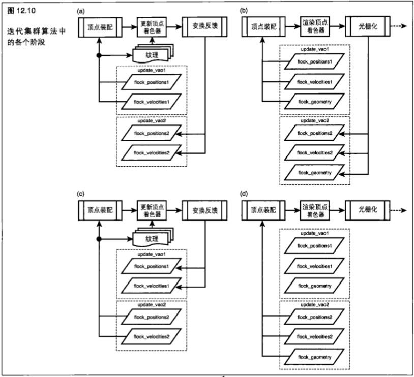

&emsp;&emsp;接下来，在(`b`)中，我们使用同一组缓冲区作为输入进行渲染，这和在更新过程中一样。我们在更新过程和渲染过程中使用同一组缓冲区作为输入,所以渲染过程对更新过程并没有任何依赖性。这就意味着 `OpenGL` 可能能够在更新过程结束前开始执行渲染过程。这一组位置和速度缓冲区现在已经进行实例化,而附加的几何图形缓冲区则用来提供顶点位置数据。

&emsp;&emsp;在(`c`)中，我们开始处理下一帧。这些缓冲区进行了交换——第二组缓冲区现在是顶点着色器的输入,而第一组缓冲区则使用变换反馈进行写入。

&emsp;&emsp;最后，在（`d`）中，我们开始渲染这个奇数帧。第二组缓冲区用作顶点着色器的输入。不过请注意， `flock_geometry` 缓冲区既是 `render_vao1` 的成员,也是 `render_vao2` 的成员，因为这两个过程中都会使用同样的数据,所以不需要有两个副本。

&emsp;&emsp;程序清单 `12.21` 列出了进行所有这些设置的代码。这些内容并不是特别复杂的,但是其中有很多重复部分,这使它变得很冗长。这个程序清单包含初始化程序块,其中部分内容出于简洁考虑而进行了省略(省略的部分在注释中用表示)。

```C++
// 创建四个VAO-即update vaol, update-vao2, render-vaol和render vao2
// 的确,我们可以使用一个数组,但是为了达到本例的目的,这样做更加清晰
glGenVertexArrays(1, supdate_vaol);
// *用同样方法创建update-vao2. render-vaol和render_vao2

// 创建缓冲区对象。稍后将对它们进行绑定和初始化
glGenBuffers(1, &flock positions1);
// *用同样方法创建flock_positions2. flock_velocities1. flock_velocities2 和 flock_geometry

// 设置VAO和缓冲区-首先是update_vaol
glBindVertexArray(update_vaol);
glBindBuffer(GL_ARRAY BUFFER, flock positionsl);
// 在这里将一些初始位置放入flock positionsl
glVertexAttribPointer(0, 3, GL_FLOAT, GL_FALSE, 0, NULL);
glEnableVertexAttribArray(0);
glBindBuffer(GL_ARRAY_BUFFER, flock_velocitiesl);
// *用0对进行初始化(例如glBufferData(.. NULL), glMapBuffer, memset)
glvertexAttribPointer(1, 3, GL_FLOAT, GL_FALSE, 0, NULL);
glEnableVertexAttribArray(1);

// 接下来是 update_vao2
// *这基本上和update-vaol相同,
// *除非我们不需要flock_positions2或flock_velocities2的初始数据
// *因为它们将在第一次处理过程中被写入.
// *但是,我们确实需要使用glBufferData (... NULL)来对它们进行分配

// 现在轮到那些渲染VAO了-首先是 render_vaol
// 我们将同样的flock-positions1和flock positions2缓冲区绑定到这个VAO上
// 但是这一次,它们是实例数组我们还将作为一个常规顶点数组进行绑定
glBindVertexArray(render_vaol);
glBindBuffer(GL_ARRAY_BUFFER, flock_positions1);
glVertexAttribPointer(0, 3, GL_FLOAT, GL_FALSE, 0, NULL);
glEnableVertexAttribArray(0);
glVertexAttribDivisor(0, 1);
glBindBuffer(GL_ARRAY_BUFFER, flock_velocities1);
glvertexAttribPointer(1, 3, GL_FLOAT, GL_FALSE, 0, NULL);
glVertexAttribDivisor(1, 1);
glEnableVertexAttribArray(1);
glBindBuffer(GL_ARRAY_BUFFER, flock_geometry);
glVertexAttribPointer(2, 3, GL_FLOAT, GL_FALSE, 0, NULL);
glEnableVertexAttribArray(2);

// 设置render_vao2
// 这看起来和设置render-vaol差不多,只不过我们使用的是flock-positions2和flock-velocities2
// 但是,请注意,我们仍然对flock-geometry进行绑定,因为它在每次迭代之间并不进行改变

// 最后来设置 TBO
glGenTextures(1, sposition_texturel);
glBindTexture(GL_TEXTURE_BUFFER, position texturel);
glBindBuffer(GL TEXTURE BUFFER, flock positionsl);
// 用同样的方法为flock_velocities1, flock_position2和flock_velocities2各创建一个缓冲区纹理
```
 
&emsp;&emsp;一旦我们完成了缓冲区的设置，就需要对着色器进行编译，然后在一个程序中将它们连接到一起。在程序进行连接之前,我们需要将顶点着色器中的属性绑定到正确的位置,以使它们与我们设置的顶点数组相匹配。

&emsp;&emsp;我们还需要告诉 `OpenGL` ,我们想要将哪些 `varying` 变量写入变换反馈缓冲区中。程序清单 `12.22` 显示了这些顶点属性和变换反馈 `varying` 变量是如何进行初始化的。

```C++
// 假定我们创建了我们的顶点着色器和片段着色器,对它们进行编译并将它们绑定到我们的程序对象上
// 首先,我们要设置更系程序中的属性
glBindAttribLocation(update_program, 0, "position");
glBindAttribLocation(update_program, 1, "velocity");
// 现在轮到渲染程序了.
// 前两个属性实际上与更新程序写入的这两个属性相同。
// 第三个属性是几何围形中顶点的位置
glBindAttribLocation(render_program, 0, "instance_position");
glBindAttribLocation(render_program, 1, "instance_velocity");
glBindAttribLocation(render_program, 2, "geometry_position");
// 现在我们来设置变换反馈 varying 变量：
static const char* tf_varyings[] = { "position_out", "velocity_out" }; glTransformFeedbackVaryings(update_program, 2, tf_varyings, GL_SEPARATE_ATTRIBS);
// 现在,所有设置都已经完成,所以我们可以继续连接我们的程序对象了
glLinkProgram(update_program);
glLinkProgram(render_program);
```

&emsp;&emsp;现在我们需要一个渲染循环来对集群位置进行更新，并绘制集群中的成员。实际上这非常简单，现在我们已经将数据封装到了 `VAO` 中。程序清单 `12.23` 列出了渲染循环。

```C++
// 将更新程序设为当前程序
glUseProgram(update_program);
// 我们使用一组缓冲区作为着色器输入，而其他缓冲区则作为变换反馈缓冲区来保存着色器输出
// 在帧进行交替时，我们将对这两个缓冲区进行交换
if (frame_index & 1)
{
    glBindBufferBase(GL_TRANSFORM_FEEDBACK_BUFFER, 0, position_bufferl);
    glBindBufferBase(GL_TRANSFORM_FEEDBACK_BUFFER, 1, velocity_bufferl);
    glBindVertexArray(update_vao2);
    glActiveTexture(GL_TEXTUREO);
    glBindTexture(GL_TEXTURE_BUFFER, position_texture2);
    glActiveTexture(GL_TEXTUREI);
    glBindTexture(GL_TEXTURE_BUFFER, velocity_texture2);
} else {
    // ***这里还是和前面相同，只是使用作为 position_buffer2 和 velocity buffer2变换反馈缓冲区
    // *** 而 update_vaol. position texturel 和 velocity_texturel 则作为输入
}

// 关闭光栅化（开启光栅化丢弃）
glEnable(GL_RASTERIZER_DISCARD);
// 开始变换反馈--记录更新位置
glBeginTransformFeedback(GL_POINTS);
// 绘制数组——为集群的每个成员绘制一个点
glDrawArrays(GL_POINTS, 0, flock_size);
// 完成变换反馈
glEndTransformFeedback(GL_POINTS);
glDisable(GL_RASTERIZER_DISCARD);
// 好了,现在我们要进行所有绘制工作了.现在我们需要重新开启光栅化
// 使用渲染程序
glUseProgram(render_program);
if (frame_index & 1)
{
    glBindVertexArray(render_vao2);
} else {
    glBindVertexArray(render_vaol);
}
// 进行一次实例绘制——每个成员都是一个实例
// 通过"update_program"更新的上一帧数据现在是render_program中的一个实例数组了
glDrawArraysInstanced(GL_TRIANGLES, 0, 50, flock_size);
frame_index++;
```

&emsp;&emsp;这些差不多就是程序端最有趣的部分了。下面我们来看一下着色器端的情况。集群算法是通过为群组的每一个成员应用一组规则，来决定向哪个方向行进。每个规则都将群组成员的当前属性和其他成员的属性视为是正在进行更新的个体所感知到的。这些规则中大部分都需要访问其他成员的位置和速率,所以 `update_program` 使用一对 `TBO` 从包含这些信息的缓冲区中进行读取。程序清单 `12.24` 展示了更新顶点着色器的开始部分。

```C++
#version 150
precision highp float;
// 这些是输入属性
in vec3 position;
in vec3 velocity;

//这些将被写入到变换反馈缓冲区
out vec3 position_out;
out vec3 velocity_out;

// 这些是作为位置和速率映射到同一个缓冲区的TBO
uniform samplerBuffer tex_position;
uniform samplerBuffer tex_velocity;

// 集群中成员的数量
uniform int flock_size;

// 在模拟中使用的参数
uniform Parameters
{
    // …* 将所有模拟参数放在这里);
}
```

&emsp;&emsp;程序的主体非常简单。我们只要读取集群中其他成员的位置和速率,轮流应用这些数据,计算出结果向量,并输出一个更新的位置和速率。程序清单 `12.25` 显示了完成这些工作的代码。

```C++
void main(void)
{
    vec3 other_position;
    vec3 other_velocity;
    vec3 accelleration = vec3(0.0);
    int i;
    
    for (i = 0; i < flock_size; i++) {
        other_position = texelFetch(tex_position, i).xyz;
        other_velocity = texelFetch(tex_velocity, i).xyz;
        accelleraton += rulel(position, velocity, other_position, other_velocity);
        accelleraton += rule2(position, velocity, other_position, other_velocity);
        
        // 诸如此类……我们可以应用我们想要的任意数量的规则
        // 要生成一个令人信康的模拟效果，3个或4个就足够了
    }
    position_out = position + velocity;
    velocity_out = velocity + acceleration / float(flock_size);
}
```

&emsp;&emsp;现在我们必须定义这些规则,使用的规则如下所示。

+ 各个成员试图避免和其他成员发生碰撞。它们需要与其他成员保持一定距离。

+ 各个成员试图与周围其他成员沿着相同方向飞行。

+ 各个成员试图保持与群组中的其他成员在一起。它们将会飞向集群的中心。

&emsp;&emsp;程序清单 `12.26` 显示了实现第一个规则的着色器代码。如果我们与其他成员的距离比预想的要近,那么只需向远离这个成员的方向移动。

```C++
vec3 rulel(vec3 my_position, vec3 my_velocity, vec3 their_position, vec3 their_velocity)
{
    vec3 d = my_position - their_position;
    if (dot(d, d) < parameters.closest_allowed_position)
        return d * parameters.rulel_weight;
    return vec3(0.0);
}
```

&emsp;&emsp;程序清单 `12.27` 显示了实现第二个规则的着色器代码。它返回一个由从一个成员到另一个成员距离的平方倒数进行加权的速度改变值。

```C++
vec3 rule2(vec3 my_position, vec3 my_velocity, vec3 their_position, vec3 their_velocity)
{
    vec3 dv = (their_velocity - my_velocity);
    return parameters.rule2_weight * dv / (dot (my_position, their_position) + 1.0)
}
```

&emsp;&emsp;将这些规则和其他我们想要实现的规则综合起来，完成程序的更新部分。现在我们需要生成第二个顶点着色器——它负责对集群进行渲染。它将这个位置和速度数据作为实例数组使用，并将一个固定的顶点集合变换到一个根据独立成员的位置和速度得出的位置值。程序清单 `12.28` 展示了这个着色器的输入。

```C++
#version 150

precision highp float;

//这些是实例数组
in vec3 instance_position;
in vec3 instance_velocity;

// 常规几何数组
in vec3 position;
```

&emsp;&emsp;我们着色器的程序体(在程序清单 `12.29` 中给出)只是为了特定实例将由 `position` 表示的网点变换到正确的方向和位置。

```C++
void main (void)
{
    // rotate_to_match是一个函数，它将一个点（位置）围绕原点进行旋转，以匹配一个方向向量(instance_velocity)
    vec3 local_position = rotate_to_match(position, instance_velocity);
    gl_Position = mvp * vec4(instance_position + local_position, 1.0);
}
```

&emsp;&emsp;好了！在这里我们并不打算介绍 `rotate_to_match` ，因为这些内容超出了本例的范围。在本书的网站中，我们可以找到一个完整的实现，以及本例的其余部分代码。当然，如果我们想要渲染一些比平面的白色粒子更加有趣的东西,那么最终的渲染顶点着色器可能会变得更加复杂。它还需要包含一些额外的逻辑,以试图保持集群成员是直立的(并且让它们停止围绕它们的轴旋转)。在这里,我们也并不打算介绍这个片段着色器，因为它和实例化或变换反馈都没什么关系。

## 12.6 裁剪并确定绘制内容

&emsp;&emsp;当我们将几何图形发送到 `OpenGL` 时,它会被顶点着色器和几何着色器从输入(对象)坐标空间变换到裁剪坐标空间。 `OpenGL` 就是在这个时候执行裁剪来决定哪些顶点落在视口内,以及哪些顶点落在视口之外。

&emsp;&emsp;要完成这项工作,  `OpenGL` 会将 `3D` 空间分成 `6` 个 “半空间” (`half space`),它们是由裁剪区的边界定义的。这些半空间是由所谓的左裁剪面、右裁剪面、上裁剪面、下裁剪面、近端裁剪面和远端裁剪面定义的。在每个顶点经过裁剪阶段时,  `OpenGL` 会计算出从这个顶点到这些平面中每一个平面有符号的距离值。这个距离的绝对值并不重要—-重要的只是它的符号。如果这个顶点到某个平面的距离是正的，那么这个顶点就位于这个平面的内部(如果站在视景体的中间并看向这个平面的话,能够看到这个顶点,而不会被平面遮挡)。如果这个距离是负的,那么这个顶点就位于这个平面的外侧。如果这个距离恰好是 `0` ,那么这个顶点就恰好位于这个平面上。现在,  `OpenGL` 只要检查一下这个顶点到这 `6` 个平面距离值的正负,就可以很快确定一个顶点是否在视景体的内部或外部了,而通过综合几个顶点的结果,就可以确定一个大块的几何图形是否可见。

&emsp;&emsp;如果单个三角形的所有顶点都位于任意单个平面的外部——也就是说，这个三角形的所有顶点到同一个平面的距离都是负的,那么这个三角形就完全在视景体之外,并且可以简单地丢弃。

&emsp;&emsp;类似地,如果一个三角形的任意一个顶点到任何一个平面的距离都不为负,那么这个三角形就完全在视景体之内，从而就是可见的。只有当一个三角形跨越一个平面时，才需要做更进一步的工作。这种情况就意味着，这个三角形是部分可见的。 `OpenGL` 的不同实现会以不同的方式处理这些情况。其中某些实现会使用一个类似`Sutherland-Hodgman` 这样的裁剪算法将这个三角形分解成几个更小的三角形。而另一些实现则会将整个三角形进行简单的光栅化,并强制丢弃最终落在视口外部的片段。

&emsp;&emsp;这 `6` 个平面在裁剪空间中组成了一个长方体形状，它看起来像是在更大的 `3D` 空间中的一个盒子。当它被变换到窗口坐标时,可能会经历一次透视变换并成为一个平截头体(`frustum`)。这就是所谓的视景体(`view frustum`)。

> 12.6.1 裁剪距离

&emsp;&emsp;除了到这 `6` 个组成视景体的标准裁剪平面的这 `6` 个距离之外,应用程序还可以使用一组额外的距离,它们可以写入顶点或几何着色器中。这些裁剪距离可以通过内建变量 `gl_ClipDistance[]` 写入顶点着色器,这个内建变量是一个浮点值数组。能够支持的裁剪距离数量取决于具体 `OpenGL` 实现。这些距离会完全按照内建裁剪距离进行解释。如果一个着色器编写者想要使用用户定义的裁剪距离，那么它们将由应用程序通过调用

```C++
glEnable(GL_CLIP_DISTANCEO + n);
```

来启用。

&emsp;&emsp;在这里， `n` 是要启用裁剪距离的索引。 `GL_CLIP_DISTANCES1` 、 `GL_CLIP_DISTANCES2` 等，一直到 `GL_CLIP_DISTANCES5` ,这些标记通常在标准 `OpenGL` 头文件中都进行了定义。但是, n的最大值是由实现定义的,并且可以通过调用以 `GLMAX_CLIP_DISTANCES` 为标记的 `glGetintegerv` 来找到。我们可以通过调用带有同样标记的 `glDisable` 来禁用这个用户定义裁剪距离。如果一个特定索引中的用户定义裁剪距离没有被启用，那么在这个索引中写入到 `gl_Clip_Distance[]` 的值就会被忽略。

&emsp;&emsp;和内建裁剪平面一样，写入到 `gl_Clip_Distance[]` 数组的距离标记也用来确定一个顶点是否在用户定义的裁剪区域的内部或外部。如果一个三角形的每个顶点的所有这些距离的符号都为负，那么这个三角形就会被裁剪掉。如果这个三角形确定是部分可见的,那么这个裁剪距离就会在这个三角形上进行线性插值,并确定每个像素的可视性。这样，渲染结果将是对逐个顶点距离函数的线性近似，由顶点着色器进行估算。这样就允许一个顶点着色器对一个任意的平面集合进行几何图形裁剪了（一个点到一个平面的距离可以通过一个简单的点乘运算来得到）。

&emsp;&emsp;`glClip_Distance[]` 数组也可以作为片段着色器的一个输入使用。在 `gl_Clip_Distance[]` 的任何元素中,为负值的片段都会被裁剪掉,永远不会到达片段着色器。但是,任何在 `gl_Clip_Distance[]` 中只有正值的片段都会被传递到片段着色器，这样这个值就会被读取，并且可以被这个着色器用来达到任何目的。这项功能的一个应用范例,就是通过减少一个片段中决定裁剪距离的 `alpha` 值并使其接近于 `0` ,来使这个片段逐渐消失。这样就可以使被顶点着色器用一个平面来进行裁剪的大块图元逐渐消失,或者由片段着色器进行抗锯齿而不是生成一个生硬的裁剪边缘。请注意,如果组成一个图元(点、线或三角形)的所有顶点都被同一个平面裁剪的话，那么整个图元就会被消除，这一点非常重要。

&emsp;&emsp;这样做看起来很有道理，并且对于常规多边形网格来说,其行为也是符合预期的。但是,在使用点和线时,就要小心了。在使用点的情况下,我们可以通过将参数设置为一个大于 `1.0` 的值,用一个覆盖多个像素的单个顶点渲染一个点。当 `gl_PointSize` 很大时，就会围绕这个顶点渲染一个很大的点。这就意味着,如果有一个很大的点缓慢地向屏幕的边缘移动,并且最终出离这个边缘,那么在这个点的中心出离视景体,而表示这个点的顶点被裁减掉时,这个点就会突然消失,类似地, `OpenGL` 也可以渲染很粗的线。如果要绘制一条线的两个顶点都在裁剪平面外部,但是某些其他部分应该可见,那么在这种情况下不会进行任何绘制。如果我们对此不多加小心的话,就可能出现奇怪的不自然痕迹。

&emsp;&emsp;左裁剪面、右裁剪面、上裁剪面和下裁剪面在现实世界中都有对应元素——也就是我们的视野边界。在现实中，视野并不是严格的矩形。它更像一个边界模糊的椭圆形。但是在实践中，视口的边界（例如显示器的边缘)定义了一个硬性的限制。类似地,近端裁剪面也大致与眼睛平面相对应。任何位于近端裁剪面后面的东西实际上是位于我们后面的,这样我们就无法看到它了,但是在真实世界中却没有相应的等价物。那么远端裁剪面又如何呢?在现实世界中根本不存在远端裁剪面的等价物。光线在没有遇到遮挡的情况下可以传播到无限远处。那么为什么还需要一个远端裁剪面呢？ `OpenGL` 用一个位于 `0` 到 `1` 之间有限大小的数字来表示每个片段的深度。一个深度值为 `0` 的片段会与近端裁剪面相交(如果是真实世界的话，它会进入观察者的眼睛里面),而一个深度值为1的片段则位于可以表示的最大深度,但并不是无限远的。如果要消除远端裁剪平面，从而绘制位于任何距离的物体，就需要在深度缓冲区中存储任意大的数字而这是不可能的。为了克服这个问题, `OpenGL` 可以选择关闭近端裁剪面和远端裁剪面的裁剪,代之以只生成 `0` 到 `1` 之间的深度值。这就意味着，任何突出到近端裁剪面之后或远端裁剪面之外的几何图形实际上都会被投影到相应的裁剪面上。

&emsp;&emsp;要开启深度截取（同时关闭在近端裁剪面和远端裁剪面上的裁剪），调用

```C++
glEnable(GL_DEPTH_CLAMP);
```

&emsp;&emsp;而要关闭深度截取,则需要调用

```C++
glDisable(GL_DEPTH_CLAMP);
```

&emsp;&emsp;当然,这些只会影响 `OpenGL` 的内建近端裁剪面和远端裁剪面的裁剪计算。如果需要的话,我们仍然可以在我们的顶点着色器中使用一个用户定义的裁剪距离,来模拟一个深度值大于 `1` 的深度平面。

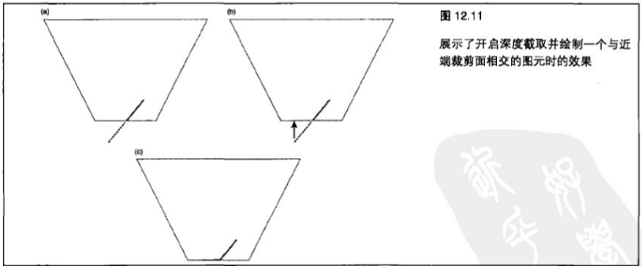

&emsp;&emsp;在两个维度中进行演示会直观得多，所以在图 `12.11 (a)` 中显示了一个视景体，就好像我们直接看向它一样。图中的黑线表示会被近端裁剪面裁剪的图元,而虚线则表示图元中被裁剪掉的部分。当深度截取启用时，并不会对图元进行裁剪，而是将位于 `0` 到 `1` 范围之外的深度值截取到这个范围之内，这样就有效地将这个图元投影到了近端裁剪面(或者是远端裁剪面,如果图元会被它裁剪的话)。

&emsp;&emsp;图 `12.11 (b)` 所示显示了这种投影。实际得到的渲染结果如图 `12.11 (c)` 所示。图中的黑线代表最终被写入到深度缓冲区的值。图 `12.12` 所示展示了这些效果在一个实际应用程序中是如何体现的。

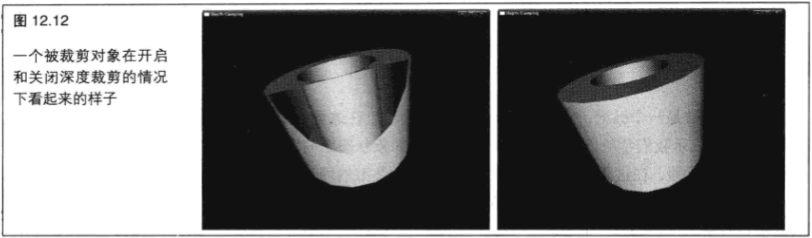

&emsp;&emsp;在图 `12.12` 左侧的图片中,几何图形与观察者的距离如此之近,它的一部分已经被近端裁剪面进行裁剪了。结果是,这个多边形应该在近端裁剪面后面的部分就没有被绘制,这样就在模型上造成了一个大洞。我们可以通过这个大洞直接看到模型的另一面,而这个图像则看起来非常不对劲。在图 `12.12` 右侧的图片中则开启了深度截取。正如我们所看到的,在左侧图中丢失的几何图形又回来了,并且填充了对象中出现的大洞。这时在深度缓冲区中的值在技术上说是不正确的,但是这并没有导致视觉效果的异常,并且得到的画面比起左侧图像来说要好得多。

## 12.7 在 OpenGL 开始绘制时同步

&emsp;&emsp;在一个高级应用程序中， `OpenGL` 的操作顺序和系统的管线本质可能会非常重要。这方面的例子包括那些包含多个环境和多个线程的应用程序，或者那些在 `OpenGL` 和类似 `OpenCL` 这样的其他 `API` 之间共享数据的应用程序。在某些情况下,确定发送到 `OpenGL` 的命令是否已经完成,以及这些命令的结果是否已经准备就绪，可能是非常必要的。 `OpenGL` 包含两个命令，它们会强制开始或强制结束到目前为止已经发出命令的处理过程。它们分别是

```C++
glFlush();
```

和

```C++
glFinish();
```

&emsp;&emsp;这两个命令有着微妙的区别。第一个命令 `glFlush` 保证到目前为止发出的任何命令至少会放入 `OpenGL` 管线的始端，并且最终会被执行。而另一方面， `glFinish` 则实际上是保证所有发出的命令都被完整执行,而 `OpenGL` 管线则是空的。问题在于,  `glFlush` 并不会告诉我们任何关于这些已发出命令执行状态的信息--我们只知道它们最终会被执行，而 `glFinish` 则保证所有 `OpenGL` 命令都被执行之后,它将清空 `OpenGL` 管线，导致泡沫，降低性能，有时甚至是极大地降低性能。

&emsp;&emsp;有时候，了解到某些时刻为止 `OpenGL` 是不是完成了命令的执行可能会非常重要。例如，当我们在两个环境之间,或者在 `OpenGL` 和 `OpenCL` 之间共享数据时,这一点就非常重要了。这种类型的同步是由所谓的同步对象（`sync object`）来进行管理的。和其他 `OpenGL` 对象一样，它们必须在使用之前先进行创建，并且在使用完并不再需要之后进行销毁。同步对象有两种可能的状态，即标记状态和未标记状态。它们在一开始时是未标记状态，而当某些特定事件发生时，它们会转换成标记状态。由什么事件来触发它们从未标记状态到标记状态的转变则取决于它们的类型。我们感兴趣的同步对象类型叫做围栏同步( `fence sync`),可以通过调用

```C++
GLsync glFencesync(GL_SYNC_GPU_COMMANDS_COMPLETE, 0);
```

&emsp;&emsp;来创建。

&emsp;&emsp;第一个参数是一个标记,指定我们将要等待的事件。在这里, `GL_SYNC_GPU_COMMANDS_COMPLETE` 表示我们希望 `GPU` 在设置标记的同步对象状态之前完成管线中所有命令的处理。第二个参数是一个标志字段,在这里为 `0` ,这是因为没有与这种类型的同步对象相关的标记。 `glFenceSync` 函数返回一个新的 `GLsync` 对象。在围栏同步创建之后,它马上(以未标记状态)进入OpenGL管线,并与所有其他命令一起进行处理,而不会使 `OpenGL` 产生延迟,也不会消耗大量资源。当它到达管线终点时,,会像其他命令一样“执行”,而这样就会将它的状态设为标记状态。由于 `OpenGL` 的排序特性,我们由此可知,任何在 `glFenceSync` 调用之前发出的 `OpenGL` 命令都已经完成,即使在 `glFenceSync` 之后发出的命令可能还没有达到管线终点。

&emsp;&emsp;一旦同步对象被创建(并且由此进入 `OpenGL` 管线),就可以对这些状态进行查询,以弄清它是否已经到达了管线的终点,并且可以要求 `OpenGL` 等待它变成标记状态后再返回应用程序。

&emsp;&emsp;要确定同步对象是否已经变成标记状态,可以调用

```C++
glGetsynciv(sync, GL_SYNC_STATUS, sizeof (GLint), NULL, &result);
```

&emsp;&emsp;当 `glGetSynciv` 返回时,如果同步对象是在标记状态下,那么结果(是一个 `GLint` )将包含 `GL_SIGNALED`,否则将包含 `GL_UNSIGNALED` ,这样,应用程序就可以检验同步对象的状态,并可能中显示的代码。利用这些信息在 `GPU` 忙于处理以前的命令时做一些有用的工作。举例来说,让我们考虑程序清单 `12.30` 中显示的代码。

```C++
GLint result = GL_UNSIGNALED;
glGetSynciv(sync, GL_SYNC_STATUS, sizeof(GLint), NULL, &result);
while (result != GL_SIGNALED)
{
    DoSomeUsefulWork();
    glGetSynciv(sync, GL_SYNC_STATUS, sizeof(GLint), NULL, &result);
}
```

&emsp;&emsp;这段代码是循环的，它在每次迭代过程中完成少量的有用工作，直到同步对象变为标记状态。如果这个应用程序要在每一帧开始时创建一个同步对象,那么这个应用程序可以等待来自两个帧之前的同步对象,并且根据 `GPU` 处理来自那一帧的命令所需的时间来完成相应的工作量。这样,应用程序就可以在 `CPU` 完成的工作量(例如混合的声音效果的数量,或者进行的物理模拟迭代次数)和 `GPU` 的速度之间进行平衡了。

&emsp;&emsp;要让 `OpenGL` 实际地等待一个同步对象变成标记状态(并且由此在同步完成前等待管线中的命令)，我们可以使用两个函数：

```C++
glClientWaitSync(sync, GL_SYNC_FLUSH_COMMANDS_BIT, timeout):
```

&emsp;&emsp;或

```C++
glWaitSync(sync, 0, GL_TIMEOUT_IGNORED);
```

&emsp;&emsp;这两个函数的第一个参数都是由 `glFenceSync` 返回的同步对象的名称。而这两个函数的第二个参数和第 `3` 个函数的名称都相同,但是必须进行不同的设置。

&emsp;&emsp;对于 `glClientWaitSync` 来说,第二个参数是一个位段,它指定函数的附加行为。 `GL_SYNC_FLUSHCOMMANDS_BIT` 告诉 `glClientWaitSync` 确保同步对象在开始等待它变成标记状态之前已经进入管线。如果没有这个位,就有可能会出现 `OpenGL` 等待一个还没有发送到管线中的同步对象的情况,最终会导致应用程序永远等待并挂起。设置这个位是个好主意,除非我们有充分的理由不这样做。第 `3` 个参数是一个需要等待的超时值,以纳秒为单位。如果同步对象在这些时间内没有变成标记状态,那么将返回一个状态代码来对此进行标记。

&emsp;&emsp;`glClientWaitSync` 可以返回 `4` 个可能的状态代码。表 `12.2` 对此进行了总结。

&emsp;&emsp;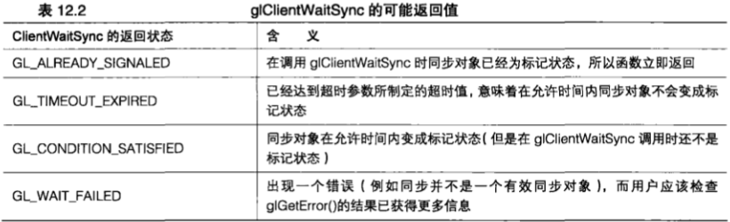

&emsp;&emsp;关于超时值,还有两件事需要注意。首先,当度量单位为纳秒时,在 `OpenGL` 中就没有精度要求了。如果我们指定想要等待一纳秒,那么 `OpenGL` 可能会将这个值舍入到下一毫秒或更长时间之后。第二,我们指定一个大小为0的超时值,如果在调用时同步对象为标记状态,那么 `glClientWaitSync` 将会返回 `GLALREADY_SIGNALED` ,否则将会返回 `GL_TIMEOUT_EXPIRED` 。它不会返回 `GL_CONDITION_SATISFIED` 。

&emsp;&emsp;对于 `glWaitSync` 来说,这个行为稍有不同。实际上应用程序不会等待同步对象变为标记状态,只有 `GPU` 会等待。这样, `glWaitSync` 将会立即返回应用程序。这样就会使第二个参数和第 `3` 个参数变得有些不相关了。因为应用程序并不等待函数返回,所以就没有挂起的危险,而且这样就不需要 `GL_SYNC_FLUSH_COMMANDS_BIT` 了,并且如果进行指定的话,实际上会导致一个错误。实际上超时也是与实现相关的,并且会明确指定特定超时值 `GL_TIMEOUT_IGNORED` 。如果有兴趣的话,我们还可以通过调用以 `GL_MAX_SERVER_WAIT_TIMEOUT` 为参数的 `glGetinteger64v` 找出我们的实现所使用的超时值。

&emsp;&emsp;读者可能会疑惑, "为什么要求 `GPU` 等待一个同步对象到达管线的终点? ”毕竟,同步对象在到达管线终点时将变为标记状态,这样,如果我们等待它到达管线终点的话,那么它当然将是标记状态的。这样的话, `glWaitSync` 不是没有做任何事吗?如果我们仅仅考虑只使用单个 `OpenGL` 环境而不使用其他API的简单应用程序,这样说是对的。但是,当我们使用多个 `OpenGL` 环境时,同步对象的强大之处就显现出来了。同步对象可以在 `OpenGL` 环境之间共享,也可以在诸如 `OpenGL` 这样的兼容API之间共享。这就是说,通过在一个环境中调用 `glFenceSync` 来创建的同步对象,可以在另一个环境中通过调用 `glWaitSync` (或者 `glClientWaitSync` )进行等待。

&emsp;&emsp;考虑下面这种情况。我们可以要求一个 `OpenGL` 环境来推迟某些渲染，直到其他环境完成某些操作为止,这样就使两个环境之间可以进行同步了。一个应用程序可以有两个线程和两个环境(还可以更多,如果我们想要的话),如果我们在每个环境中创建一个同步对象,然后在每个环境中使用任意 `glClientWaitSync` 来等待来自其他环境的同步对象，当所有函数都返回时，所有这些环境都会与另一个同步。结合由操作系统提供的线程同步图元（例如信号量（ `emaphore` ）），我们可以让多个窗口的渲染保持同步。

&emsp;&emsp;在两个环境之间进行共享的一个缓冲区就是这类应用的一个示例。第一个环境使用变换反馈写入缓冲区,而第二个环境则要对变换反馈的结果进行绘制。第一个环境将使用变换反馈模式进行绘制。在调用 `glEndTransformFeedback` 之后,它会立即调用 `glFenceSync` 。现在,应用程序会将第二个环境设为当前环境,并调用 `glWaitSync` 等待同步对象变成标记状态。然后,它可以向 `OpenGL` 发出更多命令(在新的环境中)，而驱动程序将对它们进行排序，做好执行准备。

&emsp;&emsp;只有当 `GPU` 在第一个环境中完成了向变换反馈缓冲区记录数据的工作时,它才会在第二个环境中使用这些数据对这些命令进行处理。

&emsp;&emsp;在 `OpenGL` 这样的API中,还有一些扩展和其他功能,允许对缓冲区进行同步写入。我们可以使用 `glWaitSync` 来要求一个GPU进行等待，直到一个缓冲区中的数据通过在生成这些数据的环境中创建一个同步对象,然后等待这个同步对象在将要使用这些数据的环境中变成标记状态,从而变得有效。

&emsp;&emsp;同步对象只能从未标记状态变换到标记状态,并不存在将一个同步对象从标记状态变换到未标记状态的机制,即使是手动也不可以。这是因为对一个同步对象进行手动变换可能会导致竞争条件，并且可能使应用程序挂起。

&emsp;&emsp;考虑一个同步对象被创建,到达管线终点,并且转换成标记状态,然后应用程序再将它设置回未标记状态的情况。如果另一个线程试图等待这个同步对象,但是却在应用程序已经将同步对象设置回未标记状态之后才开始等待的话，那么它将一直等待。这样,每个同步对象代表一个一次性事件，而每一次需要进行同步时,必须通过调用 `glFenceSync` 创建一个新同步对象。虽然在使用完对象时对它们进行删除这样的清除工作总是非常重要的,但对于同步对象来说尤其重要,因为我们可能会在每一帧创建很多新的对象。为了删除同步对象，可以调用

```C++
glDeleteSync(sync);
```

&emsp;&emsp;这样就删除了同步对象。这种情况可能不会立即发生；任何等待同步对象变成标记状态的线程在各自的超时时间都仍将继续等待,而一旦没有任何线程等待这个对象的话,这个对象实际上将被删除。这样,调用 `glWaitSync` ,然后再调用 `glDeleteSync` 就是完全合法的,即使同步对象仍然在 `OpenGL` 管线中。

## 12.8 小结

&emsp;&emsp;在本章,我们学习了如何管理大量顶点和其他数据,控制 `OpenGL` 如何访问这些数据,以及获取 `OpenGL` 使用这些数据的信息。我们了解了如何存储算法在一次执行过程中生成的数据,并在另一次执行过程中对它进行重用。我们已经有了对多个环境进行同步的工具,所以由一个环境产生的数据可以被其他环境使用。我们了解了绘制一组几何图形大量副本的方法,也学习了如何为。 `OpenGL` 提供数据,以供这些副本中的每一个使用。我们还知道了如何对 `OpenGL` 管线的操作进行计时,这就使我们能够对应用程序进行怎样的渲染做出明智的决定,以提高性能表现。
